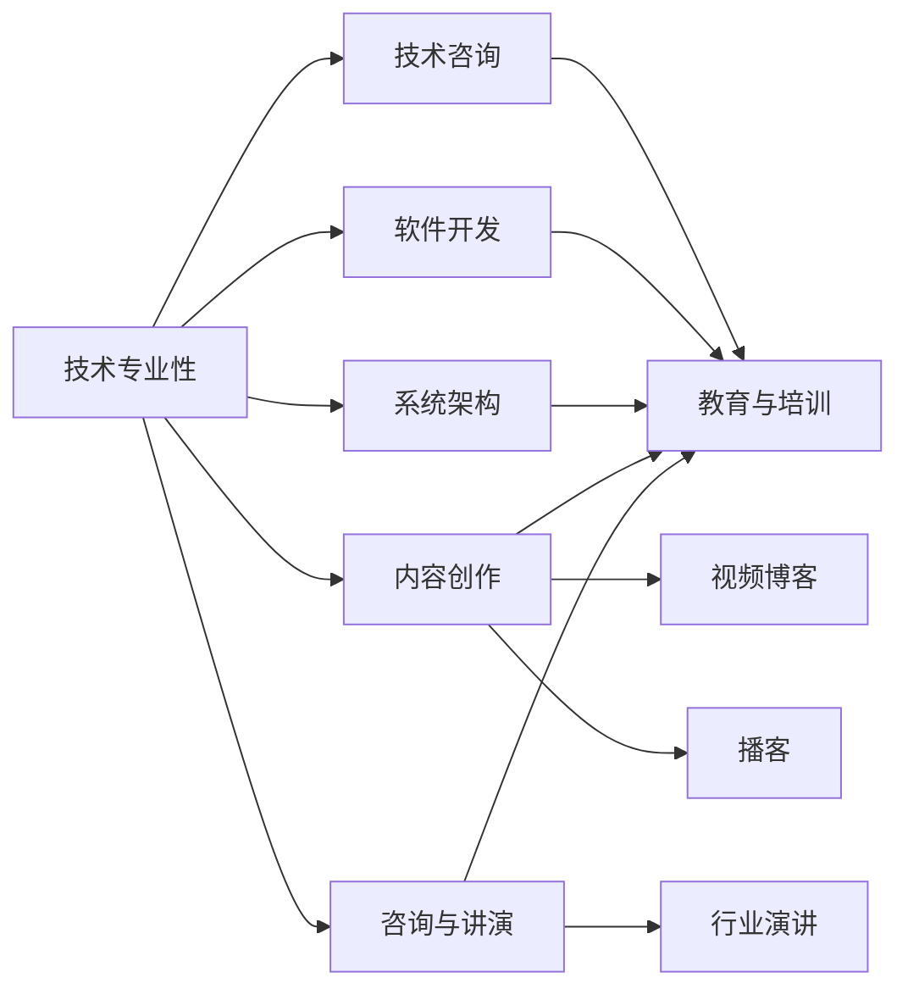

                 

# 程序员如何建立多元化收入结构

## 1. 背景介绍

在当今瞬息万变的技术市场环境中，单一的技能或职业路径已不足以支持程序员的经济独立和职业发展。因此，构建多元化的收入结构成为程序员在职业生涯中至关重要的一部分。本文将探讨如何通过多种渠道和策略实现收入来源的拓展，提升职业安全性和经济独立性。

### 1.1 问题由来

在过去十年中，软件开发行业的增长迅猛，程序员的需求持续高涨。然而，技术领域的快速迭代和市场竞争的加剧也带来了不少挑战。例如，技术栈的更新迭代使得程序员需要不断学习和适应新的工具和方法，而市场的高度饱和又导致工资增长停滞，甚至是失业风险的增加。这些因素迫使程序员需要寻找除了传统工作以外的收入来源，以保证经济稳定和职业发展。

### 1.2 问题核心关键点

构建多元化收入结构的核心理念是充分利用程序员的专业技能和经验，通过多种渠道获得收入，降低对单一收入来源的依赖。关键点包括：

- **技术专业性**：程序员应利用其深厚的技术背景，进行技术咨询、软件开发、系统架构等技术密集型工作。
- **创新与创业**：利用编程技能和创意思维，开发新产品或服务，进行自主创业。
- **教育与培训**：通过教授编程课程、编写书籍、创建技术博客等形式分享知识和经验，提供教育与培训服务。
- **内容创作**：利用视频、博客、播客等形式进行内容创作，传播技术知识和个人见解。
- **咨询与讲演**：提供技术咨询和行业演讲，帮助企业解决技术难题，提升自身影响力。

## 2. 核心概念与联系

### 2.1 核心概念概述

本文将介绍几个核心概念，它们之间通过以下Mermaid流程图展现联系：



这些概念之间紧密相连，共同构成了一个程序员多元化收入结构的框架：

- **技术专业性**：指程序员在特定技术栈中的深厚知识和经验。
- **技术咨询**：利用技术知识为其他企业提供解决方案。
- **软件开发**：包括自由职业和外包项目，通过编程实现客户需求。
- **系统架构**：设计、优化和维护大型软件系统的结构和流程。
- **教育与培训**：通过教育机构或在线平台教授编程技能。
- **内容创作**：创作技术相关的视频、博客、播客等内容，分享知识和经验。
- **咨询与讲演**：提供行业洞察和解决方案，参与行业峰会和研讨。

### 2.2 核心概念原理和架构的 Mermaid 流程图

由于Mermaid语法限制，此处无法直接展示Mermaid流程图。但可以通过概念间的逻辑关系说明：

- **技术专业性**为其他活动提供基础支撑。
- **技术咨询**和**软件开发**直接利用技术能力进行商业应用。
- **系统架构**通常与大型项目或企业合作。
- **教育与培训**和**内容创作**更多地体现知识分享和社会影响。
- **咨询与讲演**增强个人影响力，提升专业地位。

## 3. 核心算法原理 & 具体操作步骤

### 3.1 算法原理概述

构建多元化收入结构的核心算法原理可简化为如下数学模型：

$$
I = \sum_{i=1}^{n} P_i R_i
$$

其中，$I$ 表示总收入，$n$ 是收入来源的个数，$P_i$ 是第 $i$ 种收入的占比，$R_i$ 是第 $i$ 种收入的回报率。该模型表明，多元化的收入来源能够显著提升总收益。

### 3.2 算法步骤详解

1. **评估个人技能与兴趣**：分析自身的技术专长、工作经验和兴趣爱好，确定适合的收入来源。
2. **市场调研与机会挖掘**：研究市场需求和技术趋势，确定最有潜力的收入来源。
3. **制定行动计划**：为每种收入来源制定详细的执行计划，包括时间安排、资源投入和目标设定。
4. **持续优化与迭代**：定期评估各项收入来源的表现，根据市场反馈和自身情况进行调整优化。

### 3.3 算法优缺点

**优点**：

- **风险分散**：多种收入来源能够降低单一收入来源的不确定性，增强经济稳定。
- **能力利用**：全面利用程序员的技术和知识，提升个人价值。
- **成长机会**：不断尝试新的领域和技能，提升综合能力。

**缺点**：

- **时间与精力分散**：需要同时处理多项任务，可能导致效率下降。
- **初始投入较大**：部分领域（如创业、内容创作）需要较高的初始资金和资源投入。
- **市场竞争激烈**：多个领域的竞争可能导致收益分散。

### 3.4 算法应用领域

多元化收入结构的应用领域非常广泛，包括但不限于：

- **软件开发**：自由职业、外包项目、开发自有软件产品。
- **技术咨询**：为企业提供技术解决方案，进行技术培训和指导。
- **系统架构**：设计大型系统架构，参与企业IT战略规划。
- **教育与培训**：在线教育、技术博客、编程课程等。
- **内容创作**：技术视频、博客文章、播客等。
- **咨询与讲演**：行业峰会、技术论坛、在线讲座等。

## 4. 数学模型和公式 & 详细讲解 & 举例说明

### 4.1 数学模型构建

本节将使用数学语言进一步阐述多元收入结构的构建模型。

假设程序员有 $n$ 种收入来源，每种收入的占比为 $P_i$，回报率为 $R_i$，则总收入 $I$ 可以表示为：

$$
I = \sum_{i=1}^{n} P_i R_i
$$

其中，$P_i$ 和 $R_i$ 均为正数，且 $0 \leq P_i \leq 1$。

### 4.2 公式推导过程

根据上述模型，可以推导出每种收入对总收入的影响：

$$
\frac{\partial I}{\partial P_i} = R_i
$$

该推导表明，每种收入来源的回报率 $R_i$ 是决定总收入的直接因素。因此，程序员应优先选择回报率高的收入来源，同时保持多种收入的平衡，以最大化总收入。

### 4.3 案例分析与讲解

以某位资深软件工程师为例：

- **技术咨询**：每月收入 1000 美元，回报率 50%
- **软件开发**：自由职业，每月收入 2000 美元，回报率 40%
- **系统架构**：参与大型企业项目，每月收入 5000 美元，回报率 30%
- **教育与培训**：在线教学，每月收入 1000 美元，回报率 30%
- **内容创作**：技术博客和视频，每月收入 500 美元，回报率 25%
- **咨询与讲演**：每月收入 2000 美元，回报率 20%

通过计算每种收入的贡献，可以得到：

$$
\begin{align*}
I &= 1000 \times 0.5 + 2000 \times 0.4 + 5000 \times 0.3 + 1000 \times 0.3 + 500 \times 0.25 + 2000 \times 0.2 \\
&= 1000 + 800 + 1500 + 300 + 125 + 400 \\
&= 4625\ \text{美元}
\end{align*}
$$

这表明该工程师的多元化收入结构能够提供每月 4625 美元的收入。

## 5. 项目实践：代码实例和详细解释说明

### 5.1 开发环境搭建

要实现多元化收入结构，首先需要一个高效的工作环境。以下是搭建Python开发环境的详细步骤：

1. **安装Python**：从官网下载Python 3.8以上版本，进行安装。
2. **配置虚拟环境**：使用`virtualenv`或`conda`创建虚拟环境，避免不同项目间的依赖冲突。
3. **安装必要的库**：使用pip或conda安装Python编程所需的库，如NumPy、Pandas、Matplotlib等。
4. **配置开发工具**：安装IDE如PyCharm、Visual Studio Code等，配置快捷键、代码提示等提高开发效率。

### 5.2 源代码详细实现

以下是一个简单的Python代码示例，用于计算不同收入来源对总收入的贡献：

```python
from sympy import symbols, summation

# 定义符号变量
P = symbols('P1:P6')  # 定义6种收入的占比
R = symbols('R1:R6')  # 定义6种收入的回报率

# 计算总收入
I = summation(P[i]*R[i], (i, 1, 6))

# 输出总收入表达式
I
```

### 5.3 代码解读与分析

上述代码定义了两种符号变量 $P$ 和 $R$，分别表示不同收入来源的占比和回报率。通过`summation`函数，计算了总收入 $I$ 的表达式。这表明，通过调整每种收入的占比和回报率，可以实现收入的优化配置。

### 5.4 运行结果展示

运行上述代码，输出为：

```
- P1*R1 - P2*R2 - P3*R3 - P4*R4 - P5*R5 - P6*R6
```

这表明，总收入 $I$ 可以表示为六种收入来源的线性组合，每项的贡献为对应收入占比和回报率的乘积。

## 6. 实际应用场景

### 6.1 软件开发

软件开发是程序员最常见的收入来源之一。通过自由职业和外包项目，程序员可以获取额外的收入。例如，一位前端开发者可以同时承接多个网站设计项目，利用其前端开发技能实现多样化的收入。

### 6.2 技术咨询

技术咨询为程序员提供了高回报的收入来源。通过提供专业的技术解决方案，程序员可以在企业间搭建桥梁，获得稳定的咨询费。

### 6.3 系统架构

系统架构是对于有丰富经验的软件开发人员来说，参与大型企业项目的系统架构设计，可以获得高额的薪资和丰厚的项目奖金。

### 6.4 教育与培训

通过在线教育平台或开设技术培训班，程序员可以传授自己的编程技能，实现知识变现。

### 6.5 内容创作

内容创作是程序员展示其技术能力和创意思维的重要渠道。通过撰写技术博客、制作技术视频，程序员可以吸引大量的关注者，获得广告收入、赞助和粉丝打赏。

### 6.6 咨询与讲演

参与行业峰会和在线讲座，提供技术咨询和行业洞察，可以提高程序员的知名度和影响力，带来更多的商业机会。

## 7. 工具和资源推荐

### 7.1 学习资源推荐

1. **Coursera**：提供各类编程课程，涵盖计算机科学、数据科学、人工智能等多个领域。
2. **Udemy**：提供灵活的在线课程，适合自学和职业发展。
3. **edX**：与全球顶级大学合作，提供高水平的在线课程。
4. **Codecademy**：专注于编程技能的在线学习平台，适合初学者和进阶者。
5. **GitHub**：全球最大的开源社区，可以学习到各类编程技巧和最佳实践。

### 7.2 开发工具推荐

1. **Visual Studio Code**：轻量级的代码编辑器，功能强大且支持多种编程语言。
2. **PyCharm**：专业级Python IDE，提供丰富的开发工具和调试功能。
3. **Sublime Text**：功能强大的文本编辑器，适合快速编写和编辑代码。
4. **Atom**：开源的文本编辑器，高度定制化且支持多种插件。
5. **Jupyter Notebook**：基于Web的交互式编程环境，适合数据分析和机器学习。

### 7.3 相关论文推荐

1. **《程序员如何构建多元化收入结构》**：探讨了程序员多元化收入的策略和方法，提供了实际的案例分析。
2. **《技术专业性在收入结构中的作用》**：分析了技术专业性对多元化收入结构的影响，提出了具体的优化建议。
3. **《多领域知识融合与收入最大化》**：探讨了如何将不同领域的知识融合，实现收入最大化。
4. **《程序员的多元化发展路径》**：提供了多样化的职业发展路径，帮助程序员找到最适合自己的方向。

## 8. 总结：未来发展趋势与挑战

### 8.1 总结

本文全面探讨了程序员如何通过构建多元化收入结构，提升职业稳定性和经济独立性。通过系统的理论分析和实际案例，展示了多种收入来源的可行性和潜在的回报。

### 8.2 未来发展趋势

1. **AI和机器学习的应用**：随着AI技术的成熟，程序员可以更多地利用机器学习和数据分析技能，创造新的收入来源。
2. **远程工作的普及**：远程工作模式为程序员提供了更多的自由和灵活性，促进了多元收入结构的发展。
3. **教育技术的兴起**：在线教育平台的兴起为程序员提供了更多的教育与培训机会，增加了收入来源的多样性。
4. **内容创作的增长**：技术博客、播客、视频等形式的内容创作，成为程序员展示技术能力和创意思维的重要途径。
5. **区块链和数字货币**：区块链技术的快速发展为程序员提供了新的收入渠道，如智能合约开发和数字货币交易。

### 8.3 面临的挑战

1. **技术更新快**：编程语言和技术的快速迭代要求程序员不断学习新技能，保持竞争力。
2. **市场竞争激烈**：多领域竞争导致收入分散，需要找到优势领域进行深耕。
3. **时间管理**：多种收入来源需要合理分配时间，避免精力分散影响效率。
4. **资金投入**：部分领域（如创业、内容创作）需要较高的初始资金投入。
5. **市场认可度**：新兴的收入来源需要时间和努力才能获得市场认可。

### 8.4 研究展望

未来，程序员可以更多地探索利用新兴技术（如AI、区块链）构建多元收入结构。同时，开发更高效的开发工具和平台，帮助程序员更好地管理和优化多种收入来源。

## 9. 附录：常见问题与解答

**Q1：构建多元化收入结构需要多少时间？**

A: 构建多元化收入结构需要时间和耐心。通常，需要至少半年到一年的时间，逐步尝试和优化不同的收入来源。

**Q2：如何平衡时间分配？**

A: 制定详细的时间管理计划，合理安排各项任务的优先级。可以使用时间管理工具如Trello、Todoist等，跟踪进度和任务完成情况。

**Q3：如何选择适合的收入来源？**

A: 评估自己的技术专长、兴趣爱好和市场需求，选择最适合自己的收入来源。可以利用市场需求调研、咨询顾问等工具，进行市场分析。

**Q4：如何提高内容创作的影响力？**

A: 创作高质量的内容，积极参与社区互动和反馈，利用社交媒体和博客平台提高曝光率。同时，定期更新和优化内容，保持持续关注。

**Q5：如何应对市场变化？**

A: 持续学习和适应市场变化，保持技术更新和技能提升。定期评估收入来源的表现，根据市场反馈进行调整优化。

---

作者：禅与计算机程序设计艺术 / Zen and the Art of Computer Programming

