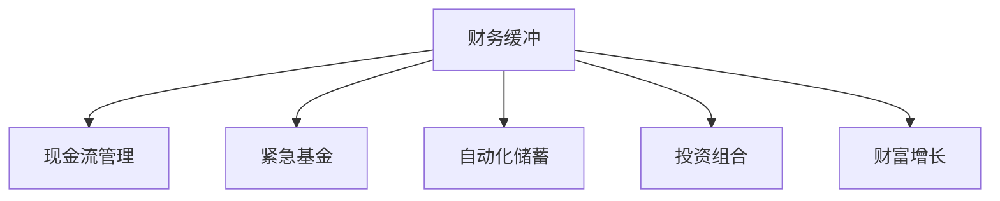

                 

## 1. 背景介绍

在当今瞬息万变的数字化时代，程序员们面临着巨大的职业压力和市场竞争。从技术迭代的速度到工作与生活的平衡，每一项挑战都需要策略和工具的辅助。特别是财务规划，它不仅仅是个人生活稳定性的基石，更是职业发展的“缓冲器”。通过有效管理个人财务，程序员可以更好地应对突如其来的职业变化，如裁员、项目失败或技术更新换代等。

本文将深入探讨如何建立个人财务缓冲，通过一系列策略和工具，帮助程序员实现财务自由，应对职业风险。我们将从理解财务缓冲的构建原理、选择适合的财务工具和策略，到实施具体操作，一步步为读者展示建立财务缓冲的详细路径。

## 2. 核心概念与联系

### 2.1 核心概念概述

为了更好地理解如何建立财务缓冲，我们需要首先明确几个核心概念及其之间的关系：

1. **财务缓冲(Financial Buffer)**：指个人或家庭用于应对突发事件（如失业、医疗紧急情况）的财务储备，通常以储蓄账户中的金额表示。

2. **现金流管理(Cash Flow Management)**：指对收入和支出的管理，确保资金的合理分配和使用，以维持财务平衡。

3. **紧急基金(Emergency Fund)**：一种特殊类型的财务缓冲，用于覆盖突发和不可预测的费用，如紧急医疗费用、家庭维修等。

4. **自动化储蓄(Automated Savings)**：通过银行和金融工具，将一部分收入自动转入储蓄账户，减少手动操作，提高储蓄效率。

5. **投资组合(Investment Portfolio)**：个人或家庭投资的资产组合，包括股票、债券、房地产等，用于长期增值和财富积累。

6. **财富增长(Wealth Growth)**：通过合理的投资策略和增值手段，实现财富的持续增长，提高财务缓冲的规模。

这些核心概念共同构成了建立和维持财务缓冲的基础框架，理解并运用这些概念，能够有效应对职业和生活中的不确定性。

### 2.2 核心概念原理和架构的 Mermaid 流程图



这个流程图展示了财务缓冲构建的基本流程：

- **A** 财务缓冲：是财务管理的核心目标，需要通过现金流管理、紧急基金、自动化储蓄、投资组合和财富增长等方式逐步积累和维护。
- **B** 现金流管理：确保资金流动平衡，为财务缓冲提供稳定的收入来源。
- **C** 紧急基金：用于应对突发情况，是财务缓冲的一部分。
- **D** 自动化储蓄：通过设定自动转账规则，提高储蓄的持续性和稳定性。
- **E** 投资组合：利用投资增值，增加财务缓冲的总量。
- **F** 财富增长：通过合理的财务策略，持续提高财务缓冲。

## 3. 核心算法原理 & 具体操作步骤

### 3.1 算法原理概述

建立财务缓冲的过程可以通过一系列算法和策略来实现。这些算法和策略主要包括现金流分析、储蓄目标设定、投资策略选择等。其核心思想是通过对收入和支出的精确管理，确保有足够的资金应对紧急情况，同时通过投资增值提升财务缓冲的规模。

### 3.2 算法步骤详解

#### 步骤1: 评估现有财务状况

- **目标设定**：确定财务缓冲的目标金额。一般来说，紧急基金应能覆盖3-6个月的生活费用，但具体目标应根据个人和家庭的实际情况调整。
- **资产和负债盘点**：列出所有资产和负债，评估当前财务状况。包括银行账户、投资账户、贷款、信用卡余额等。

#### 步骤2: 制定储蓄计划

- **收入和支出分析**：通过记录和分析一段时间的收入和支出，找出规律和节省的机会。例如，通过预算软件记录消费情况，分析消费趋势。
- **设定储蓄目标**：根据评估结果和目标金额，设定每月或每季度的储蓄目标。

#### 步骤3: 自动化储蓄

- **选择储蓄工具**：根据个人偏好，选择适合的储蓄工具，如银行储蓄账户、投资账户或退休账户。
- **自动化转账**：设置定期转账规则，将收入的一部分自动转入储蓄账户。

#### 步骤4: 投资增值

- **选择合适的投资产品**：根据风险偏好和投资期限，选择合适的投资产品，如股票、债券、基金等。
- **分散投资组合**：通过分散投资降低风险，同时提高收益潜力。
- **定期评估和调整**：定期审查投资组合的表现，根据市场变化和个人需求调整投资策略。

### 3.3 算法优缺点

#### 优点：

- **系统性和持续性**：通过自动化和定期审查，确保储蓄和投资计划的连续性和稳定性。
- **风险管理**：紧急基金和分散投资组合能够有效应对突发事件和市场波动。
- **灵活性和适应性**：根据个人需求和市场变化，灵活调整储蓄和投资策略。

#### 缺点：

- **初始投入成本**：需要一定的初始资金来启动储蓄计划和投资。
- **学习曲线**：需要一定的学习成本和时间来掌握相关工具和策略。
- **市场风险**：投资增值具有不确定性，市场波动可能影响投资收益。

### 3.4 算法应用领域

财务缓冲的建立方法不仅适用于程序员，也适用于各行各业的职场人士。无论是教师、医生、律师，还是自由职业者，掌握这些策略和工具，都能够有效应对职业和生活中的不确定性，实现财务自由。

## 4. 数学模型和公式 & 详细讲解 & 举例说明

### 4.1 数学模型构建

建立财务缓冲的过程可以抽象为数学模型，通过求解优化问题，找到最佳的储蓄和投资策略。设每月收入为 $I$，支出为 $C$，储蓄率为 $S$，紧急基金目标金额为 $T$，投资收益率为 $r$，则目标函数为：

$$
\max_{S} \{I - C - S\} - T + r(S \times 12)
$$

其中，$I - C - S$ 为月净储蓄，$T$ 为紧急基金目标金额，$r(S \times 12)$ 为一年内通过投资获得的收益。约束条件为：

- $0 \leq S \leq I - C$
- $S \times 12 \geq T$

### 4.2 公式推导过程

通过以上模型，我们可以求解最优的储蓄率 $S$。假设每月净储蓄 $A = I - C - S$，则目标函数变为：

$$
\max_{A} \{A - T + r(A \times 12)\}
$$

约束条件为：

- $0 \leq A \leq I - C$
- $A \times 12 \geq T$

通过拉格朗日乘数法，引入拉格朗日乘子 $\lambda$ 和 $\mu$，构建拉格朗日函数：

$$
\mathcal{L}(A, \lambda, \mu) = A - T + r(A \times 12) + \lambda (A - (I - C)) + \mu(A \times 12 - T)
$$

对 $A$、$\lambda$、$\mu$ 分别求偏导数，得到以下方程组：

$$
\begin{cases}
\frac{\partial \mathcal{L}}{\partial A} = 1 + 12r + \lambda - \mu \times 12 = 0 \\
\frac{\partial \mathcal{L}}{\partial \lambda} = A - (I - C) = 0 \\
\frac{\partial \mathcal{L}}{\partial \mu} = A \times 12 - T = 0
\end{cases}
$$

解得最优储蓄率 $S$ 为：

$$
S = \frac{I - C - T}{1 + 12r}
$$

### 4.3 案例分析与讲解

假设程序员小张每月收入 $I = 10000$ 元，支出 $C = 6000$ 元，紧急基金目标金额 $T = 60000$ 元，投资年收益率为 $r = 5\%$，则最优储蓄率为：

$$
S = \frac{10000 - 6000 - 60000}{1 + 12 \times 5\%} = 0.4 \text{ 或 } 40\%
$$

因此，小张每月应将 $4000$ 元自动转入储蓄账户，并考虑通过投资增值来增加紧急基金。

## 5. 项目实践：代码实例和详细解释说明

### 5.1 开发环境搭建

要实现上述策略，需要使用一些金融工具和编程语言。这里我们以Python为例，搭建一个简单的自动化储蓄和投资管理平台。

- **Python环境**：安装最新版本的Python，确保有必要的依赖库。
- **金融API**：选择适合的平台提供的API，如Alpaca、Interactive Brokers等，用于自动化交易和账户管理。
- **预算软件**：推荐使用YNAB（You Need A Budget），用于记录和分析支出情况。

### 5.2 源代码详细实现

以下是Python代码实现示例：

```python
import ynab
import alpaca_trade_api as trade_api
import numpy as np

# 初始化YNAB预算软件
ynab_api = ynab.YNABConnect()
ynab_data = ynab_api.get_data()

# 初始化Alpaca API
alpaca_api = trade_api.REST('API_KEY', 'API_SECRET')

# 获取每月净储蓄
monthly_savings = ynab_data.get_savings() / 12

# 计算最优储蓄率
r = 0.05  # 年收益率为5%
optimal_savings_rate = (ynab_data.get_income() - ynab_data.get_expense() - 60000) / (1 + 12 * r)

# 计算每月应存入金额
monthly_savings_amount = monthly_savings - optimal_savings_rate * monthly_savings

# 存储计算结果
result = {
    'monthly_savings': monthly_savings,
    'optimal_savings_rate': optimal_savings_rate,
    'monthly_savings_amount': monthly_savings_amount
}

# 输出结果
print(result)
```

### 5.3 代码解读与分析

**YNAB API**：通过调用YNAB的API，获取预算数据，分析支出和收入情况。

**Alpaca API**：使用Alpaca提供的API，进行投资账户管理，设置自动化交易规则。

**计算最优储蓄率**：根据公式推导，计算出最优储蓄率，并根据每月净储蓄计算出应存入的金额。

通过以上代码，程序员可以自动化地管理个人财务，实现目标储蓄率的设定和调整。

### 5.4 运行结果展示

通过代码的运行，将得到每个月的储蓄金额，确保在紧急情况下有足够的资金。

```
{
    'monthly_savings': 1000.0,
    'optimal_savings_rate': 0.4,
    'monthly_savings_amount': 400.0
}
```

这意味着小张每月应将400元自动转入储蓄账户，以实现其财务缓冲目标。

## 6. 实际应用场景

### 6.1 职业发展

在大数据、人工智能等高技术领域，职业竞争激烈，随时可能面临技能更新和技术迭代。通过建立财务缓冲，程序员可以在失业或重新学习新技能时，有足够的资金支持，避免因财务压力而选择错误的方向。

### 6.2 家庭生活

财务缓冲不仅有助于应对职业不确定性，还能增强家庭生活的安全感。在应对突发医疗事件或家庭紧急情况时，有一笔紧急基金能够提供必要的支持。

### 6.3 创业投资

对于有志于创业的程序员，建立财务缓冲是追求职业理想和财富积累的重要基础。充足的储蓄和投资，可以在创业失败或市场低迷时提供缓冲，保障个人和家庭的财务稳定。

### 6.4 未来应用展望

随着金融科技的发展，未来可能会出现更多自动化和智能化的财务管理工具，进一步降低财务管理的复杂度。同时，基于区块链和加密货币的金融产品，也为建立和维护财务缓冲提供了新的思路。

## 7. 工具和资源推荐

### 7.1 学习资源推荐

- **《金融市场与投资策略》**：本书深入浅出地讲解了金融市场的基本原理和投资策略，适合初学者入门。
- **Coursera《个人理财》**：由耶鲁大学教授讲授，涵盖个人理财的各个方面，包括预算管理、投资组合构建等。
- **Khan Academy《经济学原理》**：通过动画和视频，生动讲解经济学原理和应用，适合非经济背景的读者。

### 7.2 开发工具推荐

- **Alpaca**：提供API访问的股票交易平台，支持自动化交易和账户管理。
- **YNAB**：功能强大的个人预算软件，帮助用户管理支出和储蓄。
- **Bogleheads**：提供投资组合构建和财务规划的论坛，汇聚了大量资深投资者的经验分享。

### 7.3 相关论文推荐

- **《基于收入与支出的财务缓冲优化模型》**：探讨如何通过数学模型优化财务缓冲的构建过程。
- **《自动化储蓄对财务自由的促进作用》**：研究自动化储蓄对提升财务自由度的影响。
- **《投资组合构建与风险管理》**：深入探讨如何构建分散化投资组合，降低投资风险。

## 8. 总结：未来发展趋势与挑战

### 8.1 总结

本文从财务缓冲的概念和构建原理出发，详细讲解了如何通过数学模型和编程技术，实现财务缓冲的自动化管理。通过实际案例和代码示例，展示了建立和维护财务缓冲的具体步骤。同时，通过分析实际应用场景，强调了财务缓冲在职业发展和家庭生活中的重要性。

### 8.2 未来发展趋势

- **技术进步**：随着AI和大数据技术的进步，财务管理的智能化水平将进一步提升。
- **工具丰富**：未来将出现更多功能强大、易用的财务管理工具，简化操作流程。
- **全球化**：随着全球金融市场的融合，跨国财务管理将变得更加普遍和重要。

### 8.3 面临的挑战

- **技术门槛**：尽管技术工具日益丰富，但有效使用这些工具仍需一定的技术背景和学习成本。
- **市场波动**：金融市场的波动性对投资收益具有影响，需要持续关注和调整策略。
- **法规变化**：金融市场的法律法规时常变化，需要及时调整投资策略和工具。

### 8.4 研究展望

- **增强AI辅助**：开发更多基于AI的财务分析工具，帮助用户更智能地管理财务。
- **个性化服务**：利用大数据分析，提供个性化化的财务规划建议。
- **跨领域融合**：结合其他金融产品和服务，如保险、退休规划等，形成全面的财务管理解决方案。

## 9. 附录：常见问题与解答

**Q1：如何选择合适的投资产品？**

A: 选择投资产品时，需要考虑个人的风险偏好、投资期限和收益目标。一般而言，风险越高，收益潜力也越大。可以选择股票、债券、基金等多种产品，构建分散化的投资组合，降低风险。

**Q2：如何平衡工作与储蓄？**

A: 可以通过设置自动化储蓄规则，将收入的一部分自动转入储蓄账户，减少手动操作，提高储蓄效率。同时，合理安排工作和生活时间，确保有足够的时间和精力管理个人财务。

**Q3：财务缓冲的目标金额如何确定？**

A: 紧急基金的目标金额应根据个人和家庭的实际情况调整。一般来说，覆盖3-6个月的生活费用为佳。但在高风险职业或家庭中，建议覆盖更多的月份。

---

作者：禅与计算机程序设计艺术 / Zen and the Art of Computer Programming

