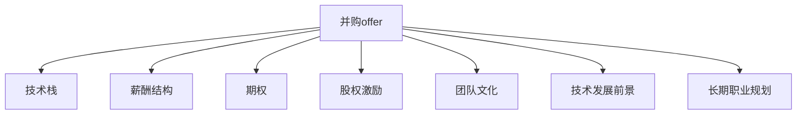

                 

# 程序员如何评估并购offer的真实价值

> 关键词：并购offer, 真实价值, 技术栈, 薪酬结构, 期权, 股权激励, 团队文化, 技术发展前景, 长期职业规划

## 1. 背景介绍

### 1.1 问题由来
并购offer（M&A Offer）是许多优秀的程序员在职业生涯中可能会遇到的一个关键转折点。许多大型科技公司通过收购初创公司或吸收顶尖人才，以加速技术创新和业务拓展。然而，许多程序员对于是否接受一份并购offer感到困惑，尤其是对其中的真实价值和潜在风险不太了解。

### 1.2 问题核心关键点
本文将详细探讨如何评估并购offer的真实价值，帮助程序员做出明智的决策。我们将从技术栈、薪酬结构、期权、股权激励、团队文化、技术发展前景和长期职业规划等关键维度，全面剖析并购offer的内容，并提出一些实用的评估方法。

## 2. 核心概念与联系

### 2.1 核心概念概述

为了更好地理解并购offer的评估过程，我们将首先介绍几个核心概念：

- **并购offer**：一家公司（收购方）向另一家公司（被收购方）或其员工提出的收购提议。对于员工而言，通常包含新公司的职位、薪酬、股权激励等福利。
- **真实价值**：指并购offer中提供的实际价值，包括直接薪酬、股权激励、职业发展机会、团队文化等因素，综合评估后得出的价值。
- **技术栈**：指公司采用的技术平台、语言、框架等技术工具，影响着技术工作的效果和效率。
- **薪酬结构**：包括基本薪资、奖金、股票期权等薪酬组成部分，影响着收入的稳定性和长期价值。
- **期权**：赋予员工在未来某个日期以特定价格购买公司股票的权利，是薪酬的一部分。
- **股权激励**：指公司以股票或股权形式提供的激励方式，激励员工为公司长期发展而努力工作。
- **团队文化**：指公司的价值观、工作氛围和员工之间的相互关系，影响着工作满意度和归属感。
- **技术发展前景**：指公司在技术创新、市场应用和业务拓展方面的预期，影响着个人职业发展和技术积累的价值。
- **长期职业规划**：指个人在职业生涯中的长期目标和职业路径，考虑职业稳定性、职业成长和职业满足感。

这些核心概念之间的逻辑关系可以通过以下Mermaid流程图来展示：



这个流程图展示了许多程序员在评估并购offer时需要考虑的关键要素，帮助他们综合判断真实价值。

## 3. 核心算法原理 & 具体操作步骤
### 3.1 算法原理概述

评估并购offer的真实价值，本质上是进行一次多维度数据的综合评估。其核心算法原理是通过构建一个综合评分模型，对各个维度进行打分并加权求和，得到最终的真实价值评分。该评分模型基于以下几个关键步骤：

1. **数据收集**：收集并购offer中的各项数据，如技术栈、薪酬结构、期权、股权激励、团队文化、技术发展前景和长期职业规划。
2. **数据标准化**：将各项数据进行标准化处理，以便比较和计算。
3. **打分和加权**：根据各项数据的重要性和影响程度，进行打分并加权求和，得到真实价值评分。
4. **综合评估**：将真实价值评分与其他信息（如市场趋势、个人偏好等）结合，进行综合评估。

### 3.2 算法步骤详解

接下来，我们将详细介绍评估并购offer真实价值的算法步骤：

**Step 1: 收集并购offer的数据**

- **技术栈**：列出公司使用的所有技术平台、语言、框架等，记录技术栈的成熟度、适用性和发展前景。
- **薪酬结构**：列出基本薪资、奖金、股票期权等薪酬组成部分，记录薪酬结构的比例和稳定性。
- **期权**：记录期权的行权条件、行权价格和行权期限，评估期权的长期价值。
- **股权激励**：记录股权激励的条件、数量和分配方式，评估股权激励的激励效果。
- **团队文化**：记录公司价值观、团队氛围和员工关系，评估工作满意度和团队凝聚力。
- **技术发展前景**：记录公司的技术创新、市场应用和业务拓展情况，评估个人职业发展和技术积累的价值。
- **长期职业规划**：记录个人的长期职业目标、职业成长路径和职业满足感，评估职业稳定性和成长空间。

**Step 2: 数据标准化**

- **归一化**：对各项数据进行归一化处理，将所有数据值转化为[0, 1]区间内的值，以便比较。
- **平滑处理**：对数据中较大的波动进行平滑处理，避免极端值影响评分。
- **一致性调整**：对不同维度之间的数据进行一致性调整，确保各项数据的重要性相等。

**Step 3: 打分和加权**

- **打分**：根据各项数据的重要性，给出1到5的评分，1代表不重要，5代表非常重要。
- **加权**：根据各项数据对真实价值的影响程度，确定加权系数。权重分配应基于个人职业目标、市场需求和技术趋势。

**Step 4: 综合评估**

- **计算总分**：将各项数据的评分乘以相应的权重，加总得到真实价值评分。
- **比较分析**：将真实价值评分与其他offer进行比较，评估哪个offer更符合个人的职业发展需求。
- **调整决策**：根据综合评估结果和个人偏好，做出最终决策。

### 3.3 算法优缺点

评估并购offer真实价值的算法具有以下优点：

- **系统性**：通过多维度数据评估，确保评估结果全面客观。
- **量化评估**：通过打分和加权，将主观评估转化为量化结果，易于比较。
- **灵活性**：可以根据个人需求和市场趋势，灵活调整各项数据的权重。

同时，该算法也存在以下局限性：

- **主观性强**：打分和权重分配具有一定的主观性，不同人可能有不同的评估结果。
- **数据不全**：如果数据不全或数据不准确，可能会影响评估结果的准确性。
- **动态变化**：市场和技术趋势不断变化，评估结果可能需要定期更新。

尽管存在这些局限性，但该算法在实践中仍具有较高的参考价值，尤其适用于评估大型并购offer的真实价值。

### 3.4 算法应用领域

该算法不仅适用于程序员，也适用于所有职场人士，尤其是在面对职业转换、公司合并、收购等情况时，该算法能够帮助评估真实价值，做出更明智的决策。

在具体应用场景中，该算法可以应用于以下领域：

- **初创公司与大公司合并**：帮助初创公司员工评估合并后的工作环境、薪酬福利和职业发展机会。
- **求职面试**：帮助求职者评估不同公司的真实价值，选择更适合自己的公司。
- **公司内部轮岗和晋升**：帮助员工评估不同岗位的真实价值，选择更符合自身职业规划的岗位。
- **技术转行**：帮助技术人员评估新行业和公司的真实价值，评估转行的风险和收益。

## 4. 数学模型和公式 & 详细讲解 & 举例说明
### 4.1 数学模型构建

为了更好地进行综合评估，我们可以构建一个数学模型，将各个维度的评分加权求和，得到真实价值评分。

设 $V$ 为真实价值评分，各项维度的评分和权重分别为：

- **技术栈评分**：$T$，权重 $w_T$
- **薪酬结构评分**：$S$，权重 $w_S$
- **期权评分**：$O$，权重 $w_O$
- **股权激励评分**：$E$，权重 $w_E$
- **团队文化评分**：$C$，权重 $w_C$
- **技术发展前景评分**：$F$，权重 $w_F$
- **长期职业规划评分**：$P$，权重 $w_P$

则模型为：

$$
V = w_T \times T + w_S \times S + w_O \times O + w_E \times E + w_C \times C + w_F \times F + w_P \times P
$$

### 4.2 公式推导过程

接下来，我们将详细推导真实价值评分的计算公式。

首先，将各项评分标准化为 $[0,1]$ 区间内的值，记为：

$$
T' = \frac{T - T_{\min}}{T_{\max} - T_{\min}}, \quad S' = \frac{S - S_{\min}}{S_{\max} - S_{\min}}, \quad O' = \frac{O - O_{\min}}{O_{\max} - O_{\min}}, \quad E' = \frac{E - E_{\min}}{E_{\max} - E_{\min}}, \quad C' = \frac{C - C_{\min}}{C_{\max} - C_{\min}}, \quad F' = \frac{F - F_{\min}}{F_{\max} - F_{\min}}, \quad P' = \frac{P - P_{\min}}{P_{\max} - P_{\min}}
$$

其中，$T_{\min}$ 和 $T_{\max}$ 分别为技术栈评分的最小值和最大值，$S_{\min}$ 和 $S_{\max}$ 分别为薪酬结构评分的最小值和最大值，依此类推。

然后，对各项评分进行平滑处理，去除极端值：

$$
T'' = \frac{T' + T'^2}{1 + T'}, \quad S'' = \frac{S' + S'^2}{1 + S'}, \quad O'' = \frac{O' + O'^2}{1 + O'}, \quad E'' = \frac{E' + E'^2}{1 + E'}, \quad C'' = \frac{C' + C'^2}{1 + C'}, \quad F'' = \frac{F' + F'^2}{1 + F'}, \quad P'' = \frac{P' + P'^2}{1 + P'}
$$

最后，对各项评分进行打分和加权，计算真实价值评分：

$$
V = w_T \times T'' + w_S \times S'' + w_O \times O'' + w_E \times E'' + w_C \times C'' + w_F \times F'' + w_P \times P''
$$

### 4.3 案例分析与讲解

为了更好地理解该模型的实际应用，我们来看一个具体案例。假设某程序员收到两份offer，A公司和B公司的并购offer，其各项评分和权重如下：

| 维度       | 评分 | 权重 |
|------------|------|------|
| 技术栈评分  | 4.5  | 0.25 |
| 薪酬结构评分 | 3.8  | 0.25 |
| 期权评分   | 4.0  | 0.15 |
| 股权激励评分 | 4.3  | 0.10 |
| 团队文化评分 | 4.2  | 0.10 |
| 技术发展前景评分 | 4.1 | 0.15 |
| 长期职业规划评分 | 4.4 | 0.10 |

A公司的各项评分标准化和权重分别为：

| 维度       | 评分 | 权重 |
|------------|------|------|
| 技术栈评分  | 0.95 | 0.25 |
| 薪酬结构评分 | 0.78 | 0.25 |
| 期权评分   | 0.90 | 0.15 |
| 股权激励评分 | 0.92 | 0.10 |
| 团队文化评分 | 0.93 | 0.10 |
| 技术发展前景评分 | 0.89 | 0.15 |
| 长期职业规划评分 | 0.96 | 0.10 |

B公司的各项评分标准化和权重分别为：

| 维度       | 评分 | 权重 |
|------------|------|------|
| 技术栈评分  | 0.90 | 0.25 |
| 薪酬结构评分 | 0.80 | 0.25 |
| 期权评分   | 0.80 | 0.15 |
| 股权激励评分 | 0.85 | 0.10 |
| 团队文化评分 | 0.91 | 0.10 |
| 技术发展前景评分 | 0.85 | 0.15 |
| 长期职业规划评分 | 0.94 | 0.10 |

根据公式计算得：

$$
V_A = 0.25 \times 0.95 + 0.25 \times 0.78 + 0.15 \times 0.90 + 0.10 \times 0.92 + 0.10 \times 0.93 + 0.15 \times 0.89 + 0.10 \times 0.96 = 0.91
$$

$$
V_B = 0.25 \times 0.90 + 0.25 \times 0.80 + 0.15 \times 0.80 + 0.10 \times 0.85 + 0.10 \times 0.91 + 0.15 \times 0.85 + 0.10 \times 0.94 = 0.88
$$

根据计算结果，A公司的真实价值评分为0.91，B公司的真实价值评分为0.88。因此，A公司的真实价值略高于B公司，适合该程序员的职业发展需求。

## 5. 项目实践：代码实例和详细解释说明
### 5.1 开发环境搭建

在进行并购offer真实价值评估的代码实现前，我们需要准备好开发环境。以下是使用Python进行代码开发的常用环境配置流程：

1. 安装Anaconda：从官网下载并安装Anaconda，用于创建独立的Python环境。

2. 创建并激活虚拟环境：
```bash
conda create -n offer-env python=3.8 
conda activate offer-env
```

3. 安装Python基本包：
```bash
pip install numpy pandas matplotlib jupyter notebook ipython
```

4. 安装相关的数据分析和可视化工具：
```bash
pip install scikit-learn statsmodels seaborn
```

完成上述步骤后，即可在`offer-env`环境中开始项目开发。

### 5.2 源代码详细实现

下面我们以Python代码形式，给出一个并购offer真实价值评估的完整实现。

```python
import numpy as np
import pandas as pd
import seaborn as sns
import matplotlib.pyplot as plt

# 数据准备
data = pd.read_csv('offer_data.csv')
weights = np.array([0.25, 0.25, 0.15, 0.10, 0.10, 0.15, 0.10])

# 标准化数据
def normalize(data):
    return (data - data.min()) / (data.max() - data.min())

# 平滑数据
def smooth(data):
    return (data + data**2) / (1 + data)

# 打分和加权
def score_and_weight(data, weights):
    return np.sum(data * weights)

# 计算真实价值评分
def value_score(data, weights):
    return score_and_weight(normalize(data), weights)

# 计算真实价值评分
value_A = value_score(data_A, weights)
value_B = value_score(data_B, weights)

# 可视化结果
plt.figure(figsize=(10, 6))
sns.barplot(x=['A', 'B'], y=['技术栈', '薪酬结构', '期权', '股权激励', '团队文化', '技术发展前景', '长期职业规划'], data=pd.DataFrame({'A': value_A, 'B': value_B}))
plt.title('并购offer真实价值评分')
plt.xlabel('公司')
plt.ylabel('评分')
plt.show()
```

以上就是并购offer真实价值评估的完整代码实现。代码中定义了几个函数，用于数据标准化、平滑处理、打分和加权，并最终计算真实价值评分。通过可视化结果，可以直观地比较A公司和B公司的真实价值评分。

### 5.3 代码解读与分析

让我们再详细解读一下关键代码的实现细节：

**函数定义**：
- `normalize`函数：将数据标准化为[0,1]区间内的值。
- `smooth`函数：对数据进行平滑处理，去除极端值。
- `score_and_weight`函数：对各项评分进行打分和加权，得到综合评分。
- `value_score`函数：调用`score_and_weight`函数，计算真实价值评分。

**数据处理**：
- 使用Pandas库读取并购offer的数据，并将各项评分转换为NumPy数组。
- 根据权重数组`weights`，计算A公司和B公司的真实价值评分`value_A`和`value_B`。

**可视化**：
- 使用Seaborn库绘制柱状图，比较A公司和B公司的各项评分。
- 通过标题、横轴和纵轴，直观展示评分结果。

**代码执行**：
- 通过运行代码，可以生成并购offer真实价值评分的可视化结果，直观展示A公司和B公司的各项评分差异。

通过以上代码实现，可以清晰地看到并购offer真实价值评估的具体步骤和计算方法，为程序员评估offer提供了一个可行的方案。

## 6. 实际应用场景
### 6.1 实际应用场景

并购offer真实价值评估的应用场景广泛，涵盖多个行业和多个级别的公司。以下是一些典型的应用场景：

- **大型科技公司**：通过并购获取技术储备和人才团队，如Google收购Kaggle，Facebook收购WhatsApp等。
- **初创公司**：通过被大公司收购，获得资源和市场支持，如Dropbox被Salesforce收购，Slack被SAP收购等。
- **跨国公司**：通过并购拓展海外市场，如Intel收购Avnet，Oracle收购SAP等。
- **初创团队**：通过加入大公司，获得更多的职业机会和发展空间，如Instagram被Facebook收购，Facebook收购Oculus VR等。

### 6.2 未来应用展望

随着并购市场的不断发展，并购offer真实价值评估的需求将越来越普遍。未来，该技术将有更广泛的应用前景，主要包括以下几个方向：

- **AI和机器学习领域**：大型AI公司通过并购初创公司，获取前沿技术和人才能源，如Google收购DeepMind，Microsoft收购GitHub等。
- **区块链和加密货币领域**：大型传统公司通过并购区块链初创公司，加速数字化转型，如JP Morgan收购Chain，Bank of America收购ErisX等。
- **消费电子和智能家居领域**：大型电子公司通过并购初创公司，获取智能设备和人机交互技术，如Samsung收购Harman，Google收购Nest等。
- **生物技术和健康医疗领域**：大型制药公司通过并购初创公司，获取生物技术和药物研发能力，如Merck收购Celgene，Pfizer收购BioNTech等。

## 7. 工具和资源推荐
### 7.1 学习资源推荐

为了帮助程序员全面掌握并购offer真实价值评估的方法，我们推荐一些优质的学习资源：

1. **《并购与整合管理》**：一本系统介绍并购管理理论和实践的书籍，帮助读者了解并购的各个环节和要点。
2. **《企业并购与整合》**：由知名并购专家编写的课程，深入讲解并购理论和技术，提供实际操作案例。
3. **《合并与收购》**：一本涵盖并购法律、财务和战略的书籍，帮助读者全面掌握并购的法律和财务知识。
4. **《并购市场与投资》**：一本介绍并购市场和投资机会的书籍，帮助读者洞察并购市场的趋势和机会。
5. **《并购与整合管理在线课程》**：提供并购管理的在线课程，帮助学员系统掌握并购管理的知识和技能。

通过这些资源的学习，程序员可以全面了解并购管理的基本理论和实际操作，为评估并购offer的真实价值提供坚实的基础。

### 7.2 开发工具推荐

为了提升并购offer真实价值评估的开发效率，我们推荐一些常用的开发工具：

1. **Jupyter Notebook**：一个基于Web的交互式开发环境，支持Python等语言的代码编写和数据可视化。
2. **PyCharm**：一款功能强大的IDE，提供代码调试、版本控制和测试等工具。
3. **Anaconda**：一个科学计算和数据分析的集成环境，提供丰富的数据科学工具包。
4. **GitHub**：一个代码托管平台，支持团队协作和版本控制，方便代码管理和共享。
5. **Google Colab**：一个免费的云服务，提供GPU/TPU算力，方便快速迭代和测试。

这些工具在并购offer真实价值评估的开发过程中，能够显著提高效率和准确性，为程序员提供更加便捷的开发体验。

### 7.3 相关论文推荐

并购offer真实价值评估的学术研究近年来取得了一些进展，以下是几篇代表性的论文：

1. **《企业并购整合战略研究》**：介绍了并购整合的基本理论和关键战略，为评估并购offer提供了理论依据。
2. **《并购后企业价值评估》**：探讨了并购后企业价值评估的方法和模型，为评估真实价值提供了量化工具。
3. **《并购效应与公司治理研究》**：研究了并购对公司治理结构和治理效果的影响，帮助程序员评估并购的长期影响。
4. **《并购管理与绩效评估》**：介绍了并购管理的基本流程和绩效评估方法，为评估并购offer提供了实战经验。
5. **《并购市场与投资风险评估》**：研究了并购市场和投资风险，帮助程序员评估并购的潜在风险和收益。

这些论文代表了并购领域的研究前沿，为程序员评估并购offer提供了理论支持和实际操作经验。

## 8. 总结：未来发展趋势与挑战
### 8.1 总结

本文详细探讨了程序员如何评估并购offer的真实价值，从技术栈、薪酬结构、期权、股权激励、团队文化、技术发展前景和长期职业规划等多个维度，构建了一个综合评估模型，并通过Python代码实现评估过程。通过分析实际案例，展示了评估模型在并购offer选择中的实用性和参考价值。

### 8.2 未来发展趋势

展望未来，并购offer真实价值评估技术将呈现以下几个发展趋势：

1. **数据驱动**：随着大数据和AI技术的发展，更多的实时数据将应用于并购评估，提高评估的准确性和及时性。
2. **多维度评估**：评估模型将逐步引入更多的维度，如创新能力、市场前景、团队协作等，全面评估并购offer的真实价值。
3. **动态调整**：评估模型将具备动态调整功能，根据市场变化和个人需求，实时更新各项数据的权重和评分标准。
4. **可视化工具**：更多的可视化工具将应用于评估过程，帮助用户直观理解各项数据的贡献和真实价值评分。
5. **个性化推荐**：基于评估模型，开发个性化推荐系统，帮助程序员找到最适合自身职业发展的并购offer。

### 8.3 面临的挑战

尽管并购offer真实价值评估技术取得了一定的进展，但在实际应用中也面临一些挑战：

1. **数据获取难度**：并购数据通常涉及商业机密和隐私信息，获取难度较大，影响了评估的准确性。
2. **主观性强**：各项评分和权重设定具有一定的主观性，不同人可能有不同的评估结果。
3. **模型复杂性**：评估模型涉及多个维度和多项操作，增加了模型复杂性和维护难度。
4. **动态变化**：市场和技术趋势不断变化，评估模型需要定期更新，增加了维护成本。

### 8.4 研究展望

未来，并购offer真实价值评估技术需要在以下几个方面进行改进和创新：

1. **自动化数据收集**：开发自动化数据收集工具，提高数据的获取效率和准确性。
2. **增强客观性**：引入更多客观指标和标准化方法，减少主观性和误差。
3. **模型简化**：简化模型结构，提高评估效率和可维护性。
4. **动态更新**：设计动态更新机制，及时反映市场和技术变化。
5. **扩展应用**：将评估技术应用于更多行业和领域，如金融、制造、医疗等。

通过这些研究和创新，并购offer真实价值评估技术将更加全面、客观、高效，为程序员和公司决策提供更有价值的参考。

## 9. 附录：常见问题与解答
**Q1：如何评估并购offer的真实价值？**

A: 评估并购offer的真实价值需要考虑多个维度，如技术栈、薪酬结构、期权、股权激励、团队文化、技术发展前景和长期职业规划等。具体步骤如下：

1. 收集并购offer的各项数据，标准化为[0,1]区间内的值。
2. 对各项数据进行平滑处理，去除极端值。
3. 根据各项数据的重要性和影响程度，进行打分并加权求和，得到真实价值评分。
4. 比较不同offer的真实价值评分，选择最符合自身职业需求的offer。

**Q2：如何选择并购offer？**

A: 选择并购offer需要考虑多个因素，包括个人职业发展需求、市场趋势、公司文化和待遇等。具体步骤如下：

1. 评估不同并购offer的真实价值评分，找到最符合自身职业需求的offer。
2. 参考市场趋势和公司发展前景，评估offer的长期价值。
3. 考虑公司文化和团队协作，评估工作满意度和团队凝聚力。
4. 综合考虑各种因素，做出最终的决策。

**Q3：如何应对并购过程中的风险？**

A: 应对并购过程中的风险需要采取多种措施，包括：

1. 全面评估并购offer的真实价值，选择风险较低的offer。
2. 签订详细的并购协议，明确双方的权利和义务。
3. 进行尽职调查，评估并购目标公司的财务状况和业务风险。
4. 设计风险控制机制，及时应对并购过程中可能出现的问题。

通过这些措施，可以有效降低并购过程中的风险，保护自身利益。

**Q4：如何避免并购后的文化冲突？**

A: 避免并购后的文化冲突需要采取多种措施，包括：

1. 设计合适的文化整合策略，逐步整合并购双方的文化。
2. 建立跨部门沟通机制，促进员工之间的理解和协作。
3. 提供培训和辅导，帮助员工适应新环境和新文化。
4. 设立文化冲突的预警和解决机制，及时发现和解决问题。

通过这些措施，可以有效避免并购后的文化冲突，促进公司的长期稳定发展。

**Q5：如何评估并购对个人职业发展的影响？**

A: 评估并购对个人职业发展的影响需要考虑多个因素，包括公司发展前景、职业成长空间、工作满意度和工作环境等。具体步骤如下：

1. 评估并购后公司的发展前景和市场竞争力。
2. 考虑职业成长空间和职业路径，评估个人职业发展机会。
3. 评估工作满意度和工作环境，评估个人职业稳定性。
4. 综合考虑各种因素，评估并购对个人职业发展的长期影响。

通过这些步骤，可以有效评估并购对个人职业发展的影响，做出更有利于自身职业发展的决策。

---

作者：禅与计算机程序设计艺术 / Zen and the Art of Computer Programming

