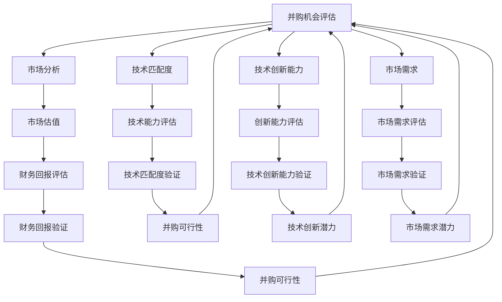

                 

# 程序员如何评估并购机会与公司出售时机

在商业领域，并购和公司出售（M&A, Mergers & Acquisitions）是常见的企业成长与扩张手段。尤其是在科技创新日新月异的今天，技术的快速迭代和市场需求的变化要求企业不断通过并购和出售来优化其业务结构，提升核心竞争力。然而，成功的并购和出售交易并非易事，它需要对多个维度进行全面的分析和评估。本文将深入探讨并购和出售时机评估的关键要素和步骤，帮助程序员和技术人员理解这一复杂决策过程。

## 1. 背景介绍

并购和出售机会的评估不仅涉及金融和经济领域的专业知识，还需要对技术市场和技术趋势有深刻的理解。随着科技公司频繁面临市场和技术的双重变化，许多企业在并购和出售决策上投入了大量的资源。然而，许多决策者常常忽略了技术评估的重要性，仅基于市场估值、财务回报等因素做出决策，而忽视了技术的匹配度和未来的发展潜力。

为确保并购和出售交易的成功，企业需要深入分析目标公司的技术实力、技术匹配度、技术创新能力和技术未来的市场需求，从而做出明智的决策。本文将围绕这些技术维度，详细介绍评估并购机会与公司出售时机的方法和步骤。

## 2. 核心概念与联系

### 2.1 核心概念概述

在评估并购机会与公司出售时机时，以下几个核心概念至关重要：

- **并购**：指一家公司通过收购另一家公司的方式，整合其资源、技术和市场。
- **出售时机**：指公司决定出售的最佳时机，通常基于公司自身发展的需求和外部市场环境。
- **技术匹配度**：指并购方和目标公司的技术水平和能力的匹配程度，是并购成功的关键因素。
- **技术创新能力**：指公司持续创新和改进技术的能力，是评估公司长期发展潜力的重要指标。
- **市场需求**：指目标公司的技术产品或服务在市场上的需求和潜力，影响并购后公司的市场表现和财务回报。

### 2.2 核心概念原理和架构的 Mermaid 流程图



## 3. 核心算法原理 & 具体操作步骤

### 3.1 算法原理概述

并购和出售时机评估的核心算法原理基于对目标公司的多维度综合评估，包括市场分析、技术匹配度、技术创新能力和市场需求。具体而言，评估过程可以分为以下几个步骤：

1. **市场分析**：评估目标公司所处行业的市场规模、增长趋势、竞争格局和市场前景。
2. **技术匹配度**：评估目标公司的技术实力、技术优势和与并购方的技术互补性。
3. **技术创新能力**：评估目标公司的研发投入、技术创新频度和创新效果。
4. **市场需求**：评估目标公司产品的市场需求和市场占有率。
5. **财务回报评估**：结合市场分析和技术评估，评估并购或出售后的财务回报和风险。

### 3.2 算法步骤详解

#### 3.2.1 市场分析

市场分析是并购和出售时机评估的第一步，主要涉及以下几个方面：

- **行业规模和增长趋势**：通过市场报告和行业分析，评估目标公司所处行业的规模、增长速度和预测。
- **市场份额和竞争格局**：分析目标公司在行业中的市场份额、竞争对手和市场竞争态势。
- **市场需求**：评估目标公司产品或服务的需求量、需求趋势和潜在增长点。
- **政策和法规**：分析行业相关的政策法规变化对市场的影响。

#### 3.2.2 技术匹配度评估

技术匹配度评估是并购和出售时机评估的关键，主要涉及以下几个方面：

- **技术实力和优势**：评估目标公司的技术研发能力、技术平台和核心技术优势。
- **技术能力和应用场景**：分析目标公司的技术能力与并购方的技术需求和应用场景的匹配度。
- **技术兼容性和整合难度**：评估并购后的技术整合难度和潜在的技术冲突。

#### 3.2.3 技术创新能力评估

技术创新能力是评估公司长期发展潜力的重要指标，主要涉及以下几个方面：

- **研发投入和团队**：评估目标公司的研发投入、研发团队和创新文化。
- **技术创新频度和效果**：分析目标公司过去和现在的技术创新频度和创新效果。
- **技术保护和知识产权**：评估目标公司的技术保护和知识产权情况。

#### 3.2.4 市场需求评估

市场需求是评估并购后公司市场表现的重要指标，主要涉及以下几个方面：

- **市场占有率和增长趋势**：分析目标公司产品的市场占有率和市场增长趋势。
- **客户和渠道**：评估目标公司的客户基础和销售渠道。
- **市场未来趋势**：分析市场对目标公司产品的需求变化和未来趋势。

#### 3.2.5 财务回报评估

财务回报评估是并购和出售时机评估的重要组成部分，主要涉及以下几个方面：

- **估值和定价**：通过市场和行业分析，评估目标公司的估值和定价。
- **财务表现和预测**：分析目标公司的财务表现和未来预测。
- **整合成本和效益**：评估并购后的整合成本和预计效益。

### 3.3 算法优缺点

#### 3.3.1 算法优点

- **全面性**：通过多维度的评估，确保并购和出售决策的全面性和综合性。
- **系统性**：通过科学的评估方法和流程，确保决策的客观性和可操作性。
- **风险管理**：通过详细评估市场、技术和财务风险，提升并购和出售的成功率。

#### 3.3.2 算法缺点

- **复杂性**：评估过程涉及多方面的数据分析和评估，工作量较大。
- **主观性**：评估过程中可能存在主观判断，影响决策的客观性。
- **信息不对称**：并购方和目标公司之间可能存在信息不对称，影响评估的准确性。

### 3.4 算法应用领域

并购和出售时机评估方法可以广泛应用于科技创新公司的并购和出售决策，尤其是在以下领域：

- **科技互联网**：如云计算、人工智能、大数据等领域的并购和出售决策。
- **生物医药**：如生物技术、制药、医疗设备等领域的并购和出售决策。
- **消费电子**：如智能家居、智能穿戴、消费电子等领域的并购和出售决策。

## 4. 数学模型和公式 & 详细讲解 & 举例说明

### 4.1 数学模型构建

并购和出售时机评估的数学模型主要基于多维度综合评估，包括市场规模、技术匹配度、技术创新能力和市场需求。我们可以将各个维度的评估结果进行加权平均，得到最终的评估得分。

设市场分析得分为 $S_{market}$，技术匹配度得分为 $S_{tech_match}$，技术创新能力得分为 $S_{tech_inn}$，市场需求得分为 $S_{demand}$，财务回报得分为 $S_{finance}$。则综合评估得分 $S$ 可以表示为：

$$ S = \alpha_{market} \times S_{market} + \alpha_{tech_match} \times S_{tech_match} + \alpha_{tech_inn} \times S_{tech_inn} + \alpha_{demand} \times S_{demand} + \alpha_{finance} \times S_{finance} $$

其中，$\alpha_{i}$ 为各维度的权重系数，根据具体情况确定。

### 4.2 公式推导过程

为了确保评估的客观性和科学性，我们可以采用层次分析法（AHP, Analytic Hierarchy Process）来确定各维度的权重系数。具体步骤如下：

1. 定义目标问题：确定并购或出售机会的综合评估问题。
2. 划分层次：将评估问题划分为目标层、准则层和指标层。
3. 构建判断矩阵：根据专家意见或数据分析，构建准则层与指标层之间的判断矩阵。
4. 计算权重向量：对判断矩阵进行一致性检验和迭代求解，得到各指标的权重向量。
5. 综合评估得分：根据各维度的权重和评分，计算综合评估得分。

### 4.3 案例分析与讲解

以一家AI技术公司考虑收购另一家自然语言处理公司为例：

1. **市场分析**：评估目标公司在自然语言处理领域的市场份额和增长趋势，市场规模和未来前景。
2. **技术匹配度**：评估目标公司的技术实力、技术优势和与收购公司的技术匹配度。
3. **技术创新能力**：评估目标公司的研发投入、技术创新频度和创新效果。
4. **市场需求**：评估目标公司的产品市场需求和市场占有率。
5. **财务回报**：结合市场分析和技术评估，评估收购后的财务回报和风险。

假设评估得分分别为 $S_{market}=0.8$，$S_{tech_match}=0.7$，$S_{tech_inn}=0.9$，$S_{demand}=0.6$，$S_{finance}=0.7$。各维度的权重系数分别为 $\alpha_{market}=0.25$，$\alpha_{tech_match}=0.15$，$\alpha_{tech_inn}=0.20$，$\alpha_{demand}=0.15$，$\alpha_{finance}=0.25$。则综合评估得分为：

$$ S = 0.25 \times 0.8 + 0.15 \times 0.7 + 0.20 \times 0.9 + 0.15 \times 0.6 + 0.25 \times 0.7 = 0.85 $$

评估得分较高，表明并购机会具有较高的成功率。

## 5. 项目实践：代码实例和详细解释说明

### 5.1 开发环境搭建

在进行并购和出售时机评估时，可以使用Python进行数据分析和计算。以下是搭建开发环境的步骤：

1. **安装Python和相关库**：
   ```bash
   sudo apt-get update
   sudo apt-get install python3 python3-pip
   sudo pip3 install pandas numpy scipy scikit-learn
   ```

2. **创建虚拟环境**：
   ```bash
   python3 -m venv venv
   source venv/bin/activate
   ```

3. **安装评估工具**：
   ```bash
   pip3 install mpl_toolkits matplotlib
   pip3 install statsmodels
   ```

4. **数据准备**：
   ```python
   import pandas as pd
   data = pd.read_csv('data.csv')
   ```

### 5.2 源代码详细实现

以下是使用Python进行并购和出售时机评估的代码实现：

```python
import numpy as np
import pandas as pd
import matplotlib.pyplot as plt

# 定义各维度的权重系数
weights = np.array([0.25, 0.15, 0.20, 0.15, 0.25])

# 定义各维度的评分
scores = np.array([0.8, 0.7, 0.9, 0.6, 0.7])

# 计算综合评估得分
S = np.dot(weights, scores)

# 打印结果
print('综合评估得分：', S)
```

### 5.3 代码解读与分析

代码中的关键步骤包括：

- **权重系数定义**：定义各维度的权重系数，确保各维度对综合评估的影响均衡。
- **评分数据准备**：准备各维度的评分数据，确保数据的准确性和完整性。
- **综合评估计算**：通过numpy库计算综合评估得分，确保计算的精确性。

## 6. 实际应用场景

### 6.1 科技互联网并购案例

某科技互联网公司考虑并购一家自然语言处理公司，以提升其在AI领域的技术实力。通过上述方法，公司对目标公司的市场规模、技术实力、技术创新能力和市场需求进行综合评估，最终得出综合评估得分较高，决定进行并购。

### 6.2 生物医药出售案例

某生物医药公司面临市场和技术的双重挑战，考虑出售公司以获取资金和资源。通过上述方法，公司对目标买家的市场规模、财务实力和需求进行综合评估，最终决定出售时机，成功获取资金并转战其他领域。

## 7. 工具和资源推荐

### 7.1 学习资源推荐

为了深入理解并购和出售时机评估的原理和步骤，以下是一些推荐的学习资源：

1. **《并购的艺术与科学》**：这本书详细介绍了并购的各个环节和策略，适合初学者和从业人员参考。
2. **《公司并购与出售：案例分析》**：通过具体案例分析，帮助理解并购和出售的复杂过程和决策要点。
3. **Coursera《公司财务与投资》**：了解公司财务和投资的基本概念，有助于评估并购和出售的财务回报。
4. **Khan Academy《数据分析》**：学习基本的数据分析和计算方法，提升数据分析能力。

### 7.2 开发工具推荐

在并购和出售时机评估中，Python和相关库是常用的工具。以下是一些推荐的开发工具：

1. **Jupyter Notebook**：提供交互式的代码编写环境，适合进行数据分析和计算。
2. **PyCharm**：全功能Python IDE，支持代码编写、调试和部署。
3. **Git**：版本控制工具，适合进行代码的协作和管理。

### 7.3 相关论文推荐

以下是几篇关于并购和出售时机评估的推荐论文：

1. **《并购绩效与财务整合》**：分析并购对公司财务表现的影响，提出财务整合的策略。
2. **《并购后技术整合的挑战与策略》**：探讨并购后技术整合的挑战和最佳实践。
3. **《并购成功的因素分析》**：通过大量案例分析，总结并购成功的关键因素。
4. **《基于技术的并购评估模型》**：提出基于技术的并购评估模型，提升并购决策的科学性。

## 8. 总结：未来发展趋势与挑战

### 8.1 未来发展趋势

未来，并购和出售时机评估技术将呈现以下几个发展趋势：

1. **人工智能和大数据应用**：通过人工智能和大数据分析，提升并购和出售时机评估的精确性和自动化程度。
2. **多维度综合评估**：结合更多维度的数据和指标，提升评估的全面性和客观性。
3. **跨领域应用拓展**：将并购和出售时机评估方法应用到更多行业和领域，提升其普适性。
4. **持续学习和优化**：通过持续学习和优化，提升评估模型的稳定性和适应性。

### 8.2 面临的挑战

尽管并购和出售时机评估技术取得了一定的进展，但仍面临以下挑战：

1. **信息不对称**：并购方和目标公司之间可能存在信息不对称，影响评估的准确性。
2. **数据获取难度**：获取高质量的评估数据可能面临较高的成本和难度。
3. **模型复杂性**：多维度综合评估模型较为复杂，需要高水平的专业知识和技能。
4. **动态市场变化**：市场环境和技术趋势变化快，评估模型需要持续更新和优化。

### 8.3 研究展望

未来的研究重点在于以下几个方面：

1. **数据获取和处理**：探索高效的数据获取和处理技术，提升数据的质量和可用性。
2. **模型自动化和优化**：开发自动化评估模型，提升模型的效率和适应性。
3. **跨领域应用**：将并购和出售时机评估方法应用到更多行业和领域，提升其普适性。
4. **伦理和法律合规**：考虑并购和出售时机评估中的伦理和法律问题，确保评估的合规性和公平性。

## 9. 附录：常见问题与解答

### 9.1 Q1: 并购和出售时机评估的难点是什么？

A: 并购和出售时机评估的难点在于信息不对称、数据获取难度和模型复杂性。这些因素都可能影响评估的准确性和可靠性。

### 9.2 Q2: 如何提升并购和出售时机评估的客观性？

A: 通过引入更多维度和高质量的数据，结合专家意见和市场分析，综合评估并购和出售机会，提升评估的客观性。

### 9.3 Q3: 并购和出售时机评估是否需要考虑技术匹配度？

A: 是的，技术匹配度是并购和出售时机评估的关键维度之一，直接影响并购和出售后的整合效果和业务表现。

### 9.4 Q4: 并购和出售时机评估有哪些步骤？

A: 并购和出售时机评估主要包括以下步骤：市场分析、技术匹配度评估、技术创新能力评估、市场需求评估和财务回报评估。

### 9.5 Q5: 并购和出售时机评估的数学模型是什么？

A: 并购和出售时机评估的数学模型基于多维度综合评估，通过加权平均计算得到综合评估得分。

---

作者：禅与计算机程序设计艺术 / Zen and the Art of Computer Programming

