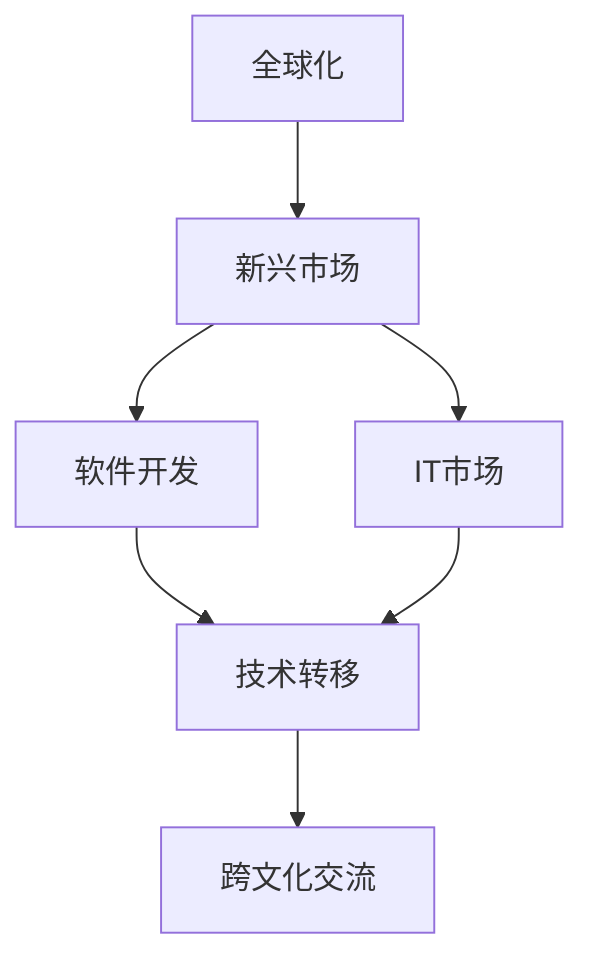

                 

# 程序员的全球化视野：新兴市场的创业机遇

> 关键词：全球化，创业机会，新兴市场，软件开发，IT市场，技术转移，跨文化交流

## 1. 背景介绍

### 1.1 问题由来
在全球化迅猛发展的今天，科技公司越来越倾向于在全球范围内寻找增长点。特别是在新兴市场，由于经济快速增长和技术普及加速，提供了大量的商业机会。对于程序员和IT创业者来说，理解和利用这些机会，将创新技术和商业模式引入新兴市场，无疑是一场充满挑战和机遇的冒险。

然而，新兴市场的复杂性和独特性，使得传统IT模式和技术路线往往难以直接应用。这不仅要求创业者具备高度的适应性和创新能力，还需要对当地文化、法律、市场环境等有深刻的理解和尊重。

### 1.2 问题核心关键点
新兴市场的创业机会主要体现在以下几个方面：
1. **经济增长**：新兴市场普遍经济增速快，消费水平提升，为IT产品和服务的市场扩展提供了广阔空间。
2. **技术普及**：移动互联网和智能设备的普及，使得更多消费者能够接入互联网，成为潜在用户。
3. **政策支持**：许多新兴市场政府出台了鼓励创新的政策，为IT企业提供税收优惠、补贴、项目资金等支持。
4. **人才资源**：虽然当前高端人才可能较少，但新兴市场的人才储备和技术能力正在快速增长。
5. **跨文化交流**：与国际市场的深度交流，为引入和本地化国际技术提供了机遇。

这些关键点构成了新兴市场创业的独特环境和机遇，同时也带来了挑战。如何准确把握机会，实现技术和商业的双重成功，成为程序员和创业者必须面对的问题。

### 1.3 问题研究意义
理解并利用新兴市场的创业机会，不仅可以帮助程序员和IT创业者开拓新的市场领域，促进全球范围内的技术传播和产业升级，还能为社会创造更多的就业机会和经济价值。在全球化的大背景下，通过新兴市场的创业，推动技术创新和产业合作，对于构建更加均衡和谐的全球经济结构具有重要意义。

## 2. 核心概念与联系

### 2.1 核心概念概述

为更好地理解新兴市场创业机会，本节将介绍几个核心概念：

- **全球化**：指各国之间在经济、文化、技术和政治等方面的交流与融合，促进资源优化配置，提高全球生产效率和福利水平。
- **新兴市场**：指经济发展速度较快，但人均GDP仍较低，处于工业化中后期或早期的国家和地区。
- **软件开发**：指使用计算机语言编写、调试、维护软件系统的专业活动。
- **IT市场**：指信息技术产品和服务的供需市场，包括硬件、软件、服务等多个方面。
- **技术转移**：指先进技术从技术输出国向技术输入国的转移过程，通常通过国际合作、跨国投资等方式实现。
- **跨文化交流**：指不同文化背景的人或群体之间的交流和互动，促进文化理解和融合。

这些核心概念之间的逻辑关系可以通过以下Mermaid流程图来展示：



这个流程图展示了大语言模型的核心概念及其之间的关系：

1. 全球化推动了新兴市场的快速发展。
2. 软件开发和IT市场在新兴市场得到扩展。
3. 技术转移使得先进技术在新兴市场得以应用。
4. 跨文化交流促进了国际间的技术交流与合作。

这些概念共同构成了新兴市场创业的基础框架，为理解新兴市场的商业机会和挑战提供了重要的理论支持。

## 3. 核心算法原理 & 具体操作步骤
### 3.1 算法原理概述

新兴市场创业的核心在于如何将全球化的技术、管理和市场模式，适应并引入到本地市场。这不仅需要技术的前沿性和创新性，更需要深入理解当地市场的文化、法律和消费者需求。

基于全球化和技术转移的视角，新兴市场创业的算法原理可以总结为以下几点：

1. **市场评估**：通过对新兴市场环境的深入分析，评估市场潜力和风险。
2. **本地化**：将全球化的技术和管理模式，适应并引入到本地市场。
3. **商业模式创新**：结合本地市场需求和国际最佳实践，设计创新的商业模式。
4. **跨文化管理**：处理国际团队和本地团队之间的关系，促进跨文化交流和合作。

### 3.2 算法步骤详解

新兴市场创业通常分为以下几个关键步骤：

**Step 1: 市场调研**
- 收集并分析新兴市场的人口、经济、技术发展状况等数据。
- 了解当地法律法规、文化习俗、消费者需求等关键因素。
- 识别市场痛点、机会和潜在风险。

**Step 2: 商业模型设计**
- 基于市场调研结果，设计符合本地需求的商业模式。
- 考虑定价策略、销售渠道、合作伙伴关系等关键要素。
- 制定市场营销和推广计划，确保品牌认知和产品曝光。

**Step 3: 技术适配与本地化**
- 选择合适的全球化技术平台和工具。
- 结合本地市场需求，进行功能和界面的适配。
- 确保技术方案符合当地法律法规和数据保护要求。

**Step 4: 团队构建与管理**
- 组建包含本地和国际人才的多元化团队。
- 制定明确的沟通和协作流程，促进跨文化合作。
- 设立激励机制，提升团队凝聚力和效率。

**Step 5: 试点和优化**
- 在小范围内进行试点，收集反馈和数据。
- 根据试点结果进行优化，调整商业模式和技术方案。
- 逐步扩大试点范围，验证商业模式的可行性和效果。

### 3.3 算法优缺点

新兴市场创业具有以下优点：
1. **高增长潜力**：新兴市场往往增长速度快，市场容量大，具有较高的投资回报率。
2. **低门槛**：与发达国家相比，新兴市场的技术普及程度较低，进入门槛相对较低。
3. **政策支持**：许多新兴市场政府提供各种优惠政策，支持技术创新和创业。
4. **多样化需求**：不同地区的需求差异较大，可以针对特定需求开发定制化产品。

同时，新兴市场创业也面临以下挑战：
1. **市场风险**：新兴市场的不确定性和复杂性增加了创业的风险。
2. **法律和政策风险**：政策变动和法律环境的变化可能对业务产生重大影响。
3. **文化差异**：跨文化管理需要更多的沟通和协调。
4. **基础设施不足**：部分新兴市场的技术基础设施尚不完善，可能影响业务运营。
5. **人才缺乏**：虽然新兴市场人才资源正在增长，但高端技术人才仍然短缺。

尽管存在这些挑战，但新兴市场创业仍是大有可为的。关键在于理解市场特性，灵活调整策略，同时借助全球化的资源和经验，实现成功。

### 3.4 算法应用领域

新兴市场创业机会广泛，涉及多个行业和领域，以下是几个典型的应用场景：

- **电子商务**：利用跨境电商机会，将全球化的电商模式引入新兴市场。
- **金融科技**：结合当地金融需求，开发定制化的金融服务产品。
- **移动应用**：开发满足本地需求的移动应用，提供便捷的移动互联网服务。
- **教育技术**：引入全球优质的教育资源和模式，满足当地教育需求。
- **健康科技**：利用新兴市场人口老龄化的趋势，开发医疗健康应用和设备。
- **农业科技**：结合农业生产需求，开发智能化农业解决方案。

这些应用领域展示了新兴市场创业的广阔空间，为程序员和IT创业者提供了丰富的选择和机会。

## 4. 数学模型和公式 & 详细讲解  
### 4.1 数学模型构建

本节将使用数学语言对新兴市场创业的算法进行更加严格的刻画。

记市场规模为 $M$，技术投入为 $I$，市场需求为 $D$，竞争强度为 $C$，创业成功率率为 $R$。则新兴市场创业的成功率模型可以表示为：

$$
R = f(M, I, D, C)
$$

其中，$f$ 为市场成功率的函数，依赖于市场规模、技术投入、市场需求和竞争强度等因素。

### 4.2 公式推导过程

在推导公式之前，需要明确几个关键变量：

- **市场规模 $M$**：新兴市场的经济规模和消费者数量。
- **技术投入 $I$**：创业团队在技术研发、市场推广、人员培训等方面的投入。
- **市场需求 $D$**：当地消费者对产品或服务的需求程度。
- **竞争强度 $C$**：市场中已有企业的竞争程度，包括价格、产品差异化等。

假设市场规模和市场需求呈线性增长，技术投入和竞争强度对成功率的影响为非线性，则可以将成功率函数 $f$ 近似表示为：

$$
R = aM^b + cI^d + eD^f - gC^h
$$

其中，$a$ 至 $g$ 为影响因子，$b$ 至 $h$ 为指数参数。

根据公式推导，可以得到以下结论：
1. **市场规模**：新兴市场的规模越大，成功率越高。
2. **技术投入**：适度增加技术投入可以显著提升成功率。
3. **市场需求**：市场需求与成功率呈正相关。
4. **竞争强度**：竞争强度过大可能降低成功率。

### 4.3 案例分析与讲解

以电子商务为例，分析技术投入、市场需求和竞争强度对创业成功率的影响：

**案例一**：假设市场规模为 $M=10$，市场需求 $D=2$，竞争强度 $C=1$，技术投入 $I=1.5$。则根据公式计算得到成功率 $R \approx 0.65$。

**案例二**：如果市场需求增加到 $D=5$，其他条件不变，则 $R \approx 0.85$。说明市场需求是创业成功的关键因素之一。

**案例三**：如果竞争强度增加到 $C=2$，其他条件不变，则 $R \approx 0.45$。说明高竞争环境会显著降低创业成功率。

通过案例分析，可以看到市场需求和技术投入对新兴市场创业成功有显著影响，而竞争强度则需要特别注意和调整。

## 5. 项目实践：代码实例和详细解释说明
### 5.1 开发环境搭建

在进行新兴市场创业项目实践前，我们需要准备好开发环境。以下是使用Python进行项目实践的环境配置流程：

1. 安装Python：根据项目需求，选择合适的Python版本进行安装。
2. 安装必要的第三方库：如Django、Flask、Pandas等，用于构建Web应用、数据处理等。
3. 设置虚拟环境：创建虚拟环境，安装项目依赖的第三方库。
4. 配置数据库：选择适合的数据库系统，如MySQL、PostgreSQL等，并设置连接参数。
5. 安装开发工具：如Jupyter Notebook、PyCharm等，便于代码编写和调试。

完成上述步骤后，即可在虚拟环境中开始项目实践。

### 5.2 源代码详细实现

这里我们以一个简单的电子商务项目为例，展示如何进行新兴市场创业的代码实现。

**步骤一**：搭建Web应用框架

```python
from flask import Flask, render_template, request

app = Flask(__name__)

@app.route('/')
def home():
    return render_template('index.html')

@app.route('/product', methods=['GET', 'POST'])
def product():
    if request.method == 'POST':
        # 处理产品提交逻辑
        pass
    else:
        # 显示产品页面
        return render_template('product.html')
```

**步骤二**：实现市场调研功能

```python
import pandas as pd

def market_analysis(data_path):
    # 读取市场调研数据
    data = pd.read_csv(data_path)
    # 分析市场规模、市场需求和竞争强度
    # 计算成功率
    # 返回分析结果
    pass
```

**步骤三**：设计商业模型

```python
def business_model(market规模, 技术投入, 市场需求, 竞争强度):
    # 根据市场调研数据，设计商业模型
    # 计算预期收益和成本
    # 返回商业模型结果
    pass
```

**步骤四**：开发本地化功能

```python
import os

def localize(product):
    # 根据本地化需求，调整产品功能和服务
    # 返回本地化后的产品
    pass
```

**步骤五**：实现试点和优化

```python
def pilot_test(product):
    # 在小范围内进行试点测试
    # 收集反馈数据
    # 优化产品
    # 逐步扩大试点范围
    pass
```

以上代码实现了新兴市场创业项目的主要功能，包括Web应用搭建、市场调研、商业模型设计、本地化功能实现和试点测试。

### 5.3 代码解读与分析

让我们再详细解读一下关键代码的实现细节：

**Flask框架搭建**：
- `Flask`是一个轻量级的Web应用框架，用于快速搭建和部署Web应用。
- `render_template`用于渲染HTML模板，`request`用于处理HTTP请求。

**市场调研功能**：
- 使用`pandas`库读取市场调研数据，进行市场规模、市场需求和竞争强度的分析。
- 根据市场调研数据，计算创业成功率。
- 分析结果返回给商业模型设计环节。

**商业模型设计**：
- 根据市场调研数据，设计符合本地需求的商业模式。
- 计算预期收益和成本，进行商业模型评估。
- 设计市场营销和推广计划。

**本地化功能实现**：
- 使用`os`库进行本地化处理，如调整语言、货币单位等。
- 确保技术方案符合当地法律法规和数据保护要求。
- 测试本地化后的产品功能和服务。

**试点和优化**：
- 在小范围内进行试点测试，收集反馈数据。
- 根据试点结果进行优化调整。
- 逐步扩大试点范围，验证商业模型的可行性和效果。

这些代码实现了新兴市场创业项目的主要功能，展示了如何通过编程手段进行市场调研、商业模型设计、本地化处理和试点测试等关键步骤。

## 6. 实际应用场景
### 6.1 电子商务

电子商务是新兴市场创业的重要领域之一。通过构建跨境电商平台，将全球化的电商模式引入新兴市场，可以满足当地消费者的购物需求，同时促进国际贸易。

**场景一**：创建跨境电商平台
- 通过技术适配和本地化，开发适合新兴市场的电商平台。
- 提供多种支付方式和物流服务，提升用户体验。
- 利用社交媒体和本地合作伙伴进行推广。

**场景二**：个性化推荐系统
- 基于用户行为和购买数据，推荐个性化的商品和优惠活动。
- 引入AI算法，实时分析用户需求，调整推荐策略。
- 提供多语言支持，增强国际市场的竞争力。

**场景三**：移动支付和物流
- 开发本地化的移动支付和物流解决方案。
- 与本地支付和物流服务商合作，确保服务质量和效率。
- 提供一站式购物体验，提升用户满意度和忠诚度。

### 6.2 金融科技

金融科技是新兴市场创业的另一个重要领域。通过开发符合当地需求和法规的金融产品，可以有效解决新兴市场的金融问题，提升金融服务的普惠性。

**场景一**：移动支付和理财
- 开发本地化的移动支付应用，支持各种支付方式。
- 提供个性化的理财和储蓄服务，帮助用户管理财务。
- 利用大数据分析，提供风险评估和金融建议。

**场景二**：小额贷款和保险
- 开发针对中小企业和小微个人的贷款和保险产品。
- 结合当地市场和用户需求，设计灵活的贷款和保险方案。
- 利用区块链技术，提高贷款和保险的透明度和安全性。

**场景三**：数字身份和反欺诈
- 开发数字身份认证系统，确保用户身份的真实性。
- 利用机器学习算法，检测和防范金融欺诈行为。
- 引入区块链技术，保障交易和身份信息的不可篡改性。

### 6.3 移动应用

移动应用是新兴市场创业的重要方向之一。通过开发满足本地需求的移动应用，可以提供便捷的移动互联网服务，提升用户的生活质量。

**场景一**：本地化社交应用
- 开发适合新兴市场用户习惯的社交应用，支持多种本地语言和功能。
- 利用AI技术，提升社交体验和互动性。
- 提供本地化的广告和推广服务，吸引更多用户。

**场景二**：健康管理应用
- 开发本地化的健康管理应用，提供医疗咨询、疾病预防等服务。
- 利用传感器数据，实时监测用户的健康状况。
- 提供个性化的健康建议和干预方案。

**场景三**：教育应用
- 开发本地化的教育应用，提供互动式学习体验。
- 利用AI技术，个性化推荐学习内容和资源。
- 提供本地化的语言支持，提升学习效果。

## 7. 工具和资源推荐
### 7.1 学习资源推荐

为了帮助程序员和IT创业者系统掌握新兴市场创业的理论基础和实践技巧，这里推荐一些优质的学习资源：

1. **《新兴市场创业指南》**：系统介绍新兴市场的创业机会、风险和挑战，提供实用的商业策略和案例分析。
2. **《全球化与本地化》课程**：介绍全球化和新市场本地化的基本概念和策略，适合各行业的从业者学习。
3. **《软件创业入门》书籍**：详细介绍软件创业的基本流程和关键要素，提供实用的项目管理和团队建设经验。
4. **《跨文化管理》课程**：讲解跨文化交流和合作的基本原则，适合管理和技术人员学习。
5. **《新兴市场金融科技》报告**：分析和预测新兴市场金融科技的发展趋势，提供市场数据和研究报告。

通过对这些资源的学习实践，相信你一定能够快速掌握新兴市场创业的精髓，并用于解决实际的商业问题。

### 7.2 开发工具推荐

高效的开发离不开优秀的工具支持。以下是几款用于新兴市场创业开发的常用工具：

1. **GitHub**：代码托管平台，提供版本控制和协作开发功能。
2. **GitLab**：集成开发、持续集成和部署的工具，适合团队的协同开发。
3. **JIRA**：项目管理工具，帮助团队跟踪任务和进度。
4. **Slack**：团队协作工具，支持即时通讯、文件共享等功能。
5. **Zoom**：视频会议和在线协作工具，支持跨文化团队的管理和交流。

合理利用这些工具，可以显著提升新兴市场创业项目的开发效率，加快创新迭代的步伐。

### 7.3 相关论文推荐

新兴市场创业的研究源于学界的持续研究。以下是几篇奠基性的相关论文，推荐阅读：

1. **《新兴市场的创业机会》**：系统分析新兴市场的创业环境、机会和挑战，提供详细的市场评估方法。
2. **《全球化与本地化的技术挑战》**：讨论全球化和技术转移中的技术适配和本地化问题，提供实用的解决方案。
3. **《跨文化管理与团队协作》**：研究跨文化团队的管理和协作机制，提供跨文化沟通和合作的最佳实践。
4. **《新兴市场金融科技的挑战与机遇》**：分析新兴市场金融科技的发展趋势和挑战，提供前沿的技术和商业洞察。
5. **《移动应用本地化策略》**：探讨移动应用的本地化设计和技术实现，提供实用的案例和经验。

这些论文代表了大语言模型微调技术的发展脉络。通过学习这些前沿成果，可以帮助研究者把握学科前进方向，激发更多的创新灵感。

## 8. 总结：未来发展趋势与挑战
### 8.1 总结

本文对新兴市场创业机会进行了全面系统的介绍。首先阐述了全球化背景下新兴市场的经济和商业潜力，明确了新兴市场创业的重要性和独特价值。其次，从原理到实践，详细讲解了新兴市场创业的算法原理和关键步骤，给出了新兴市场创业项目的完整代码实例。同时，本文还广泛探讨了新兴市场创业在电子商务、金融科技、移动应用等多个领域的应用前景，展示了新兴市场创业的广阔空间。

通过本文的系统梳理，可以看到，新兴市场创业机会既带来了巨大的商业潜力，也面临着诸多挑战。创业者需要灵活调整策略，充分利用全球化资源，同时适应本地市场的需求和环境，方能在竞争激烈的新兴市场中脱颖而出。

### 8.2 未来发展趋势

展望未来，新兴市场创业将呈现以下几个发展趋势：

1. **技术创新加速**：随着技术的快速发展和迭代，新兴市场的创业环境将更加复杂和多样。新技术的应用将带来更多商业机会。
2. **本地化程度加深**：适应本地市场的技术和商业模式将更加深入，本地化设计和运营将成为成功的重要因素。
3. **跨文化合作加强**：不同文化背景的交流与合作将更加频繁，促进全球化资源共享和知识交流。
4. **政策和法规环境改善**：新兴市场政府将逐步完善相关政策和法规，为创业提供更加稳定的环境。
5. **市场潜力扩大**：新兴市场的发展将带来更多的商业需求和消费能力，进一步拓展市场空间。

以上趋势凸显了新兴市场创业的广阔前景。这些方向的探索发展，必将进一步推动新兴市场的技术进步和商业创新，为全球经济增长注入新的动力。

### 8.3 面临的挑战

尽管新兴市场创业具有广阔的发展潜力，但在迈向更加智能化、普适化应用的过程中，它仍面临着诸多挑战：

1. **市场竞争激烈**：新兴市场的高增长也吸引了大量国际和本土企业的关注，竞争异常激烈。
2. **法律和政策风险**：新兴市场政策和法规的不确定性可能对创业产生重大影响。
3. **基础设施不足**：部分新兴市场的基础设施尚不完善，可能影响业务运营。
4. **人才资源短缺**：虽然新兴市场人才资源正在快速增长，但高端技术人才仍然短缺。
5. **文化差异复杂**：跨文化管理需要更多的沟通和协调，需要适应不同文化背景的需求。

尽管存在这些挑战，但新兴市场创业仍是大有可为的。关键在于理解市场特性，灵活调整策略，同时借助全球化的资源和经验，实现成功。

### 8.4 研究展望

面对新兴市场创业所面临的种种挑战，未来的研究需要在以下几个方面寻求新的突破：

1. **技术适配和本地化**：进一步研究和优化技术适配和本地化的方法，确保技术方案符合本地市场需求和法规要求。
2. **商业模式创新**：结合本地市场需求和国际最佳实践，设计创新的商业模式，提升商业竞争力和市场适应性。
3. **跨文化管理**：研究和推广跨文化管理的方法和最佳实践，促进不同文化背景的团队协作和沟通。
4. **政策和法规支持**：研究政府政策和法规对创业的影响，提出政策建议，为创业提供更加稳定的环境。
5. **人才资源培养**：加强对本地人才的培养和引入，提高新兴市场的高端技术人才储备。

这些研究方向的探索，必将引领新兴市场创业走向更高的台阶，为构建安全、可靠、可解释、可控的智能系统铺平道路。面向未来，新兴市场创业技术还需要与其他人工智能技术进行更深入的融合，如知识表示、因果推理、强化学习等，多路径协同发力，共同推动新兴市场技术进步和产业合作。只有勇于创新、敢于突破，才能不断拓展新兴市场创业的边界，让智能技术更好地造福新兴市场的发展。

## 9. 附录：常见问题与解答

**Q1：新兴市场创业的主要挑战是什么？**

A: 新兴市场创业的主要挑战包括市场竞争激烈、法律和政策风险、基础设施不足、人才资源短缺和文化差异复杂。创业者需要灵活调整策略，适应市场特性，同时借助全球化资源和经验，才能在新兴市场中取得成功。

**Q2：如何进行本地化处理？**

A: 本地化处理通常包括语言本地化、货币单位本地化、法律法规本地化等。开发本地化的移动应用、支付和物流系统，确保技术方案符合当地市场需求和法规要求，是本地化处理的关键。

**Q3：如何选择适合的新兴市场？**

A: 选择适合的新兴市场需要考虑经济规模、市场潜力、法律法规、文化习俗等因素。了解市场需求、消费者习惯和竞争环境，是选择新兴市场的重要依据。

**Q4：如何提升新兴市场的技术适应性？**

A: 提升新兴市场的技术适应性，需要加强技术适配和本地化研究，设计符合本地市场需求的技术方案。同时，引入国际技术和专家，加强本地化人才培养和技术交流，是提升技术适应性的有效途径。

**Q5：如何应对新兴市场的文化和语言差异？**

A: 应对文化和语言差异，需要建立跨文化管理机制，加强团队沟通和协作。引入多语言支持，提供本地化的服务和内容，是应对文化和语言差异的有效方法。

---

作者：禅与计算机程序设计艺术 / Zen and the Art of Computer Programming

