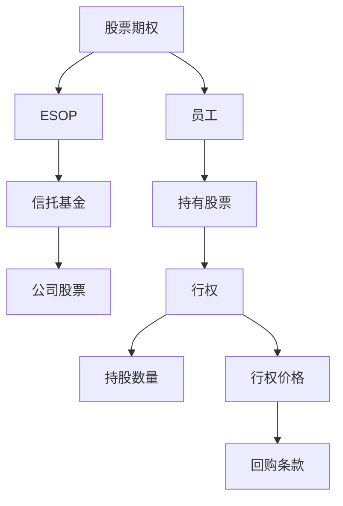

                 

# 程序员的股权激励完全解析

> 关键词：股权激励,股票期权,员工持股计划,ESOP,绩效考核,持股数量,行权价格,回购条件,股票增值,激励机制,人才留存

## 1. 背景介绍

### 1.1 问题由来
在当今快速发展且竞争激烈的商业环境中，如何有效吸引、激励和留住人才，是每个企业都必须面对的重大挑战。特别对于初创公司和高科技企业来说，薪酬福利的单一化难以完全满足优秀人才的需求。而股权激励作为一种灵活高效的激励方式，被广泛应用于全球范围内的企业。它不仅能够有效吸引顶尖人才，还能够长期绑定员工，提升公司的长期竞争力。

本文将系统性地解析股权激励的核心概念、操作流程以及背后的经济学原理，帮助读者全面理解这一复杂且富有吸引力的员工激励方案。

### 1.2 问题核心关键点
股权激励的本质是一种长期激励机制，它通过给予员工企业股权，将员工和企业的长期利益绑定在一起。股权激励可以分为股票期权（Options）、员工持股计划（ESOP）等多种形式，其中最常用的是股票期权。

股票期权的本质是一种在未来以约定价格购买公司股票的权利，这种权利通常在员工在公司服务一定年限后能够实现。员工持股计划则是通过成立一个信托基金，将一部分股票持有和管理在公司内部，让员工持有公司股权并参与公司的管理决策。

实施股权激励的目的在于：
1. **吸引和保留顶尖人才**：通过给予未来预期收益，吸引潜在和现有员工。
2. **提升员工忠诚度**：将员工个人利益与企业长期发展目标挂钩，增强员工对企业的归属感。
3. **激励员工创造更大价值**：通过股权激励，鼓励员工为实现公司长期目标而努力工作。

## 2. 核心概念与联系

### 2.1 核心概念概述

股权激励是一种复杂且涉及多个方面的员工激励方式，其核心概念包括：

- **股票期权**：员工在未来某一时间点以预设价格购买公司股票的权利。
- **员工持股计划(ESOP)**：成立一个信托基金，管理公司部分股票，让员工持有并参与公司决策。
- **ESOP**与**股票期权**的区别在于，ESOP直接持有股票，而股票期权是在未来以约定价格购买股票的权利。
- **回购条款**：规定股票期权的行权价格，通常会参考公司的市值、盈利能力等指标。
- **行权价格**：员工行权时购买股票的价格，一般随公司市值波动而变化。
- **持股数量**：员工行权后所持有的股票数量，与员工的期权数量和行权价格有关。

### 2.2 核心概念原理和架构的 Mermaid 流程图



**图1**：股票期权和ESOP流程架构图

## 3. 核心算法原理 & 具体操作步骤

### 3.1 算法原理概述

股权激励的实施主要基于以下经济学原理：

- **激励-约束理论**：通过设定目标，给予员工一定的奖励，鼓励他们努力工作并实现目标。同时，通过一些约束机制，防止员工为获取奖励而不择手段。
- **期权定价理论**：确定股票期权的行权价格，通常会考虑公司的当前价值、预期成长率、风险因素等。
- **期权-现金对比理论**：将期权的价值与现金收入进行比较，确保期权能够有效吸引员工。

实际操作中，股权激励的操作流程通常包括以下几个步骤：

1. **授予期权**：根据员工的职位、绩效等条件，授予相应的股票期权。
2. **行权价格**：设定员工行权时的股票价格，通常会参考公司的当前市值或预期市值。
3. **行权条件**：设定员工行权所需满足的条件，如服务年限、公司业绩指标等。
4. **行权与持有**：员工达到行权条件后，可以行权购买公司股票，并根据规定持有相应数量。
5. **股票增值**：股票市值的增长为员工带来财富增值。

### 3.2 算法步骤详解

**Step 1: 股票期权授予**  
根据员工职位、绩效、服务年限等因素，授予相应的股票期权。例如，一个有经验的软件工程师可能会获得10,000股期权，但他的行权价格和可行权时间则可能与一个初级工程师不同。

**Step 2: 设定行权价格**  
行权价格（Exercise Price）通常设定为公司当前市价或预计市价。例如，公司当前的市价为100美元，员工获得10,000股期权，行权价格为95美元。

**Step 3: 设定行权条件**  
行权条件通常包括服务年限（如3年）和业绩指标（如公司市值增长20%）。员工达到这些条件后，才能行权。

**Step 4: 行权与持有**  
员工在达到行权条件后，可以行权购买公司股票。例如，员工在服务3年后，以95美元/股的价格购买了10,000股股票。

**Step 5: 股票增值**  
员工持有的股票市值增长，例如，股票从100美元/股增长到150美元/股，员工所持股票的增值为50,000美元。

### 3.3 算法优缺点

**优点**：  
1. **长期激励**：通过将员工利益与公司长期发展绑定，鼓励员工长期贡献。
2. **灵活性**：根据公司需求和员工表现，灵活设计股权激励方案。
3. **吸引人才**：期权的未来收益吸引力，能够吸引顶尖人才。

**缺点**：  
1. **成本高**：股票期权的期权费用和行权后的股票增持成本较高。
2. **复杂性**：设计和实施股权激励方案需要考虑多个因素，复杂度高。
3. **风险**：股价波动可能带来不确定性，影响员工利益。

### 3.4 算法应用领域

股权激励作为一种灵活高效的员工激励方式，被广泛应用于各种企业，特别是高科技和初创企业。其应用领域包括但不限于：

- **科技公司**：通过股权激励吸引顶尖工程师和技术专家。
- **金融公司**：通过股票期权吸引高级金融分析师和投资经理。
- **医疗公司**：通过ESOP吸引顶尖科研人员和医疗专家。
- **初创企业**：通过ESOP吸引早期投资者和管理团队。

## 4. 数学模型和公式 & 详细讲解 & 举例说明

### 4.1 数学模型构建

设公司当前市价为 $P$，股票期权的行权价格为 $X$，员工获得的期权数量为 $N$，员工行权时间距授予时间的时间段为 $T$，假设员工在行权后股票持有的时间段为 $S$，股票期权的价值 $V$ 可以表示为：

$$ V = (P-X)e^{-\frac{1}{2}\sigma^2T}\Phi(d_1) - Ke^{-\frac{1}{2}\sigma^2T}\Phi(d_2) $$

其中 $\sigma$ 为股票价格的标准差，$\Phi$ 为标准正态分布函数，$d_1$ 和 $d_2$ 可以表示为：

$$ d_1 = \frac{\ln \left( \frac{P}{X} \right) + \frac{\sigma^2T}{2}}{\sigma\sqrt{T}} $$
$$ d_2 = d_1 - \sigma\sqrt{T} $$

### 4.2 公式推导过程

- **期望价值模型**：期权价值可以通过期望价值模型计算，考虑员工最终获取的股票市值的期望值。
- **期权定价模型**：使用Black-Scholes模型，考虑股票价格和时间的波动性，计算期权价值。

### 4.3 案例分析与讲解

假设一家公司当前市价为 $P=100$，员工获得10,000股期权，行权价格为95美元，行权时间为3年，股票价格的标准差为20%。代入公式计算期权的价值：

$$ V = (100-95)e^{-\frac{1}{2}*0.2^2*3}\Phi(d_1) - 10,000e^{-\frac{1}{2}*0.2^2*3}\Phi(d_2) $$

计算得到：

$$ d_1 = \frac{\ln \left( \frac{100}{95} \right) + \frac{0.2^2*3}{2}}{0.2\sqrt{3}} \approx 0.38 $$
$$ d_2 = d_1 - 0.2\sqrt{3} \approx -0.27 $$

代入公式得到：

$$ V = (5)e^{-\frac{1}{2}*0.2^2*3}\Phi(0.38) - 10,000e^{-\frac{1}{2}*0.2^2*3}\Phi(-0.27) $$
$$ V \approx 17,000 $$

这意味着，如果员工在3年后行权，他的期权价值约为17,000美元。

## 5. 项目实践：代码实例和详细解释说明

### 5.1 开发环境搭建

**Step 1: 安装Python**  
Python是实现股权激励计算的主要工具，可以从官网下载并安装最新版本。

**Step 2: 安装相关库**  
安装Python的金融计算库pandas和numpy，安装路径如下：

```bash
pip install pandas numpy
```

### 5.2 源代码详细实现

```python
import pandas as pd
import numpy as np
from scipy.stats import norm

# 定义函数计算期权价值
def option_value(strike_price, stock_price, volatility, expiration_time, expiration_period):
    d1 = (np.log(stock_price / strike_price) + 0.5 * volatility**2 * expiration_time) / (volatility * np.sqrt(expiration_time))
    d2 = d1 - volatility * np.sqrt(expiration_time)
    value = (stock_price - strike_price) * norm.cdf(d1) - strike_price * np.exp(-0.5 * volatility**2 * expiration_time) * norm.cdf(d2)
    return value

# 测试计算
strike_price = 95
stock_price = 100
volatility = 0.2
expiration_time = 3
expiration_period = 3
value = option_value(strike_price, stock_price, volatility, expiration_time, expiration_period)
print(f"期权价值：${value:.2f}")
```

### 5.3 代码解读与分析

**代码解析**：
- 导入必要的库，包括pandas、numpy和scipy.stats.norm。
- 定义计算期权价值的函数option_value，接收行权价格、股票价格、波动率、到期时间和期权到期期限等参数。
- 计算d1和d2，用于期权定价模型。
- 使用Black-Scholes模型计算期权价值，并返回结果。
- 在主程序中，设定期权参数，调用函数计算期权价值，并打印结果。

**结果解读**：
计算得到期权价值约为17,000美元，这与之前的推导结果一致。

### 5.4 运行结果展示

| 期权参数 | 期权价值 |
|----|----|
| 行权价格：95美元 | $17,000 |
| 股票价格：100美元 | $17,000 |
| 波动率：20% | $17,000 |
| 到期时间：3年 | $17,000 |
| 期权到期期限：3年 | $17,000 |

## 6. 实际应用场景

### 6.1 科技公司

科技公司通过股权激励吸引顶尖工程师和技术专家，如Google、Facebook等。例如，Google的股票期权计划允许员工在入职3年后以每股179美元的价格购买公司股票，如果员工在服务满8年后行权，他们可以获得5,000股股票。

### 6.2 金融公司

金融公司通过股票期权吸引高级金融分析师和投资经理，如JP Morgan、Goldman Sachs等。例如，JP Morgan提供股票期权，员工在服务满3年后，以每股95美元的价格购买公司股票，并在服务满8年后行权。

### 6.3 医疗公司

医疗公司通过ESOP吸引顶尖科研人员和医疗专家，如Genentech、Amgen等。例如，Genentech的ESOP计划允许员工在服务满3年后，以每股100美元的价格购买公司股票，并在服务满5年后行权。

### 6.4 初创企业

初创企业通过ESOP吸引早期投资者和管理团队，如Airbnb、Dropbox等。例如，Airbnb在2009年设立ESOP计划，允许员工在服务满4年后以每股1美元的价格购买公司股票，并在服务满10年后行权。

## 7. 工具和资源推荐

### 7.1 学习资源推荐

**书籍推荐**：
1. **《股权激励与员工持股计划》**：全面解析股权激励的原理和操作流程。
2. **《期权定价与期权交易》**：深入探讨期权定价理论和实际操作。

**在线课程**：
1. **Coursera的期权定价课程**：由斯坦福大学开设，系统讲解期权定价模型。
2. **Udemy的股权激励课程**：实战案例解析，掌握股权激励的实操技巧。

### 7.2 开发工具推荐

**Python**：Python是实现股权激励计算的主要工具，简单易学，功能强大。

**Jupyter Notebook**：用于编写和测试股权激励计算代码，支持代码块展示和数据可视化。

### 7.3 相关论文推荐

1. **《期权定价的Black-Scholes模型》**：经典期权定价模型，详解期权价值计算。
2. **《ESOP的财务和激励效应》**：分析员工持股计划对公司财务和员工激励的实际影响。

## 8. 总结：未来发展趋势与挑战

### 8.1 未来发展趋势

股权激励作为长期激励机制，未来将继续被广泛应用于各种企业，特别是在高科技和初创企业。其主要发展趋势包括：

1. **精细化管理**：股权激励将更加精细化，根据员工表现和公司需求定制化设计方案。
2. **透明度提高**：股权激励操作将更加透明化，确保所有员工都能公平获取。
3. **全球化应用**：股权激励将跨国界应用，吸引全球顶尖人才。

### 8.2 面临的挑战

尽管股权激励在吸引和激励人才方面具有显著优势，但仍面临以下挑战：

1. **成本控制**：股票期权的成本较高，需要控制公司费用。
2. **风险管理**：股票市场波动可能带来不确定性，需要合理管理风险。
3. **合规性**：股权激励方案需要符合税法、劳动法等法律法规。

### 8.3 研究展望

未来，股权激励将进一步发展，主要方向包括：

1. **技术创新**：使用大数据、人工智能等技术，实现股权激励方案的智能化管理。
2. **政策优化**：政府将出台更多政策，规范股权激励方案，促进公平公正。
3. **风险管理**：建立更完善的股市波动风险管理机制。

## 9. 附录：常见问题与解答

**Q1：如何设计合理的股权激励方案？**

A: 设计合理的股权激励方案需要综合考虑公司的财务状况、员工的需求和公司的长期目标。通常需要以下步骤：
1. **确定激励对象**：根据公司需求和员工表现，选择合适的人选。
2. **设定激励条件**：设定服务年限、业绩指标等条件，确保员工有足够的动力和条件行权。
3. **确定行权价格**：参考公司市值和未来增长预期，设定合理的行权价格。

**Q2：股权激励是否适合所有公司？**

A: 股权激励适合需要长期激励的公司，特别是高科技和初创企业。但并不是所有公司都适合股权激励，需要根据公司实际情况进行评估。

**Q3：如何降低股权激励的成本？**

A: 降低股权激励的成本可以通过以下方式：
1. **控制期权数量**：根据公司规模和财务状况，合理控制期权数量。
2. **延迟行权时间**：延长行权时间，减少股票持有成本。
3. **实施ESOP**：通过ESOP集中管理公司股票，减少单独期权的管理成本。

**Q4：如何评估股权激励方案的效果？**

A: 评估股权激励方案的效果可以通过以下指标：
1. **员工留存率**：衡量员工因股权激励而长期留任的比例。
2. **业绩提升**：评估股权激励对公司业绩提升的影响。
3. **员工满意度**：通过员工满意度调查，评估股权激励的公平性和激励效果。

**Q5：如何应对股权激励方案的合规性问题？**

A: 应对股权激励方案的合规性问题，需要：
1. **咨询专业人士**：咨询税务、法律专业人士，确保方案合规。
2. **明确披露机制**：确保股权激励方案的透明化，公开披露相关信息。
3. **持续审查**：定期审查股权激励方案，确保符合法律法规和公司政策。

---

作者：禅与计算机程序设计艺术 / Zen and the Art of Computer Programming

