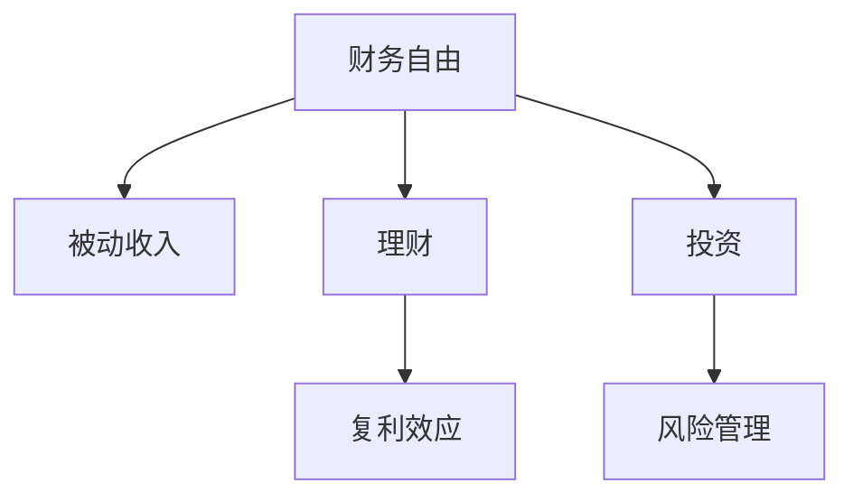

                 

# 程序员的财务自由：从省钱到赚钱的思维转变

程序员群体以其在技术领域的卓越才能闻名，但往往也面临财务自由的挑战。在现代快节奏的社会中，理财意识的缺乏和处理财务问题的能力不足，使得许多程序员难以实现财务自由。本文将深入探讨程序员的财务自由之路，从省钱到赚钱，揭露理财背后的思维转变，希望能为技术人员提供有价值的理财指导。

## 1. 背景介绍

### 1.1 问题由来
程序员作为技术专业人才，往往在技术领域有较深的研究，但通常对金融、投资等领域缺乏系统性了解。近年来，随着AI、区块链等前沿技术逐渐成为热门话题，程序员在职业发展上获得了前所未有的机遇。但与此同时，如何有效管理个人财务，实现财务自由，也成为了程序员职业规划中的一个重要课题。

### 1.2 问题核心关键点
财务自由不仅仅是积累财富，更是一种基于理性理财和投资的多维思维转变。对于程序员而言，其核心关键点包括：
1. **理财意识**：理解财富积累的长期价值，并为其制定明确的目标。
2. **投资知识**：掌握基本投资理财工具和策略，包括股票、基金、房地产等多种投资方式。
3. **风险管理**：认识并应对投资风险，制定有效的风险管理策略。
4. **持续学习**：关注金融市场动态，及时更新知识，不断优化投资策略。

## 2. 核心概念与联系

### 2.1 核心概念概述

为更好地理解程序员财务自由，本节将介绍几个密切相关的核心概念：

- **财务自由**：个人或家庭无需依赖劳动收入，仅靠投资资产的被动收入就能覆盖生活费用，实现财务自主。
- **被动收入**：通过投资股票、房地产等资产，产生稳定且持续的现金流，如股息、租金等。
- **理财**：个人或家庭通过规划、配置和管理财务资源，实现财富增值，防止财富流失，以及应对未来的财务需求。
- **投资**：将资金投入到具有增值潜力的项目或产品中，以获取收益。
- **风险管理**：识别、评估并控制投资风险，避免因风险过度导致资产损失。
- **复利效应**：即“钱生钱”，本金及利息通过不断再投资产生的收益，是实现财务自由的关键工具。

这些概念之间的逻辑关系可以通过以下Mermaid流程图来展示：



这个流程图展示了一系列概念之间的关系：

1. 财务自由是目标，通过被动收入来实现。
2. 理财和投资是实现被动收入的途径。
3. 风险管理是投资过程中不可忽视的环节。
4. 复利效应是财务自由的关键机制。

这些概念共同构成了程序员财务自由的学习框架，使得我们能够从宏观上把握财务自由的核心要素。

## 3. 核心算法原理 & 具体操作步骤
### 3.1 算法原理概述

从省钱到赚钱的思维转变，本质上是一种基于财务策略的算法优化过程。程序员在实现财务自由的过程中，需要根据个人和家庭的财务状况，制定合理的投资理财策略，并持续优化以适应市场变化。

### 3.2 算法步骤详解

基于以上原理，程序员实现财务自由的步骤通常包括以下几个关键环节：

**Step 1: 目标设定**
- 明确财务自由的具体目标，如退休年龄、所需被动收入等。
- 制定实现目标的详细计划，包括储蓄、投资、风险管理等各个方面。

**Step 2: 预算管理**
- 分析收入和支出，制定预算计划。
- 定期审视和调整预算，保持收支平衡。

**Step 3: 储蓄策略**
- 确定适当的储蓄率，优先存入高利率账户。
- 利用复利效应，定期进行自动转账和复利计算。

**Step 4: 投资选择**
- 根据风险承受能力，选择适合的投资组合。
- 持续学习和跟踪市场动态，适时调整投资组合。

**Step 5: 风险管理**
- 识别投资风险并制定应对策略，如分散投资、定期再平衡等。
- 利用保险工具，保护财务安全。

**Step 6: 持续学习与调整**
- 定期参加理财投资相关课程，获取新知识。
- 根据市场和个人状况的变化，及时调整财务策略。

### 3.3 算法优缺点

从省钱到赚钱的思维转变，作为一种理财算法，具有以下优点：
1. 系统性：通过明确的目标设定和详细步骤，确保理财过程有据可循。
2. 可操作性：理财策略具体且可执行，适合技术背景的程序员实施。
3. 稳健性：强调风险管理和复利效应，降低投资风险，提高资产增值速度。

同时，该算法也存在一定局限性：
1. 动态变化：市场和经济环境变化较快，理财策略需不断调整。
2. 主观偏差：个人理财决策受情感和经验影响，难以完全客观。
3. 执行难度：理财策略需持续执行，对个人自律要求较高。

### 3.4 算法应用领域

理财算法不仅适用于程序员，更适用于所有希望实现财务自由的个人。具体应用领域包括：

- 普通家庭理财：通过预算管理、储蓄投资、风险控制等策略实现家庭财务自由。
- 企业财务管理：通过投资优化、风险管理、现金流控制等手段实现企业价值最大化。
- 投资者教育：向投资者传授理财知识，帮助其制定科学合理的投资策略。

## 4. 数学模型和公式 & 详细讲解 & 举例说明
### 4.1 数学模型构建

理财的数学模型通常基于以下关键变量：

- 本金 $P$：初始投资金额。
- 年利率 $r$：投资的年收益率。
- 复利次数 $n$：一年内复利次数。
- 投资年限 $t$：投资期限。

复利公式为：

$$
A = P(1 + r/n)^{nt}
$$

其中 $A$ 为投资期末的金额。

### 4.2 公式推导过程

假设初始投资金额为 $P$，年利率为 $r$，投资期为 $t$ 年，每年复利 $n$ 次，则最终获得的总金额 $A$ 为：

$$
A = P(1 + r/n)^{nt}
$$

复利公式的推导基于连续复利的概念，利用复利原理，将每期的收益都计入下一期的本金计算，从而实现收益的复利效应。

### 4.3 案例分析与讲解

以一位程序员投资为例，假设初始投资金额为 $10,000$，年利率为 $5\%$，投资期为 $30$ 年，每年复利 $1$ 次，则最终金额 $A$ 计算如下：

$$
A = 10000(1 + 0.05/1)^{1 \times 30} = 10000 \times (1.05)^{30} \approx 10000 \times 3.065 = 30650
$$

经过 $30$ 年复利增长，原始投资 $10,000$ 元增长至 $30,650$ 元，实现了显著的财富增值。

## 5. 项目实践：代码实例和详细解释说明
### 5.1 开发环境搭建

在进行理财实践前，我们需要准备好开发环境。以下是使用Python进行Excel操作的开发环境配置流程：

1. 安装Python：从官网下载并安装Python，建议选择最新版本。
2. 安装Pandas和Matplotlib：使用pip安装，命令如下：
```bash
pip install pandas matplotlib
```
3. 安装XlsxWriter：用于将Python数据写入Excel文件，命令如下：
```bash
pip install xlsxwriter
```

完成上述步骤后，即可在Python环境下进行理财实践。

### 5.2 源代码详细实现

以下是一个使用Python进行复利计算的示例代码，展示了如何将公式应用于实际问题中。

```python
import pandas as pd
import matplotlib.pyplot as plt
from math import pow

# 定义复利计算函数
def compound_interest(principal, rate, time, compound):
    total = principal * pow(1 + rate / compound, compound * time)
    return total

# 创建复利计算表
principal = 10000
rate = 0.05
time = 30
compound = 1
interest = compound_interest(principal, rate, time, compound)
total = principal + interest

# 将结果输出到Excel文件
df = pd.DataFrame({'Principal': principal, 'Rate': rate, 'Time': time, 'Compound': compound, 'Interest': interest, 'Total': total})
df.to_excel('compound_interest.xlsx', index=False)

# 绘制复利计算图表
plt.plot([0, time], [principal, total], 'bo-', label='Total')
plt.plot([0, time], [principal * pow(1 + rate, time), total], 'ro--', label='Without Compound')
plt.title('Compound Interest Calculation')
plt.xlabel('Time (Years)')
plt.ylabel('Total Amount')
plt.legend()
plt.show()
```

### 5.3 代码解读与分析

以下是关键代码的解读：

**Compound_interest函数**：
- 定义了一个计算复利总额的函数，接受本金、利率、时间、复利次数作为参数。
- 使用公式 $A = P(1 + r/n)^{nt}$ 进行计算，并返回复利总额 $A$。

**数据处理和输出**：
- 定义初始本金、利率、时间和复利次数。
- 计算复利总额和最终总金额。
- 将计算结果存储在Pandas DataFrame中，并写入Excel文件。

**绘制图表**：
- 使用Matplotlib绘制复利增长曲线。
- 两条线分别表示没有复利和有复利的情况。

通过上述代码，我们可以清晰地看到复利计算的结果和复利增长过程，直观地理解复利效应的力量。

## 6. 实际应用场景
### 6.1 智能理财应用

智能理财应用利用大数据和算法优化，为用户提供个性化的理财建议。例如，某智能理财平台使用机器学习算法，根据用户的历史消费数据、收入水平和理财偏好，提供最优的投资组合和储蓄策略。通过定期的数据更新和优化，智能理财应用能动态调整用户的投资组合，帮助其实现财务自由。

### 6.2 企业财务管理

企业财务管理旨在通过科学的财务管理手段，实现企业价值最大化。例如，某企业利用财务算法模型，对不同项目的投资回报率进行评估，选择收益最大的项目进行投资。同时，通过风险评估和控制，防止因投资风险导致的企业损失，确保企业财务稳健运行。

### 6.3 投资者教育

投资者教育通过普及理财知识，帮助个人和家庭提升理财能力。例如，某投资教育平台提供丰富的理财课程，包括股票投资、基金管理、保险配置等，帮助用户掌握理财技能。同时，平台提供实时的市场动态分析，让用户能及时调整投资策略，规避市场风险。

## 7. 工具和资源推荐
### 7.1 学习资源推荐

为了帮助程序员系统掌握理财知识，以下是一些优质的学习资源：

1. **《理财规划：一个程序员的财务自由之路》书籍**：由财务自由领域的专家所著，详细介绍了理财的各个环节，如预算管理、储蓄投资、风险管理等。
2. **Coursera《个人理财基础》课程**：由耶鲁大学知名教授讲授，系统讲解了个人理财的基本原则和策略，适合编程爱好者学习。
3. **《巴菲特致股东的信》书籍**：巴菲特作为投资界传奇，其投资理念和理财经验对程序员有重要启示。
4. **Khan Academy《金融市场》课程**：通过动画视频讲解金融市场的基本原理和运作方式，便于理解复杂的理财概念。
5. **《富爸爸穷爸爸》书籍**：该书通过生动的案例，介绍理财和投资的基础知识，适合程序员阅读。

通过对这些资源的学习实践，相信程序员能更好地理解理财知识，为实现财务自由打下坚实基础。

### 7.2 开发工具推荐

在理财实践过程中，以下是几款常用的工具：

1. **Excel**：强大的数据处理和分析工具，适合理财数据计算和可视化。
2. **Pandas**：Python数据分析库，方便进行数据清洗和处理。
3. **Matplotlib**：Python绘图库，用于绘制数据可视化图表。
4. **Mint**：智能理财应用，自动跟踪用户财务状况，提供理财建议。
5. **Personal Capital**：财务管理工具，提供投资组合分析和预算管理功能。
6. **Robinhood**：股票交易平台，提供简单易用的投资工具和实时市场数据。

这些工具为理财实践提供了强有力的支持，使得程序员能高效地进行财务管理和投资决策。

### 7.3 相关论文推荐

理财领域的研究源远流长，以下是几篇奠基性的相关论文，推荐阅读：

1. **《财富积累的数学模型》**：探讨了复利效应对财富积累的影响，为理财提供了数学基础。
2. **《投资组合理论》**：介绍了现代投资组合理论的起源和基本原则，是投资理财的重要文献。
3. **《行为金融学》**：研究了个人和群体在金融市场中的行为规律，为理财决策提供了心理学的视角。
4. **《风险管理与金融工程》**：详细介绍了风险管理的各种技术和策略，适合金融工程师阅读。
5. **《区块链经济学》**：探讨了区块链技术对金融和投资的影响，为数字货币时代的理财提供了新的思路。

这些论文代表了理财领域的不同研究方向，通过学习这些前沿成果，程序员能更好地理解理财的深度和广度。

## 8. 总结：未来发展趋势与挑战
### 8.1 总结

本文对程序员的财务自由之路进行了全面系统的介绍，从省钱到赚钱，揭露了理财背后的思维转变。首先，阐述了财务自由的重要性，明确了理财的关键要素。其次，从原理到实践，详细讲解了理财的数学模型和操作步骤，提供了理财实践的代码实例。同时，本文还广泛探讨了理财方法在智能理财、企业财务管理、投资者教育等多个领域的应用前景，展示了理财范式的巨大潜力。此外，本文精选了理财技术的各类学习资源，力求为程序员提供全方位的理财指导。

通过本文的系统梳理，可以看到，理财不仅仅是一门技术，更是一种生活方式。无论是对个人、家庭还是企业，理财都具有重要的意义。理财不仅仅是钱的累积，更是一种理性思考和生活规划。只有掌握正确的理财思维和科学的方法，才能真正实现财务自由，构建稳定、富足的生活。

### 8.2 未来发展趋势

展望未来，理财技术将呈现以下几个发展趋势：

1. **智能化理财**：大数据和AI技术的应用，使得理财更加智能化和个性化。智能理财应用通过分析用户行为数据，提供更精准的理财建议。
2. **数字化投资**：数字货币和区块链技术的发展，为理财投资提供了新的机会和工具，数字货币投资、NFT投资等新兴领域将吸引更多关注。
3. **全球化理财**：随着全球金融市场的融合，理财将突破地域限制，形成全球化理财模式。跨境投资、资产配置等将成为新的理财热点。
4. **绿色理财**：环境保护意识的提升，推动了绿色理财的发展。碳中和、绿色基金等环保理念融入理财，成为理财的重要方向。
5. **定制化理财**：基于用户个性化需求，提供定制化的理财方案。从传统的银行理财到AI驱动的智能理财，理财方案的灵活性和多样性将大大提升。

以上趋势凸显了理财技术的广阔前景，理财理念和工具的不断创新将推动人们财富增值和生活质量的提升。

### 8.3 面临的挑战

尽管理财技术已经取得了长足进展，但在迈向更加智能化、普适化理财的过程中，它仍面临着诸多挑战：

1. **数据隐私保护**：随着大数据和AI技术的应用，个人隐私保护成为重要问题。如何确保用户数据安全，防止信息泄露，将是理财平台面临的重要挑战。
2. **技术壁垒**：理财技术涉及金融、数学、计算机等多个领域，需要高度的专业知识和技能。普通用户难以理解复杂的算法和模型，理财教育仍需加强。
3. **市场风险**：理财投资涉及股票、债券、基金等多种资产，市场波动可能导致投资损失。如何在风险和收益之间找到平衡，避免过度投资，仍需探索。
4. **合规性**：理财平台需要遵守各类法律法规，如反洗钱、隐私保护等，确保合法合规。合规问题可能成为理财发展的瓶颈。
5. **用户接受度**：理财技术的普及和应用需要用户的广泛接受。如何提高用户对理财的认知和接受度，增强用户的参与感和信任感，仍需持续努力。

### 8.4 研究展望

面对理财技术面临的种种挑战，未来的研究需要在以下几个方面寻求新的突破：

1. **隐私保护技术**：开发更强的数据加密和隐私保护技术，确保用户数据安全。
2. **易用性设计**：简化理财工具的操作流程，降低技术门槛，提高用户使用体验。
3. **市场风险控制**：研究先进的风险控制模型，有效识别和评估市场风险，保护用户资产安全。
4. **合规性框架**：建立完善的理财平台合规性框架，确保平台运营合法合规。
5. **用户教育**：开展全面的理财教育，提升用户理财知识水平，增强用户信心和参与感。

这些研究方向的探索，必将引领理财技术迈向更高的台阶，为构建安全、可靠、智能的理财系统铺平道路。面向未来，理财技术还需要与其他技术进行更深入的融合，如大数据分析、区块链、人工智能等，多路径协同发力，共同推动理财领域的进步。只有勇于创新、敢于突破，才能不断拓展理财技术的边界，让理财工具更好地服务于人类社会。

## 9. 附录：常见问题与解答

**Q1：理财是否需要掌握高深的数学知识？**

A: 理财并不需要掌握高深的数学知识，但基本的数学原理可以帮助理解理财工具和模型。例如，复利公式、投资组合理论等都是理财的重要基础。

**Q2：理财是否需要投入大量时间和精力？**

A: 理财需要一定的投入，但不需要投入大量时间和精力。制定合理的预算、储蓄和投资计划，并通过智能理财应用和工具，可以轻松实现理财目标。

**Q3：理财是否需要定期调整？**

A: 理财需要根据市场和个人情况的变化，定期调整投资组合和理财策略。市场波动和个人需求的变化，都可能影响理财效果，及时调整是理财成功的关键。

**Q4：理财是否需要专业理财顾问？**

A: 对于复杂的理财问题，建议咨询专业的理财顾问。理财顾问能提供专业的理财建议和方案，帮助制定最优的理财计划。

**Q5：理财是否需要不断学习和更新知识？**

A: 理财知识不断更新，金融市场和技术也在不断变化。持续学习和更新理财知识，是理财成功的重要保障。

通过对这些常见问题的解答，希望能帮助程序员更好地理解理财知识，克服理财中的难题，实现财务自由。

---

作者：禅与计算机程序设计艺术 / Zen and the Art of Computer Programming

