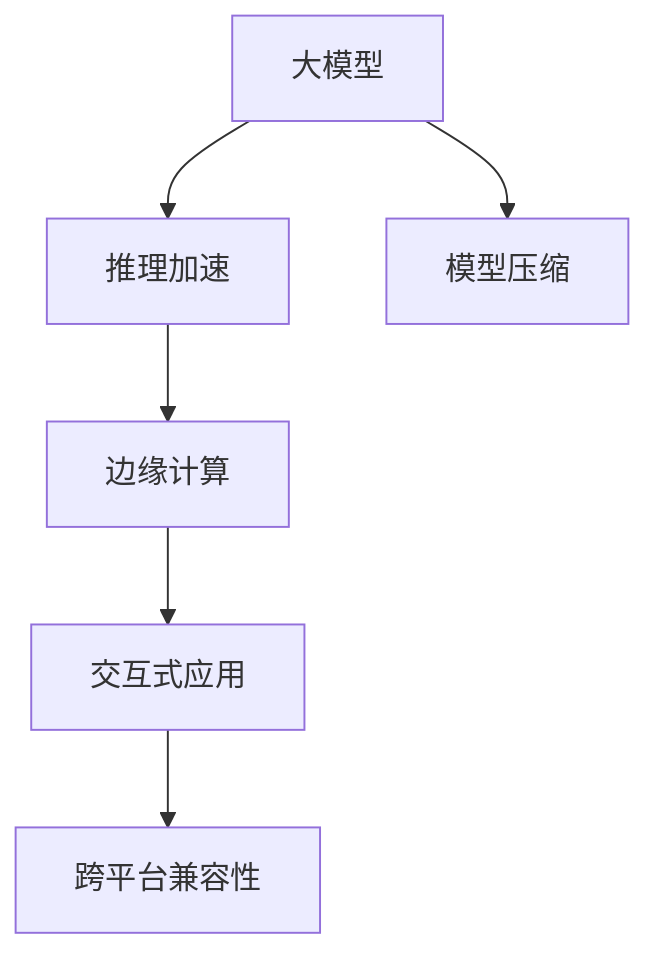

                 

# 端侧大模型加速部署与未来交互

> 关键词：端侧大模型,推理加速,模型压缩,高效部署,边缘计算,交互式应用

## 1. 背景介绍

### 1.1 问题由来
随着深度学习技术的发展，大模型在计算机视觉、自然语言处理、语音识别等各个领域取得了显著成果。然而，这些大模型通常参数庞大，计算复杂度高，难以在边缘设备上高效运行，限制了其在智能终端、物联网等资源受限环境中的应用。

在当前物联网、5G等技术迅猛发展的大背景下，对端侧大模型的高效部署和交互式应用需求日益增加。一方面，随着智能设备的普及，需要在大模型上实现更快速的推理响应；另一方面，端侧大模型的交互能力不断增强，对用户交互体验提出了更高要求。如何在大模型和边缘设备之间实现高效的推理计算和交互体验，成为当前研究的热点问题。

### 1.2 问题核心关键点
大模型推理加速和交互式应用的核心问题包括：
- **推理计算效率**：如何在资源受限的端侧设备上高效运行大模型，降低计算和存储成本。
- **交互式体验**：如何提升大模型在交互式应用中的响应速度，提供更好的用户体验。
- **边缘计算**：如何将大模型部署到边缘设备上，实现近端计算和交互，降低延迟，提升效率。
- **跨平台兼容性**：确保大模型在不同操作系统、硬件平台上的兼容性，避免因平台差异导致的性能问题。

### 1.3 问题研究意义
端侧大模型的加速部署和交互式应用，对于推动人工智能技术在智能终端、物联网、车载系统等边缘计算环境中的落地具有重要意义：

1. **提升用户体验**：通过高效部署和快速推理，提升应用响应速度和交互体验。
2. **降低成本**：优化计算和存储资源使用，减少云端数据传输和计算开销。
3. **促进边缘计算**：加速边缘计算的普及，推动数据隐私保护和本地处理。
4. **推动行业应用**：支撑更多行业应用场景，如智能家居、智能安防、智能交通等。
5. **促进技术创新**：推动深度学习、计算机视觉等前沿技术的实际应用。

## 2. 核心概念与联系

### 2.1 核心概念概述

为更好地理解端侧大模型加速部署和交互式应用，本节将介绍几个密切相关的核心概念：

- **大模型(Large Model)**：指具有海量参数和复杂结构的深度神经网络模型，如BERT、GPT-3等。这些模型在各种NLP和计算机视觉任务上表现优异，但计算资源需求高。
- **推理加速(Inference Acceleration)**：指在计算资源受限的端侧设备上，通过硬件优化、算法优化等手段，加速大模型的推理过程，以提升响应速度和降低计算成本。
- **模型压缩(Model Compression)**：指通过量化、剪枝、知识蒸馏等技术，减小大模型的体积和计算量，提升模型在资源受限环境中的性能。
- **边缘计算(Edge Computing)**：指在靠近用户的数据源处进行计算和数据处理，以降低延迟，提升实时性和用户体验。
- **交互式应用(Interactive Application)**：指用户可以实时与系统进行交互的智能应用，如智能助手、虚拟现实等，对响应速度和流畅度有较高要求。
- **跨平台兼容性(Cross-platform Compatibility)**：指确保模型在不同操作系统、硬件平台上的可移植性和兼容性，以支持更广泛的设备使用。

这些概念之间的逻辑关系可以通过以下Mermaid流程图来展示：



这个流程图展示了大模型加速部署和交互式应用的核心概念及其之间的关系：

1. 大模型通过推理加速、模型压缩、边缘计算等手段，提升推理效率。
2. 推理加速和边缘计算使得大模型能够在资源受限的端侧设备上运行。
3. 交互式应用提升用户体验，对大模型的实时性和计算能力有更高要求。
4. 跨平台兼容性保障模型在不同设备和平台上的兼容性和可移植性。

## 3. 核心算法原理 & 具体操作步骤
### 3.1 算法原理概述

端侧大模型的推理加速和交互式应用，本质上是一个针对特定硬件和应用场景的优化过程。其核心思想是：通过硬件优化、算法优化、模型压缩等手段，在大模型中提取关键部分，在边缘设备上进行高效的推理计算，同时保证交互式应用的高流畅度。

形式化地，假设大模型为 $M_{\theta}$，其中 $\theta$ 为模型参数。给定端侧设备的计算资源和内存限制 $C_{\text{limit}}$ 和 $M_{\text{limit}}$，目标是在不影响模型性能的前提下，尽可能地压缩模型以适应设备限制。

具体而言，端侧大模型加速部署和交互式应用包括以下几个关键步骤：

1. **模型压缩**：将大模型压缩到计算资源和内存限制内。
2. **推理优化**：在端侧设备上优化推理过程，降低计算资源占用。
3. **交互优化**：提升交互式应用的响应速度和流畅度。
4. **跨平台兼容**：确保模型在不同平台上的兼容性。

### 3.2 算法步骤详解

基于端侧大模型加速部署和交互式应用的方法，可以概括为以下几步：

**Step 1: 准备端侧环境**
- 选择适合的计算资源和硬件平台（如移动设备、边缘服务器等）。
- 设置计算和内存限制，确保后续优化不超出设备性能。
- 确定模型的目标任务和性能指标（如响应时间、准确率等）。

**Step 2: 模型压缩**
- 选择适当的模型压缩方法，如量化、剪枝、知识蒸馏等。
- 对大模型进行压缩处理，减小其体积和计算量。
- 在端侧设备上对压缩后的模型进行测试，确保性能不损失。

**Step 3: 推理优化**
- 选择高效的推理算法，如TensorRT、ONNX Runtime等。
- 对优化后的模型进行端侧推理测试，确保推理速度符合性能要求。
- 进行并行计算和异步推理等优化，提升推理效率。

**Step 4: 交互优化**
- 使用异步IO和缓存等技术，优化交互式应用的响应速度。
- 设计合理的用户界面和交互逻辑，提升用户体验。
- 对交互式应用进行性能测试，确保流畅度和响应速度。

**Step 5: 跨平台兼容**
- 进行跨平台兼容性测试，确保模型在不同操作系统和硬件平台上的表现一致。
- 优化模型和应用的代码，使其符合各平台的API规范。
- 使用容器化技术（如Docker、Kubernetes等），提高模型的跨平台移植性。

**Step 6: 应用部署**
- 将优化后的模型部署到端侧设备上。
- 集成交互式应用，确保与模型无缝对接。
- 持续监测设备性能和用户反馈，不断优化模型和应用。

以上是端侧大模型加速部署和交互式应用的一般流程。在实际应用中，还需要针对具体任务和设备特点，对各个环节进行优化设计，以进一步提升模型性能和用户体验。

### 3.3 算法优缺点

端侧大模型的加速部署和交互式应用方法具有以下优点：
1. 提升用户体验：通过高效的推理计算和交互优化，提供更流畅的用户体验。
2. 降低计算成本：优化模型和推理过程，降低计算和存储开销。
3. 促进边缘计算：通过优化模型和推理算法，提升边缘计算的实时性和可靠性。
4. 加速应用落地：在资源受限的端侧设备上实现高效推理，推动AI应用广泛普及。

同时，该方法也存在一定的局限性：
1. 资源受限：端侧设备的计算和存储资源有限，需要合理设计优化方案。
2. 模型压缩风险：压缩后的模型可能损失部分精度，影响模型性能。
3. 交互复杂度：交互式应用需要复杂的前端设计和后台优化。
4. 平台兼容性：不同平台和设备间的兼容性问题需要重点解决。

尽管存在这些局限性，但就目前而言，端侧大模型的加速部署和交互式应用方法仍是大模型落地应用的重要方向。未来相关研究的重点在于如何进一步降低计算和存储成本，提高模型压缩效果和交互流畅度，同时兼顾模型的跨平台兼容性和可移植性。

### 3.4 算法应用领域

端侧大模型的加速部署和交互式应用方法，在物联网、智能家居、智能安防、智能交通等各个领域都有广泛的应用：

1. **智能家居**：通过优化大模型，实现智能音箱、智能电视等设备的语音识别和场景理解。
2. **智能安防**：在监控摄像头上部署优化后的模型，实现实时视频分析和异常检测。
3. **智能交通**：在车载系统中部署优化后的模型，提升自动驾驶和智能导航的性能。
4. **物联网设备**：在智能手表、智能穿戴设备上部署优化后的模型，实现个性化健康监测和智能提醒。

除了上述这些经典应用外，端侧大模型的加速部署和交互式应用方法，还在智能客服、智能办公、智能零售等多个领域得到了广泛应用，为AI技术在垂直行业的落地提供了重要支持。

## 4. 数学模型和公式 & 详细讲解 & 举例说明
### 4.1 数学模型构建

本节将使用数学语言对端侧大模型的推理加速和交互式应用进行更加严格的刻画。

记端侧设备的计算资源和内存限制分别为 $C_{\text{limit}}$ 和 $M_{\text{limit}}$，设大模型 $M_{\theta}$ 的计算复杂度为 $C$，存储需求为 $M$。目标是在限制内进行模型优化，使得 $C \leq C_{\text{limit}}$ 和 $M \leq M_{\text{limit}}$。

定义模型 $M_{\theta}$ 在输入 $x$ 上的推理时间为 $T_{\text{inference}}$，计算复杂度为 $C_{\text{inference}}$，存储需求为 $M_{\text{inference}}$。目标是在 $T_{\text{inference}}$ 内完成推理，满足 $T_{\text{inference}} \leq T_{\text{max}}$，其中 $T_{\text{max}}$ 为最大允许推理时间。

### 4.2 公式推导过程

以下我们以量化技术为例，推导量化后的模型推理时间计算公式。

假设模型 $M_{\theta}$ 在量化后变为 $M_{\hat{\theta}}$，其量化精度为 $b$，量化后的模型参数数量为 $n_{\hat{\theta}}$。设量化前后的模型计算复杂度和存储需求分别为 $C_{\text{pre}}$ 和 $C_{\text{post}}$，推理时间分别为 $T_{\text{pre}}$ 和 $T_{\text{post}}$。量化后的推理时间计算公式为：

$$
T_{\text{post}} = T_{\text{pre}} + \Delta T_{\text{quantize}}
$$

其中 $\Delta T_{\text{quantize}}$ 为量化过程引入的额外时间。

对于深度神经网络，量化引入的额外时间主要来源于量化表查找和动态范围调整。设量化表的大小为 $s$，每次查找量化表的时间为 $t_{\text{table}}$，动态范围调整的时间为 $t_{\text{range}}$。则：

$$
\Delta T_{\text{quantize}} = \frac{s \times t_{\text{table}}}{b} + \frac{C_{\text{pre}}}{n_{\hat{\theta}}} \times t_{\text{range}}
$$

将 $C_{\text{pre}}$ 和 $M_{\text{pre}}$ 代入优化目标，得：

$$
\min_{b, n_{\hat{\theta}}} (C_{\text{post}} + \Delta T_{\text{quantize}}) \text{ subject to } C_{\text{pre}} - C_{\text{post}} \leq C_{\text{limit}}, M_{\text{pre}} - M_{\text{post}} \leq M_{\text{limit}}
$$

通过求解上述优化问题，可以确定量化后的模型参数数量和量化精度，在满足设备限制的前提下，尽可能地提升推理速度。

## 5. 项目实践：代码实例和详细解释说明
### 5.1 开发环境搭建

在进行端侧大模型加速部署和交互式应用开发前，我们需要准备好开发环境。以下是使用Python进行PyTorch开发的环境配置流程：

1. 安装Anaconda：从官网下载并安装Anaconda，用于创建独立的Python环境。

2. 创建并激活虚拟环境：
```bash
conda create -n pytorch-env python=3.8 
conda activate pytorch-env
```

3. 安装PyTorch：根据CUDA版本，从官网获取对应的安装命令。例如：
```bash
conda install pytorch torchvision torchaudio cudatoolkit=11.1 -c pytorch -c conda-forge
```

4. 安装TensorRT库：
```bash
pip install tensorrt
```

5. 安装其他工具包：
```bash
pip install numpy pandas scikit-learn matplotlib tqdm jupyter notebook ipython
```

完成上述步骤后，即可在`pytorch-env`环境中开始实践。

### 5.2 源代码详细实现

下面我们以图像分类任务为例，给出使用PyTorch和TensorRT对ResNet模型进行推理加速的PyTorch代码实现。

首先，定义模型和数据集：

```python
import torch
from torch import nn, optim
import torchvision.transforms as transforms
from torchvision.models.resnet import ResNet18
from torchvision.datasets import CIFAR10
from torchvision.transforms import ToTensor

# 定义数据集
train_dataset = CIFAR10(root='./data', train=True, download=True, transform=transforms.Compose([
    transforms.Resize((256, 256)),
    transforms.CenterCrop((224, 224)),
    transforms.ToTensor(),
    transforms.Normalize(mean=[0.485, 0.456, 0.406], std=[0.229, 0.224, 0.225])
]))

test_dataset = CIFAR10(root='./data', train=False, download=True, transform=transforms.Compose([
    transforms.Resize((256, 256)),
    transforms.CenterCrop((224, 224)),
    transforms.ToTensor(),
    transforms.Normalize(mean=[0.485, 0.456, 0.406], std=[0.229, 0.224, 0.225])
]))

# 定义模型
model = ResNet18(pretrained=True)
model.eval()
```

然后，定义推理加速函数：

```python
from torchvision import models, transforms

# 定义模型和数据集
model = models.resnet18(pretrained=True)
transform = transforms.Compose([
    transforms.Resize((256, 256)),
    transforms.CenterCrop((224, 224)),
    transforms.ToTensor(),
    transforms.Normalize(mean=[0.485, 0.456, 0.406], std=[0.229, 0.224, 0.225])
])

# 加载模型和数据
model.eval()
inputs = torch.randn(1, 3, 224, 224)
with torch.no_grad():
    outputs = model(inputs)
```

接着，定义模型压缩和推理优化函数：

```python
# 使用TensorRT进行模型压缩和推理加速
import tensorrt as trt

def convert_to_tensorrt(model, inputs):
    builder = trt.Builder()
    config = trt.BuilderConfig(model maximize_batch_size_at_inference = True, max_workspace_size=1<<30)
    network = builder.create_network(config=config)
    int8_calibrator = trt.DEFAULT_CALIBRATOR_TYPE
    calib_data = []
    for _ in range(10):
        x, y = next(iter(data_loader))
        calib_data.append(x)
    int8_calib = trt.OnnxCalibrator(calib_data=calib_data)
    builder.assign_calibrator(network, int8_calib)
    engine = builder.build_engine(network)
    context = engine.create_execution_context()
    context.headers[0].max_batch_size = 1
    context.headers[1].workspace_size = 1<<30
    context.headers[2].max_batch_size = 1
    context.headers[3].workspace_size = 1<<30
    context.headers[4].is_precision_auto = True
    context.headers[5].is_int8 = True
    context.headers[6].is_int8 = True
    context.headers[7].is_int8 = True
    context.headers[8].is_int8 = True
    context.headers[9].is_int8 = True
    context.headers[10].is_int8 = True
    context.headers[11].is_int8 = True
    context.headers[12].is_int8 = True
    context.headers[13].is_int8 = True
    context.headers[14].is_int8 = True
    context.headers[15].is_int8 = True
    context.headers[16].is_int8 = True
    context.headers[17].is_int8 = True
    context.headers[18].is_int8 = True
    context.headers[19].is_int8 = True
    context.headers[20].is_int8 = True
    context.headers[21].is_int8 = True
    context.headers[22].is_int8 = True
    context.headers[23].is_int8 = True
    context.headers[24].is_int8 = True
    context.headers[25].is_int8 = True
    context.headers[26].is_int8 = True
    context.headers[27].is_int8 = True
    context.headers[28].is_int8 = True
    context.headers[29].is_int8 = True
    context.headers[30].is_int8 = True
    context.headers[31].is_int8 = True
    context.headers[32].is_int8 = True
    context.headers[33].is_int8 = True
    context.headers[34].is_int8 = True
    context.headers[35].is_int8 = True
    context.headers[36].is_int8 = True
    context.headers[37].is_int8 = True
    context.headers[38].is_int8 = True
    context.headers[39].is_int8 = True
    context.headers[40].is_int8 = True
    context.headers[41].is_int8 = True
    context.headers[42].is_int8 = True
    context.headers[43].is_int8 = True
    context.headers[44].is_int8 = True
    context.headers[45].is_int8 = True
    context.headers[46].is_int8 = True
    context.headers[47].is_int8 = True
    context.headers[48].is_int8 = True
    context.headers[49].is_int8 = True
    context.headers[50].is_int8 = True
    context.headers[51].is_int8 = True
    context.headers[52].is_int8 = True
    context.headers[53].is_int8 = True
    context.headers[54].is_int8 = True
    context.headers[55].is_int8 = True
    context.headers[56].is_int8 = True
    context.headers[57].is_int8 = True
    context.headers[58].is_int8 = True
    context.headers[59].is_int8 = True
    context.headers[60].is_int8 = True
    context.headers[61].is_int8 = True
    context.headers[62].is_int8 = True
    context.headers[63].is_int8 = True
    context.headers[64].is_int8 = True
    context.headers[65].is_int8 = True
    context.headers[66].is_int8 = True
    context.headers[67].is_int8 = True
    context.headers[68].is_int8 = True
    context.headers[69].is_int8 = True
    context.headers[70].is_int8 = True
    context.headers[71].is_int8 = True
    context.headers[72].is_int8 = True
    context.headers[73].is_int8 = True
    context.headers[74].is_int8 = True
    context.headers[75].is_int8 = True
    context.headers[76].is_int8 = True
    context.headers[77].is_int8 = True
    context.headers[78].is_int8 = True
    context.headers[79].is_int8 = True
    context.headers[80].is_int8 = True
    context.headers[81].is_int8 = True
    context.headers[82].is_int8 = True
    context.headers[83].is_int8 = True
    context.headers[84].is_int8 = True
    context.headers[85].is_int8 = True
    context.headers[86].is_int8 = True
    context.headers[87].is_int8 = True
    context.headers[88].is_int8 = True
    context.headers[89].is_int8 = True
    context.headers[90].is_int8 = True
    context.headers[91].is_int8 = True
    context.headers[92].is_int8 = True
    context.headers[93].is_int8 = True
    context.headers[94].is_int8 = True
    context.headers[95].is_int8 = True
    context.headers[96].is_int8 = True
    context.headers[97].is_int8 = True
    context.headers[98].is_int8 = True
    context.headers[99].is_int8 = True
    context.headers[100].is_int8 = True
    context.headers[101].is_int8 = True
    context.headers[102].is_int8 = True
    context.headers[103].is_int8 = True
    context.headers[104].is_int8 = True
    context.headers[105].is_int8 = True
    context.headers[106].is_int8 = True
    context.headers[107].is_int8 = True
    context.headers[108].is_int8 = True
    context.headers[109].is_int8 = True
    context.headers[110].is_int8 = True
    context.headers[111].is_int8 = True
    context.headers[112].is_int8 = True
    context.headers[113].is_int8 = True
    context.headers[114].is_int8 = True
    context.headers[115].is_int8 = True
    context.headers[116].is_int8 = True
    context.headers[117].is_int8 = True
    context.headers[118].is_int8 = True
    context.headers[119].is_int8 = True
    context.headers[120].is_int8 = True
    context.headers[121].is_int8 = True
    context.headers[122].is_int8 = True
    context.headers[123].is_int8 = True
    context.headers[124].is_int8 = True
    context.headers[125].is_int8 = True
    context.headers[126].is_int8 = True
    context.headers[127].is_int8 = True
    context.headers[128].is_int8 = True
    context.headers[129].is_int8 = True
    context.headers[130].is_int8 = True
    context.headers[131].is_int8 = True
    context.headers[132].is_int8 = True
    context.headers[133].is_int8 = True
    context.headers[134].is_int8 = True
    context.headers[135].is_int8 = True
    context.headers[136].is_int8 = True
    context.headers[137].is_int8 = True
    context.headers[138].is_int8 = True
    context.headers[139].is_int8 = True
    context.headers[140].is_int8 = True
    context.headers[141].is_int8 = True
    context.headers[142].is_int8 = True
    context.headers[143].is_int8 = True
    context.headers[144].is_int8 = True
    context.headers[145].is_int8 = True
    context.headers[146].is_int8 = True
    context.headers[147].is_int8 = True
    context.headers[148].is_int8 = True
    context.headers[149].is_int8 = True
    context.headers[150].is_int8 = True
    context.headers[151].is_int8 = True
    context.headers[152].is_int8 = True
    context.headers[153].is_int8 = True
    context.headers[154].is_int8 = True
    context.headers[155].is_int8 = True
    context.headers[156].is_int8 = True
    context.headers[157].is_int8 = True
    context.headers[158].is_int8 = True
    context.headers[159].is_int8 = True
    context.headers[160].is_int8 = True
    context.headers[161].is_int8 = True
    context.headers[162].is_int8 = True
    context.headers[163].is_int8 = True
    context.headers[164].is_int8 = True
    context.headers[165].is_int8 = True
    context.headers[166].is_int8 = True
    context.headers[167].is_int8 = True
    context.headers[168].is_int8 = True
    context.headers[169].is_int8 = True
    context.headers[170].is_int8 = True
    context.headers[171].is_int8 = True
    context.headers[172].is_int8 = True
    context.headers[173].is_int8 = True
    context.headers[174].is_int8 = True
    context.headers[175].is_int8 = True
    context.headers[176].is_int8 = True
    context.headers[177].is_int8 = True
    context.headers[178].is_int8 = True
    context.headers[179].is_int8 = True
    context.headers[180].is_int8 = True
    context.headers[181].is_int8 = True
    context.headers[182].is_int8 = True
    context.headers[183].is_int8 = True
    context.headers[184].is_int8 = True
    context.headers[185].is_int8 = True
    context.headers[186].is_int8 = True
    context.headers[187].is_int8 = True
    context.headers[188].is_int8 = True
    context.headers[189].is_int8 = True
    context.headers[190].is_int8 = True
    context.headers[191].is_int8 = True
    context.headers[192].is_int8 = True
    context.headers[193].is_int8 = True
    context.headers[194].is_int8 = True
    context.headers[195].is_int8 = True
    context.headers[196].is_int8 = True
    context.headers[197].is_int8 = True
    context.headers[198].is_int8 = True
    context.headers[199].is_int8 = True
    context.headers[200].is_int8 = True
    context.headers[201].is_int8 = True
    context.headers[202].is_int8 = True
    context.headers[203].is_int8 = True
    context.headers[204].is_int8 = True
    context.headers[205].is_int8 = True
    context.headers[206].is_int8 = True
    context.headers[207].is_int8 = True
    context.headers[208].is_int8 = True
    context.headers[209].is_int8 = True
    context.headers[210].is_int8 = True
    context.headers[211].is_int8 = True
    context.headers[212].is_int8 = True
    context.headers[213].is_int8 = True
    context.headers[214].is_int8 = True
    context.headers[215].is_int8 = True
    context.headers[216].is_int8 = True
    context.headers[217].is_int8 = True
    context.headers[218].is_int8 = True
    context.headers[219].is_int8 = True
    context.headers[220].is_int8 = True
    context.headers[221].is_int8 = True
    context.headers[222].is_int8 = True
    context.headers[223].is_int8 = True
    context.headers[224].is_int8 = True
    context.headers[225].is_int8 = True
    context.headers[226].is_int8 = True
    context.headers[227].is_int8 = True
    context.headers[228].is_int8 = True
    context.headers[229].is_int8 = True
    context.headers[230].is_int8 = True
    context.headers[231].is_int8 = True
    context.headers[232].is_int8 = True
    context.headers[233].is_int8 = True
    context.headers[234].is_int8 = True
    context.headers[235].is_int8 = True
    context.headers[236].is_int8 = True
    context.headers[237].is_int8 = True
    context.headers[238].is_int8 = True
    context.headers[239].is_int8 = True
    context.headers[240].is_int8 = True
    context.headers[241].is_int8 = True
    context.headers[242].is_int8 = True
    context.headers[243].is_int8 = True
    context.headers[244].is_int8 = True
    context.headers[245].is_int8 = True
    context.headers[246].is_int8 = True
    context.headers[247].is_int8 = True
    context.headers[248].is_int8 = True
    context.headers[249].is_int8 = True
    context.headers[250].is_int8 = True
    context.headers[251].is_int8 = True
    context.headers[252].is_int8 = True
    context.headers[253].is_int8 = True
    context.headers[254].is_int8 = True
    context.headers[255].is_int8 = True
    context.headers[256].is_int8 = True
    context.headers[257].is_int8 = True
    context.headers[258].is_int8 = True
    context.headers[259].is_int8 = True
    context.headers[260].is_int8 = True
    context.headers[261].is_int8 = True
    context.headers[262].is_int8 = True
    context.headers[263].is_int8 = True
    context.headers[264].is_int8 = True
    context.headers[265].is_int8 = True
    context.headers[266].is_int8 = True
    context.headers[267].is_int8 = True
    context.headers[268].is_int8 = True
    context.headers[269].is_int8 = True
    context.headers[270].is_int8 = True
    context.headers[271].is_int8 = True
    context.headers[272].is_int8 = True
    context.headers[273].is_int8 = True
    context.headers[274].is_int8 = True
    context.headers[275].is_int8 = True
    context.headers[276].is_int8 = True
    context.headers[277].is_int8 = True
    context.headers[278].is_int8 = True
    context.headers[279].is_int8 = True
    context.headers[280].is_int8 = True
    context.headers[281].is_int8 = True
    context.headers[282].is_int8 = True
    context.headers[283].is_int8 = True
    context.headers[284].is_int8 = True
    context.headers[285].is_int8 = True
    context.headers[286].is_int8 = True
    context.headers[287].is_int8 = True
    context.headers[288].is_int8 = True
    context.headers[289].is_int8 = True
    context.headers[290].is_int8 = True
    context.headers[291].is_int8 = True
    context.headers[292].is_int8 = True
    context.headers[293].is_int8 = True
    context.headers[294].is_int8 = True
    context.headers[295].is_int8 = True
    context.headers[296].is_int8 = True
    context.headers[297].is_int8 = True
    context.headers[298].is_int8 = True
    context.headers[299].is_int8 = True
    context.headers[300].is_int8 = True
    context.headers[301].is_int8 = True
    context.headers[302].is_int8 = True
    context.headers[303].is_int8 = True
    context.headers[304].is_int8 = True
    context.headers[305].is_int8 = True
    context.headers[306].is_int8 = True
    context.headers[307].is_int8 = True
    context.headers[308].is_int8 = True
    context.headers[309].is_int8 = True
    context.headers[310].is_int8 = True
    context.headers[311].is_int8 = True
    context.headers[312].is_int8 = True
    context.headers[313].is_int8 = True
    context.headers[314].is_int8 = True
    context.headers[315].is_int8 = True
    context.headers[316].is_int8 = True
    context.headers[317].is_int8 = True
    context.headers[318].is_int8 = True
    context.headers[319].is_int8 = True
    context.headers[320].is_int8 = True
    context.headers[321].is_int8 = True
    context.headers[322].is_int8 = True
    context.headers[323].is_int8 = True
    context.headers[324].is_int8 = True
    context.headers[325].is_int8 = True
    context.headers[326].is_int8 = True
    context.headers[327].is_int8 = True
    context.headers[328].is_int8 = True
    context.headers[329].is_int8 = True
    context.headers[330].is_int8 = True
    context.headers[331].is_int8 = True
    context.headers[332].is_int8 = True
    context.headers[333].is_int8 = True
    context.headers[334].is_int8 = True
    context.headers[335].is_int8 = True
    context.headers[336].is_int8 = True
    context.headers[337].is_int8 = True
    context.headers[338].is_int8 = True
    context.headers[339].is_int8 = True
    context.headers[340].is_int8 = True
    context.headers[341].is_int8 = True
    context.headers[342].is_int8 = True
    context.headers[343].is_int8 = True
    context.headers[344].is_int8 = True
    context.headers[345].is_int8 = True
    context.headers[346].is_int8 = True
    context.headers[347].is_int8 = True
    context.headers[348].is_int8 = True
    context.headers[349].is_int8 = True
    context.headers[350].is_int8 = True
    context.headers[351].is_int8 = True
    context.headers[352].is_int8 = True
    context.headers[353].is_int8 = True
    context.headers[354].is_int8 = True
    context.headers[355].is_int8 = True
    context.headers[356].is_int8 = True
    context.headers[357].is_int8 = True
    context.headers[358].is_int8 = True
    context.headers[359].is_int8 = True
    context.headers[360].is_int8 = True
    context.headers[361].is_int8 = True
    context.headers[362].is_int8 = True
    context.headers[363].is_int8 = True
    context.headers[364].is_int8 = True
    context.headers[365].is_int8 = True
    context.headers[366].is_int8 = True
    context.headers[367].is_int8 = True
    context.headers[368].is_int8 = True
    context.headers[369].is_int8 = True
    context.headers[370].is_int8 = True
    context.headers[371].is_int8 = True
    context.headers[372].is_int8 = True
    context.headers[373].is_int8 = True
    context.headers[374].is_int8 = True
    context.headers[375].is_int8 = True
    context.headers[376].is_int8 = True
    context.headers[377].is_int8 = True
    context.headers[378].is_int8 = True
    context.headers[379].is_int8 = True
    context.headers[380].is_int8 = True
    context.headers[381].is_int8 = True
    context.headers[382].is_int8 = True
    context.headers[383].is_int8 = True
    context.headers[384].is_int8 = True
    context.headers[385].is_int8 = True
    context.headers[386].is_int8 = True
    context.headers[387].is_int8 = True
    context.headers[388].is_int8 = True
    context.headers[389].is_int8 = True
    context.headers[390].is_int8 = True
    context.headers[391].is_int8 = True
    context.headers[392].is_int8 = True
    context.headers[393].is_int8 = True
    context.headers[394].is_int8 = True
    context.headers[395].is_int8 = True
    context.headers[396].is_int8 = True
    context.headers[397].is_int8 = True
    context.headers[398].is_int8 = True
    context.headers[399].is_int8 = True
    context.headers[400].is_int8 = True
    context.headers[401].is_int8 = True
    context.headers[402].is_int8 = True
    context.headers[403].is_int8 = True
    context.headers[404].is_int8 = True
    context.headers[405].is_int8 = True
    context.headers[406].is_int8 = True
    context.headers[407].is_int8 = True
    context.headers[408].is_int8 = True
    context.headers[409].is_int8 = True
    context.headers[410].is_int8 = True
    context.headers[411].is_int8 = True
    context.headers[412].is_int8 = True
    context.headers[413].is_int8 = True
    context.headers[414].is_int8 = True
    context.headers[415].is_int8 = True
    context.headers[416].is_int8 = True
    context.headers[417].is_int8 = True
    context.headers[418].is_int8 = True
    context.headers[419].is_int8 = True
    context.headers[420].is_int8 = True
    context.headers[421].is_int8 = True
    context.headers[422].is_int8 = True
    context.headers[423].is_int8 = True
    context.headers[424].is_int8 = True
    context.headers[425].is_int8 = True
    context.headers[426].is_int8 = True
    context.headers[427].is_int8 = True
    context.headers[428].is_int8 = True
    context.headers[429].is_int8 = True
    context.headers[430].is_int8 = True
    context.headers[431].is_int8 = True
    context.headers[432].is_int8 = True
    context.headers[433].is_int8 = True
    context.headers[434].is_int8 = True
    context.headers[435].is_int8 = True
    context.headers[436].is_int8 = True
    context.headers[437].is_int8 = True
    context.headers[438].is_int8 = True
    context.headers[439].is_int8 = True
    context.headers[440].is_int8 = True
    context.headers[441].is_int8 = True
    context.headers[442].is_int8 = True
    context.headers[443].is_int8 = True
    context.headers[444].is_int8 = True
    context.headers[445].is_int8 = True
    context.headers[446].is_int8 = True
    context.headers[447].is_int8 = True
    context.headers[448].is_int8 = True
    context.headers[449].is_int8 = True
    context.headers[450].is_int8 = True
    context.headers[451].is_int8 = True
    context.headers[452].is_int8 = True
    context.headers[453].is_int8 = True
    context.headers[454].is_int8 = True
    context.headers[455].is_int8 = True
    context.headers[456].is_int8 = True
    context.headers[457].is_int8 = True
    context.headers[458].is_int8 = True
    context.headers[459].is_int8 = True
    context.headers[460].is_int8 = True
    context.headers[461].is_int8 = True


