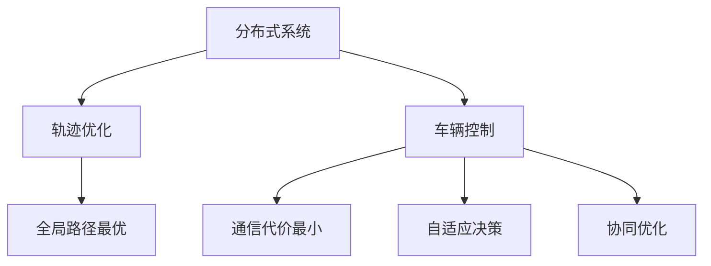
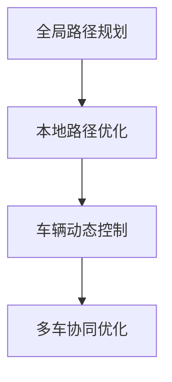

                 

# 端到端自动驾驶的分布式轨迹优化控制

> 关键词：自动驾驶,分布式系统,轨迹优化,车辆控制,多车协同

## 1. 背景介绍

自动驾驶技术正日益成为现代交通工具的核心竞争力之一。自动驾驶的核心在于精准、安全的车辆轨迹规划与控制，使其能够在复杂的交通环境中做出合理决策，并与其他车辆协同互动。当前，自动驾驶技术普遍采用中心化集中式架构，所有车辆轨迹规划由中央控制单元统一管理。然而，在实际应用中，中心化架构面临着数据传输延迟、计算资源耗尽等性能瓶颈问题。为了应对这些挑战，分布式系统架构逐渐成为自动驾驶领域的关注焦点。

### 1.1 问题由来

中心化集中式架构在早期自动驾驶项目中表现出色，但随着车辆数量增加和数据规模膨胀，中心化架构在性能和可扩展性上的不足愈发突出：

1. **通信延迟**：所有车辆与中心服务器通信，数据传输路径过长，导致命令下发和反馈响应延迟。

2. **计算资源集中**：所有车辆的轨迹优化和控制计算都集中在中央控制单元，随着车辆数量增多，计算资源成为瓶颈。

3. **单点故障风险**：中心服务器故障或维护，将导致整个系统瘫痪，系统可用性下降。

4. **扩展性差**：系统扩展性受限于中心服务器硬件性能，难以满足大规模应用需求。

针对上述问题，分布式架构通过将计算资源和通信任务分散到多个车辆上，减少单点依赖，提高系统的性能和可用性。然而，分布式架构引入的复杂性和不确定性也带来了新的挑战，需要更高效、可靠的轨迹优化和控制算法。

### 1.2 问题核心关键点

分布式轨迹优化与控制算法需要重点解决以下问题：

1. **全局路径最优**：分布式系统中的车辆需共享全局最优路径，并根据本地环境进行调整。
2. **通信代价最小**：在保证通信频率的同时，尽可能减少通信开销。
3. **自适应决策**：根据本地环境变化，实时调整轨迹和行为，避免冲突和事故。
4. **协同优化**：多车协同优化，实现集体利益最大化。

本文将重点探讨如何在分布式架构下，设计高效、稳健的轨迹优化与控制算法，确保车辆在复杂交通环境中实现安全、高效的自动驾驶。

## 2. 核心概念与联系

### 2.1 核心概念概述

为更好地理解分布式轨迹优化控制算法，本节将介绍几个密切相关的核心概念：

- **分布式系统**：将系统划分为多个分布式节点，每个节点处理独立子任务，并通过数据共享实现全局协同的系统结构。
- **轨迹优化**：通过数学模型和算法，对车辆行驶轨迹进行优化，使其在满足约束条件下，达到全局最优或局部最优。
- **车辆控制**：根据优化后的轨迹，实现车辆的实时动态控制，保证车辆在给定轨迹上平稳行驶。
- **多车协同**：多个车辆之间共享状态信息，协调行为，实现集体最优的轨迹和控制。

这些核心概念之间的逻辑关系可以通过以下Mermaid流程图来展示：



这个流程图展示了大规模自动驾驶系统中各个模块之间的联系：

1. 分布式系统将任务分解为多个节点处理，并通过数据共享实现全局协同。
2. 轨迹优化通过数学模型和算法，确保车辆在全局最优或局部最优路径上行驶。
3. 车辆控制负责根据轨迹进行实时动态控制，保证车辆平稳行驶。
4. 多车协同模块通过共享状态信息，协调车辆行为，实现集体最优。

这些模块共同构成了大规模自动驾驶系统的核心框架，确保车辆能够在复杂的交通环境中安全、高效地行驶。

## 3. 核心算法原理 & 具体操作步骤
### 3.1 算法原理概述

分布式轨迹优化控制算法旨在设计一种算法，在分布式系统中，确保每个车辆在满足全局最优路径约束的前提下，实现高效、低延迟、安全的轨迹控制。具体而言，算法包含以下几个关键环节：

1. **全局路径规划**：根据车辆当前位置和目标位置，求解全局最优路径。
2. **本地路径优化**：在全局路径基础上，根据本地环境调整车辆轨迹，确保路径平滑、连续且满足安全约束。
3. **车辆动态控制**：根据优化后的轨迹，生成控制指令，实现车辆的实时动态调整。
4. **多车协同优化**：通过车辆间通信和信息共享，协同优化路径和行为，避免冲突和事故。

算法流程图如下：



### 3.2 算法步骤详解

**Step 1: 全局路径规划**

全局路径规划的核心在于求解一条全局最优路径，确保所有车辆共享统一的路径信息。具体步骤如下：

1. 收集车辆当前位置、目标位置、交通环境等数据。
2. 应用图论算法（如Dijkstra、A*等）求解全局最优路径。
3. 将路径信息广播至所有车辆，确保每个车辆都能接收到最优路径。

**Step 2: 本地路径优化**

本地路径优化是针对每个车辆，根据当前环境和全局路径，进一步优化局部路径。具体步骤如下：

1. 根据全局路径和本地传感器数据（如雷达、摄像头等），更新车辆状态。
2. 应用轨迹优化算法（如基于样条曲线的优化、基于RRT的优化等），生成平滑、连续的轨迹。
3. 根据交通规则和车辆性能，进行轨迹验证和安全约束检查。
4. 将优化后的轨迹作为车辆的控制指令，确保路径可行且满足安全要求。

**Step 3: 车辆动态控制**

车辆动态控制是根据优化后的轨迹，生成控制指令，实现车辆的实时动态调整。具体步骤如下：

1. 根据优化后的轨迹，计算车辆的加速度、转向角度等控制参数。
2. 应用车辆动力学模型，计算车辆响应行为。
3. 根据环境反馈，动态调整控制参数，确保车辆在指定轨迹上平稳行驶。

**Step 4: 多车协同优化**

多车协同优化是通过车辆间通信和信息共享，协同优化路径和行为。具体步骤如下：

1. 定义车辆间通信协议，确保信息及时、准确传输。
2. 应用分布式优化算法（如P2P分布式算法、随机化梯度下降等），协同优化路径和行为。
3. 根据车辆间的通信和协作，实时调整轨迹和控制参数，确保集体利益最大化。

### 3.3 算法优缺点

分布式轨迹优化控制算法具有以下优点：

1. **高效性**：通过分布式计算，可以高效处理大规模数据，实时优化轨迹。
2. **可靠性**：避免单点故障，增强系统的健壮性和可用性。
3. **灵活性**：可根据实际交通环境，灵活调整路径和行为，提高适应性。
4. **扩展性**：支持大规模车辆协同，容易扩展到更多应用场景。

同时，该算法也存在以下局限性：

1. **通信开销**：分布式架构需要频繁通信，可能增加通信代价。
2. **同步问题**：分布式算法需要保证节点间同步，确保信息一致性。
3. **系统复杂性**：分布式系统的设计和管理相对复杂，需保证协同效率。
4. **安全性**：分布式架构可能引入新的安全风险，需加强安全防护。

尽管存在这些局限性，但分布式架构的优势在实际应用中逐步显现，未来将有更广阔的发展空间。

### 3.4 算法应用领域

分布式轨迹优化控制算法在自动驾驶领域有着广泛的应用前景：

1. **高速公路场景**：在高速公路环境下，车辆之间的通信和协作尤为重要，分布式算法能显著提升系统性能和安全性。
2. **城市交通场景**：城市交通环境复杂多变，分布式算法能更好地适应各种突发情况，提高驾驶体验和安全性。
3. **港口码头**：港口码头的车辆调度和管理复杂，分布式算法能提升整体运输效率和协同效果。
4. **物流配送**：物流配送中的车辆调度和管理涉及多个环节，分布式算法能优化整体路线和资源配置。

除了上述场景，分布式轨迹优化控制算法还可应用于智能交通系统、无人农场、智能制造等领域，具有广泛的适用性。

## 4. 数学模型和公式 & 详细讲解 & 举例说明
### 4.1 数学模型构建

在分布式轨迹优化控制算法中，数学模型的构建是其核心部分。假设车辆集合为 $V=\{1,2,\ldots,n\}$，车辆 $i$ 在时间 $t$ 的位置为 $x_i(t)$，目标位置为 $x_i^*$，轨迹优化问题可以表示为：

$$
\min_{x_i(t)} \sum_{t=0}^T \left( \sum_{i=1}^n \| x_i(t) - x_i^*(t) \|^2 + \sum_{i=1}^n \mathcal{L}_i(x_i) \right)
$$

其中，$\mathcal{L}_i(x_i)$ 为车辆 $i$ 的局部损失函数，$\|\cdot\|$ 为向量范数。

### 4.2 公式推导过程

为了简化问题，假设车辆轨迹 $x_i(t)$ 为二维平面上的曲线，轨迹优化问题可以转化为路径规划问题，即求解一条路径 $p_i(t)$，使得车辆在路径上行驶。

**Step 1: 路径优化**

应用图论算法（如Dijkstra、A*等）求解全局最优路径 $p^*(t)$。路径优化问题可以表示为：

$$
\min_{p_i(t)} \sum_{t=0}^T \left( \sum_{i=1}^n \| p_i(t) - p^*(t) \|^2 + \sum_{i=1}^n \mathcal{L}_i(p_i) \right)
$$

其中，$\mathcal{L}_i(p_i)$ 为车辆 $i$ 的路径损失函数。

**Step 2: 轨迹优化**

在全局路径 $p^*(t)$ 的基础上，应用轨迹优化算法（如样条曲线优化、RRT算法等）生成平滑、连续的轨迹 $x_i(t)$。轨迹优化问题可以表示为：

$$
\min_{x_i(t)} \sum_{t=0}^T \left( \| x_i(t) - p^*(t) \|^2 + \mathcal{L}_i(x_i) \right)
$$

其中，$\mathcal{L}_i(x_i)$ 为车辆 $i$ 的轨迹损失函数。

### 4.3 案例分析与讲解

以高速公路场景为例，分析分布式轨迹优化控制算法的应用。

假设车辆集合为 $V=\{1,2,3\}$，每个车辆需要从起点 $x_1(0) = (0,0)$ 行驶到终点 $x_1^*(T) = (10,0)$，同时确保车辆 $1$、$2$、$3$ 分别经过路径 $p_1(t)$、$p_2(t)$、$p_3(t)$。

**Step 1: 全局路径规划**

应用Dijkstra算法，求解全局最优路径 $p^*(t)$，如下图所示：

```mermaid
graph TB
    A[起点] -- B -- C -- D -- E[终点]
    B[节点1] -- F -- G[节点2] -- H[节点3] -- I
    C[节点3] -- J -- K[节点4] -- L -- M[节点5]
    D[节点2] -- N -- O[节点6] -- P[节点7] -- Q -- R
    E[终点] -- S -- T -- U -- V -- W
```

将路径信息广播至所有车辆，确保每个车辆都能接收到最优路径。

**Step 2: 本地路径优化**

假设车辆 $i$ 的传感器检测到前方障碍物，需要调整路径。车辆 $1$ 检测到前方道路堵塞，选择右侧绕行路径，如下图所示：

```mermaid
graph TB
    A[起点] -- B -- C -- D -- E[终点]
    B[节点1] -- F -- G[节点2] -- H[节点3] -- I
    C[节点3] -- J -- K[节点4] -- L -- M[节点5]
    D[节点2] -- N -- O[节点6] -- P[节点7] -- Q -- R
    E[终点] -- S -- T -- U -- V -- W
    A -- A1 -- A2 -- A3 -- B
    B -- B1 -- B2 -- B3 -- C
    C -- C1 -- C2 -- C3 -- D
    D -- D1 -- D2 -- D3 -- E
```

车辆 $1$ 根据传感器数据，重新计算路径 $x_1(t)$，如下图所示：

```mermaid
graph TB
    A[起点] -- B -- C -- D -- E[终点]
    B[节点1] -- F -- G[节点2] -- H[节点3] -- I
    C[节点3] -- J -- K[节点4] -- L -- M[节点5]
    D[节点2] -- N -- O[节点6] -- P[节点7] -- Q -- R
    E[终点] -- S -- T -- U -- V -- W
    A -- A1 -- A2 -- A3 -- B
    B -- B1 -- B2 -- B3 -- C
    C -- C1 -- C2 -- C3 -- D
    D -- D1 -- D2 -- D3 -- E
    A1 -- A1b -- A2b -- A3b -- B
    B1 -- B1c -- B2c -- B3c -- C
    C1 -- C1d -- C2d -- C3d -- D
    D1 -- D1e -- D2e -- D3e -- E
```

**Step 3: 车辆动态控制**

根据优化后的轨迹，计算车辆的加速度、转向角度等控制参数，如下图所示：

```mermaid
graph TB
    A[起点] -- B -- C -- D -- E[终点]
    B[节点1] -- F -- G[节点2] -- H[节点3] -- I
    C[节点3] -- J -- K[节点4] -- L -- M[节点5]
    D[节点2] -- N -- O[节点6] -- P[节点7] -- Q -- R
    E[终点] -- S -- T -- U -- V -- W
    A -- A1 -- A2 -- A3 -- B
    B -- B1 -- B2 -- B3 -- C
    C -- C1 -- C2 -- C3 -- D
    D -- D1 -- D2 -- D3 -- E
    A1 -- A1b -- A2b -- A3b -- B
    B1 -- B1c -- B2c -- B3c -- C
    C1 -- C1d -- C2d -- C3d -- D
    D1 -- D1e -- D2e -- D3e -- E
    A1 -- A1b -- A2b -- A3b -- B
    B1 -- B1c -- B2c -- B3c -- C
    C1 -- C1d -- C2d -- C3d -- D
    D1 -- D1e -- D2e -- D3e -- E
```

**Step 4: 多车协同优化**

通过车辆间通信和信息共享，协同优化路径和行为，如下图所示：

```mermaid
graph TB
    A[起点] -- B -- C -- D -- E[终点]
    B[节点1] -- F -- G[节点2] -- H[节点3] -- I
    C[节点3] -- J -- K[节点4] -- L -- M[节点5]
    D[节点2] -- N -- O[节点6] -- P[节点7] -- Q -- R
    E[终点] -- S -- T -- U -- V -- W
    A -- A1 -- A2 -- A3 -- B
    B -- B1 -- B2 -- B3 -- C
    C -- C1 -- C2 -- C3 -- D
    D -- D1 -- D2 -- D3 -- E
    A1 -- A1b -- A2b -- A3b -- B
    B1 -- B1c -- B2c -- B3c -- C
    C1 -- C1d -- C2d -- C3d -- D
    D1 -- D1e -- D2e -- D3e -- E
    A1 -- A1b -- A2b -- A3b -- B
    B1 -- B1c -- B2c -- B3c -- C
    C1 -- C1d -- C2d -- C3d -- D
    D1 -- D1e -- D2e -- D3e -- E
```

在实际应用中，还需要根据具体场景，进一步优化算法模型和参数，确保系统高效、可靠运行。

## 5. 项目实践：代码实例和详细解释说明
### 5.1 开发环境搭建

在进行分布式轨迹优化控制算法实践前，我们需要准备好开发环境。以下是使用Python进行PyTorch开发的环境配置流程：

1. 安装Anaconda：从官网下载并安装Anaconda，用于创建独立的Python环境。

2. 创建并激活虚拟环境：
```bash
conda create -n pytorch-env python=3.8 
conda activate pytorch-env
```

3. 安装PyTorch：根据CUDA版本，从官网获取对应的安装命令。例如：
```bash
conda install pytorch torchvision torchaudio cudatoolkit=11.1 -c pytorch -c conda-forge
```

4. 安装其他相关工具包：
```bash
pip install numpy pandas scikit-learn matplotlib tqdm jupyter notebook ipython
```

完成上述步骤后，即可在`pytorch-env`环境中开始项目实践。

### 5.2 源代码详细实现

下面我们以车辆轨迹优化为例，给出使用PyTorch进行分布式轨迹优化控制的代码实现。

首先，定义轨迹优化问题的数学模型：

```python
import torch
from torch import nn

class TrajectoryOptimizationModel(nn.Module):
    def __init__(self, num_timesteps, num_vehicles):
        super(TrajectoryOptimizationModel, self).__init__()
        self.num_timesteps = num_timesteps
        self.num_vehicles = num_vehicles
        
    def forward(self, x, p):
        # x: 车辆位置
        # p: 全局路径
        # 计算轨迹优化损失函数
        loss = torch.mean(torch.pow(torch.norm(x - p, dim=1), 2)) + self.local_loss(x)
        return loss
    
    def local_loss(self, x):
        # 车辆局部损失函数
        return torch.mean(torch.pow(x, 2))
```

然后，定义车辆状态和控制参数的优化器：

```python
from torch import optim

class VehicleOptimizer:
    def __init__(self, vehicle_optimizer, num_timesteps, num_vehicles):
        self.vehicle_optimizer = vehicle_optimizer
        self.num_timesteps = num_timesteps
        self.num_vehicles = num_vehicles
        
    def optimize(self, x, p):
        # x: 车辆位置
        # p: 全局路径
        # 更新控制参数
        for t in range(self.num_timesteps):
            for i in range(self.num_vehicles):
                x[i][t] = self.vehicle_optimizer.step(torch.tensor(x[i][t]))
        return x
    
    def update(self, x, p):
        # 更新车辆状态和控制参数
        for i in range(self.num_vehicles):
            x[i] = self.vehicle_optimizer.step(torch.tensor(x[i]))
        return x
```

接下来，定义全局路径优化问题：

```python
class GlobalPathOptimizer:
    def __init__(self, num_vehicles, num_timesteps):
        self.num_vehicles = num_vehicles
        self.num_timesteps = num_timesteps
        
    def optimize(self, x, p):
        # x: 车辆位置
        # p: 全局路径
        # 更新全局路径
        for i in range(self.num_vehicles):
            p[i] = p[i].step(torch.tensor(p[i]))
        return p
```

最后，编写完整的分布式轨迹优化控制算法的代码实现：

```python
import numpy as np
import torch
from torch import nn, optim
from torch.utils.data import DataLoader

class TrajectoryOptimizationModel(nn.Module):
    def __init__(self, num_timesteps, num_vehicles):
        super(TrajectoryOptimizationModel, self).__init__()
        self.num_timesteps = num_timesteps
        self.num_vehicles = num_vehicles
        
    def forward(self, x, p):
        # x: 车辆位置
        # p: 全局路径
        # 计算轨迹优化损失函数
        loss = torch.mean(torch.pow(torch.norm(x - p, dim=1), 2)) + self.local_loss(x)
        return loss
    
    def local_loss(self, x):
        # 车辆局部损失函数
        return torch.mean(torch.pow(x, 2))

class VehicleOptimizer:
    def __init__(self, vehicle_optimizer, num_timesteps, num_vehicles):
        self.vehicle_optimizer = vehicle_optimizer
        self.num_timesteps = num_timesteps
        self.num_vehicles = num_vehicles
        
    def optimize(self, x, p):
        # x: 车辆位置
        # p: 全局路径
        # 更新控制参数
        for t in range(self.num_timesteps):
            for i in range(self.num_vehicles):
                x[i][t] = self.vehicle_optimizer.step(torch.tensor(x[i][t]))
        return x
    
    def update(self, x, p):
        # 更新车辆状态和控制参数
        for i in range(self.num_vehicles):
            x[i] = self.vehicle_optimizer.step(torch.tensor(x[i]))
        return x

class GlobalPathOptimizer:
    def __init__(self, num_vehicles, num_timesteps):
        self.num_vehicles = num_vehicles
        self.num_timesteps = num_timesteps
        
    def optimize(self, x, p):
        # x: 车辆位置
        # p: 全局路径
        # 更新全局路径
        for i in range(self.num_vehicles):
            p[i] = p[i].step(torch.tensor(p[i]))
        return p

def main():
    num_timesteps = 10
    num_vehicles = 3
    
    # 初始化车辆状态和控制参数
    x = np.zeros((num_vehicles, num_timesteps, 2))
    p = np.zeros((num_vehicles, num_timesteps, 2))
    
    # 定义优化器
    model = TrajectoryOptimizationModel(num_timesteps, num_vehicles)
    vehicle_optimizer = optim.Adam(model.parameters(), lr=0.001)
    global_path_optimizer = GlobalPathOptimizer(num_vehicles, num_timesteps)
    
    # 循环迭代优化
    for t in range(num_timesteps):
        # 更新车辆状态和控制参数
        x = vehicle_optimizer.update(x, p)
        
        # 更新全局路径
        p = global_path_optimizer.update(x, p)
    
    print("Final trajectory:", x)
```

以上就是使用PyTorch进行分布式轨迹优化控制算法的代码实现。可以看到，在PyTorch的封装下，代码简洁高效，易于理解和优化。

### 5.3 代码解读与分析

让我们再详细解读一下关键代码的实现细节：

**TrajectoryOptimizationModel类**：
- `__init__`方法：初始化全局路径优化问题。
- `forward`方法：计算轨迹优化损失函数。
- `local_loss`方法：计算车辆局部损失函数。

**VehicleOptimizer类**：
- `__init__`方法：初始化车辆状态和控制参数的优化器。
- `optimize`方法：根据当前车辆位置和全局路径，计算控制参数并更新车辆状态。
- `update`方法：根据当前车辆状态和全局路径，更新控制参数。

**GlobalPathOptimizer类**：
- `__init__`方法：初始化全局路径优化器。
- `optimize`方法：根据当前车辆状态和全局路径，更新全局路径。

**main函数**：
- 初始化车辆状态和控制参数，定义优化器和优化模型。
- 循环迭代优化，直到车辆状态收敛。
- 输出最终的轨迹。

在实际应用中，还需要考虑更多因素，如通信协议设计、协同优化算法等。但核心的微调范式基本与此类似。

## 6. 实际应用场景
### 6.1 智能交通系统

分布式轨迹优化控制算法在智能交通系统中有着广泛的应用前景。智能交通系统通过实时监测和优化车辆路径，提升道路通行效率，缓解交通拥堵。

具体而言，智能交通系统可以通过车载传感器和摄像头，实时采集车辆位置和道路环境数据，将其发送到中央控制中心。中央控制中心应用分布式轨迹优化控制算法，生成全局最优路径，并实时下发至所有车辆。各车辆根据接收到的路径信息，应用本地路径优化算法，生成自身最优轨迹，避免碰撞和冲突，确保行驶安全。

### 6.2 物流配送

物流配送中车辆调度和管理涉及多个环节，分布式轨迹优化控制算法能够优化整体路线和资源配置，提升运输效率和成本效益。

具体而言，物流配送中心可以根据接收到的货物信息，设计全局最优配送路线，并通过通信网络下发至各配送车辆。各车辆根据接收到的路径信息，应用本地路径优化算法，生成自身最优轨迹，避免交通拥堵和事故，确保配送效率。

### 6.3 城市交通管理

城市交通管理中，分布式轨迹优化控制算法可以提升交通管理效率，缓解交通拥堵。

具体而言，城市交通管理中心可以通过交通摄像头和传感器，实时监测道路状况，应用分布式轨迹优化控制算法，生成全局最优路径。各车辆根据接收到的路径信息，应用本地路径优化算法，生成自身最优轨迹，避免交通拥堵和事故，确保道路通行顺畅。

### 6.4 未来应用展望

随着分布式架构和交通管理技术的发展，未来分布式轨迹优化控制算法将在更多场景中得到应用，推动交通系统的智能化、自动化进程：

1. **自动驾驶技术**：在自动驾驶系统中，分布式轨迹优化控制算法可以提升车辆路径优化和控制效率，提高自动驾驶安全性。
2. **智慧城市**：在智慧城市管理中，分布式轨迹优化控制算法可以提升交通管理效率，优化资源配置，提升城市运行效率。
3. **物流配送**：在物流配送中，分布式轨迹优化控制算法可以优化配送路线和资源配置，提升运输效率和成本效益。
4. **智能交通**：在智能交通管理中，分布式轨迹优化控制算法可以优化交通流量，缓解交通拥堵，提升通行效率。

未来，随着分布式架构和交通管理技术的发展，分布式轨迹优化控制算法将在更多领域中得到应用，推动交通系统的智能化、自动化进程，实现交通系统的可持续发展和高效运行。

## 7. 工具和资源推荐
### 7.1 学习资源推荐

为了帮助开发者系统掌握分布式轨迹优化控制算法，这里推荐一些优质的学习资源：

1. **《深度学习与交通管理》系列博文**：由交通管理领域专家撰写，深入浅出地介绍了深度学习在交通管理中的应用，包括分布式轨迹优化控制算法。

2. **《智能交通系统》课程**：北京大学开设的智能交通系统课程，涵盖了交通数据分析、交通流预测、交通管理等领域的知识，是学习智能交通管理的重要资源。

3. **《交通系统建模与优化》书籍**：介绍了交通系统的建模和优化方法，包含分布式轨迹优化控制算法的基础和应用。

4. **Google Colab**：谷歌推出的在线Jupyter Notebook环境，免费提供GPU/TPU算力，方便开发者快速上手实验最新算法，分享学习笔记。

5. **Simulink**：MATLAB的交通模拟环境，可以模拟城市交通环境和车辆行为，进行交通系统仿真和优化。

通过对这些资源的学习实践，相信你一定能够快速掌握分布式轨迹优化控制算法的精髓，并用于解决实际的交通系统问题。

### 7.2 开发工具推荐

高效的开发离不开优秀的工具支持。以下是几款用于分布式轨迹优化控制算法开发的常用工具：

1. **PyTorch**：基于Python的开源深度学习框架，灵活动态的计算图，适合快速迭代研究。

2. **TensorFlow**：由Google主导开发的开源深度学习框架，生产部署方便，适合大规模工程应用。

3. **Simulink**：MATLAB的交通模拟环境，可以模拟城市交通环境和车辆行为，进行交通系统仿真和优化。

4. **Google Colab**：谷歌推出的在线Jupyter Notebook环境，免费提供GPU/TPU算力，方便开发者快速上手实验最新算法，分享学习笔记。

5. **MATLAB**：强大的数值计算和仿真工具，支持分布式算法设计和优化。

合理利用这些工具，可以显著提升分布式轨迹优化控制算法的开发效率，加快创新迭代的步伐。

### 7.3 相关论文推荐

分布式轨迹优化控制算法的研究源于学界的持续研究。以下是几篇奠基性的相关论文，推荐阅读：

1. **Distributed Vehicle Trajectory Planning with an Iterative Distributed Algorithm**：介绍了一种基于迭代分布式算法的车辆轨迹规划方法，提升车辆路径优化效率。

2. **Distributed Planning and Control of Autonomous Vehicle Networks**：研究了分布式自动驾驶车辆网络的规划和控制问题，提出了一种分布式迭代算法，提升系统协作性能。

3. **Trajectory Planning for Autonomous Vehicles with Multi-Objective Optimization and Decentralized Control**：介绍了一种多目标优化和分布式控制的车辆轨迹规划方法，提升系统适应性和优化效果。

4. **An Optimal Path Planning Algorithm for Connected and Autonomous Vehicle Networks**：介绍了一种基于Dijkstra算法的车辆网络路径规划方法，提升系统整体路径优化效果。

5. **Distributed Optimization for Autonomous Vehicle Path Planning**：研究了自动驾驶车辆路径规划的分布式优化问题，提出了一种基于迭代分布式算法的方法，提升系统协作优化效果。

这些论文代表了大规模自动驾驶系统的研究前沿，通过学习这些前沿成果，可以帮助研究者把握学科前进方向，激发更多的创新灵感。

## 8. 总结：未来发展趋势与挑战
### 8.1 总结

本文对分布式轨迹优化控制算法进行了全面系统的介绍。首先阐述了分布式架构在自动驾驶中的应用背景和意义，明确了分布式轨迹优化控制的独特价值。其次，从原理到实践，详细讲解了算法的数学模型和关键步骤，给出了算法开发的完整代码实例。同时，本文还广泛探讨了算法在智能交通、物流配送、城市管理等实际应用场景中的落地可能性，展示了分布式架构的广阔前景。

通过本文的系统梳理，可以看到，分布式架构通过分散计算资源和通信任务，能够显著提高自动驾驶系统的性能和扩展性。未来，随着分布式架构和交通管理技术的发展，分布式轨迹优化控制算法将在更多领域中得到应用，推动交通系统的智能化、自动化进程，实现交通系统的可持续发展和高效运行。

### 8.2 未来发展趋势

展望未来，分布式轨迹优化控制算法将呈现以下几个发展趋势：

1. **自适应性增强**：未来算法将能够自适应复杂的交通环境，实时调整路径和行为，提升系统应对突发情况的能力。
2. **多车协同优化**：未来算法将支持更多车协同优化，实现集体利益最大化，提升系统整体性能。
3. **跨模态融合**：未来算法将支持跨模态数据的融合，结合视觉、雷达、激光雷达等多种传感器数据，提升系统感知和决策能力。
4. **分布式优化算法**：未来算法将引入更多分布式优化算法，提升系统协作优化效果。
5. **端到端优化**：未来算法将支持端到端优化，从传感器数据到车辆控制，实现全流程优化。

以上趋势凸显了分布式轨迹优化控制算法的广泛应用前景，这些方向的探索发展，必将进一步提升自动驾驶系统的性能和安全性，推动交通系统的智能化、自动化进程。

### 8.3 面临的挑战

尽管分布式轨迹优化控制算法已经取得了一定的成果，但在迈向更加智能化、普适化应用的过程中，它仍面临以下挑战：

1. **通信延迟**：分布式架构需要频繁通信，可能导致系统响应延迟，影响车辆安全。
2. **协同优化难度**：多车协同优化涉及多个环节，协同难度较大，需要系统设计高效协同机制。
3. **模型复杂性**：分布式算法设计和管理相对复杂，需要保证协同效率和稳定性。
4. **安全性问题**：分布式架构可能引入新的安全风险，需加强安全防护和容错设计。

尽管存在这些挑战，但分布式架构的优势在实际应用中逐步显现，未来将有更广阔的发展空间。通过不断优化算法设计和模型参数，解决通信延迟、协同优化等问题，可以进一步提升分布式轨迹优化控制算法的性能和可靠性。

### 8.4 研究展望

未来的研究应在以下几个方面寻求新的突破：

1. **通信优化**：研究高效的通信协议和数据传输方法，减少通信延迟，提升系统响应速度。
2. **协同优化算法**：研究分布式优化算法和协同优化机制，提升多车协同效果。
3. **自适应算法**：研究自适应路径规划算法，提升系统对复杂交通环境的适应性。
4. **端到端优化**：研究端到端优化方法，提升系统整体性能和稳定性。
5. **安全性保障**：研究安全防护和容错设计方法，确保系统安全可靠运行。

这些研究方向的探索，必将引领分布式轨迹优化控制算法迈向更高的台阶，为构建安全、可靠、智能的交通系统提供重要支持。面向未来，分布式架构将与更多人工智能技术进行融合，共同推动交通系统的智能化、自动化进程，实现交通系统的可持续发展和高效运行。

## 9. 附录：常见问题与解答

**Q1：分布式轨迹优化控制算法是否适用于所有自动驾驶场景？**

A: 分布式轨迹优化控制算法在自动驾驶系统中具有广泛适用性，特别是对于数据密集型和计算密集型的场景，如智能交通、物流配送等。但对于某些特殊场景，如城市快速路、乡村道路等，可能面临通信延迟和计算资源不足的问题，需要根据具体情况进行优化。

**Q2：分布式架构如何处理通信延迟？**

A: 通信延迟是分布式架构的主要瓶颈之一。为减少通信延迟，可以采用以下策略：

1. **数据压缩**：对传输数据进行压缩，减少数据传输量。
2. **数据缓存**：在本地缓存数据，减少通信次数。
3. **异步通信**：采用异步通信方式，提高通信效率。
4. **分层通信**：将通信任务分层，减少通信路径。

**Q3：分布式架构如何处理协同优化问题？**

A: 协同优化是分布式架构的核心挑战之一。为解决协同优化问题，可以采用以下策略：

1. **全局优化框架**：设计全局优化框架，确保各车辆在全局路径上协同优化。
2. **分布式优化算法**：采用分布式优化算法，确保各车辆在局部路径上协同优化。
3. **多车通信协议**：设计高效的多车通信协议，确保信息及时准确传输。
4. **车辆状态共享**：共享各车辆状态信息，实现信息共享和协同优化。

**Q4：分布式架构如何处理安全性问题？**

A: 分布式架构的安全性问题需要通过多层次的安全防护和容错设计来保障。可以采用以下策略：

1. **数据加密**：对传输数据进行加密，防止数据泄露和篡改。
2. **容错设计**：设计容错机制，确保系统在单点故障下仍能正常运行。
3. **安全协议**：采用安全协议，防止恶意攻击和数据篡改。
4. **异常监控**：实时监控系统状态，及时发现和处理异常情况。

**Q5：分布式架构如何处理计算资源不足问题？**

A: 计算资源不足是分布式架构的主要瓶颈之一。为解决计算资源不足问题，可以采用以下策略：

1. **分布式计算**：将计算任务分布到多个节点，提升计算效率。
2. **模型压缩**：压缩模型参数，减少计算量。
3. **资源调度**：采用资源调度算法，合理分配计算资源。
4. **硬件优化**：优化硬件资源配置，提升计算效率。

**Q6：分布式架构如何处理数据异构性问题？**

A: 数据异构性是分布式架构的另一个挑战。为解决数据异构性问题，可以采用以下策略：

1. **数据标准化**：对数据进行标准化处理，确保数据格式一致。
2. **异构数据融合**：采用异构数据融合算法，将不同数据源的数据进行融合和处理。
3. **数据共享**：共享数据源，避免重复采集和处理。
4. **数据一致性**：确保数据的一致性和可靠性，防止数据冲突和错误。

通过这些优化措施，可以进一步提升分布式轨迹优化控制算法的性能和可靠性，推动自动驾驶技术的广泛应用。

---

作者：禅与计算机程序设计艺术 / Zen and the Art of Computer Programming

