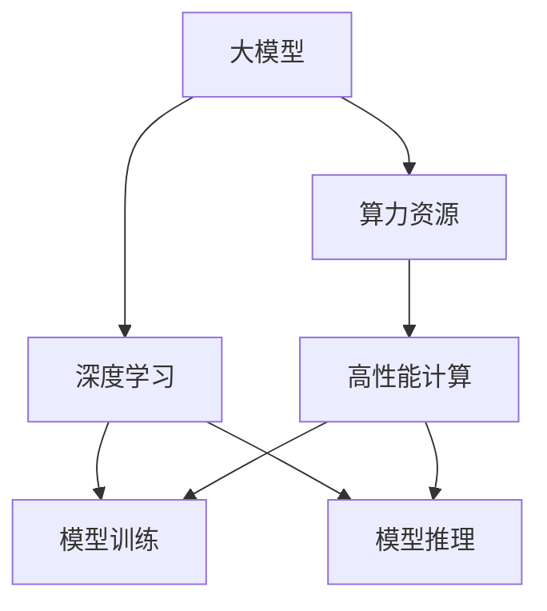

                 

# 算力资源对大模型企业发展的影响

> 关键词：算力资源, 大模型, 企业发展, 深度学习, 高性能计算

## 1. 背景介绍

### 1.1 问题由来

近年来，大模型在人工智能(AI)领域迅速崛起，成为推动AI技术进步的重要引擎。这些大模型，如GPT-3、BERT等，通常包含数十亿甚至上百亿个参数，需要海量的计算资源进行训练和推理。因此，算力资源成为大模型企业发展的核心瓶颈。

### 1.2 问题核心关键点

算力资源对大模型企业发展的核心关键点主要包括以下几个方面：

- 计算资源需求巨大：大模型的训练和推理需要大量的GPU、TPU等高性能计算资源，每亿参数的模型至少需要数亿计算单元。
- 计算成本高昂：高性能计算设备的租赁成本高，单位时间训练和推理开销大。
- 资源获取难：很多大模型企业需要构建自有算力基础设施，但硬件采购和部署周期长，投资大。
- 资源利用效率低：计算资源往往闲置率高，且难以进行细粒度的任务调度。
- 数据移动复杂：大模型训练需要大规模的数据集，数据移动和传输开销大，影响训练效率。
- 资源管理和调度：算力资源的管理和调度需要高性能的调度系统，系统复杂度大。

这些关键点表明，算力资源是大模型企业发展的重要挑战，也是企业必须优先解决的核心问题。本文将从算法原理、操作步骤、应用领域、数学模型等方面，详细探讨算力资源对大模型企业发展的具体影响。

## 2. 核心概念与联系

### 2.1 核心概念概述

为了更好地理解算力资源对大模型企业发展的影响，本节将介绍几个密切相关的核心概念：

- 大模型：指具有亿亿量级参数的深度学习模型，通常用于大规模自然语言处理、图像识别、语音识别等任务。
- 算力资源：指支撑大模型训练和推理所需的高性能计算资源，包括GPU、TPU等。
- 深度学习：指一类基于神经网络的机器学习算法，通过多层次的非线性变换，实现对复杂数据的建模和预测。
- 高性能计算：指使用专门硬件和软件进行大规模计算的系统，旨在提高计算效率和能力。
- 模型训练：指通过大量标注数据，不断调整模型参数，使得模型在目标任务上取得优异的预测能力。
- 模型推理：指在模型训练完成后，使用新的输入数据进行预测或生成。

这些核心概念之间的逻辑关系可以通过以下Mermaid流程图来展示：



这个流程图展示了大模型、算力资源、深度学习、模型训练、模型推理之间的关系：

1. 大模型通过深度学习技术实现对复杂数据的建模和预测。
2. 算力资源支撑大模型的训练和推理，是深度学习算法高效运行的基础。
3. 模型训练是构建大模型的关键过程，需要大量的算力资源。
4. 模型推理是大模型应用的主要形式，依赖于高效的算力资源。

这些概念共同构成了大模型企业的核心业务和关键挑战，使得算力资源成为必须优先解决的瓶颈问题。

## 3. 核心算法原理 & 具体操作步骤

### 3.1 算法原理概述

大模型的训练和推理通常涉及以下几个核心算法：

1. 深度神经网络：通过多层非线性变换，对输入数据进行建模和预测。
2. 反向传播算法：通过梯度下降等优化算法，调整神经网络参数以最小化损失函数。
3. 分布式训练：将大规模数据集划分为多个小批次，并在多个计算节点上并行训练。
4. 异构并行计算：在异构硬件（如GPU、TPU等）上并行计算，提高训练和推理效率。
5. 自动混合精度：将浮点运算转换为更高效的定点运算，减少存储和计算开销。
6. 数据并行：将输入数据并行化，提高数据传输和处理效率。

这些算法需要大量的算力资源进行支撑，因此算力资源对大模型企业发展的关键性不言而喻。

### 3.2 算法步骤详解

基于算力资源的大模型训练和推理通常包括以下几个关键步骤：

**Step 1: 数据准备与预处理**

- 收集和准备大规模标注数据集，如大规模文本、图像、视频等。
- 对数据进行预处理，包括清洗、归一化、分片等操作。

**Step 2: 选择合适的硬件设备**

- 根据模型规模和计算需求，选择合适的GPU、TPU等高性能计算资源。
- 考虑设备数量、性能、成本等因素，进行设备采购和部署。

**Step 3: 搭建分布式训练环境**

- 搭建高性能计算集群，将计算资源集中管理。
- 部署分布式训练框架，如TensorFlow、PyTorch等，实现多节点并行训练。

**Step 4: 优化模型训练流程**

- 使用分布式训练、异构并行、自动混合精度等技术，优化训练效率。
- 定期在验证集上评估模型性能，避免过拟合。

**Step 5: 进行模型推理**

- 部署推理服务，将训练好的模型封装为标准API接口。
- 对新的输入数据进行推理，生成预测结果。

### 3.3 算法优缺点

基于算力资源的大模型训练和推理方法具有以下优点：

1. 高效性：利用分布式训练和异构并行计算技术，大大提高了计算效率。
2. 可扩展性：可以根据任务需求动态调整计算资源，实现高效的任务调度。
3. 精度高：通过深度神经网络和反向传播算法，模型可以获得更高的预测精度。
4. 灵活性：可以根据不同的应用场景，选择不同的硬件设备和算法策略。

同时，该方法也存在一定的局限性：

1. 成本高：高性能计算设备的租赁和采购成本高，单位时间训练和推理开销大。
2. 管理复杂：分布式训练和异构并行计算系统的管理复杂，需要专业的运维团队。
3. 数据依赖：大模型训练需要大量的数据集，数据传输和移动开销大。
4. 过拟合风险：分布式训练中，不同节点的数据差异可能导致过拟合。
5. 资源利用率低：计算资源往往闲置率高，且难以进行细粒度的任务调度。

尽管存在这些局限性，但就目前而言，基于算力资源的大模型训练和推理方法仍是大模型企业应用的主流范式。未来相关研究的重点在于如何进一步降低计算成本，提高资源利用率，同时兼顾模型的精度和灵活性。

### 3.4 算法应用领域

基于算力资源的大模型训练和推理方法，在多个领域得到了广泛的应用，例如：

- 自然语言处理：如文本分类、情感分析、机器翻译等任务。通过大规模语料预训练，大模型可以在这些任务上取得优异的表现。
- 图像识别：如目标检测、图像分割、人脸识别等任务。大模型通过大规模图像数据预训练，能够在这些任务上获得高精度的预测结果。
- 语音识别：如自动语音识别、语音合成等任务。大模型通过大规模语音数据预训练，能够在这些任务上实现高效的语音处理。
- 推荐系统：如商品推荐、音乐推荐等任务。大模型通过大规模用户行为数据预训练，能够在这些任务上提供个性化的推荐服务。
- 智能客服：如智能对话、语音识别等任务。大模型通过大规模客户对话数据预训练，能够在这些任务上提供自然流畅的交互体验。

除了上述这些经典任务外，大模型训练和推理方法也被创新性地应用到更多场景中，如视频分析、智能投顾、医疗诊断等，为各行各业带来了新的创新突破。随着大模型技术的不断演进，未来算力资源对大模型企业发展的意义将更加凸显。

## 4. 数学模型和公式 & 详细讲解 & 举例说明

### 4.1 数学模型构建

本节将使用数学语言对基于算力资源的大模型训练和推理过程进行更加严格的刻画。

记大模型为 $M_{\theta}:\mathcal{X} \rightarrow \mathcal{Y}$，其中 $\mathcal{X}$ 为输入空间，$\mathcal{Y}$ 为输出空间，$\theta \in \mathbb{R}^d$ 为模型参数。假设数据集为 $D=\{(x_i,y_i)\}_{i=1}^N, x_i \in \mathcal{X}, y_i \in \mathcal{Y}$。

定义模型 $M_{\theta}$ 在数据样本 $(x,y)$ 上的损失函数为 $\ell(M_{\theta}(x),y)$，则在数据集 $D$ 上的经验风险为：

$$
\mathcal{L}(\theta) = \frac{1}{N} \sum_{i=1}^N \ell(M_{\theta}(x_i),y_i)
$$

大模型训练和推理的优化目标是最小化经验风险，即找到最优参数：

$$
\theta^* = \mathop{\arg\min}_{\theta} \mathcal{L}(\theta)
$$

在实践中，我们通常使用基于梯度的优化算法（如SGD、Adam等）来近似求解上述最优化问题。设 $\eta$ 为学习率，$\lambda$ 为正则化系数，则参数的更新公式为：

$$
\theta \leftarrow \theta - \eta \nabla_{\theta}\mathcal{L}(\theta) - \eta\lambda\theta
$$

其中 $\nabla_{\theta}\mathcal{L}(\theta)$ 为损失函数对参数 $\theta$ 的梯度，可通过反向传播算法高效计算。

### 4.2 公式推导过程

以下我们以图像分类任务为例，推导交叉熵损失函数及其梯度的计算公式。

假设模型 $M_{\theta}$ 在输入 $x$ 上的输出为 $\hat{y}=M_{\theta}(x) \in [0,1]$，表示样本属于正类的概率。真实标签 $y \in \{0,1\}$。则二分类交叉熵损失函数定义为：

$$
\ell(M_{\theta}(x),y) = -[y\log \hat{y} + (1-y)\log (1-\hat{y})]
$$

将其代入经验风险公式，得：

$$
\mathcal{L}(\theta) = -\frac{1}{N}\sum_{i=1}^N [y_i\log M_{\theta}(x_i)+(1-y_i)\log(1-M_{\theta}(x_i))]
$$

根据链式法则，损失函数对参数 $\theta_k$ 的梯度为：

$$
\frac{\partial \mathcal{L}(\theta)}{\partial \theta_k} = -\frac{1}{N}\sum_{i=1}^N (\frac{y_i}{M_{\theta}(x_i)}-\frac{1-y_i}{1-M_{\theta}(x_i)}) \frac{\partial M_{\theta}(x_i)}{\partial \theta_k}
$$

其中 $\frac{\partial M_{\theta}(x_i)}{\partial \theta_k}$ 可进一步递归展开，利用自动微分技术完成计算。

在得到损失函数的梯度后，即可带入参数更新公式，完成模型的迭代优化。重复上述过程直至收敛，最终得到适应数据集 $D$ 的最优模型参数 $\theta^*$。

## 5. 项目实践：代码实例和详细解释说明

### 5.1 开发环境搭建

在进行大模型训练和推理实践前，我们需要准备好开发环境。以下是使用Python进行TensorFlow开发的环境配置流程：

1. 安装Anaconda：从官网下载并安装Anaconda，用于创建独立的Python环境。

2. 创建并激活虚拟环境：
```bash
conda create -n tf-env python=3.8 
conda activate tf-env
```

3. 安装TensorFlow：根据CUDA版本，从官网获取对应的安装命令。例如：
```bash
conda install tensorflow==2.8.0 tf-nightly
```

4. 安装TensorFlow Addons：用于支持高阶API和功能增强。
```bash
pip install tensorflow-addons
```

5. 安装各类工具包：
```bash
pip install numpy pandas scikit-learn matplotlib tqdm jupyter notebook ipython
```

完成上述步骤后，即可在`tf-env`环境中开始训练和推理实践。

### 5.2 源代码详细实现

下面我们以图像分类任务为例，给出使用TensorFlow对ResNet模型进行训练和推理的PyTorch代码实现。

首先，定义图像分类任务的数据处理函数：

```python
from tensorflow.keras.preprocessing.image import ImageDataGenerator
from tensorflow.keras.applications.resnet50 import preprocess_input
from tensorflow.keras.preprocessing import image

def preprocess_data(image_path):
    img = image.load_img(image_path, target_size=(224, 224))
    x = image.img_to_array(img)
    x = np.expand_dims(x, axis=0)
    x = preprocess_input(x)
    return x

def load_data(batch_size):
    train_datagen = ImageDataGenerator(rescale=1./255)
    train_generator = train_datagen.flow_from_directory(
        'train/', target_size=(224, 224), batch_size=batch_size, class_mode='categorical')
    val_datagen = ImageDataGenerator(rescale=1./255)
    val_generator = val_datagen.flow_from_directory(
        'val/', target_size=(224, 224), batch_size=batch_size, class_mode='categorical')
    return train_generator, val_generator

# 加载数据
batch_size = 16
train_generator, val_generator = load_data(batch_size)
```

然后，定义模型和优化器：

```python
from tensorflow.keras.applications.resnet50 import ResNet50
from tensorflow.keras.optimizers import Adam

model = ResNet50(weights='imagenet', include_top=False)
model.trainable = True
for layer in model.layers:
    layer.trainable = False

input_shape = (224, 224, 3)
output_shape = (1000,)
model.add(Dense(output_shape, activation='softmax'))

optimizer = Adam(lr=0.0001)
```

接着，定义训练和评估函数：

```python
def train_epoch(model, data_generator, batch_size, optimizer):
    model.train()
    for x_batch, y_batch in data_generator:
        x_batch = x_batch / 255
        with tf.GradientTape() as tape:
            y_pred = model(x_batch, training=True)
            loss = tf.reduce_mean(tf.keras.losses.categorical_crossentropy(y_batch, y_pred))
        grads = tape.gradient(loss, model.trainable_variables)
        optimizer.apply_gradients(zip(grads, model.trainable_variables))
    return loss.numpy()

def evaluate(model, data_generator, batch_size):
    model.eval()
    total_loss = 0
    total_correct = 0
    for x_batch, y_batch in data_generator:
        x_batch = x_batch / 255
        y_pred = model(x_batch, training=False)
        total_loss += tf.reduce_mean(tf.keras.losses.categorical_crossentropy(y_batch, y_pred)).numpy()
        total_correct += tf.reduce_mean(tf.keras.metrics.categorical_accuracy(y_batch, y_pred)).numpy()
    return total_loss / len(data_generator), total_correct / len(data_generator)

# 训练和评估
epochs = 10
for epoch in range(epochs):
    train_loss = train_epoch(model, train_generator, batch_size, optimizer)
    val_loss, val_acc = evaluate(model, val_generator, batch_size)
    print(f"Epoch {epoch+1}, train loss: {train_loss:.4f}, val loss: {val_loss:.4f}, val acc: {val_acc:.4f}")
```

以上就是一个使用TensorFlow进行ResNet模型图像分类任务训练和推理的完整代码实现。可以看到，得益于TensorFlow的强大封装，我们可以用相对简洁的代码完成模型的训练和推理。

### 5.3 代码解读与分析

让我们再详细解读一下关键代码的实现细节：

**preprocess_data函数**：
- 加载并预处理单个图像数据，确保输入数据的格式和尺寸符合模型要求。

**load_data函数**：
- 定义ImageDataGenerator用于数据增强和预处理，生成批次化的训练和验证数据。

**ResNet50模型**：
- 使用预训练的ResNet50模型，去除顶层全连接层，添加新的全连接层进行分类。

**optimizer定义**：
- 定义Adam优化器，设置学习率。

**train_epoch函数**：
- 训练函数，在每个批次上进行前向传播和反向传播，计算梯度并更新模型参数。

**evaluate函数**：
- 评估函数，计算模型在验证集上的损失和准确率。

**训练和评估流程**：
- 定义总的epoch数，开始循环迭代
- 每个epoch内，在训练集上训练，输出训练损失和验证损失、准确率
- 所有epoch结束后，给出最终训练结果

可以看到，TensorFlow配合高阶API和数据增强技术，使得模型训练和推理的代码实现变得简洁高效。开发者可以将更多精力放在数据处理、模型改进等高层逻辑上，而不必过多关注底层的实现细节。

当然，工业级的系统实现还需考虑更多因素，如模型的保存和部署、超参数的自动搜索、更灵活的任务适配层等。但核心的训练和推理范式基本与此类似。

## 6. 实际应用场景
### 6.1 智能医疗

基于大模型训练和推理的智能医疗系统，可以为医院提供高效、准确的诊疗支持。传统医疗系统中，医生的诊断和治疗需要大量时间和经验积累，容易出现误诊和漏诊。而使用微调后的模型，可以在短时间内快速诊断和推荐治疗方案，大大提升诊疗效率和质量。

在技术实现上，可以收集和标注大规模的电子病历和影像数据，将文本和图像作为模型输入，微调模型学习疾病分类、病历摘要生成、治疗方案推荐等任务。微调后的模型能够自动理解病历内容，提供个性化的诊疗建议，辅助医生进行决策。对于复杂的疑难病症，模型还可以动态调用专家知识库，形成综合诊断意见，提升诊疗的准确性和全面性。

### 6.2 智能制造

基于大模型训练和推理的智能制造系统，可以大幅提升制造业的生产效率和质量控制。传统制造系统中，生产线的调整和优化需要大量人力和时间，且难以实时监测和反馈。而使用微调后的模型，可以在实时数据流中进行分析和预测，优化生产参数和流程，提高生产效率。

在技术实现上，可以收集和标注大规模的生产线监控数据，将传感器数据和历史生产记录作为模型输入，微调模型学习生产异常检测、故障预测、质量控制等任务。微调后的模型能够实时监测生产线状态，提前预警和处理异常情况，减少停机时间。同时，模型还可以结合专家规则库，动态调整生产参数，实现精益生产和智能化生产。

### 6.3 金融风控

基于大模型训练和推理的金融风控系统，可以实时监控和评估金融风险，降低金融机构的风险损失。传统金融风控系统依赖人工审核和经验判断，容易忽视数据变化和异常情况。而使用微调后的模型，可以在实时数据流中进行分析和评估，快速识别和预警金融风险，减少损失。

在技术实现上，可以收集和标注大规模的金融交易和行为数据，将用户信息、交易记录和行为模式作为模型输入，微调模型学习信用评估、风险识别、欺诈检测等任务。微调后的模型能够实时监测用户行为和交易情况，提前识别和预警潜在的欺诈和风险事件，保护用户的财产安全。同时，模型还可以结合规则库和专家知识，形成综合风险评估，提高风控的准确性和全面性。

### 6.4 未来应用展望

随着大模型技术的不断演进，基于算力资源的大模型训练和推理方法将在更多领域得到应用，为传统行业带来变革性影响。

在智慧医疗领域，基于大模型的智能诊疗系统，可以实现高效、准确的诊断和治疗，辅助医生进行决策，提升诊疗效率和质量。

在智能制造领域，基于大模型的智能生产系统，可以实现实时监测和优化，提高生产效率和质量控制。

在金融风控领域，基于大模型的智能风控系统，可以实现实时监控和预警，降低金融风险，保护用户财产安全。

此外，在智能客服、推荐系统、智能投顾等众多领域，基于大模型训练和推理的应用也将不断涌现，为各行各业带来新的创新突破。随着大模型技术的不断演进，未来算力资源对大模型企业发展的意义将更加凸显。

## 7. 工具和资源推荐
### 7.1 学习资源推荐

为了帮助开发者系统掌握大模型训练和推理的理论基础和实践技巧，这里推荐一些优质的学习资源：

1. 《深度学习》课程：由斯坦福大学开设，全面介绍深度学习的理论基础和应用技术，适合入门学习。
2. TensorFlow官方文档：TensorFlow的官方文档，详细介绍了TensorFlow的API、模型训练和推理流程，是TensorFlow应用开发的重要参考资料。
3. PyTorch官方文档：PyTorch的官方文档，详细介绍了PyTorch的API、模型训练和推理流程，是PyTorch应用开发的重要参考资料。
4. HuggingFace官方文档：HuggingFace的官方文档，详细介绍了Transformers库的使用方法，是NLP任务开发的重要参考资料。
5. Kaggle平台：Kaggle是数据科学和机器学习竞赛平台，提供了丰富的数据集和竞赛任务，适合实践学习和技术竞赛。

通过对这些资源的学习实践，相信你一定能够快速掌握大模型训练和推理的精髓，并用于解决实际的NLP问题。
###  7.2 开发工具推荐

高效的开发离不开优秀的工具支持。以下是几款用于大模型训练和推理开发的常用工具：

1. TensorFlow：由Google主导开发的开源深度学习框架，生产部署方便，适合大规模工程应用。

2. PyTorch：基于Python的开源深度学习框架，灵活动态的计算图，适合快速迭代研究。

3. JAX：由Google开发的可微分编程库，支持高阶自动微分和分布式训练，适合高性能计算。

4. MXNet：由Apache开发的深度学习框架，支持多种编程语言和多种硬件平台，适合工业级应用。

5. Horovod：开源的分布式深度学习训练框架，支持多种深度学习框架，适合分布式训练。

6. Ray：开源的分布式计算框架，支持任务调度和资源管理，适合高性能计算和分布式训练。

合理利用这些工具，可以显著提升大模型训练和推理任务的开发效率，加快创新迭代的步伐。

### 7.3 相关论文推荐

大模型训练和推理技术的发展源于学界的持续研究。以下是几篇奠基性的相关论文，推荐阅读：

1. Training GANs with Limited Data through Adversarial Backpropagation（GAN论文）：提出了生成对抗网络（GAN），通过对抗训练方法，提升了数据有限条件下的模型性能。

2. Deep Residual Learning for Image Recognition（ResNet论文）：提出了残差网络（ResNet），通过残差连接解决深度网络退化问题，提升了深度网络的可训练性和性能。

3. Caffe: Convolutional Architecture for Fast Feature Embedding（Caffe论文）：介绍了Caffe框架，使用卷积神经网络（CNN）进行图像识别任务，提升了图像识别任务的准确性和效率。

4. Scalable and Parallel Deep Learning with TensorFlow（TensorFlow论文）：介绍了TensorFlow框架，支持大规模深度学习模型的训练和推理，提升了深度学习模型的可扩展性和效率。

5. Distilled Knowledge Transfer for Deep Neural Networks（知识蒸馏论文）：提出了知识蒸馏方法，通过将专家知识传递给学生模型，提升了模型的泛化能力和性能。

这些论文代表了大模型训练和推理技术的发展脉络。通过学习这些前沿成果，可以帮助研究者把握学科前进方向，激发更多的创新灵感。

## 8. 总结：未来发展趋势与挑战

### 8.1 总结

本文对基于算力资源的大模型训练和推理方法进行了全面系统的介绍。首先阐述了大模型训练和推理的计算资源需求，明确了算力资源对大模型企业发展的关键性。其次，从算法原理、操作步骤、应用领域、数学模型等方面，详细讲解了基于算力资源的大模型训练和推理过程。最后，探讨了未来算力资源对大模型企业发展的影响，展示了算力资源对大模型企业发展的深远意义。

通过本文的系统梳理，可以看到，基于算力资源的大模型训练和推理方法是大模型企业发展的重要支撑，也是AI技术落地应用的关键。未来，随着计算资源、数据规模、算法技术的不断演进，大模型训练和推理将迎来更加广阔的应用前景，推动AI技术的产业化进程。

### 8.2 未来发展趋势

展望未来，大模型训练和推理技术将呈现以下几个发展趋势：

1. 算力资源需求持续增大：随着模型规模的不断扩大，计算资源需求将持续增长，高性能计算基础设施的建设将成为企业的重要任务。
2. 异构计算成为主流：异构计算技术将得到广泛应用，提高资源利用率和训练效率。
3. 自动混合精度技术普及：自动混合精度技术将得到广泛应用，提高模型训练和推理的效率。
4. 分布式训练普及：分布式训练技术将得到广泛应用，提高大规模数据集的处理能力。
5. 数据驱动的优化：数据驱动的优化方法将得到广泛应用，提升模型的精度和泛化能力。
6. 模型压缩与优化：模型压缩与优化技术将得到广泛应用，提高模型的效率和可部署性。

这些趋势表明，算力资源对大模型企业发展的意义将更加凸显。未来，算力资源将成为大模型企业发展的核心瓶颈，也是企业必须优先解决的重要问题。

### 8.3 面临的挑战

尽管大模型训练和推理技术已经取得了瞩目成就，但在迈向更加智能化、普适化应用的过程中，它仍面临诸多挑战：

1. 数据依赖问题：大模型训练和推理需要大量的标注数据，数据获取和标注成本高。
2. 过拟合风险：大规模模型的训练往往容易过拟合，泛化性能不足。
3. 资源管理复杂：分布式训练和异构计算系统的管理复杂，需要专业的运维团队。
4. 硬件成本高昂：高性能计算设备的租赁和采购成本高，单位时间训练和推理开销大。
5. 系统复杂度高：分布式训练和异构计算系统的复杂度大，难以进行细粒度的任务调度。
6. 伦理和安全问题：大模型训练和推理的输出可能存在偏见和有害信息，带来伦理和安全风险。

这些挑战使得大模型训练和推理技术在大规模落地应用时仍需面对诸多难题。企业需要不断优化计算资源的管理和使用，提升算力资源的利用率，降低成本，提高效率。同时，还需要注重算力资源的安全和伦理问题，确保算力资源的合规使用。

### 8.4 研究展望

面对大模型训练和推理面临的诸多挑战，未来的研究需要在以下几个方面寻求新的突破：

1. 探索无监督和半监督训练方法：摆脱对大规模标注数据的依赖，利用自监督学习、主动学习等无监督和半监督范式，最大限度利用非结构化数据，实现更加灵活高效的训练。
2. 研究更高效的模型压缩和优化技术：开发更加高效和可部署的模型压缩和优化技术，减小模型的计算和存储开销。
3. 引入因果推断和强化学习思想：引入因果推断和强化学习方法，提高模型的稳定性和抗干扰能力。
4. 结合专家知识与数据驱动优化：结合专家知识和数据驱动优化方法，提升模型的精度和泛化能力。
5. 提升算力资源的管理和调度效率：开发更高效、更灵活的算力资源管理和调度系统，提升资源的利用率和效率。
6. 增强系统的安全性和伦理性：开发更安全、更合规的模型训练和推理系统，确保算力资源的合规使用。

这些研究方向将推动大模型训练和推理技术向更高水平迈进，为构建更加智能化、普适化、可靠化的智能系统铺平道路。

## 9. 附录：常见问题与解答

**Q1：大模型训练和推理的计算资源需求有多大？**

A: 大模型训练和推理的计算资源需求非常大，通常需要数百台GPU或TPU等高性能计算设备。例如，训练一个亿亿量级参数的模型，需要几十亿个计算单元，单位时间训练和推理开销大。

**Q2：如何降低大模型训练和推理的计算成本？**

A: 降低大模型训练和推理的计算成本，可以从以下几个方面入手：
1. 使用分布式训练和异构计算技术，提高计算效率。
2. 采用自动混合精度技术，减少计算和存储开销。
3. 使用GPU、TPU等高性能计算设备，提升计算能力。
4. 使用云平台进行资源租赁，降低硬件成本。

**Q3：大模型训练和推理的硬件设备如何选型？**

A: 选择大模型训练和推理的硬件设备，需要综合考虑以下几个因素：
1. 计算资源需求：根据模型规模和训练推理任务需求，选择相应的GPU、TPU等设备。
2. 计算性能：选择性能高、能耗低的设备，避免资源浪费。
3. 数据传输：选择支持高速数据传输的设备，减少数据传输时间。
4. 扩展性：选择支持多节点扩展的设备，适应大规模计算任务。
5. 成本：综合考虑设备的租赁、购买和维护成本，选择性价比高的设备。

**Q4：如何优化大模型的训练和推理流程？**

A: 优化大模型的训练和推理流程，可以从以下几个方面入手：
1. 数据增强：通过回译、近义替换等方式扩充训练集，提高模型泛化能力。
2. 正则化：使用L2正则、Dropout、Early Stopping等避免过拟合。
3. 分布式训练：将大规模数据集划分为多个小批次，并在多个计算节点上并行训练。
4. 异构并行计算：在异构硬件（如GPU、TPU等）上并行计算，提高训练和推理效率。
5. 自动混合精度：将浮点运算转换为更高效的定点运算，减少存储和计算开销。
6. 数据并行：将输入数据并行化，提高数据传输和处理效率。

这些策略往往需要根据具体任务和数据特点进行灵活组合。只有在数据、模型、训练、推理等各环节进行全面优化，才能最大限度地发挥大模型训练和推理的威力。

**Q5：大模型训练和推理的资源管理策略有哪些？**

A: 大模型训练和推理的资源管理策略，可以从以下几个方面入手：
1. 资源池化：将多个计算节点进行资源池化，提高资源利用率。
2. 任务调度：根据任务的紧急程度和优先级，合理分配计算资源。
3. 状态监控：实时监控计算资源的状态和性能，进行动态调整。
4. 故障检测：实时检测计算资源的健康状态，避免资源故障影响训练和推理。
5. 资源清理：在任务完成后，及时清理计算资源，避免资源浪费。

通过有效的资源管理策略，可以提高大模型训练和推理的效率和可靠性，降低资源成本。

**Q6：大模型训练和推理的安全性和伦理性问题有哪些？**

A: 大模型训练和推理的安全性和伦理性问题，可以从以下几个方面入手：
1. 数据隐私：确保训练数据和推理数据的安全性，防止数据泄露和滥用。
2. 偏见和有害信息：使用公平性、多样性等约束，避免模型输出带有偏见和有害信息。
3. 模型鲁棒性：确保模型对输入数据的鲁棒性，避免模型在噪声或恶意攻击下产生有害输出。
4. 模型透明性：使用可解释性技术，提高模型的透明性和可解释性。
5. 模型合规性：确保模型的使用符合法律法规和伦理规范，避免模型滥用。

通过有效的安全性和伦理性策略，可以保障大模型训练和推理的合规使用，保护用户利益和数据安全。

