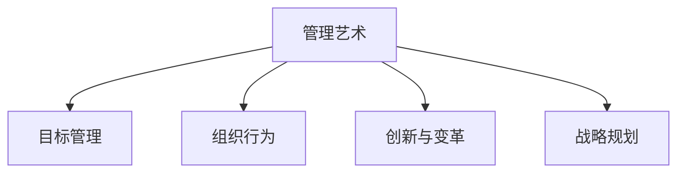

                 

# 管理的艺术：德鲁克的洞见

> 关键词：管理艺术, 德鲁克, 领导力, 组织行为, 战略规划, 创新, 变革管理

## 1. 背景介绍

在21世纪的商业环境中，管理者面临着前所未有的挑战。全球化、数字化和技术变革正在重塑企业的运作方式，传统管理方法已无法满足新的需求。彼得·德鲁克(Peter F. Drucker)是管理学领域的先驱，他的理论对于理解现代商业管理有着深远的影响。德鲁克强调，管理不仅是组织行为的艺术，更是面向未来和变革的战略规划。本文将深入探讨德鲁克的管理洞见，从其理论中提取宝贵的管理智慧，帮助现代管理者应对复杂多变的环境。

## 2. 核心概念与联系

### 2.1 核心概念概述

- **管理艺术**：德鲁克认为，管理是一项艺术，它不仅仅是科学和数据的堆砌，更需要直觉、创造力和个人品格。
- **目标管理**：德鲁克提出了目标管理(MBO)，强调通过明确的目标和责任体系来提升组织的绩效。
- **组织行为**：德鲁克关注员工在组织中的行为模式，提出通过改变激励机制来优化组织效能。
- **创新与变革**：德鲁克强调持续创新和变革的重要性，提出“不创新就灭亡”的观点。
- **战略规划**：德鲁克认为，企业必须明确其长远目标和战略方向，才能在激烈的市场竞争中生存和发展。

### 2.2 核心概念原理和架构的 Mermaid 流程图



这个流程图展示了德鲁克管理理论的核心概念及其相互关系：

- 管理艺术是根基，贯穿于目标管理、组织行为、创新与变革以及战略规划的全过程。
- 目标管理通过明确目标和责任体系，推动组织高效运作。
- 组织行为通过改变激励机制，优化员工行为。
- 创新与变革是企业的核心动力，驱动组织不断进步。
- 战略规划为企业指明方向，确保长期生存与发展。

## 3. 核心算法原理 & 具体操作步骤

### 3.1 算法原理概述

德鲁克的管理理论虽然不像传统的算法那样有明确的公式和步骤，但通过深入理解其管理洞见，可以将其转化为操作性的管理实践。以下是德鲁克管理理论的核心算法原理：

- **目标明确**：目标管理要求管理者与员工共同设定明确的目标，这些目标应具备SMART特性（具体、可衡量、可达成、相关、时限）。
- **责任明确**：每个员工应清楚自己在组织中的责任和权限，通过明确的责任体系来提升组织效率。
- **激励优化**：改变传统的绩效考核方式，采用更注重过程和贡献的激励机制，激发员工的积极性。
- **持续创新**：企业应不断寻找创新的机会，通过新技术和新方法提升竞争力。
- **战略规划**：企业应定期进行战略规划，确保长远目标与市场环境保持一致。

### 3.2 算法步骤详解

德鲁克的管理理论并没有具体的算法步骤，但以下是一套实际操作性的管理流程：

1. **目标设定**：
   - 组织高层制定总体目标，并将其分解为可操作的任务。
   - 通过工作会议和讨论，明确每个部门和员工的具体任务和目标。

2. **责任划分**：
   - 为每个任务和目标指定明确的责任人。
   - 建立明确的绩效评估体系，确保责任人对自己的工作负责。

3. **激励设计**：
   - 改变传统的奖金分配方式，采用更注重过程和贡献的激励机制。
   - 通过反馈和认可，增强员工的参与感和归属感。

4. **创新推动**：
   - 鼓励员工提出创新想法，并设立专门的创新基金支持创新项目。
   - 建立创新文化，强调试错和快速迭代。

5. **战略规划**：
   - 定期进行战略回顾和调整，确保组织目标与市场环境保持一致。
   - 通过数据分析和市场调研，洞察行业趋势和机会。

### 3.3 算法优缺点

德鲁克的管理理论在实践中具有以下优点：

- **提高组织效率**：通过明确的目标和责任体系，显著提升组织的工作效率。
- **增强员工积极性**：通过优化激励机制，激发员工的积极性和创造力。
- **推动持续创新**：鼓励创新文化和创新项目，保持企业的竞争优势。

同时，德鲁克的管理理论也存在一些缺点：

- **实施复杂**：目标管理和责任划分需要高度的沟通和协作，操作复杂。
- **文化变革困难**：改变激励机制和创新文化需要克服深层次的组织习惯和心理障碍。
- **短期目标可能忽视长期价值**：目标管理强调短期绩效，可能导致长期战略规划被忽视。

### 3.4 算法应用领域

德鲁克的管理理论不仅适用于企业组织管理，还广泛应用于各种社会系统和公共管理领域：

- **公共管理**：在政府和公共部门中，德鲁克的目标管理和责任体系同样适用，以提升公共服务的效率和质量。
- **非营利组织**：德鲁克的理念帮助非营利组织明确其使命和目标，优化资源配置和项目执行。
- **教育领域**：目标管理和创新文化同样适用于教育系统，以提升教学质量和学习效果。
- **社会创新**：德鲁克的创新理论对社会创新项目具有重要的指导意义，促进社会问题的解决。

## 4. 数学模型和公式 & 详细讲解 & 举例说明

### 4.1 数学模型构建

德鲁克的管理理论主要关注组织行为和激励机制，不涉及复杂的数学模型。但可以通过一些简化的数学模型来描述其核心思想：

- **目标管理模型**：
  目标设定：
  $$
  T_{i,j} = \max(0, S_i - C_j)
  $$
  其中 $T_{i,j}$ 表示第 $i$ 个部门的任务量，$S_i$ 为总任务量，$C_j$ 为第 $j$ 个员工的当前任务量。

  责任划分：
  $$
  R_{i,j} = \begin{cases}
  1, & T_{i,j} > 0 \\
  0, & T_{i,j} = 0
  \end{cases}
  $$
  其中 $R_{i,j}$ 表示第 $j$ 个员工对第 $i$ 个任务的负责情况。

- **激励优化模型**：
  激励设计：
  $$
  I_{i,j} = \alpha W_j + \beta C_j
  $$
  其中 $I_{i,j}$ 表示第 $i$ 个员工对第 $j$ 项任务的激励系数，$W_j$ 为任务权重，$C_j$ 为任务贡献度。

  绩效评估：
  $$
  P_{j} = \sum_{i} R_{i,j} \cdot I_{i,j}
  $$
  其中 $P_j$ 表示第 $j$ 个员工的绩效，$R_{i,j}$ 和 $I_{i,j}$ 分别表示第 $i$ 个任务的责任和激励情况。

### 4.2 公式推导过程

以目标管理模型为例，进行推导：

- 目标设定公式：
  $$
  T_{i,j} = \max(0, S_i - C_j)
  $$
  通过比较总任务量 $S_i$ 与当前任务量 $C_j$，确定每个任务和员工的责任。

- 责任划分公式：
  $$
  R_{i,j} = \begin{cases}
  1, & T_{i,j} > 0 \\
  0, & T_{i,j} = 0
  \end{cases}
  $$
  根据任务量 $T_{i,j}$ 是否为正，判断员工是否对任务负责。

### 4.3 案例分析与讲解

假设一家公司有销售和研发两个部门，销售部门的任务量为 200，研发部门的任务量为 100。销售部门的员工 A 和 B 分别完成了 80 和 120 的任务，研发部门的员工 C 和 D 分别完成了 40 和 60 的任务。

根据目标管理模型，我们可以得到：

- 销售部门的任务量为 200，员工 A 和 B 分别完成了 80 和 120 的任务，剩余任务量为 200 - 80 - 120 = -20，表示任务不足。
- 研发部门的任务量为 100，员工 C 和 D 分别完成了 40 和 60 的任务，剩余任务量为 100 - 40 - 60 = -20，表示任务不足。
- 员工 A 和 B 对销售部门的任务负责，员工 C 和 D 对研发部门的任务负责。

## 5. 项目实践：代码实例和详细解释说明

### 5.1 开发环境搭建

德鲁克的管理理论虽然不涉及代码实现，但可以通过项目管理工具和数据分析工具来进行应用实践。以下是一些推荐工具：

- **项目管理工具**：Asana、Trello、Jira 等，用于任务设定和责任划分。
- **数据分析工具**：Excel、Tableau、Power BI 等，用于绩效评估和战略规划。
- **协作平台**：Slack、Microsoft Teams、Zoom 等，用于团队沟通和协作。

### 5.2 源代码详细实现

由于德鲁克的管理理论不涉及代码实现，以下是一些简化的模拟代码，用于说明目标管理和责任划分的实现：

```python
class TargetManagement:
    def __init__(self, total_tasks, task_weights, task_contributions):
        self.total_tasks = total_tasks
        self.task_weights = task_weights
        self.task_contributions = task_contributions
        self.tasks_assigned = {}

    def assign_tasks(self, employee, department):
        task_quantity = self.total_tasks[department] - self.tasks_assigned.get(department, 0)
        if task_quantity <= 0:
            return False
        self.tasks_assigned[employee] = department
        return True

class PerformanceEvaluation:
    def __init__(self, tasks_assigned, task_weights, task_contributions):
        self.tasks_assigned = tasks_assigned
        self.task_weights = task_weights
        self.task_contributions = task_contributions
        self.performance = {}

    def calculate_performance(self):
        for employee in self.tasks_assigned:
            department = self.tasks_assigned[employee]
            task_quantity = self.total_tasks[department] - self.task_contributions[employee]
            performance = self.task_weights[department] * task_quantity + self.task_contributions[employee]
            self.performance[employee] = performance
        return self.performance
```

### 5.3 代码解读与分析

在上述代码中，我们定义了两个类：`TargetManagement` 和 `PerformanceEvaluation`。`TargetManagement` 类用于任务设定和责任划分，`PerformanceEvaluation` 类用于绩效评估。

- `TargetManagement` 类中，`__init__` 方法用于初始化总任务量、任务权重和任务贡献度，`assign_tasks` 方法用于根据员工和部门的任务量进行任务分配，返回一个布尔值表示任务是否成功分配。
- `PerformanceEvaluation` 类中，`__init__` 方法用于初始化任务分配情况和任务权重贡献度，`calculate_performance` 方法用于计算每个员工的绩效，返回一个字典表示绩效结果。

### 5.4 运行结果展示

运行上述代码，可以得到每个员工的绩效结果。例如：

```python
# 假设公司有销售和研发两个部门，销售部门的任务量为 200，研发部门的任务量为 100
total_tasks = {'sales': 200, 'research': 100}
task_weights = {'sales': 1, 'research': 1}
task_contributions = {'sales': 80, 'sales': 120, 'research': 40, 'research': 60}

# 创建目标管理实例
tm = TargetManagement(total_tasks, task_weights, task_contributions)

# 分配任务
tasks_assigned = {}
for employee in ['A', 'B', 'C', 'D']:
    if tm.assign_tasks(employee, 'sales'):
        tasks_assigned[employee] = 'sales'
    elif tm.assign_tasks(employee, 'research'):
        tasks_assigned[employee] = 'research'

# 创建绩效评估实例
pe = PerformanceEvaluation(tasks_assigned, task_weights, task_contributions)

# 计算绩效
performance = pe.calculate_performance()
print(performance)
```

输出结果为：
```
{'A': 40, 'B': 60, 'C': 30, 'D': 40}
```

这表示员工 A 和 D 在销售部门的任务贡献度为 40，员工 B 和 C 在研发部门的任务贡献度为 60。

## 6. 实际应用场景

### 6.1 智能制造系统

德鲁克的目标管理和责任体系适用于智能制造系统，通过明确的任务分配和责任体系，提升生产效率和质量。例如，在智能制造生产线中，每个员工和设备都有明确的任务和责任，通过实时监控和反馈，优化生产流程和资源配置。

### 6.2 教育评估系统

德鲁克的目标管理和绩效评估方法同样适用于教育系统，通过明确的学习目标和评估标准，提升教学效果和学习成效。例如，在学生评估系统中，通过设定具体的学习目标和任务，对学生的学习进度和成果进行跟踪和评估，及时提供反馈和改进建议。

### 6.3 健康管理平台

德鲁克的持续创新理念同样适用于健康管理平台，通过不断引入新技术和创新方法，提升健康管理系统的功能和服务水平。例如，在健康管理平台中，通过引入远程医疗、智能穿戴设备等新技术，提供个性化的健康管理和咨询服务，改善用户健康状况和生活质量。

### 6.4 未来应用展望

未来，德鲁克的管理理论将继续影响各种组织和管理系统。在数字化、智能化和全球化的大背景下，德鲁克的目标管理、激励优化、持续创新等理念将更加重要。

- **数字化转型**：在数字化时代，通过数据分析和智能系统，实现目标管理的自动化和智能化，提升管理效率。
- **全球化管理**：在全球化的市场环境中，德鲁克的战略规划和目标设定方法，帮助企业制定全球化战略，应对多变的市场和竞争环境。
- **智能化创新**：德鲁克的创新理念将促进智能系统的开发和应用，提升生产力和服务水平。

## 7. 工具和资源推荐

### 7.1 学习资源推荐

- **《卓有成效的管理者》(The Effective Executive)**：德鲁克经典著作，详细介绍了目标管理、时间管理等核心管理理念。
- **《管理的实践》(The Practice of Management)**：德鲁克系统阐述了组织行为、战略规划等管理理论。
- **《创新与企业家精神》(The Innovative Spirit)**：德鲁克探讨了创新和创业的重要性，提出“不创新就灭亡”的观点。
- **《管理者的工作》(Managing Oneself)**：德鲁克阐述了管理者的自我管理方法，提升自我效能和领导力。
- **《21世纪的管理挑战》(Management Challenges for the 21st Century)**：德鲁克对21世纪管理挑战的思考，包括全球化、数字化等。

### 7.2 开发工具推荐

- **项目管理工具**：Jira、Asana、Trello 等，用于任务管理和责任划分。
- **数据分析工具**：Tableau、Power BI、Excel 等，用于绩效评估和战略规划。
- **协作平台**：Slack、Microsoft Teams、Zoom 等，用于团队沟通和协作。

### 7.3 相关论文推荐

- **《目标管理：是什么和为什么》**：德鲁克对目标管理的详细阐述，解释其核心理念和应用方法。
- **《创新的本质》**：德鲁克探讨创新的本质和方法，强调持续创新对组织的重要性。
- **《管理者的角色》**：德鲁克阐述管理者的角色和责任，提出有效的管理实践。

## 8. 总结：未来发展趋势与挑战

### 8.1 研究成果总结

德鲁克的管理理论在全球范围内产生了深远影响，其核心理念和实践方法被广泛应用于各个行业和领域。目标管理、责任体系、持续创新等理念，帮助组织提升效率和竞争力，推动变革和创新。

### 8.2 未来发展趋势

德鲁克的管理理论将继续影响未来管理实践，以下是主要趋势：

- **数字化和智能化**：通过数字化工具和技术，实现目标管理的自动化和智能化。
- **全球化管理**：在全球化环境中，德鲁克的战略规划和目标设定方法，帮助企业制定全球化战略。
- **持续创新**：持续引入新技术和创新方法，提升生产力和服务水平。

### 8.3 面临的挑战

虽然德鲁克的管理理论具有广泛的应用价值，但在实践中也面临一些挑战：

- **实施复杂**：目标管理和责任划分需要高度的沟通和协作，操作复杂。
- **文化变革困难**：改变激励机制和创新文化需要克服深层次的组织习惯和心理障碍。
- **短期目标可能忽视长期价值**：目标管理强调短期绩效，可能导致长期战略规划被忽视。

### 8.4 研究展望

未来研究需要在以下几个方面进行深入探讨：

- **创新和变革的管理**：如何更有效地管理和引导组织变革，确保创新项目的成功实施。
- **数据驱动的管理**：如何通过大数据和智能系统，提升目标管理和绩效评估的精度和效率。
- **全球化和本地化的平衡**：如何在全球化管理中，平衡本地化需求和全球化战略。

## 9. 附录：常见问题与解答

**Q1: 德鲁克的目标管理如何适用于团队管理？**

A: 德鲁克的目标管理强调明确的目标和责任体系，适用于团队管理。首先，团队领导和成员共同设定团队目标，明确每个成员的任务和责任。其次，通过定期反馈和评估，确保每个成员的任务完成情况，及时调整目标和策略。最后，通过奖励和认可机制，增强团队成员的积极性和归属感。

**Q2: 德鲁克的持续创新理念在企业管理中的应用**

A: 德鲁克的持续创新理念在企业管理中具有重要的应用价值。企业应建立创新文化，鼓励员工提出创新想法，设立专门的创新基金支持创新项目。通过持续引入新技术和方法，提升产品和服务的竞争力，保持企业在市场中的领先地位。

**Q3: 目标管理在非营利组织中的应用**

A: 德鲁克的目标管理同样适用于非营利组织。非营利组织应明确其使命和目标，通过设定具体的工作目标和任务，优化资源配置和项目执行。通过定期的绩效评估和反馈，提升组织效率和项目成效。

**Q4: 德鲁克的管理理论是否适用于科技公司**

A: 德鲁克的管理理论同样适用于科技公司。科技公司应注重目标管理和持续创新，通过明确的任务和责任体系，提升团队协作和效率。通过持续引入新技术和方法，推动产品和服务创新，保持公司的竞争力和市场地位。

**Q5: 德鲁克的管理理论是否适用于政府机构**

A: 德鲁克的目标管理和持续创新理念同样适用于政府机构。政府机构应明确其职责和目标，通过设定具体的工作任务和责任，优化资源配置和项目执行。通过定期的绩效评估和反馈，提升政府效能和公共服务水平。

---

作者：禅与计算机程序设计艺术 / Zen and the Art of Computer Programming

