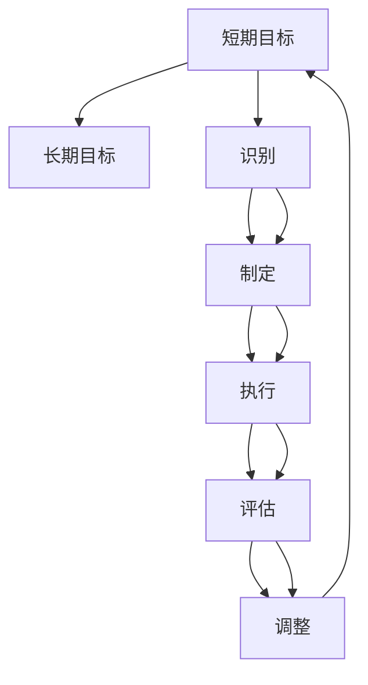

                 

# 管理短期目标与长期目标的意识机制

## 1. 背景介绍

在当前瞬息万变的商业环境中，企业面临着前所未有的挑战和机遇。为了保持竞争力，企业需要既要有明确而稳定的长期目标，也要有灵活而快速的短期目标。然而，如何平衡和协调这两者之间的关系，成为了许多管理者面临的一个难题。本文旨在探讨管理的核心机制——意识机制，从理论和实践的角度分析，帮助企业管理者更好地管理短期目标与长期目标，实现企业的可持续发展。

## 2. 核心概念与联系

### 2.1 核心概念概述

- **短期目标**：指在一段时间内（如季度或年度）需要实现的具体目标。例如，提高市场份额、增加收入等。
- **长期目标**：指在未来几年或更长时间内需要实现的目标。例如，成为行业领导者、实现可持续发展等。
- **意识机制**：指企业在管理过程中，如何识别、制定、执行和调整短期和长期目标，以实现企业的总体战略目标。

### 2.2 核心概念原理和架构的 Mermaid 流程图



该图展示了意识机制的核心流程：从识别短期目标开始，经过制定、执行、评估和调整的循环过程，最终形成对长期目标的动态调整和优化。

## 3. 核心算法原理 & 具体操作步骤

### 3.1 算法原理概述

企业意识机制的核心算法原理基于“平衡记分卡”(Balanced Scorecard)理论，将企业的短期目标和长期目标进行量化和分解，形成一个多维度的目标体系，通过定期的评估和调整，确保两者在资源、时间和绩效上的平衡。

### 3.2 算法步骤详解

#### 3.2.1 目标识别与定义

1. **识别内外部环境**：对企业所处的宏观和微观环境进行分析，识别影响企业短期和长期目标的关键因素。
2. **确定业务战略**：基于对环境分析的结果，确定企业的业务战略目标，包括市场定位、竞争策略等。
3. **定义目标层次**：将业务战略目标分解为短期和长期目标，明确每个目标的具体内容、时间框架和衡量指标。

#### 3.2.2 目标制定与规划

1. **制定目标策略**：根据目标层次，制定具体的策略和方法，包括市场推广、产品开发、人力资源管理等。
2. **资源分配**：根据目标策略，分配所需的资源，包括人力、财力和物力。
3. **制定行动计划**：详细规划每个目标的具体执行步骤和时间表。

#### 3.2.3 目标执行与监控

1. **任务分配**：将行动计划中的任务分配给具体的部门和人员，明确各自的职责和权限。
2. **实施执行**：按计划执行各项任务，确保目标的顺利实现。
3. **监控进度**：定期检查和监控任务执行情况，及时发现和解决问题。

#### 3.2.4 目标评估与反馈

1. **评估绩效**：定期对短期目标和长期目标的实现情况进行评估，衡量其对企业整体战略目标的贡献。
2. **收集反馈**：收集员工、客户和利益相关者的反馈意见，了解目标执行过程中存在的问题和建议。
3. **调整策略**：根据评估和反馈的结果，对目标和策略进行调整和优化。

### 3.3 算法优缺点

#### 3.3.1 优点

1. **系统性**：通过多维度的目标体系，确保短期和长期目标的平衡和协调。
2. **可操作性**：目标制定和执行过程中，资源分配和任务分配明确，操作性强。
3. **灵活性**：通过定期的评估和反馈，及时调整和优化目标，适应环境变化。

#### 3.3.2 缺点

1. **复杂性**：目标体系复杂，需要详细的规划和执行。
2. **协调难度大**：短期目标和长期目标的平衡调整需要高层管理者高度参与，协调难度大。
3. **资源限制**：目标的实现需要大量的资源支持，资源限制可能影响目标的实现。

### 3.4 算法应用领域

企业意识机制广泛应用于各个行业，包括但不限于：

- **制造业**：通过生产效率和产品质量的提升，实现短期目标的同时，确保企业的长期可持续发展。
- **金融业**：通过客户服务和产品创新的提升，实现短期收益的同时，确保企业的长期竞争力。
- **零售业**：通过市场推广和供应链优化的提升，实现短期销售目标的同时，确保企业的长期市场地位。

## 4. 数学模型和公式 & 详细讲解 & 举例说明

### 4.1 数学模型构建

企业意识机制的数学模型建立在多维度目标体系的基础上，可以通过以下公式表示：

$$
\text{Total Score} = \sum_{i=1}^n \text{Score}_i \times \text{Weight}_i
$$

其中，$n$表示目标维度的数量，$\text{Score}_i$表示第$i$个目标的实际得分，$\text{Weight}_i$表示第$i$个目标的权重。

### 4.2 公式推导过程

#### 4.2.1 短期目标的评估

短期目标的评估可以通过以下公式进行：

$$
\text{Short-term Score} = \sum_{k=1}^m \text{KPI}_k \times \text{Weight}_k
$$

其中，$m$表示短期目标中关键绩效指标(KPI)的数量，$\text{KPI}_k$表示第$k$个关键绩效指标的实际值，$\text{Weight}_k$表示第$k$个关键绩效指标的权重。

#### 4.2.2 长期目标的评估

长期目标的评估可以通过以下公式进行：

$$
\text{Long-term Score} = \sum_{j=1}^o \text{LPI}_j \times \text{Weight}_j
$$

其中，$o$表示长期目标中长期绩效指标(LPI)的数量，$\text{LPI}_j$表示第$j$个长期绩效指标的实际值，$\text{Weight}_j$表示第$j$个长期绩效指标的权重。

### 4.3 案例分析与讲解

#### 4.3.1 案例背景

某零售企业为了提升市场份额，制定了以下短期和长期目标：

- **短期目标**：在下一财年内，提高销售额15%，提升客户满意度至90%。
- **长期目标**：在未来五年内，成为行业内的领导者，实现可持续发展。

#### 4.3.2 目标评估

- **短期目标评估**：根据市场调研，设定销售额增长率15%的目标，设定客户满意度90%的目标。
- **长期目标评估**：设定市场份额第一的目标，设定可持续发展能力的目标。

## 5. 项目实践：代码实例和详细解释说明

### 5.1 开发环境搭建

#### 5.1.1 项目管理工具

使用JIRA或Trello等项目管理工具，方便目标的识别、制定、执行和调整的跟踪。

#### 5.1.2 资源管理工具

使用Asana或Teamwork等资源管理工具，对人力资源、财务资源和物理资源的分配和调整进行管理。

### 5.2 源代码详细实现

#### 5.2.1 目标管理模块

```python
class Goal:
    def __init__(self, name, start_date, end_date, weight):
        self.name = name
        self.start_date = start_date
        self.end_date = end_date
        self.weight = weight
        self.score = 0

    def update_score(self, score):
        self.score = score
```

#### 5.2.2 评估模块

```python
class Evaluation:
    def __init__(self, goals):
        self.goals = goals

    def evaluate(self):
        total_score = 0
        for goal in self.goals:
            score = self.calculate_score(goal)
            total_score += score * goal.weight
        return total_score

    def calculate_score(self, goal):
        # 根据实际得分和权重计算目标得分
        pass
```

### 5.3 代码解读与分析

#### 5.3.1 目标管理模块

- **Goal类**：定义目标的基本属性和方法，包括目标名称、开始日期、结束日期、权重和得分。
- **update_score方法**：用于更新目标的实际得分。

#### 5.3.2 评估模块

- **Evaluation类**：定义评估模块的基本属性和方法，包括目标列表和计算总得分的方法。
- **evaluate方法**：用于计算所有目标的总得分。
- **calculate_score方法**：用于计算单个目标的得分。

### 5.4 运行结果展示

#### 5.4.1 运行结果输出

通过评估模块，可以得到企业所有短期和长期目标的总得分，以及每个目标的具体得分。

## 6. 实际应用场景

### 6.1 制造业

#### 6.1.1 背景

某制造业企业面临市场需求波动和原材料价格波动，需要在确保短期生产效率的同时，实现长期可持续发展。

#### 6.1.2 实践

1. **短期目标**：提高生产效率10%，降低原材料成本5%。
2. **长期目标**：实现零排放，采用可再生能源。
3. **实践结果**：通过提高生产效率和优化供应链，短期目标顺利实现。同时，企业积极探索可再生能源，逐步减少对化石能源的依赖，实现长期可持续发展。

### 6.2 金融业

#### 6.2.1 背景

某金融企业需要在短期内提高客户满意度，同时确保长期的金融安全和稳定。

#### 6.2.2 实践

1. **短期目标**：提高客户满意度20%，降低投诉率10%。
2. **长期目标**：实现数据安全和合规，防范金融风险。
3. **实践结果**：通过改进服务质量和加强风险管理，客户满意度显著提高，投诉率大幅降低。同时，企业加强数据保护和合规管理，有效防范金融风险。

### 6.3 零售业

#### 6.3.1 背景

某零售企业需要在短期内增加销售额，同时确保长期的供应链优化。

#### 6.3.2 实践

1. **短期目标**：提高销售额15%，优化库存管理。
2. **长期目标**：建立稳定的供应链体系，提高市场响应速度。
3. **实践结果**：通过市场推广和供应链优化，短期销售额显著提升，库存管理得到改善。同时，企业建立长期供应链合作机制，提高市场响应速度，实现可持续发展。

## 7. 工具和资源推荐

### 7.1 学习资源推荐

- **书籍推荐**：《平衡记分卡》、《战略管理》、《企业战略与绩效管理》等。
- **在线课程**：Coursera、edX、Udemy等平台上的管理课程和战略规划课程。
- **讲座与研讨会**：定期参加行业协会、专业机构举办的讲座和研讨会，获取最新的管理理念和方法。

### 7.2 开发工具推荐

- **项目管理工具**：JIRA、Trello、Asana等。
- **资源管理工具**：Teamwork、Microsoft Project等。
- **数据可视化工具**：Tableau、Power BI等。

### 7.3 相关论文推荐

- **论文1**：《平衡记分卡：一种新的绩效管理框架》。
- **论文2**：《多维度绩效评估与战略管理》。
- **论文3**：《动态目标管理与战略执行》。

## 8. 总结：未来发展趋势与挑战

### 8.1 研究成果总结

本文通过理论和实践的结合，详细探讨了企业意识机制的核心算法原理和具体操作步骤，帮助企业管理者更好地管理短期目标与长期目标，实现企业的可持续发展。

### 8.2 未来发展趋势

1. **数字化转型**：随着数字化技术的发展，企业将更多地依赖数据驱动决策，实现目标的精细化和透明化管理。
2. **智能分析**：利用人工智能和大数据技术，对目标实现情况进行实时监测和智能分析，及时发现和解决问题。
3. **跨部门协作**：加强跨部门协作，确保目标在不同部门之间的协同一致性，实现企业整体的战略目标。

### 8.3 面临的挑战

1. **数据质量**：数据收集和处理的准确性直接影响目标评估的可靠性。
2. **资源分配**：如何在有限的资源下，合理分配和优化资源，实现目标的平衡和协调。
3. **利益冲突**：短期目标和长期目标之间可能存在利益冲突，需要高层管理者的协调和平衡。

### 8.4 研究展望

1. **智能化的目标管理系统**：开发智能化的目标管理系统，利用AI和大数据技术，实现目标的自动化管理和优化。
2. **动态调整机制**：研究动态调整机制，实现目标的灵活调整和优化，适应环境变化。
3. **利益相关者管理**：研究利益相关者管理机制，确保各利益相关者的利益得到平衡和满足。

## 9. 附录：常见问题与解答

### 9.1 常见问题

**Q1: 企业短期目标和长期目标如何平衡？**

A1: 通过多维度的目标体系和定期的评估和调整，实现短期和长期目标的平衡和协调。

**Q2: 如何确保目标管理的透明度和一致性？**

A2: 使用项目管理工具和资源管理工具，加强目标管理的透明度和一致性，确保各部门的协同一致性。

**Q3: 如何评估目标管理的有效性？**

A3: 定期评估目标管理的有效性，通过数据分析和绩效指标，衡量目标管理的实际效果。

**Q4: 如何应对环境变化和不确定性？**

A4: 建立灵活的目标调整机制，及时应对环境变化和不确定性，确保目标管理的持续性和有效性。

**Q5: 如何提高目标管理的效率和效果？**

A5: 利用数字化技术和大数据分析，提高目标管理的效率和效果，实现目标管理的智能化和透明化。

### 9.2 解答

**A1:** 通过多维度的目标体系和定期的评估和调整，实现短期和长期目标的平衡和协调。

**A2:** 使用项目管理工具和资源管理工具，加强目标管理的透明度和一致性，确保各部门的协同一致性。

**A3:** 定期评估目标管理的有效性，通过数据分析和绩效指标，衡量目标管理的实际效果。

**A4:** 建立灵活的目标调整机制，及时应对环境变化和不确定性，确保目标管理的持续性和有效性。

**A5:** 利用数字化技术和大数据分析，提高目标管理的效率和效果，实现目标管理的智能化和透明化。

---

作者：禅与计算机程序设计艺术 / Zen and the Art of Computer Programming

