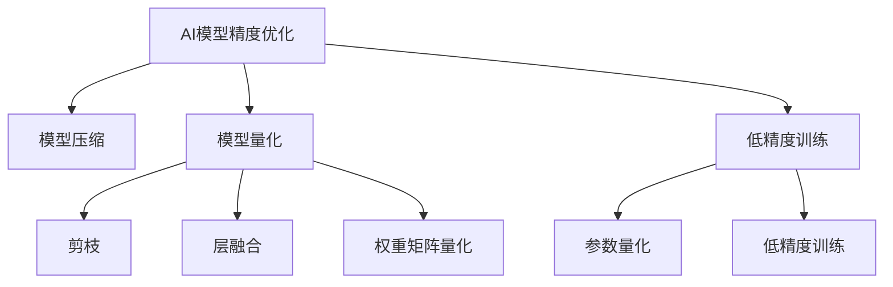

                 

# 精度优化:AI模型从64位到1位的演进

> 关键词：AI模型精度优化，模型压缩，模型量化，深度学习模型，低精度训练，硬件加速

## 1. 背景介绍

### 1.1 问题由来

随着深度学习技术的发展，AI模型的规模和复杂度不断增加，训练和推理所需的计算资源也在急剧膨胀。为了应对这一挑战，研究人员和工程师们提出了各种优化技术，以减少模型的计算量和存储需求，同时提升其计算效率。其中，精度优化（Precision Optimization）是深度学习模型优化中的重要一环，通过减少模型的精度，可以在不牺牲模型性能的前提下，显著降低其计算和存储需求，进而提升模型的可部署性和可扩展性。

### 1.2 问题核心关键点

精度优化主要包括模型压缩、模型量化和低精度训练三种技术。这些技术通过降低模型的精度，将64位浮点数模型压缩至16位、8位甚至更低精度的模型，实现模型的轻量化和高效化，从而提升其在硬件加速环境下的表现。

## 2. 核心概念与联系

### 2.1 核心概念概述

- **AI模型精度优化**：通过降低AI模型的精度，以减少其计算和存储需求，同时保持或提升模型的性能。
- **模型压缩**：减少模型的参数量和计算量，通过剪枝、融合层、量化等手段，使模型变得更加紧凑。
- **模型量化**：将模型的浮点数参数和计算转换为定点数，以降低计算需求和存储开销。
- **低精度训练**：使用较低精度的数据类型（如16位、8位）进行模型训练，使模型在推理阶段能够高效运行。

### 2.2 核心概念原理和架构的 Mermaid 流程图



这个流程图展示了精度优化的主要手段及其之间的联系：

1. 通过剪枝、层融合和权重矩阵量化等方法，对模型进行压缩。
2. 将模型参数和计算转换为定点数，实现模型量化。
3. 在训练阶段使用较低精度的数据类型，进行低精度训练。

这些手段可以单独使用，也可以组合使用，以获得最佳的优化效果。

## 3. 核心算法原理 & 具体操作步骤

### 3.1 算法原理概述

精度优化是通过降低模型参数和计算的精度，以减少计算和存储需求，同时保持或提升模型的性能。其核心思想是：在保证模型性能的前提下，尽可能减少模型对计算资源的需求，从而提高模型的可部署性和可扩展性。

### 3.2 算法步骤详解

精度优化的过程包括以下几个关键步骤：

**Step 1: 选择合适的精度优化方法**

- 根据模型的具体应用场景和硬件环境，选择合适的精度优化方法。例如，对于对模型性能要求较高的应用，可以选择保留高精度训练，但在推理阶段进行量化；对于计算资源有限的应用，可以选择低精度训练，并在训练和推理阶段都进行量化。

**Step 2: 实施模型压缩**

- 对于模型压缩，常用的方法包括剪枝、层融合、权重矩阵量化等。剪枝可以移除不重要的参数或连接，减少模型的大小；层融合可以将多个层合并为一个，减少参数和计算量；权重矩阵量化将浮点数参数转换为定点数，以减少存储空间和计算开销。

**Step 3: 实施模型量化**

- 对于模型量化，常用的方法包括参数量化和计算量化。参数量化将模型参数转换为定点数，计算量化将模型的计算过程转换为定点数。常用的参数量化方法包括均匀量化和非均匀量化（如分布式二进制量化），常用的计算量化方法包括整数线性量化和混合精度量化。

**Step 4: 实施低精度训练**

- 对于低精度训练，常用的方法包括混合精度训练和定点训练。混合精度训练使用16位和32位数据类型进行训练，定点训练则使用较低位数的整数进行训练。

**Step 5: 评估和调优**

- 通过实验评估优化后的模型的性能和效率，根据实验结果进行调整。例如，可以通过精度损失、计算速度、内存占用等指标来评估模型的优化效果，并进行相应的调整。

### 3.3 算法优缺点

精度优化技术具有以下优点：

- **降低计算和存储需求**：通过降低模型精度，可以显著减少计算和存储需求，降低硬件和内存的消耗。
- **提升模型可部署性**：降低精度的模型更加轻量化，可以更容易地部署到移动设备和嵌入式系统上。
- **加速推理过程**：低精度的模型在硬件加速环境下，推理速度更快，可以更快地响应用户请求。

同时，精度优化也存在一些局限性：

- **性能损失**：降低精度可能导致模型性能下降，尤其是在高精度应用中，需要权衡性能和精度之间的关系。
- **训练复杂度增加**：低精度训练和量化过程中，可能需要更多的预处理和后处理步骤，增加了训练的复杂度。
- **硬件兼容性**：不同的硬件平台支持的数据类型不同，优化后的模型可能需要适配不同的硬件平台，增加了开发成本。

### 3.4 算法应用领域

精度优化技术在深度学习模型的各个应用领域中都有广泛的应用，例如：

- **图像识别**：通过模型压缩和量化，将大型卷积神经网络压缩为更轻量级的模型，可以加速图像识别应用。
- **自然语言处理**：通过模型压缩和量化，减少自然语言处理模型的大小和计算量，提高其推理速度和可部署性。
- **语音识别**：通过低精度训练和量化，加速语音识别模型，使其能够快速响应用户语音命令。
- **推荐系统**：通过模型压缩和量化，优化推荐系统的模型，提高其性能和实时性。
- **自动驾驶**：通过模型压缩和量化，优化自动驾驶模型，提升其计算效率和响应速度。

## 4. 数学模型和公式 & 详细讲解 & 举例说明

### 4.1 数学模型构建

在深度学习模型中，精度优化的数学模型构建主要包括以下几个步骤：

1. **选择精度**：确定模型的精度，例如使用8位或16位数据类型。
2. **量化函数**：定义量化函数，将浮点数转换为定点数。
3. **计算图优化**：优化模型的计算图，减少计算量和参数量。

### 4.2 公式推导过程

以模型量化为例，假设模型中有浮点数参数 $\theta$，其量化后的定点数参数 $\hat{\theta}$ 可以表示为：

$$
\hat{\theta} = Q(\theta)
$$

其中 $Q$ 为量化函数，通常采用均匀量化或分布式量化。例如，使用均匀量化，可以将 $\theta$ 映射到 $[0,2^k-1]$ 区间内，映射关系为：

$$
\hat{\theta} = \lfloor \frac{\theta}{\Delta} \rfloor \Delta
$$

其中 $\Delta$ 为量化步长，$k$ 为量化位数。

### 4.3 案例分析与讲解

以卷积神经网络为例，假设原模型中有浮点数卷积核参数 $W$，其量化后的定点数卷积核参数 $\hat{W}$ 可以表示为：

$$
\hat{W} = Q(W)
$$

其中 $Q$ 为量化函数。假设 $W$ 的每个元素在量化前的范围为 $[-a,b]$，量化后的范围为 $[0,2^k-1]$，则映射关系为：

$$
\hat{W} = \lfloor \frac{W}{\Delta} \rfloor \Delta
$$

其中 $\Delta$ 为量化步长，$k$ 为量化位数。对于权重矩阵 $W$，通常使用全局量化方法，即统一将所有的权重参数量化。对于卷积核参数，通常使用卷积核块内量化方法，即将卷积核内连续的权重参数量化为同一范围。

## 5. 项目实践：代码实例和详细解释说明

### 5.1 开发环境搭建

进行精度优化实践前，需要准备好开发环境。以下是使用Python进行TensorFlow开发的环境配置流程：

1. 安装Anaconda：从官网下载并安装Anaconda，用于创建独立的Python环境。

2. 创建并激活虚拟环境：
```bash
conda create -n tf-env python=3.8 
conda activate tf-env
```

3. 安装TensorFlow：根据CUDA版本，从官网获取对应的安装命令。例如：
```bash
conda install tensorflow=tensorflow-2.4-cu102-manylinux2014_2-cp38-cp38=manylinux2014_2
```

4. 安装TensorBoard：
```bash
pip install tensorboard
```

5. 安装TensorFlow Addons：用于获取额外的优化模块和数据类型支持。
```bash
pip install tensorflow-addons
```

完成上述步骤后，即可在`tf-env`环境中开始精度优化实践。

### 5.2 源代码详细实现

这里我们以卷积神经网络的模型量化为例，给出使用TensorFlow进行模型优化的PyTorch代码实现。

首先，定义模型和量化函数：

```python
import tensorflow as tf
import tensorflow_addons as addons

# 定义模型
def conv_model():
    model = tf.keras.Sequential([
        tf.keras.layers.Conv2D(32, (3, 3), activation='relu', input_shape=(28, 28, 1)),
        tf.keras.layers.MaxPooling2D((2, 2)),
        tf.keras.layers.Flatten(),
        tf.keras.layers.Dense(10, activation='softmax')
    ])
    return model

# 定义量化函数
def quantize_weights(model, num_bits):
    quantizer = addons.quantization.keras.uniform_quantize('conv2d', target_dtype=tf.qint8)
    with addons.quantization.keras.profile(model):
        quantized_model = quantizer(model)
    return quantized_model
```

然后，在训练过程中进行量化：

```python
# 加载模型
model = conv_model()

# 量化模型
quantized_model = quantize_weights(model, num_bits=8)

# 加载数据集
(x_train, y_train), (x_test, y_test) = tf.keras.datasets.mnist.load_data()

# 标准化数据
x_train = x_train / 255.0
x_test = x_test / 255.0

# 训练模型
quantized_model.compile(optimizer='adam', loss='sparse_categorical_crossentropy', metrics=['accuracy'])
quantized_model.fit(x_train, y_train, epochs=10, validation_data=(x_test, y_test))
```

在训练完成后，使用TensorBoard可视化量化后的模型：

```python
# 启动TensorBoard
tensorboard_callback = tf.keras.callbacks.TensorBoard(log_dir='logs', histogram_freq=1)
quantized_model.fit(x_train, y_train, epochs=10, validation_data=(x_test, y_test), callbacks=[tensorboard_callback])
```

完成上述代码后，即可启动TensorBoard，查看量化后模型的性能和参数分布情况。

### 5.3 代码解读与分析

在上述代码中，我们通过定义模型和量化函数，实现了卷积神经网络的模型量化。具体实现步骤如下：

1. **定义模型**：使用TensorFlow构建了一个简单的卷积神经网络模型，包含一个卷积层、一个池化层和一个全连接层。
2. **量化模型**：使用TensorFlow Addons的uniform_quantize函数，将模型的权重参数进行量化，将浮点数转换为8位定点数。
3. **加载数据集**：使用TensorFlow内置的MNIST数据集，加载训练和测试数据。
4. **标准化数据**：将数据进行标准化处理，将像素值缩放到[0,1]区间。
5. **训练模型**：使用Adam优化器进行训练，使用交叉熵损失函数进行优化，训练10个epoch，并在验证集上进行验证。
6. **可视化量化结果**：使用TensorBoard可视化量化后的模型，观察量化后的参数分布和训练过程。

通过上述代码，我们可以看到，TensorFlow Addons提供了简单易用的量化函数，可以方便地对模型进行量化，同时使用TensorBoard进行可视化，帮助我们更好地理解量化后的模型性能。

## 6. 实际应用场景

### 6.1 智能硬件

随着智能硬件的发展，越来越多的设备需要安装和运行深度学习模型，例如手机、智能音箱、智能手表等。这些设备通常具有有限的计算资源和内存，无法直接运行高精度的深度学习模型。通过精度优化，可以将模型压缩至低精度，使其能够在这些设备上高效运行，提升用户体验。

### 6.2 边缘计算

边缘计算指的是将计算任务分散在设备端，减少对中心服务器的依赖，提高计算效率和响应速度。通过精度优化，可以在边缘设备上运行轻量级的深度学习模型，减少数据传输，提高计算速度，满足实时性的需求。

### 6.3 数据中心

数据中心通常需要部署大规模的深度学习模型，以支持大规模的计算任务。通过精度优化，可以减少模型的大小和计算量，降低计算资源的需求，提高数据中心的计算效率和资源利用率。

### 6.4 未来应用展望

随着深度学习技术的发展，精度优化技术也将不断演进。未来，精度优化将结合更多的优化手段，如剪枝、融合层、分布式量化等，进一步降低模型的计算和存储需求，提升模型的可部署性和可扩展性。此外，精度优化还将与其他优化技术，如模型压缩、模型蒸馏、模型分片等，进行更加深入的融合，形成更加全面和高效的优化方案。

## 7. 工具和资源推荐

### 7.1 学习资源推荐

为了帮助开发者系统掌握精度优化技术，这里推荐一些优质的学习资源：

1. 《深度学习优化技术》系列博文：由深度学习专家撰写，深入浅出地介绍了深度学习模型的优化技术，包括精度优化、模型压缩、模型量化等。

2. TensorFlow官方文档：TensorFlow的官方文档，提供了丰富的优化模块和工具，帮助开发者实现各种优化技术。

3. 《深度学习模型压缩与量化》书籍：详细介绍了深度学习模型压缩和量化技术，包括剪枝、量化、低精度训练等。

4. 《TensorFlow Addons》官方文档：提供了TensorFlow Addons的详细信息，包括量化、剪枝、蒸馏等优化模块。

5. 《深度学习模型优化实战》视频课程：通过实践案例，帮助开发者掌握深度学习模型的优化技术。

通过这些资源的学习实践，相信你一定能够快速掌握深度学习模型的优化技术，并用于解决实际的优化问题。

### 7.2 开发工具推荐

高效的开发离不开优秀的工具支持。以下是几款用于深度学习模型优化的常用工具：

1. TensorFlow：基于Python的开源深度学习框架，提供了丰富的优化模块和工具，支持模型压缩、量化等优化技术。

2. TensorFlow Addons：提供了额外的优化模块和数据类型支持，如量化、剪枝、蒸馏等。

3. PyTorch：基于Python的开源深度学习框架，提供了灵活的计算图和优化工具，支持模型压缩、量化等优化技术。

4. PyTorch Addons：提供了额外的优化模块和数据类型支持，如量化、剪枝、蒸馏等。

5. Onnx：提供了模型转换工具，可以将模型转换为ONNX格式，支持多种深度学习框架和硬件平台。

6. TensorBoard：TensorFlow配套的可视化工具，可实时监测模型训练状态，提供丰富的图表呈现方式。

通过合理利用这些工具，可以显著提升深度学习模型优化的开发效率，加快创新迭代的步伐。

### 7.3 相关论文推荐

深度学习模型优化的发展源于学界的持续研究。以下是几篇奠基性的相关论文，推荐阅读：

1. "Network Pruning: An Overview, Taxonomy, and Empirical Evaluation"：综述了模型剪枝技术，提供了多种剪枝方法的比较和评估。

2. "Deep Learning Model Quantization: Survey and Future Perspectives"：综述了模型量化技术，提供了量化方法的分类和评估。

3. "Efficient Training of Deep Neural Networks with Low Precision Data Types"：提出了一种混合精度训练方法，提高了模型训练的效率。

4. "A Comparative Study of Quantization Methods in Neural Networks"：比较了多种量化方法，包括均匀量化、分布式量化、定点量化等，提供了量化方法的评估。

5. "Quantization-Aware Training: Reducing Model Size and Computation with Quantization Guided by Backpropagation"：提出了一种量化-aware训练方法，提高了量化效果。

这些论文代表了大模型优化的发展脉络，通过学习这些前沿成果，可以帮助研究者把握学科前进方向，激发更多的创新灵感。

## 8. 总结：未来发展趋势与挑战

### 8.1 研究成果总结

本文对深度学习模型精度优化的技术进行了全面系统的介绍，包括模型压缩、模型量化和低精度训练三种技术。通过这些技术，可以显著降低模型的计算和存储需求，提升模型的可部署性和可扩展性，从而实现更高效的计算和推理。

### 8.2 未来发展趋势

展望未来，精度优化技术将呈现以下几个发展趋势：

1. **模型规模不断增大**：随着算力成本的下降和数据规模的扩张，深度学习模型的规模将不断增大，精度优化技术将继续发挥其重要性。

2. **优化方法更加多样化**：未来的优化方法将结合更多的手段，如剪枝、融合层、分布式量化等，形成更加全面和高效的优化方案。

3. **硬件适配性更强**：未来的优化方法将更加适配各种硬件平台，提高模型在各种硬件上的性能和效率。

4. **优化效果更好**：未来的优化方法将能够更有效地降低计算和存储需求，同时保持或提升模型的性能。

5. **实时性更强**：未来的优化方法将能够实现更高效的计算和推理，支持实时性要求高的应用。

### 8.3 面临的挑战

尽管深度学习模型精度优化技术已经取得了一定的进展，但在实际应用中仍然面临一些挑战：

1. **精度损失问题**：精度优化技术可能会引入精度损失，需要在性能和精度之间进行平衡。

2. **训练复杂度增加**：低精度训练和量化过程中，可能需要更多的预处理和后处理步骤，增加了训练的复杂度。

3. **硬件兼容性问题**：不同的硬件平台支持的数据类型不同，优化后的模型可能需要适配不同的硬件平台。

4. **优化效果不稳定**：优化效果可能受到多种因素的影响，如数据分布、训练方式、模型架构等，需要进行综合评估。

### 8.4 研究展望

未来的研究需要在以下几个方面进行突破：

1. **新优化手段的探索**：探索新的优化手段，如分布式量化、混合量化等，进一步提高优化效果。

2. **优化效果的提升**：提升优化效果，减少精度损失，同时保持模型的性能。

3. **硬件平台的适配性**：开发适应各种硬件平台的优化方法，提高模型的兼容性。

4. **优化效果的稳定性**：提高优化效果的稳定性，减少各种因素对优化效果的影响。

通过这些研究方向的探索，必将推动深度学习模型精度优化技术迈向更高的台阶，为构建更加高效、可靠、可扩展的AI系统提供支持。

## 9. 附录：常见问题与解答

**Q1: 什么是模型压缩?**

A: 模型压缩是一种优化技术，通过剪枝、层融合、权重矩阵量化等手段，减少模型的参数量和计算量，使模型变得更加紧凑。

**Q2: 如何实现模型量化?**

A: 模型量化是将模型的浮点数参数和计算转换为定点数，以降低计算需求和存储开销。常用的量化方法包括均匀量化和分布式量化。

**Q3: 低精度训练与浮点数训练有何不同?**

A: 低精度训练使用较低精度的数据类型（如16位、8位）进行模型训练，浮点数训练则使用标准的64位浮点数进行训练。低精度训练可以减少计算和存储需求，但需要更多的预处理和后处理步骤。

**Q4: 模型量化后的性能如何?**

A: 模型量化后的性能取决于量化方法和应用场景。通常情况下，量化后的模型推理速度会更快，但在高精度应用中，可能需要权衡精度和性能。

**Q5: 如何评估优化后的模型?**

A: 评估优化后的模型需要综合考虑精度、计算速度、内存占用等多个指标。可以通过精度损失、计算速度、内存占用等指标来评估模型的优化效果，并进行相应的调整。

通过这些问题和解答，相信读者能够更全面地了解深度学习模型精度优化的技术和方法，掌握其实现步骤和注意事项，从而在实际应用中取得更好的效果。

