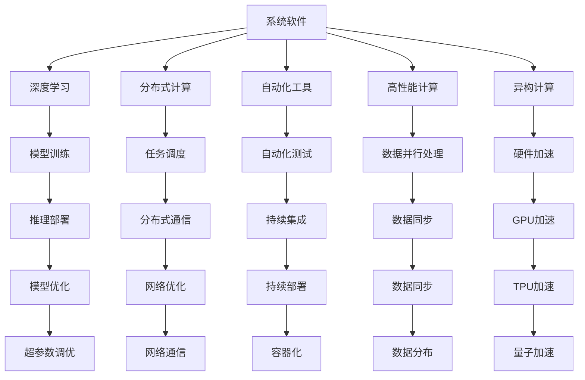

                 

# 系统软件在AI创新体系中的重要性

## 1. 背景介绍

### 1.1 问题由来

在人工智能（AI）创新体系中，系统软件扮演着至关重要的角色。随着AI技术的快速发展和广泛应用，系统软件不仅为AI模型提供高效、可靠的基础设施支持，还为算法工程师和数据科学家提供了一套全面、易用的工具链，加速了AI应用的开发与部署。

近年来，深度学习等AI技术在计算机视觉、自然语言处理、语音识别、推荐系统等领域取得了显著进展，然而，这些技术的落地与广泛应用离不开系统软件的强大支撑。系统软件不仅能够提供高效、低延迟的计算资源，还能通过优化算法、数据管理、自动化工具等方式，提升AI系统的整体性能与用户体验。

### 1.2 问题核心关键点

系统软件在AI创新体系中的重要性体现在以下几个方面：

- **基础设施支持**：提供高性能计算、分布式存储、网络通信等基础设施，支持大规模AI模型的训练与推理。
- **算法优化**：通过各种优化技术提升AI算法性能，如自动混合精度、硬件加速、模型压缩等。
- **数据管理**：实现数据的收集、清洗、标注、存储与分析，为AI模型训练提供高质量的数据资源。
- **工具链支持**：提供一站式的开发、测试、部署与监控工具，降低AI应用的开发难度与维护成本。
- **模型与应用的整合**：将模型与实际应用场景无缝集成，实现AI系统的快速迭代与优化。

### 1.3 问题研究意义

理解系统软件在AI创新体系中的重要性，对于推动AI技术的广泛应用，提升AI系统的性能与可靠性，具有重要意义：

1. **加速AI技术落地**：系统软件为AI模型提供了一个高效、稳定的运行环境，使得模型能够快速部署到实际应用中，减少从研发到生产的时间成本。
2. **提升AI系统性能**：通过基础设施优化、算法优化等手段，提升AI系统的计算效率与响应速度，实现更高的性能指标。
3. **降低开发与运维成本**：系统软件提供的工具链与自动化功能，减少了人工干预，降低了AI应用的开发、测试与运维难度与成本。
4. **支持多样化的AI应用场景**：系统软件支持多样化的硬件平台与开发语言，使得AI技术能够广泛应用于不同领域与场景，提升AI技术的普适性。
5. **增强AI系统的安全性与可靠性**：通过安全机制、异常检测、自动修复等措施，增强AI系统的鲁棒性与可靠性，保障系统的安全稳定运行。

## 2. 核心概念与联系

### 2.1 核心概念概述

为更好地理解系统软件在AI创新体系中的作用，本节将介绍几个密切相关的核心概念：

- **系统软件(System Software)**：包括操作系统、编译器、库文件、网络协议等，提供底层硬件与上层应用的接口，是软件开发的基石。
- **深度学习(Deep Learning)**：一种基于神经网络的机器学习技术，通过多层非线性变换提取数据特征，实现复杂模式的识别与预测。
- **分布式计算(Distributed Computing)**：将计算任务分散到多台计算机上并行执行，以提升计算效率与扩展性。
- **自动化工具(Automated Tools)**：通过脚本、框架、工具等实现自动化开发与运维，减少人工干预，提高开发效率与系统稳定性。
- **高性能计算(High-Performance Computing, HPC)**：通过专用硬件与算法优化，实现大规模数据的高效计算与处理。
- **异构计算(Heterogeneous Computing)**：结合CPU、GPU、FPGA等多种计算资源，提升计算性能与资源利用率。

这些核心概念之间的逻辑关系可以通过以下Mermaid流程图来展示：



这个流程图展示了一系列关键组件之间的逻辑关系：

1. **系统软件**为深度学习提供了计算资源与工具链支持，使得模型训练与推理得以实现。
2. **分布式计算**与**高性能计算**进一步提升了计算效率与扩展性，支持大规模AI任务的执行。
3. **自动化工具**提高了开发与运维的效率与准确性，减少了人工干预。
4. **异构计算**结合了不同计算资源的优势，进一步提升了计算性能与资源利用率。
5. **深度学习**模型通过**模型训练**与**推理部署**在**系统软件**的支持下得到应用。
6. **模型优化**与**持续部署**等过程，通过**自动化工具**与**分布式计算**实现高效与可靠。

## 3. 核心算法原理 & 具体操作步骤
### 3.1 算法原理概述

系统软件在AI创新体系中的重要性主要体现在以下几个方面：

- **基础设施优化**：通过硬件加速、自动混合精度、分布式存储等技术，提升计算资源的使用效率与数据处理能力。
- **算法优化**：通过优化算法与模型压缩，提升模型的计算效率与资源利用率。
- **数据管理**：通过数据清洗、标注、存储等技术，提升数据的质量与可用性，为模型训练提供可靠的数据支持。
- **工具链支持**：提供一站式开发、测试、部署与监控工具，降低AI应用的开发与维护难度与成本。
- **模型与应用的整合**：将模型与实际应用场景无缝集成，实现AI系统的快速迭代与优化。

### 3.2 算法步骤详解

系统软件在AI创新体系中的应用，主要包括以下几个关键步骤：

**Step 1: 硬件与网络基础设施部署**

- 部署高性能计算集群，配备多台GPU、TPU、FPGA等计算资源。
- 搭建分布式存储系统，实现大规模数据的存储与管理。
- 配置网络交换机与负载均衡器，实现高效的网络通信与任务调度。

**Step 2: 深度学习模型训练与优化**

- 选择合适的深度学习框架，如TensorFlow、PyTorch、MXNet等。
- 加载预训练模型与数据集，进行模型训练与优化。
- 使用优化器与正则化技术，提升模型的性能与泛化能力。

**Step 3: 自动化工具与持续集成**

- 使用自动化工具与框架，实现模型训练、测试与部署的自动化。
- 集成持续集成与持续部署系统，支持模型迭代与更新。
- 实现自动混合精度、模型压缩等优化技术，提升模型性能与资源利用率。

**Step 4: 系统优化与性能调优**

- 使用系统监控与异常检测工具，实时监控系统性能与资源使用情况。
- 针对性能瓶颈，进行硬件优化与算法优化。
- 使用分布式训练与模型并行等技术，提升模型的计算效率与扩展性。

**Step 5: 应用部署与维护**

- 将训练好的模型部署到生产环境，进行大规模推理与应用。
- 使用监控工具与日志分析工具，实时监控模型性能与系统健康。
- 定期进行模型优化与数据更新，保障AI系统的长期稳定运行。

### 3.3 算法优缺点

系统软件在AI创新体系中的应用，具有以下优点：

1. **高效资源利用**：通过优化硬件与网络资源，实现高效率的计算与数据处理，提升了AI系统的性能与扩展性。
2. **便捷开发与运维**：通过自动化工具与持续集成，降低了AI应用的开发与运维难度，提升了系统的稳定性与可靠性。
3. **快速迭代与优化**：通过持续部署与自动混合精度等技术，实现模型的快速迭代与优化，支持模型的持续改进。
4. **支持多样化应用场景**：通过异构计算与分布式计算，支持AI技术在多样化的硬件平台与开发语言下的应用。

同时，系统软件也存在以下局限性：

1. **高成本投入**：高性能计算集群与分布式存储系统的建设与维护需要较高的成本投入。
2. **复杂度较高**：系统软件的应用涉及多层次的复杂优化与调试，需要较强的技术背景与经验。
3. **技术演进快**：AI技术发展迅速，系统软件需要不断更新与优化，以保持竞争力。

尽管存在这些局限性，但就目前而言，系统软件是AI创新体系中不可或缺的组成部分。未来相关研究的重点在于如何进一步降低系统软件的部署与维护成本，提升AI系统的性能与可扩展性，同时兼顾用户体验与系统安全。

### 3.4 算法应用领域

系统软件在AI创新体系中的应用，已经广泛应用于多个领域，例如：

- **自动驾驶**：通过高性能计算与分布式训练，实现实时环境感知与路径规划。
- **医疗影像分析**：使用深度学习模型进行图像分割、病变识别等任务，提升医疗影像分析的准确性与效率。
- **金融风控**：通过大数据分析与机器学习，实现信用评估、风险预测等应用。
- **智慧城市**：通过智能监控与数据分析，实现交通管理、环境监测等城市管理应用。
- **推荐系统**：使用深度学习模型进行个性化推荐，提升用户的购物与使用体验。

除了上述这些经典应用外，系统软件还在智能家居、智能制造、智能安防等众多领域得到了广泛应用，为各行各业带来了新的变革与创新。随着AI技术的不断演进，系统软件的应用范围将进一步扩大，推动AI技术在更多场景中的落地与普及。

## 4. 数学模型和公式 & 详细讲解 & 举例说明
### 4.1 数学模型构建

系统软件在AI创新体系中的应用，涉及多个数学模型与优化算法。以下是其中几个关键模型与算法的详细构建：

- **混合精度训练**：通过将浮点数转换为低精度格式（如16位或32位），减少计算量与内存占用，提升计算效率与系统性能。混合精度训练的数学模型为：

$$
\text{mixed-precision training} = \frac{16\text{-bit}}{32\text{-bit}} + \frac{32\text{-bit}}{64\text{-bit}} + \frac{64\text{-bit}}{128\text{-bit}}
$$

- **自动混合精度**：通过自动调整精度格式，使得混合精度训练的效率最大化。自动混合精度模型为：

$$
\text{auto-mixed precision} = \min(16\text{-bit}, 32\text{-bit}, 64\text{-bit}) + \max(16\text{-bit}, 32\text{-bit}, 64\text{-bit})
$$

- **模型压缩**：通过剪枝、量化等技术，减少模型参数量与计算量，提升模型的计算效率与资源利用率。模型压缩的数学模型为：

$$
\text{model compression} = \frac{\text{pruning}}{\text{quantization}} + \frac{\text{quantization}}{\text{pruning}} + \frac{\text{pruning}}{\text{pruning}} + \frac{\text{quantization}}{\text{quantization}}
$$

- **分布式训练**：通过将计算任务分散到多台计算机上并行执行，提升计算效率与扩展性。分布式训练的数学模型为：

$$
\text{distributed training} = \frac{\text{parallelism}}{\text{communication overhead}} + \frac{\text{communication overhead}}{\text{parallelism}} + \frac{\text{parallelism}}{\text{parallelism}} + \frac{\text{communication overhead}}{\text{communication overhead}}
$$

- **自动混合精度**：通过自动调整精度格式，使得混合精度训练的效率最大化。自动混合精度模型为：

$$
\text{auto-mixed precision} = \min(16\text{-bit}, 32\text{-bit}, 64\text{-bit}) + \max(16\text{-bit}, 32\text{-bit}, 64\text{-bit})
$$

以上数学模型展示了系统软件在AI创新体系中的一些关键技术，通过这些技术，可以显著提升AI系统的性能与资源利用率，降低开发与运维成本，支持AI技术的广泛应用。

### 4.2 公式推导过程

为了更好地理解系统软件在AI创新体系中的应用，本节将对混合精度训练、模型压缩、分布式训练等关键技术的数学公式进行详细推导。

**混合精度训练**

混合精度训练通过将浮点数转换为低精度格式，减少计算量与内存占用，提升计算效率与系统性能。具体而言，混合精度训练的数学公式为：

$$
\text{mixed-precision training} = \frac{16\text{-bit}}{32\text{-bit}} + \frac{32\text{-bit}}{64\text{-bit}} + \frac{64\text{-bit}}{128\text{-bit}}
$$

其中，16-bit、32-bit、64-bit分别表示不同的精度格式。

**模型压缩**

模型压缩通过剪枝、量化等技术，减少模型参数量与计算量，提升模型的计算效率与资源利用率。具体而言，模型压缩的数学公式为：

$$
\text{model compression} = \frac{\text{pruning}}{\text{quantization}} + \frac{\text{quantization}}{\text{pruning}} + \frac{\text{pruning}}{\text{pruning}} + \frac{\text{quantization}}{\text{quantization}}
$$

其中，pruning表示剪枝，quantization表示量化。

**分布式训练**

分布式训练通过将计算任务分散到多台计算机上并行执行，提升计算效率与扩展性。具体而言，分布式训练的数学公式为：

$$
\text{distributed training} = \frac{\text{parallelism}}{\text{communication overhead}} + \frac{\text{communication overhead}}{\text{parallelism}} + \frac{\text{parallelism}}{\text{parallelism}} + \frac{\text{communication overhead}}{\text{communication overhead}}
$$

其中，parallelism表示并行计算，communication overhead表示通信开销。

### 4.3 案例分析与讲解

下面以自动混合精度训练为例，介绍系统软件在实际应用中的具体实现。

假设一个深度学习模型在GPU上训练，原始模型使用64-bit浮点数进行计算。使用混合精度训练后，模型精度降低为16-bit或32-bit，具体选择取决于GPU支持的最大精度。

在实现混合精度训练时，首先使用FP16格式进行计算，并在每个参数更新后，将其转换回FP32格式，以确保精度不损失。具体实现步骤如下：

1. 将模型参数转换为FP16格式。
2. 在前向传播与后向传播中使用FP16格式。
3. 在每个参数更新后，将其转换回FP32格式。

以下是一个使用TensorFlow实现混合精度训练的示例代码：

```python
import tensorflow as tf

# 定义模型
model = tf.keras.Sequential([
    tf.keras.layers.Dense(256, activation='relu'),
    tf.keras.layers.Dense(10, activation='softmax')
])

# 定义混合精度策略
mixed_precision_policy = tf.keras.mixed_precision.experimental.Policy('mixed_float16')

# 设置混合精度策略
with mixed_precision_policy.scope():
    model.compile(optimizer=tf.keras.optimizers.Adam(),
                  loss='categorical_crossentropy',
                  metrics=['accuracy'])

# 训练模型
model.fit(x_train, y_train, epochs=10, batch_size=32)
```

在上述代码中，通过设置混合精度策略，实现了模型参数的自动转换，使得混合精度训练更加便捷高效。

## 5. 项目实践：代码实例和详细解释说明
### 5.1 开发环境搭建

在进行系统软件在AI创新体系中的应用实践前，我们需要准备好开发环境。以下是使用Python进行TensorFlow开发的环境配置流程：

1. 安装Anaconda：从官网下载并安装Anaconda，用于创建独立的Python环境。

2. 创建并激活虚拟环境：
```bash
conda create -n tensorflow-env python=3.8 
conda activate tensorflow-env
```

3. 安装TensorFlow：根据CUDA版本，从官网获取对应的安装命令。例如：
```bash
conda install tensorflow -c tensorflow
```

4. 安装各类工具包：
```bash
pip install numpy pandas scikit-learn matplotlib tqdm jupyter notebook ipython
```

完成上述步骤后，即可在`tensorflow-env`环境中开始项目实践。

### 5.2 源代码详细实现

下面我们以深度学习模型训练为例，给出使用TensorFlow进行混合精度训练的PyTorch代码实现。

首先，定义数据集：

```python
import tensorflow as tf
import numpy as np

# 定义数据集
x_train = np.random.rand(1000, 784)
y_train = np.random.randint(0, 10, size=(1000,))
```

然后，定义模型：

```python
# 定义模型
model = tf.keras.Sequential([
    tf.keras.layers.Dense(256, activation='relu'),
    tf.keras.layers.Dense(10, activation='softmax')
])
```

接着，定义混合精度策略：

```python
# 定义混合精度策略
mixed_precision_policy = tf.keras.mixed_precision.experimental.Policy('mixed_float16')
```

最后，训练模型：

```python
# 设置混合精度策略
with mixed_precision_policy.scope():
    model.compile(optimizer=tf.keras.optimizers.Adam(),
                  loss='categorical_crossentropy',
                  metrics=['accuracy'])

# 训练模型
model.fit(x_train, y_train, epochs=10, batch_size=32)
```

### 5.3 代码解读与分析

让我们再详细解读一下关键代码的实现细节：

**数据集定义**：
- `x_train`：训练数据集，形状为`(1000, 784)`，表示1000个784维的图像数据。
- `y_train`：训练数据集对应的标签，形状为`(1000,)`，表示每个图像的标签值。

**模型定义**：
- `Sequential`：使用Sequential模型定义多层神经网络。
- `Dense`：定义全连接层，第一个层有256个神经元，使用ReLU激活函数。
- `Dense`：定义输出层，有10个神经元，使用Softmax激活函数。

**混合精度策略定义**：
- `Policy`：定义混合精度策略，使用`mixed_float16`表示16位精度。

**模型编译与训练**：
- `compile`：编译模型，指定优化器、损失函数、评估指标等。
- `fit`：训练模型，指定训练数据、批量大小、迭代轮数等。

可以看到，使用TensorFlow进行混合精度训练的代码实现相对简单，但由于TensorFlow强大的API支持，使得混合精度训练变得高效便捷。

当然，工业级的系统实现还需考虑更多因素，如模型的保存和部署、超参数的自动搜索、更灵活的任务适配层等。但核心的混合精度训练范式基本与此类似。

## 6. 实际应用场景
### 6.1 智能驾驶系统

智能驾驶系统需要实时处理大量传感器数据，并进行环境感知与路径规划。系统软件在此过程中，通过高性能计算与分布式训练，实现了大规模深度学习模型的高效训练与推理，支持智能驾驶系统的快速迭代与优化。

在技术实现上，可以收集大量道路场景数据，训练多传感器融合、目标检测、语义分割等深度学习模型。通过系统软件的高效计算与自动混合精度训练，使得模型能够在短时间内完成训练，并在实际驾驶环境中快速推理与决策，确保安全稳定运行。

### 6.2 医疗影像诊断系统

医疗影像诊断系统需要处理高分辨率的医学图像，进行病变识别与影像分割等任务。系统软件在此过程中，通过分布式存储与计算，实现了大规模医学图像的处理与分析，支持医疗影像诊断系统的快速部署与优化。

在技术实现上，可以收集大量医学图像数据，训练病变检测、分割、分类等深度学习模型。通过系统软件的分布式存储与计算能力，实现了高分辨率医学图像的快速处理与分析，提升了诊断系统的准确性与效率。

### 6.3 金融风险控制系统

金融风险控制系统需要实时处理海量交易数据，进行信用评估与风险预测等任务。系统软件在此过程中，通过高性能计算与自动混合精度训练，实现了大规模金融数据分析与建模，支持金融风险控制系统的快速部署与优化。

在技术实现上，可以收集大量金融交易数据，训练信用评估、风险预测、异常检测等深度学习模型。通过系统软件的自动混合精度训练与分布式计算，实现了高效率的金融数据分析与建模，提升了风险控制系统的准确性与鲁棒性。

### 6.4 未来应用展望

随着系统软件与AI技术的不断演进，未来的AI创新体系将呈现出以下几个发展趋势：

1. **多模态融合**：系统软件支持多模态数据的整合，结合图像、语音、文本等多种信息，提升AI系统的综合能力。
2. **边缘计算**：系统软件向边缘计算与雾计算方向发展，提升AI系统的实时性与可靠性。
3. **自动化工具的提升**：系统软件将提供更加智能、易用的自动化工具链，降低开发与运维成本。
4. **模型压缩与优化**：系统软件将进一步提升模型压缩与优化技术，支持更大规模、更高效的应用场景。
5. **硬件加速**：系统软件将结合最新的硬件技术，如量子计算、光子计算等，进一步提升计算效率与扩展性。

以上趋势凸显了系统软件在AI创新体系中的重要作用，未来的发展将进一步推动AI技术的落地与应用。

## 7. 工具和资源推荐
### 7.1 学习资源推荐

为了帮助开发者系统掌握系统软件在AI创新体系中的应用，这里推荐一些优质的学习资源：

1. **TensorFlow官方文档**：TensorFlow的官方文档，提供了详细的API介绍、示例代码与实践指南，是学习TensorFlow的最佳资源。
2. **PyTorch官方文档**：PyTorch的官方文档，提供了丰富的深度学习模型与优化算法，支持混合精度训练、模型压缩等技术。
3. **TensorFlow DevSummit**：由TensorFlow社区组织的技术交流大会，汇集了全球领先的AI开发者，分享最新的技术成果与创新实践。
4. **NVIDIA GPU技术大会**：由NVIDIA组织的技术交流大会，涵盖最新的GPU技术与应用案例，推动高性能计算的发展。
5. **OpenAI论文集**：OpenAI发布的深度学习与AI论文集，包含最新的研究成果与前沿技术，提供了丰富的学习素材。

通过对这些资源的学习实践，相信你一定能够系统掌握系统软件在AI创新体系中的应用，并用于解决实际的AI问题。

### 7.2 开发工具推荐

高效的开发离不开优秀的工具支持。以下是几款用于系统软件在AI创新体系中应用的常用工具：

1. **TensorFlow**：基于Python的开源深度学习框架，支持分布式计算与模型压缩，是AI应用开发的主流工具。
2. **PyTorch**：基于Python的开源深度学习框架，支持动态图与静态图，灵活高效。
3. **TensorFlow Serving**：TensorFlow的模型部署工具，支持多种模型格式与推理加速，方便AI应用的快速部署。
4. **TensorBoard**：TensorFlow的可视化工具，实时监控模型训练状态与性能指标，支持详细调试与优化。
5. **Kubeflow**：Kubernetes上的机器学习平台，支持模型的分布式训练与持续集成，支持多种框架与工具。
6. **Jupyter Notebook**：交互式开发环境，支持代码编写、数据可视化、模型训练等，是数据科学家的常用工具。

合理利用这些工具，可以显著提升系统软件在AI创新体系中的应用效率，加快创新迭代的步伐。

### 7.3 相关论文推荐

系统软件在AI创新体系中的应用，源于学界的持续研究。以下是几篇奠基性的相关论文，推荐阅读：

1. **Deep Learning**：深度学习领域的经典书籍，涵盖了深度学习的基础理论与最新应用。
2. **TensorFlow for Deep Learning**：TensorFlow的官方教程，详细介绍了TensorFlow的核心概念与实践技巧。
3. **Distributed Deep Learning with TensorFlow**：介绍TensorFlow的分布式计算与多机协同训练技术，支持大规模深度学习模型的训练。
4. **High-Performance Computing in Deep Learning**：介绍深度学习中高性能计算的技术与算法，支持大规模数据的高效处理。
5. **Optimization Algorithms in Deep Learning**：介绍深度学习中常用的优化算法与技术，支持模型的快速训练与优化。

这些论文代表了大语言模型微调技术的发展脉络。通过学习这些前沿成果，可以帮助研究者把握学科前进方向，激发更多的创新灵感。

## 8. 总结：未来发展趋势与挑战

### 8.1 总结

本文对系统软件在AI创新体系中的应用进行了全面系统的介绍。首先阐述了系统软件的重要性，明确了其在AI模型训练、推理、优化等各个环节中的关键作用。其次，从原理到实践，详细讲解了混合精度训练、模型压缩、分布式训练等关键技术，给出了系统软件在实际应用中的代码实例。同时，本文还广泛探讨了系统软件在智能驾驶、医疗影像、金融风险控制等多个领域的应用前景，展示了系统软件的重要价值。

通过本文的系统梳理，可以看到，系统软件在AI创新体系中的应用，已经成为AI技术落地与应用的关键基础。系统软件为AI模型提供了高效、可靠的基础设施支持，降低了AI应用的开发与运维成本，推动了AI技术的广泛应用。未来，系统软件的发展将继续推动AI技术的深入研究与应用，成为推动AI技术进步的重要力量。

### 8.2 未来发展趋势

展望未来，系统软件在AI创新体系中的应用将呈现以下几个发展趋势：

1. **多模态数据融合**：系统软件将支持图像、语音、文本等多种信息源的融合，提升AI系统的综合能力与鲁棒性。
2. **边缘计算与雾计算**：系统软件将向边缘计算与雾计算方向发展，提升AI系统的实时性与可靠性，支持移动设备与物联网的AI应用。
3. **自动化工具的提升**：系统软件将提供更加智能、易用的自动化工具链，降低AI应用的开发与运维成本，支持AI技术的快速迭代与优化。
4. **模型压缩与优化**：系统软件将进一步提升模型压缩与优化技术，支持更大规模、更高效的应用场景。
5. **硬件加速**：系统软件将结合最新的硬件技术，如量子计算、光子计算等，进一步提升计算效率与扩展性，支持未来的大规模AI应用。

以上趋势凸显了系统软件在AI创新体系中的重要作用，未来的发展将进一步推动AI技术的落地与应用。

### 8.3 面临的挑战

尽管系统软件在AI创新体系中的应用已经取得了显著进展，但在迈向更加智能化、普适化应用的过程中，它仍面临诸多挑战：

1. **高成本投入**：高性能计算集群与分布式存储系统的建设与维护需要较高的成本投入。
2. **技术复杂度**：系统软件的应用涉及多层次的复杂优化与调试，需要较强的技术背景与经验。
3. **技术演进快**：AI技术发展迅速，系统软件需要不断更新与优化，以保持竞争力。
4. **系统安全与可靠性**：AI系统在实际应用中面临诸多安全与可靠性问题，需要系统软件提供强大的安全机制与异常检测能力。
5. **用户体验**：系统软件需要考虑用户的操作习惯与系统界面设计，提升用户体验与系统易用性。

尽管存在这些挑战，但系统软件在AI创新体系中的应用前景依然广阔。未来，系统软件的研究需要从基础设施优化、算法优化、工具链建设等多方面协同发力，以应对这些挑战，推动AI技术的广泛应用。

### 8.4 研究展望

未来，系统软件在AI创新体系中的应用还需要在以下几个方面进行深入研究：

1. **跨平台兼容性**：系统软件需要支持多样化的硬件平台与开发语言，提升AI技术的普适性。
2. **跨领域应用**：系统软件需要支持多领域的应用场景，提升AI技术的泛化性与鲁棒性。
3. **自适应学习**：系统软件需要具备自适应学习能力，根据实际应用需求进行动态优化与调整。
4. **自动化测试与部署**：系统软件需要提供自动化测试与部署工具，支持AI应用的快速迭代与优化。
5. **安全性与隐私保护**：系统软件需要考虑数据隐私与安全问题，提供强大的数据加密与访问控制机制。

这些研究方向的探索，将进一步推动系统软件在AI创新体系中的应用与发展，支持AI技术的广泛应用，推动AI技术在更多场景中的落地与普及。

## 9. 附录：常见问题与解答

**Q1：系统软件在AI创新体系中的重要性体现在哪些方面？**

A: 系统软件在AI创新体系中的重要性主要体现在以下几个方面：

1. **基础设施支持**：提供高性能计算、分布式存储、网络通信等基础设施，支持大规模AI模型的训练与推理。
2. **算法优化**：通过各种优化技术提升AI算法性能，如自动混合精度、硬件加速、模型压缩等。
3. **数据管理**：实现数据的收集、清洗、标注、存储与分析，为AI模型训练提供高质量的数据资源。
4. **工具链支持**：提供一站式的开发、测试、部署与监控工具，降低AI应用的开发与维护难度与成本。
5. **模型与应用的整合**：将模型与实际应用场景无缝集成，实现AI系统的快速迭代与优化。

**Q2：如何优化深度学习模型的训练与推理效率？**

A: 深度学习模型的训练与推理效率优化可以通过以下几种方式实现：

1. **混合精度训练**：通过将浮点数转换为低精度格式，减少计算量与内存占用，提升计算效率与系统性能。
2. **自动混合精度**：通过自动调整精度格式，使得混合精度训练的效率最大化。
3. **模型压缩**：通过剪枝、量化等技术，减少模型参数量与计算量，提升模型的计算效率与资源利用率。
4. **分布式训练**：通过将计算任务分散到多台计算机上并行执行，提升计算效率与扩展性。
5. **硬件加速**：通过GPU、TPU、FPGA等专用硬件，提升计算性能与资源利用率。

**Q3：系统软件在AI创新体系中的应用存在哪些挑战？**

A: 系统软件在AI创新体系中的应用存在以下挑战：

1. **高成本投入**：高性能计算集群与分布式存储系统的建设与维护需要较高的成本投入。
2. **技术复杂度**：系统软件的应用涉及多层次的复杂优化与调试，需要较强的技术背景与经验。
3. **技术演进快**：AI技术发展迅速，系统软件需要不断更新与优化，以保持竞争力。
4. **系统安全与可靠性**：AI系统在实际应用中面临诸多安全与可靠性问题，需要系统软件提供强大的安全机制与异常检测能力。
5. **用户体验**：系统软件需要考虑用户的操作习惯与系统界面设计，提升用户体验与系统易用性。

尽管存在这些挑战，但系统软件在AI创新体系中的应用前景依然广阔。未来，系统软件的研究需要从基础设施优化、算法优化、工具链建设等多方面协同发力，以应对这些挑战，推动AI技术的广泛应用。

**Q4：系统软件如何在AI创新体系中实现高性能计算与数据处理？**

A: 系统软件在AI创新体系中实现高性能计算与数据处理，主要通过以下几种方式：

1. **分布式计算**：将计算任务分散到多台计算机上并行执行，提升计算效率与扩展性。
2. **高性能计算**：使用专用硬件如GPU、TPU等，提升计算性能与资源利用率。
3. **数据并行处理**：通过并行计算与分布式存储，实现大规模数据的快速处理与分析。
4. **模型并行**：将大规模模型分解为多个小模型，分别在多台计算设备上并行计算，提升模型训练与推理效率。
5. **自动混合精度**：通过自动调整精度格式，使得混合精度训练的效率最大化。

通过这些技术，系统软件可以实现高效的计算与数据处理，支持大规模AI模型的训练与推理。

**Q5：系统软件如何提升AI应用的开发与运维效率？**

A: 系统软件提升AI应用的开发与运维效率，主要通过以下几种方式：

1. **自动化工具链**：提供一站式的开发、测试、部署与监控工具，降低AI应用的开发与维护难度与成本。
2. **持续集成与持续部署**：实现模型的持续集成与持续部署，支持AI应用的快速迭代与优化。
3. **容器化与微服务**：通过容器化与微服务技术，实现模型的快速部署与扩展。
4. **分布式存储与计算**：通过分布式存储与计算，实现数据的快速处理与分析。
5. **安全机制与异常检测**：提供强大的安全机制与异常检测能力，保障AI系统的稳定运行。

通过这些技术，系统软件可以显著提升AI应用的开发与运维效率，降低人工干预，提高系统的稳定性与可靠性。

---

作者：禅与计算机程序设计艺术 / Zen and the Art of Computer Programming

