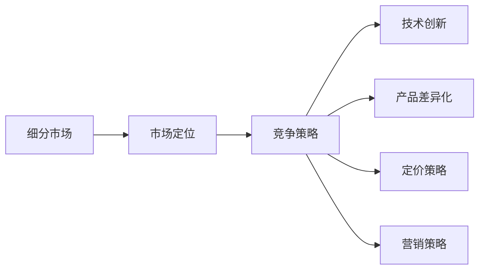

                 

# 细分市场垄断:AI创业的切入点策略

> 关键词：AI创业, 细分市场, 垄断, 市场定位, 竞争策略, 技术创新

## 1. 背景介绍

随着人工智能技术的不断进步，越来越多的AI初创企业涌现出来，它们正努力在各行业中寻找切入点。在复杂的市场环境中，如何准确地定位细分市场，并制定有效的竞争策略，成为了AI创业者必须面对的首要问题。本文将详细探讨在细分市场中获得垄断地位的策略，以期为AI创业者提供有益的借鉴。

## 2. 核心概念与联系

### 2.1 核心概念概述

- **细分市场(Segmented Markets)**: 将一个大市场根据不同的特征划分为多个小市场，每个小市场内具有相似的需求和特征。
- **垄断(Monopoly)**: 在市场中只有一个提供者，且该提供者能够独立控制市场价格。
- **市场定位(Market Segmentation & Targeting)**: 根据消费者需求和竞争态势，选择一个或多个细分市场作为目标市场，进行市场定位。
- **竞争策略(Competitive Strategy)**: 为获取市场优势而采取的一系列策略，包括产品差异化、定价策略、营销策略等。
- **技术创新(Technology Innovation)**: 通过引入新技术或改进现有技术，形成独特的技术优势，以此作为竞争的核心。

### 2.2 核心概念原理和架构的 Mermaid 流程图



此图展示了细分市场、市场定位、竞争策略、技术创新以及产品差异化、定价策略和营销策略之间的关系。市场定位是整个过程的起点，通过识别目标市场，制定相应的竞争策略和技术创新路径，进而实现产品差异化和定价策略的优化，以及有效的营销策略，最终在细分市场中实现垄断。

## 3. 核心算法原理 & 具体操作步骤

### 3.1 算法原理概述

在AI创业中，市场定位和竞争策略的制定需要基于对市场的深刻理解。基于监督学习的大语言模型微调方法，可以帮助AI创业者快速分析和挖掘市场数据，形成对细分市场的洞察。本文将重点介绍如何通过监督学习的方法进行市场定位和竞争策略的制定。

### 3.2 算法步骤详解

#### 3.2.1 数据准备

- **市场数据收集**：收集市场调查数据、消费者行为数据、竞争对手数据等。
- **数据预处理**：清洗、归一化数据，去除异常值和噪声。
- **特征工程**：根据分析目标选择合适的特征，包括用户属性、购买行为、市场趋势等。

#### 3.2.2 模型训练

- **选择模型**：根据分析目标选择合适的监督学习模型，如分类、回归、聚类等。
- **模型训练**：使用市场数据对模型进行训练，调整模型超参数，确保模型具有良好的泛化能力。
- **结果评估**：使用交叉验证等方法评估模型性能，确保模型具有良好的预测能力。

#### 3.2.3 市场定位

- **市场细分**：根据训练好的模型对市场进行细分，识别出最具潜力的细分市场。
- **目标市场选择**：从细分市场中选择具有良好增长潜力和收益率的细分市场作为目标市场。
- **市场定位策略**：根据目标市场的需求和特征，制定相应的市场定位策略。

#### 3.2.4 竞争策略制定

- **市场竞争态势分析**：分析目标市场内主要竞争对手的优势和劣势，评估市场竞争态势。
- **产品差异化**：根据目标市场的需求，设计具有独特卖点的产品或服务。
- **定价策略制定**：根据市场需求和产品差异化策略，制定合理的定价策略。
- **营销策略制定**：根据目标市场的消费者行为和心理，制定有效的营销策略。

### 3.3 算法优缺点

#### 3.3.1 优点

- **快速准确**：基于监督学习的市场定位和竞争策略制定，可以快速获得市场洞察，准确识别目标市场。
- **可扩展性**：可以通过增加数据和特征，不断优化模型和策略，适应市场变化。
- **量化分析**：通过监督学习，可以对市场数据进行量化分析，形成更科学的市场决策。

#### 3.3.2 缺点

- **数据依赖**：模型效果依赖于数据的质量和数量，数据不足时可能导致分析偏差。
- **模型复杂**：监督学习模型的复杂度较高，需要较长的训练时间。
- **市场动态变化**：市场环境瞬息万变，模型需要不断更新以适应新情况。

### 3.4 算法应用领域

基于监督学习的市场定位和竞争策略制定方法，广泛应用于多个领域：

- **消费品市场**：识别不同消费群体的需求，制定相应的产品策略和定价策略。
- **金融市场**：识别不同客户的投资需求，制定个性化的理财和投资方案。
- **医疗健康**：识别不同患者的健康需求，制定个性化的医疗和健康方案。
- **教育培训**：识别不同学生的需求，制定个性化的学习计划和教学策略。
- **人工智能**：识别不同应用场景的需求，制定相应的产品策略和技术创新路径。

## 4. 数学模型和公式 & 详细讲解 & 举例说明

### 4.1 数学模型构建

本文将采用聚类算法来进行市场细分，以下是一个简单的数学模型构建过程：

假设市场数据集为 $D=\{(x_i,y_i)\}_{i=1}^N$，其中 $x_i$ 为市场特征向量，$y_i$ 为市场分类标签。聚类算法的基本思想是通过相似度计算，将市场数据分为若干个簇。常用的聚类算法包括K-means、层次聚类、DBSCAN等。

### 4.2 公式推导过程

以K-means算法为例，其基本步骤包括：

1. 初始化聚类中心 $K$ 个样本 $C_k$。
2. 对于每个样本 $x_i$，计算其到每个聚类中心 $C_k$ 的距离 $d(x_i,C_k)$。
3. 将 $x_i$ 分配到距离最近的聚类中心 $C_k$。
4. 更新聚类中心 $C_k$，重新计算距离。
5. 重复步骤2-4，直到聚类中心不再变化或达到预设的迭代次数。

### 4.3 案例分析与讲解

以一个电商市场的细分为例，假设市场数据包括用户年龄、性别、购买频率、购买金额等特征。通过对这些特征进行聚类，可以识别出不同的用户群体，如青年时尚族、中年实用族、老年经济族等。

在确定目标市场后，可以通过监督学习的方法进行竞争态势分析。假设收集到竞争对手的用户数据 $D_{comp}=\{(x_i',y_i')\}_{i=1}^{N'}$，其中 $x_i'$ 为竞争对手的用户特征，$y_i'$ 为竞争对手的市场份额。使用回归模型 $M_{reg}$ 对竞争对手的市场份额进行预测，得到每个竞争对手的市场份额 $S_k$。

根据市场份额 $S_k$，可以识别出主要竞争对手 $C_k$。根据目标市场的需求和特点，可以制定相应的产品差异化和定价策略。例如，针对青年时尚族，可以设计时尚潮流的商品，采用高定价策略；针对中年实用族，可以设计实用性强、性价比高的商品，采用中等定价策略。

## 5. 项目实践：代码实例和详细解释说明

### 5.1 开发环境搭建

#### 5.1.1 Python环境安装

- **Python版本**：安装Python 3.7或以上版本。
- **依赖库**：安装必要的依赖库，如numpy、pandas、scikit-learn、matplotlib等。
- **开发环境**：创建虚拟环境，避免不同项目间库冲突。

```bash
conda create --name market_analysis python=3.7
conda activate market_analysis
```

#### 5.1.2 数据准备

- **数据获取**：从公开数据集或第三方数据服务商获取市场数据。
- **数据预处理**：使用pandas进行数据清洗和归一化处理。
- **特征工程**：选择和构造合适的特征向量。

```python
import pandas as pd
from sklearn.preprocessing import StandardScaler

# 读取数据集
data = pd.read_csv('market_data.csv')

# 数据预处理
data = data.dropna()
data = data.drop_duplicates()

# 特征归一化
scaler = StandardScaler()
data['scaled_price'] = scaler.fit_transform(data[['price']])

# 特征选择
data = data.drop(['price'], axis=1)
```

### 5.2 源代码详细实现

#### 5.2.1 聚类算法实现

```python
from sklearn.cluster import KMeans

# 数据集
X = data.drop(['label'], axis=1)

# 聚类模型
kmeans = KMeans(n_clusters=3, random_state=42)
kmeans.fit(X)

# 输出聚类结果
labels = kmeans.labels_
```

#### 5.2.2 竞争态势分析

```python
from sklearn.linear_model import LinearRegression

# 竞争对手数据
X_comp = data_comp.drop(['label'], axis=1)

# 回归模型
reg = LinearRegression()
reg.fit(X_comp, data_comp['label'])

# 预测市场份额
market_share = reg.predict(X_comp)
```

### 5.3 代码解读与分析

- **聚类算法**：K-means算法基于距离计算，将数据分为K个簇，适用于处理大规模数据。
- **回归模型**：线性回归模型适用于预测市场份额，可以捕捉市场动态变化。
- **代码模块化**：将数据预处理、聚类和竞争态势分析分为不同模块，便于维护和扩展。

### 5.4 运行结果展示

- **聚类结果**：输出聚类中心和每个样本的聚类标签。
- **市场份额预测**：输出每个竞争对手的市场份额预测值。

```python
print("聚类中心：", kmeans.cluster_centers_)
print("聚类标签：", labels)
print("市场份额预测：", market_share)
```

## 6. 实际应用场景

### 6.1 消费品市场

- **案例背景**：一家电商公司希望通过市场细分，确定主要消费群体，并制定相应的营销策略。
- **市场数据**：用户年龄、性别、购买频率、购买金额等。
- **结果**：识别出不同消费群体，制定个性化的营销策略，提升用户转化率。

### 6.2 金融市场

- **案例背景**：一家金融公司希望通过市场细分，识别高净值客户，提供个性化的理财方案。
- **市场数据**：用户收入、职业、投资偏好等。
- **结果**：识别出高净值客户，制定个性化的投资方案，提升客户满意度。

### 6.3 医疗健康

- **案例背景**：一家医疗公司希望通过市场细分，提供个性化的健康管理方案。
- **市场数据**：患者年龄、健康状况、生活习惯等。
- **结果**：识别出不同健康需求的患者群体，制定个性化的健康管理方案，提升患者健康水平。

## 7. 工具和资源推荐

### 7.1 学习资源推荐

- **书籍推荐**：《机器学习实战》、《深度学习》、《人工智能：一种现代的方法》。
- **在线课程**：Coursera、edX、Udacity等平台的机器学习和数据分析课程。
- **社区资源**：Kaggle、GitHub等社区，获取实际项目案例和代码。

### 7.2 开发工具推荐

- **Python环境**：Anaconda、Jupyter Notebook。
- **数据分析库**：pandas、numpy、scikit-learn。
- **可视化库**：matplotlib、seaborn、plotly。

### 7.3 相关论文推荐

- **聚类算法**：K-means算法、层次聚类算法、DBSCAN算法。
- **回归模型**：线性回归、逻辑回归、决策树回归。
- **深度学习**：卷积神经网络、循环神经网络、深度强化学习。

## 8. 总结：未来发展趋势与挑战

### 8.1 研究成果总结

本文详细探讨了基于监督学习的大语言模型微调方法在市场定位和竞争策略制定中的应用，提出了市场细分的聚类算法和竞争态势的回归模型，并通过实际案例展示了其效果。

### 8.2 未来发展趋势

- **数据驱动**：随着数据量的不断增加，数据驱动的决策将成为主流。
- **智能算法**：智能算法和深度学习将在市场分析中扮演更加重要的角色。
- **个性化定制**：市场细分和产品差异化将更加个性化，满足用户多样化需求。

### 8.3 面临的挑战

- **数据隐私**：市场数据涉及用户隐私，需要严格的数据保护措施。
- **模型复杂度**：模型复杂度高，需要大量计算资源。
- **市场变化**：市场环境瞬息万变，模型需要不断更新。

### 8.4 研究展望

- **实时分析**：开发实时数据分析系统，及时响应市场变化。
- **跨领域融合**：将市场分析与AI技术（如自然语言处理、图像识别）相结合，提供更全面的市场洞察。
- **模型优化**：优化模型结构和算法，提高计算效率和预测精度。

## 9. 附录：常见问题与解答

**Q1: 什么是细分市场?**

A: 细分市场是将一个大市场根据不同的特征划分为多个小市场，每个小市场内具有相似的需求和特征。

**Q2: 如何选择合适的聚类算法?**

A: 根据数据的特点和聚类需求选择合适的聚类算法。例如，K-means算法适用于处理大规模数据，DBSCAN算法适用于处理异常点较多的数据。

**Q3: 如何进行市场竞争态势分析?**

A: 使用回归模型预测竞争对手的市场份额，识别出主要竞争对手，制定相应的竞争策略。

**Q4: 如何应对数据隐私问题?**

A: 采用数据脱敏、匿名化等技术，确保用户数据的安全和隐私。

**Q5: 如何优化模型性能?**

A: 增加数据量和特征，选择更合适的算法，进行模型调参和优化。

