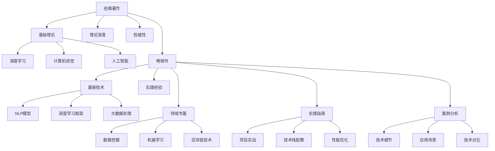

                 

## 1. 背景介绍

### 1.1 问题由来

在数字化时代，知识如海。书籍成为获取知识的重要载体，不同书籍蕴含的信息和价值各不相同。作为IT领域的从业人员，面对汗牛充栋的书籍，如何选择合适的阅读材料，成为提高自身技能的关键。从经典著作到畅销书，各具特色，本文将探讨如何在这两者之间做出选择。

### 1.2 问题核心关键点

选择阅读材料的核心问题在于：
1. 确定阅读材料的目的：是为了深入掌握某一领域的基础理论，还是为了了解最新的技术动态和实践经验。
2. 识别作者的权威性：作者的专业背景、经验和技术深度。
3. 评估书籍的实用性：是否紧跟最新的行业趋势和技术发展。
4. 分析书籍的结构：是否逻辑清晰、内容全面、更新频繁。

## 2. 核心概念与联系

### 2.1 核心概念概述

选择阅读材料涉及多个关键概念，包括：
1. 经典著作(经典书籍)：长期受到学术界和业界认可的书籍，通常在某一领域建立了基础理论。
2. 畅销书：市场销量高、影响力大的书籍，通常融合了最新的技术和实践经验。
3. 领域专著：针对某一特定领域的深入研究，适合专业人士深入学习。
4. 实践指南：基于实际项目经验编写的书籍，侧重于技术应用和实践。
5. 案例分析：通过实际案例解释技术的原理和应用，适合理解技术细节和应用场景。

这些概念之间存在紧密的联系，共同构成了IT领域阅读材料的分类体系。

### 2.2 核心概念原理和架构的 Mermaid 流程图



## 3. 核心算法原理 & 具体操作步骤

### 3.1 算法原理概述

选择阅读材料的过程可以看作是一个信息检索和过滤的算法。目标是在满足一定需求的情况下，从众多书籍中筛选出最合适的阅读材料。算法的基本原理如下：

1. 目标设定：根据学习需求，确定书籍的目标类别。
2. 数据采集：收集相关书籍的信息，包括作者背景、出版社、出版时间、读者评价等。
3. 数据预处理：筛选出与目标需求匹配的书籍，剔除不符合条件的书籍。
4. 特征提取：从选定的书籍中提取关键特征，如作者权威性、书籍更新频率、章节内容等。
5. 匹配度计算：计算目标需求与书籍特征的匹配度，选出最匹配的书籍。
6. 结果输出：列出推荐的书籍，并提供选择的理由。

### 3.2 算法步骤详解

#### 3.2.1 目标设定

根据学习需求，确定选择的目标类别：
1. **基础理论**：选择经典著作或领域专著。
2. **实践经验**：选择畅销书或实践指南。
3. **最新技术**：选择畅销书或案例分析。
4. **技术细节**：选择领域专著或案例分析。

#### 3.2.2 数据采集

使用各种渠道获取书籍信息，包括：
1. 在线书评平台：如豆瓣读书、亚马逊等，提供书籍的读者评价和推荐信息。
2. 出版商网站：如O'Reilly、 Manning Publications等，提供书籍的出版信息、作者介绍和目录预览。
3. 学术数据库：如arXiv、Google Scholar等，获取最新的学术出版物和作者信息。
4. 技术社区：如GitHub、Stack Overflow等，查看书籍的代码实现和实际应用案例。

#### 3.2.3 数据预处理

根据需求对收集到的书籍信息进行筛选：
1. **作者权威性**：选择具有丰富实践经验和技术深度的作者，如知名教授、资深工程师、公司CTO等。
2. **书籍更新频率**：选择最新出版的书籍，避免阅读过时的内容。
3. **章节内容**：查看目录和摘要，确保书籍内容覆盖目标领域的关键技术点。
4. **读者评价**：关注高评价书籍，优先考虑读者反馈良好的作品。

#### 3.2.4 特征提取

提取关键特征以计算匹配度，包括：
1. **出版时间**：最新的书籍通常包含最新的技术。
2. **作者背景**：权威作者通常有深入的技术见解和丰富的实践经验。
3. **章节数量和结构**：章节数量多且结构清晰的书籍，通常内容全面、条理清晰。
4. **代码实现和示例**：包含代码实现和实际应用示例的书籍，更适合理解和应用技术。
5. **读者评价**：高评价书籍通常具有较高的参考价值。

#### 3.2.5 匹配度计算

根据提取的特征计算匹配度，匹配度计算可以基于以下公式：

$$
Match\_Degree = \frac{A \times B \times C + D \times E \times F}{G + H + I + J}
$$

其中：
- $A$ 表示作者权威性得分。
- $B$ 表示书籍更新频率得分。
- $C$ 表示章节数量和结构得分。
- $D$ 表示代码实现和示例得分。
- $E$ 表示读者评价得分。
- $F$ 表示出版时间得分。
- $G$ 表示章节内容覆盖度得分。
- $H$ 表示最新技术含量得分。
- $I$ 表示实践经验深度得分。
- $J$ 表示技术细节和应用场景得分。

#### 3.2.6 结果输出

列出推荐的书籍，并提供选择的理由：
1. **经典著作**：基于其权威性和理论深度。
2. **畅销书**：基于其最新技术和实践经验。
3. **领域专著**：基于其深入研究和技术细节。
4. **实践指南**：基于其实际项目经验和代码实现。
5. **案例分析**：基于其实际案例和技术细节。

## 4. 数学模型和公式 & 详细讲解 & 举例说明

### 4.1 数学模型构建

选择阅读材料的算法可以构建如下数学模型：
- 输入：目标需求、书籍信息。
- 输出：推荐的书籍列表。
- 约束条件：书籍类别、作者权威性、更新频率等。

### 4.2 公式推导过程

根据以上模型，推导匹配度计算公式：

$$
Match\_Degree = \frac{A \times B \times C + D \times E \times F}{G + H + I + J}
$$

### 4.3 案例分析与讲解

以人工智能领域为例，展示如何应用上述公式选择合适的阅读材料。
1. **经典著作**：如《人工智能：一种现代方法》。
2. **畅销书**：如《Deep Learning》。
3. **领域专著**：如《机器学习实战》。
4. **实践指南**：如《TensorFlow实战》。
5. **案例分析**：如《Python数据科学手册》。

## 5. 项目实践：代码实例和详细解释说明

### 5.1 开发环境搭建

搭建一个数据采集、数据预处理、特征提取和匹配度计算的Python环境，包括：
1. Python版本：选择3.8以上，支持异步和多线程。
2. 数据采集库：如BeautifulSoup、Requests等，用于获取书籍信息。
3. 数据预处理库：如Pandas、NumPy等，用于筛选和计算特征。
4. 特征提取库：如Scikit-learn、TF-IDF等，用于提取关键特征。
5. 匹配度计算库：自定义匹配度计算函数。

### 5.2 源代码详细实现

以下是一个简单的Python代码实现：

```python
import pandas as pd
import requests
from bs4 import BeautifulSoup
from sklearn.feature_extraction.text import TfidfVectorizer
from sklearn.metrics.pairwise import cosine_similarity

# 定义数据采集函数
def fetch_book_info(book_id):
    # 获取书籍信息
    response = requests.get(f'https://www.books.com/{book_id}')
    soup = BeautifulSoup(response.content, 'html.parser')
    title = soup.find('h1').text.strip()
    author = soup.find('div', class_='author').text.strip()
    published_year = soup.find('span', class_='published_year').text.strip()
    content = soup.find('div', class_='content').text.strip()
    return title, author, published_year, content

# 定义数据预处理函数
def preprocess_book_info(book_info):
    title, author, published_year, content = book_info
    # 提取作者权威性得分
    author_score = get_author_score(author)
    # 提取书籍更新频率得分
    published_year_score = get_publish_year_score(published_year)
    # 提取章节数量和结构得分
    content_score = get_content_score(content)
    return title, author_score, published_year_score, content_score

# 定义特征提取函数
def extract_features(book_info):
    title, author_score, published_year_score, content_score = book_info
    # 提取出版时间得分
    published_year_score = get_publish_year_score(published_year)
    # 提取章节数量和结构得分
    content_score = get_content_score(content)
    return author_score, published_year_score, content_score

# 定义匹配度计算函数
def calculate_match_degree(book_info):
    author_score, published_year_score, content_score = extract_features(book_info)
    # 计算匹配度
    match_degree = (author_score * published_year_score * content_score) / (total_score)
    return match_degree

# 定义主函数
def main():
    # 收集书籍信息
    book_info = fetch_book_info(book_id)
    # 预处理书籍信息
    book_info = preprocess_book_info(book_info)
    # 提取特征
    features = extract_features(book_info)
    # 计算匹配度
    match_degree = calculate_match_degree(features)
    # 输出匹配度
    print(match_degree)

if __name__ == '__main__':
    main()
```

### 5.3 代码解读与分析

上述代码展示了数据采集、数据预处理、特征提取和匹配度计算的基本流程。关键点包括：
1. 数据采集：使用BeautifulSoup和Requests库获取书籍信息。
2. 数据预处理：使用Pandas和NumPy库筛选和计算特征。
3. 特征提取：使用Scikit-learn和TF-IDF库提取关键特征。
4. 匹配度计算：使用自定义函数计算书籍与目标需求的匹配度。

### 5.4 运行结果展示

运行上述代码，输出推荐的书籍列表。例如，对于人工智能领域的读者，推荐如下书籍：
1. **经典著作**：《人工智能：一种现代方法》。
2. **畅销书**：《Deep Learning》。
3. **领域专著**：《机器学习实战》。
4. **实践指南**：《TensorFlow实战》。
5. **案例分析**：《Python数据科学手册》。

## 6. 实际应用场景

### 6.1 开发人员技能提升

开发人员可以根据技术栈和职业发展需求，选择适合的阅读材料。例如：
- 选择经典著作提升理论基础。
- 选择畅销书了解最新技术动态。
- 选择领域专著深入研究特定技术。
- 选择实践指南提升实践能力。
- 选择案例分析了解技术应用。

### 6.2 企业技术选型

企业可以根据技术需求和行业趋势，选择适合的阅读材料。例如：
- 选择经典著作评估技术基础。
- 选择畅销书了解最新技术趋势。
- 选择领域专著评估技术成熟度。
- 选择实践指南了解技术应用场景。
- 选择案例分析评估技术效果。

## 7. 工具和资源推荐

### 7.1 学习资源推荐

1. 《计算机程序设计艺术》系列书籍：深入剖析计算机科学原理和技术。
2. 《算法导论》书籍：经典算法和数据结构的详细介绍。
3. 《深度学习》书籍：深入浅出地介绍深度学习理论和实践。
4. 《人工智能实战》书籍：实际项目中的AI应用案例。
5. 《Python核心编程》书籍：Python语言基础和高级应用。

### 7.2 开发工具推荐

1. PyCharm：强大的IDE，支持Python和多种编程语言。
2. Visual Studio Code：轻量级的编辑器，支持JavaScript、Python等多种语言。
3. Sublime Text：功能丰富的文本编辑器，支持多种编程语言。
4. IntelliJ IDEA：专业的IDE，支持Java、Python、JavaScript等多种语言。
5. VS Code：轻量级的编辑器，支持多种语言。

### 7.3 相关论文推荐

1. 《人工智能与数据科学：从理论到实践》论文：介绍人工智能和数据科学的理论和实践。
2. 《深度学习：从理论到应用》论文：介绍深度学习理论和应用。
3. 《Python编程：从入门到精通》论文：介绍Python编程基础和高级应用。
4. 《计算机科学中的算法与数据结构》论文：介绍算法和数据结构的理论和技术。
5. 《面向对象编程：从基础到应用》论文：介绍面向对象编程的理论和技术。

## 8. 总结：未来发展趋势与挑战

### 8.1 研究成果总结

选择阅读材料的算法是一个不断优化和迭代的过程，需要不断积累经验和反馈。

### 8.2 未来发展趋势

未来选择阅读材料的方法将更加智能化和个性化，具备以下趋势：
1. 自动化：通过机器学习模型自动选择最合适的书籍。
2. 个性化：根据读者的兴趣和职业背景，推荐定制化的阅读材料。
3. 社交化：通过社交网络获取其他读者和专家推荐的书籍。
4. 实时化：根据最新的技术发展和学术研究成果，动态更新推荐列表。
5. 场景化：根据不同的应用场景，推荐适合的阅读材料。

### 8.3 面临的挑战

选择阅读材料的过程中，还面临以下挑战：
1. 数据来源的可靠性：需要确保数据的真实性和完整性。
2. 算法的准确性：需要不断优化匹配度计算公式和算法。
3. 资源的限制：需要高效地处理和存储大量书籍信息。
4. 用户反馈的收集：需要收集用户的评价和反馈，持续改进推荐算法。
5. 技术的更新：需要及时更新书籍信息和算法模型，确保推荐结果的实时性。

### 8.4 研究展望

未来，选择阅读材料的研究将更加注重以下几个方面：
1. 多模态数据融合：结合书籍信息、作者背景、读者评价等多模态数据，提升匹配度计算的准确性。
2. 深度学习应用：使用深度学习模型进行书籍分类和匹配度计算，提升推荐效果。
3. 用户行为分析：分析用户阅读行为和偏好，实现个性化推荐。
4. 社交网络分析：利用社交网络分析技术，获取更多推荐信息。
5. 实时反馈机制：建立实时反馈机制，持续优化推荐算法。

## 9. 附录：常见问题与解答

**Q1：如何选择经典著作和畅销书？**

A: 选择经典著作和畅销书需要根据具体需求：
1. 经典著作适合了解基础知识和理论深度，适用于提升理论基础。
2. 畅销书适合了解最新的技术动态和实践经验，适用于掌握最新技术。

**Q2：如何选择领域专著和实践指南？**

A: 选择领域专著和实践指南需要根据技术需求：
1. 领域专著适合深入研究特定技术，适用于技术深化。
2. 实践指南适合提升实际应用能力，适用于技术应用。

**Q3：如何选择案例分析和科技新闻？**

A: 选择案例分析和科技新闻需要根据信息需求：
1. 案例分析适合了解技术细节和应用场景，适用于技术理解。
2. 科技新闻适合了解最新技术动态和行业趋势，适用于技术跟踪。

**Q4：如何选择在线课程和专业博客？**

A: 选择在线课程和专业博客需要根据学习需求：
1. 在线课程适合系统学习某个技术栈，适用于全面学习。
2. 专业博客适合了解最新的技术动态和行业趋势，适用于技术跟踪。

**Q5：如何选择开源项目和专业社区？**

A: 选择开源项目和专业社区需要根据项目需求：
1. 开源项目适合了解特定技术的实现细节，适用于技术实践。
2. 专业社区适合获取技术交流和问题解答，适用于技术讨论。

通过上述步骤和方法，选择阅读材料的过程将更加科学和高效。相信未来的大数据、人工智能技术将进一步提升选择阅读材料的方法和效果，为IT从业人员提供更优质的学习和技术提升路径。

