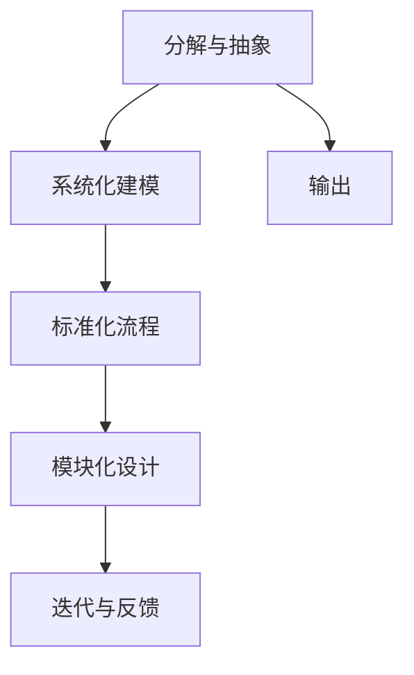

                 

## 1. 背景介绍

结构化思维是现代技术管理和工程实践中不可或缺的思考方式。它不仅在软件开发、算法设计等传统IT领域得到广泛应用，还在项目管理和企业战略规划中显示出巨大的价值。本文将从结构化思维的核心理念出发，探讨其在IT领域的应用场景、核心算法以及相关实践，帮助读者深入理解这一重要方法。

## 2. 核心概念与联系

### 2.1 核心概念概述

结构化思维是一种基于系统性和条理性思考问题的方法，旨在通过模块化的步骤将复杂问题分解为可管理的子问题，并通过严谨的逻辑框架来分析和解决问题。其主要关注点包括：

- **分解与抽象**：将问题拆分成更小的部分，并抽象出其中的关键要素。
- **系统化建模**：构建一个完整的模型来描述问题，包括输入、处理和输出。
- **标准化流程**：设计标准化的操作流程，减少复杂性，提高可控性。
- **模块化设计**：通过将问题分解为多个模块，简化解决复杂问题的难度。
- **迭代与反馈**：通过迭代优化和反馈机制不断改进解决方案。

这些核心概念共同构成了结构化思维的理论框架，使其在各个IT领域都能发挥作用。

### 2.2 核心概念原理和架构的 Mermaid 流程图



这个流程图展示了结构化思维的逻辑流程：将问题抽象分解后构建模型，再标准化操作流程，并设计模块化解决方案，通过迭代和反馈不断优化。

## 3. 核心算法原理 & 具体操作步骤

### 3.1 算法原理概述

结构化思维的算法原理主要基于系统工程方法，通过分解、抽象、建模、流程标准化、模块化设计和迭代优化等步骤，实现复杂问题的解决。这一过程可以分为以下几个阶段：

1. **需求分析**：明确问题定义和目标。
2. **问题分解**：将问题拆分成更小的部分，以便于管理和解决。
3. **抽象建模**：抽象出问题的关键要素，构建系统模型。
4. **流程标准化**：设计标准化的操作流程，确保一致性和可控性。
5. **模块化设计**：将问题分解为多个模块，简化解决复杂问题的难度。
6. **迭代优化**：通过多次迭代和反馈机制不断改进解决方案。

### 3.2 算法步骤详解

以下将详细介绍结构化思维的核心算法步骤。

#### 3.2.1 需求分析

需求分析是解决任何问题的第一步。这一阶段的目标是清晰地理解问题的本质和目标，确保后续步骤的合理性和有效性。

1. **定义问题**：明确问题的具体定义和目标，例如：“开发一个具有高可用性、高性能、可扩展的Web服务架构”。
2. **确定约束条件**：列出所有限制条件，如技术栈、时间限制、预算等。

#### 3.2.2 问题分解

问题分解是将复杂问题拆分成更小、更易于管理的部分。这有助于我们集中精力解决每个子问题，同时避免遗漏重要细节。

1. **列出所有子任务**：根据问题定义，列出所有需要完成的任务。例如：“设计系统架构、选择技术栈、编写代码、测试与部署”。
2. **优先级排序**：根据重要性和紧急性对子任务进行排序，以确定处理的先后顺序。

#### 3.2.3 抽象建模

抽象建模是通过建立系统模型来描述问题的关键要素。这一步骤有助于我们更清晰地理解问题的整体框架。

1. **系统要素识别**：识别系统中的关键要素，如输入、处理、输出、外部环境等。
2. **构建模型**：使用图表、文字等形式描述系统模型，例如UML图、流程图、伪代码等。

#### 3.2.4 流程标准化

流程标准化是确保一致性和可控性的关键步骤。通过标准化操作流程，可以减少复杂性，提高可控性。

1. **设计标准流程**：根据最佳实践和规范，设计标准操作流程。例如：需求分析、设计、编码、测试、部署等。
2. **文档化流程**：将标准流程文档化，确保所有相关人员都能理解和遵循。

#### 3.2.5 模块化设计

模块化设计是将问题分解为多个模块，简化解决复杂问题的难度。通过模块化，可以更灵活地组合和重用解决方案。

1. **模块划分**：根据功能、技术栈或数据流，将系统划分为多个模块。例如：前端、后端、数据库、缓存等。
2. **接口定义**：为模块之间定义清晰的接口，确保它们可以独立工作并相互配合。

#### 3.2.6 迭代优化

迭代优化是通过多次迭代和反馈机制不断改进解决方案。这一过程是持续改进的关键步骤。

1. **迭代计划**：制定迭代计划，包括目标、时间安排和资源分配。例如：每次迭代的目标、时间周期、团队成员等。
2. **实施与验证**：根据计划实施迭代，并在每个迭代结束时进行验证和评估。
3. **反馈与改进**：根据验证结果，收集反馈，并调整和改进解决方案。

### 3.3 算法优缺点

#### 3.3.1 优点

- **系统性思考**：通过分解和抽象，能够更全面、系统地思考问题，避免遗漏重要细节。
- **可控性提升**：通过流程标准化和模块化设计，提高了系统的可控性和一致性。
- **效率提升**：通过迭代优化，能够不断改进解决方案，提升项目效率和质量。

#### 3.3.2 缺点

- **初期投入大**：结构化思维需要投入大量时间和精力进行需求分析和模型构建，初期成本较高。
- **灵活性不足**：标准化的流程和模块可能限制创新和灵活性，有时难以应对变化。
- **依赖人员素质**：需要团队具备较强的系统思维和项目管理能力，对人员素质要求较高。

### 3.4 算法应用领域

结构化思维在IT领域的应用非常广泛，涵盖软件开发、系统设计、项目管理、业务流程优化等多个方面。以下是几个典型的应用场景：

1. **软件工程**：在软件开发过程中，通过需求分析、问题分解、抽象建模、模块化设计和迭代优化，实现高质量的软件系统。例如：敏捷开发、Scrum框架等。
2. **系统架构设计**：在系统架构设计中，通过系统要素识别、流程标准化和模块化设计，构建高效、可扩展的系统架构。例如：微服务架构、SOA架构等。
3. **项目管理**：在项目管理中，通过需求分析、流程标准化和迭代优化，确保项目按时、按质、按预算完成。例如：瀑布模型、敏捷模型等。
4. **业务流程优化**：在业务流程优化中，通过问题分解、流程标准化和模块化设计，提升业务流程效率和质量。例如：BPMN模型、流程建模工具等。
5. **企业战略规划**：在企业战略规划中，通过系统性思考和目标设定，制定科学合理的战略方向。例如：战略地图、平衡计分卡等。

## 4. 数学模型和公式 & 详细讲解 & 举例说明

### 4.1 数学模型构建

结构化思维的数学模型通常包含以下几个关键元素：

- **输入变量**：系统所需的所有输入。
- **处理函数**：对输入进行处理的关键算法或逻辑。
- **输出变量**：系统的最终输出。
- **约束条件**：限制系统行为的所有条件。

一个简单的数学模型可以表示为：

$$ M = f(I, P, O, C) $$

其中：
- $M$：系统模型
- $I$：输入变量
- $P$：处理函数
- $O$：输出变量
- $C$：约束条件

### 4.2 公式推导过程

以一个简单的Web服务架构设计为例，推导结构化思维的数学模型。

**输入变量**：
- $I_{req}$：用户请求
- $I_{conf}$：系统配置
- $I_{env}$：环境变量

**处理函数**：
- $P_{req}$：处理用户请求
- $P_{conf}$：处理系统配置
- $P_{env}$：处理环境变量

**输出变量**：
- $O_{res}$：系统响应

**约束条件**：
- $C_{req}$：请求的合法性约束
- $C_{conf}$：配置的合理性约束
- $C_{env}$：环境变量的合法性约束

将上述元素整合为一个数学模型：

$$ M = f(I_{req}, P_{req}, I_{conf}, P_{conf}, I_{env}, P_{env}, O_{res}, C_{req}, C_{conf}, C_{env}) $$

### 4.3 案例分析与讲解

以下通过一个实际的Web服务架构设计案例，详细讲解结构化思维的实施步骤。

**需求分析**：

1. **定义问题**：开发一个具有高可用性、高性能、可扩展的Web服务架构。
2. **确定约束条件**：技术栈为Spring Boot，时间限制为6个月，预算为20万美元。

**问题分解**：

1. **列出所有子任务**：
   - 需求分析
   - 设计系统架构
   - 选择技术栈
   - 编写代码
   - 测试与部署

2. **优先级排序**：
   - 需求分析
   - 设计系统架构
   - 选择技术栈
   - 编写代码
   - 测试与部署

**抽象建模**：

1. **系统要素识别**：
   - 输入：用户请求、系统配置、环境变量
   - 处理：请求处理、配置处理、环境处理
   - 输出：系统响应
   - 约束：请求合法性、配置合理性、环境合法性

2. **构建模型**：
   - 使用UML图表示系统架构：
     ```mermaid
     er diagram
       User Request -- 处理请求 -- System Response
        |                 |
        |                 |
        |                 |
       Configurations -- 处理配置 -- System Response
        |                 |
        |                 |
        |                 |
     Environment Variables -- 处理环境变量 -- System Response
     ```

**流程标准化**：

1. **设计标准流程**：
   - 需求分析：与利益相关者沟通，确定需求
   - 设计系统架构：选择架构模式，设计模块
   - 选择技术栈：评估不同技术栈的优劣
   - 编写代码：按模块编写代码，确保可测试性
   - 测试与部署：进行单元测试、集成测试、性能测试，部署到生产环境

2. **文档化流程**：
   - 编写系统架构文档、技术栈选择文档、测试文档、部署文档等。

**模块化设计**：

1. **模块划分**：
   - 前端：用户请求处理
   - 后端：系统配置处理
   - 数据库：环境变量处理

2. **接口定义**：
   - 定义前后端接口、数据库接口等。

**迭代优化**：

1. **迭代计划**：
   - 每次迭代的目标：设计一个模块、完成一个模块的编写和测试

2. **实施与验证**：
   - 完成每个迭代目标后，进行验证和评估

3. **反馈与改进**：
   - 根据验证结果，收集反馈，调整和改进解决方案

## 5. 项目实践：代码实例和详细解释说明

### 5.1 开发环境搭建

在结构化思维的实践中，开发环境搭建是一个重要的环节。以下是使用Python和Docker搭建Web服务架构设计的开发环境的步骤：

1. **安装Docker和Docker Compose**：
   ```bash
   sudo apt-get install docker.io docker-compose
   ```

2. **安装Python和相关库**：
   ```bash
   sudo apt-get install python3 python3-pip
   sudo apt-get install python3-dev
   ```

3. **安装虚拟环境**：
   ```bash
   python3 -m venv env
   source env/bin/activate
   ```

4. **安装Flask和相关库**：
   ```bash
   pip install flask gunicorn
   ```

5. **编写代码**：
   - 创建`app.py`文件，编写Flask应用代码。
   ```python
   from flask import Flask, jsonify

   app = Flask(__name__)

   @app.route('/')
   def index():
       return jsonify({'message': 'Hello, world!'})

   if __name__ == '__main__':
       app.run(host='0.0.0.0', port=5000)
   ```

6. **编写Dockerfile**：
   ```dockerfile
   FROM python:3.8
   WORKDIR /app
   COPY . .
   RUN pip install -r requirements.txt
   EXPOSE 5000
   CMD ["gunicorn", "app:app", "-b", "0.0.0.0:5000"]
   ```

7. **编写docker-compose.yml文件**：
   ```yaml
   version: '3.8'
   services:
     web:
       build: .
       ports:
         - "5000:5000"
   ```

8. **启动Docker容器**：
   ```bash
   docker-compose up
   ```

### 5.2 源代码详细实现

以下是一个简单的结构化思维实践示例，包括需求分析、问题分解、抽象建模、流程标准化、模块化设计和迭代优化等步骤。

**需求分析**：

1. **定义问题**：开发一个具有高可用性、高性能、可扩展的Web服务架构。
2. **确定约束条件**：技术栈为Spring Boot，时间限制为6个月，预算为20万美元。

**问题分解**：

1. **列出所有子任务**：
   - 需求分析
   - 设计系统架构
   - 选择技术栈
   - 编写代码
   - 测试与部署

2. **优先级排序**：
   - 需求分析
   - 设计系统架构
   - 选择技术栈
   - 编写代码
   - 测试与部署

**抽象建模**：

1. **系统要素识别**：
   - 输入：用户请求、系统配置、环境变量
   - 处理：请求处理、配置处理、环境处理
   - 输出：系统响应
   - 约束：请求合法性、配置合理性、环境合法性

2. **构建模型**：
   - 使用UML图表示系统架构：
     ```mermaid
     er diagram
       User Request -- 处理请求 -- System Response
        |                 |
        |                 |
        |                 |
       Configurations -- 处理配置 -- System Response
        |                 |
        |                 |
        |                 |
     Environment Variables -- 处理环境变量 -- System Response
     ```

**流程标准化**：

1. **设计标准流程**：
   - 需求分析：与利益相关者沟通，确定需求
   - 设计系统架构：选择架构模式，设计模块
   - 选择技术栈：评估不同技术栈的优劣
   - 编写代码：按模块编写代码，确保可测试性
   - 测试与部署：进行单元测试、集成测试、性能测试，部署到生产环境

2. **文档化流程**：
   - 编写系统架构文档、技术栈选择文档、测试文档、部署文档等。

**模块化设计**：

1. **模块划分**：
   - 前端：用户请求处理
   - 后端：系统配置处理
   - 数据库：环境变量处理

2. **接口定义**：
   - 定义前后端接口、数据库接口等。

**迭代优化**：

1. **迭代计划**：
   - 每次迭代的目标：设计一个模块、完成一个模块的编写和测试

2. **实施与验证**：
   - 完成每个迭代目标后，进行验证和评估

3. **反馈与改进**：
   - 根据验证结果，收集反馈，调整和改进解决方案

### 5.3 代码解读与分析

以下是代码的具体解读和分析：

**app.py**：
- 创建一个Flask应用，定义了一个简单的路由。
- `if __name__ == '__main__':
    app.run(host='0.0.0.0', port=5000)`：启动应用，监听本地5000端口。

**Dockerfile**：
- 基于Python 3.8基础镜像，设置工作目录，复制项目代码到容器中，安装依赖库，暴露端口，定义启动命令。

**docker-compose.yml**：
- 定义Docker容器，包含一个名为`web`的服务，使用`Dockerfile`构建镜像，映射5000端口。

### 5.4 运行结果展示

运行上述代码后，可以在本地或远程访问该Web服务。通过浏览器访问`http://localhost:5000`，应该会看到`Hello, world!`的JSON响应。

## 6. 实际应用场景

### 6.1 项目管理

结构化思维在项目管理中的应用非常广泛。通过结构化思维，可以更系统地管理和优化项目流程，确保项目按时、按质、按预算完成。

**场景描述**：
一家公司计划开发一款新产品，从需求分析到发布上线，涉及多个阶段和部门。项目团队希望通过结构化思维进行项目管理。

**实施步骤**：
1. **需求分析**：与利益相关者沟通，明确项目目标和需求。
2. **问题分解**：列出所有子任务，如需求分析、设计、编码、测试、部署等。
3. **抽象建模**：识别项目中的关键要素，如输入、处理、输出、约束等。
4. **流程标准化**：设计标准操作流程，确保一致性和可控性。
5. **模块化设计**：将项目划分为多个模块，如前端、后端、测试等。
6. **迭代优化**：通过多次迭代和反馈机制不断改进解决方案。

**效果评估**：
通过结构化思维项目管理，项目团队能够更系统、更高效地完成各项任务，确保项目按时、按质、按预算完成。

### 6.2 业务流程优化

在业务流程优化中，结构化思维可以识别流程中的瓶颈和冗余，提出改进方案，提高效率和质量。

**场景描述**：
某公司希望优化其销售流程，提高销售效率和客户满意度。

**实施步骤**：
1. **需求分析**：与销售团队沟通，明确优化目标和需求。
2. **问题分解**：列出所有子任务，如需求分析、流程设计、系统实施等。
3. **抽象建模**：识别流程中的关键要素，如输入、处理、输出、约束等。
4. **流程标准化**：设计标准操作流程，确保一致性和可控性。
5. **模块化设计**：将流程划分为多个模块，如需求收集、流程设计、系统实施等。
6. **迭代优化**：通过多次迭代和反馈机制不断改进解决方案。

**效果评估**：
通过结构化思维优化业务流程，公司能够提高销售效率和客户满意度，减少人力成本，提升整体竞争力。

### 6.3 软件开发

在软件开发中，结构化思维可以帮助开发团队更好地组织和管理代码，提高代码质量。

**场景描述**：
一家公司开发一个新的Web应用程序，涉及前端、后端、数据库等多个模块。开发团队希望通过结构化思维进行代码管理。

**实施步骤**：
1. **需求分析**：与利益相关者沟通，明确功能需求和设计要求。
2. **问题分解**：列出所有子任务，如功能模块设计、代码编写、测试等。
3. **抽象建模**：识别系统中的关键要素，如输入、处理、输出、约束等。
4. **流程标准化**：设计标准开发流程，确保一致性和可控性。
5. **模块化设计**：将系统划分为多个模块，如前端、后端、数据库等。
6. **迭代优化**：通过多次迭代和反馈机制不断改进解决方案。

**效果评估**：
通过结构化思维进行软件开发，开发团队能够更好地组织和管理代码，提高代码质量和开发效率。

## 7. 工具和资源推荐

### 7.1 学习资源推荐

为了帮助开发者更好地掌握结构化思维的应用，这里推荐一些优质的学习资源：

1. **《系统思维与结构化分析》**：这本书系统介绍了结构化思维的基本原理和应用方法，适合初学者和进阶者阅读。
2. **《系统思考：如何掌握复杂问题的解决之道》**：这本书深入探讨了系统思维的核心理念和实践方法，适合对系统思维有深入需求的技术人员。
3. **Udemy上的《系统思考与结构化分析》课程**：这是一门系统思考和结构化分析的在线课程，涵盖了系统思维的基本概念和实际应用。
4. **Coursera上的《系统思维与创新》课程**：这是一门系统思维和创新方法论的在线课程，通过实际案例教授系统思维的应用。
5. **IEEE Spectrum上的《系统思维：未来的技术》文章**：这篇文章探讨了系统思维在未来的技术应用，提供了丰富的案例和思考方法。

通过这些学习资源，相信读者能够系统地掌握结构化思维的理论基础和实践技巧。

### 7.2 开发工具推荐

在结构化思维的实践中，一些工具可以显著提升开发效率和质量。以下是几款推荐的开发工具：

1. **JIRA**：项目管理工具，帮助团队更好地规划和跟踪任务，提高项目管理效率。
2. **Docker**：容器化部署工具，提供可移植、可扩展的开发环境。
3. **Git**：版本控制工具，帮助团队协作和代码管理。
4. **Kubernetes**：容器编排工具，实现自动化部署和运维。
5. **Slack**：即时通讯工具，提升团队沟通和协作效率。

这些工具的合理应用，可以帮助开发者更好地实施结构化思维，提升项目管理和开发效率。

### 7.3 相关论文推荐

结构化思维的研究涉及多个学科领域，以下推荐一些相关的学术论文，供读者深入学习：

1. **《系统思维：一种新的管理方法》**：本文探讨了系统思维的基本原理和管理方法，对结构化思维的实践有重要的参考价值。
2. **《结构化分析与设计：一种系统化的方法》**：本文系统介绍了结构化分析与设计的基本概念和方法，适合IT领域的开发人员。
3. **《结构化系统分析与设计》**：这本书系统介绍了结构化分析与设计的方法和工具，适合系统分析师和软件工程师阅读。
4. **《基于系统思维的项目管理方法》**：本文探讨了系统思维在项目管理中的应用，提供了很多实用的方法和案例。
5. **《结构化思维在软件开发中的应用》**：本文介绍了结构化思维在软件开发中的应用，提供了大量的实践案例和经验分享。

这些论文提供了丰富的理论支持和实践方法，对理解结构化思维的应用有重要的帮助。

## 8. 总结：未来发展趋势与挑战

### 8.1 研究成果总结

结构化思维在IT领域的应用取得了显著的成果，已经在项目管理、系统设计、业务流程优化、软件开发等多个方面得到广泛应用。通过系统化思考，团队能够更高效地管理复杂问题，提升项目成功率和质量。

### 8.2 未来发展趋势

未来，结构化思维的应用将更加广泛和深入。以下是我对结构化思维未来发展趋势的几点展望：

1. **人工智能的应用**：结构化思维将与人工智能技术深度融合，提升AI系统的可解释性和可控性。例如，通过结构化思维优化AI模型的训练流程和推理过程。
2. **大数据分析**：结构化思维将与大数据分析技术结合，提升数据处理和分析的效率和质量。例如，通过结构化思维设计高效的数据处理流程和分析模型。
3. **持续学习和改进**：结构化思维将引入持续学习机制，提升系统的自适应能力和改进能力。例如，通过持续优化和反馈机制不断改进解决方案。
4. **跨领域应用**：结构化思维将拓展到更多领域，如金融、医疗、教育等，提升各领域的系统管理水平和运营效率。
5. **自动化和智能化**：结构化思维将与自动化和智能化技术结合，提升系统的自动化程度和智能化水平。例如，通过结构化思维优化自动化流程和智能化决策模型。

### 8.3 面临的挑战

虽然结构化思维在IT领域已经取得了显著成果，但在实施过程中也面临一些挑战：

1. **复杂性增加**：随着系统的复杂度增加，结构化思维的实施难度和复杂度也随之增加。如何平衡复杂性和可控性是一个重要问题。
2. **知识共享**：结构化思维的实施需要团队成员具备较强的系统思维能力，如何实现知识的共享和传承是一个挑战。
3. **成本投入**：结构化思维的实施需要投入大量时间和资源，如何平衡成本和收益是一个重要问题。
4. **灵活性不足**：标准化的流程和模块可能限制创新和灵活性，有时难以应对变化。

### 8.4 研究展望

为了克服这些挑战，未来的研究需要在以下几个方面寻求新的突破：

1. **自动化工具**：开发更多自动化工具和平台，降低结构化思维的实施难度和复杂度。例如，基于AI的自动化流程优化工具。
2. **知识共享平台**：建立知识共享平台，促进知识传承和创新。例如，基于云平台的知识管理工具。
3. **灵活性设计**：设计更加灵活的结构化思维框架，增强系统的创新能力和适应性。例如，可配置的结构化思维模型。
4. **混合方法**：将结构化思维与其他方法结合，提升系统管理和优化的效果。例如，结合系统思维和设计思维的方法。

总之，结构化思维作为一种重要的思维方式，已经在IT领域得到了广泛应用。未来，随着技术的不断进步和实际应用场景的不断丰富，结构化思维将发挥更大的作用，助力IT系统的高效管理与优化。

## 9. 附录：常见问题与解答

**Q1：结构化思维与敏捷开发的区别是什么？**

A: 结构化思维和敏捷开发都是项目管理的重要方法，但侧重点不同。结构化思维注重系统化思考和流程标准化，强调详细的需求分析和设计。而敏捷开发注重快速迭代和用户反馈，强调灵活性和适应性。两者的结合可以提升项目管理的效果和质量。

**Q2：结构化思维是否适用于所有类型的项目？**

A: 结构化思维在大多数类型的项目中都能取得良好的效果，特别是在复杂系统和大型项目中。但对于一些简单的项目或创新性强、变化频繁的项目，可能需要采用更加灵活的方法。

**Q3：如何平衡复杂性和可控性？**

A: 在实施结构化思维时，需要根据项目的具体情况灵活调整。可以采用模块化设计，将系统分解为多个模块，每个模块独立设计、独立测试，从而降低复杂性。同时，引入持续改进机制，定期收集反馈，不断优化解决方案。

**Q4：结构化思维在敏捷开发中的应用有哪些？**

A: 结构化思维在敏捷开发中也有广泛应用，例如在需求分析和设计阶段，可以采用结构化思维进行详细的需求分析和系统设计，确保项目的高质量完成。同时，可以在敏捷开发中引入结构化思维的流程标准化和模块化设计，提升团队的协作效率和项目管理的可控性。

通过这些常见问题的解答，相信读者能够更好地理解结构化思维的核心理念和实践方法，并在实际项目中灵活应用。

---

作者：禅与计算机程序设计艺术 / Zen and the Art of Computer Programming

