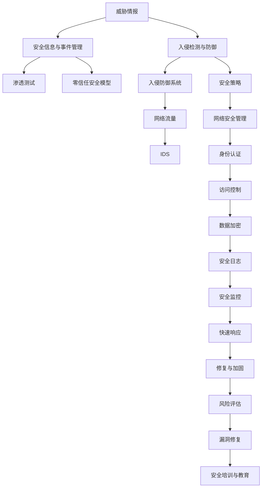
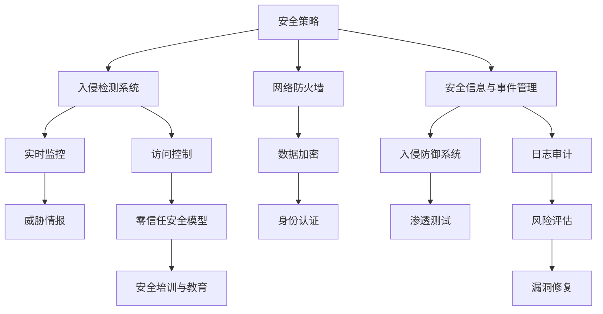

                 

# 网络安全管理：保护组织数字资产

## 1. 背景介绍

在数字化转型深入发展的今天，网络安全已经成为组织在信息时代生存的关键因素。无论是政府机构、金融机构、科技企业，还是普通企业，其业务和数据均高度依赖于网络系统。网络攻击、数据泄露、恶意软件等威胁层出不穷，给组织带来了巨大的经济损失和声誉风险。因此，网络安全管理已成为组织数字资产保护的核心工作。

### 1.1 问题由来

网络安全管理的复杂性主要体现在以下几个方面：

- **复杂性高**：网络攻击手段不断进化，漏洞利用形式多样化，防御难度日益增加。
- **资源有限**：人力、技术、资金等资源有限，难以覆盖所有安全威胁。
- **数据敏感**：组织内部涉及大量敏感数据，一旦泄露可能造成巨大损失。
- **合规压力**：法律法规不断更新，组织需要不断调整安全策略以符合合规要求。

### 1.2 问题核心关键点

为了有效应对这些挑战，组织需要在网络安全管理中，采用系统化、科学化的策略和方法，确保数字资产的安全。网络安全管理的关键点包括：

- **威胁评估**：识别潜在威胁，评估风险等级。
- **策略制定**：制定符合组织需求的安全策略，如身份认证、访问控制、数据加密等。
- **技术部署**：部署相应的安全技术，如防火墙、入侵检测系统(IDS)、安全信息与事件管理(SIEM)等。
- **监控与响应**：实时监控网络活动，对异常行为进行快速响应和处理。
- **培训与教育**：提升员工安全意识和技能，减少人为失误带来的安全风险。

### 1.3 问题研究意义

网络安全管理的研究意义在于：

- **降低风险**：通过科学的管理方法，有效降低网络攻击和数据泄露的风险。
- **保障业务连续性**：确保网络安全，保障业务运营的连续性和稳定性。
- **提升竞争力**：在数据驱动的时代，网络安全已成为企业竞争力的重要组成部分。
- **促进法规合规**：符合相关法律法规，避免因安全问题导致的法律风险。

## 2. 核心概念与联系

### 2.1 核心概念概述

为了更好地理解网络安全管理，本节将介绍几个核心概念：

- **网络安全管理(Network Security Management)**：指通过一系列技术和政策手段，保障组织网络系统的安全性，预防、检测和应对各种网络威胁。
- **威胁情报(Threat Intelligence)**：指收集和分析关于网络威胁的最新信息，帮助组织及时识别和响应威胁。
- **入侵检测与防御(IDS/IPS)**：指使用入侵检测系统(IDS)和入侵防御系统(IPS)，监控网络流量，检测并阻止恶意行为。
- **安全信息与事件管理(SIEM)**：指使用SIEM工具，集中管理和分析安全日志，快速响应安全事件。
- **渗透测试(Penetration Testing)**：指通过模拟攻击，评估网络系统的安全强度，发现潜在漏洞。
- **零信任安全模型(Zero Trust Model)**：指以“永远不信任，持续验证”的原则，确保任何访问请求都需要严格验证。

这些核心概念之间的逻辑关系可以通过以下Mermaid流程图来展示：



这个流程图展示了大语言模型的核心概念及其之间的关系：

1. 威胁情报是网络安全管理的基础，帮助组织及时了解最新的威胁动态。
2. 入侵检测与防御是网络安全管理的关键技术，通过检测和阻止恶意行为，保障网络安全。
3. 安全信息与事件管理是网络安全管理的核心工具，集中管理和分析安全日志，快速响应安全事件。
4. 渗透测试是评估网络安全强度的有效手段，通过模拟攻击发现潜在漏洞。
5. 零信任安全模型是网络安全管理的高级策略，确保访问请求严格验证。

这些概念共同构成了网络安全管理的框架，确保组织能够有效应对各类网络威胁。

## 3. 核心算法原理 & 具体操作步骤

### 3.1 算法原理概述

网络安全管理涉及多维度的技术和策略，其核心原理在于通过一系列技术手段和策略措施，对网络环境进行全面监控和防护，确保网络系统安全。其技术架构如图：



该架构展示了网络安全管理的核心技术：

- **安全策略**：根据组织需求，制定符合实际的安全策略，如身份认证、访问控制、数据加密等。
- **入侵检测与防御**：部署入侵检测系统(IDS)和入侵防御系统(IPS)，实时监控网络流量，检测并阻止恶意行为。
- **安全信息与事件管理(SIEM)**：集中管理和分析安全日志，快速响应安全事件。
- **网络防火墙**：在网络边界部署防火墙，防止未经授权的访问。
- **威胁情报**：收集和分析关于网络威胁的最新信息，帮助组织及时识别和响应威胁。
- **日志审计**：定期审计安全日志，评估安全策略的有效性。
- **风险评估**：定期评估网络系统的安全风险，发现潜在威胁。
- **渗透测试**：通过模拟攻击，评估网络系统的安全强度，发现潜在漏洞。
- **零信任安全模型**：以“永远不信任，持续验证”的原则，确保任何访问请求都需要严格验证。
- **安全培训与教育**：提升员工安全意识和技能，减少人为失误带来的安全风险。
- **漏洞修复**：定期修复发现的漏洞，提升系统安全性。

### 3.2 算法步骤详解

以下是网络安全管理的具体操作步骤：

**Step 1: 威胁情报收集与分析**

1. **收集威胁情报**：从多个来源收集关于网络威胁的信息，包括开源情报(OSINT)、网络安全报告、威胁情报共享平台等。
2. **威胁情报分析**：使用自然语言处理(NLP)等技术，分析威胁情报，提取关键信息，如攻击者动机、攻击手段、攻击目标等。

**Step 2: 安全策略制定**

1. **评估安全需求**：根据组织业务和数据类型，评估安全需求，确定需要采取的安全措施。
2. **制定安全策略**：根据安全需求，制定符合组织需求的安全策略，如身份认证、访问控制、数据加密等。

**Step 3: 技术部署与配置**

1. **入侵检测与防御(IDS/IPS)**：部署入侵检测系统(IDS)和入侵防御系统(IPS)，配置检测规则，确保网络流量被有效监控。
2. **安全信息与事件管理(SIEM)**：部署SIEM工具，集中管理和分析安全日志，配置告警规则，快速响应安全事件。
3. **网络防火墙**：在网络边界部署防火墙，配置访问控制策略，防止未经授权的访问。
4. **数据加密**：在数据传输和存储过程中，使用加密技术保护数据安全。
5. **身份认证**：采用多因素认证(MFA)等技术，确保用户身份的合法性。
6. **访问控制**：配置访问控制策略，限制用户对敏感数据的访问权限。

**Step 4: 实时监控与响应**

1. **实时监控**：通过入侵检测系统(IDS)和入侵防御系统(IPS)，实时监控网络流量，检测异常行为。
2. **告警与响应**：一旦发现异常行为，立即触发告警，根据安全策略进行响应，如封锁IP、阻断连接等。

**Step 5: 日志审计与风险评估**

1. **日志审计**：定期审计安全日志，检查异常行为，评估安全策略的有效性。
2. **风险评估**：定期评估网络系统的安全风险，发现潜在威胁，制定应对策略。

**Step 6: 渗透测试**

1. **渗透测试准备**：制定渗透测试计划，选择合适的渗透测试工具和框架。
2. **执行渗透测试**：模拟攻击，发现潜在漏洞，评估网络系统的安全强度。
3. **修复漏洞**：根据渗透测试结果，修复发现的漏洞，提升系统安全性。

**Step 7: 安全培训与教育**

1. **安全意识培训**：定期进行安全意识培训，提升员工对网络安全的认识和技能。
2. **安全技能培训**：针对不同角色，开展针对性的安全技能培训，提升员工的安全响应能力。

### 3.3 算法优缺点

网络安全管理技术具有以下优点：

- **综合性强**：综合采用多种技术和策略，能够有效应对各类网络威胁。
- **快速响应**：通过实时监控和告警机制，能够快速响应安全事件，减少损失。
- **持续改进**：定期进行威胁情报收集和渗透测试，不断改进安全策略和技术。

但同时，网络安全管理也存在以下缺点：

- **资源消耗大**：部署和维护多种安全技术需要大量资源。
- **技术复杂**：需要具备较高的技术水平和管理能力。
- **人为因素**：员工安全意识和技能不足，可能导致人为失误带来的安全风险。

### 3.4 算法应用领域

网络安全管理技术广泛应用在多个领域，包括但不限于：

- **政府与公共机构**：保护敏感数据和重要系统，防止网络攻击和信息泄露。
- **金融机构**：保障交易安全，防止金融欺诈和数据泄露。
- **科技企业**：保护知识产权和商业机密，防止竞争对手获取。
- **医疗行业**：保护患者隐私和医疗数据，防止医疗事故和数据泄露。
- **教育机构**：保护学生和教职员工数据，防止网络攻击和信息泄露。

## 4. 数学模型和公式 & 详细讲解

### 4.1 数学模型构建

网络安全管理涉及的数学模型包括威胁情报分析、风险评估、渗透测试等。以下以威胁情报分析为例，构建相应的数学模型。

设威胁情报$T$由多条记录组成，每条记录$(t_i)$由以下几个部分组成：

- $t_i=\{时间(time_i),攻击者(attacker_i),攻击目标(target_i),攻击手段(technique_i),攻击动机(motive_i),攻击来源(source_i)\}$

威胁情报分析的数学模型为：

$$
\mathcal{L}(T) = \sum_{i=1}^n \mathcal{L}_i(t_i)
$$

其中，$\mathcal{L}_i(t_i)$为第$i$条记录的威胁情报分析损失函数。

### 4.2 公式推导过程

以时间(time_i)为例，威胁情报分析的损失函数为：

$$
\mathcal{L}_{time}(t_i) = \begin{cases}
c_1 & \text{如果时间异常} \\
0 & \text{如果时间正常}
\end{cases}
$$

其中，$c_1$为异常时间阈值。

对于攻击者(attacker_i)，威胁情报分析的损失函数为：

$$
\mathcal{L}_{attacker}(t_i) = \begin{cases}
c_2 & \text{如果攻击者异常} \\
0 & \text{如果攻击者正常}
\end{cases}
$$

其中，$c_2$为异常攻击者阈值。

类似地，可以构建攻击目标(target_i)、攻击手段(technique_i)、攻击动机(motive_i)和攻击来源(source_i)的损失函数。

### 4.3 案例分析与讲解

以某金融机构的威胁情报分析为例，假设一条威胁情报记录为：

- 时间：2022-01-01 12:30:00
- 攻击者：IP地址为192.168.1.100的计算机
- 攻击目标：银行的交易系统
- 攻击手段：SQL注入
- 攻击动机：金融欺诈
- 攻击来源：国内某未知攻击者

通过威胁情报分析的数学模型，可以得出：

- 时间：异常，损失为$c_1$
- 攻击者：异常，损失为$c_2$
- 攻击目标：正常
- 攻击手段：正常
- 攻击动机：正常
- 攻击来源：未知，损失为$c_3$

综合各部分损失，计算出整条威胁情报的威胁等级$L$：

$$
L = \mathcal{L}_{time}(t_i) + \mathcal{L}_{attacker}(t_i) + \mathcal{L}_{target}(t_i) + \mathcal{L}_{technique}(t_i) + \mathcal{L}_{motive}(t_i) + \mathcal{L}_{source}(t_i)
$$

根据威胁等级$L$，制定相应的应对策略，如封锁攻击源IP、提升系统防护等级等。

## 5. 项目实践：代码实例和详细解释说明

### 5.1 开发环境搭建

在进行网络安全管理项目实践前，需要准备好开发环境。以下是使用Python进行开发的环境配置流程：

1. 安装Anaconda：从官网下载并安装Anaconda，用于创建独立的Python环境。

2. 创建并激活虚拟环境：
```bash
conda create -n netsec-env python=3.8 
conda activate netsec-env
```

3. 安装相关库：
```bash
conda install numpy pandas matplotlib seaborn scikit-learn 
pip install requests beautifulsoup4
```

4. 安装渗透测试工具：
```bash
pip install nmap
```

完成上述步骤后，即可在`netsec-env`环境中开始网络安全管理实践。

### 5.2 源代码详细实现

以下是一个简单的渗透测试示例，使用Nmap进行端口扫描，获取目标主机的开放端口：

```python
import nmap

def scan_ports(target):
    nm = nmap.PortScanner()
    nm.scan(target, '-v')
    for i in nm.all_protocols():
        for j in nm[i]:
            print(f'{target}:{i}:{j}')

if __name__ == '__main__':
    scan_ports('192.168.1.100')
```

### 5.3 代码解读与分析

**代码解读**：

1. 导入nmap库，初始化PortScanner对象。
2. 调用scan方法进行端口扫描，参数`-v`表示详细输出扫描结果。
3. 遍历所有协议和开放的端口，输出扫描结果。

**分析**：

- 代码简洁高效，易于理解和扩展。
- 使用了nmap库的PortScanner类，方便进行端口扫描。
- 使用Python标准库的print函数输出扫描结果，便于观察。

## 6. 实际应用场景

### 6.1 智能制造

智能制造领域，网络安全管理尤为重要。智能制造系统通过物联网(IoT)设备进行实时数据采集和分析，保障数据传输的安全性，防止网络攻击和数据泄露，对于保障生产线的安全和稳定至关重要。

**实践场景**：某智能制造企业通过部署入侵检测系统(IDS)和入侵防御系统(IPS)，实时监控网络流量，检测并阻止恶意行为。一旦发现异常行为，立即触发告警，进行封锁IP、阻断连接等操作，保障生产线的稳定运行。

### 6.2 智慧医疗

智慧医疗领域，网络安全管理涉及医疗数据的隐私保护和医疗系统的安全运行。医疗数据涉及患者隐私，一旦泄露将造成严重后果。通过部署防火墙、加密技术、身份认证等手段，保护医疗数据和系统的安全性，防止网络攻击和数据泄露。

**实践场景**：某医院通过部署SIEM工具，集中管理和分析安全日志，实时监控网络活动，快速响应安全事件。通过定期渗透测试和漏洞修复，提升医疗系统的安全性，确保患者隐私和数据安全。

### 6.3 在线教育

在线教育领域，网络安全管理涉及学生和教职员工数据的安全保护。学生和教职员工的数据隐私需要得到严格保护，防止数据泄露和网络攻击。通过部署身份认证、访问控制、数据加密等手段，保障在线教育系统的安全性。

**实践场景**：某在线教育平台通过部署防火墙、入侵检测系统(IDS)和入侵防御系统(IPS)，实时监控网络流量，检测并阻止恶意行为。通过定期渗透测试和漏洞修复，提升在线教育系统的安全性，确保学生和教职员工的数据隐私。

## 7. 工具和资源推荐

### 7.1 学习资源推荐

为了帮助开发者系统掌握网络安全管理的理论基础和实践技巧，这里推荐一些优质的学习资源：

1. 《网络安全管理》课程：由知名大学开设，涵盖网络安全管理的核心概念和实践技术。

2. 《入侵检测系统(IDS)》课程：介绍入侵检测系统的基本原理、部署和配置。

3. 《安全信息与事件管理(SIEM)》课程：讲解SIEM工具的使用和配置，安全日志的集中管理和分析。

4. 《渗透测试》课程：详细讲解渗透测试的流程和方法，常见漏洞的利用和防御。

5. 《零信任安全模型》课程：介绍零信任安全模型的原理和实践，保障网络访问的安全性。

6. 《网络安全最佳实践》书籍：介绍网络安全管理的最佳实践和实用技巧。

通过对这些资源的学习实践，相信你一定能够快速掌握网络安全管理的精髓，并用于解决实际的业务问题。

### 7.2 开发工具推荐

高效的开发离不开优秀的工具支持。以下是几款用于网络安全管理开发的常用工具：

1. Python：Python语言易于学习和使用，有丰富的第三方库和框架，适合快速迭代研究。

2. Nmap：网络扫描工具，支持端口扫描、漏洞检测等功能，是渗透测试的必备工具。

3. Wireshark：网络协议分析工具，帮助开发者分析网络流量，发现异常行为。

4. Metasploit：开源渗透测试框架，提供丰富的攻击模块和漏洞库。

5. OSSEC：开源主机入侵检测系统，帮助监控和分析主机日志，防止入侵行为。

6. Nagios：开源网络监控工具，实时监控网络设备和服务器的运行状态。

合理利用这些工具，可以显著提升网络安全管理的开发效率，加快创新迭代的步伐。

### 7.3 相关论文推荐

网络安全管理的研究源于学界的持续研究。以下是几篇奠基性的相关论文，推荐阅读：

1. 《网络安全管理：从理论到实践》：介绍网络安全管理的核心概念和实践方法。

2. 《入侵检测系统的设计与实现》：详细介绍入侵检测系统的原理和实现。

3. 《安全信息与事件管理的挑战与机遇》：探讨安全信息与事件管理的发展和应用。

4. 《渗透测试的挑战与对策》：详细介绍渗透测试的挑战和应对策略。

5. 《零信任安全模型的原理与实践》：介绍零信任安全模型的原理和实践。

6. 《网络安全技术的发展与趋势》：探讨网络安全技术的发展趋势和未来方向。

这些论文代表了大语言模型微调技术的发展脉络。通过学习这些前沿成果，可以帮助研究者把握学科前进方向，激发更多的创新灵感。

## 8. 总结：未来发展趋势与挑战

### 8.1 总结

本文对网络安全管理进行全面系统的介绍。首先阐述了网络安全管理的背景和意义，明确了网络安全管理在组织数字资产保护中的重要价值。其次，从原理到实践，详细讲解了网络安全管理的核心步骤和技术要点，给出了网络安全管理项目开发的完整代码实例。同时，本文还广泛探讨了网络安全管理在智能制造、智慧医疗、在线教育等多个行业领域的应用前景，展示了网络安全管理的巨大潜力。最后，本文精选了网络安全管理的各类学习资源，力求为读者提供全方位的技术指引。

通过本文的系统梳理，可以看到，网络安全管理是一个复杂且综合性的系统工程，涉及多个技术层面的设计和部署。为了确保组织网络系统的安全性，需要在威胁情报收集、安全策略制定、技术部署与配置、实时监控与响应、日志审计与风险评估、渗透测试、安全培训与教育等多个环节进行全面优化，方能有效地保护组织数字资产。

### 8.2 未来发展趋势

展望未来，网络安全管理将呈现以下几个发展趋势：

1. **自动化与智能化**：借助人工智能和大数据分析技术，自动化识别和响应网络威胁，提高网络安全管理的效率和效果。

2. **威胁情报的实时化**：通过实时收集和分析威胁情报，提前发现和应对网络威胁，减少安全事件的发生。

3. **零信任安全模型**：推广零信任安全模型，确保任何访问请求都需要严格验证，保障网络安全。

4. **多维度的防御策略**：结合网络、应用、数据等多个层面的防御策略，构建综合性的安全防护体系。

5. **跨领域的安全协作**：与其他领域的安全技术进行深度融合，构建全方位的安全防护网络。

6. **法规合规的全面化**：与法律法规同步更新，确保网络安全管理符合最新的合规要求。

这些趋势将进一步提升网络安全管理的水平，保障组织数字资产的安全性。

### 8.3 面临的挑战

尽管网络安全管理已经取得了一定的成就，但在迈向更加智能化和普适化的过程中，它仍面临诸多挑战：

1. **技术更新迅速**：网络攻击手段和漏洞不断演变，需要持续更新安全策略和防御技术。

2. **资源有限**：人力、技术、资金等资源有限，难以全面覆盖所有安全威胁。

3. **用户意识不足**：员工安全意识和技能不足，可能导致人为失误带来的安全风险。

4. **数据隐私保护**：处理大量敏感数据时，需要平衡数据保护和数据使用的需求。

5. **法律法规复杂**：法律法规不断更新，需要不断调整安全策略以符合合规要求。

6. **跨领域协作困难**：与其他领域的安全技术进行深度融合时，面临协调和整合的困难。

7. **成本投入高**：部署和维护多种安全技术需要较高的投入，增加了企业的运营成本。

正视网络安全管理面临的这些挑战，积极应对并寻求突破，将是大语言模型微调走向成熟的必由之路。相信随着学界和产业界的共同努力，这些挑战终将一一被克服，网络安全管理必将在构建安全、可靠、可控的智能系统中扮演越来越重要的角色。

### 8.4 研究展望

面对网络安全管理所面临的种种挑战，未来的研究需要在以下几个方面寻求新的突破：

1. **自动化与智能化技术**：借助人工智能和大数据分析技术，自动化识别和响应网络威胁，提高网络安全管理的效率和效果。

2. **威胁情报的实时化**：通过实时收集和分析威胁情报，提前发现和应对网络威胁，减少安全事件的发生。

3. **零信任安全模型**：推广零信任安全模型，确保任何访问请求都需要严格验证，保障网络安全。

4. **多维度的防御策略**：结合网络、应用、数据等多个层面的防御策略，构建综合性的安全防护体系。

5. **跨领域的安全协作**：与其他领域的安全技术进行深度融合，构建全方位的安全防护网络。

6. **法规合规的全面化**：与法律法规同步更新，确保网络安全管理符合最新的合规要求。

这些研究方向的探索，必将引领网络安全管理技术迈向更高的台阶，为构建安全、可靠、可控的智能系统铺平道路。面向未来，网络安全管理技术还需要与其他人工智能技术进行更深入的融合，如知识表示、因果推理、强化学习等，多路径协同发力，共同推动网络安全管理的进步。只有勇于创新、敢于突破，才能不断拓展网络安全管理的边界，让智能技术更好地造福人类社会。

## 9. 附录：常见问题与解答

**Q1：如何有效地进行威胁情报收集与分析？**

A: 有效进行威胁情报收集与分析，需要以下几个步骤：

1. **数据收集**：从多个来源收集威胁情报数据，包括开源情报(OSINT)、网络安全报告、威胁情报共享平台等。

2. **数据清洗**：清洗和处理收集到的数据，去除重复和无关信息，提取关键情报。

3. **情报分析**：使用自然语言处理(NLP)等技术，分析威胁情报，提取关键信息，如攻击者动机、攻击手段、攻击目标等。

4. **情报分类**：将威胁情报进行分类和标签化，便于后续分析和管理。

5. **情报融合**：将来自不同来源的威胁情报进行融合，生成综合性的情报报告。

通过以上步骤，可以有效地进行威胁情报的收集与分析，帮助组织及时识别和响应网络威胁。

**Q2：如何进行网络安全策略制定？**

A: 网络安全策略制定需要以下几个步骤：

1. **需求评估**：根据组织业务和数据类型，评估安全需求，确定需要采取的安全措施。

2. **风险评估**：通过威胁情报分析，评估当前网络系统的安全风险。

3. **策略制定**：根据安全需求和风险评估结果，制定符合组织需求的安全策略，如身份认证、访问控制、数据加密等。

4. **策略实施**：在网络系统中部署和实施安全策略。

5. **策略评估**：定期评估安全策略的有效性，根据评估结果进行调整和优化。

通过以上步骤，可以制定出符合组织需求的安全策略，保障网络系统的安全性。

**Q3：如何选择适合组织的网络安全技术？**

A: 选择适合组织的网络安全技术，需要考虑以下几个因素：

1. **业务需求**：根据业务特点和数据类型，选择适合的技术，如防火墙、入侵检测系统(IDS)、入侵防御系统(IPS)等。

2. **技术成熟度**：选择成熟稳定的技术，减少部署和维护风险。

3. **成本投入**：评估技术成本，选择性价比高的技术。

4. **技术兼容性**：选择与现有系统兼容的技术，减少集成和升级的难度。

5. **技术支持**：选择有良好技术支持和技术服务的供应商，保障技术稳定运行。

通过以上考虑，选择适合组织的网络安全技术，保障网络系统的安全性。

**Q4：如何进行网络安全培训与教育？**

A: 进行网络安全培训与教育，需要以下几个步骤：

1. **培训需求分析**：分析组织内部不同角色对网络安全的需求，制定培训计划。

2. **培训内容设计**：设计培训内容，包括基础知识、操作技能和安全意识等。

3. **培训方式选择**：选择适合培训内容的方式，如线上课程、线下讲座、实操演练等。

4. **培训效果评估**：评估培训效果，根据评估结果进行调整和优化。

5. **持续培训**：定期进行培训，保持员工安全意识的提升。

通过以上步骤，可以有效提升员工的安全意识和技能，减少人为失误带来的安全风险。

**Q5：如何进行网络安全风险评估？**

A: 进行网络安全风险评估，需要以下几个步骤：

1. **资产识别**：识别网络系统的所有资产，包括硬件、软件、数据等。

2. **资产价值评估**：评估资产的价值和重要性。

3. **威胁识别**：识别可能对资产产生威胁的元素，如攻击者、漏洞等。

4. **脆弱性评估**：评估资产的脆弱性，发现潜在漏洞。

5. **风险评估**：综合威胁和脆弱性评估结果，计算风险等级。

6. **风险处理**：根据风险等级，制定相应的处理措施，如加固、封锁等。

通过以上步骤，可以有效地进行网络安全风险评估，保障网络系统的安全性。

---

作者：禅与计算机程序设计艺术 / Zen and the Art of Computer Programming

