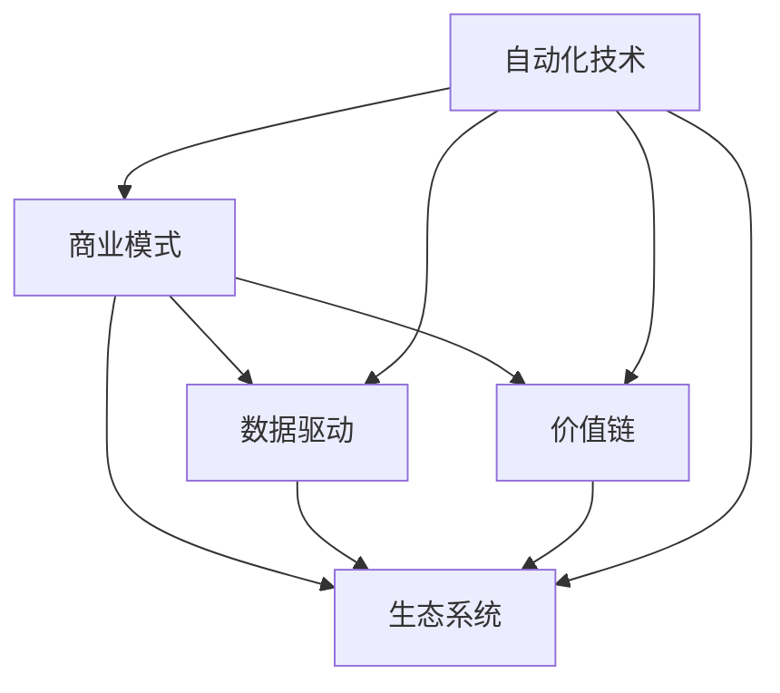

                 

# 自动化创业中的商业模式创新

## 1. 背景介绍

随着数字化转型的浪潮席卷全球，自动化技术在各行各业中的应用日益广泛。创业者的机会不再局限于传统产业，而是更多地涌现于自动化领域。自动化创业，不仅是指通过技术手段提高工作效率、降低运营成本，更重要的是通过创新商业模式，实现价值创造和利润增长。

自动化创业的关键在于将先进技术有效转化为市场机会，本文将从核心概念、算法原理、应用实践等方面全面介绍如何实现商业模式创新。

## 2. 核心概念与联系

### 2.1 核心概念概述

自动化创业中涉及的核心概念包括但不限于以下几个方面：

- **自动化技术**：涉及机器学习、深度学习、自然语言处理、计算机视觉等前沿技术，用于提升工作效率、优化生产流程、增强决策支持。
- **商业模式**：创新型商业模式，如平台型、订阅型、SaaS（软件即服务）、PaaS（平台即服务）、AIaaS（人工智能即服务）等，能够帮助企业快速进入市场、提高客户粘性、实现可持续增长。
- **数据驱动**：基于大数据、AI技术的数据驱动型决策，通过分析用户行为、市场趋势、业务绩效等数据，指导业务决策，提升企业竞争力。
- **价值链**：从供应链、制造、销售到客户服务，通过技术创新重构价值链，实现降本增效。
- **生态系统**：构建多方共赢的生态系统，包括供应商、合作伙伴、客户等，形成协同效应。

### 2.2 核心概念原理和架构的 Mermaid 流程图



以上流程图示意了自动化技术、商业模式、数据驱动、价值链、生态系统之间的相互关系和作用机制。

## 3. 核心算法原理 & 具体操作步骤

### 3.1 算法原理概述

自动化创业中的商业模式创新，实际上是通过一系列的算法和模型，实现对现有商业模式的优化和创新。这些算法和模型可以基于机器学习、深度学习、强化学习、自然语言处理等技术。

算法原理主要包括以下几个方面：

- **分类算法**：用于对用户行为、市场趋势等进行分类，帮助企业预测客户需求、识别市场机会。
- **聚类算法**：用于对用户群体进行聚类，识别出不同用户群体的需求特点，实现精准营销。
- **回归算法**：用于预测业务指标，如销售额、客户流失率等，帮助企业进行业务决策。
- **推荐算法**：用于个性化推荐，提升用户体验，增加用户粘性。
- **自然语言处理**：用于文本分析、情感分析、智能客服等，优化客户服务体验。

### 3.2 算法步骤详解

#### 3.2.1 数据收集与预处理

首先，需要进行数据的收集和预处理，确保数据的准确性和完整性。数据来源包括用户行为数据、市场调研数据、业务运营数据等。

#### 3.2.2 特征工程

在进行算法训练前，需要对数据进行特征工程，提取出对预测和分类有贡献的特征，去除噪声数据。例如，可以使用PCA降维、特征选择、特征变换等方法。

#### 3.2.3 模型选择与训练

根据具体的问题，选择适合的算法模型进行训练。例如，分类问题可以使用逻辑回归、决策树、随机森林等算法；聚类问题可以使用K-means、层次聚类等算法；回归问题可以使用线性回归、岭回归、Lasso回归等算法。

#### 3.2.4 模型评估与优化

训练完成后，需要对模型进行评估，评估指标包括准确率、召回率、F1-score、AUC等。同时，根据评估结果进行模型优化，如调整参数、增加数据、引入正则化等。

### 3.3 算法优缺点

#### 3.3.1 优点

- **数据驱动**：基于数据进行决策，能够更好地理解和把握市场变化。
- **自动化**：算法自动化处理数据，减少人工干预，提高效率。
- **灵活性**：算法可以根据业务需求快速调整和优化，适应不同场景。

#### 3.3.2 缺点

- **数据依赖**：算法的有效性依赖于数据的质量和数量。
- **复杂性**：算法模型复杂，需要专业知识进行维护和优化。
- **过拟合风险**：模型可能会过拟合训练数据，导致泛化能力不足。

### 3.4 算法应用领域

自动化创业中的商业模式创新，应用领域广泛，包括但不限于以下几个方面：

- **零售电商**：通过个性化推荐、库存管理、客户服务等自动化技术，优化销售流程，提升用户体验。
- **金融服务**：通过智能投顾、风险控制、反欺诈等自动化技术，提高金融服务效率，降低风险。
- **医疗健康**：通过疾病预测、药物研发、智能诊断等自动化技术，提升医疗服务质量，降低成本。
- **制造业**：通过智能制造、供应链优化、质量控制等自动化技术，提升生产效率，降低运营成本。
- **物流配送**：通过路径优化、货物追踪、配送调度等自动化技术，提高配送效率，降低配送成本。

## 4. 数学模型和公式 & 详细讲解 & 举例说明

### 4.1 数学模型构建

在自动化创业中，常用的数学模型包括回归模型、分类模型、聚类模型等。这里以线性回归模型为例，介绍其构建过程。

线性回归模型的目标是最小化预测值与真实值之间的误差，即：

$$
\min_{\beta} \frac{1}{2n} \sum_{i=1}^n (y_i - \beta_0 - \beta_1x_i)^2
$$

其中，$y_i$ 为真实值，$x_i$ 为自变量，$\beta_0$ 和 $\beta_1$ 为回归系数。

### 4.2 公式推导过程

通过求解上述最小化问题，可以得到回归系数 $\beta_0$ 和 $\beta_1$ 的估计值：

$$
\beta_0 = \bar{y} - \beta_1 \bar{x}
$$

$$
\beta_1 = \frac{\sum_{i=1}^n (x_i - \bar{x})(y_i - \bar{y})}{\sum_{i=1}^n (x_i - \bar{x})^2}
$$

其中，$\bar{x}$ 和 $\bar{y}$ 分别为自变量和因变量的均值。

### 4.3 案例分析与讲解

假设我们有一个电商销售数据集，包含用户的购买历史、浏览记录、评价等信息。我们可以使用线性回归模型来预测用户的购买意愿，具体步骤如下：

1. 收集数据，包括用户的浏览记录、评价、购买历史等。
2. 对数据进行预处理，去除缺失值、异常值，进行标准化处理。
3. 提取特征，如用户的浏览时间、购买频率、评价评分等。
4. 构建线性回归模型，并使用训练数据进行拟合。
5. 对测试数据进行预测，评估模型的准确性和稳定性。
6. 根据评估结果进行模型优化，如增加特征、调整正则化参数等。

## 5. 项目实践：代码实例和详细解释说明

### 5.1 开发环境搭建

在进行自动化创业中的商业模式创新实践时，需要使用Python语言和相关库进行开发。以下是一个基于Python的开发环境搭建步骤：

1. 安装Python：推荐使用Anaconda或Miniconda，安装Python 3.7及以上版本。
2. 安装必要的库：安装NumPy、Pandas、Scikit-learn、Matplotlib等库。
3. 配置环境：设置Python环境变量，使开发环境与系统环境分离，便于版本管理。

### 5.2 源代码详细实现

以下是一个基于Scikit-learn库的线性回归模型示例代码：

```python
import numpy as np
from sklearn.linear_model import LinearRegression
from sklearn.model_selection import train_test_split
from sklearn.metrics import mean_squared_error

# 构建数据集
X = np.array([[1, 2, 3], [4, 5, 6], [7, 8, 9], [10, 11, 12]])
y = np.array([2, 4, 6, 8])

# 分割数据集
X_train, X_test, y_train, y_test = train_test_split(X, y, test_size=0.2, random_state=42)

# 创建模型
model = LinearRegression()

# 训练模型
model.fit(X_train, y_train)

# 预测并评估
y_pred = model.predict(X_test)
mse = mean_squared_error(y_test, y_pred)
print("MSE: ", mse)
```

### 5.3 代码解读与分析

上述代码展示了如何使用Scikit-learn库构建并训练线性回归模型。具体步骤如下：

1. 构建数据集：使用NumPy库构建X和y变量。
2. 分割数据集：将数据集分为训练集和测试集。
3. 创建模型：使用LinearRegression类创建线性回归模型。
4. 训练模型：使用fit方法训练模型。
5. 预测并评估：使用predict方法进行预测，并使用mean_squared_error计算均方误差。

## 6. 实际应用场景

### 6.1 零售电商

零售电商领域，可以使用自动化技术提升用户体验、优化库存管理、提高销售额。例如，可以使用推荐系统根据用户的历史购买记录和浏览记录，推荐用户可能感兴趣的商品，提高销售额；使用智能库存管理系统，实时监控库存水平，避免断货或积压。

### 6.2 金融服务

金融服务领域，可以使用自动化技术进行风险控制、智能投顾、反欺诈等。例如，可以使用机器学习模型预测客户违约风险，及时采取措施；使用智能投顾，根据客户风险偏好和投资目标，提供个性化的投资建议；使用反欺诈模型，识别和预防欺诈行为。

### 6.3 医疗健康

医疗健康领域，可以使用自动化技术进行疾病预测、药物研发、智能诊断等。例如，可以使用机器学习模型预测患者患病风险，提前进行预防；使用自然语言处理技术，分析医疗文献和患者记录，发现潜在的药物组合；使用智能诊断系统，快速识别和诊断疾病。

### 6.4 制造业

制造业领域，可以使用自动化技术进行智能制造、供应链优化、质量控制等。例如，可以使用机器学习模型优化生产流程，减少生产时间和成本；使用物联网技术，实时监控设备状态，预测设备故障；使用质量控制模型，检测产品缺陷，提高产品质量。

### 6.5 物流配送

物流配送领域，可以使用自动化技术进行路径优化、货物追踪、配送调度等。例如，可以使用优化算法计算最佳配送路线，提高配送效率；使用物联网技术，实时跟踪货物位置，确保货物安全；使用调度系统，合理安排配送资源，避免资源浪费。

## 7. 工具和资源推荐

### 7.1 学习资源推荐

为了帮助创业者更好地理解和应用自动化技术，以下是几个优质的学习资源推荐：

1. 《Python数据科学手册》：介绍Python在数据科学和机器学习中的应用。
2. 《机器学习实战》：介绍常用的机器学习算法和实现方法。
3. 《深度学习入门》：介绍深度学习的基础知识和实践技巧。
4. 《自然语言处理综论》：介绍自然语言处理的基本概念和技术。
5. 《Python深度学习》：介绍深度学习在Python中的应用，包括模型构建、训练和优化等。

### 7.2 开发工具推荐

以下几款工具可以帮助创业者更高效地进行自动化技术的开发和实践：

1. Python：简单易学的编程语言，广泛用于数据科学和机器学习领域。
2. Scikit-learn：Python中最流行的机器学习库之一，提供简单易用的API和丰富的算法实现。
3. TensorFlow：由Google开发的深度学习框架，支持大规模分布式训练。
4. PyTorch：由Facebook开发的深度学习框架，支持动态计算图和GPU加速。
5. Jupyter Notebook：交互式编程环境，支持Python、R等多种语言，方便代码调试和实验记录。

### 7.3 相关论文推荐

自动化创业中的商业模式创新涉及多个前沿领域，以下是几篇奠基性的相关论文推荐，值得深入阅读：

1. "Deep Residual Learning for Image Recognition"：介绍深度残差网络在图像识别中的应用。
2. "Attention Is All You Need"：介绍Transformer模型在自然语言处理中的应用。
3. "Scalable Distributed Deep Learning"：介绍大规模分布式深度学习的应用实践。
4. "Training GANs with Wasserstein Loss on CIFAR-10"：介绍生成对抗网络在图像生成中的应用。
5. "Super-Resolution Image Synthesis for Exploring the Limits of Deep Learning"：介绍超分辨率图像生成技术的应用。

## 8. 总结：未来发展趋势与挑战

### 8.1 研究成果总结

本文对自动化创业中的商业模式创新进行了全面系统的介绍，包括核心概念、算法原理、操作步骤、应用场景、工具资源等。从理论上阐述了如何将自动化技术与商业创新相结合，实现价值创造和利润增长。

### 8.2 未来发展趋势

未来，自动化创业中的商业模式创新将呈现以下几个发展趋势：

1. **智能决策**：通过自动化技术，实现实时数据驱动的决策，提升企业反应速度和决策质量。
2. **个性化服务**：利用推荐系统、智能客服等技术，提供个性化服务，提升用户体验。
3. **自动化管理**：通过智能制造、智能物流等技术，优化生产流程，降低运营成本。
4. **跨界融合**：自动化技术与大数据、物联网、云计算等技术的深度融合，形成更多跨界应用。
5. **可持续发展**：通过自动化技术，优化资源利用，减少环境污染，实现可持续发展。

### 8.3 面临的挑战

尽管自动化创业中的商业模式创新具有巨大的发展潜力，但也面临一些挑战：

1. **数据隐私**：自动化技术需要大量的数据支持，如何保障数据隐私和安全，是一个重要的问题。
2. **技术壁垒**：自动化技术涉及多个前沿领域，需要高水平的技术积累和跨领域知识。
3. **市场竞争**：自动化技术的应用场景竞争激烈，如何实现差异化，找到自己的核心竞争力，是一个重要的问题。
4. **伦理道德**：自动化技术的应用可能涉及伦理道德问题，如何平衡技术进步和伦理道德，是一个重要的问题。
5. **经济效益**：自动化技术的应用需要高投入，如何平衡投入和产出，是一个重要的问题。

### 8.4 研究展望

未来，自动化创业中的商业模式创新需要从以下几个方面进行深入研究：

1. **数据隐私保护**：研究和开发新的数据隐私保护技术，保障数据安全。
2. **跨领域知识融合**：将跨领域知识与自动化技术相结合，提升技术的广度和深度。
3. **差异化策略**：制定差异化策略，找到自己在市场中的核心竞争力。
4. **伦理道德框架**：建立伦理道德框架，指导自动化技术的应用。
5. **经济效益模型**：构建经济效益模型，指导自动化技术的商业化应用。

通过持续的技术创新和实践探索，相信自动化创业中的商业模式创新将为各行各业带来更多机遇，实现可持续发展。

## 9. 附录：常见问题与解答

**Q1：自动化创业的商业模式创新与传统创业有哪些区别？**

A: 自动化创业的商业模式创新主要依赖于技术手段，能够快速提升生产效率、优化服务质量、降低运营成本。而传统创业则更多依赖于市场洞察、品牌建设、渠道铺设等非技术手段。

**Q2：如何进行自动化创业的商业模式创新？**

A: 首先需要选择目标市场和用户需求，然后进行数据收集和预处理，构建和训练算法模型，最后进行模型应用和评估优化。每个步骤都需要精心设计，确保数据质量、模型效果和应用效果。

**Q3：自动化创业中需要注意哪些伦理道德问题？**

A: 自动化创业中需要注意数据隐私、算法公平性、自动化决策的透明性和可解释性等伦理道德问题。需要建立伦理道德框架，指导技术的开发和应用，保障用户的合法权益。

**Q4：自动化创业中的算法模型如何优化？**

A: 可以通过数据增强、正则化、参数调整、模型集成等方法，优化算法模型，提升模型的泛化能力和准确性。同时，需要定期评估模型效果，根据业务需求进行优化。

**Q5：自动化创业中如何实现可持续发展？**

A: 可以通过优化资源利用、减少环境污染、提高能效等手段，实现自动化创业的可持续发展。同时，需要关注社会责任，保障员工的权益和社区的利益。

作者：禅与计算机程序设计艺术 / Zen and the Art of Computer Programming

