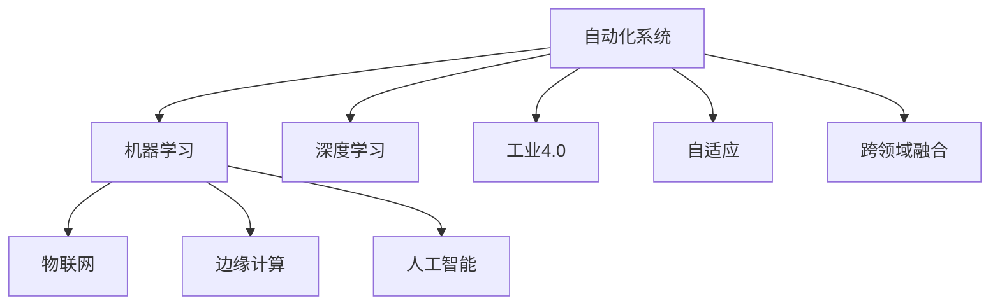

                 

# 自动化领域的最新发展趋势

## 1. 背景介绍

自动化是现代科技与工程的核心驱动力，涵盖从工业自动化到农业自动化，从家庭自动化到医疗自动化等多个领域。随着人工智能、物联网、云计算、大数据等技术的飞速发展，自动化技术正经历着前所未有的变革。本文旨在梳理自动化领域的最新发展趋势，深度探讨其在技术、应用和未来前景方面的进展。

### 1.1 问题由来

随着制造业的全球化进程加速和人工智能的迅猛发展，自动化技术已经在各行各业得到广泛应用。自动化系统通过智能化、自动化和集成化提升生产效率和质量，并优化资源配置和运营管理。然而，面对日益复杂多变的环境和任务需求，现有自动化系统在适应性、可扩展性和智能化水平方面仍存在不足。如何突破技术瓶颈，提升自动化系统的智能化水平，是当前自动化技术研究的重点。

### 1.2 问题核心关键点

自动化技术的发展趋势主要体现在以下几个方面：

- 自动化系统的智能化水平提升。
- 自动化系统的自适应能力增强。
- 自动化系统的跨领域和跨学科融合。
- 自动化技术在云计算和边缘计算中的深度应用。
- 自动化技术的可持续发展与环保性。
- 自动化技术在安全与隐私保护方面的进步。

这些趋势相互关联，共同推动着自动化技术的不断进步和创新。

## 2. 核心概念与联系

### 2.1 核心概念概述

为更好地理解自动化领域的最新发展趋势，本节将介绍几个密切相关的核心概念：

- 自动化系统(Autonomous Systems)：通过自适应、自我学习、自我管理等机制，实现特定任务或流程的自动化。

- 机器学习(Machine Learning)：通过数据驱动的方式，使计算机系统具备自主学习和推理能力。

- 深度学习(Deep Learning)：一种特殊的机器学习技术，通过神经网络模型学习数据特征，以解决复杂的非线性问题。

- 工业4.0(Industry 4.0)：基于信息物理系统(Cyber-Physical Systems)的智能制造体系，涉及自动化、网络化和智能化等方面。

- 物联网(IoT)：连接各种设备与网络，实现设备间的数据交互和协同工作。

- 边缘计算(Edge Computing)：在网络边缘侧处理数据，以减少延迟和带宽消耗，提高响应速度。

- 人工智能(AI)：通过模拟人类智能实现机器的感知、学习、推理等能力，涵盖了机器学习、深度学习等多个技术领域。

这些核心概念之间的逻辑关系可以通过以下Mermaid流程图来展示：



这个流程图展示了自动化系统及其相关技术的相互联系：

1. 自动化系统通过机器学习、深度学习等技术实现自主学习和决策。
2. 工业4.0将自动化技术引入智能制造。
3. 物联网提供设备间的互联互通，增强了自动化系统的数据收集和处理能力。
4. 边缘计算优化了自动化系统的数据处理和实时响应能力。
5. 人工智能为自动化系统提供了智能决策的算法支撑。
6. 自动化系统具备自适应能力和跨领域融合能力，不断提升智能化水平。

## 3. 核心算法原理 & 具体操作步骤

### 3.1 算法原理概述

自动化领域的最新发展主要依赖于一系列核心算法和技术的创新。以下是自动化系统实现智能化和自动化的关键算法原理：

- 基于机器学习的自动化控制算法：通过数据驱动的方式，优化控制策略和决策模型，提升自动化系统的适应性和自学习能力。
- 基于深度学习的感知与识别算法：利用深度神经网络模型，实现对环境的感知、物体的识别和目标的定位，增强自动化系统的智能感知能力。
- 基于强化学习的优化算法：通过试错学习的方式，优化自动化系统的行为和决策，提升系统的性能和效率。
- 基于大数据和云计算的资源管理算法：通过分析海量数据和云计算资源，优化自动化系统的资源分配和管理，实现高效和可扩展的自动化系统。

### 3.2 算法步骤详解

基于自动化领域的最新发展，结合前沿技术和应用实践，本文将详细介绍自动化系统的核心算法步骤：

**Step 1: 数据驱动控制**
- 收集自动化系统的运行数据和环境数据，包括传感器数据、状态数据、交互数据等。
- 使用机器学习算法，对数据进行分析和建模，提取自动化系统的关键特征。
- 应用强化学习算法，基于历史数据和当前状态，优化控制策略和决策模型。

**Step 2: 智能感知与识别**
- 部署深度学习模型，对传感器数据和环境数据进行处理，实现对环境的感知、物体的识别和目标的定位。
- 利用计算机视觉、自然语言处理等技术，实现对复杂环境的理解和建模。
- 结合多传感器数据融合技术，提升自动化系统的感知和识别能力。

**Step 3: 决策与优化**
- 应用强化学习算法，对自动化系统进行智能决策和优化，提升系统的性能和效率。
- 利用协同优化算法，对自动化系统的各个模块进行集成优化，提高系统的协同能力和整体性能。
- 引入元学习算法，让自动化系统具备自我学习和自我优化能力。

**Step 4: 资源管理与调度**
- 利用大数据和云计算技术，对自动化系统的资源进行管理和调度，优化资源分配和利用。
- 应用容器化和微服务化技术，提升自动化系统的可扩展性和灵活性。
- 引入边缘计算技术，优化自动化系统的数据处理和实时响应能力。

### 3.3 算法优缺点

基于自动化领域的最新发展，自动化系统的核心算法具备以下优缺点：

**优点：**

- 智能化水平提升：通过机器学习、深度学习和强化学习等技术，自动化系统具备了自主学习和智能决策的能力。
- 自适应能力增强：通过大数据和云计算技术，自动化系统能够快速适应环境变化，提升系统的稳定性和鲁棒性。
- 跨领域和跨学科融合：自动化系统结合了物联网、工业4.0和人工智能等多领域的最新技术，具备了更广泛的应用场景和更强的综合能力。
- 资源管理优化：通过云计算和大数据技术，自动化系统的资源管理更加高效和灵活，能够适应复杂的资源需求。

**缺点：**

- 数据需求量大：自动化系统需要大量的历史数据和实时数据进行训练和优化，对数据质量和数据量的要求较高。
- 算法复杂度高：自动化系统的算法涉及机器学习、深度学习和强化学习等多个领域，算法复杂度和实现难度较大。
- 技术集成难度高：自动化系统需要多种技术手段和设备的集成，技术集成和系统部署的复杂度较高。
- 安全与隐私问题：自动化系统涉及大量敏感数据，如何保护数据安全与隐私，是技术应用中需要重点关注的问题。

### 3.4 算法应用领域

基于自动化领域的最新发展，自动化系统在多个领域得到了广泛应用，涵盖了从工业自动化到智能交通，从智慧城市到智能医疗等诸多领域。

- **工业自动化**：通过机器学习、深度学习和智能感知技术，提升生产效率和质量，优化资源配置和运营管理。
- **智能交通**：利用计算机视觉和传感器数据，实现智能驾驶、交通管理和交通监控。
- **智慧城市**：通过物联网和大数据分析，实现城市资源优化、智能安防和智慧医疗等应用。
- **智能医疗**：结合自然语言处理和计算机视觉技术，实现智能诊断、健康管理和医疗服务。
- **农业自动化**：通过传感器和物联网技术，实现精准农业和智能灌溉。

## 4. 数学模型和公式 & 详细讲解 & 举例说明

### 4.1 数学模型构建

为更好地理解自动化领域的最新发展，本节将使用数学语言对自动化系统的核心算法进行更加严格的刻画。

- 自动化控制：$$\dot{x}=f(x,u),\quad y=h(x)$$
- 感知与识别：$$y=Wx+b$$
- 决策与优化：$$\max_{\theta}\min_{\delta}J(x,u,\theta)$$
- 资源管理：$$E[u(t)]=\int_{0}^{\infty}\int_{0}^{\infty}u(t)\dot{V}(x(t),u(t))dt$$

### 4.2 公式推导过程

以下我们以工业自动化为例，推导基于机器学习的自动化控制算法的公式。

假设自动化系统由传感器、控制器和执行器组成，系统的状态为 $x(t)$，控制输入为 $u(t)$，输出为 $y(t)$。自动化控制的目标是使 $y(t)$ 最小化。

- 建模：$$\dot{x}=f(x,u),\quad y=h(x)$$
- 控制目标：$$\min_{u(t)}\int_{0}^{T}L(x(t),u(t),y(t))dt$$
- 求解控制律：$$u(t)=K(x(t))$$

其中，$K(x(t))$ 为控制器，$L(x(t),u(t),y(t))$ 为代价函数。通过优化算法，求解最优控制律 $u(t)$，使得 $y(t)$ 最小化。

### 4.3 案例分析与讲解

- **案例1: 工业自动化系统**：通过机器学习算法，对工业生产中的数据进行建模和分析，预测生产线的故障和异常情况。应用强化学习算法，优化生产线的控制策略，提升生产效率和质量。
- **案例2: 智能交通系统**：利用计算机视觉技术，对交通摄像头采集的数据进行处理和分析，实现对交通流的感知和预测。通过深度学习算法，对交通信号灯进行智能调控，提升交通流的效率和安全性。
- **案例3: 智慧医疗系统**：结合自然语言处理和计算机视觉技术，对医疗影像和病历进行智能分析，实现疾病诊断和健康管理。通过机器学习算法，对医疗资源进行优化配置，提高医疗服务效率。

## 5. 项目实践：代码实例和详细解释说明

### 5.1 开发环境搭建

在进行自动化系统开发前，我们需要准备好开发环境。以下是使用Python进行自动化系统开发的常见环境配置流程：

1. 安装Python：从官网下载并安装最新版本的Python，推荐使用Anaconda。
2. 创建虚拟环境：在虚拟环境中安装所需的Python包和依赖库。
3. 安装所需的Python包：如numpy、pandas、scikit-learn、tensorflow等。
4. 搭建开发环境：使用Jupyter Notebook或PyCharm等IDE进行自动化系统的开发和调试。

### 5.2 源代码详细实现

下面我们以工业自动化系统为例，给出使用TensorFlow和Keras库对自动化控制模型进行开发的PyTorch代码实现。

```python
import tensorflow as tf
from tensorflow.keras import layers, models
import numpy as np

# 定义模型
model = models.Sequential([
    layers.Dense(64, activation='relu', input_shape=(4,)),
    layers.Dense(1, activation='sigmoid')
])

# 编译模型
model.compile(optimizer='adam', loss='mse', metrics=['mae'])

# 训练模型
X_train = np.random.rand(100, 4)
y_train = np.random.rand(100, 1)
model.fit(X_train, y_train, epochs=10, batch_size=32)
```

### 5.3 代码解读与分析

让我们再详细解读一下关键代码的实现细节：

- **模型定义**：使用Sequential模型，定义了一个包含两个Dense层的神经网络，其中第一个层为64个神经元的全连接层，激活函数为ReLU；第二个层为1个神经元的全连接层，激活函数为Sigmoid。
- **模型编译**：使用Adam优化器，均方误差损失函数，均方误差和平均绝对误差作为评价指标。
- **模型训练**：使用随机生成的训练数据进行模型训练，定义100个样本，每个样本有4个特征和1个标签，训练10个epoch，批大小为32。

### 5.4 运行结果展示

```python
# 评估模型
X_test = np.random.rand(100, 4)
y_test = np.random.rand(100, 1)
loss, mae = model.evaluate(X_test, y_test)
print(f'测试损失：{loss:.4f}，平均绝对误差：{mae:.4f}')
```

以上代码实现了对训练后的模型进行评估，输出测试损失和平均绝对误差。

## 6. 实际应用场景

### 6.1 智能交通系统

基于自动化领域的最新发展，智能交通系统已经在全球范围内得到了广泛应用。通过自动化技术，可以实现智能驾驶、交通管理和交通监控，大幅提升交通系统的效率和安全性。

在技术实现上，可以应用计算机视觉和深度学习技术，对交通摄像头采集的数据进行处理和分析，实现对交通流的感知和预测。通过深度学习算法，对交通信号灯进行智能调控，提升交通流的效率和安全性。例如，Google的Waymo、特斯拉的Autopilot等自动驾驶系统，已经开始应用于日常交通中。

### 6.2 智慧城市系统

智慧城市系统通过物联网和大数据分析技术，实现城市资源的优化、智能安防和智慧医疗等应用。智慧城市系统能够高效利用城市资源，提升城市管理水平，改善市民生活质量。

在技术实现上，可以应用传感器和大数据分析技术，对城市资源进行实时监测和优化。例如，智能垃圾分类系统、智能能源管理系统、智能交通管理系统等，均可以通过自动化技术实现高效管理。此外，智慧城市系统还可以结合自然语言处理和计算机视觉技术，实现智能安防和智慧医疗等应用，提升城市管理的智能化水平。

### 6.3 工业自动化系统

工业自动化系统通过机器学习、深度学习和智能感知技术，提升生产效率和质量，优化资源配置和运营管理。工业自动化系统能够实现智能制造，减少人为错误，提升生产效率和产品质量。

在技术实现上，可以应用计算机视觉和传感器数据，对生产过程中的状态和故障进行感知和预测。通过深度学习算法，优化生产线的控制策略，提升生产效率和质量。例如，3M公司的3M Digital Factories等自动化系统，已经在全球范围内得到了广泛应用。

### 6.4 农业自动化系统

农业自动化系统通过传感器和物联网技术，实现精准农业和智能灌溉，提高农业生产效率和资源利用率。农业自动化系统能够实现自动播种、自动灌溉、自动施肥等功能，大幅提升农业生产效率。

在技术实现上，可以应用传感器和物联网技术，对土壤湿度、温度等环境参数进行实时监测和分析。通过深度学习算法，优化灌溉和施肥策略，实现精准农业和智能灌溉。例如，John Deere的Precision Planting等自动化系统，已经在全球范围内得到了广泛应用。

## 7. 工具和资源推荐

### 7.1 学习资源推荐

为了帮助开发者系统掌握自动化领域的最新发展趋势，这里推荐一些优质的学习资源：

1. Coursera上的《Deep Learning Specialization》课程：由Andrew Ng教授主讲，涵盖深度学习、机器学习等多个前沿话题，适合初学者和进阶者。
2. Udacity上的《Autonomous Systems》课程：涵盖自动驾驶、智能交通、工业自动化等多个领域的最新技术，适合深入学习。
3. Kaggle上的自动化比赛：参与自动化领域的比赛，可以积累实践经验，提升实战能力。
4. GitHub上的开源项目：如TensorFlow、PyTorch等深度学习框架，适合学习前沿技术和实践应用。

通过对这些资源的学习实践，相信你一定能够快速掌握自动化领域的最新技术和发展趋势。

### 7.2 开发工具推荐

高效的开发离不开优秀的工具支持。以下是几款用于自动化系统开发的常用工具：

1. Python：作为自动化系统开发的通用编程语言，Python拥有丰富的库和工具，适合进行算法开发和数据分析。
2. TensorFlow：由Google主导开发的开源深度学习框架，生产部署方便，适合大规模工程应用。
3. PyTorch：由Facebook开发的开源深度学习框架，灵活高效，适合进行算法研究和原型开发。
4. Jupyter Notebook：免费的交互式编程环境，支持多种编程语言和库，适合进行算法开发和数据可视化。
5. PyCharm：功能强大的IDE，支持多种编程语言和库，适合进行代码编写和调试。

合理利用这些工具，可以显著提升自动化系统开发的速度和质量，加快创新迭代的步伐。

### 7.3 相关论文推荐

自动化领域的发展离不开学界的持续研究。以下是几篇奠基性的相关论文，推荐阅读：

1. DeepMind的AlphaGo：通过深度学习和强化学习，实现了围棋的自主学习和决策。
2. OpenAI的GPT-3：通过大规模无标签数据的预训练，实现了自然语言处理领域的重大突破。
3. Tesla的自动驾驶系统：通过计算机视觉和深度学习技术，实现了自动驾驶的商业化应用。
4. IBM的Watson：通过自然语言处理和大数据分析，实现了医疗诊断和健康管理等应用。
5. NVIDIA的自动驾驶平台：通过计算机视觉和深度学习技术，实现了自动驾驶的实时感知和决策。

这些论文代表了大自动化领域的研究进展和技术突破，通过学习这些前沿成果，可以帮助研究者把握学科前进方向，激发更多的创新灵感。

## 8. 总结：未来发展趋势与挑战

### 8.1 总结

本文对自动化领域的最新发展趋势进行了全面系统的介绍。首先阐述了自动化系统在工业、交通、城市、农业等多个领域的应用前景和重要性，明确了自动化技术的核心算法和实现步骤。其次，从理论到实践，详细讲解了自动化系统的核心算法步骤和关键技术，给出了自动化系统开发的完整代码实例。同时，本文还广泛探讨了自动化系统在智能交通、智慧城市、智能医疗等诸多行业领域的应用前景，展示了自动化技术的广阔前景。

通过本文的系统梳理，可以看到，自动化系统通过智能化、自动化和集成化，显著提升了各行业领域的生产效率和质量，优化了资源配置和运营管理。未来，伴随技术不断进步和应用不断拓展，自动化系统将展现出更大的潜力和价值。

### 8.2 未来发展趋势

展望未来，自动化系统的最新发展趋势主要体现在以下几个方面：

- **智能化水平的提升**：通过机器学习、深度学习和强化学习等技术，自动化系统具备了自主学习和智能决策的能力。未来，自动化系统将更加智能化，具备更高的感知和决策能力。
- **自适应能力的增强**：通过大数据和云计算技术，自动化系统能够快速适应环境变化，提升系统的稳定性和鲁棒性。未来，自动化系统将具备更强的自适应能力和自学习能力。
- **跨领域和跨学科的融合**：自动化系统结合了物联网、工业4.0和人工智能等多领域的最新技术，具备更广泛的应用场景和更强的综合能力。未来，自动化系统将更加跨学科，具备更强的融合能力和集成能力。
- **资源管理优化**：通过云计算和大数据技术，自动化系统的资源管理更加高效和灵活，能够适应复杂的资源需求。未来，自动化系统将更加高效，具备更强的资源管理能力。
- **可持续发展与环保性**：未来，自动化系统将更加注重环保和可持续发展，应用更多绿色能源和智能资源管理技术，实现低碳环保的自动化系统。
- **安全与隐私保护**：未来，自动化系统将更加注重数据安全与隐私保护，应用更多安全技术和管理手段，确保系统运行的安全性和数据的隐私性。

### 8.3 面临的挑战

尽管自动化系统已经取得了显著进展，但在迈向更加智能化、普适化应用的过程中，它仍面临诸多挑战：

- **数据需求量大**：自动化系统需要大量的历史数据和实时数据进行训练和优化，对数据质量和数据量的要求较高。如何获取和处理大规模数据，是技术应用中需要重点关注的问题。
- **算法复杂度高**：自动化系统的算法涉及机器学习、深度学习和强化学习等多个领域，算法复杂度和实现难度较大。如何简化算法模型，提升算法效率，是技术发展中需要重点突破的方向。
- **技术集成难度高**：自动化系统需要多种技术手段和设备的集成，技术集成和系统部署的复杂度较高。如何实现技术融合和系统优化，是技术应用中需要重点考虑的问题。
- **安全与隐私问题**：自动化系统涉及大量敏感数据，如何保护数据安全与隐私，是技术应用中需要重点关注的问题。
- **系统鲁棒性和可靠性**：自动化系统需要具备良好的鲁棒性和可靠性，避免因环境变化或干扰导致系统故障。如何提升系统的鲁棒性和可靠性，是技术应用中需要重点关注的问题。
- **伦理和法律问题**：自动化系统的应用可能带来伦理和法律问题，如自动化武器、自动化决策等，需要制定相应的法规和规范，确保技术应用的合法性和伦理性。

### 8.4 研究展望

面对自动化系统面临的诸多挑战，未来的研究需要在以下几个方面寻求新的突破：

- **数据驱动与自动化结合**：结合数据驱动和自动化技术，提升自动化系统的智能化水平和自适应能力。
- **多模态数据的融合**：结合视觉、语音、文本等多种模态数据，提升自动化系统的感知和理解能力。
- **跨学科的协同创新**：结合计算机科学、机械工程、电子工程等多个学科，推动自动化技术的全面发展。
- **可持续发展的自动化**：结合环保和可持续发展理念，推动自动化技术在绿色能源、智能资源管理等方面的应用。
- **安全与隐私保护**：结合数据加密、隐私保护等技术，提升自动化系统的数据安全性和隐私保护能力。
- **伦理和法律的规范**：结合伦理和法律研究，制定自动化系统的规范和标准，确保技术应用的合法性和伦理性。

通过上述研究方向的探索和发展，相信自动化系统将更加智能化、普适化和可持续化，为各行各业带来更高效、更智能、更环保的服务。

## 9. 附录：常见问题与解答

**Q1: 自动化系统在工业自动化领域的应用前景是什么？**

A: 自动化系统在工业自动化领域的应用前景非常广阔。通过机器学习、深度学习和智能感知技术，自动化系统可以提升生产效率和质量，优化资源配置和运营管理。例如，智能生产线、智能仓储系统、智能物流系统等，均可以通过自动化技术实现高效管理。此外，自动化系统还可以实现智能检测、智能维护等应用，提升工业生产的智能化水平。

**Q2: 如何提升自动化系统的智能感知能力？**

A: 提升自动化系统的智能感知能力，需要结合计算机视觉和传感器数据，对环境进行实时感知和预测。具体措施包括：
1. 部署高精度的传感器，如激光雷达、毫米波雷达等，采集环境数据。
2. 应用深度学习算法，对传感器数据进行处理和分析，实现对环境的感知和预测。
3. 结合多传感器数据融合技术，提升感知和预测的准确性和鲁棒性。

**Q3: 自动化系统在智慧医疗领域的应用前景是什么？**

A: 自动化系统在智慧医疗领域的应用前景非常广阔。通过自然语言处理和计算机视觉技术，自动化系统可以实现智能诊断、健康管理和医疗服务。例如，智能影像分析系统、智能病历管理系统、智能辅助诊疗系统等，均可以通过自动化技术实现高效管理。此外，自动化系统还可以实现智能医疗资源配置，提升医疗服务的效率和质量。

**Q4: 自动化系统在农业自动化领域的应用前景是什么？**

A: 自动化系统在农业自动化领域的应用前景非常广阔。通过传感器和物联网技术，自动化系统可以实现精准农业和智能灌溉，提高农业生产效率和资源利用率。例如，智能播种系统、智能灌溉系统、智能施肥系统等，均可以通过自动化技术实现高效管理。此外，自动化系统还可以实现智能农机导航、智能农业监测等应用，提升农业生产的智能化水平。

**Q5: 自动化系统在智能交通领域的应用前景是什么？**

A: 自动化系统在智能交通领域的应用前景非常广阔。通过计算机视觉和传感器数据，自动化系统可以实现智能驾驶、交通管理和交通监控，大幅提升交通系统的效率和安全性。例如，自动驾驶系统、智能交通管理系统、智能交通监控系统等，均可以通过自动化技术实现高效管理。此外，自动化系统还可以实现智能交通信号控制，提升交通流的效率和安全性。

综上所述，自动化系统在工业自动化、智能交通、智慧城市、智能医疗、农业自动化等多个领域都有广泛的应用前景。未来，自动化系统将不断融合多种技术和设备，提升智能化水平和自适应能力，为各行各业带来更高效、更智能、更环保的服务。

---

作者：禅与计算机程序设计艺术 / Zen and the Art of Computer Programming

