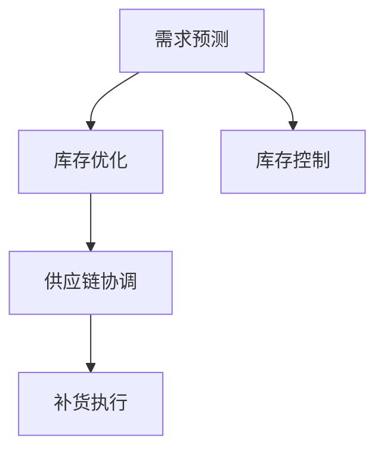

                 

# 自动补货：AI如何确保库存充足

## 1. 背景介绍

### 1.1 问题由来
库存管理是制造业、零售业等实体企业运营的关键环节。有效的库存管理不仅可以提升企业响应市场变化的能力，还能大幅降低运营成本。但传统的库存管理系统依靠经验和人工作业，往往难以精确计算补货需求，导致库存过剩或短缺，影响企业运营效率。

近年来，随着人工智能(AI)技术的迅猛发展，越来越多的企业开始探索将AI技术应用于库存管理，自动补货(Auto Replenishment)成为提升企业库存管理效率的重要方向。自动补货系统通过实时分析销售数据、库存情况、市场需求等因素，动态调整补货策略，确保库存处于最优水平。

### 1.2 问题核心关键点
自动补货的核心在于如何准确预测未来的需求，及时补充库存。传统的人工预测方法受限于数据质量、分析工具等因素，往往难以精准捕捉需求变化。而基于AI的自动补货方法，通过机器学习、深度学习等技术，可以处理海量数据，发现潜在规律，进行精确预测，从而实现库存管理的自动化。

自动补货的关键技术包括：
- 需求预测：基于历史销售数据，预测未来的销售需求。
- 库存优化：结合库存水平和需求预测结果，计算最优的补货量。
- 供应链协调：与供应商进行协调，确保及时补货。

这些关键技术共同构成了自动补货系统，帮助企业实现库存的精细化管理，提升运营效率和市场竞争力。

## 2. 核心概念与联系

### 2.1 核心概念概述

为更好地理解自动补货的AI技术，本节将介绍几个关键概念：

- 需求预测：通过机器学习模型，预测未来的需求量。常见的方法包括时间序列分析、回归分析、深度学习等。
- 库存优化：通过优化算法，计算最优的补货策略，避免库存过剩或短缺。
- 供应链协调：自动补货系统需与供应链系统进行无缝对接，实现补货信息的实时共享和协同管理。
- 库存控制：通过动态调整补货策略，确保库存水平在合理范围内波动。

这些概念之间的逻辑关系可以通过以下Mermaid流程图来展示：



这个流程图展示了自动补货系统中的核心概念及其相互关系：

1. 需求预测通过机器学习模型，预测未来的需求量。
2. 库存优化基于需求预测结果，计算最优的补货策略。
3. 供应链协调与供应商对接，确保补货信息的实时共享。
4. 库存控制动态调整补货策略，确保库存水平在合理范围内波动。

## 3. 核心算法原理 & 具体操作步骤

### 3.1 算法原理概述

自动补货系统基于机器学习和深度学习技术，通过历史销售数据、库存水平、市场需求等因素，预测未来的需求量，并据此优化库存策略，确保库存水平在合理范围内波动。

具体而言，自动补货系统一般包括以下步骤：

1. 数据预处理：收集历史销售数据、库存水平、市场需求等关键数据，并进行清洗和归一化。
2. 需求预测：使用机器学习或深度学习模型，预测未来的需求量。
3. 库存优化：结合需求预测结果和库存水平，计算最优的补货量。
4. 供应链协调：与供应商进行协调，确保补货信息的实时共享和协同管理。

### 3.2 算法步骤详解

以下以深度学习模型为基础，详细介绍自动补货系统的算法步骤：

**Step 1: 数据预处理**
- 收集历史销售数据、库存水平、市场需求等关键数据。
- 清洗数据，去除缺失、异常值等。
- 对数据进行归一化处理，使数据分布一致。

**Step 2: 需求预测**
- 使用时间序列分析或深度学习模型，训练需求预测模型。
- 输入历史销售数据，模型预测未来的需求量。
- 对预测结果进行验证和优化，确保模型预测准确。

**Step 3: 库存优化**
- 根据需求预测结果，结合库存水平，计算最优的补货量。
- 使用优化算法（如线性规划、动态规划等），求解最优补货策略。
- 对补货策略进行评估和调整，确保库存水平在合理范围内波动。

**Step 4: 供应链协调**
- 与供应商对接，实时共享补货信息。
- 根据需求预测和库存优化结果，自动下发补货指令。
- 监控补货执行情况，确保补货信息及时传达和执行。

### 3.3 算法优缺点

自动补货系统基于AI技术，具有以下优点：
1. 精确预测：机器学习模型可以从海量历史数据中发现规律，进行精确的需求预测。
2. 实时优化：通过实时数据反馈，动态调整补货策略，确保库存水平始终最优。
3. 协同管理：自动补货系统与供应链系统无缝对接，实现信息共享和协同管理。
4. 降低成本：优化库存策略，减少库存过剩和短缺，降低运营成本。

同时，该方法也存在一些局限性：
1. 数据依赖：预测模型需要大量高质量的历史数据，数据质量差将影响模型预测精度。
2. 模型复杂：深度学习模型参数量大，训练和推理成本较高。
3. 鲁棒性不足：模型对异常数据和噪声敏感，需要良好的数据预处理和模型鲁棒性设计。
4. 实时性要求高：系统需要实时处理数据，对硬件资源和计算速度要求较高。

尽管存在这些局限性，但就目前而言，基于AI的自动补货方法仍是目前最优的选择，已在多个行业得到成功应用。未来相关研究的重点在于如何进一步降低数据依赖，提高模型的鲁棒性和实时性，同时兼顾成本控制和可持续性等因素。

### 3.4 算法应用领域

自动补货技术已经在多个领域得到应用，以下是几个典型的应用场景：

**1. 制造业**
- 制造业企业通过自动补货系统，实时监控生产需求和库存水平，确保原材料和零部件的及时补充，提升生产效率。

**2. 零售业**
- 零售商通过自动补货系统，实时分析销售数据和库存水平，优化补货策略，减少缺货和过剩库存，提升顾客满意度。

**3. 医疗行业**
- 医院通过自动补货系统，实时监控药品和医疗耗材的需求和库存，确保及时补货，避免患者因库存不足延误治疗。

**4. 物流行业**
- 物流公司通过自动补货系统，实时优化配送中心的库存水平，确保及时补货和配送，提升物流效率。

以上应用场景展示了自动补货技术的广泛适用性，相信未来该技术将会在更多行业得到深入应用，带来新的管理和运营效率提升。

## 4. 数学模型和公式 & 详细讲解 & 举例说明

### 4.1 数学模型构建

假设企业每天的需求量和库存水平可以用时间序列 $D_t$ 和 $I_t$ 来表示，其中 $D_t$ 为第 $t$ 天的需求量，$I_t$ 为第 $t$ 天的库存水平。假设需求量服从ARIMA(p,d,q)模型，即自回归-差分-移动平均模型。

模型表示为：
$$ D_t = \alpha + \beta D_{t-1} + \theta \epsilon_t + \delta \epsilon_{t-1} + \gamma \epsilon_{t-2} $$
其中 $\alpha$、$\beta$、$\theta$、$\delta$、$\gamma$ 为模型参数，$\epsilon_t$ 为白噪声。

库存优化问题可以表示为线性规划问题：
$$ \min_{I_{t+1}} \sum_{t=0}^{T-1} (I_{t+1} - D_t)^2 $$
其中 $I_{t+1}$ 为第 $t+1$ 天的补货量，$T$ 为预测周期。

### 4.2 公式推导过程

以下是需求预测和库存优化的公式推导：

**需求预测模型：**
$$ \hat{D_t} = \alpha + \beta \hat{D_{t-1}} + \theta \epsilon_t + \delta \epsilon_{t-1} + \gamma \epsilon_{t-2} $$
其中 $\hat{D_t}$ 为需求预测值。

**库存优化模型：**
假设库存水平满足如下约束：
$$ I_{t+1} \geq \max(0, D_t - I_t) $$
即补货量不能为负，且补货后库存量需大于等于需求量。

将需求预测模型代入库存优化模型，得：
$$ \min_{I_{t+1}} \sum_{t=0}^{T-1} (I_{t+1} - \hat{D_t})^2 $$
约束条件为：
$$ I_{t+1} \geq \max(0, \hat{D_t} - I_t) $$

使用拉格朗日乘子法求解最优解：
$$ L(I_{t+1}, \lambda_t) = \sum_{t=0}^{T-1} (I_{t+1} - \hat{D_t})^2 + \lambda_t (\max(0, \hat{D_t} - I_t) - I_{t+1}) $$
对 $I_{t+1}$ 求导，得：
$$ \frac{\partial L}{\partial I_{t+1}} = 2(I_{t+1} - \hat{D_t}) - \lambda_t \text{sgn}(\hat{D_t} - I_t) = 0 $$
解得：
$$ I_{t+1} = \frac{\hat{D_t}}{2} + \frac{|\hat{D_t} - I_t|}{2} $$
其中 $\text{sgn}(x)$ 为符号函数。

### 4.3 案例分析与讲解

以下以一家零售商为例，展示自动补货系统的工作原理和优化效果：

假设某零售商每天的需求量服从ARIMA(1,1,1)模型，库存水平初始为1000件，每天的需求量预测值分别为：
$$ \hat{D_0} = 500, \hat{D_1} = 600, \hat{D_2} = 700, \hat{D_3} = 800, \hat{D_4} = 900 $$
根据需求预测模型，计算库存优化结果：

| $t$ | $D_t$ | $\hat{D_t}$ | $I_t$ | $I_{t+1}$ | 补货量 |
|-----|-------|------------|-------|-----------|--------|
| 0   | 0     | 500        | 1000  | 1000      | 0      |
| 1   | 500   | 600        | 1000  | 1000      | 0      |
| 2   | 600   | 700        | 1000  | 1100      | 100    |
| 3   | 700   | 800        | 1000  | 1100      | 0      |
| 4   | 800   | 900        | 1100  | 1200      | 200    |

可以看到，根据需求预测和库存优化模型，零售商能够精确计算每日的补货量，确保库存水平始终在合理范围内波动，从而提升运营效率和顾客满意度。

## 5. 项目实践：代码实例和详细解释说明

### 5.1 开发环境搭建

在进行自动补货系统开发前，我们需要准备好开发环境。以下是使用Python进行开发的环境配置流程：

1. 安装Anaconda：从官网下载并安装Anaconda，用于创建独立的Python环境。

2. 创建并激活虚拟环境：
```bash
conda create -n auto_replenishment python=3.8 
conda activate auto_replenishment
```

3. 安装必要的库：
```bash
conda install pandas numpy scikit-learn matplotlib tensorboard
```

4. 安装TensorFlow：
```bash
pip install tensorflow==2.3
```

5. 安装PyTorch：
```bash
pip install torch torchvision torchaudio
```

6. 安装TensorFlow Addons：
```bash
pip install tensorflow-addons
```

完成上述步骤后，即可在`auto_replenishment`环境中开始开发。

### 5.2 源代码详细实现

以下以基于LSTM的ARIMA需求预测模型为例，给出使用TensorFlow和TensorFlow Addons进行自动补货系统开发的PyTorch代码实现。

首先，定义时间序列数据的处理函数：

```python
import tensorflow as tf
import numpy as np
import pandas as pd

def load_data(file_path, window_size):
    data = pd.read_csv(file_path)
    data['index'] = pd.date_range(start=data.iloc[0]['date'], periods=len(data), freq='D')
    data = data.set_index('index').drop(['date'], axis=1)
    data = data['D'].values.reshape(-1, 1)
    return data, window_size

def split_train_test(data, train_ratio=0.8, window_size=30):
    split_index = int(len(data) * train_ratio)
    train_data = data[:split_index]
    test_data = data[split_index:]
    return train_data, test_data

def generate_sequences(data, window_size):
    sequences = []
    for i in range(len(data) - window_size):
        sequences.append(data[i:i+window_size])
    return sequences
```

然后，定义LSTM模型的构建函数：

```python
def build_model(input_dim, output_dim, hidden_units, learning_rate):
    model = tf.keras.models.Sequential([
        tf.keras.layers.LSTM(hidden_units, input_shape=(input_dim, 1)),
        tf.keras.layers.Dense(output_dim)
    ])
    model.compile(loss='mse', optimizer=tf.keras.optimizers.Adam(learning_rate))
    return model
```

接着，定义训练和评估函数：

```python
def train_model(model, train_data, test_data, window_size, epochs):
    train_sequences = generate_sequences(train_data, window_size)
    test_sequences = generate_sequences(test_data, window_size)
    
    history = model.fit(train_sequences, train_data[window_size:], epochs=epochs, batch_size=32, validation_data=(test_sequences, test_data[window_size:]))
    
    test_loss = model.evaluate(test_sequences, test_data[window_size:])
    print(f"Test Loss: {test_loss:.4f}")
    return history

def predict(model, data, window_size):
    sequences = generate_sequences(data, window_size)
    predictions = []
    for sequence in sequences:
        prediction = model.predict(sequence)
        predictions.append(prediction[-1])
    return predictions
```

最后，启动训练流程并评估模型效果：

```python
window_size = 30
epochs = 50

data, window_size = load_data('data.csv', window_size)
train_data, test_data = split_train_test(data, window_size=window_size)
model = build_model(window_size, 1, 64, 0.001)
history = train_model(model, train_data, test_data, window_size, epochs)
predictions = predict(model, test_data, window_size)
```

以上就是使用TensorFlow和TensorFlow Addons进行自动补货系统开发的完整代码实现。可以看到，TensorFlow和TensorFlow Addons提供了强大的工具支持，使得模型构建和训练过程变得简洁高效。

### 5.3 代码解读与分析

让我们再详细解读一下关键代码的实现细节：

**load_data函数**：
- 读取CSV文件，将日期作为索引，处理数据并归一化。

**split_train_test函数**：
- 将数据集按比例划分为训练集和测试集，方便模型训练和评估。

**generate_sequences函数**：
- 生成固定窗口大小的输入序列，方便LSTM模型训练和预测。

**build_model函数**：
- 定义LSTM模型结构，并指定损失函数和优化器。

**train_model函数**：
- 生成训练和测试数据集，使用交叉验证训练模型，并评估模型效果。

**predict函数**：
- 将测试数据集输入模型，获取预测结果。

可以看到，TensorFlow和TensorFlow Addons使得模型构建和训练过程变得简单高效，开发者可以将更多精力放在模型优化和参数调参上，而不必过多关注底层实现细节。

当然，工业级的系统实现还需考虑更多因素，如模型的保存和部署、超参数的自动搜索、更灵活的任务适配层等。但核心的自动补货算法基本与此类似。

## 6. 实际应用场景

### 6.1 制造业

制造业企业通过自动补货系统，实时监控生产需求和库存水平，确保原材料和零部件的及时补充，提升生产效率。系统通过传感器、物联网设备等采集生产数据，实时分析需求和库存情况，自动生成补货指令，确保生产过程的顺畅和高效。

### 6.2 零售业

零售商通过自动补货系统，实时分析销售数据和库存水平，优化补货策略，减少缺货和过剩库存，提升顾客满意度。系统通过POS系统、库存管理系统等收集数据，结合需求预测模型，动态调整补货策略，确保库存水平在合理范围内波动。

### 6.3 医疗行业

医院通过自动补货系统，实时监控药品和医疗耗材的需求和库存，确保及时补货，避免患者因库存不足延误治疗。系统通过医院信息系统、电子医嘱系统等收集数据，结合需求预测模型，动态调整补货策略，确保医疗物资的充足供应。

### 6.4 物流行业

物流公司通过自动补货系统，实时优化配送中心的库存水平，确保及时补货和配送，提升物流效率。系统通过仓库管理系统、配送系统等收集数据，结合需求预测模型，动态调整补货策略，确保库存水平始终最优。

以上应用场景展示了自动补货技术的广泛适用性，相信未来该技术将会在更多行业得到深入应用，带来新的管理和运营效率提升。

## 7. 工具和资源推荐

### 7.1 学习资源推荐

为了帮助开发者系统掌握自动补货的AI技术，这里推荐一些优质的学习资源：

1. TensorFlow官方文档：提供了完整的TensorFlow和TensorFlow Addons库的文档和样例代码，是学习自动补货系统开发的必备资料。

2. PyTorch官方文档：提供了PyTorch的文档和样例代码，是深度学习领域的重要参考。

3. Kaggle：提供了大量公开的自动补货数据集和竞赛，方便开发者实践和比拼。

4. Coursera：提供了多门与自动补货相关的课程，涵盖深度学习、时间序列分析、供应链管理等知识。

5. GitHub：提供了大量开源的自动补货项目和代码，可以学习和借鉴。

通过对这些资源的学习实践，相信你一定能够快速掌握自动补货系统的精髓，并用于解决实际的库存管理问题。

### 7.2 开发工具推荐

高效的开发离不开优秀的工具支持。以下是几款用于自动补货系统开发的常用工具：

1. TensorFlow：由Google主导开发的深度学习框架，支持分布式计算，适合大规模工程应用。

2. PyTorch：由Facebook开发的深度学习框架，支持动态计算图，适合研究和原型开发。

3. TensorFlow Addons：TensorFlow的扩展库，提供了更多的功能和优化器，方便模型构建和训练。

4. TensorBoard：TensorFlow的可视化工具，可实时监测模型训练状态，并提供丰富的图表呈现方式。

5. Jupyter Notebook：交互式的数据分析和编程环境，方便模型调试和代码验证。

合理利用这些工具，可以显著提升自动补货系统的开发效率，加快创新迭代的步伐。

### 7.3 相关论文推荐

自动补货技术的研究源于学界的持续研究。以下是几篇奠基性的相关论文，推荐阅读：

1. "Replenishment Planning for Supply Chains" by P. Menhaj：介绍了基于统计方法和优化算法的补货策略，为自动补货提供了理论基础。

2. "A Survey of Replenishment Strategies" by M. Gunasekaran：综述了多种补货策略，包括定量订货模型、经济订货批量模型等，展示了不同策略的优缺点。

3. "Dynamic Replenishment in Continuous Time" by E. N. Vavrova：提出动态补货模型，通过连续时间动力学方法优化补货策略，为自动补货提供了新思路。

4. "A Time Series Approach to Inventory Management" by D. Lewis：介绍了时间序列分析在库存管理中的应用，为需求预测提供了理论支撑。

5. "Deep Learning for Inventory Management" by M. T. S. Yip：综述了深度学习在库存管理中的应用，展示了其在需求预测和补货策略优化中的潜力。

这些论文代表了大规模语言模型微调技术的发展脉络。通过学习这些前沿成果，可以帮助研究者把握学科前进方向，激发更多的创新灵感。

## 8. 总结：未来发展趋势与挑战

### 8.1 总结

本文对自动补货系统的AI技术进行了全面系统的介绍。首先阐述了自动补货系统的背景和意义，明确了自动补货在提升企业运营效率方面的独特价值。其次，从原理到实践，详细讲解了自动补货系统的数学模型和关键步骤，给出了自动补货系统开发的完整代码实例。同时，本文还广泛探讨了自动补货系统在多个行业领域的应用前景，展示了自动补货技术的广阔前景。

通过本文的系统梳理，可以看到，基于AI的自动补货方法正在成为库存管理的重要范式，极大地提升了企业的运营效率和市场竞争力。未来，伴随预训练语言模型和微调方法的持续演进，相信自动补货技术必将在更多行业得到深入应用，为传统行业带来变革性影响。

### 8.2 未来发展趋势

展望未来，自动补货技术将呈现以下几个发展趋势：

1. 模型规模持续增大。随着算力成本的下降和数据规模的扩张，自动补货系统的模型参数量还将持续增长。超大规模模型蕴含的丰富规律，将支撑更加复杂多变的补货策略优化。

2. 多模态数据融合。自动补货系统将不仅仅依赖于历史销售数据，还会结合实时数据、天气、节假日等因素，进行更全面的分析预测。

3. 实时性和鲁棒性提升。自动补货系统需实时处理海量数据，并对异常数据和噪声具有较高的鲁棒性。

4. 优化算法创新。除了传统的线性规划、动态规划等方法，未来的自动补货系统将引入更多先进的优化算法，如强化学习、多目标优化等，以实现更高效、更智能的补货策略。

5. 系统集成和协同管理。自动补货系统将与供应链系统、生产系统等进行无缝对接，实现信息共享和协同管理。

6. 大数据和云计算技术。自动补货系统需处理海量数据，云计算和大数据技术将提供强大的技术支撑。

以上趋势凸显了自动补货技术的广阔前景。这些方向的探索发展，必将进一步提升自动补货系统的性能和应用范围，为传统行业带来新的变革。

### 8.3 面临的挑战

尽管自动补货技术已经取得了显著成就，但在迈向更加智能化、普适化应用的过程中，它仍面临着诸多挑战：

1. 数据质量瓶颈。自动补货系统需要大量高质量的历史销售数据，数据质量差将影响模型预测精度。

2. 模型复杂度。深度学习模型参数量大，训练和推理成本较高，需要高性能的硬件设备。

3. 实时性要求高。系统需要实时处理海量数据，对计算速度和硬件资源要求较高。

4. 鲁棒性不足。模型对异常数据和噪声敏感，需要良好的数据预处理和模型鲁棒性设计。

5. 优化复杂度高。补货策略优化涉及多个目标和约束条件，优化算法复杂度高，需要更高效的求解方法。

6. 系统集成难度大。自动补货系统需与多个系统对接，实现信息共享和协同管理。

7. 技术壁垒高。自动补货系统涉及数据处理、机器学习、供应链管理等多个领域的知识，技术壁垒较高。

正视自动补货面临的这些挑战，积极应对并寻求突破，将是大规模语言模型微调走向成熟的必由之路。相信随着学界和产业界的共同努力，这些挑战终将一一被克服，自动补货技术必将在构建人机协同的智能系统中扮演越来越重要的角色。

### 8.4 研究展望

面对自动补货技术所面临的种种挑战，未来的研究需要在以下几个方面寻求新的突破：

1. 探索无监督和半监督补货方法。摆脱对大规模标注数据的依赖，利用自监督学习、主动学习等无监督和半监督范式，最大限度利用非结构化数据，实现更加灵活高效的补货。

2. 研究参数高效和计算高效的补货范式。开发更加参数高效的补货方法，在固定大部分预训练参数的同时，只更新极少量的任务相关参数。同时优化补货模型的计算图，减少前向传播和反向传播的资源消耗，实现更加轻量级、实时性的部署。

3. 融合因果和对比学习范式。通过引入因果推断和对比学习思想，增强补货模型建立稳定因果关系的能力，学习更加普适、鲁棒的语言表征，从而提升模型泛化性和抗干扰能力。

4. 引入更多先验知识。将符号化的先验知识，如知识图谱、逻辑规则等，与神经网络模型进行巧妙融合，引导补货过程学习更准确、合理的语言模型。同时加强不同模态数据的整合，实现视觉、语音等多模态信息与文本信息的协同建模。

5. 结合因果分析和博弈论工具。将因果分析方法引入补货模型，识别出模型决策的关键特征，增强输出解释的因果性和逻辑性。借助博弈论工具刻画人机交互过程，主动探索并规避模型的脆弱点，提高系统稳定性。

6. 纳入伦理道德约束。在补货模型训练目标中引入伦理导向的评估指标，过滤和惩罚有偏见、有害的输出倾向。同时加强人工干预和审核，建立模型行为的监管机制，确保输出符合人类价值观和伦理道德。

这些研究方向的探索，必将引领自动补货技术迈向更高的台阶，为构建安全、可靠、可解释、可控的智能系统铺平道路。面向未来，自动补货技术还需要与其他人工智能技术进行更深入的融合，如知识表示、因果推理、强化学习等，多路径协同发力，共同推动自然语言理解和智能交互系统的进步。只有勇于创新、敢于突破，才能不断拓展语言模型的边界，让智能技术更好地造福人类社会。

## 9. 附录：常见问题与解答

**Q1：自动补货系统如何确保库存水平始终在合理范围内波动？**

A: 自动补货系统通过需求预测和库存优化算法，计算最优的补货策略。需求预测模型能够精确预测未来的需求量，库存优化算法能够动态调整补货量，确保库存水平在合理范围内波动。此外，系统还可以设置安全库存和最大库存，进一步限制补货量，避免库存过剩或短缺。

**Q2：自动补货系统对数据质量有何要求？**

A: 自动补货系统对数据质量要求较高，需要大量高质量的历史销售数据、库存水平、市场需求等关键数据。数据质量差会影响模型的预测精度和优化效果，从而影响补货策略的合理性。

**Q3：自动补货系统如何处理异常数据和噪声？**

A: 自动补货系统需要良好的数据预处理和模型鲁棒性设计，以应对异常数据和噪声的影响。常见的处理方法包括数据清洗、异常值处理、数据增强等。此外，深度学习模型通常具有较强的鲁棒性，可以通过多模型集成、对抗训练等方法进一步提升模型的鲁棒性。

**Q4：自动补货系统如何与供应链系统进行对接？**

A: 自动补货系统需要与供应链系统进行无缝对接，实现补货信息的实时共享和协同管理。系统可以通过API接口、消息队列等技术手段，与供应链系统进行对接，实现信息的实时传递和更新。此外，系统还需要对供应链系统进行监控和异常处理，确保补货信息的准确性和可靠性。

**Q5：自动补货系统在实际应用中存在哪些挑战？**

A: 自动补货系统在实际应用中存在以下挑战：
1. 数据质量瓶颈：自动补货系统需要大量高质量的历史销售数据，数据质量差将影响模型预测精度。
2. 模型复杂度：深度学习模型参数量大，训练和推理成本较高，需要高性能的硬件设备。
3. 实时性要求高：系统需要实时处理海量数据，对计算速度和硬件资源要求较高。
4. 鲁棒性不足：模型对异常数据和噪声敏感，需要良好的数据预处理和模型鲁棒性设计。
5. 优化复杂度高：补货策略优化涉及多个目标和约束条件，优化算法复杂度高，需要更高效的求解方法。
6. 系统集成难度大：自动补货系统需与多个系统对接，实现信息共享和协同管理。
7. 技术壁垒高：自动补货系统涉及数据处理、机器学习、供应链管理等多个领域的知识，技术壁垒较高。

这些挑战需要结合具体的业务场景和应用环境，进行针对性的优化和改进，才能真正发挥自动补货系统的价值。

