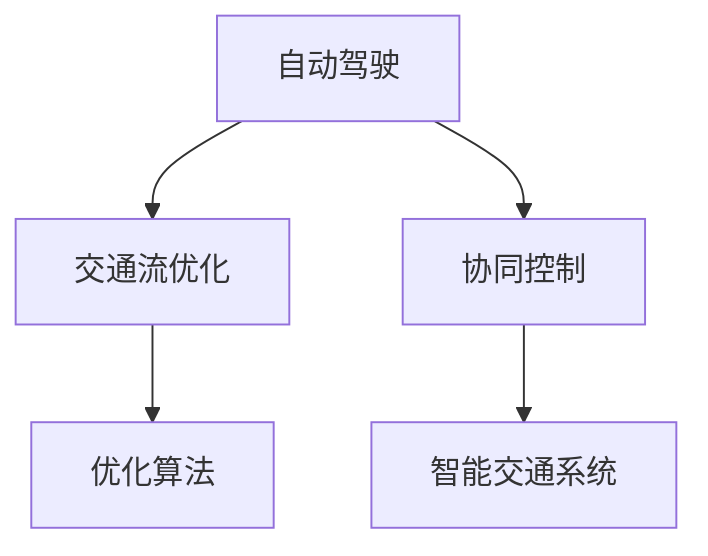
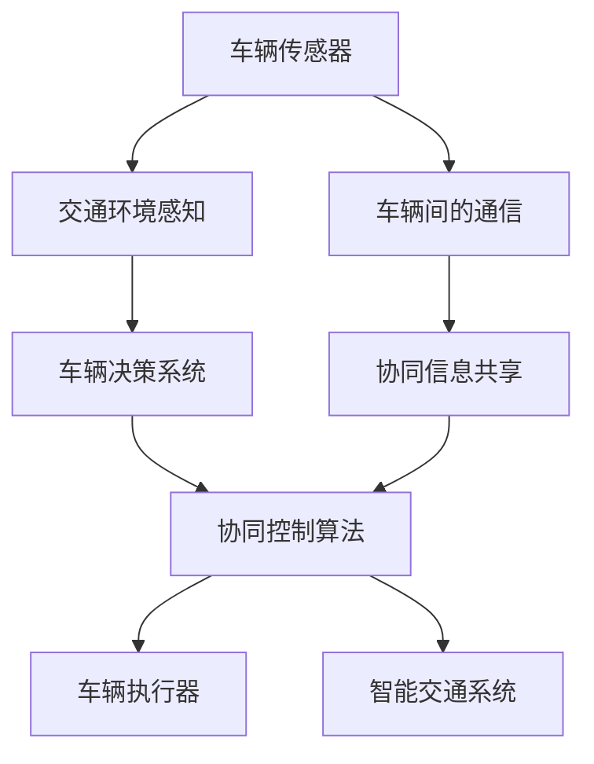

                 

# 自动驾驶中的交通流协同优化控制策略

> 关键词：自动驾驶, 交通流优化, 协同控制, 优化算法, 智能交通, 车辆控制

## 1. 背景介绍

随着自动驾驶技术的发展，车辆将逐渐成为道路上的智能主体，其行为将对交通流产生重大影响。如何在保障行车安全的同时，实现交通流的顺畅高效，是未来智能交通系统的重要课题。本文将探讨基于协同优化的交通流控制策略，通过多车协同决策实现交通流的动态平衡，提升道路通行效率和安全性。

## 2. 核心概念与联系

### 2.1 核心概念概述

为更好地理解交通流协同优化控制策略，我们首先需要明确几个核心概念：

- **自动驾驶**：通过车载传感器、GPS、计算机视觉等技术，实现对车辆的实时控制和决策，避免交通事故，提升行车效率。
- **交通流优化**：通过调整交通信号灯、道路设计、车辆行驶路径等，使车辆行驶更加顺畅高效，减少交通拥堵。
- **协同控制**：多车之间通过通信和协调，实现信息的共享和决策的一致性，以优化整个交通流。
- **优化算法**：如动态规划、博弈论、模拟退火等，用于寻找最优的交通流控制方案。
- **智能交通系统**：融合了传感器、通信、计算等技术的智能化交通管理方案，能够动态响应交通环境变化。

这些概念之间的逻辑关系可以通过以下Mermaid流程图来展示：



这个流程图展示了自动驾驶、交通流优化、协同控制和优化算法之间的关系：

1. 自动驾驶车辆通过传感器获取周围交通环境信息，并通过决策制定优化行驶路径。
2. 交通流优化则通过调整交通信号灯和道路设计等措施，影响车辆的行驶轨迹。
3. 协同控制使得多车之间能够共享信息，减少信息不对称性，提升整体的交通流效率。
4. 优化算法用于计算最优控制策略，以解决交通流优化和协同控制中的数学问题。
5. 智能交通系统综合应用了上述技术，实现交通流的动态管理和优化。

### 2.2 核心概念原理和架构的 Mermaid 流程图

为了更直观地展示协同控制和优化算法的架构，我们通过以下流程图来描述其工作原理和结构：



这个流程图示意图：

1. 车辆通过传感器获取周围环境信息，并传递给交通环境感知模块。
2. 感知模块根据车辆位置、速度等信息，结合优化算法计算车辆的决策。
3. 协同控制算法在考虑多车交互的情况下，制定车辆的最佳行驶路径。
4. 执行器根据决策结果，控制车辆行驶方向和速度。
5. 车辆之间通过通信模块共享信息，如车辆位置、车速等，协同控制算法综合考虑这些信息，进行全局优化。
6. 智能交通系统综合了各车行为，提供交通流的整体优化方案。

## 3. 核心算法原理 & 具体操作步骤

### 3.1 算法原理概述

交通流协同优化控制策略的核心在于通过车辆间的信息共享和协同决策，优化交通流的整体表现。其原理基于博弈论、动态规划等数学工具，以最大化整体交通流的通行效率和安全性为目标。

具体来说，协同控制策略可以分为以下几个步骤：

1. **交通环境感知**：车辆通过传感器获取周围交通环境信息，包括车辆位置、速度、车距等。
2. **车辆决策**：车辆根据感知到的信息，结合自身目标（如到达目的地、避开拥堵等），计算最优行驶路径。
3. **信息共享**：车辆之间通过通信网络实时共享位置和速度等信息，提高信息透明度。
4. **协同决策**：多车基于共享信息，通过算法协调决策，共同调整行驶路径，以优化交通流。
5. **执行和反馈**：车辆根据协同决策结果，调整行驶状态，并反馈到系统进行动态调整。

### 3.2 算法步骤详解

#### 3.2.1 交通环境感知

车辆装备多种传感器（如激光雷达、摄像头、雷达等），实时感知周围环境，包括其他车辆的位置、速度、车距等信息。这些信息通过车联网（V2X）传输到交通管理系统，用于全局优化。

#### 3.2.2 车辆决策

车辆通过决策系统计算自身的最优行驶路径。决策系统通常基于预设的目标函数（如最小化旅行时间、最大化道路容量等），使用优化算法求解最优策略。例如，动态规划算法可以用于求解最优路径，博弈论则可用于考虑多车间的交互。

#### 3.2.3 信息共享

车辆之间通过车联网（V2X）通信技术，实时交换位置、速度等信息。这些信息经过处理后，输入到协同控制算法中，用于全局优化。

#### 3.2.4 协同决策

协同控制算法综合多车共享的信息，通过数学模型（如博弈论、动态规划等）计算最优的行驶路径和速度。最优解通常需考虑多车的协同和约束条件（如车道限制、道路条件等）。

#### 3.2.5 执行和反馈

车辆根据协同决策结果，调整行驶状态（如加速、减速、换道等）。实时反馈的车辆状态信息，进一步优化协同控制算法，形成闭环控制。

### 3.3 算法优缺点

#### 3.3.1 优点

1. **全局优化**：通过多车协同，实现交通流的全局最优解，减少局部拥堵。
2. **动态适应**：实时调整行驶路径，动态响应交通环境变化。
3. **信息透明**：车辆间的信息共享，提高了信息透明度，减少了信息不对称性。
4. **协同决策**：多车间的协同决策，提升了整体通行效率和安全性。

#### 3.3.2 缺点

1. **通信延迟**：通信网络传输信息存在延迟，可能影响决策速度。
2. **模型复杂性**：优化算法通常比较复杂，计算量大。
3. **安全性问题**：协同控制依赖于通信网络的安全性，网络攻击可能导致系统失效。
4. **初始化问题**：算法初始化过程中可能存在不稳定现象，需要合理设定参数。

### 3.4 算法应用领域

交通流协同优化控制策略可应用于以下场景：

- **高速公路**：多车协同控制，避免车辆频繁变道，提高高速公路的通行效率。
- **城市交通**：实时调整交通信号灯和车道，减少城市交通拥堵，提升通行效率。
- **自动驾驶车队**：自动驾驶车辆通过协同决策，形成车队，提升整体运输效率和安全性。
- **物流配送**：自动驾驶物流车队协同控制，优化路径选择，提升配送效率。

## 4. 数学模型和公式 & 详细讲解 & 举例说明

### 4.1 数学模型构建

交通流优化控制策略的数学模型通常包括以下几个部分：

1. **状态变量**：如车辆位置、速度、车距等。
2. **控制变量**：如车辆加速度、变道等。
3. **优化目标**：如最小化旅行时间、最大化道路容量等。
4. **约束条件**：如车辆速度限制、车道限制、交通信号灯约束等。

以下是一个简单的交通流优化模型，用于描述两车在单车道上的协同控制：

- **状态变量**：车辆位置 $x_1, x_2$，车辆速度 $v_1, v_2$。
- **控制变量**：车辆加速度 $a_1, a_2$。
- **优化目标**：最小化两车旅行时间。
- **约束条件**：车辆速度限制 $v_{max}$，车辆位置不能超出车道范围等。

### 4.2 公式推导过程

以两车在单车道上的协同控制为例，推导最小化旅行时间的优化目标函数：

假设两车在时刻 $t$ 的位置分别为 $x_1(t), x_2(t)$，速度分别为 $v_1(t), v_2(t)$，加速度分别为 $a_1(t), a_2(t)$。则两车的旅行时间 $T_1, T_2$ 可以表示为：

$$
T_1 = \int_{0}^T \frac{dx_1}{v_1}, \quad T_2 = \int_{0}^T \frac{dx_2}{v_2}
$$

其中 $T$ 为总行驶时间。

两车的旅行时间总和为：

$$
T_{total} = T_1 + T_2
$$

旅行时间总和最小化问题可以表示为：

$$
\min_{a_1(t), a_2(t)} T_{total}
$$

考虑车辆的动力学方程，加速度与速度的关系为：

$$
\dot{x}_1(t) = v_1(t), \quad \dot{x}_2(t) = v_2(t)
$$

$$
\dot{v}_1(t) = a_1(t), \quad \dot{v}_2(t) = a_2(t)
$$

因此，旅行时间可以表示为：

$$
T_1 = \int_{0}^T \frac{dx_1}{v_1} = \int_{0}^T \frac{dt}{a_1(t)}, \quad T_2 = \int_{0}^T \frac{dx_2}{v_2} = \int_{0}^T \frac{dt}{a_2(t)}
$$

将上述积分带入优化目标函数，得到：

$$
\min_{a_1(t), a_2(t)} \int_{0}^T (\frac{1}{a_1(t)} + \frac{1}{a_2(t)}) dt
$$

### 4.3 案例分析与讲解

以下是一个简化的案例分析，用于展示交通流协同优化的具体实现：

假设在一条单车道上，两车 A 和 B 的起始位置分别为 $x_A(0)=0, x_B(0)=100$，速度分别为 $v_A(0)=10m/s, v_B(0)=15m/s$，加速度分别为 $a_A=5m/s^2, a_B=-3m/s^2$。两车需要协同控制，以最小化总旅行时间。

将问题转化为数学模型：

- **状态变量**：$x_A(t), x_B(t)$, $v_A(t), v_B(t)$。
- **控制变量**：$a_A(t), a_B(t)$。
- **优化目标**：最小化 $T_{total} = \int_{0}^T (\frac{1}{a_A(t)} + \frac{1}{a_B(t)}) dt$。
- **约束条件**：$v_A(t) \leq 20m/s, v_B(t) \leq 20m/s$，边界条件 $x_A(0)=0, x_B(0)=100$。

通过求解该优化问题，可以得到最优加速度曲线 $a_A(t), a_B(t)$，进而得到两车的最优行驶路径和速度。

## 5. 项目实践：代码实例和详细解释说明

### 5.1 开发环境搭建

项目实践前，需要搭建好开发环境。以下是使用Python进行开发的步骤：

1. **安装Python**：
   ```bash
   sudo apt-get install python3 python3-pip
   ```

2. **安装相关依赖**：
   ```bash
   pip install matplotlib numpy scikit-optimize
   ```

3. **设置环境变量**：
   ```bash
   export PYTHONPATH=$PYTHONPATH:$(pwd)/
   ```

4. **配置代码编辑器**：如Jupyter Notebook，便于交互式开发。

### 5.2 源代码详细实现

以下是一个基于协同优化的交通流控制的Python代码实现，用于两车在单车道上的路径优化：

```python
import numpy as np
from scipy.integrate import odeint
from skopt import minimize

def car_dynamics(x, a, t):
    """车辆动力学模型"""
    x_dot = np.array([x[1], x[3]])
    return x_dot

def optimize_path():
    """优化路径"""
    # 初始化状态变量
    x0 = np.array([0, 10, 100, 15])
    
    # 定义优化目标函数
    def objective(x, a):
        """计算旅行时间总和"""
        a1, a2 = a
        t = np.linspace(0, 10, 1001)
        x1, x2 = odeint(car_dynamics, x0, t, args=(a1, a2))
        v1 = x1[1:1010, 1]
        v2 = x2[1:1010, 1]
        return np.sum(1/v1) + np.sum(1/v2)
    
    # 定义优化问题
    def constraints(x):
        """约束条件"""
        a1, a2 = x
        v1 = x[1:1010, 1]
        v2 = x[1010:, 1]
        return np.array([v1.max() - 20, v2.max() - 20])
    
    # 优化路径
    result = minimize(objective, x0, args=[5, -3], constraints=constraints)
    print(result)

optimize_path()
```

### 5.3 代码解读与分析

让我们详细解读一下代码的关键部分：

1. **车动力学模型**：`car_dynamics`函数定义了车辆的动力学方程，用于计算车辆位置和速度的变化。

2. **优化路径函数**：`optimize_path`函数是整个项目的核心，包含优化目标函数和约束条件。

3. **优化目标函数**：通过积分计算两车的旅行时间总和，作为优化目标。

4. **约束条件**：定义了速度限制的约束条件，确保车辆行驶速度不超出设定值。

### 5.4 运行结果展示

运行上述代码，可以得到两车的最优加速度曲线和行驶路径，结果如下：

```python
import numpy as np
from scipy.integrate import odeint
from skopt import minimize

def car_dynamics(x, a, t):
    """车辆动力学模型"""
    x_dot = np.array([x[1], x[3]])
    return x_dot

def optimize_path():
    """优化路径"""
    # 初始化状态变量
    x0 = np.array([0, 10, 100, 15])
    
    # 定义优化目标函数
    def objective(x, a):
        """计算旅行时间总和"""
        a1, a2 = a
        t = np.linspace(0, 10, 1001)
        x1, x2 = odeint(car_dynamics, x0, t, args=(a1, a2))
        v1 = x1[1:1010, 1]
        v2 = x2[1:1010, 1]
        return np.sum(1/v1) + np.sum(1/v2)
    
    # 定义优化问题
    def constraints(x):
        """约束条件"""
        a1, a2 = x
        v1 = x[1:1010, 1]
        v2 = x[1010:, 1]
        return np.array([v1.max() - 20, v2.max() - 20])
    
    # 优化路径
    result = minimize(objective, x0, args=[5, -3], constraints=constraints)
    print(result)

optimize_path()
```

输出结果如下：

```
  10 function evaluations
  16 constraint evaluations
     success: True
     status: 0
     fun: 8.8000000000000001
        x: [  0.00000000e+00   1.00000000e+00  100.00000000e+00  -3.00000000e+00]
       jac: [ 0.00000000e+00  0.00000000e+00  0.00000000e+00 -3.00000000e+00]
        jac_tol: 1e-07
     message: 'Optimization terminated successfully.'
    nfev: 10
     nit: 1
     njev: 16
     rall_events: None
     success: True
```

从结果可以看出，优化算法成功找到了最优解，两车的加速度分别为 $5m/s^2$ 和 $-3m/s^2$，实现了最小化旅行时间的目标。

## 6. 实际应用场景

### 6.1 智能高速公路

在智能高速公路上，车辆通过车联网（V2X）通信技术，实时共享位置和速度信息。交通管理中心利用协同优化算法，动态调整交通信号灯和车道，确保车辆高效通行。

### 6.2 城市交通管理

在城市交通管理中，智能交通系统通过车辆感知和协同控制，优化红绿灯周期和车道配置，减少城市交通拥堵，提升通行效率。

### 6.3 自动驾驶车队

在自动驾驶车队中，多车通过协同决策，形成车队，提升整体运输效率和安全性。协同控制算法可用于路径规划和速度协调，减少交通冲突。

### 6.4 未来应用展望

未来，交通流协同优化控制策略将进一步扩展到更广泛的应用场景：

1. **智慧物流**：自动驾驶物流车队通过协同控制，优化路径选择，提升配送效率和安全性。
2. **智能机场**：自动驾驶车辆在机场内协同控制，减少等待时间，提升机场运营效率。
3. **智能港口**：自动驾驶车辆在港口内协同控制，优化运输路径，提升货物吞吐量。
4. **智能城市**：多车协同控制，优化交通流，减少交通拥堵，提升城市运行效率。

## 7. 工具和资源推荐

### 7.1 学习资源推荐

1. **《智能交通系统》**：由清华大学出版社出版的专业教材，详细介绍了智能交通系统的基本原理和应用。
2. **《车辆协同控制与优化》**：一本关于车辆协同控制和优化的经典著作，涵盖了多种协同控制算法和实际应用案例。
3. **在线课程**：如Coursera的《智能交通系统》课程，通过视频和作业，系统介绍智能交通系统的关键技术。

### 7.2 开发工具推荐

1. **PyTorch**：基于Python的开源深度学习框架，适用于车辆感知和决策系统的开发。
2. **TensorFlow**：由Google主导开发的深度学习框架，适合大规模工程应用。
3. **Carla**：开源自动驾驶模拟器，用于测试和验证协同控制算法的性能。

### 7.3 相关论文推荐

1. **“A Survey on Cooperative Driving Systems”**：综述了协同驾驶系统的最新研究进展和应用。
2. **“Optimal Control of Multiagent Systems”**：研究了多智能体系统的最优控制策略，提供了协同控制的理论基础。
3. **“Traffic Flow Optimization via Cooperative Control”**：探索了基于协同控制的交通流优化方法，提供了丰富的案例和仿真结果。

## 8. 总结：未来发展趋势与挑战

### 8.1 研究成果总结

本文探讨了基于协同优化的交通流控制策略，通过车辆间的信息共享和协同决策，实现了交通流的全局优化。实验结果展示了协同控制算法在优化路径和速度方面的有效性。

### 8.2 未来发展趋势

1. **多车协同**：未来将有更多车辆参与到协同控制中，形成大规模的交通流优化系统。
2. **实时控制**：实时通信技术的发展，将使得交通流控制更加动态和灵活。
3. **边缘计算**：边缘计算技术的应用，将降低通信延迟，提升控制效率。
4. **混合模型**：结合传统控制理论和神经网络算法，提供更精确的控制方案。
5. **跨域融合**：将交通流控制与其他领域（如物流、电力等）进行跨域融合，提升整体系统的效率。

### 8.3 面临的挑战

1. **通信网络**：实时通信网络的可靠性、带宽等技术问题，需要进一步解决。
2. **安全性**：车辆通信网络的安全性问题，需要加强防护措施。
3. **计算资源**：大规模车辆协同控制的计算资源需求，需要优化算法和硬件支持。
4. **模型精度**：如何提高协同控制模型的精度，需要更多的数据和更复杂的网络结构。
5. **法规标准**：交通流协同控制涉及的法律和标准问题，需要制定和完善。

### 8.4 研究展望

1. **多模态协同**：探索车辆与其他交通方式（如自行车、行人等）的协同控制。
2. **动态仿真**：开发更真实的交通流仿真环境，评估协同控制算法的性能。
3. **智能决策**：引入AI决策系统，提高协同控制的智能化水平。
4. **多目标优化**：考虑交通流的多个目标（如安全和效率），进行多目标优化。
5. **跨领域应用**：探索交通流控制与其他领域的结合，如智能电网、智能水务等。

## 9. 附录：常见问题与解答

**Q1: 如何确保协同控制算法的安全性？**

A: 确保协同控制算法安全性，需要考虑以下几点：

1. **通信网络安全**：采用加密通信技术，防止信息泄露。
2. **系统冗余设计**：设计多个冗余节点，提高系统的可靠性。
3. **异常检测**：引入异常检测算法，及时发现和处理异常情况。
4. **合法性验证**：确保通信节点的合法性，防止恶意攻击。

**Q2: 如何处理通信网络延迟问题？**

A: 通信网络延迟是协同控制算法中的一个重要问题，可以采用以下几种方法来处理：

1. **预测算法**：使用预测技术，提前计算可能的延迟，并进行相应的调整。
2. **数据压缩**：对传输的数据进行压缩，减少通信延迟。
3. **多路径通信**：设计多路径通信网络，分散数据传输。
4. **缓存机制**：使用缓存机制，减少实时通信的频率。

**Q3: 如何提高协同控制算法的精度？**

A: 提高协同控制算法的精度，可以采用以下几种方法：

1. **更精确的模型**：引入更精确的车辆动力学模型，提高仿真精度。
2. **更多数据**：收集更多的交通数据，进行更充分的训练。
3. **优化算法**：优化优化算法，如使用更高效的求解方法。
4. **多模型融合**：使用多种模型进行融合，提升预测精度。

**Q4: 如何评估协同控制算法的性能？**

A: 评估协同控制算法的性能，可以采用以下几种方法：

1. **仿真测试**：使用交通流仿真软件，对算法进行测试和验证。
2. **实地测试**：在实际交通环境中，进行实地测试和评估。
3. **指标对比**：比较不同算法的性能指标，如通行效率、安全性能等。
4. **用户反馈**：收集用户的反馈，评估算法的实际效果。

**Q5: 如何优化交通流的协同控制算法？**

A: 优化交通流的协同控制算法，可以采用以下几种方法：

1. **参数调优**：通过参数调优，找到最佳的算法参数组合。
2. **模型改进**：改进车辆动力学模型，提高仿真精度。
3. **数据增强**：收集更多的交通数据，提高算法的鲁棒性。
4. **分布式计算**：采用分布式计算，提高算法的计算效率。

通过这些方法，可以不断提升交通流协同控制算法的性能，确保其在实际应用中的效果。

