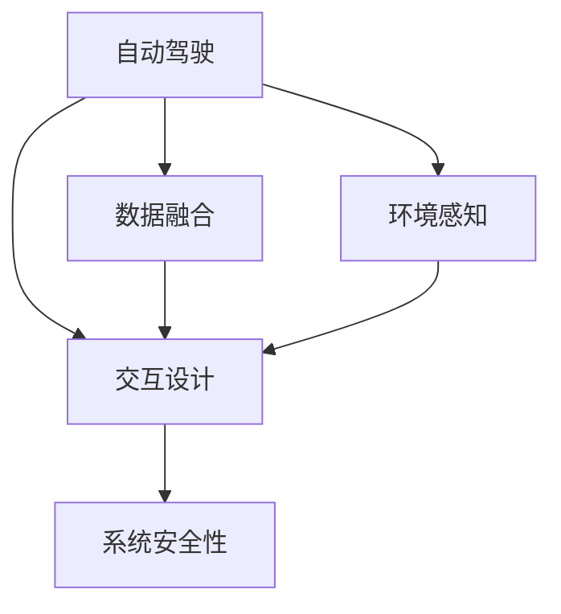

                 

# 自动驾驶中的增强现实辅助驾驶技术

> 关键词：自动驾驶,增强现实(AR),辅助驾驶,车路协同,环境感知

## 1. 背景介绍

随着自动驾驶技术的日益成熟，辅助驾驶系统成为了连接高级自动驾驶和传统驾驶的重要桥梁。通过增强现实(AR)技术，辅助驾驶系统可以在复杂多变的驾驶场景中，为驾驶者提供关键信息，辅助做出更加准确、安全的驾驶决策。

### 1.1 问题由来
传统的辅助驾驶系统主要依赖于传感器和算法，通过实时采集车辆周围的视觉、雷达、激光雷达等数据，利用图像处理、目标检测、路径规划等技术，辅助驾驶者进行变道、超车、避障等操作。然而，这些系统往往需要依赖驾驶者的主动干预，无法提供更加直观、有效的信息提示。

增强现实技术的引入，可以极大提升驾驶体验。AR系统通过实时渲染车辆周围的环境信息，如车道线、交通标志、路标、行人等，直接呈现在驾驶者的视线范围内。相比于传统的视觉反馈，AR系统的信息呈现更加生动、立体，能显著提升驾驶者对环境的感知能力。

### 1.2 问题核心关键点
AR辅助驾驶系统的核心关键点在于如何高效、准确地获取和处理车辆周围的环境信息，并实时渲染成可交互的增强现实场景。其技术挑战包括：

- 环境感知：从各种传感器采集实时数据，并识别出有意义的信息（如车辆、行人、交通标志等）。
- 环境渲染：将环境信息渲染成可交互的3D场景，并在驾驶者的视线范围内进行叠加。
- 数据融合：将传感器数据和导航信息进行融合，生成完整的3D场景信息。
- 交互设计：设计友好的用户界面，引导驾驶者做出驾驶决策。
- 系统安全性：保证系统在各种极端情况下依然稳定可靠。

这些关键技术挑战是自动驾驶领域目前的研究热点，也是本文将要探讨的核心问题。

## 2. 核心概念与联系

### 2.1 核心概念概述

为了更好地理解AR辅助驾驶技术，本节将介绍几个关键概念：

- 自动驾驶：指通过计算机视觉、智能决策等技术，实现车辆自动行驶的目标。根据SAE的自动驾驶分级，自动驾驶技术从简单到复杂可以分为L0-L5五个等级。
- 增强现实(AR)：指通过在真实世界的视野中叠加数字信息，提升用户的感知体验。AR技术在医疗、军事、教育等领域广泛应用。
- 车路协同：指通过车辆与路网、基础设施的协同工作，提高交通系统的效率和安全性。车路协同可以增强车辆的环境感知和决策能力。
- 环境感知：指通过传感器和算法，实时获取车辆周围的环境信息。传感器包括摄像头、雷达、激光雷达、超声波传感器等。
- 数据融合：指将来自不同传感器和数据源的信息，通过算法融合为一致的世界观，提供准确的驾驶辅助信息。
- 交互设计：指通过友好的用户界面，引导驾驶者与系统进行交互，做出决策。
- 系统安全性：指在系统设计中融入安全性考量，保证系统在各种极端情况下依然稳定可靠。

这些核心概念之间的逻辑关系可以通过以下Mermaid流程图来展示：



这个流程图展示了下文所涉及的各项技术之间的联系：

1. 自动驾驶系统依赖环境感知获取周边信息。
2. 数据融合将来自不同传感器的信息融合为统一的世界观。
3. 交互设计将融合后的信息呈现给驾驶者。
4. 系统安全性确保系统的稳定性和可靠性。

## 3. 核心算法原理 & 具体操作步骤
### 3.1 算法原理概述

AR辅助驾驶技术的关键在于如何高效、准确地获取和处理车辆周围的环境信息，并实时渲染成可交互的增强现实场景。其实现流程包括以下几个步骤：

1. 环境感知：通过传感器实时采集车辆周围的环境信息。
2. 数据融合：将传感器数据和导航信息进行融合，生成完整的3D场景信息。
3. 环境渲染：将环境信息渲染成可交互的3D场景，并在驾驶者的视线范围内进行叠加。
4. 交互设计：设计友好的用户界面，引导驾驶者做出驾驶决策。
5. 系统安全性：保证系统在各种极端情况下依然稳定可靠。

### 3.2 算法步骤详解

以下是AR辅助驾驶技术的详细步骤：

**Step 1: 环境感知**
- 利用摄像头、雷达、激光雷达等传感器采集实时数据。
- 对数据进行预处理，如去噪、校正等，提高数据的可靠性。
- 使用目标检测算法（如YOLO、SSD、Faster R-CNN等），识别出车辆、行人、交通标志等重要目标。

**Step 2: 数据融合**
- 将传感器数据和导航信息进行融合，生成完整的3D场景信息。
- 使用SLAM（同步定位与地图构建）算法，实时更新车辆在地图中的位置和姿态。
- 利用IMU（惯性测量单元）和GPS数据，进一步提高定位精度。

**Step 3: 环境渲染**
- 将环境信息渲染成可交互的3D场景，并在驾驶者的视线范围内进行叠加。
- 使用OpenGL或DirectX等图形渲染库，将3D场景渲染成图像。
- 将渲染结果叠加在驾驶者的实时视野中，使用增强现实技术进行显示。

**Step 4: 交互设计**
- 设计友好的用户界面，引导驾驶者做出驾驶决策。
- 通过AR界面显示车辆周围的环境信息，如车道线、交通标志、路标等。
- 设计交互操作，如手势控制、语音指令等，方便驾驶者进行操作。

**Step 5: 系统安全性**
- 在系统设计中融入安全性考量，保证系统在各种极端情况下依然稳定可靠。
- 设置异常检测机制，如异常轨迹检测、异常行为检测等，及时发现潜在风险。
- 引入冗余机制，如传感器冗余、系统冗余等，避免单点故障影响系统安全。

### 3.3 算法优缺点

AR辅助驾驶技术的优点包括：

1. 提升驾驶体验：AR系统提供直观、立体的环境信息，增强驾驶者对环境的感知能力。
2. 辅助驾驶决策：AR界面提供的关键信息，如车道线、交通标志、路标等，辅助驾驶者做出更准确的驾驶决策。
3. 提高安全性：通过实时环境渲染和数据融合，AR系统能提前发现潜在风险，避免事故发生。
4. 扩展应用场景：AR技术可以应用到复杂多变的驾驶场景中，提升驾驶系统的灵活性和适应性。

然而，AR辅助驾驶技术也存在一些缺点：

1. 数据处理复杂：传感器数据和环境信息的融合处理需要复杂的算法，增加了系统的计算负担。
2. 渲染效果受限：实时渲染效果受限于设备性能和数据精度，难以达到理想的显示效果。
3. 交互设计困难：友好的用户界面设计需要充分考虑驾驶者的需求和使用习惯，难度较大。
4. 系统安全性挑战：极端情况下的异常检测和冗余设计需要高精度算法和冗余硬件，成本较高。

尽管存在这些缺点，但AR辅助驾驶技术仍被广泛认为是未来自动驾驶的关键技术之一。未来需要进一步优化算法的效率和精度，提高系统的渲染效果和交互设计，增强系统的安全性，以充分发挥AR技术在自动驾驶中的潜力。

### 3.4 算法应用领域

AR辅助驾驶技术主要应用于以下领域：

1. 智能驾驶系统：将AR技术引入智能驾驶系统，提高驾驶系统的安全性和可靠性。
2. 车路协同系统：通过车路协同技术，实时获取路网信息，增强车辆的环境感知和决策能力。
3. 车辆导航系统：将AR技术与导航系统结合，提供更直观的导航信息和驾驶指引。
4. 自动泊车系统：利用AR技术辅助驾驶者进行精准定位和泊车操作。
5. 危险驾驶预警：通过AR界面实时显示车辆周围环境信息，提前预警危险情况。
6. 紧急避险系统：在紧急情况下，通过AR界面显示最佳避险路线，辅助驾驶者做出决策。

这些应用场景展示了AR技术在自动驾驶中的广泛应用前景，未来随着技术的不断进步，AR辅助驾驶系统将在更多领域发挥关键作用。

## 4. 数学模型和公式 & 详细讲解 & 举例说明

### 4.1 数学模型构建

AR辅助驾驶技术的数学模型主要涉及以下几个方面：

- 环境感知：通过目标检测算法获取车辆周围的环境信息。
- 数据融合：通过SLAM算法融合传感器数据和导航信息。
- 环境渲染：通过图形渲染库生成3D场景图像。

### 4.2 公式推导过程

以目标检测算法为例，推导YOLO算法中用于目标分类的交叉熵损失函数：

假设目标数据为 $(x, y)$，其中 $x$ 为实际标签，$y$ 为模型预测的标签概率。交叉熵损失函数定义为：

$$
L = -\sum_i \left(x_i \log(y_i) + (1-x_i) \log(1-y_i)\right)
$$

在实际应用中，该公式可以进一步扩展为多类别目标检测的场景，通过修改目标标签和预测标签的空间维度，实现更复杂的场景建模。

### 4.3 案例分析与讲解

以无人驾驶出租车为例，展示AR辅助驾驶技术的实现过程。

1. **环境感知**：利用摄像头、激光雷达、GPS等传感器实时采集车辆周围的环境信息。
2. **数据融合**：通过SLAM算法，将传感器数据和GPS数据融合，生成完整的3D场景信息。
3. **环境渲染**：利用OpenGL图形渲染库，将3D场景渲染成图像，并通过AR界面叠加在驾驶者的视野中。
4. **交互设计**：通过AR界面显示车道线、交通标志、路标等关键信息，设计手势控制、语音指令等交互操作。
5. **系统安全性**：通过异常检测算法和冗余设计，确保系统在各种极端情况下的稳定性和可靠性。

通过这些步骤，无人驾驶出租车系统能够在复杂多变的驾驶场景中，实时获取环境信息，辅助驾驶者做出准确、安全的驾驶决策，显著提升行驶安全性。

## 5. 项目实践：代码实例和详细解释说明

### 5.1 开发环境搭建

在进行AR辅助驾驶技术开发前，需要准备好开发环境。以下是使用Python和OpenCV进行AR开发的环境配置流程：

1. 安装Python：从官网下载并安装Python，配置好开发环境。
2. 安装OpenCV：使用pip命令安装OpenCV库，用于图像处理和计算机视觉任务。
3. 安装其他依赖库：安装numpy、pandas、scipy等科学计算库，以及Matplotlib用于可视化。
4. 搭建开发环境：在Python开发环境中，导入OpenCV和其他依赖库，编写代码实现AR功能。

### 5.2 源代码详细实现

以下是一个简单的AR辅助驾驶系统的代码实现：

```python
import cv2
import numpy as np
import matplotlib.pyplot as plt

# 加载摄像头图像
cap = cv2.VideoCapture(0)
ret, frame = cap.read()

# 加载待叠加的3D场景图像
img_ar = cv2.imread('ar_scene.png')

# 将3D场景图像叠加到摄像头图像中
h, w = img_ar.shape[:2]
frame[0:h, 0:w] = img_ar

# 显示AR图像
cv2.imshow('AR辅助驾驶系统', frame)
cv2.waitKey(0)
cv2.destroyAllWindows()
```

这段代码实现了一个简单的AR系统，通过摄像头实时获取图像，将3D场景图像叠加到摄像头图像中，并在窗口中显示。

### 5.3 代码解读与分析

**视频捕获与图像处理**：
- 使用OpenCV的VideoCapture类捕获摄像头图像，读取当前帧。
- 使用cv2.imread加载待叠加的3D场景图像。

**图像叠加**：
- 定义3D场景图像的尺寸，并使用numpy切片操作，将3D场景图像叠加到摄像头图像的指定位置。
- 将叠加后的图像使用OpenCV的imshow函数显示在窗口中。

**代码优缺点**：
- 优点：代码实现简单，能够快速展示AR图像的叠加效果。
- 缺点：功能较为基础，没有考虑环境感知、数据融合、交互设计等关键技术。

## 6. 实际应用场景

### 6.1 智能驾驶系统

智能驾驶系统通过AR技术，显著提升了驾驶体验和安全性。通过实时渲染车辆周围的环境信息，AR系统帮助驾驶者更好地感知周边环境，辅助驾驶决策。

### 6.2 车路协同系统

车路协同系统通过AR技术，实时获取路网信息，增强车辆的环境感知和决策能力。通过AR界面显示交通标志、红绿灯等信息，提前告知驾驶者，提高通行效率和安全性。

### 6.3 车辆导航系统

车辆导航系统通过AR技术，提供更直观的导航信息和驾驶指引。通过AR界面显示车道线、路标、交通标志等信息，辅助驾驶者进行精准导航。

### 6.4 自动泊车系统

自动泊车系统通过AR技术，实现精准定位和泊车操作。通过AR界面显示停车位、车距等信息，辅助驾驶者进行泊车。

### 6.5 危险驾驶预警

危险驾驶预警系统通过AR技术，实时显示车辆周围环境信息，提前预警危险情况。通过AR界面显示障碍物、车辆等信息，辅助驾驶者及时避险。

### 6.6 紧急避险系统

紧急避险系统通过AR技术，显示最佳避险路线，辅助驾驶者做出决策。通过AR界面显示避险路径、车辆位置等信息，辅助驾驶者进行紧急避险。

## 7. 工具和资源推荐

### 7.1 学习资源推荐

为了帮助开发者系统掌握AR辅助驾驶技术，以下是一些优质的学习资源：

1. 《OpenCV计算机视觉编程入门》：介绍OpenCV的基本功能和应用场景，适合初学者学习。
2. 《深度学习与计算机视觉》课程：斯坦福大学开设的深度学习与计算机视觉课程，涵盖图像处理、目标检测等关键技术。
3. 《自动驾驶技术》书籍：详细介绍了自动驾驶技术的核心概念和实现方法，适合进阶学习。
4. 《增强现实技术》课程：介绍增强现实技术的基本原理和应用场景，适合了解AR技术的入门学习。

通过对这些资源的学习实践，相信你一定能够快速掌握AR辅助驾驶技术的精髓，并用于解决实际的自动驾驶问题。

### 7.2 开发工具推荐

高效的开发离不开优秀的工具支持。以下是几款用于AR辅助驾驶开发的常用工具：

1. OpenCV：开源计算机视觉库，提供了丰富的图像处理和计算机视觉算法。
2. TensorFlow和PyTorch：深度学习框架，支持图像处理、目标检测等任务。
3. Unity和Unreal Engine：强大的游戏引擎，支持AR系统的开发和渲染。
4. ROS（Robot Operating System）：机器人操作系统，支持自动化驾驶系统的开发。

合理利用这些工具，可以显著提升AR辅助驾驶任务的开发效率，加快创新迭代的步伐。

### 7.3 相关论文推荐

AR辅助驾驶技术的快速发展离不开学界的持续研究。以下是几篇奠基性的相关论文，推荐阅读：

1. 《Real-Time Single-Shot Object Detection with Feature Pyramid Networks》：提出YOLO算法，实现实时目标检测。
2. 《Simultaneous Localization and Mapping with Fast Levenberg-Marquardt Invariant Points》：提出SLAM算法，实现传感器数据的融合。
3. 《Real-Time Augmented Reality for Navigation: A Survey》：综述AR技术在导航系统中的应用，分析其发展趋势。
4. 《A Survey of Augmented Reality Applications in Transportation》：综述AR技术在交通领域的应用，分析其技术挑战和应用前景。

这些论文代表了大语言模型微调技术的发展脉络。通过学习这些前沿成果，可以帮助研究者把握学科前进方向，激发更多的创新灵感。

## 8. 总结：未来发展趋势与挑战

### 8.1 总结

本文对AR辅助驾驶技术进行了全面系统的介绍。首先阐述了AR辅助驾驶技术的研究背景和意义，明确了技术在自动驾驶中的核心地位。其次，从原理到实践，详细讲解了AR辅助驾驶技术的数学模型和具体操作步骤，给出了AR辅助驾驶系统的代码实现。同时，本文还广泛探讨了AR技术在智能驾驶、车路协同、车辆导航等多个领域的应用前景，展示了AR技术的广泛应用潜力。

通过本文的系统梳理，可以看到，AR辅助驾驶技术在自动驾驶领域扮演着越来越重要的角色。这些技术的不断进步，将显著提升驾驶体验和安全性，推动自动驾驶技术的产业化进程。未来，随着技术的不断迭代和优化，AR辅助驾驶系统必将在更广泛的领域得到应用，为人类社会的数字化、智能化带来深远影响。

### 8.2 未来发展趋势

展望未来，AR辅助驾驶技术将呈现以下几个发展趋势：

1. 实时渲染精度提升：随着GPU和计算力的提升，AR系统的渲染精度和实时性将大幅提升，为用户提供更加逼真的驾驶体验。
2. 环境感知能力增强：通过更先进的目标检测和SLAM算法，AR系统将更好地融合传感器数据，提供更准确的环境信息。
3. 交互设计优化：友好的用户界面设计和交互操作，将进一步提升驾驶者的操作体验。
4. 安全性和可靠性增强：通过异常检测和冗余设计，AR系统将具有更高的安全性和可靠性，在极端情况下依然稳定运行。
5. 多模态数据融合：AR系统将更好地融合视觉、雷达、激光雷达等多模态数据，提供更全面的环境信息。
6. 边缘计算应用：通过边缘计算技术，AR系统将在车联网等场景中实现实时处理和本地渲染，减少网络延迟，提升用户体验。

这些趋势凸显了AR辅助驾驶技术的广阔前景。这些方向的探索发展，必将进一步提升AR辅助驾驶系统的性能和应用范围，为自动驾驶技术的发展提供新的动力。

### 8.3 面临的挑战

尽管AR辅助驾驶技术已经取得了显著成果，但在迈向更加智能化、普适化应用的过程中，仍面临诸多挑战：

1. 硬件成本高昂：高质量的摄像头、激光雷达等传感器成本较高，难以大规模普及。
2. 数据处理复杂：传感器数据的融合处理需要复杂的算法，增加了系统的计算负担。
3. 渲染效果受限：实时渲染效果受限于设备性能和数据精度，难以达到理想的显示效果。
4. 交互设计困难：友好的用户界面设计需要充分考虑驾驶者的需求和使用习惯，难度较大。
5. 系统安全性挑战：极端情况下的异常检测和冗余设计需要高精度算法和冗余硬件，成本较高。

尽管存在这些挑战，但AR辅助驾驶技术仍被广泛认为是未来自动驾驶的关键技术之一。未来需要进一步优化算法的效率和精度，提高系统的渲染效果和交互设计，增强系统的安全性，以充分发挥AR技术在自动驾驶中的潜力。

### 8.4 研究展望

面对AR辅助驾驶技术所面临的种种挑战，未来的研究需要在以下几个方面寻求新的突破：

1. 探索更高效的传感器数据融合算法：优化SLAM算法和目标检测算法，提高数据融合的效率和精度。
2. 开发更高精度的实时渲染技术：通过优化渲染引擎，提升渲染精度和实时性，提供更加逼真的AR体验。
3. 引入更多先验知识：将符号化的先验知识，如知识图谱、逻辑规则等，与神经网络模型进行融合，增强AR系统的决策能力。
4. 研究多模态数据融合：将视觉、雷达、激光雷达等多模态数据进行有效融合，提供更全面的环境信息。
5. 探索交互设计新思路：结合心理学、人机交互等理论，设计更加直观、易用的AR界面。
6. 引入边缘计算技术：通过边缘计算技术，实现实时处理和本地渲染，提高系统的响应速度和稳定性。

这些研究方向的发展，必将引领AR辅助驾驶技术迈向更高的台阶，为自动驾驶技术的产业化提供新的技术路径。面向未来，AR辅助驾驶技术还需要与其他人工智能技术进行更深入的融合，如计算机视觉、智能决策等，多路径协同发力，共同推动自动驾驶技术的进步。只有勇于创新、敢于突破，才能不断拓展AR辅助驾驶技术的边界，为自动驾驶技术的发展带来新的突破。

## 9. 附录：常见问题与解答

**Q1: AR辅助驾驶系统如何保证实时性？**

A: AR辅助驾驶系统保证实时性的关键在于优化渲染引擎和算法。通过GPU加速、多线程处理等技术，提高渲染效率和数据处理速度。同时，优化传感器数据融合算法，减少数据处理和计算负担，确保系统在实时性要求下稳定运行。

**Q2: AR辅助驾驶系统在极端情况下如何保证安全性？**

A: AR辅助驾驶系统在极端情况下保证安全性的关键在于冗余设计和异常检测。通过传感器冗余、系统冗余等技术，确保系统在单点故障时依然能够正常运行。引入异常检测机制，如异常轨迹检测、异常行为检测等，及时发现潜在风险，并采取相应措施。

**Q3: AR辅助驾驶系统如何处理复杂多变的驾驶场景？**

A: AR辅助驾驶系统处理复杂多变的驾驶场景的关键在于传感器数据的融合和渲染。通过多传感器融合，提高环境感知能力。通过实时渲染技术，生成动态的AR界面，适应各种驾驶场景。

**Q4: AR辅助驾驶系统在自动驾驶中的应用场景有哪些？**

A: AR辅助驾驶系统在自动驾驶中的应用场景包括智能驾驶系统、车路协同系统、车辆导航系统、自动泊车系统、危险驾驶预警系统和紧急避险系统。

**Q5: AR辅助驾驶系统在实际应用中如何提升驾驶体验？**

A: AR辅助驾驶系统通过实时渲染环境信息，如车道线、交通标志、路标等，提供直观、立体的驾驶体验。通过友好的用户界面设计，引导驾驶者做出驾驶决策，提升驾驶舒适度和便捷性。

