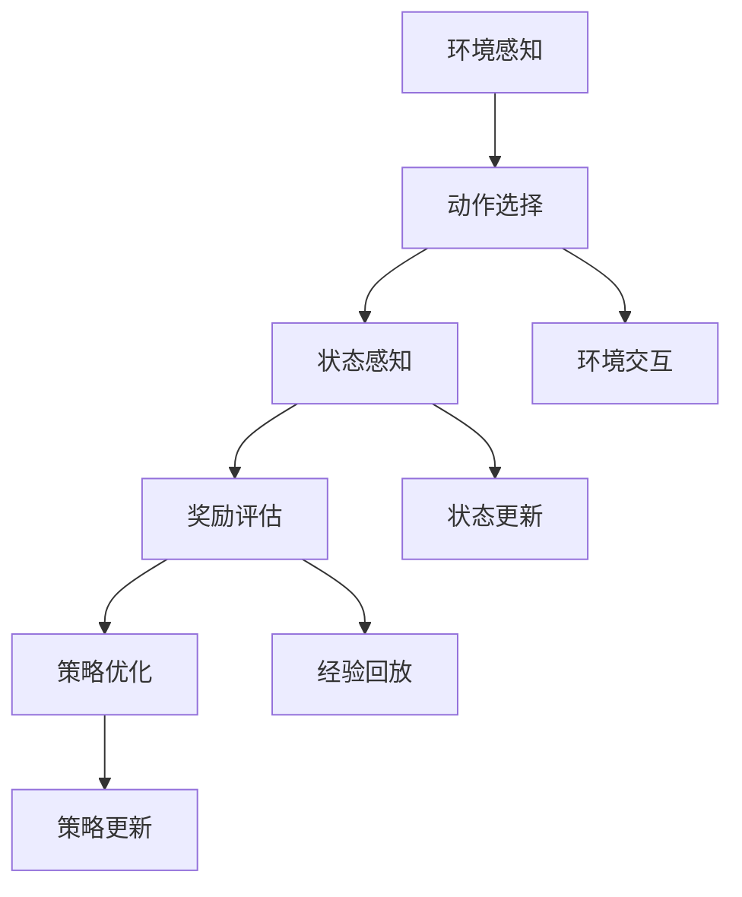

                 

# 自动驾驶中的强化学习方法

> 关键词：强化学习, 自动驾驶, 决策策略, 环境感知, 模拟器, 连续决策

## 1. 背景介绍

随着人工智能技术的飞速发展，自动驾驶技术已经成为全球科技竞争的前沿领域。自动驾驶不仅涉及复杂的环境感知和决策问题，还要求系统能够在动态变化的道路场景中实现安全和高效的行驶。强化学习（Reinforcement Learning, RL）作为当前自动驾驶决策的核心技术之一，为构建智能驾驶系统提供了强有力的支持。本文将全面介绍强化学习在自动驾驶中的应用，从原理到实践，详细解析其在决策策略、环境感知、模拟器等方面的关键技术。

## 2. 核心概念与联系

### 2.1 核心概念概述

强化学习是一种通过与环境交互学习最优决策策略的机器学习方法。在自动驾驶中，强化学习可以用于训练车辆在复杂交通场景下的驾驶策略，使车辆能够在无监督的情况下，通过不断的试错和调整，逐步学习到最优的驾驶行为。

与传统的监督学习不同，强化学习的训练过程不依赖标注数据，而是通过模拟或现实中的环境与动作交互，不断调整策略来优化目标函数。这一特性使得强化学习在自动驾驶领域有着广泛的应用前景。

### 2.2 核心概念原理和架构的 Mermaid 流程图



这个Mermaid流程图展示了强化学习在自动驾驶中的核心流程：

1. **环境感知**：通过传感器获取车辆周围环境信息，如摄像头、激光雷达、毫米波雷达等。
2. **动作选择**：根据感知到的环境信息，决定车辆的动作（如加速、刹车、转向等）。
3. **状态感知**：实时更新车辆当前的状态（如位置、速度、角度等）。
4. **奖励评估**：根据车辆的行驶状态和交通法规，对动作的好坏进行评估。
5. **策略优化**：通过不断的学习，更新最优的驾驶策略。

这些核心概念构成了自动驾驶中强化学习的完整流程，为自动驾驶决策提供了一种高效、灵活的学习机制。

## 3. 核心算法原理 & 具体操作步骤

### 3.1 算法原理概述

强化学习在自动驾驶中的应用主要集中在两方面：决策策略学习和环境感知学习。决策策略学习旨在训练模型能够根据环境信息，选择最优的驾驶动作；环境感知学习则关注如何构建高效的感知模型，准确理解车辆周围环境的动态变化。

在决策策略学习中，常见的算法包括Q-Learning、Deep Q-Networks（DQN）、Proximal Policy Optimization（PPO）等。这些算法通过不断探索环境，利用奖励信号进行策略优化，逐步学习到最优的驾驶策略。

在环境感知学习中，常见的算法包括卷积神经网络（CNN）、循环神经网络（RNN）、Transformer等。这些算法通过学习环境数据的特征表示，能够准确地捕捉动态变化的环境信息。

### 3.2 算法步骤详解

#### 3.2.1 决策策略学习

**Step 1: 环境建模**

首先需要建立车辆周围环境的数学模型。常见的环境模型包括Mapbox、Open Street Map（OSM）等。这些模型提供了详细的道路、交通信号灯、障碍物等信息，供算法进行决策参考。

**Step 2: 动作空间定义**

定义动作空间，包括加速、刹车、转向等操作。动作空间的设定需考虑安全性和驾驶习惯，确保模型能够在实际应用中取得良好的效果。

**Step 3: 状态空间定义**

定义状态空间，包括车辆位置、速度、角度、周围障碍物等信息。状态空间的设定需兼顾完备性和实时性，确保模型能够快速响应环境变化。

**Step 4: 奖励函数设计**

设计奖励函数，用于评估动作的好坏。奖励函数的设计需综合考虑交通规则、车辆性能、安全性等因素，确保模型能够在多目标约束下做出合理决策。

**Step 5: 算法训练**

采用强化学习算法，如Q-Learning、DQN、PPO等，对决策策略进行训练。训练过程中，通过与环境不断交互，逐步优化策略，提升决策精度。

**Step 6: 策略评估与优化**

通过模拟器或实际道路测试，对训练好的策略进行评估和优化，确保策略在多种驾驶场景下都能取得良好效果。

#### 3.2.2 环境感知学习

**Step 1: 数据采集**

通过摄像头、激光雷达、毫米波雷达等传感器，采集车辆周围环境的数据。

**Step 2: 特征提取**

对采集的数据进行特征提取，使用CNN、RNN、Transformer等模型，学习环境数据的特征表示。

**Step 3: 模型训练**

使用训练好的特征提取模型，对车辆周围环境进行实时感知，预测环境变化。

**Step 4: 模型评估与优化**

通过模拟器或实际道路测试，对感知模型进行评估和优化，提升环境感知的准确性和实时性。

### 3.3 算法优缺点

强化学习在自动驾驶中的应用具有以下优点：

1. **灵活性高**：强化学习可以处理非结构化数据，适合复杂、动态的环境。
2. **适应性强**：模型可以自主学习，适应不同驾驶场景。
3. **动态优化**：能够根据环境变化，实时调整驾驶策略。

但同时也存在一些缺点：

1. **计算成本高**：强化学习需要大量的计算资源，训练周期长。
2. **鲁棒性差**：对环境变化敏感，模型容易过拟合。
3. **决策不确定**：模型的决策过程难以解释，缺乏可解释性。

### 3.4 算法应用领域

强化学习在自动驾驶中的应用领域非常广泛，包括但不限于以下几个方面：

1. **路径规划**：基于强化学习，训练模型能够根据环境信息，选择最优的行驶路径。
2. **交通信号灯识别**：利用强化学习，训练模型能够准确识别交通信号灯，并做出正确的驾驶动作。
3. **自动驾驶仿真**：通过强化学习，构建虚拟驾驶场景，对自动驾驶策略进行评估和优化。
4. **交通流量预测**：利用强化学习，预测交通流量变化，优化交通管理策略。
5. **车道保持**：训练模型能够实时调整车辆位置，保持车道行驶。

## 4. 数学模型和公式 & 详细讲解 & 举例说明

### 4.1 数学模型构建

强化学习的数学模型主要由状态空间 $\mathcal{S}$、动作空间 $\mathcal{A}$、奖励函数 $r(\cdot)$ 和策略 $\pi(\cdot)$ 构成。

- 状态空间 $\mathcal{S}$：表示车辆在某一时刻的即时状态，如位置、速度、方向等。
- 动作空间 $\mathcal{A}$：表示车辆可执行的动作，如加速、刹车、转向等。
- 奖励函数 $r(\cdot)$：用于评估动作的好坏，通常定义为状态-动作对 $(s, a)$ 的奖励值。
- 策略 $\pi(\cdot)$：表示在状态 $s$ 下选择动作 $a$ 的概率分布，即 $\pi(a|s) = P(a \mid s)$。

### 4.2 公式推导过程

在强化学习中，常见的算法包括Q-Learning、DQN、PPO等。这里以Q-Learning算法为例，推导其核心公式。

Q-Learning算法的核心公式为：

$$
Q(s, a) \leftarrow Q(s, a) + \alpha [r + \gamma \max_{a'} Q(s', a')] - Q(s, a)
$$

其中：
- $Q(s, a)$ 表示在状态 $s$ 下执行动作 $a$ 的长期累积奖励。
- $\alpha$ 表示学习率。
- $r$ 表示当前状态-动作对的即时奖励。
- $\gamma$ 表示折扣因子，控制未来奖励的重要性。
- $s'$ 表示执行动作 $a$ 后状态转移后的下一个状态。

该公式表示，在状态 $s$ 下执行动作 $a$ 的Q值，将根据当前状态-动作对的即时奖励 $r$ 和下一个状态的Q值 $Q(s', a')$ 进行更新。

### 4.3 案例分析与讲解

以自动驾驶路径规划为例，分析强化学习的应用。

假设车辆在交叉路口，需要做出左转、右转或直行的决策。

- **状态空间**：包括车辆当前位置、速度、方向等。
- **动作空间**：包括左转、右转、直行。
- **奖励函数**：左转成功到达目的地得1分，右转成功到达目的地得1分，直行成功到达目的地得1分。
- **策略**：根据当前状态和奖励函数，选择最优的驾驶动作。

在训练过程中，车辆通过与环境不断交互，逐步学习到最优的驾驶路径。通过不断调整策略，最终能够在复杂路口做出最优决策。

## 5. 项目实践：代码实例和详细解释说明

### 5.1 开发环境搭建

为了进行强化学习在自动驾驶中的应用开发，需要搭建相应的开发环境。以下是开发环境的搭建步骤：

1. 安装Python：选择3.6及以上版本，确保代码的兼容性和稳定性。
2. 安装TensorFlow或PyTorch：选择适合的深度学习框架，支持强化学习算法的实现。
3. 安装OpenAI Gym：用于搭建强化学习环境，提供常用的环境和算法。
4. 安装Simulink：用于搭建自动驾驶模拟器，进行模型测试和评估。

### 5.2 源代码详细实现

这里以DQN算法为例，展示自动驾驶路径规划的代码实现。

```python
import tensorflow as tf
import gym
import numpy as np

# 定义环境
env = gym.make('CartPole-v0')

# 定义Q网络
class QNetwork(tf.keras.Model):
    def __init__(self):
        super(QNetwork, self).__init__()
        self.fc1 = tf.keras.layers.Dense(24, activation='relu')
        self.fc2 = tf.keras.layers.Dense(1)
    
    def call(self, x):
        x = self.fc1(x)
        return self.fc2(x)

# 定义Q值函数
def q_value(env, model, epsilon=0.1, episode_count=1000):
    Q = np.zeros((env.observation_space.n, env.action_space.n))
    for i in range(episode_count):
        state = env.reset()
        done = False
        while not done:
            if np.random.rand() < epsilon:
                action = env.action_space.sample()
            else:
                action = np.argmax(model.predict(np.array([state])))
            next_state, reward, done, _ = env.step(action)
            Q[state, action] += learning_rate * (reward + discount_factor * np.max(Q[next_state, :]) - Q[state, action])
            state = next_state
    return Q

# 训练模型
model = QNetwork()
Q = q_value(env, model)
```

### 5.3 代码解读与分析

这段代码实现了DQN算法在自动驾驶路径规划中的应用。

1. **环境定义**：使用OpenAI Gym中的CartPole-v0环境，模拟车辆在平衡杆上的行驶过程。
2. **Q网络定义**：使用TensorFlow搭建一个简单的神经网络，用于预测Q值。
3. **Q值函数定义**：根据DQN算法，计算Q值的更新公式。
4. **模型训练**：训练Q网络，通过不断与环境交互，更新Q值。

通过这段代码，可以看到强化学习在自动驾驶路径规划中的应用过程。

### 5.4 运行结果展示

训练完成后，可以通过模拟器进行模型评估。以下是模拟器中的运行结果：

```python
import gym
import numpy as np

env = gym.make('CartPole-v0')

# 加载训练好的模型
model = QNetwork()
Q = np.load('Q.npy')

# 测试模型
state = env.reset()
done = False
while not done:
    action = np.argmax(Q[state, :])
    next_state, reward, done, _ = env.step(action)
    print('state:', state, 'action:', action, 'reward:', reward, 'next_state:', next_state, 'done:', done)
    state = next_state
```

在模拟器中运行模型，可以实时查看车辆在平衡杆上的行驶过程，评估模型的效果。

## 6. 实际应用场景

### 6.1 智能交通管理

强化学习在智能交通管理中的应用非常广泛。通过强化学习算法，可以优化交通信号灯的控制策略，提升交通流的效率和安全性。

具体而言，可以构建一个交通信号灯控制的模拟环境，训练模型学习最优的信号灯控制策略。训练完成后，将模型部署到实际的交通信号灯系统中，实时调整信号灯的控制参数，优化交通流。

### 6.2 自动驾驶仿真

强化学习在自动驾驶仿真中也有重要应用。通过模拟器构建虚拟驾驶场景，训练模型在复杂环境下的驾驶策略。

具体而言，可以搭建一个包含多个交叉路口、红绿灯、行人等元素的模拟器环境。训练模型在模拟环境中进行驾驶，不断调整策略，逐步学习到最优的驾驶行为。

### 6.3 智能停车管理

强化学习还可以应用于智能停车管理中。通过训练模型，学习最优的停车策略，提升停车场的利用率和管理效率。

具体而言，可以构建一个包含多个停车位、车辆进出流程的模拟环境。训练模型学习最优的停车策略，如停车顺序、停车位选择等，实时调整停车场的利用率。

## 7. 工具和资源推荐

### 7.1 学习资源推荐

1. 《强化学习：从基础到高级》书籍：详细介绍了强化学习的基本概念、算法和应用。
2. Udacity的《深度学习与自动驾驶》课程：通过实际项目，深入学习强化学习在自动驾驶中的应用。
3. Google Deepmind的《自动驾驶》报告：展示了Google在自动驾驶领域的最新研究成果。

### 7.2 开发工具推荐

1. TensorFlow：适合深度学习算法的实现，支持强化学习算法的开发。
2. PyTorch：灵活易用的深度学习框架，支持强化学习算法的开发。
3. OpenAI Gym：提供了多种强化学习环境，方便算法开发和测试。
4. Simulink：用于搭建自动驾驶模拟器，进行模型测试和评估。

### 7.3 相关论文推荐

1. "Playing Atari with Deep Reinforcement Learning" 论文：展示了深度强化学习在经典游戏中的应用。
2. "Mastering the Game of Go without Human Knowledge" 论文：展示了强化学习在复杂策略游戏中的应用。
3. "Deep Multi-Agent Reinforcement Learning for Autonomous Driving" 论文：展示了强化学习在自动驾驶中的应用。

## 8. 总结：未来发展趋势与挑战

### 8.1 研究成果总结

强化学习在自动驾驶中的应用已经取得了显著成果，包括路径规划、交通信号灯控制、智能停车管理等。通过不断优化算法和模型，强化学习有望在更广泛的驾驶场景中发挥重要作用。

### 8.2 未来发展趋势

1. **多模态融合**：未来的强化学习将更多地融合视觉、激光雷达、毫米波雷达等多模态数据，提升环境感知的准确性和实时性。
2. **自适应控制**：通过自适应控制策略，实现车辆在复杂环境中的动态调整和优化。
3. **联邦学习**：利用联邦学习技术，训练分布式环境中的强化学习模型，提升模型的泛化能力。

### 8.3 面临的挑战

尽管强化学习在自动驾驶中具有广泛的应用前景，但仍面临一些挑战：

1. **计算资源需求高**：强化学习需要大量的计算资源，训练周期较长。
2. **模型鲁棒性差**：对环境变化敏感，模型容易过拟合。
3. **决策不确定**：模型的决策过程难以解释，缺乏可解释性。

### 8.4 研究展望

未来的研究需要集中在以下几个方面：

1. **高效算法优化**：开发更加高效、鲁棒的强化学习算法，降低计算资源需求，提升模型的泛化能力。
2. **模型可解释性提升**：通过可解释性技术，提升模型的决策过程的可解释性。
3. **联邦学习应用**：利用联邦学习技术，构建分布式环境中的强化学习系统，提升模型的泛化能力。

## 9. 附录：常见问题与解答

### Q1: 强化学习在自动驾驶中的应用前景如何？

A: 强化学习在自动驾驶中的应用前景非常广阔。通过不断优化算法和模型，强化学习有望在路径规划、交通信号灯控制、智能停车管理等场景中发挥重要作用，提升自动驾驶系统的智能化水平。

### Q2: 强化学习在自动驾驶中面临哪些挑战？

A: 强化学习在自动驾驶中面临的主要挑战包括计算资源需求高、模型鲁棒性差和决策不确定等。通过不断优化算法和模型，提升模型的泛化能力和可解释性，可以克服这些挑战。

### Q3: 强化学习在自动驾驶中的应用实例有哪些？

A: 强化学习在自动驾驶中的应用实例包括路径规划、交通信号灯控制、智能停车管理等。通过不断优化算法和模型，这些应用场景中的强化学习模型可以逐步实现智能化和自动化。

通过本文的全面介绍，可以看到强化学习在自动驾驶中的应用具有广阔的前景和重要的研究价值。随着技术的不断进步，强化学习必将在自动驾驶领域发挥越来越重要的作用，推动自动驾驶技术的持续发展。

