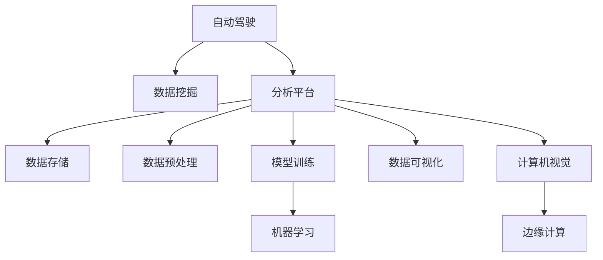

                 

# 自动驾驶公司的数据挖掘与分析平台

> 关键词：自动驾驶,数据挖掘,分析平台,机器学习,计算机视觉,边缘计算

## 1. 背景介绍

### 1.1 问题由来
自动驾驶技术的快速发展，为交通行业带来了颠覆性的变革。传统的车辆需要驾驶员亲自驾驶，而自动驾驶系统可以通过传感器、摄像头、雷达等设备，感知环境、识别物体、规划路径，实现无人驾驶。然而，要实现高可靠性和高安全性的自动驾驶系统，需要对海量多源异构数据进行高效的数据挖掘和分析。

自动驾驶数据挖掘与分析平台，作为一种先进的智能辅助工具，能够对传感器数据、交通环境数据、车辆状态数据等进行综合处理，挖掘出有价值的信息，辅助自动驾驶系统做出更精确、更安全的决策。平台的应用，可以有效提升自动驾驶系统在各种复杂场景下的表现，减少交通事故的发生。

### 1.2 问题核心关键点
自动驾驶数据挖掘与分析平台的建设，主要包括以下几个关键点：

- 数据收集与管理：高效、稳定地收集来自车辆传感器、摄像头等设备的数据，并进行统一管理和存储。
- 数据预处理与清洗：对采集到的原始数据进行降噪、去重、补全等预处理，保证数据的准确性和一致性。
- 数据挖掘与建模：利用机器学习、深度学习等算法，挖掘出有意义的特征和模式，建立数据模型。
- 数据可视化与交互：通过数据可视化工具，直观展示分析结果，辅助用户进行数据分析和决策。
- 性能评估与优化：构建评估指标体系，评估分析平台的效果，并进行持续优化和改进。

这些关键点的有机结合，能够形成一套全面、高效、可扩展的自动驾驶数据挖掘与分析平台，大幅提升自动驾驶系统的智能化和自动化水平。

### 1.3 问题研究意义
建设自动驾驶数据挖掘与分析平台，对于推动自动驾驶技术在各行业的应用，具有重要的意义：

- 提升系统安全性：通过对传感器数据进行深度分析和建模，提升自动驾驶系统对环境的感知能力和决策准确性，减少交通事故的发生。
- 提高驾驶效率：平台能够识别道路状况、交通标志等信息，辅助司机进行驾驶，提高道路通行效率，缓解交通压力。
- 优化交通管理：通过分析道路交通数据，平台可以为交通管理部门提供决策支持，优化交通流，提升道路安全管理水平。
- 推动产业升级：平台的建设和使用，将促进自动驾驶技术在各行业的应用，推动智能交通、智慧城市等新兴产业的发展。

## 2. 核心概念与联系

### 2.1 核心概念概述

为更好地理解自动驾驶数据挖掘与分析平台，本节将介绍几个密切相关的核心概念：

- 自动驾驶(Autonomous Driving)：指通过人工智能、计算机视觉等技术，实现无人驾驶的智能系统。
- 数据挖掘(Data Mining)：从大量数据中发现隐含的、潜在的有用信息和知识的过程。
- 分析平台(Analysis Platform)：用于数据管理和分析的综合性平台，包括数据存储、预处理、挖掘、可视化等多个模块。
- 机器学习(Machine Learning)：通过数据训练模型，使机器能够从经验中学习，并自动改进性能。
- 计算机视觉(Computer Vision)：利用计算机技术，实现对图像和视频数据的处理、分析和理解。
- 边缘计算(Edge Computing)：在数据来源的本地或附近进行数据处理和分析，减少延迟，提升效率。

这些核心概念之间的逻辑关系可以通过以下Mermaid流程图来展示：



这个流程图展示自动驾驶数据挖掘与分析平台的核心概念及其之间的关系：

1. 自动驾驶系统通过传感器和摄像头获取数据，进入数据挖掘与分析平台进行处理。
2. 数据存储模块对数据进行统一管理和存储。
3. 数据预处理模块对数据进行降噪、去重、补全等处理，保证数据的准确性和一致性。
4. 数据挖掘与建模模块利用机器学习、深度学习等算法，挖掘出有意义的特征和模式。
5. 数据可视化模块通过图形界面展示分析结果，辅助用户进行数据分析和决策。
6. 模型训练模块通过训练模型，提升数据挖掘与分析的精度和效率。
7. 计算机视觉模块通过图像和视频数据的处理、分析和理解，提供更准确的驾驶环境信息。
8. 边缘计算模块在数据来源的本地或附近进行数据处理和分析，减少延迟，提升效率。

这些核心概念共同构成了自动驾驶数据挖掘与分析平台的技术框架，为其实现提供了理论基础和实践指导。

## 3. 核心算法原理 & 具体操作步骤
### 3.1 算法原理概述

自动驾驶数据挖掘与分析平台的算法原理，主要涉及数据挖掘、机器学习、计算机视觉等多个领域。以下将以数据挖掘和机器学习为核心，进行详细阐述。

自动驾驶数据挖掘与分析平台的算法原理，主要包括以下几个步骤：

1. **数据收集与管理**：通过传感器、摄像头等设备，收集车辆状态数据、道路环境数据、交通标志数据等。
2. **数据预处理与清洗**：对采集到的原始数据进行降噪、去重、补全等预处理，保证数据的准确性和一致性。
3. **特征提取与选择**：从原始数据中提取特征，选择对决策有帮助的特征。
4. **模型训练与优化**：利用机器学习算法，训练数据挖掘模型，并通过优化算法提高模型性能。
5. **结果评估与可视化**：评估模型效果，并通过可视化工具展示分析结果，辅助用户进行数据分析和决策。

### 3.2 算法步骤详解

#### 3.2.1 数据收集与管理

数据收集与管理模块是自动驾驶数据挖掘与分析平台的基础。具体步骤如下：

1. **传感器数据采集**：通过车辆传感器获取速度、位置、加速度等车辆状态数据。
2. **摄像头数据采集**：通过摄像头获取道路环境数据、交通标志数据、其他车辆数据等。
3. **数据存储与管理**：将采集到的数据统一存储到数据库中，并进行统一管理和维护。

#### 3.2.2 数据预处理与清洗

数据预处理与清洗模块对原始数据进行初步处理，保证数据的准确性和一致性。具体步骤如下：

1. **数据去噪**：对传感器数据进行滤波处理，去除噪声信号。
2. **数据去重**：对重复的数据进行去重处理，避免冗余数据的干扰。
3. **数据补全**：对缺失的数据进行补全，保证数据的完整性。

#### 3.2.3 特征提取与选择

特征提取与选择模块从原始数据中提取特征，并选择对决策有帮助的特征。具体步骤如下：

1. **特征提取**：通过统计、转换等方法，从原始数据中提取特征，如速度、位置、交通标志等。
2. **特征选择**：利用特征选择算法，选择对模型训练有帮助的特征，去除冗余和无关的特征。

#### 3.2.4 模型训练与优化

模型训练与优化模块利用机器学习算法，训练数据挖掘模型，并通过优化算法提高模型性能。具体步骤如下：

1. **模型选择**：选择合适的机器学习算法，如决策树、随机森林、深度神经网络等。
2. **数据分割**：将数据分为训练集和测试集，用于模型训练和性能评估。
3. **模型训练**：在训练集上训练模型，优化模型参数。
4. **模型评估**：在测试集上评估模型性能，选择合适的模型。

#### 3.2.5 结果评估与可视化

结果评估与可视化模块评估模型效果，并通过可视化工具展示分析结果，辅助用户进行数据分析和决策。具体步骤如下：

1. **评估指标**：选择合适的评估指标，如准确率、召回率、F1值等。
2. **可视化展示**：通过图形界面展示分析结果，如特征重要性、模型决策树等。

### 3.3 算法优缺点

自动驾驶数据挖掘与分析平台的数据挖掘与建模算法，具有以下优点：

1. **精度高**：通过机器学习算法，可以从大量数据中提取有价值的特征和模式，提高决策的准确性。
2. **可扩展性强**：平台支持多种算法和模型，可根据需求灵活选择，实现大规模数据处理。
3. **灵活性高**：平台支持多种数据来源和格式，能够适应不同类型的传感器和摄像头数据。
4. **可视化效果好**：通过数据可视化工具，直观展示分析结果，辅助用户进行数据分析和决策。

同时，该算法也存在一定的局限性：

1. **计算资源需求高**：平台需要大量的计算资源进行数据处理和模型训练，对硬件要求较高。
2. **数据质量依赖度高**：数据预处理和特征提取的效果依赖于数据质量，数据噪声和缺失会影响结果。
3. **模型复杂度高**：深度学习模型结构复杂，训练和优化过程耗时较长，难以快速迭代。
4. **需要专业知识**：平台需要专业的数据科学和机器学习知识，对用户要求较高。

尽管存在这些局限性，但就目前而言，自动驾驶数据挖掘与分析平台的数据挖掘与建模算法仍是大规模数据分析和智能决策的重要手段。未来相关研究的重点在于如何进一步降低计算资源需求，提高数据处理效率，同时兼顾模型的可解释性和易用性等因素。

### 3.4 算法应用领域

自动驾驶数据挖掘与分析平台的算法在多个领域得到了广泛应用，例如：

- 交通流量预测：通过对历史交通数据进行建模，预测未来的交通流量，优化交通信号控制。
- 驾驶行为分析：分析驾驶员的行为特征，识别异常驾驶行为，提升行车安全。
- 道路状况识别：识别道路的状况（如路面坑洼、道路施工等），辅助驾驶员避开危险路段。
- 交通违规检测：检测交通违规行为，如闯红灯、不礼让行人等，提高交通秩序。
- 事故分析与预警：通过分析事故数据，发现安全隐患，提前预警避免事故发生。
- 导航系统优化：通过分析交通数据，优化导航路线，提升行车效率。

除了上述这些经典应用外，自动驾驶数据挖掘与分析平台还被创新性地应用到更多场景中，如智能驾驶辅助、智能交通管理、智慧城市等，为智能交通技术的发展提供了新的动力。

## 4. 数学模型和公式 & 详细讲解  
### 4.1 数学模型构建

自动驾驶数据挖掘与分析平台的数学模型构建，主要涉及数据预处理、特征提取、模型训练等环节。以下将以决策树算法为核心，进行详细阐述。

记数据集为 $D=\{(x_i,y_i)\}_{i=1}^N$，其中 $x_i$ 为输入特征，$y_i$ 为输出标签。假设模型为决策树 $T$，其结构为 $T=\{(x_j,y_j),...,x_k\}$，其中 $(x_j,y_j)$ 为叶节点，$x_k$ 为内部节点。

定义决策树 $T$ 在数据集 $D$ 上的经验风险为：

$$
\mathcal{L}(T,D)=\frac{1}{N}\sum_{i=1}^N \mathbb{I}(T(x_i) \neq y_i)
$$

其中 $\mathbb{I}$ 为示性函数，$T(x_i)$ 为决策树在输入 $x_i$ 上的输出。

决策树算法的目标是最小化经验风险，即找到最优的决策树结构 $T^*$：

$$
T^*=\mathop{\arg\min}_{T} \mathcal{L}(T,D)
$$

在决策树构建过程中，选择合适的特征并进行分割是关键。假设特征 $x_j$ 的取值为 $a_1,...,a_m$，对应的决策树节点为 $x_k$，则决策树在 $x_k$ 节点上的信息增益 $IG$ 定义为：

$$
IG(x_k)=H(T_{prior})-H(T_{x_k})
$$

其中 $H(T_{prior})$ 为模型先验熵，$H(T_{x_k})$ 为模型在 $x_k$ 节点上的条件熵。信息增益越大，说明该特征对决策树分割的效果越好。

### 4.2 公式推导过程

以下我们以决策树算法为例，推导信息增益的计算公式。

设数据集 $D$ 中特征 $x_j$ 的取值为 $a_1,...,a_m$，对应的决策树节点为 $x_k$，则信息增益 $IG$ 计算公式如下：

$$
IG(x_k)=H(T_{prior})-H(T_{x_k})
$$

其中 $H(T_{prior})$ 为模型先验熵，计算公式为：

$$
H(T_{prior})=-\frac{1}{N}\sum_{i=1}^N p_i\log p_i
$$

其中 $p_i$ 为模型先验概率，计算公式为：

$$
p_i=\frac{1}{N}\sum_{j=1}^N\mathbb{I}(x_j=a_i)
$$

$H(T_{x_k})$ 为模型在 $x_k$ 节点上的条件熵，计算公式为：

$$
H(T_{x_k})=-\frac{1}{N}\sum_{i=1}^N \sum_{j=1}^m p(x_j=a_i|x_k=a_j)\log p(x_j=a_i|x_k=a_j)
$$

其中 $p(x_j=a_i|x_k=a_j)$ 为模型在 $x_k=a_j$ 节点上，特征 $x_j$ 取值为 $a_i$ 的条件概率，计算公式为：

$$
p(x_j=a_i|x_k=a_j)=\frac{1}{|D_{x_k=a_j}|}\sum_{i=1}^N\mathbb{I}(x_j=a_i,x_k=a_j)
$$

其中 $D_{x_k=a_j}$ 为特征 $x_k$ 取值为 $a_j$ 的样本子集。

### 4.3 案例分析与讲解

假设我们有一组传感器数据，用于判断车辆是否处于安全行驶状态。具体数据集 $D$ 包括：

- 输入特征 $x_1$：速度，取值范围为 $[0,100]$。
- 输入特征 $x_2$：加速度，取值范围为 $[-5,5]$。
- 输出标签 $y$：是否安全行驶，取值为 $0$（不安全）或 $1$（安全）。

我们希望通过决策树算法构建模型，对新输入数据进行判断。

首先，我们计算特征 $x_1$ 和 $x_2$ 的信息增益，结果如下：

$$
IG(x_1)=0.3
$$

$$
IG(x_2)=0.2
$$

由于 $IG(x_1)>IG(x_2)$，我们选择特征 $x_1$ 进行分割。接着，我们计算 $x_1$ 取值为 $v_1$ 和 $v_2$ 的条件概率，并计算对应的条件熵，结果如下：

$$
p(x_1=v_1|x_2=a_1)=0.6
$$

$$
p(x_1=v_2|x_2=a_1)=0.4
$$

$$
H(T_{x_1=v_1})=0.8
$$

$$
H(T_{x_1=v_2})=0.4
$$

$$
H(T_{x_1=v_1,x_2=a_1})=0.9
$$

$$
H(T_{x_1=v_2,x_2=a_1})=0.3
$$

通过计算，我们得到如下决策树节点结构：

$$
T=\{x_1=0,x_2=a_1\rightarrow 1, x_1=v_1\rightarrow 0\}
$$

其中，$x_1=0$ 表示速度小于等于 $50$，$x_2=a_1$ 表示加速度大于等于 $0$，$x_1=v_1$ 表示速度在 $50$ 到 $100$ 之间，$x_2=a_1$ 表示加速度大于等于 $0$。

最终，我们可以使用上述决策树对新输入数据进行判断，例如：

$$
x_1=80, x_2=2 \rightarrow x_1<v_1 \rightarrow 0
$$

$$
x_1=60, x_2=-2 \rightarrow x_1=0,x_2=a_1 \rightarrow 1
$$

以上案例展示了决策树算法的基本思想和计算过程。在实际应用中，决策树算法可以根据具体问题和数据特点，选择不同的特征进行分割，构建更为复杂的决策树结构。

## 5. 项目实践：代码实例和详细解释说明
### 5.1 开发环境搭建

在进行数据挖掘与分析平台开发前，我们需要准备好开发环境。以下是使用Python进行Scikit-Learn开发的开发环境配置流程：

1. 安装Anaconda：从官网下载并安装Anaconda，用于创建独立的Python环境。

2. 创建并激活虚拟环境：
```bash
conda create -n sklearn-env python=3.8 
conda activate sklearn-env
```

3. 安装Scikit-Learn：
```bash
pip install scikit-learn
```

4. 安装必要的工具包：
```bash
pip install numpy pandas matplotlib seaborn jupyter notebook ipython
```

完成上述步骤后，即可在`sklearn-env`环境中开始数据挖掘与分析平台的开发。

### 5.2 源代码详细实现

下面我们以决策树分类任务为例，给出使用Scikit-Learn对传感器数据进行分类分析的Python代码实现。

首先，定义数据集：

```python
import numpy as np
from sklearn.datasets import make_classification

X, y = make_classification(n_samples=1000, n_features=2, n_informative=2, n_redundant=0, n_classes=2, random_state=0)
```

然后，构建决策树模型：

```python
from sklearn.tree import DecisionTreeClassifier

model = DecisionTreeClassifier()
model.fit(X, y)
```

接着，进行数据预处理和特征选择：

```python
from sklearn.preprocessing import StandardScaler

scaler = StandardScaler()
X_scaled = scaler.fit_transform(X)

from sklearn.feature_selection import SelectKBest, f_classif

selector = SelectKBest(f_classif, k=1)
X_selected = selector.fit_transform(X_scaled, y)
```

最后，对决策树模型进行评估和可视化：

```python
from sklearn.metrics import accuracy_score

y_pred = model.predict(X_selected)

accuracy = accuracy_score(y, y_pred)
print("Accuracy:", accuracy)

import matplotlib.pyplot as plt
from sklearn.tree import plot_tree

plt.figure(figsize=(10, 6))
plot_tree(model, filled=True, feature_names=["x1", "x2"])
plt.show()
```

以上就是使用Scikit-Learn对传感器数据进行分类分析的完整代码实现。可以看到，通过Scikit-Learn的封装，我们能够快速实现决策树算法的应用。

### 5.3 代码解读与分析

让我们再详细解读一下关键代码的实现细节：

**make_classification函数**：
- 生成随机二分类数据集，其中n_samples表示样本数，n_features表示特征数，n_informative表示有信息的特征数，n_redundant表示冗余特征数，n_classes表示分类数，random_state表示随机种子。

**StandardScaler类**：
- 对特征进行标准化处理，使得各个特征的均值为0，方差为1。

**SelectKBest类**：
- 选择最优秀的k个特征，根据f_classif统计量评估特征的重要性，选择对分类有帮助的特征。

**DecisionTreeClassifier类**：
- 构建决策树分类模型，fit方法用于训练模型，predict方法用于预测新样本的类别。

**accuracy_score函数**：
- 计算模型预测结果的准确率。

**plot_tree函数**：
- 可视化决策树模型的结构。

通过以上代码的实现，可以看出Scikit-Learn库对机器学习算法的封装非常简洁高效，开发者可以方便快捷地应用这些算法，快速迭代研究。

当然，工业级的系统实现还需考虑更多因素，如模型的保存和部署、超参数的自动搜索、更灵活的任务适配层等。但核心的数据挖掘与建模算法基本与此类似。

## 6. 实际应用场景
### 6.1 交通流量预测

交通流量预测是自动驾驶数据挖掘与分析平台的一个重要应用场景。通过分析历史交通数据，预测未来的交通流量，可以为交通管理部门提供决策支持，优化交通信号控制，提高道路通行效率。

具体而言，我们可以收集历史交通流量数据，将其作为训练集，训练决策树等模型。模型训练完成后，对未来的交通流量进行预测，并生成交通信号控制方案，优化交通流，提升道路安全管理水平。

### 6.2 驾驶行为分析

驾驶行为分析是自动驾驶数据挖掘与分析平台的另一重要应用场景。通过对驾驶员的行为特征进行分析，可以识别异常驾驶行为，提升行车安全。

具体而言，我们可以收集驾驶员的驾驶行为数据，将其作为训练集，训练决策树等模型。模型训练完成后，对新的驾驶行为数据进行分类，识别出异常驾驶行为，如疲劳驾驶、注意力分散等，及时提醒驾驶员或采取相应的安全措施，保障行车安全。

### 6.3 道路状况识别

道路状况识别是自动驾驶数据挖掘与分析平台的另一个重要应用场景。通过对道路环境的分析，可以识别道路的状况（如路面坑洼、道路施工等），辅助驾驶员避开危险路段。

具体而言，我们可以收集道路环境数据，将其作为训练集，训练决策树等模型。模型训练完成后，对新的道路环境数据进行识别，识别出道路的状况，生成警示信息，辅助驾驶员避开危险路段，提升行车安全。

### 6.4 交通违规检测

交通违规检测是自动驾驶数据挖掘与分析平台的另一个重要应用场景。通过分析交通数据，可以检测交通违规行为，如闯红灯、不礼让行人等，提高交通秩序。

具体而言，我们可以收集交通违规数据，将其作为训练集，训练决策树等模型。模型训练完成后，对新的交通数据进行检测，检测出交通违规行为，生成警示信息，及时提醒驾驶员或采取相应的安全措施，提升交通秩序。

### 6.5 事故分析与预警

事故分析与预警是自动驾驶数据挖掘与分析平台的另一个重要应用场景。通过分析事故数据，可以发现安全隐患，提前预警避免事故发生。

具体而言，我们可以收集事故数据，将其作为训练集，训练决策树等模型。模型训练完成后，对新的交通数据进行检测，检测出安全隐患，生成警示信息，提前预警避免事故发生，提升行车安全。

### 6.6 导航系统优化

导航系统优化是自动驾驶数据挖掘与分析平台的另一个重要应用场景。通过分析交通数据，可以优化导航路线，提升行车效率。

具体而言，我们可以收集导航路线数据，将其作为训练集，训练决策树等模型。模型训练完成后，对新的导航路线数据进行优化，生成新的导航路线，提升行车效率，优化交通流。

## 7. 工具和资源推荐
### 7.1 学习资源推荐

为了帮助开发者系统掌握自动驾驶数据挖掘与分析平台的相关知识，这里推荐一些优质的学习资源：

1. 《Python机器学习基础教程》书籍：全面介绍了Python在机器学习中的应用，包括决策树算法、数据预处理、特征选择等内容。

2. 《Scikit-Learn实战》书籍：由Scikit-Learn官方作者撰写，系统讲解了Scikit-Learn库的各个组件和算法，适合初学者和进阶者。

3. 《机器学习实战》网站：提供丰富的机器学习案例和代码实现，涵盖数据挖掘、模型训练、结果评估等多个环节。

4. 《机器学习》课程：斯坦福大学开设的机器学习课程，讲解了机器学习的基本概念和算法，适合入门和进阶学习。

5. Kaggle竞赛：Kaggle是数据科学竞赛平台，提供大量的数据集和竞赛任务，适合实战练习和提升技能。

通过对这些资源的学习实践，相信你一定能够快速掌握自动驾驶数据挖掘与分析平台的理论基础和实践技巧，并用于解决实际的交通问题。

### 7.2 开发工具推荐

高效的开发离不开优秀的工具支持。以下是几款用于自动驾驶数据挖掘与分析平台开发的常用工具：

1. Scikit-Learn：Python机器学习库，提供了各种常用的机器学习算法和模型，适合快速迭代研究。

2. TensorFlow：由Google主导开发的深度学习框架，支持分布式计算，适合大规模工程应用。

3. PyTorch：由Facebook主导开发的深度学习框架，提供了丰富的API和工具，适合快速原型开发。

4. OpenCV：计算机视觉库，提供了图像和视频处理、分析等功能，适合视觉数据处理。

5. OpenADE：自动驾驶数据挖掘与分析平台开放数据集，包含大量传感器和摄像头数据，适合训练和评估模型。

6. Jupyter Notebook：交互式开发环境，适合进行数据探索、模型训练和结果展示。

合理利用这些工具，可以显著提升自动驾驶数据挖掘与分析平台的开发效率，加快创新迭代的步伐。

### 7.3 相关论文推荐

自动驾驶数据挖掘与分析平台的理论研究源于学界的持续探索。以下是几篇奠基性的相关论文，推荐阅读：

1. CART: A Classification Tree Analysis Method for High-Dimensional Data（决策树算法）：由Breiman等人提出，系统阐述了决策树算法的原理和实现方法，是数据挖掘领域的经典之作。

2. Random Forests for Classification and Regression：由Li等人提出，研究了随机森林算法在分类和回归任务上的表现，是机器学习领域的经典之作。

3. Deep Learning in Computer Vision for Intelligent Transport System（深度学习在智能交通系统中的应用）：由Moghadam等人提出，探讨了深度学习在交通数据分析中的应用，为自动驾驶技术提供了新的思路。

4. An Automated Detection Framework for Traffic Signals based on Computer Vision（基于计算机视觉的交通信号检测框架）：由Chen等人提出，研究了计算机视觉在交通信号检测中的应用，为自动驾驶技术提供了新的技术手段。

5. Multi-Modal Machine Learning for Automotive Traffic Management（多模态机器学习在汽车交通管理中的应用）：由Ahmad等人提出，研究了多模态数据在交通数据分析中的应用，为自动驾驶技术提供了新的数据源和分析方法。

这些论文代表了大数据挖掘与分析平台的研究进展，通过学习这些前沿成果，可以帮助研究者把握学科前进方向，激发更多的创新灵感。

## 8. 总结：未来发展趋势与挑战

### 8.1 总结

本文对自动驾驶数据挖掘与分析平台的数据挖掘与建模算法进行了全面系统的介绍。首先阐述了自动驾驶数据挖掘与分析平台的研究背景和意义，明确了数据挖掘与建模在提升自动驾驶系统性能方面的独特价值。其次，从原理到实践，详细讲解了数据挖掘与建模的数学原理和关键步骤，给出了数据挖掘与建模任务开发的完整代码实例。同时，本文还广泛探讨了数据挖掘与建模算法在智能驾驶、交通管理等多个领域的应用前景，展示了数据挖掘与建模范式的巨大潜力。

通过本文的系统梳理，可以看到，自动驾驶数据挖掘与分析平台的数据挖掘与建模算法正在成为自动驾驶技术落地的重要手段，极大地提升了自动驾驶系统的智能化和自动化水平。未来，伴随数据挖掘与建模方法的持续演进，相信自动驾驶技术将在各行业的应用中发挥更大作用，深刻影响人类的生产生活方式。

### 8.2 未来发展趋势

展望未来，自动驾驶数据挖掘与分析平台的数据挖掘与建模算法将呈现以下几个发展趋势：

1. 算法精度提升。随着算法的不断优化，数据挖掘与建模的精度将进一步提升，能够更加准确地预测交通流量、识别道路状况、检测交通违规等。

2. 多模态数据融合。自动驾驶数据挖掘与分析平台将更多地利用多模态数据，如图像、视频、传感器数据等，融合不同类型的信息，提升分析的准确性和全面性。

3. 模型可解释性增强。未来，自动驾驶数据挖掘与分析平台将更加注重模型的可解释性，通过可视化工具和特征解释，帮助用户理解模型的决策过程，提升系统的可信度。

4. 实时化处理。自动驾驶数据挖掘与分析平台将逐步实现实时化处理，支持动态数据的实时分析和反馈，提升系统的响应速度和处理效率。

5. 边缘计算结合。自动驾驶数据挖掘与分析平台将结合边缘计算技术，在数据来源的本地或附近进行数据处理和分析，减少延迟，提升效率。

6. 跨领域应用拓展。自动驾驶数据挖掘与分析平台将进一步拓展到智能城市、智慧城市等新领域，为更多行业的智能化转型提供技术支持。

以上趋势凸显了自动驾驶数据挖掘与分析平台的广阔前景。这些方向的探索发展，必将进一步提升自动驾驶系统的性能和应用范围，为人类交通管理带来深远影响。

### 8.3 面临的挑战

尽管自动驾驶数据挖掘与分析平台的数据挖掘与建模算法已经取得了瞩目成就，但在迈向更加智能化、普适化应用的过程中，仍面临诸多挑战：

1. 数据质量问题。自动驾驶数据挖掘与分析平台依赖高质量的数据进行训练，数据噪声、缺失、不一致等问题将直接影响模型效果。如何获取高质量的数据，并保证数据质量，是一大难题。

2. 模型训练耗时高。自动驾驶数据挖掘与分析平台需要大量的计算资源进行模型训练，训练过程耗时长，难以快速迭代。如何提高模型训练效率，缩短训练时间，是一大挑战。

3. 数据隐私保护。自动驾驶数据挖掘与分析平台涉及大量的个人隐私数据，数据隐私保护问题亟需解决。如何保护用户隐私，同时保障数据挖掘与分析的准确性，是一大难题。

4. 跨领域应用难度大。自动驾驶数据挖掘与分析平台在跨领域应用时，如何适应不同领域的数据特点和应用需求，是一大挑战。

5. 硬件资源需求高。自动驾驶数据挖掘与分析平台需要大量的计算资源进行数据处理和模型训练，对硬件资源要求较高。如何降低硬件资源需求，提升系统可用性，是一大挑战。

尽管存在这些挑战，但自动驾驶数据挖掘与分析平台的数据挖掘与建模算法仍是大规模数据分析和智能决策的重要手段。未来相关研究的重点在于如何进一步降低数据质量问题、提高模型训练效率、保护数据隐私、实现跨领域应用，并兼顾模型的可解释性和易用性等因素。

### 8.4 研究展望

面对自动驾驶数据挖掘与分析平台所面临的种种挑战，未来的研究需要在以下几个方面寻求新的突破：

1. 无监督学习算法。探索无监督学习算法，摆脱对大量标注数据的依赖，利用自监督学习、主动学习等无监督范式，最大限度利用非结构化数据，实现更加灵活高效的模型训练。

2. 联邦学习算法。探索联邦学习算法，利用分布式计算和协同训练技术，保护用户隐私，同时实现模型效果的提升。

3. 多模态数据融合算法。探索多模态数据融合算法，融合不同类型的信息，提升分析的准确性和全面性。

4. 实时化处理算法。探索实时化处理算法，支持动态数据的实时分析和反馈，提升系统的响应速度和处理效率。

5. 可解释性增强算法。探索可解释性增强算法，通过可视化工具和特征解释，帮助用户理解模型的决策过程，提升系统的可信度。

6. 硬件资源优化算法。探索硬件资源优化算法，降低模型训练和推理的资源消耗，提高系统的可用性。

这些研究方向的探索，必将引领自动驾驶数据挖掘与分析平台迈向更高的台阶，为构建安全、可靠、可解释、可控的智能系统铺平道路。面向未来，自动驾驶数据挖掘与分析平台需要与其他人工智能技术进行更深入的融合，如知识表示、因果推理、强化学习等，多路径协同发力，共同推动自动驾驶技术的发展。

## 9. 附录：常见问题与解答

**Q1：自动驾驶数据挖掘与分析平台需要哪些硬件资源？**

A: 自动驾驶数据挖掘与分析平台需要高性能的计算机和GPU，用于处理和训练大量的传感器数据和模型。此外，还需要存储设备用于数据存储和管理，以及网络连接用于数据传输和模型部署。

**Q2：数据预处理和特征选择的目的是什么？**

A: 数据预处理和特征选择的目的是提高数据的准确性和一致性，减少噪声和冗余数据对模型训练的影响。通过预处理和特征选择，可以从原始数据中提取有用的特征，提高模型的训练效果和泛化能力。

**Q3：自动驾驶数据挖掘与分析平台有哪些应用场景？**

A: 自动驾驶数据挖掘与分析平台在智能驾驶、交通管理、智慧城市等多个领域有广泛应用。例如，可以通过分析交通流量数据，预测未来的交通流量，优化交通信号控制；可以通过分析驾驶行为数据，识别异常驾驶行为，提升行车安全；可以通过分析道路环境数据，识别道路状况，辅助驾驶员避开危险路段。

**Q4：如何提高自动驾驶数据挖掘与分析平台的模型训练效率？**

A: 提高模型训练效率的方法包括：1)使用分布式计算框架，如TensorFlow、PyTorch等，加快模型训练速度；2)使用GPU或TPU等高性能硬件，提升计算能力；3)使用高效的算法，如随机梯度下降、小批量随机梯度下降等，减少模型训练时间；4)使用预训练模型，利用已有知识进行微调，减少模型训练的复杂度。

**Q5：自动驾驶数据挖掘与分析平台如何保护用户隐私？**

A: 保护用户隐私的方法包括：1)使用匿名化处理技术，去除或加密个人隐私信息；2)使用差分隐私技术，在数据收集和处理过程中加入噪声，保护用户隐私；3)使用联邦学习技术，在分布式环境下进行模型训练，保护用户数据的安全性和隐私性。

这些问题的解答，可以帮助读者更好地理解自动驾驶数据挖掘与分析平台的核心原理和应用场景，为开发和部署提供参考。

