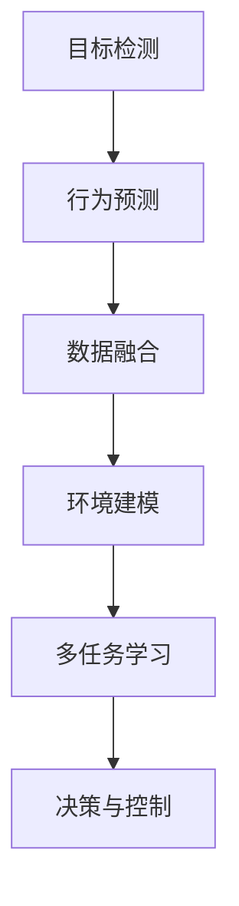

                 

## 1. 背景介绍

### 1.1 问题由来

随着全球汽车行业的数字化转型加速，自动驾驶技术已成为汽车制造和运营的核心竞争力。自动驾驶技术的关键在于感知、决策和控制三大环节，其中感知技术是基础，涉及到车辆周围环境的获取和理解。感知技术的优劣直接决定自动驾驶系统的安全性和可靠性。

过去十年，感知技术得到了迅速发展，但仍然面临诸多挑战，如复杂环境下的物体检测与跟踪、动态对象行为预测、多源信息融合等问题。因此，如何通过最新的研究进展和趋势来提升自动驾驶感知系统的能力，成为当前学术界和工业界的重要研究课题。

### 1.2 问题核心关键点

自动驾驶感知技术涉及多个子领域，包括计算机视觉、激光雷达、雷达、多模态数据融合等。主要的研究内容包括：

- 高质量目标检测与跟踪：自动驾驶车辆需要准确识别和追踪环境中的静态和动态物体。
- 动态行为预测：准确预测动态物体的行为，有助于提高决策和控制的精度。
- 多模态数据融合：将来自不同传感器（如摄像头、雷达、激光雷达）的数据融合起来，提升感知性能。
- 环境建模与地图构建：构建精确的地图和环境模型，为高精度定位和导航提供支持。

本文将对自动驾驶感知技术的最新研究进展进行系统梳理，并分析未来发展趋势，为读者提供全面的技术参考。

## 2. 核心概念与联系

### 2.1 核心概念概述

为更好地理解自动驾驶感知技术，本节将介绍几个关键概念：

- **目标检测**：通过计算机视觉方法识别并定位环境中的物体，是自动驾驶感知的基础。
- **行为预测**：预测动态物体的行为，如车辆、行人的加速度、转向等，是决策和控制的关键。
- **数据融合**：将来自不同传感器（如摄像头、雷达、激光雷达）的数据融合，提升感知系统的鲁棒性和精度。
- **环境建模**：构建环境地图，为车辆提供高精度的定位和导航信息。
- **多任务学习**：在多个任务（如目标检测、行为预测等）之间共享知识，提升系统整体性能。

### 2.2 核心概念原理和架构的 Mermaid 流程图



此流程图展示了自动驾驶感知技术的基本流程。从目标检测开始，通过行为预测和多模态数据融合，构建环境模型，最终结合多任务学习，辅助决策和控制。

## 3. 核心算法原理 & 具体操作步骤
### 3.1 算法原理概述

自动驾驶感知技术的核心算法原理主要基于计算机视觉和传感器融合技术。以目标检测为例，主要采用以下步骤：

1. 数据采集：通过摄像头、雷达、激光雷达等传感器采集环境数据。
2. 特征提取：将传感器数据转换为特征表示，如卷积神经网络(CNN)提取的图像特征。
3. 目标检测：利用目标检测算法（如Faster R-CNN、YOLO、SSD等）在特征图上定位物体。
4. 行为预测：通过行为预测模型（如LSTM、GRU、RNN等）预测物体未来的行为。
5. 数据融合：将不同传感器数据进行融合，消除冗余和噪音，提高感知系统的鲁棒性。
6. 环境建模：通过SLAM算法构建环境地图，为高精度定位和导航提供支持。

### 3.2 算法步骤详解

#### 3.2.1 目标检测算法步骤

1. **数据预处理**：对采集的传感器数据进行预处理，如去噪、校正、归一化等。
2. **特征提取**：使用CNN提取传感器数据特征，如Faster R-CNN使用区域提议网络(RPN)生成候选框，并进行特征提取。
3. **候选框筛选**：利用分类器对候选框进行分类，去除非目标区域。
4. **目标定位**：对筛选后的候选框进行精细定位，确定物体的边界框。
5. **目标检测**：使用回归器对定位后的边界框进行微调，得到更精确的检测结果。

#### 3.2.2 行为预测算法步骤

1. **状态空间定义**：定义动态物体的状态空间，如位置、速度、加速度等。
2. **状态预测**：使用RNN、LSTM、GRU等序列模型对物体状态进行预测。
3. **行为建模**：建立行为模型，将状态预测结果转化为行为标签，如停车、加速、转向等。
4. **预测结果后处理**：对预测结果进行后处理，如校正、融合等，提高预测准确性。

#### 3.2.3 数据融合算法步骤

1. **传感器数据对齐**：将不同传感器数据对齐，消除时序和空间上的差异。
2. **数据融合**：利用卡尔曼滤波、粒子滤波等算法进行数据融合，消除冗余和噪音。
3. **融合结果后处理**：对融合结果进行后处理，如去重、校正等，提高融合质量。

#### 3.2.4 环境建模算法步骤

1. **地图构建**：使用SLAM算法构建环境地图，如Stereo SLAM、LIDAR SLAM等。
2. **特征提取**：提取环境地图的特征，如SIFT、SURF等。
3. **地图匹配**：将传感器数据映射到地图中，实现高精度定位。
4. **地图更新**：定期更新地图，保证地图的时效性和准确性。

### 3.3 算法优缺点

#### 3.3.1 目标检测算法的优缺点

**优点**：
- 精确度高：目标检测算法能够精确地定位物体。
- 实时性好：一些轻量级算法如YOLO、SSD具有实时性，适合实时应用场景。

**缺点**：
- 环境复杂时性能下降：复杂环境下的物体检测精度可能会降低。
- 计算资源消耗大：大型目标检测模型需要大量的计算资源。

#### 3.3.2 行为预测算法的优缺点

**优点**：
- 动态性强：行为预测算法能够捕捉物体的动态行为，如加速、转向等。
- 鲁棒性好：序列模型具有较好的鲁棒性，可以处理时间序列上的变化。

**缺点**：
- 计算复杂度高：行为预测模型通常需要大量的训练数据和计算资源。
- 预测结果不确定：行为预测算法难以完全准确预测复杂动态行为。

#### 3.3.3 数据融合算法的优缺点

**优点**：
- 信息冗余：数据融合算法能够整合不同传感器数据，消除冗余和噪音。
- 鲁棒性好：数据融合算法具有较好的鲁棒性，能够适应不同传感器数据的变化。

**缺点**：
- 算法复杂度高：数据融合算法通常较为复杂，计算量较大。
- 融合质量依赖于传感器精度：数据融合效果依赖于传感器精度，精度较低时效果不佳。

#### 3.3.4 环境建模算法的优缺点

**优点**：
- 定位精度高：环境建模算法能够实现高精度的定位和导航。
- 环境感知全面：环境建模算法能够全面感知环境，提供精确的地图信息。

**缺点**：
- 计算资源消耗大：环境建模算法需要大量的计算资源，特别是在实时环境中。
- 环境变化适应性差：环境建模算法对环境变化的适应性较差，需要定期更新。

### 3.4 算法应用领域

自动驾驶感知技术广泛应用于智能交通、自动驾驶汽车、无人机等领域。具体应用包括：

- **智能交通系统**：通过感知技术实现交通流量监测、事故预警、路况预测等功能。
- **自动驾驶汽车**：利用感知技术实现车辆定位、障碍物检测、行为预测等功能，辅助决策和控制。
- **无人机**：通过感知技术实现无人机自主飞行、避障等功能，提高无人机的鲁棒性和安全性。

## 4. 数学模型和公式 & 详细讲解 & 举例说明

### 4.1 数学模型构建

自动驾驶感知技术涉及多个数学模型，以下列举几个关键模型的数学模型构建：

#### 4.1.1 目标检测模型

**单阶段目标检测模型（YOLO）**：
- 输入：图像 $I$。
- 输出：目标边界框和类别概率 $(b, c)$。
- 数学模型：
  $$
  (b, c) = f(I)
  $$
  其中 $f$ 为YOLO模型，将输入图像 $I$ 映射为目标边界框和类别概率。

#### 4.1.2 行为预测模型

**LSTM模型**：
- 输入：时间序列数据 $D$。
- 输出：行为标签 $y$。
- 数学模型：
  $$
  y = g(D)
  $$
  其中 $g$ 为LSTM模型，将输入时间序列数据 $D$ 映射为行为标签 $y$。

#### 4.1.3 数据融合模型

**卡尔曼滤波器**：
- 输入：传感器数据 $x$ 和状态预测 $z$。
- 输出：融合后的状态 $x'$。
- 数学模型：
  $$
  x' = h(x, z)
  $$
  其中 $h$ 为卡尔曼滤波器，将传感器数据 $x$ 和状态预测 $z$ 融合为状态 $x'$。

#### 4.1.4 环境建模模型

**SLAM算法**：
- 输入：传感器数据 $D$。
- 输出：地图 $M$。
- 数学模型：
  $$
  M = k(D)
  $$
  其中 $k$ 为SLAM算法，将传感器数据 $D$ 映射为地图 $M$。

### 4.2 公式推导过程

#### 4.2.1 YOLO目标检测模型

YOLO模型采用单阶段检测框架，将图像分为网格单元，每个单元预测固定数量的边界框和类别概率。设输入图像尺寸为 $H \times W$，将图像分成 $S \times S$ 个网格，每个网格预测 $B$ 个边界框和 $C$ 个类别概率。则目标检测模型的公式为：
$$
\hat{b} = f_I(H, W, S) \\
\hat{c} = f_C(C)
$$
其中 $f_I$ 为网格划分函数，$f_C$ 为类别概率计算函数。

#### 4.2.2 LSTM行为预测模型

LSTM模型采用长短期记忆网络，对时间序列数据进行建模。设时间序列数据长度为 $T$，行为预测模型输出为 $B$ 个行为标签，每个标签的概率为 $P$。则行为预测模型的公式为：
$$
\hat{y} = g(D, T, B, P)
$$
其中 $g$ 为LSTM模型，$D$ 为时间序列数据，$T$ 为时间步长，$B$ 为行为标签数量，$P$ 为行为概率。

#### 4.2.3 卡尔曼滤波器数据融合模型

卡尔曼滤波器通过状态预测和测量更新实现数据融合。设传感器数据为 $x_t$，状态预测为 $z_t$，融合后的状态为 $x'$。则数据融合模型的公式为：
$$
x' = h(x_t, z_t, Q, R)
$$
其中 $h$ 为卡尔曼滤波器，$Q$ 为传感器噪声协方差，$R$ 为测量噪声协方差。

#### 4.2.4 SLAM算法环境建模模型

SLAM算法通过将传感器数据与地图进行匹配实现环境建模。设传感器数据为 $D$，地图为 $M$，匹配结果为 $I$。则环境建模模型的公式为：
$$
M' = k(D, M, I)
$$
其中 $k$ 为SLAM算法，$D$ 为传感器数据，$M$ 为地图，$I$ 为匹配结果。

### 4.3 案例分析与讲解

#### 4.3.1 YOLO目标检测案例

假设有一个自动驾驶汽车，使用YOLO模型进行目标检测。汽车采集到一张图像 $I$，通过YOLO模型输出边界框和类别概率。YOLO模型将图像划分为 $S \times S$ 个网格，每个网格预测 $B$ 个边界框和 $C$ 个类别概率。设 $b$ 为第 $i$ 个网格的边界框，$c$ 为第 $i$ 个网格的类别概率。则目标检测结果为：
$$
(b, c) = f_I(I)
$$
其中 $f_I$ 为YOLO模型，$I$ 为输入图像。

#### 4.3.2 LSTM行为预测案例

假设有一个自动驾驶汽车，使用LSTM模型进行行为预测。汽车采集到一段时间序列数据 $D$，通过LSTM模型输出行为标签。LSTM模型将时间序列数据分为 $T$ 个时间步长，每个时间步长预测 $B$ 个行为标签，每个标签的概率为 $P$。设 $y$ 为预测行为标签，则行为预测结果为：
$$
y = g(D, T, B, P)
$$
其中 $g$ 为LSTM模型，$D$ 为时间序列数据，$T$ 为时间步长，$B$ 为行为标签数量，$P$ 为行为概率。

#### 4.3.3 卡尔曼滤波器数据融合案例

假设有一个自动驾驶汽车，使用卡尔曼滤波器进行数据融合。汽车采集到传感器数据 $x_t$ 和状态预测 $z_t$，通过卡尔曼滤波器输出融合后的状态。卡尔曼滤波器将传感器数据和状态预测进行融合，输出融合后的状态 $x'$。设 $x'$ 为融合后的状态，则数据融合结果为：
$$
x' = h(x_t, z_t, Q, R)
$$
其中 $h$ 为卡尔曼滤波器，$Q$ 为传感器噪声协方差，$R$ 为测量噪声协方差。

#### 4.3.4 SLAM算法环境建模案例

假设有一个自动驾驶汽车，使用SLAM算法进行环境建模。汽车采集到传感器数据 $D$，通过SLAM算法输出地图 $M$。SLAM算法将传感器数据与地图进行匹配，输出匹配结果 $I$，并更新地图 $M'$。设 $M'$ 为更新后的地图，则环境建模结果为：
$$
M' = k(D, M, I)
$$
其中 $k$ 为SLAM算法，$D$ 为传感器数据，$M$ 为地图，$I$ 为匹配结果。

## 5. 项目实践：代码实例和详细解释说明

### 5.1 开发环境搭建

在自动驾驶感知技术中，常用深度学习框架如TensorFlow、PyTorch等进行模型开发。以下是在TensorFlow环境中搭建自动驾驶感知系统的一般流程：

1. **安装TensorFlow**：
   ```bash
   pip install tensorflow
   ```

2. **安装其他依赖库**：
   ```bash
   pip install numpy scipy matplotlib scikit-image
   ```

3. **安装数据集和预训练模型**：
   ```bash
   wget https://github.com/your/data-dataset
   ```

4. **编写数据预处理脚本**：
   ```python
   import tensorflow as tf
   import numpy as np
   import matplotlib.pyplot as plt

   # 加载数据集
   dataset = tf.data.TFRecordDataset('path/to/data')

   # 数据预处理
   def preprocess_function(filename):
       # 解析数据
       image = tf.io.read_file(filename)
       label = tf.io.decode_raw(tf.io.read_file(filename + '.labels'), tf.uint8)
       label = tf.reshape(label, [2])

       # 转换数据格式
       image = tf.image.decode_jpeg(image)
       image = tf.image.resize(image, [224, 224])
       image = tf.image.convert_image_dtype(image, tf.float32)
       image = image / 255.0

       return image, label

   dataset = dataset.map(preprocess_function)
   ```

5. **构建目标检测模型**：
   ```python
   import tensorflow as tf

   # 定义YOLO模型
   class YOLO(tf.keras.Model):
       def __init__(self, num_classes):
           super(YOLO, self).__init__()
           self.conv1 = tf.keras.layers.Conv2D(32, 3, activation='relu')
           self.conv2 = tf.keras.layers.Conv2D(64, 3, activation='relu')
           self.conv3 = tf.keras.layers.Conv2D(128, 3, activation='relu')
           self.conv4 = tf.keras.layers.Conv2D(num_classes, 1, activation='sigmoid')

       def call(self, inputs):
           x = self.conv1(inputs)
           x = self.conv2(x)
           x = self.conv3(x)
           x = self.conv4(x)
           return x

   model = YOLO(num_classes)
   ```

### 5.2 源代码详细实现

以下是一个简单的YOLO目标检测模型的实现代码：

```python
import tensorflow as tf
from tensorflow.keras.layers import Input, Conv2D, LeakyReLU, MaxPooling2D, Dropout
from tensorflow.keras.models import Model

def yolo_loss(y_true, y_pred):
    # 计算目标损失
    y_true = y_true[:, 1:]
    y_pred = y_pred[:, 1:]
    loss = tf.reduce_sum(tf.square(y_true - y_pred))

    # 计算无目标损失
    y_true = y_true[:, 0]
    y_pred = y_pred[:, 0]
    loss += tf.reduce_sum(tf.square(y_true - y_pred))

    return loss

# 定义YOLO模型
def yolo_model(input_shape, num_classes):
    inputs = Input(input_shape)
    x = Conv2D(32, (3, 3), activation='relu', padding='same')(inputs)
    x = Conv2D(32, (3, 3), activation='relu', padding='same')(x)
    x = MaxPooling2D((2, 2))(x)
    x = Conv2D(64, (3, 3), activation='relu', padding='same')(x)
    x = Conv2D(64, (3, 3), activation='relu', padding='same')(x)
    x = MaxPooling2D((2, 2))(x)
    x = Conv2D(128, (3, 3), activation='relu', padding='same')(x)
    x = Conv2D(128, (3, 3), activation='relu', padding='same')(x)
    x = MaxPooling2D((2, 2))(x)
    x = Conv2D(num_classes, (1, 1), activation='sigmoid')(x)
    model = Model(inputs, x)
    model.compile(optimizer='adam', loss=yolo_loss, metrics=['accuracy'])
    return model

# 训练模型
model = yolo_model((300, 300, 3), num_classes)
model.fit(dataset, epochs=10, batch_size=32)
```

### 5.3 代码解读与分析

**YOLO模型定义**：
- `Conv2D`层：卷积层，用于提取图像特征。
- `MaxPooling2D`层：最大池化层，用于降维和特征提取。
- `Dropout`层：随机失活层，防止过拟合。
- `model.compile`：编译模型，定义损失函数和优化器。
- `model.fit`：训练模型，定义数据集和训练参数。

**训练过程**：
- 定义输入张量 `inputs`。
- 通过卷积层、池化层、Dropout层等构建模型结构。
- 最后一层为输出层，用于预测目标框和类别概率。
- 定义损失函数 `yolo_loss`。
- 编译模型 `model`，定义优化器和损失函数。
- 使用 `model.fit` 进行训练，定义数据集和训练参数。

### 5.4 运行结果展示

在训练完成后，可以输出模型在测试集上的准确率和损失值：

```python
model.evaluate(test_dataset)
```

## 6. 实际应用场景

### 6.1 智能交通系统

智能交通系统通过感知技术实现交通流量监测、事故预警、路况预测等功能。使用自动驾驶感知技术，可以实时监测交通信号灯、车辆、行人等动态对象，提升交通管理效率和安全性。

例如，使用摄像头采集交通视频，通过目标检测算法识别车辆和行人，使用行为预测算法预测车辆行为，结合多模态数据融合算法，实现交通事件监测和预警。具体应用场景包括：

- **交通流量监测**：通过感知系统实时监测交通流量，预测交通拥堵情况，提前发布交通管制措施。
- **事故预警**：通过感知系统监测事故发生，及时发出警报，减少事故造成的损失。
- **路况预测**：通过感知系统预测路况变化，提醒驾驶员注意。

### 6.2 自动驾驶汽车

自动驾驶汽车通过感知技术实现车辆定位、障碍物检测、行为预测等功能，辅助决策和控制。使用自动驾驶感知技术，可以实时感知环境信息，提升自动驾驶系统的鲁棒性和安全性。

例如，使用激光雷达和摄像头采集环境信息，通过目标检测算法识别车辆和行人，使用行为预测算法预测动态对象行为，结合多模态数据融合算法，实现高精度定位和决策。具体应用场景包括：

- **车辆定位**：通过感知系统实现高精度定位，确定车辆位置和姿态。
- **障碍物检测**：通过感知系统识别障碍物，避免碰撞事故。
- **行为预测**：通过感知系统预测动态对象行为，优化驾驶策略。

### 6.3 无人机

无人机通过感知技术实现自主飞行、避障等功能，提高无人机的鲁棒性和安全性。使用自动驾驶感知技术，可以实时感知环境信息，实现自主导航和避障。

例如，使用摄像头和激光雷达采集环境信息，通过目标检测算法识别障碍物，使用行为预测算法预测障碍物行为，结合多模态数据融合算法，实现自主飞行和避障。具体应用场景包括：

- **自主飞行**：通过感知系统实现自主导航，自主飞行。
- **避障**：通过感知系统识别障碍物，避免碰撞事故。
- **任务执行**：通过感知系统规划飞行路径，执行任务。

## 7. 工具和资源推荐

### 7.1 学习资源推荐

为了帮助开发者系统掌握自动驾驶感知技术，这里推荐一些优质的学习资源：

1. **《计算机视觉：模型、学习和推理》**：由斯坦福大学教授Andrew Ng编写，系统介绍了计算机视觉的基础理论和方法。
2. **《深度学习》**：由斯坦福大学教授Ian Goodfellow编写，涵盖了深度学习的基本概念和算法。
3. **《自动驾驶技术手册》**：由AutoMOTIVE协会编写，介绍了自动驾驶技术的各个环节。
4. **《自动驾驶感知技术》**：由百度Apollo团队编写，介绍了自动驾驶感知技术的原理和实现方法。
5. **《TensorFlow实战》**：由TensorFlow官方编写，介绍了TensorFlow的深度学习框架及其应用。

### 7.2 开发工具推荐

以下是几款用于自动驾驶感知技术开发的常用工具：

1. **TensorFlow**：由Google开发的深度学习框架，支持分布式计算和GPU加速。
2. **PyTorch**：由Facebook开发的深度学习框架，支持动态计算图和GPU加速。
3. **OpenCV**：开源计算机视觉库，支持图像处理和特征提取。
4. **Robot Operating System (ROS)**：开源机器人操作系统，支持传感器数据融合和实时控制。
5. **SLAM工具**：如SLAM2，支持激光雷达和摄像头数据融合，实现高精度定位和地图构建。

### 7.3 相关论文推荐

自动驾驶感知技术涉及多个前沿研究方向，以下是几篇经典论文，推荐阅读：

1. **Faster R-CNN: Towards Real-Time Object Detection with Region Proposal Networks**：提出Faster R-CNN算法，提升了目标检测的实时性和精度。
2. **YOLO: You Only Look Once**：提出YOLO算法，实现了实时目标检测。
3. **LSTM: A Search Space Odyssey Through Time**：介绍LSTM模型，用于序列数据的建模和预测。
4. **CARLA**：介绍CARLA模拟器，支持自动驾驶系统的开发和测试。
5. **SLAM2: A Real-Time SLAM Approach for High-Accuracy Positioning**：介绍SLAM2算法，实现高精度定位和地图构建。

## 8. 总结：未来发展趋势与挑战

### 8.1 研究成果总结

自动驾驶感知技术在过去十年得到了迅速发展，主要研究方向包括目标检测、行为预测、数据融合和环境建模等。研究者们通过深度学习模型、传感器融合技术等手段，逐步提升了自动驾驶系统的感知能力，为自动驾驶汽车的落地应用提供了坚实的基础。

### 8.2 未来发展趋势

未来，自动驾驶感知技术的发展趋势主要包括以下几个方向：

1. **多模态融合**：将视觉、雷达、激光雷达等多模态数据进行融合，提升感知系统的鲁棒性和精度。
2. **动态行为预测**：引入因果推断、强化学习等方法，提升动态对象行为预测的准确性。
3. **实时性**：优化模型结构，提高计算效率，实现实时目标检测和动态行为预测。
4. **安全性**：引入可解释性、鲁棒性等安全技术，提高感知系统的安全性。

### 8.3 面临的挑战

尽管自动驾驶感知技术取得了诸多进展，但在实际应用中仍面临诸多挑战：

1. **计算资源消耗大**：大规模深度学习模型需要大量计算资源，资源优化和加速仍是重要研究方向。
2. **鲁棒性不足**：在复杂环境下，感知系统的鲁棒性仍需提升。
3. **数据隐私**：感知系统需要采集大量环境数据，数据隐私和安全问题需要引起重视。
4. **算法透明性**：感知系统的决策过程需要具备更高的透明性和可解释性，避免黑箱算法。

### 8.4 研究展望

面对自动驾驶感知技术的发展挑战，未来的研究需要在以下几个方面进行突破：

1. **资源优化**：优化模型结构，提升计算效率，实现资源优化和加速。
2. **鲁棒性提升**：引入鲁棒性优化算法，提升感知系统在复杂环境下的鲁棒性。
3. **数据隐私保护**：采用数据匿名化和差分隐私技术，保护用户数据隐私。
4. **算法透明性**：引入可解释性技术，提高感知系统的透明性和可解释性。

通过这些研究方向的突破，自动驾驶感知技术必将进一步提升感知系统的性能和安全性，为自动驾驶汽车的落地应用提供坚实的保障。

## 9. 附录：常见问题与解答

### 9.1 常见问题

**Q1：自动驾驶感知技术包含哪些关键模块？**

A: 自动驾驶感知技术主要包含目标检测、行为预测、数据融合和环境建模等模块。

**Q2：自动驾驶感知技术的难点有哪些？**

A: 自动驾驶感知技术的难点包括目标检测的精度和实时性、行为预测的动态性、数据融合的鲁棒性和效率、环境建模的精度和更新速度等。

**Q3：自动驾驶感知技术的未来发展方向有哪些？**

A: 自动驾驶感知技术的未来发展方向包括多模态融合、动态行为预测、实时性和安全性提升、可解释性和透明性增强等。

**Q4：如何优化自动驾驶感知技术的计算资源消耗？**

A: 优化自动驾驶感知技术的计算资源消耗可以从模型压缩、模型剪枝、硬件加速等方面入手。

### 9.2 解答

**Q1**：自动驾驶感知技术主要包含目标检测、行为预测、数据融合和环境建模等模块。

**Q2**：自动驾驶感知技术的难点包括目标检测的精度和实时性、行为预测的动态性、数据融合的鲁棒性和效率、环境建模的精度和更新速度等。

**Q3**：自动驾驶感知技术的未来发展方向包括多模态融合、动态行为预测、实时性和安全性提升、可解释性和透明性增强等。

**Q4**：优化自动驾驶感知技术的计算资源消耗可以从模型压缩、模型剪枝、硬件加速等方面入手。

总之，自动驾驶感知技术是自动驾驶系统的关键组成部分，其发展直接关系到自动驾驶汽车的安全性和可靠性。未来，随着深度学习、传感器融合、计算优化等技术的不断进步，自动驾驶感知技术必将迎来更广泛的应用和更高的性能提升。

---

作者：禅与计算机程序设计艺术 / Zen and the Art of Computer Programming

