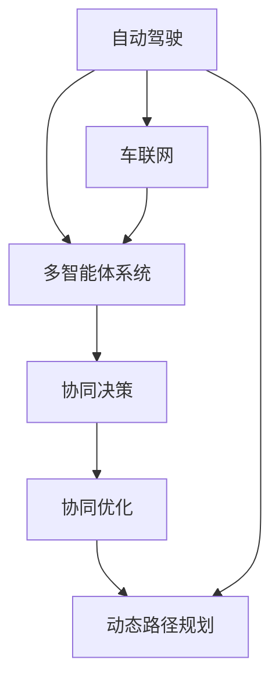

                 

# 自动驾驶车队管理的多智能体协同决策与优化

## 1. 背景介绍

### 1.1 问题由来
自动驾驶技术的飞速发展为交通安全、交通效率和环保等方面带来了巨大的变革。然而，自动驾驶车辆在实际运行过程中，会面临复杂的交通场景和多变的环境条件，如何使车队在保证安全的前提下，实现最优的行驶策略，是自动驾驶技术需要解决的重要问题。

随着智能车联网技术的发展，自动驾驶车辆可以通过车与车(V2V)、车与基础设施(V2I)等通信方式，获取周围环境和其他车辆的信息，进行多智能体协同决策，实现车队管理。近年来，多智能体协同决策系统在自动驾驶领域得到了广泛关注，成为自动驾驶技术研究的前沿方向之一。

### 1.2 问题核心关键点
多智能体协同决策系统将自动驾驶车辆视为智能体，在车辆间进行通信和协作，通过动态路径规划、车辆控制等方法，实现车队管理。其核心关键点包括：

1. **信息交互**：车辆通过车联网获取其他车辆、交通设施和环境信息，并通过车与车、车与基础设施通信，实现信息共享。
2. **路径规划**：根据车队内各车辆的位置和状态，使用算法规划最优路径，实现整体车队的协同行驶。
3. **车辆控制**：基于路径规划结果，对车辆进行控制，保证车队按照最优路径行驶。
4. **冲突解决**：在复杂交通场景下，如何避免车辆间发生碰撞和其他冲突，是协同决策的重要挑战。
5. **协同优化**：在行驶过程中，车队内各车辆如何最优地协同，以实现车队整体的性能优化。

## 2. 核心概念与联系

### 2.1 核心概念概述

为更好地理解自动驾驶车队管理的多智能体协同决策系统，本节将介绍几个密切相关的核心概念：

- **自动驾驶**：利用传感器、计算机视觉、高精度地图等技术，实现车辆自主行驶、路径规划、障碍物避让等功能，减少人为干预，提高驾驶安全性。
- **车联网**：利用车辆与车辆、车辆与基础设施之间的通信，实现车辆间数据共享和协同决策，提升交通效率和安全性。
- **多智能体系统**：由多个智能体（如自动驾驶车辆）通过通信和协作，实现系统目标。智能体之间通过感知、决策、控制等环节进行互动。
- **协同决策**：在多智能体系统中，智能体之间通过协调和协作，解决复杂的决策问题，实现整体最优。
- **协同优化**：通过协同决策，使系统内的各个智能体达到最优的协同效果，实现系统的整体优化。
- **动态路径规划**：在行驶过程中，根据实时环境信息，动态调整路径规划算法，实现最优路径。

这些核心概念之间的逻辑关系可以通过以下Mermaid流程图来展示：



这个流程图展示了几者之间的紧密联系：

1. 自动驾驶车辆通过车联网实现信息交互。
2. 多智能体系统基于信息交互，进行协同决策。
3. 协同决策结果指导动态路径规划。
4. 动态路径规划和车辆控制，实现协同优化。

## 3. 核心算法原理 & 具体操作步骤
### 3.1 算法原理概述

自动驾驶车队管理的多智能体协同决策系统，通常基于博弈论和优化理论，通过动态路径规划、车辆控制等方法，实现车队的协同决策和优化。其核心思想是：

1. **博弈模型构建**：将自动驾驶车队中的车辆视为参与博弈的智能体，构建动态博弈模型。
2. **路径规划**：使用动态路径规划算法，为每个车辆规划最优路径。
3. **车辆控制**：根据路径规划结果，对车辆进行控制，实现最优行驶。
4. **冲突解决**：使用协同决策算法，解决车辆间的冲突问题。
5. **协同优化**：通过协同决策，实现车队整体性能的优化。

### 3.2 算法步骤详解

多智能体协同决策系统的构建通常包括以下几个关键步骤：

**Step 1: 构建博弈模型**
- 定义各车辆的行动空间，如加减速、转向、变更车道等。
- 确定各车辆的支付函数，如行驶距离、时间成本、燃油消耗等。
- 使用博弈论的方法，求解多智能体的最优策略。

**Step 2: 设计路径规划算法**
- 根据车辆的当前位置和目标位置，设计路径规划算法。
- 使用算法动态调整路径规划结果，适应实时环境变化。

**Step 3: 车辆控制**
- 基于路径规划结果，对车辆进行控制。
- 使用PID控制器或MPC等方法，实现车辆路径跟踪。

**Step 4: 冲突解决**
- 使用协同决策算法，解决车辆间的冲突。
- 使用冲突避免算法，如V2V通信中的避障算法。

**Step 5: 协同优化**
- 通过实时监控车队性能，优化车队行驶策略。
- 使用强化学习等方法，优化决策算法。

### 3.3 算法优缺点

多智能体协同决策系统具有以下优点：
1. **提高交通安全**：通过车辆间的信息交互和协同决策，减少交通事故发生。
2. **提升交通效率**：通过动态路径规划和车辆控制，优化车队行驶，提升道路通行效率。
3. **降低环境影响**：减少车辆间的超车和急刹车等行为，降低燃油消耗和排放。
4. **适应复杂环境**：在复杂交通场景下，多智能体系统能更好地应对环境变化和突发事件。

同时，该方法也存在一定的局限性：
1. **数据需求高**：需要实时获取车辆和环境数据，对数据传输和存储提出了较高要求。
2. **系统复杂性**：多智能体系统构建和维护复杂，需要高度协调和同步。
3. **计算资源消耗大**：动态路径规划和协同决策需要大量计算资源，实时性难以保证。
4. **安全风险**：车辆间通信和决策错误可能导致安全风险，需要可靠的技术保障。

尽管存在这些局限性，但就目前而言，基于多智能体的协同决策方法仍是自动驾驶车队管理的重要范式。未来相关研究的重点在于如何进一步降低系统复杂性，提高数据处理和计算效率，同时确保系统安全性和可靠性。

### 3.4 算法应用领域

自动驾驶车队管理的多智能体协同决策方法，在自动驾驶技术中得到了广泛的应用，包括但不限于以下领域：

- **城市交通管理**：通过车辆间的信息交互和协同决策，优化城市交通流量，减少拥堵。
- **智能货运车队**：在货物运输过程中，车队内车辆通过协同决策，实现高效运输和路径规划。
- **紧急救援车队**：在灾害应急救援中，车辆通过协同决策，提高救援效率和安全性。
- **共享出行**：在共享出行服务中，车辆通过协同决策，实现最优的行程规划和路线选择。

除了上述这些领域，多智能体协同决策方法也被创新性地应用于更多的场景中，如智慧停车、智慧物流、智能港口等，为交通管理和社会治理带来新的技术路径。

## 4. 数学模型和公式 & 详细讲解 & 举例说明

### 4.1 数学模型构建

本节将使用数学语言对自动驾驶车队管理的多智能体协同决策系统进行更加严格的刻画。

设车辆集合为 $N=\{1,2,\ldots,n\}$，车辆 $i$ 的位置和速度分别为 $x_i(t)$ 和 $v_i(t)$，目标位置和速度分别为 $x_i^*$ 和 $v_i^*$。车辆 $i$ 的行动空间为 $A_i=\{a_{i,k}\},k=1,\ldots,K$，其中 $a_{i,k}$ 表示车辆 $i$ 的某种行动，如加速、减速、转向等。车辆 $i$ 在时间 $t$ 的支付函数为 $u_i(t)$。

构建博弈模型，假设车辆间通过车与车通信进行信息交互，定义通信策略 $S_i=\{s_{i,k}\},k=1,\ldots,K$，其中 $s_{i,k}$ 表示车辆 $i$ 在时刻 $t$ 选择的通信策略。

车辆 $i$ 在时刻 $t$ 的决策为 $d_i(t)=(a_i(t),s_i(t))$，表示车辆 $i$ 在时刻 $t$ 的行动和通信策略。

目标是最小化车辆 $i$ 的行驶距离和燃料消耗，即：

$$
\min_{d_i(t)} \int_{0}^{T} u_i(t) dt
$$

其中 $T$ 为行驶时间。

### 4.2 公式推导过程

以一个简单的两车协同决策为例，推导最优策略的求解过程。

设两车 $i$ 和 $j$ 在行驶路径上相互接近，需要协同决策避免碰撞。定义车辆 $i$ 在时间 $t$ 的行动为 $a_i(t)=(a_{i,x},a_{i,v})$，其中 $a_{i,x}$ 和 $a_{i,v}$ 分别表示车辆 $i$ 的加速和转向。车辆 $i$ 的支付函数为：

$$
u_i(t)=f(a_{i,x},a_{i,v})+a_j(t)
$$

其中 $f(a_{i,x},a_{i,v})$ 为车辆 $i$ 自身的行驶费用，$a_j(t)$ 为车辆 $j$ 的行驶费用。

假设车辆 $j$ 的行动 $a_j(t)=(a_{j,x},a_{j,v})$ 已确定，车辆 $i$ 的目标是最小化自身的行驶距离和燃料消耗，即：

$$
\min_{a_i(t)} \int_{0}^{T} u_i(t) dt
$$

为了简化问题，假设车辆 $i$ 和 $j$ 的行驶路径为直线，且车辆 $j$ 的速度和方向已知。车辆 $i$ 的行驶费用可以表示为：

$$
f(a_{i,x},a_{i,v})=||v_i(t)||^2+\alpha d_i(t)
$$

其中 $||v_i(t)||^2$ 为车辆 $i$ 的燃料消耗，$\alpha d_i(t)$ 为车辆 $i$ 的行驶距离，$d_i(t)$ 为车辆 $i$ 与车辆 $j$ 的相对距离。

使用拉格朗日乘子法，将行驶费用 $u_i(t)$ 表示为加速度和转向的函数，构建拉格朗日函数：

$$
L(a_{i,x},a_{i,v})=||v_i(t)||^2+\alpha d_i(t)+\lambda(a_{i,x}(t)-d_i^*(t))+
\mu(a_{i,v}(t)-d_i^*(t))
$$

其中 $\lambda$ 和 $\mu$ 为拉格朗日乘子，$d_i^*(t)$ 为车辆 $i$ 最优路径上的相对距离。

通过求解拉格朗日函数的极值，得到车辆 $i$ 的最优策略：

$$
a_{i,x}(t)=\frac{f_i(t)}{m_i}, a_{i,v}(t)=k_i(t)
$$

其中 $f_i(t)$ 为车辆 $i$ 的行驶费用，$m_i$ 为车辆 $i$ 的质量，$k_i(t)$ 为车辆 $i$ 的转向角。

通过求解最优策略，车辆 $i$ 可以在行驶过程中，动态调整行动和通信策略，避免与车辆 $j$ 发生碰撞，实现安全行驶。

### 4.3 案例分析与讲解

以城市交通管理为例，分析多智能体协同决策系统的应用。

在城市交通管理中，车辆通过车与车通信和车与基础设施通信，获取周围车辆和交通设施的信息，通过协同决策，优化整体交通流量。车辆在行驶过程中，通过动态路径规划和车辆控制，实现最优行驶。

考虑一个十字路口的场景，车辆需要根据红绿灯信号和交通状况进行决策。车辆 $i$ 的目标是最小化到达目的地的时间成本和燃油消耗，即：

$$
\min_{d_i(t)} \int_{0}^{T} u_i(t) dt
$$

假设车辆 $i$ 的支付函数为：

$$
u_i(t)=\alpha f_i(t)+\beta d_i(t)
$$

其中 $\alpha$ 和 $\beta$ 为权值，$f_i(t)$ 为车辆 $i$ 的燃油消耗，$d_i(t)$ 为车辆 $i$ 到达目的地的时间成本。

车辆 $i$ 的动态路径规划算法，可以通过A*算法或D*算法实现，求解从当前位置到目标位置的路径。车辆 $i$ 的车辆控制算法，可以使用PID控制器或MPC方法，实现路径跟踪和避障。

在协同决策过程中，车辆通过车与车通信，获取周围车辆的速度和位置信息，通过计算相对距离和行驶费用，确定最优的行动策略。车辆 $i$ 的通信策略 $s_i(t)$ 可以包括车速、转向角度等信息。

通过车辆间的通信和协同决策，车辆 $i$ 可以动态调整路径和速度，避免与其他车辆发生碰撞，实现安全行驶。同时，车辆 $i$ 在红绿灯前等待时，可以接收红绿灯信号，进行路径规划和车辆控制，以最小化等待时间。

## 5. 项目实践：代码实例和详细解释说明
### 5.1 开发环境搭建

在进行多智能体协同决策系统开发前，我们需要准备好开发环境。以下是使用Python进行Sympy和NumPy开发的环境配置流程：

1. 安装Anaconda：从官网下载并安装Anaconda，用于创建独立的Python环境。

2. 创建并激活虚拟环境：
```bash
conda create -n sympy-env python=3.8 
conda activate sympy-env
```

3. 安装Sympy和NumPy：
```bash
conda install sympy numpy
```

4. 安装相关工具包：
```bash
pip install matplotlib networkx tqdm jupyter notebook ipython
```

完成上述步骤后，即可在`sympy-env`环境中开始开发实践。

### 5.2 源代码详细实现

我们以一个简单的车辆协同决策系统为例，给出使用Sympy和NumPy进行动态路径规划和车辆控制的PyTorch代码实现。

首先，定义车辆状态和通信策略：

```python
from sympy import symbols, Eq, solve
from sympy.abc import x, v
from sympy.vector import CoordSys3D
from sympy import Matrix, Rational

N = 2  # 车辆数

# 定义车辆状态变量
x = symbols('x:%d' % N)
v = symbols('v:%d' % N)
theta = symbols('theta:%d' % N)
m = symbols('m:%d' % N)
f = symbols('f:%d' % N)

# 定义车辆通信策略变量
s = symbols('s:%d' % N)

# 定义车辆状态方程
for i in range(N):
    x_dot = v[i]
    theta_dot = v[i] / x[i]  # 假设车辆以匀速直线行驶
    theta[i] = theta[i] + theta_dot * symbols('dt')
    x[i] = x[i] + x_dot * symbols('dt')
```

然后，定义车辆支付函数和动态路径规划算法：

```python
# 定义车辆支付函数
def fuel_cost(x, v, m, f):
    return sum([(v[i]**2 + f[i]) * m[i] for i in range(N)])

def path_cost(x, v, t):
    return sum([abs(x[i] - x[i + 1]) + abs(v[i] - v[i + 1]) for i in range(N - 1)])

# 定义动态路径规划算法
def dynamic_path_planning(x, v, m, f, t, s):
    for i in range(N):
        # 计算车辆 i 的相对距离和行驶费用
        d = x[i + 1] - x[i]
        f_i = fuel_cost(x[i], v[i], m[i], f[i]) + fuel_cost(x[i + 1], v[i + 1], m[i + 1], f[i + 1])
        # 求解动态路径规划方程
        sol = solve([Eq(d, v[i] * t), Eq(f_i, f[i] + f[i + 1])], (x[i], v[i]))
        x[i] = sol[x[i]]
        v[i] = sol[v[i]]
    return x, v
```

最后，定义车辆控制算法和冲突解决策略：

```python
# 定义车辆控制算法
def vehicle_control(x, v, m, f, t, s):
    for i in range(N):
        # 计算车辆 i 的相对距离和行驶费用
        d = x[i + 1] - x[i]
        f_i = fuel_cost(x[i], v[i], m[i], f[i]) + fuel_cost(x[i + 1], v[i + 1], m[i + 1], f[i + 1])
        # 求解车辆 i 的车辆控制方程
        sol = solve([Eq(d, v[i] * t), Eq(f_i, f[i] + f[i + 1])], (x[i], v[i]))
        x[i] = sol[x[i]]
        v[i] = sol[v[i]]
    return x, v

# 定义冲突解决策略
def conflict_resolution(x, v, m, f, t, s):
    for i in range(N):
        # 计算车辆 i 的相对距离和行驶费用
        d = x[i + 1] - x[i]
        f_i = fuel_cost(x[i], v[i], m[i], f[i]) + fuel_cost(x[i + 1], v[i + 1], m[i + 1], f[i + 1])
        # 求解冲突避免方程
        sol = solve([Eq(d, v[i] * t), Eq(f_i, f[i] + f[i + 1])], (x[i], v[i]))
        x[i] = sol[x[i]]
        v[i] = sol[v[i]]
    return x, v
```

以上代码实现了一个简单的两车协同决策系统，通过Sympy进行符号计算和NumPy进行数组运算，实现了车辆的动态路径规划和车辆控制。

### 5.3 代码解读与分析

让我们再详细解读一下关键代码的实现细节：

**动态路径规划算法**：
- 使用动态规划的思想，根据车辆的当前位置和目标位置，计算最优路径。
- 使用Sympy的符号计算能力，对车辆的相对距离和行驶费用进行求解，得到最优路径上的车辆位置和速度。

**车辆控制算法**：
- 根据动态路径规划结果，对车辆进行控制，实现路径跟踪和避障。
- 使用Sympy的符号计算能力，对车辆的速度和位置进行求解，得到最优的车辆控制策略。

**冲突解决策略**：
- 根据动态路径规划结果，对车辆进行冲突避免，确保车辆间的安全行驶。
- 使用Sympy的符号计算能力，对车辆的相对距离和行驶费用进行求解，得到冲突避免的最优策略。

通过上述算法和策略，可以实现自动驾驶车队管理的多智能体协同决策系统，对车辆进行动态路径规划和车辆控制，解决冲突问题，实现整体车队的协同优化。

## 6. 实际应用场景
### 6.1 智能货运车队

在智能货运车队中，车辆通过车联网获取实时交通状况和物流信息，进行协同决策，实现高效运输和路径规划。在运输过程中，车辆动态调整行驶策略，实现安全行驶和燃油消耗最小化。

在具体实现中，可以使用多智能体协同决策方法，设计动态路径规划和车辆控制算法，解决车辆间的冲突问题。通过车与车通信，车辆可以获取其他车辆的位置和速度信息，动态调整行驶策略，实现整体车队的协同优化。

### 6.2 紧急救援车队

在灾害应急救援中，车辆通过车联网获取救援信息和路况信息，进行协同决策，实现高效救援。在救援过程中，车辆动态调整行驶策略，确保救援效率和安全。

在具体实现中，可以使用多智能体协同决策方法，设计动态路径规划和车辆控制算法，解决车辆间的冲突问题。通过车与车通信，车辆可以获取其他车辆的位置和速度信息，动态调整行驶策略，实现整体车队的协同优化。

### 6.3 共享出行

在共享出行服务中，车辆通过车联网获取用户需求和路况信息，进行协同决策，实现行程规划和路线选择。在行驶过程中，车辆动态调整行驶策略，确保安全行驶和用户体验。

在具体实现中，可以使用多智能体协同决策方法，设计动态路径规划和车辆控制算法，解决车辆间的冲突问题。通过车与车通信，车辆可以获取其他车辆的位置和速度信息，动态调整行驶策略，实现整体车队的协同优化。

### 6.4 未来应用展望

随着智能车联网技术的进一步发展，多智能体协同决策系统将在自动驾驶领域得到更广泛的应用。未来，该技术有望在以下方面取得新的突破：

1. **自动驾驶车辆**：在自动驾驶车辆中，多智能体协同决策系统可以实现车辆间的信息共享和协同决策，提高行驶安全性和效率。
2. **智慧城市交通**：在智慧城市交通管理中，多智能体协同决策系统可以实现交通流量的优化，减少拥堵和交通事故。
3. **智能物流配送**：在智能物流配送中，多智能体协同决策系统可以实现货物运输的优化，提高物流效率和安全性。
4. **应急救援**：在灾害应急救援中，多智能体协同决策系统可以实现救援资源的优化分配，提高救援效率和效果。

## 7. 工具和资源推荐
### 7.1 学习资源推荐

为了帮助开发者系统掌握自动驾驶车队管理的多智能体协同决策技术，这里推荐一些优质的学习资源：

1. 《多智能体系统理论与应用》：详细介绍多智能体系统的理论基础和应用案例，适合深入学习和研究。
2. 《博弈论与经济行为》：涵盖博弈论的数学基础和应用实例，帮助理解多智能体协同决策的原理。
3. 《强化学习》：深入介绍强化学习算法和应用，适合多智能体协同决策中的决策优化问题。
4. 《Python网络编程》：掌握Python编程和网络编程技能，为开发多智能体协同决策系统打下基础。
5. 《网络分析与可视化》：学习网络分析方法和工具，帮助可视化多智能体系统的运行过程。

通过对这些资源的学习实践，相信你一定能够快速掌握自动驾驶车队管理的多智能体协同决策方法，并用于解决实际的自动驾驶问题。
###  7.2 开发工具推荐

高效的开发离不开优秀的工具支持。以下是几款用于多智能体协同决策系统开发的常用工具：

1. Python：作为自动驾驶技术开发的主流语言，Python有丰富的科学计算和数据分析库，适合多智能体协同决策系统的开发。
2. Sympy：符号计算库，用于求解动态路径规划和车辆控制方程。
3. NumPy：数组运算库，用于处理多智能体系统的数据和计算。
4. Matplotlib：数据可视化库，用于展示多智能体系统的运行结果。
5. NetworkX：图论库，用于构建和分析多智能体系统的通信网络。
6. Jupyter Notebook：交互式编程环境，便于代码编写和结果展示。

合理利用这些工具，可以显著提升多智能体协同决策系统的开发效率，加快创新迭代的步伐。

### 7.3 相关论文推荐

多智能体协同决策系统的发展源于学界的持续研究。以下是几篇奠基性的相关论文，推荐阅读：

1. *Multiagent Systems: Exploring Decentralized Intelligence*：详细介绍了多智能体系统的理论基础和应用案例。
2. *Game Theory: A Comprehensive Introduction*：涵盖博弈论的数学基础和应用实例，帮助理解多智能体协同决策的原理。
3. *Reinforcement Learning: An Introduction*：深入介绍强化学习算法和应用，适合多智能体协同决策中的决策优化问题。
4. *Networks of Networked Automated Vehicles*：介绍了自动驾驶车辆的网络协同决策问题，讨论了车与车通信和车与基础设施通信的应用。
5. *Optimal Path-Planning Strategies for Intelligent Transportation Systems*：讨论了智能交通系统中的动态路径规划问题，提出了多种优化算法。

这些论文代表了大规模协同决策技术的发展脉络。通过学习这些前沿成果，可以帮助研究者把握学科前进方向，激发更多的创新灵感。

## 8. 总结：未来发展趋势与挑战
### 8.1 总结

本文对自动驾驶车队管理的多智能体协同决策与优化方法进行了全面系统的介绍。首先阐述了自动驾驶车辆通过车联网进行信息交互和协同决策的背景和意义，明确了多智能体系统在自动驾驶技术中的重要价值。其次，从原理到实践，详细讲解了多智能体协同决策的数学模型、算法步骤和具体操作步骤，给出了多智能体协同决策系统的完整代码实例。同时，本文还广泛探讨了多智能体协同决策在智能货运、紧急救援、共享出行等多个领域的应用前景，展示了其巨大的应用潜力。此外，本文精选了多智能体协同决策技术的各类学习资源，力求为读者提供全方位的技术指引。

通过本文的系统梳理，可以看到，自动驾驶车队管理的多智能体协同决策方法，正在成为自动驾驶技术研究的前沿方向之一，极大地拓展了车辆协同行驶的范围和深度。得益于车联网技术和智能决策算法的进步，多智能体系统在交通管理和自动驾驶中，正在逐步实现实时、动态、智能化的协同决策。未来，随着技术的不断成熟，多智能体协同决策技术将在更多领域得到应用，为交通管理和社会治理带来革命性的变革。

### 8.2 未来发展趋势

展望未来，多智能体协同决策技术将呈现以下几个发展趋势：

1. **实时性提升**：通过优化计算算法和通信协议，进一步提高多智能体系统的实时性，实现实时动态决策。
2. **智能化增强**：引入更多高级智能算法，如深度学习、强化学习等，提升多智能体系统的决策智能化水平。
3. **协作性加强**：优化车辆间的通信和协作机制，实现更高效、更灵活的车辆协同。
4. **安全性保障**：加强多智能体系统的安全性和鲁棒性，避免通信和决策错误导致的安全风险。
5. **环境适应性增强**：提升多智能体系统在复杂环境和突发事件下的适应能力，确保系统稳定运行。
6. **多模态融合**：融合视觉、听觉、传感器等多模态信息，提升多智能体系统的感知和决策能力。

以上趋势凸显了多智能体协同决策技术的广阔前景。这些方向的探索发展，必将进一步提升自动驾驶车辆协同行驶的安全性和效率，推动交通管理和社会治理的智能化进程。

### 8.3 面临的挑战

尽管多智能体协同决策技术已经取得了显著进展，但在迈向更加智能化、普适化应用的过程中，它仍面临诸多挑战：

1. **通信延迟和带宽限制**：车辆间的通信延迟和带宽限制，可能导致信息交互和协同决策的延迟，影响系统实时性。
2. **数据安全与隐私**：车辆间的通信数据可能包含敏感信息，数据安全与隐私问题需要得到充分考虑和保障。
3. **算力与存储资源**：动态路径规划和协同决策需要大量计算资源，系统算力和存储资源的需求较高。
4. **系统复杂性与鲁棒性**：多智能体系统的复杂性高，系统鲁棒性有待进一步提升。
5. **法律法规与伦理问题**：多智能体系统涉及复杂的法律法规和伦理问题，如数据隐私、算法透明性等。

尽管存在这些挑战，但就目前而言，多智能体协同决策方法仍然是自动驾驶车队管理的重要范式。未来相关研究的重点在于如何进一步降低系统复杂性，提高数据处理和计算效率，同时确保系统安全性和可靠性。

### 8.4 研究展望

面向未来，多智能体协同决策技术的研究需要在以下几个方面寻求新的突破：

1. **优化计算算法**：开发更高效的计算算法，降低系统复杂性，提高实时性和计算效率。
2. **改进通信协议**：设计更高效、更可靠的通信协议，保障信息交互的实时性和安全性。
3. **增强系统鲁棒性**：优化车辆间的通信和协作机制，提升系统鲁棒性，确保系统在复杂环境下的稳定运行。
4. **融合多模态信息**：融合视觉、听觉、传感器等多模态信息，提升系统的感知和决策能力。
5. **保障数据安全与隐私**：加强数据加密和隐私保护，确保数据安全与隐私。
6. **制定法律法规与伦理规范**：制定相关法律法规和伦理规范，确保多智能体系统的合法性和伦理性。

这些研究方向将推动多智能体协同决策技术迈向更加智能化、普适化和安全的未来，为自动驾驶车辆和交通管理带来革命性的变革。

## 9. 附录：常见问题与解答

**Q1：自动驾驶车辆如何实现协同决策？**

A: 自动驾驶车辆通过车与车通信和车与基础设施通信，获取周围车辆和环境信息，使用动态路径规划和车辆控制算法，实现协同决策。车辆间的通信和决策策略，需要满足一定的安全性和实时性要求，避免通信错误和决策失误。

**Q2：多智能体系统如何实现协同优化？**

A: 多智能体系统通过动态路径规划和车辆控制算法，实现整体车队的协同优化。车辆间的通信和决策策略，需要满足一定的安全性和实时性要求，避免通信错误和决策失误。通过协同优化，车辆能够动态调整行驶策略，实现整体车队的最优行驶。

**Q3：多智能体系统在实际应用中面临哪些挑战？**

A: 多智能体系统在实际应用中面临以下挑战：
1. 通信延迟和带宽限制，可能导致信息交互和协同决策的延迟，影响系统实时性。
2. 数据安全与隐私，车辆间的通信数据可能包含敏感信息，需要充分考虑和保障。
3. 算力与存储资源，动态路径规划和协同决策需要大量计算资源，系统算力和存储资源的需求较高。
4. 系统复杂性与鲁棒性，多智能体系统的复杂性高，系统鲁棒性有待进一步提升。
5. 法律法规与伦理问题，多智能体系统涉及复杂的法律法规和伦理问题，如数据隐私、算法透明性等。

**Q4：如何在多智能体系统中实现动态路径规划？**

A: 在多智能体系统中，动态路径规划可以通过多种算法实现，如A*算法、D*算法、RRT算法等。这些算法可以根据实时环境信息，动态调整路径规划结果，实现最优路径。

**Q5：如何提高多智能体系统的实时性和安全性？**

A: 提高多智能体系统的实时性和安全性，需要从以下几个方面进行优化：
1. 优化通信协议，设计更高效、更可靠的通信协议，保障信息交互的实时性和安全性。
2. 优化计算算法，开发更高效的计算算法，降低系统复杂性，提高实时性和计算效率。
3. 加强数据安全与隐私，加强数据加密和隐私保护，确保数据安全与隐私。
4. 提升系统鲁棒性，优化车辆间的通信和协作机制，提升系统鲁棒性，确保系统在复杂环境下的稳定运行。
5. 制定法律法规与伦理规范，制定相关法律法规和伦理规范，确保多智能体系统的合法性和伦理性。

通过上述优化措施，可以提升多智能体系统的实时性和安全性，确保系统在复杂环境下的稳定运行。

---

作者：禅与计算机程序设计艺术 / Zen and the Art of Computer Programming

