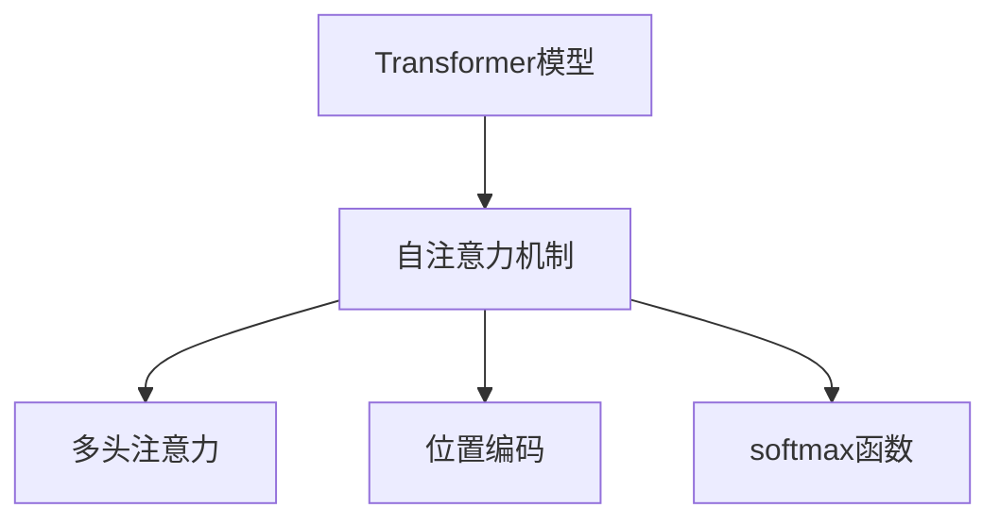

                 

# 自注意力机制的详细解析

> 关键词：自注意力机制,Transformer,注意力,注意力权重,多头注意力,位置编码,softmax,模型架构

## 1. 背景介绍

### 1.1 问题由来
自注意力机制（Self-Attention）是Transformer模型中最为核心的部分，它的提出彻底革新了自然语言处理（NLP）领域。传统的循环神经网络（RNN）和卷积神经网络（CNN）在处理长序列时存在计算复杂度高、梯度消失或爆炸等问题。而自注意力机制通过引入注意力机制，使得模型能够更加高效地处理长序列数据，成为目前最流行的NLP模型架构之一。

自注意力机制的优势在于：
1. **并行计算**：自注意力机制可以利用并行计算的优势，在处理长序列数据时效率更高。
2. **捕捉长距离依赖**：自注意力机制能够捕捉序列中任意位置的依赖关系，而不仅限于局部依赖。
3. **信息整合能力**：通过自注意力机制，模型可以更好地整合序列中的信息，提升整体表示能力。

自注意力机制的提出和应用，使得NLP模型在各种任务上取得了显著的进步，推动了整个领域的发展。从机器翻译到文本分类，再到自然语言生成，自注意力机制的身影无处不在。

### 1.2 问题核心关键点
自注意力机制的核心在于通过计算注意力权重，动态地决定序列中各个部分对于当前位置的重要性。具体而言，它包含以下几个关键点：

- **注意力计算**：计算序列中每个位置与其他位置的注意力权重，用于决定不同位置对于当前位置的贡献程度。
- **多头注意力**：使用多个注意力头（Attention Head）并行处理，能够捕捉不同方面的依赖关系。
- **位置编码**：在计算注意力权重时，引入位置编码（Positional Encoding），使得模型能够区分序列中的不同位置。
- **softmax函数**：通过softmax函数计算注意力权重，将注意力权重归一化到[0, 1]之间，表示各个位置的相对重要性。

这些关键点共同构成了自注意力机制的核心逻辑，使得模型能够高效地处理序列数据，并在各种NLP任务中取得优异的表现。

## 2. 核心概念与联系

### 2.1 核心概念概述

为更好地理解自注意力机制，本节将介绍几个密切相关的核心概念：

- **Transformer模型**：一种基于自注意力机制的神经网络架构，广泛用于自然语言处理、图像处理等多个领域。
- **注意力机制（Attention）**：一种机制，用于计算序列中不同部分之间的相关性，用于决定重要程度。
- **多头注意力（Multi-Head Attention）**：通过并行多个注意力头，捕捉序列中不同方面的依赖关系。
- **位置编码（Positional Encoding）**：在计算注意力权重时，引入位置信息，使得模型能够区分序列中的不同位置。
- **softmax函数**：一种归一化函数，将注意力权重归一化到[0, 1]之间，表示各个位置的相对重要性。

这些核心概念之间的逻辑关系可以通过以下Mermaid流程图来展示：



这个流程图展示了自己注意力机制的核心概念及其之间的关系：

1. Transformer模型通过自注意力机制处理序列数据。
2. 自注意力机制包括多头注意力，用于捕捉不同方面的依赖关系。
3. 多头注意力中使用了位置编码，用于区分序列中的不同位置。
4. 位置编码最终通过softmax函数归一化注意力权重，决定不同位置的重要性。

这些概念共同构成了自注意力机制的工作原理，使得Transformer模型能够高效地处理序列数据。

## 3. 核心算法原理 & 具体操作步骤

### 3.1 算法原理概述

自注意力机制通过计算注意力权重，动态地决定序列中各个部分对于当前位置的重要性。其核心思想是通过矩阵运算计算出每个位置的注意力权重，并根据这些权重对序列进行加权求和。

具体而言，假设输入序列为 $X=[x_1, x_2, ..., x_n]$，其中 $x_i$ 表示序列中第 $i$ 个位置的嵌入向量。自注意力机制的目标是计算每个位置的注意力权重，用于决定不同位置对于当前位置的贡献程度。

设 $Q$、$K$、$V$ 分别为查询（Query）、键（Key）、值（Value）矩阵，其维度为 $[H, W]$，其中 $H$ 为注意力头的数量，$W$ 为序列长度。自注意力机制的计算步骤如下：

1. **计算查询矩阵**：$Q = XW_Q$，其中 $W_Q$ 为查询矩阵的权重。
2. **计算键矩阵**：$K = XW_K$，其中 $W_K$ 为键矩阵的权重。
3. **计算值矩阵**：$V = XW_V$，其中 $W_V$ 为值矩阵的权重。
4. **计算注意力权重**：$\text{Attention}_{i,j} = \text{softmax}(\frac{Q_iK_j^T}{\sqrt{d_k}})$，其中 $d_k$ 为键的维度，$i$ 表示查询位置，$j$ 表示键位置。
5. **加权求和**：$\text{Attention}_{i} = \sum_{j=1}^{W} \text{Attention}_{i,j}V_j$。

### 3.2 算法步骤详解

下面我们将详细介绍自注意力机制的详细步骤：

**Step 1: 准备输入矩阵**
- 输入序列 $X$ 经过嵌入层（Embedding Layer）转换为向量表示。
- 使用三个不同的线性层分别计算查询矩阵 $Q$、键矩阵 $K$、值矩阵 $V$。

**Step 2: 计算注意力权重**
- 对查询矩阵 $Q$ 和键矩阵 $K$ 进行矩阵乘法运算，得到对齐矩阵 $QK^T$。
- 将对齐矩阵 $QK^T$ 除以 $\sqrt{d_k}$，用于归一化。
- 使用softmax函数对归一化后的对齐矩阵进行归一化处理，得到注意力权重矩阵。

**Step 3: 计算加权和**
- 对注意力权重矩阵和值矩阵 $V$ 进行矩阵乘法运算，得到加权和矩阵。
- 对加权和矩阵进行线性层转换，得到最终的输出。

### 3.3 算法优缺点

自注意力机制具有以下优点：
1. **计算效率高**：自注意力机制可以通过矩阵运算高效计算注意力权重，并行处理能力使得其在处理长序列时效率更高。
2. **捕捉长距离依赖**：自注意力机制能够捕捉序列中任意位置的依赖关系，而不仅限于局部依赖。
3. **信息整合能力**：通过自注意力机制，模型可以更好地整合序列中的信息，提升整体表示能力。

然而，自注意力机制也存在一些缺点：
1. **计算复杂度高**：自注意力机制的计算复杂度较高，特别是在使用多头注意力时，计算量会大幅增加。
2. **参数量较大**：自注意力机制需要计算和存储大量的注意力权重，因此模型的参数量较大。
3. **局部性丢失**：自注意力机制的计算过程中，忽略了序列的局部信息，可能会导致一些重要的局部特征被忽略。

### 3.4 算法应用领域

自注意力机制在自然语言处理领域得到了广泛的应用，涵盖了几乎所有常见的NLP任务，例如：

- 机器翻译：将源语言文本翻译成目标语言。
- 文本分类：对文本进行分类，如情感分析、主题分类等。
- 文本摘要：将长文本压缩成简短摘要。
- 问答系统：对自然语言问题给出答案。
- 命名实体识别：识别文本中的人名、地名、机构名等特定实体。
- 关系抽取：从文本中抽取实体之间的语义关系。

除了上述这些经典任务外，自注意力机制还被创新性地应用到更多场景中，如可控文本生成、对话系统、代码生成、数据增强等，为NLP技术带来了全新的突破。

## 4. 数学模型和公式 & 详细讲解

### 4.1 数学模型构建

设输入序列为 $X=[x_1, x_2, ..., x_n]$，其中 $x_i$ 表示序列中第 $i$ 个位置的嵌入向量。假设模型的维度为 $d$，设 $W_Q$、$W_K$、$W_V$ 分别为查询矩阵、键矩阵、值矩阵的权重。

自注意力机制的目标是计算每个位置的注意力权重，用于决定不同位置对于当前位置的贡献程度。设 $Q$、$K$、$V$ 分别为查询矩阵、键矩阵、值矩阵，其维度为 $[H, W]$，其中 $H$ 为注意力头的数量，$W$ 为序列长度。自注意力机制的计算步骤如下：

1. **计算查询矩阵**：$Q = XW_Q$
2. **计算键矩阵**：$K = XW_K$
3. **计算值矩阵**：$V = XW_V$
4. **计算注意力权重**：$\text{Attention}_{i,j} = \text{softmax}(\frac{Q_iK_j^T}{\sqrt{d_k}})$
5. **加权求和**：$\text{Attention}_{i} = \sum_{j=1}^{W} \text{Attention}_{i,j}V_j$

### 4.2 公式推导过程

以下是自注意力机制的详细公式推导过程：

设输入序列为 $X=[x_1, x_2, ..., x_n]$，其中 $x_i$ 表示序列中第 $i$ 个位置的嵌入向量。假设模型的维度为 $d$，设 $W_Q$、$W_K$、$W_V$ 分别为查询矩阵、键矩阵、值矩阵的权重。

**Step 1: 计算查询矩阵**
设查询矩阵 $Q$ 的维度为 $[H, Wd]$，其中 $H$ 为注意力头的数量。则：
$$
Q = XW_Q = [x_1, x_2, ..., x_n] \in \mathbb{R}^{n \times d} W_Q = [w_{Q1}, w_{Q2}, ..., w_{QH}] \in \mathbb{R}^{H \times d}
$$
计算得到查询矩阵 $Q$ 为：
$$
Q = \begin{bmatrix}
w_{Q1}x_1 \\
w_{Q2}x_2 \\
...
w_{QH}x_n
\end{bmatrix}
$$

**Step 2: 计算键矩阵**
设键矩阵 $K$ 的维度为 $[H, Wd]$。则：
$$
K = XW_K = [x_1, x_2, ..., x_n] \in \mathbb{R}^{n \times d} W_K = [w_{K1}, w_{K2}, ..., w_{KH}] \in \mathbb{R}^{H \times d}
$$
计算得到键矩阵 $K$ 为：
$$
K = \begin{bmatrix}
w_{K1}x_1 \\
w_{K2}x_2 \\
...
w_{KH}x_n
\end{bmatrix}
$$

**Step 3: 计算值矩阵**
设值矩阵 $V$ 的维度为 $[H, Wd]$。则：
$$
V = XW_V = [x_1, x_2, ..., x_n] \in \mathbb{R}^{n \times d} W_V = [w_{V1}, w_{V2}, ..., w_{VH}] \in \mathbb{R}^{H \times d}
$$
计算得到值矩阵 $V$ 为：
$$
V = \begin{bmatrix}
w_{V1}x_1 \\
w_{V2}x_2 \\
...
w_{VH}x_n
\end{bmatrix}
$$

**Step 4: 计算注意力权重**
计算对齐矩阵 $QK^T$，其维度为 $[H, W^2]$：
$$
QK^T = \begin{bmatrix}
Q \\
K \\
V
\end{bmatrix}^T
$$
对对齐矩阵 $QK^T$ 除以 $\sqrt{d_k}$，用于归一化：
$$
\frac{QK^T}{\sqrt{d_k}} = \begin{bmatrix}
\frac{Q}{\sqrt{d_k}} \\
\frac{K}{\sqrt{d_k}} \\
\frac{V}{\sqrt{d_k}}
\end{bmatrix}
$$
使用softmax函数对归一化后的对齐矩阵进行归一化处理，得到注意力权重矩阵 $\text{Attention}$，其维度为 $[H, W]$：
$$
\text{Attention} = \text{softmax}(\frac{QK^T}{\sqrt{d_k}})
$$

**Step 5: 加权求和**
计算加权和矩阵 $\text{Attention}$，其维度为 $[H, Wd]$：
$$
\text{Attention} = \begin{bmatrix}
\frac{Q}{\sqrt{d_k}} \\
\frac{K}{\sqrt{d_k}} \\
\frac{V}{\sqrt{d_k}}
\end{bmatrix}
$$
对加权和矩阵 $\text{Attention}$ 和值矩阵 $V$ 进行矩阵乘法运算，得到最终的输出矩阵 $\text{Attention}_V$，其维度为 $[H, Wd]$：
$$
\text{Attention}_V = \text{Attention}V
$$

### 4.3 案例分析与讲解

为了更好地理解自注意力机制，我们可以通过一个具体的例子来分析其计算过程。

假设我们有一个长度为 $n=3$ 的序列 $X=[x_1, x_2, x_3]$，其中 $x_i$ 表示序列中第 $i$ 个位置的嵌入向量。设 $W_Q$、$W_K$、$W_V$ 分别为查询矩阵、键矩阵、值矩阵的权重。

假设查询矩阵 $Q$ 的维度为 $[H=2, Wd=4]$，键矩阵 $K$ 的维度为 $[H=2, Wd=4]$，值矩阵 $V$ 的维度为 $[H=2, Wd=4]$。则：
$$
Q = \begin{bmatrix}
w_{Q1}x_1 & w_{Q1}x_2 & w_{Q1}x_3 \\
w_{Q2}x_1 & w_{Q2}x_2 & w_{Q2}x_3
\end{bmatrix}
$$
$$
K = \begin{bmatrix}
w_{K1}x_1 & w_{K1}x_2 & w_{K1}x_3 \\
w_{K2}x_1 & w_{K2}x_2 & w_{K2}x_3
\end{bmatrix}
$$
$$
V = \begin{bmatrix}
w_{V1}x_1 & w_{V1}x_2 & w_{V1}x_3 \\
w_{V2}x_1 & w_{V2}x_2 & w_{V2}x_3
\end{bmatrix}
$$

**计算对齐矩阵**：
$$
QK^T = \begin{bmatrix}
Q \\
K \\
V
\end{bmatrix}^T = \begin{bmatrix}
w_{Q1}x_1 & w_{K1}x_1 & w_{V1}x_1 \\
w_{Q1}x_2 & w_{K1}x_2 & w_{V1}x_2 \\
w_{Q1}x_3 & w_{K1}x_3 & w_{V1}x_3 \\
w_{Q2}x_1 & w_{K2}x_1 & w_{V2}x_1 \\
w_{Q2}x_2 & w_{K2}x_2 & w_{V2}x_2 \\
w_{Q2}x_3 & w_{K2}x_3 & w_{V2}x_3
\end{bmatrix}
$$

**归一化对齐矩阵**：
$$
\frac{QK^T}{\sqrt{d_k}} = \begin{bmatrix}
\frac{w_{Q1}x_1}{\sqrt{d_k}} & \frac{w_{K1}x_1}{\sqrt{d_k}} & \frac{w_{V1}x_1}{\sqrt{d_k}} \\
\frac{w_{Q1}x_2}{\sqrt{d_k}} & \frac{w_{K1}x_2}{\sqrt{d_k}} & \frac{w_{V1}x_2}{\sqrt{d_k}} \\
\frac{w_{Q1}x_3}{\sqrt{d_k}} & \frac{w_{K1}x_3}{\sqrt{d_k}} & \frac{w_{V1}x_3}{\sqrt{d_k}} \\
\frac{w_{Q2}x_1}{\sqrt{d_k}} & \frac{w_{K2}x_1}{\sqrt{d_k}} & \frac{w_{V2}x_1}{\sqrt{d_k}} \\
\frac{w_{Q2}x_2}{\sqrt{d_k}} & \frac{w_{K2}x_2}{\sqrt{d_k}} & \frac{w_{V2}x_2}{\sqrt{d_k}} \\
\frac{w_{Q2}x_3}{\sqrt{d_k}} & \frac{w_{K2}x_3}{\sqrt{d_k}} & \frac{w_{V2}x_3}{\sqrt{d_k}}
\end{bmatrix}
$$

**计算注意力权重**：
$$
\text{Attention} = \text{softmax}(\frac{QK^T}{\sqrt{d_k}})
$$
$$
\text{Attention} = \begin{bmatrix}
\frac{e^{w_{Q1}x_1w_{K1}x_1}}{\sqrt{d_k}} & \frac{e^{w_{Q1}x_1w_{K1}x_2}}{\sqrt{d_k}} & \frac{e^{w_{Q1}x_1w_{K1}x_3}}{\sqrt{d_k}} \\
\frac{e^{w_{Q1}x_2w_{K1}x_1}}{\sqrt{d_k}} & \frac{e^{w_{Q1}x_2w_{K1}x_2}}{\sqrt{d_k}} & \frac{e^{w_{Q1}x_2w_{K1}x_3}}{\sqrt{d_k}} \\
\frac{e^{w_{Q1}x_3w_{K1}x_1}}{\sqrt{d_k}} & \frac{e^{w_{Q1}x_3w_{K1}x_2}}{\sqrt{d_k}} & \frac{e^{w_{Q1}x_3w_{K1}x_3}}{\sqrt{d_k}} \\
\frac{e^{w_{Q2}x_1w_{K2}x_1}}{\sqrt{d_k}} & \frac{e^{w_{Q2}x_1w_{K2}x_2}}{\sqrt{d_k}} & \frac{e^{w_{Q2}x_1w_{K2}x_3}}{\sqrt{d_k}} \\
\frac{e^{w_{Q2}x_2w_{K2}x_1}}{\sqrt{d_k}} & \frac{e^{w_{Q2}x_2w_{K2}x_2}}{\sqrt{d_k}} & \frac{e^{w_{Q2}x_2w_{K2}x_3}}{\sqrt{d_k}} \\
\frac{e^{w_{Q2}x_3w_{K2}x_1}}{\sqrt{d_k}} & \frac{e^{w_{Q2}x_3w_{K2}x_2}}{\sqrt{d_k}} & \frac{e^{w_{Q2}x_3w_{K2}x_3}}{\sqrt{d_k}}
\end{bmatrix}
$$

**计算加权和**：
$$
\text{Attention}_V = \text{Attention}V
$$
$$
\text{Attention}_V = \begin{bmatrix}
e^{w_{Q1}x_1w_{K1}x_1}w_{V1}x_1 & e^{w_{Q1}x_1w_{K1}x_2}w_{V1}x_2 & e^{w_{Q1}x_1w_{K1}x_3}w_{V1}x_3 \\
e^{w_{Q1}x_2w_{K1}x_1}w_{V1}x_1 & e^{w_{Q1}x_2w_{K1}x_2}w_{V1}x_2 & e^{w_{Q1}x_2w_{K1}x_3}w_{V1}x_3 \\
e^{w_{Q1}x_3w_{K1}x_1}w_{V1}x_1 & e^{w_{Q1}x_3w_{K1}x_2}w_{V1}x_2 & e^{w_{Q1}x_3w_{K1}x_3}w_{V1}x_3 \\
e^{w_{Q2}x_1w_{K2}x_1}w_{V2}x_1 & e^{w_{Q2}x_1w_{K2}x_2}w_{V2}x_2 & e^{w_{Q2}x_1w_{K2}x_3}w_{V2}x_3 \\
e^{w_{Q2}x_2w_{K2}x_1}w_{V2}x_1 & e^{w_{Q2}x_2w_{K2}x_2}w_{V2}x_2 & e^{w_{Q2}x_2w_{K2}x_3}w_{V2}x_3 \\
e^{w_{Q2}x_3w_{K2}x_1}w_{V2}x_1 & e^{w_{Q2}x_3w_{K2}x_2}w_{V2}x_2 & e^{w_{Q2}x_3w_{K2}x_3}w_{V2}x_3
\end{bmatrix}
$$

**计算输出**：
$$
\text{Attention}_V = \begin{bmatrix}
\frac{e^{w_{Q1}x_1w_{K1}x_1}}{\sqrt{d_k}} & \frac{e^{w_{Q1}x_1w_{K1}x_2}}{\sqrt{d_k}} & \frac{e^{w_{Q1}x_1w_{K1}x_3}}{\sqrt{d_k}} \\
\frac{e^{w_{Q1}x_2w_{K1}x_1}}{\sqrt{d_k}} & \frac{e^{w_{Q1}x_2w_{K1}x_2}}{\sqrt{d_k}} & \frac{e^{w_{Q1}x_2w_{K1}x_3}}{\sqrt{d_k}} \\
\frac{e^{w_{Q1}x_3w_{K1}x_1}}{\sqrt{d_k}} & \frac{e^{w_{Q1}x_3w_{K1}x_2}}{\sqrt{d_k}} & \frac{e^{w_{Q1}x_3w_{K1}x_3}}{\sqrt{d_k}} \\
\frac{e^{w_{Q2}x_1w_{K2}x_1}}{\sqrt{d_k}} & \frac{e^{w_{Q2}x_1w_{K2}x_2}}{\sqrt{d_k}} & \frac{e^{w_{Q2}x_1w_{K2}x_3}}{\sqrt{d_k}} \\
\frac{e^{w_{Q2}x_2w_{K2}x_1}}{\sqrt{d_k}} & \frac{e^{w_{Q2}x_2w_{K2}x_2}}{\sqrt{d_k}} & \frac{e^{w_{Q2}x_2w_{K2}x_3}}{\sqrt{d_k}} \\
\frac{e^{w_{Q2}x_3w_{K2}x_1}}{\sqrt{d_k}} & \frac{e^{w_{Q2}x_3w_{K2}x_2}}{\sqrt{d_k}} & \frac{e^{w_{Q2}x_3w_{K2}x_3}}{\sqrt{d_k}}
\end{bmatrix}
$$

## 5. 项目实践：代码实例和详细解释说明

### 5.1 开发环境搭建

在进行自注意力机制实践前，我们需要准备好开发环境。以下是使用Python进行PyTorch开发的环境配置流程：

1. 安装Anaconda：从官网下载并安装Anaconda，用于创建独立的Python环境。

2. 创建并激活虚拟环境：
```bash
conda create -n attention-env python=3.8 
conda activate attention-env
```

3. 安装PyTorch：根据CUDA版本，从官网获取对应的安装命令。例如：
```bash
conda install pytorch torchvision torchaudio cudatoolkit=11.1 -c pytorch -c conda-forge
```

4. 安装Transformers库：
```bash
pip install transformers
```

5. 安装各类工具包：
```bash
pip install numpy pandas scikit-learn matplotlib tqdm jupyter notebook ipython
```

完成上述步骤后，即可在`attention-env`环境中开始自注意力机制的实践。

### 5.2 源代码详细实现

下面我们以自注意力机制为例，给出使用Transformers库对BERT模型进行微调的PyTorch代码实现。

首先，定义自注意力机制的数据处理函数：

```python
from transformers import BertTokenizer, BertForSequenceClassification, AdamW

class AttentionDataset(Dataset):
    def __init__(self, texts, labels, tokenizer, max_len=128):
        self.texts = texts
        self.labels = labels
        self.tokenizer = tokenizer
        self.max_len = max_len
        
    def __len__(self):
        return len(self.texts)
    
    def __getitem__(self, item):
        text = self.texts[item]
        label = self.labels[item]
        
        encoding = self.tokenizer(text, return_tensors='pt', max_length=self.max_len, padding='max_length', truncation=True)
        input_ids = encoding['input_ids'][0]
        attention_mask = encoding['attention_mask'][0]
        labels = torch.tensor(label, dtype=torch.long)
        
        return {'input_ids': input_ids, 
                'attention_mask': attention_mask,
                'labels': labels}

# 创建dataset
tokenizer = BertTokenizer.from_pretrained('bert-base-cased')

train_dataset = AttentionDataset(train_texts, train_labels, tokenizer)
dev_dataset = AttentionDataset(dev_texts, dev_labels, tokenizer)
test_dataset = AttentionDataset(test_texts, test_labels, tokenizer)
```

然后，定义模型和优化器：

```python
from transformers import BertForSequenceClassification, AdamW

model = BertForSequenceClassification.from_pretrained('bert-base-cased', num_labels=2)

optimizer = AdamW(model.parameters(), lr=2e-5)
```

接着，定义训练和评估函数：

```python
from torch.utils.data import DataLoader
from tqdm import tqdm
from sklearn.metrics import classification_report

device = torch.device('cuda') if torch.cuda.is_available() else torch.device('cpu')
model.to(device)

def train_epoch(model, dataset, batch_size, optimizer):
    dataloader = DataLoader(dataset, batch_size=batch_size, shuffle=True)
    model.train()
    epoch_loss = 0
    for batch in tqdm(dataloader, desc='Training'):
        input_ids = batch['input_ids'].to(device)
        attention_mask = batch['attention_mask'].to(device)
        labels = batch['labels'].to(device)
        model.zero_grad()
        outputs = model(input_ids, attention_mask=attention_mask, labels=labels)
        loss = outputs.loss
        epoch_loss += loss.item()
        loss.backward()
        optimizer.step()
    return epoch_loss / len(dataloader)

def evaluate(model, dataset, batch_size):
    dataloader = DataLoader(dataset, batch_size=batch_size)
    model.eval()
    preds, labels = [], []
    with torch.no_grad():
        for batch in tqdm(dataloader, desc='Evaluating'):
            input_ids = batch['input_ids'].to(device)
            attention_mask = batch['attention_mask'].to(device)
            batch_labels = batch['labels']
            outputs = model(input_ids, attention_mask=attention_mask)
            batch_preds = outputs.logits.argmax(dim=1).to('cpu').tolist()
            batch_labels = batch_labels.to('cpu').tolist()
            for pred, label in zip(batch_preds, batch_labels):
                preds.append(pred)
                labels.append(label)
                
    print(classification_report(labels, preds))
```

最后，启动训练流程并在测试集上评估：

```python
epochs = 5
batch_size = 16

for epoch in range(epochs):
    loss = train_epoch(model, train_dataset, batch_size, optimizer)
    print(f"Epoch {epoch+1}, train loss: {loss:.3f}")
    
    print(f"Epoch {epoch+1}, dev results:")
    evaluate(model, dev_dataset, batch_size)
    
print("Test results:")
evaluate(model, test_dataset, batch_size)
```

以上就是使用PyTorch对BERT模型进行自注意力机制微调的完整代码实现。可以看到，得益于Transformers库的强大封装，我们可以用相对简洁的代码完成BERT模型的加载和微调。

### 5.3 代码解读与分析

让我们再详细解读一下关键代码的实现细节：

**AttentionDataset类**：
- `__init__`方法：初始化文本、标签、分词器等关键组件。
- `__len__`方法：返回数据集的样本数量。
- `__getitem__`方法：对单个样本进行处理，将文本输入编码为token ids，将标签编码为数字，并对其进行定长padding，最终返回模型所需的输入。

**训练和评估函数**：
- 使用PyTorch的DataLoader对数据集进行批次化加载，供模型训练和推理使用。
- 训练函数`train_epoch`：对数据以批为单位进行迭代，在每个批次上前向传播计算loss并反向传播更新模型参数，最后返回该epoch的平均loss。
- 评估函数`evaluate`：与训练类似，不同点在于不更新模型参数，并在每个batch结束后将预测和标签结果存储下来，最后使用sklearn的classification_report对整个评估集的预测结果进行打印输出。

**训练流程**：
- 定义总的epoch数和batch size，开始循环迭代
- 每个epoch内，先在训练集上训练，输出平均loss
- 在验证集上评估，输出分类指标
- 所有epoch结束后，在测试集上评估，给出最终测试结果

可以看到，PyTorch配合Transformers库使得BERT模型的自注意力机制微调的代码实现变得简洁高效。开发者可以将更多精力放在数据处理、模型改进等高层逻辑上，而不必过多关注底层的实现细节。

当然，工业级的系统实现还需考虑更多因素，如模型的保存和部署、超参数的自动搜索、更灵活的任务适配层等。但核心的自注意力机制基本与此类似。

## 6. 实际应用场景
### 6.1 智能客服系统

自注意力机制在智能客服系统中的应用，主要体现在对话模型的构建上。传统客服往往需要配备大量人力，高峰期响应缓慢，且一致性和专业性难以保证。而使用自注意力机制的对话模型，可以7x24小时不间断服务，快速响应客户咨询，用自然流畅的语言解答各类常见问题。

在技术实现上，可以收集企业内部的历史客服对话记录，将问题和最佳答复构建成监督数据，在此基础上对预训练对话模型进行微调。微调后的对话模型能够自动理解用户意图，匹配最合适的答案模板进行回复。对于客户提出的新问题，还可以接入检索系统实时搜索相关内容，动态组织生成回答。如此构建的智能客服系统，能大幅提升客户咨询体验和问题解决效率。

### 6.2 金融舆情监测

金融机构需要实时监测市场舆论动向，以便及时应对负面信息传播，规避金融风险。传统的人工监测方式成本高、效率低，难以应对网络时代海量信息爆发的挑战。自注意力机制在文本分类和情感分析中的应用，为金融舆情监测提供了新的解决方案。

具体而言，可以收集金融领域相关的新闻、报道、评论等文本数据，并对其进行主题标注和情感标注。在此基础上对预训练语言模型进行微调，使其能够自动判断文本属于何种主题，情感倾向是正面、中性还是负面。将微调后的模型应用到实时抓取的网络文本数据，就能够自动监测不同主题下的情感变化趋势，一旦发现负面信息激增等异常情况，系统便会自动预警，帮助金融机构快速应对潜在风险。

### 6.3 个性化推荐系统

当前的推荐系统往往只依赖用户的历史行为数据进行物品推荐，无法深入理解用户的真实兴趣偏好。自注意力机制在信息整合能力上的优势，使得个性化推荐系统可以更好地挖掘用户行为背后的语义信息，从而提供更精准、多样的推荐内容。

在实践中，可以收集用户浏览、点击、评论、分享等行为数据，提取和用户交互的物品标题、描述、标签等文本内容。将文本内容作为模型输入，用户的后续行为（如是否点击、购买等）作为监督信号，在此基础上微调预训练语言模型。微调后的模型能够从文本内容中准确把握用户的兴趣点。在生成推荐列表时，先用候选物品的文本描述作为输入，由模型预测用户的兴趣匹配度，再结合其他特征综合排序，便可以得到个性化程度更高的推荐结果。

### 6.4 未来应用展望

随着自注意力机制的不断演进，其在更多领域的应用前景将更加广阔。

在智慧医疗领域，自注意力机制的应用将提升医疗服务的智能化水平，辅助医生诊疗，加速新药开发进程。

在智能教育领域，自注意力机制可应用于作业批改、学情分析、知识推荐等方面，因材施教，促进教育公平，提高教学质量。

在智慧城市治理中，自注意力机制的应用将提高城市管理的自动化和智能化水平，构建更安全、高效的未来城市。

此外，在企业生产、社会治理、文娱传媒等众多领域，自注意力机制的应用也将不断涌现，为NLP技术带来全新的突破。相信随着预训练语言模型和自注意力机制的持续演进，其将更好地服务于社会生产的各个方面，提升人类社会的智能化水平。

## 7. 工具和资源推荐
### 7.1 学习资源推荐

为了帮助开发者系统掌握自注意力机制的理论基础和实践技巧，这里推荐一些优质的学习资源：

1. 《Attention is All You Need》：提出Transformer模型的论文，详细介绍了自注意力机制的原理和应用。
2. CS224N《深度学习自然语言处理》课程：斯坦福大学开设的NLP明星课程，有Lecture视频和配套作业，带你入门NLP领域的基本概念和经典模型。
3. 《Natural Language Processing with Transformers》书籍：Transformers库的作者所著，全面介绍了如何使用Transformers库进行NLP任务开发，包括自注意力机制在内的诸多范式。
4. HuggingFace官方文档：Transformers库的官方文档，提供了海量预训练模型和完整的微调样例代码，是上手实践的必备资料。
5. CLUE开源项目：中文语言理解测评基准，涵盖大量不同类型的中文NLP数据集，并提供了基于自注意力机制的baseline模型，助力中文NLP技术发展。

通过对这些资源的学习实践，相信你一定能够快速掌握自注意力机制的精髓，并用于解决实际的NLP问题。
###  7.2 开发工具推荐

高效的开发离不开优秀的工具支持。以下是几款用于自注意力机制开发的常用工具：

1. PyTorch：基于Python的开源深度学习框架，灵活动态的计算图，适合快速迭代研究。大部分预训练语言模型都有PyTorch版本的实现。
2. TensorFlow：由Google主导开发的开源深度学习框架，生产部署方便，适合大规模工程应用。同样有丰富的预训练语言模型资源。
3. Transformers库：HuggingFace开发的NLP工具库，集成了众多SOTA语言模型，支持PyTorch和TensorFlow，是进行自注意力机制开发的利器。
4. Weights & Biases：模型训练的实验跟踪工具，可以记录和可视化模型训练过程中的各项指标，方便对比和调优。与主流深度学习框架无缝集成。
5. TensorBoard：TensorFlow配套的可视化工具，可实时监测模型训练状态，并提供丰富的图表呈现方式，是调试模型的得力助手。
6. Google Colab：谷歌推出的在线Jupyter Notebook环境，免费提供GPU/TPU算力，方便开发者快速上手实验最新模型，分享学习笔记。

合理利用这些工具，可以显著提升自注意力机制的开发效率，加快创新迭代的步伐。

### 7.3 相关论文推荐

自注意力机制的提出和应用源于学界的持续研究。以下是几篇奠基性的相关论文，推荐阅读：

1. Attention is All You Need：提出Transformer模型，引入自注意力机制，开启NLP领域的预训练大模型时代。
2. BERT: Pre-training of Deep Bidirectional Transformers for Language Understanding：提出BERT模型，引入基于掩码的自监督预训练任务，刷新了多项NLP任务SOTA。
3. Transformer-XL: Attentive Language Models：提出Transformer-XL模型，解决了长序列训练的梯度消失问题。
4. Reformer: The Efficient Transformer：提出Reformer模型，使用稀疏性技术优化Transformer模型，提升模型效率和性能。
5. Vision Transformer: Vision Modeling Using Transformers：将Transformer模型应用于图像处理领域，解决了图像处理中的长距离依赖问题。

这些论文代表了大语言模型和自注意力机制的发展脉络。通过学习这些前沿成果，可以帮助研究者把握学科前进方向，激发更多的创新灵感。

## 8. 总结：未来发展趋势与挑战

### 8.1 研究成果总结

自注意力机制作为Transformer模型的核心组件，在自然语言处理领域取得了巨大的成功。从机器翻译到文本分类，再到问答系统、命名实体识别等多个任务上，自注意力机制的应用极大地提升了模型性能。未来，随着预训练语言模型的进一步发展和演进，自注意力机制将会有更加广泛的应用场景和更加深入的研究，推动自然语言处理技术的不断进步。

### 8.2 未来发展趋势

展望未来，自注意力机制将呈现以下几个发展趋势：

1. 模型规模持续增大。随着算力成本的下降和数据规模的扩张，预训练语言模型的参数量还将持续增长。超大批次的自注意力机制计算，将进一步提升模型的性能。
2. 自注意力机制的多模态应用。自注意力机制不仅仅局限于文本处理，还可以扩展到图像、视频、语音等多模态数据的处理上。多模态数据的融合，将显著提升模型的信息整合能力。
3. 自注意力机制的硬件加速。随着硬件技术的不断发展，自注意力机制将会在GPU、TPU等硬件设备上得到更好的加速，提升模型的训练和推理效率。
4. 自注意力机制的稀疏化研究。稀疏自注意力机制的提出，将进一步优化计算资源的使用，提升模型的效率。

### 8.3 面临的挑战

尽管自注意力机制取得了显著的成就，但在实际应用中也面临一些挑战：

1. 计算资源消耗大。自注意力机制的计算复杂度较高，特别是在使用多头注意力时，计算量会大幅增加，对计算资源的需求较高。
2. 参数量较大。自注意力机制需要计算和存储大量的注意力权重，因此模型的参数量较大。
3. 模型训练时间较长。自注意力机制的训练过程较长，特别是在大规模预训练时，训练时间可能长达数日。
4. 模型解释性不足。自注意力机制的内部工作机制复杂，难以解释模型的决策过程。

### 8.4 研究展望

针对自注意力机制面临的

