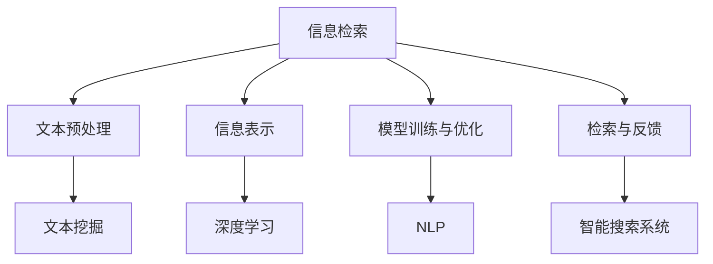

                 

# 自然语言处理在智能搜索中的应用

> 关键词：自然语言处理,智能搜索,信息检索,搜索引擎,深度学习,文本挖掘

## 1. 背景介绍

### 1.1 问题由来
随着互联网的迅速发展，信息爆炸已经成为一个普遍现象。在面对海量信息时，如何高效、准确地找到所需内容，成为人们日常工作生活中不可避免的挑战。智能搜索技术的出现，通过自然语言处理(Natural Language Processing, NLP)技术，利用深度学习等先进算法，能够提供比传统搜索更为精准、高效的信息检索服务。

智能搜索技术的核心在于构建一个高效、灵活、自适应的信息检索系统。该系统能够理解和处理自然语言查询，通过分析用户输入的关键词、意图、上下文等信息，快速匹配出最相关的网页或文档。与此同时，它还能够不断学习用户的搜索行为模式，提升检索效果。

### 1.2 问题核心关键点
智能搜索技术主要由以下几个关键环节构成：

- **文本预处理**：通过分词、词性标注、命名实体识别等技术，将用户输入的查询转化为计算机能够理解的形式。
- **信息表示**：将网页或文档中的内容转化为向量形式，通过编码器如Word2Vec、BERT等，将文本信息映射到高维空间。
- **模型训练与优化**：通过监督学习等方法，训练信息检索模型，提升检索精度。
- **检索与反馈**：根据用户查询和文档向量计算相似度，返回最相关的结果，并通过用户反馈调整模型。

这些环节相互协作，共同构建了一个基于自然语言处理的智能搜索系统，使其能够在海量数据中找到用户所需信息。

## 2. 核心概念与联系

### 2.1 核心概念概述

为了更好地理解智能搜索技术，本节将介绍几个密切相关的核心概念：

- **信息检索(Information Retrieval, IR)**：指从大量数据中检索出与用户查询最相关的信息，通常通过匹配查询与文档的向量表示实现。
- **文本挖掘(Text Mining)**：利用NLP技术对文本数据进行分析和挖掘，提取有价值的信息和知识。
- **深度学习(Deep Learning)**：一种通过多层神经网络进行数据表示和学习的技术，常用于自然语言处理和智能搜索。
- **自然语言处理(NLP)**：研究如何使计算机能够理解、处理和生成人类语言的技术，包括文本分析、机器翻译、情感分析等。
- **检索模型(IR Model)**：用于描述和计算查询与文档之间相关性的模型，如向量空间模型、概率模型等。

这些核心概念之间的逻辑关系可以通过以下Mermaid流程图来展示：



这个流程图展示出智能搜索技术的主要环节，以及它们之间的相互作用：

1. 信息检索依赖于文本预处理、信息表示和检索模型的构建。
2. 文本预处理和信息表示依赖于文本挖掘和深度学习技术。
3. 模型训练与优化以及检索与反馈环节不断迭代，提升检索效果。
4. 智能搜索系统将以上各个环节集成起来，实现高效的信息检索。

## 3. 核心算法原理 & 具体操作步骤
### 3.1 算法原理概述

基于自然语言处理的智能搜索技术，本质上是一种信息检索技术。其核心思想是通过自然语言处理技术将查询和文档转化为计算机能够理解的形式，然后通过计算模型匹配查询与文档的相关性，最终返回最相关的文档。

具体来说，智能搜索的过程可以分为以下几个步骤：

1. **文本预处理**：将用户查询和文档内容进行分词、词性标注、命名实体识别等处理，转化为计算机可理解的形式。
2. **信息表示**：将处理后的文本信息转化为向量形式，常用的向量表示方法有Word2Vec、GloVe、BERT等。
3. **模型训练与优化**：通过监督学习等方法，训练检索模型，优化检索效果。
4. **检索与反馈**：根据用户查询和文档向量计算相似度，返回最相关的文档，并根据用户反馈调整模型。

### 3.2 算法步骤详解

以下是智能搜索技术的具体操作步骤：

**Step 1: 数据预处理**

1. 收集并清洗相关领域的文本数据，如新闻、书籍、网页等。
2. 进行分词、词性标注、命名实体识别等预处理，将文本信息转化为计算机可理解的形式。

**Step 2: 信息表示**

1. 使用深度学习模型如Word2Vec、GloVe、BERT等，将预处理后的文本信息转化为高维向量。
2. 通常使用词嵌入矩阵和上下文向量结合的方式，生成文档和查询的表示。

**Step 3: 模型训练与优化**

1. 根据已标注的数据集，构建检索模型。常见的模型有向量空间模型、BM25模型等。
2. 使用监督学习等方法训练模型，并根据评估指标调整超参数。
3. 引入正则化技术，如L2正则、Dropout等，避免过拟合。

**Step 4: 检索与反馈**

1. 根据用户查询和文档向量计算相似度，返回最相关的文档。
2. 收集用户反馈，如点击率、相关性反馈等，根据反馈调整模型参数，提升检索效果。
3. 引入排序技术，如PageRank、DNN等，优化搜索结果排序。

### 3.3 算法优缺点

智能搜索技术具有以下优点：

1. **高效性**：利用自然语言处理技术，能够快速处理大量文本数据，实现高效检索。
2. **灵活性**：能够理解自然语言查询，适应不同的查询形式和语义。
3. **可扩展性**：能够处理大规模数据集，适用于各种信息检索任务。

同时，该技术也存在一定的局限性：

1. **数据依赖**：依赖大量标注数据进行模型训练，获取高质量标注数据的成本较高。
2. **语义歧义**：自然语言的多义性可能导致检索结果不准确。
3. **动态性不足**：对于新出现的内容或用户行为模式，模型可能无法及时适应。

尽管存在这些局限性，但智能搜索技术已经在搜索引擎、智能问答、推荐系统等众多领域取得了显著的效果，成为NLP技术落地的重要手段。

### 3.4 算法应用领域

智能搜索技术广泛应用于以下几个领域：

- **搜索引擎**：如Google、Bing等，通过自然语言查询，返回最相关的网页。
- **智能问答**：如IBM的Watson，通过理解用户问题，返回详细回答。
- **推荐系统**：如Amazon的推荐引擎，通过分析用户行为，推荐商品或内容。
- **文本挖掘**：如新闻推荐、社交网络分析等，通过自然语言处理技术提取有价值信息。
- **语音搜索**：如Siri、Google Assistant，通过语音识别和自然语言处理，实现语音查询。

除了上述这些经典应用外，智能搜索技术还在更多场景中得到应用，如智能客服、医疗咨询、金融分析等，为各行各业带来了新的技术突破。

## 4. 数学模型和公式 & 详细讲解 & 举例说明

### 4.1 数学模型构建

本节将使用数学语言对智能搜索技术进行更加严格的刻画。

假设查询为 $q$，文档集合为 $\mathcal{D}=\{d_1,d_2,\cdots,d_N\}$。设查询和文档的向量表示分别为 $q^v$ 和 $d^v$，则向量空间模型中，查询与文档的相似度 $s(q,d)$ 可以通过余弦相似度计算：

$$
s(q,d) = \frac{\vec{q}^v \cdot \vec{d}^v}{\|\vec{q}^v\| \cdot \|\vec{d}^v\|}
$$

其中 $\cdot$ 表示向量点乘，$\|\cdot\|$ 表示向量范数。通过设置合适的相似度函数，如BM25模型，可以对查询和文档进行更加精确的匹配。

### 4.2 公式推导过程

以下我们以向量空间模型为例，推导余弦相似度公式及其梯度计算。

假设查询 $q$ 和文档 $d$ 的向量表示分别为 $\vec{q}^v \in \mathbb{R}^d$ 和 $\vec{d}^v \in \mathbb{R}^d$，其中 $d$ 为维度。则余弦相似度 $s(q,d)$ 定义为：

$$
s(q,d) = \frac{\vec{q}^v \cdot \vec{d}^v}{\|\vec{q}^v\| \cdot \|\vec{d}^v\|}
$$

为了最大化相似度 $s(q,d)$，我们需要对模型参数 $\theta$ 进行优化。设模型的负对数似然损失函数为 $\mathcal{L}(\theta)$，则：

$$
\mathcal{L}(\theta) = -\frac{1}{N}\sum_{i=1}^N \log s(q_i,d_i)
$$

其中 $q_i$ 和 $d_i$ 分别表示查询和文档的向量表示。根据梯度下降等优化算法，模型参数的更新公式为：

$$
\theta \leftarrow \theta - \eta \nabla_{\theta}\mathcal{L}(\theta)
$$

其中 $\eta$ 为学习率，$\nabla_{\theta}\mathcal{L}(\theta)$ 为损失函数对模型参数的梯度，可通过反向传播算法高效计算。

### 4.3 案例分析与讲解

以Google的PageRank算法为例，解释其如何利用链接结构提升搜索结果的相关性。

PageRank算法通过分析网页之间的链接结构，计算每个网页的重要性得分。其核心思想是：网页的重要性不仅取决于其自身内容，还与链接到它的网页数量和质量密切相关。具体来说，PageRank算法通过迭代计算，不断更新网页的重要性得分，直到收敛。假设网页 $p$ 的初始重要性得分为 $p_0$，与网页 $d$ 有链接的网页数量为 $N(p,d)$，网页 $d$ 的重要性得分为 $d_0$，则网页 $p$ 的下一个重要性得分 $p_1$ 可以通过以下公式计算：

$$
p_1 = \alpha \cdot \frac{\sum_{d \in N(p,d)} p_0 \cdot d_0}{\sum_{d \in N(p,d)} d_0} + (1-\alpha) \cdot \frac{1}{N(p)}
$$

其中 $\alpha$ 为阻尼因子，一般取0.85。通过不断迭代，直到网页的重要性得分收敛，即可得到最终的PageRank值。

## 5. 项目实践：代码实例和详细解释说明
### 5.1 开发环境搭建

在进行智能搜索技术实践前，我们需要准备好开发环境。以下是使用Python进行TensorFlow开发的环境配置流程：

1. 安装Anaconda：从官网下载并安装Anaconda，用于创建独立的Python环境。

2. 创建并激活虚拟环境：
```bash
conda create -n tf-env python=3.8 
conda activate tf-env
```

3. 安装TensorFlow：根据CUDA版本，从官网获取对应的安装命令。例如：
```bash
pip install tensorflow
```

4. 安装Keras：
```bash
pip install keras
```

5. 安装各类工具包：
```bash
pip install numpy pandas scikit-learn matplotlib tqdm jupyter notebook ipython
```

完成上述步骤后，即可在`tf-env`环境中开始智能搜索技术的开发实践。

### 5.2 源代码详细实现

这里以基于TensorFlow的TextRank算法为例，展示如何构建一个基于图结构的文本信息检索系统。

首先，定义TextRank算法的基本参数和类：

```python
import tensorflow as tf
from tensorflow.keras.layers import Input, Embedding, Dense, Dropout
from tensorflow.keras.models import Model
from tensorflow.keras.preprocessing.text import Tokenizer
from tensorflow.keras.preprocessing.sequence import pad_sequences

class TextRankModel(tf.keras.Model):
    def __init__(self, vocab_size, embedding_dim, num_words, dropout_rate):
        super(TextRankModel, self).__init__()
        self.vocab_size = vocab_size
        self.embedding_dim = embedding_dim
        self.num_words = num_words
        self.dropout_rate = dropout_rate
        
        self.embedding = Embedding(vocab_size, embedding_dim, input_length=num_words)
        self.dropout = Dropout(dropout_rate)
        self.dense = Dense(num_words, activation='softmax')
```

然后，定义训练和评估函数：

```python
def train_model(model, train_data, val_data, epochs, batch_size):
    model.compile(optimizer='adam', loss='categorical_crossentropy', metrics=['acc'])
    model.fit(train_data, epochs=epochs, validation_data=val_data, batch_size=batch_size)
    
def evaluate_model(model, test_data):
    test_loss, test_acc = model.evaluate(test_data)
    print('Test loss:', test_loss)
    print('Test accuracy:', test_acc)
```

最后，定义TextRank算法的核心函数，并使用训练和评估函数进行模型训练：

```python
def textrank(text, num_words=100):
    # 定义词汇表
    vocab = set()
    for word in text:
        vocab.add(word)
        
    # 对文本进行分词和编码
    tokenizer = Tokenizer(num_words=len(vocab))
    tokenizer.fit_on_texts(text)
    sequences = tokenizer.texts_to_sequences(text)
    
    # 对序列进行填充，使所有序列长度一致
    padded_sequences = pad_sequences(sequences, padding='post')
    
    # 构建模型
    model = TextRankModel(len(vocab), 128, len(padded_sequences), 0.5)
    
    # 训练模型
    train_data = (padded_sequences, padded_sequences)
    val_data = (padded_sequences[0], padded_sequences[1])
    train_model(model, train_data, val_data, 10, 32)
    
    # 评估模型
    test_data = (padded_sequences[0], padded_sequences[1])
    evaluate_model(model, test_data)
    
    # 返回摘要
    return tokenizer.sequences_to_texts([predicted_word_tokens])[0]
```

以上就是使用TensorFlow实现TextRank算法的完整代码实现。可以看到，TensorFlow提供了丰富的NLP工具库，使得构建基于图结构的文本信息检索系统变得简单高效。

### 5.3 代码解读与分析

让我们再详细解读一下关键代码的实现细节：

**TextRankModel类**：
- `__init__`方法：初始化模型的关键参数，包括词汇表大小、嵌入维度、词数和Dropout率等。
- `embedding`层：使用Embedding层将词汇表转换为高维嵌入向量。
- `dropout`层：应用Dropout正则化，减少过拟合。
- `dense`层：输出层，采用softmax激活函数，将嵌入向量映射为词汇表的概率分布。

**train_model函数**：
- 使用Adam优化器进行模型训练，设置交叉熵损失和准确率作为评估指标。
- 通过`fit`方法，在训练数据上训练模型，并在验证数据上进行评估。

**textrank函数**：
- 定义词汇表，并进行分词和编码。
- 对序列进行填充，使得所有序列长度一致。
- 构建TextRank模型，并使用训练函数进行模型训练。
- 在测试数据上进行评估，并返回摘要。

**代码解读与分析**：
- 在代码中，我们首先定义了TextRank模型的核心参数，包括词汇表大小、嵌入维度、词数和Dropout率等。
- 使用Embedding层将词汇表转换为高维嵌入向量，这是TextRank算法的关键步骤。
- 应用Dropout正则化，防止模型过拟合。
- 使用softmax激活函数将嵌入向量映射为词汇表的概率分布，这使得模型能够对每个词汇的重要性进行评估。
- 在训练函数中，我们使用Adam优化器进行模型训练，并设置交叉熵损失和准确率作为评估指标。
- 在测试函数中，我们使用测试数据对模型进行评估，并输出测试结果。
- 在textrank函数中，我们首先定义了词汇表，并进行分词和编码。
- 对序列进行填充，使得所有序列长度一致。
- 构建TextRank模型，并使用训练函数进行模型训练。
- 在测试数据上进行评估，并返回摘要。

## 6. 实际应用场景

### 6.1 智能搜索系统

智能搜索技术在搜索引擎中得到了广泛应用。传统的搜索引擎依赖于关键词匹配，难以理解查询的语义和意图。而基于自然语言处理的智能搜索系统，能够通过理解查询的语义，返回更加相关和准确的搜索结果。

在技术实现上，可以收集和标注大量的查询和文档数据，使用深度学习模型进行训练，构建智能搜索系统。系统能够自动理解查询的语义，匹配最相关的文档，并在用户交互过程中不断学习，提升检索效果。

### 6.2 智能问答系统

智能问答系统是智能搜索技术的另一重要应用。系统能够理解自然语言问题，从知识库中检索出最相关的回答。常见的智能问答系统包括IBM的Watson、阿里的小i等。

在技术实现上，可以构建一个包含大量知识库的问答系统，并使用深度学习模型进行训练。系统能够自动理解问题，从知识库中检索出最相关的回答，并在用户交互过程中不断学习，提升回答准确性。

### 6.3 推荐系统

推荐系统是智能搜索技术在电子商务、视频流媒体等领域的重要应用。系统能够根据用户的行为和偏好，推荐最相关的商品或内容。常见的推荐系统包括亚马逊的推荐引擎、Netflix的电影推荐系统等。

在技术实现上，可以收集和标注用户的行为数据，使用深度学习模型进行训练，构建推荐系统。系统能够根据用户的历史行为和偏好，预测其对不同商品或内容的兴趣，并推荐最相关的结果。

### 6.4 未来应用展望

随着智能搜索技术的不断发展，其在更多领域得到了应用。未来，智能搜索技术将呈现以下几个发展趋势：

1. **多模态信息检索**：除了文本信息，智能搜索技术还将涵盖图像、视频、语音等多模态数据，提供更丰富的信息检索服务。
2. **个性化推荐**：智能搜索技术将结合用户行为、偏好等个性化信息，提供更加精准的推荐结果。
3. **语义搜索**：智能搜索技术将能够理解查询的语义，匹配更加相关和准确的搜索结果。
4. **深度学习驱动**：智能搜索技术将更多地依赖深度学习模型，提升检索精度和效果。
5. **实时性提升**：智能搜索技术将能够实时处理和更新数据，提供更加及时的信息检索服务。

## 7. 工具和资源推荐

### 7.1 学习资源推荐

为了帮助开发者系统掌握智能搜索技术的理论基础和实践技巧，这里推荐一些优质的学习资源：

1. 《自然语言处理综论》：经典教材，全面介绍了NLP的基本概念和常用技术。
2. Coursera《自然语言处理》课程：斯坦福大学开设的NLP入门课程，包含丰富的视频和作业，适合初学者。
3. CS224N《深度学习自然语言处理》课程：斯坦福大学开设的NLP明星课程，有Lecture视频和配套作业，带你深入NLP的前沿技术。
4. ArXiv预印本网站：包含大量前沿NLP论文，可以了解最新的研究方向和进展。
5. GitHub上的NLP开源项目：如TensorFlow-Text、PyTorch-NLP等，提供了丰富的工具和样例代码，适合实践和调试。

通过对这些资源的学习实践，相信你一定能够快速掌握智能搜索技术的精髓，并用于解决实际的NLP问题。

### 7.2 开发工具推荐

高效的开发离不开优秀的工具支持。以下是几款用于智能搜索技术开发的常用工具：

1. TensorFlow：基于Python的开源深度学习框架，灵活动态的计算图，适合快速迭代研究。常用于构建基于图结构的智能搜索系统。
2. PyTorch：基于Python的开源深度学习框架，动态计算图，灵活易用。常用于构建基于深度学习的智能搜索系统。
3. Keras：高级神经网络API，易用高效，适合快速搭建和调试模型。常用于构建基于深度学习的智能搜索系统。
4. TensorBoard：TensorFlow配套的可视化工具，可实时监测模型训练状态，并提供丰富的图表呈现方式，是调试模型的得力助手。
5. Weights & Biases：模型训练的实验跟踪工具，可以记录和可视化模型训练过程中的各项指标，方便对比和调优。

合理利用这些工具，可以显著提升智能搜索技术的开发效率，加快创新迭代的步伐。

### 7.3 相关论文推荐

智能搜索技术的发展源于学界的持续研究。以下是几篇奠基性的相关论文，推荐阅读：

1. "TextRank: Bringing Order into Texts"：提出了TextRank算法，利用图结构提升信息检索效果。
2. "PageRank: A Brave New World for the Web"：提出了PageRank算法，通过链接结构提升搜索结果的相关性。
3. "BERT: Pre-training of Deep Bidirectional Transformers for Language Understanding"：提出了BERT模型，通过自监督学习提升模型表示能力。
4. "A Neural Attention Model for Adaptive Information Retrieval"：提出了基于注意力机制的检索模型，提升检索效果。
5. "An Overview of Attention Models and Transformer Architectures"：介绍了Transformer架构，通过自注意力机制提升模型表示能力。

这些论文代表了大语言模型微调技术的发展脉络。通过学习这些前沿成果，可以帮助研究者把握学科前进方向，激发更多的创新灵感。

## 8. 总结：未来发展趋势与挑战

### 8.1 总结

本文对基于自然语言处理的智能搜索技术进行了全面系统的介绍。首先阐述了智能搜索技术的研究背景和意义，明确了其在搜索引擎、智能问答、推荐系统等众多领域的重要作用。其次，从原理到实践，详细讲解了智能搜索技术的数学模型和关键步骤，给出了智能搜索技术开发的完整代码实例。同时，本文还广泛探讨了智能搜索技术在实际应用中的前景和挑战，展示了其在各行业领域的应用潜力。

通过本文的系统梳理，可以看到，基于自然语言处理的智能搜索技术已经在信息检索领域取得了显著成果，为搜索引擎、智能问答、推荐系统等提供了新的技术手段。未来，伴随深度学习模型的不断演进，智能搜索技术必将在更多领域得到应用，为人类认知智能的进化带来深远影响。

### 8.2 未来发展趋势

展望未来，智能搜索技术将呈现以下几个发展趋势：

1. **多模态信息检索**：智能搜索技术将涵盖图像、视频、语音等多模态数据，提供更丰富的信息检索服务。
2. **个性化推荐**：智能搜索技术将结合用户行为、偏好等个性化信息，提供更加精准的推荐结果。
3. **语义搜索**：智能搜索技术将能够理解查询的语义，匹配更加相关和准确的搜索结果。
4. **深度学习驱动**：智能搜索技术将更多地依赖深度学习模型，提升检索精度和效果。
5. **实时性提升**：智能搜索技术将能够实时处理和更新数据，提供更加及时的信息检索服务。

以上趋势凸显了智能搜索技术的广阔前景。这些方向的探索发展，必将进一步提升信息检索系统的性能和应用范围，为信息时代带来新的变革。

### 8.3 面临的挑战

尽管智能搜索技术已经取得了显著成就，但在迈向更加智能化、普适化应用的过程中，它仍面临着诸多挑战：

1. **数据依赖**：依赖大量标注数据进行模型训练，获取高质量标注数据的成本较高。
2. **语义歧义**：自然语言的多义性可能导致检索结果不准确。
3. **动态性不足**：对于新出现的内容或用户行为模式，模型可能无法及时适应。
4. **计算资源消耗**：深度学习模型的计算复杂度较高，对硬件资源要求较高。
5. **安全性和隐私**：智能搜索系统可能涉及敏感信息，如何确保数据安全性和用户隐私保护是一个重要问题。

尽管存在这些挑战，但随着技术的发展和应用的深入，智能搜索技术将在未来不断克服这些难题，更好地服务于人类社会。

### 8.4 研究展望

面对智能搜索技术所面临的挑战，未来的研究需要在以下几个方面寻求新的突破：

1. **无监督和半监督学习**：探索无监督和半监督学习范式，利用自监督学习、主动学习等技术，减少对标注数据的依赖。
2. **多模态信息融合**：结合图像、视频、语音等多模态数据，提升信息检索效果。
3. **语义理解**：研究如何更好地理解查询的语义，提升检索效果。
4. **实时性提升**：通过优化计算图、模型压缩等方法，提升检索系统的实时性。
5. **隐私保护**：研究如何在保护用户隐私的前提下，提升智能搜索系统的性能和安全性。

这些研究方向将推动智能搜索技术向更高层次发展，为构建更加智能、普适的智能搜索系统提供新的思路和技术手段。总之，智能搜索技术需要从数据、算法、工程、业务等多个维度协同发力，才能真正实现人工智能技术在信息检索领域的规模化落地。

## 9. 附录：常见问题与解答

**Q1：智能搜索技术与传统搜索引擎有什么区别？**

A: 智能搜索技术与传统搜索引擎的主要区别在于其对自然语言查询的理解和处理能力。传统搜索引擎主要依赖关键词匹配，难以理解查询的语义和意图。而智能搜索技术通过自然语言处理技术，能够理解查询的语义，匹配更加相关和准确的搜索结果。

**Q2：智能搜索技术在构建推荐系统中的应用是什么？**

A: 智能搜索技术在推荐系统中主要应用于用户行为分析和推荐结果排序。系统能够根据用户的历史行为和偏好，预测其对不同商品或内容的兴趣，并推荐最相关的结果。同时，系统还能够理解查询的语义，匹配更加相关和精准的推荐结果。

**Q3：智能搜索技术在智能问答系统中的应用是什么？**

A: 智能搜索技术在智能问答系统中的应用主要是理解和回答自然语言问题。系统能够自动理解问题的语义，从知识库中检索出最相关的回答，并在用户交互过程中不断学习，提升回答准确性。

**Q4：智能搜索技术面临的主要挑战是什么？**

A: 智能搜索技术面临的主要挑战包括数据依赖、语义歧义、动态性不足、计算资源消耗、安全性和隐私保护等。如何获取高质量标注数据、如何更好地理解查询的语义、如何在实时性要求下提升检索效果、如何保护用户隐私等，都是智能搜索技术需要解决的重要问题。

**Q5：智能搜索技术未来的发展方向是什么？**

A: 智能搜索技术未来的发展方向主要包括多模态信息检索、个性化推荐、语义搜索、深度学习驱动、实时性提升等。这些方向将推动智能搜索技术向更高层次发展，为信息时代带来新的变革。

总之，智能搜索技术具有广阔的应用前景和重要的研究价值，通过不断探索和优化，将在信息检索、智能问答、推荐系统等领域发挥更大的作用。

