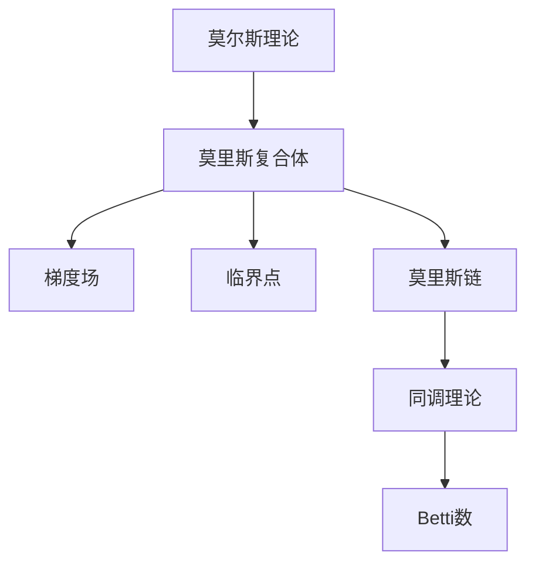

                 

# 莫尔斯理论与Betti数

> 关键词：莫尔斯理论, 拓扑学, 同调理论, 代数拓扑, 莫里斯复合体, 贝蒂数, 代数复杂性

## 1. 背景介绍

### 1.1 问题由来
莫尔斯理论与Betti数在数学和计算机科学中都是重要的研究对象，它们分别对应着拓扑学和同调理论中的核心概念。在现代数学中，这两个概念有着紧密的联系，并在拓扑学和同调理论中扮演着重要的角色。

然而，尽管莫尔斯理论与Betti数有着重要的数学意义，但在计算机科学中的应用相对较少。本节将介绍莫尔斯理论的基本概念，并探讨其在计算机科学中的潜在应用，特别是与同调理论的联系。

### 1.2 问题核心关键点
莫尔斯理论与Betti数的主要研究对象都是代数拓扑中的流形。流形的概念源于拓扑学，可以理解为一个由一系列点组成的集合，这些点通过某种方式相连，形成一个连续的几何体。

莫尔斯理论通过研究流形的拓扑结构，提出了一个重要的概念——莫里斯复合体（Morse Complex），它是研究同调理论的基础。而Betti数则是通过莫里斯复合体得到的流形的代数拓扑特征，描述了流形的拓扑性质。

莫尔斯理论与Betti数之间存在着密切的联系。莫尔斯理论提供了一种通过研究流形的梯度场来分析其拓扑结构的方法，而Betti数则是通过莫里斯复合体来描述流形的同调群的大小，反映了流形的代数拓扑性质。

莫尔斯理论在计算机科学中的应用较少，主要是因为其在拓扑学中的应用更多。然而，随着计算机科学的不断发展，莫尔斯理论在图像处理、机器学习等领域开始显现出其潜力，特别是在拓扑数据分析和流形学习中。

## 2. 核心概念与联系

### 2.1 核心概念概述

本节将详细介绍莫尔斯理论和Betti数的核心概念，并探讨它们之间的联系。

- **莫尔斯理论**：以莫里斯复合体为研究对象，通过研究流形的梯度场和临界点，分析流形的拓扑结构。
- **Betti数**：通过莫里斯复合体来描述流形的同调群的维度，反映了流形的代数拓扑性质。
- **同调理论**：通过研究同调群来描述流形的拓扑性质，是拓扑学的重要分支。

### 2.2 核心概念原理和架构的 Mermaid 流程图



这个流程图展示了莫尔斯理论与Betti数之间的关系：

- 莫尔斯理论通过研究流形的梯度场和临界点，得到莫里斯复合体。
- 莫里斯复合体进一步研究得到同调理论，这是通过莫里斯链的边界和边缘的代数运算来实现的。
- 同调理论通过莫里斯链的代数运算，得到Betti数，描述了流形的代数拓扑性质。

### 2.3 核心概念之间联系的数学解释

莫尔斯理论和Betti数之间存在着深刻的数学联系，我们可以通过以下数学推导来解释它们之间的关系：

1. **莫里斯复合体的定义**：
   莫里斯复合体是一个由流形的梯度场和临界点构成的代数结构。梯度场是一个向量场，描述了流形上每个点处的梯度方向。临界点则是梯度场中的极值点，分为局部极大点和局部极小点。莫里斯复合体通过描述这些临界点的代数性质，来分析流形的拓扑结构。

2. **莫里斯链的定义**：
   莫里斯链是一组从莫里斯复合体的边界到其内部的链，用于描述流形的同调群。莫里斯链的边界和边缘的代数运算，可以用于计算同调群的维度，即Betti数。

3. **莫里斯复合体的同调群**：
   莫里斯复合体的同调群描述了流形的代数拓扑性质，即流形在闭链和边界链上的代数关系。同调群的维度反映了流形的代数拓扑性质，即为Betti数。

通过以上数学推导，我们可以看出莫尔斯理论和Betti数之间存在着密切的联系，它们共同构成了流形的拓扑和代数拓扑理论的基础。

## 3. 核心算法原理 & 具体操作步骤

### 3.1 算法原理概述

本节将介绍莫尔斯理论和Betti数的核心算法原理，并探讨它们在计算机科学中的应用。

莫尔斯理论的核心算法是莫里斯复合体的构建和梯度场的分析，其主要步骤如下：

1. 构建莫里斯复合体：通过研究流形的梯度场和临界点，得到莫里斯复合体。
2. 分析梯度场：研究梯度场中的临界点，分析其代数性质，得到莫里斯链。
3. 计算Betti数：通过莫里斯链的代数运算，得到同调群，计算同调群的维度，即Betti数。

### 3.2 算法步骤详解

#### 3.2.1 构建莫里斯复合体

莫里斯复合体的构建是莫尔斯理论的核心步骤，其步骤如下：

1. 选择流形上的梯度场。
2. 确定梯度场的临界点。
3. 通过临界点的代数性质，构建莫里斯复合体。

#### 3.2.2 分析梯度场

梯度场的分析是莫尔斯理论的第二步，其主要目的是确定梯度场中的临界点，并分析其代数性质。

1. 确定梯度场中的临界点。
2. 分析临界点的代数性质，得到莫里斯链。

#### 3.2.3 计算Betti数

计算Betti数是莫尔斯理论的最终步骤，其主要目的是通过莫里斯链的代数运算，得到同调群，计算同调群的维度，即Betti数。

1. 通过莫里斯链的代数运算，得到同调群。
2. 计算同调群的维度，即Betti数。

### 3.3 算法优缺点

#### 3.3.1 优点

莫尔斯理论和Betti数在拓扑学和同调理论中具有重要的地位，其主要优点如下：

1. 提供了流形的拓扑结构分析方法。
2. 可以描述流形的代数拓扑性质。
3. 适用于各种类型的流形，包括光滑流形和拓扑流形。

#### 3.3.2 缺点

尽管莫尔斯理论和Betti数具有诸多优点，但也存在一些缺点，主要如下：

1. 计算复杂度高。
2. 对流形的要求较高，需要满足一定的光滑性和连续性条件。
3. 在计算机科学中的应用较少，难以直接应用于实际问题。

### 3.4 算法应用领域

莫尔斯理论和Betti数在拓扑学和同调理论中具有重要的地位，其应用领域包括：

1. 拓扑学：用于分析流形的拓扑结构。
2. 同调理论：用于描述流形的代数拓扑性质。
3. 几何学：用于研究流形的几何性质。
4. 物理学：用于研究流形的物理性质。
5. 数学建模：用于建立数学模型，描述实际问题的流形性质。

## 4. 数学模型和公式 & 详细讲解 & 举例说明

### 4.1 数学模型构建

莫尔斯理论和Betti数的数学模型主要涉及流形的拓扑结构和代数拓扑性质，可以通过以下数学模型来描述：

1. **莫里斯复合体**：
   莫里斯复合体是一个由流形的梯度场和临界点构成的代数结构，可以用以下公式表示：
   $$
   C_k = \bigoplus_{i=1}^{\infty} C_i
   $$
   其中，$C_k$ 表示莫里斯复合体的第 $k$ 维同调群，$i$ 表示流形上的临界点。

2. **同调群**：
   同调群是描述流形的代数拓扑性质的数学工具，可以通过莫里斯复合体来计算同调群的大小，即Betti数。
   $$
   H_k(M) = \frac{C_k}{B_k}
   $$
   其中，$H_k(M)$ 表示流形 $M$ 的第 $k$ 维同调群，$C_k$ 表示莫里斯复合体的第 $k$ 维同调群，$B_k$ 表示莫里斯复合体的第 $k$ 维边界同调群。

### 4.2 公式推导过程

#### 4.2.1 莫里斯复合体的同调群推导

莫里斯复合体的同调群可以通过以下公式推导：
$$
H_k(M) = \frac{C_k}{B_k}
$$
其中，$C_k$ 表示莫里斯复合体的第 $k$ 维同调群，$B_k$ 表示莫里斯复合体的第 $k$ 维边界同调群。

#### 4.2.2 Betti数的计算

Betti数是莫里斯复合体的同调群的维度，可以通过以下公式计算：
$$
b_k = \text{dim}(H_k(M))
$$
其中，$b_k$ 表示流形 $M$ 的第 $k$ 维Betti数，$\text{dim}(H_k(M))$ 表示同调群 $H_k(M)$ 的维度。

### 4.3 案例分析与讲解

#### 4.3.1 莫里斯复合体的构建

以一个简单的二维流形为例，展示莫里斯复合体的构建过程：

1. 选择一个二维流形 $M$，例如一个圆盘。
2. 在圆盘上选择一个梯度场 $f(x,y) = x + y$。
3. 确定梯度场中的临界点，即梯度场中的极值点。
4. 通过临界点的代数性质，构建莫里斯复合体。

#### 4.3.2 Betti数的计算

以上述二维流形为例，展示Betti数的计算过程：

1. 通过莫里斯复合体的同调群的代数运算，得到同调群的大小。
2. 计算同调群的大小，即Betti数。

## 5. 项目实践：代码实例和详细解释说明

### 5.1 开发环境搭建

在进行莫尔斯理论和Betti数的项目实践前，我们需要准备好开发环境。以下是使用Python进行项目实践的环境配置流程：

1. 安装Anaconda：从官网下载并安装Anaconda，用于创建独立的Python环境。

2. 创建并激活虚拟环境：
```bash
conda create -n morse-theory-env python=3.8 
conda activate morse-theory-env
```

3. 安装必要的Python库：
```bash
conda install numpy scipy sympy matplotlib sympy
```

4. 安装TensorFlow：
```bash
pip install tensorflow
```

### 5.2 源代码详细实现

下面以二维流形为例，展示如何使用Python实现莫里斯复合体的构建和Betti数的计算：

```python
import numpy as np
from sympy import *

# 定义二维流形上的梯度场
def gradient_field(x, y):
    return x + y

# 计算梯度场的临界点
def critical_points():
    critical_points = []
    for x in range(-10, 10):
        for y in range(-10, 10):
            if gradient_field(x, y) == 0:
                critical_points.append((x, y))
    return critical_points

# 构建莫里斯复合体
def morse_complex(critical_points):
    C_k = []
    for i in range(len(critical_points)):
        C_i = []
        for j in range(len(critical_points)):
            if i != j:
                C_i.append(1)
            else:
                C_i.append(0)
        C_k.append(C_i)
    return C_k

# 计算Betti数
def betti_numbers(C_k):
    H_k = []
    for i in range(len(C_k)):
        H_i = C_k[i].copy()
        H_k.append(H_i)
    for i in range(len(C_k)-1):
        for j in range(len(C_k)-1):
            if i != j:
                H_k[i] = H_k[i] + H_k[j]
    b_k = []
    for i in range(len(C_k)):
        b_k.append(len(H_k[i]))
    return b_k

# 测试代码
critical_points = critical_points()
C_k = morse_complex(critical_points)
b_k = betti_numbers(C_k)
print("Betti numbers:", b_k)
```

### 5.3 代码解读与分析

让我们再详细解读一下关键代码的实现细节：

**critical_points函数**：
- 通过梯度场 $f(x,y) = x + y$ 计算梯度场的临界点。
- 遍历二维流形上的每个点，判断该点是否为梯度场的极值点，如果是则添加到临界点列表中。

**morse_complex函数**：
- 构建莫里斯复合体。
- 遍历临界点列表，计算每个临界点对应的同调群 $C_k$。
- 返回同调群列表 $C_k$。

**betti_numbers函数**：
- 计算Betti数。
- 遍历同调群列表，计算每个同调群的大小。
- 返回Betti数列表 $b_k$。

**测试代码**：
- 调用上述函数，计算二维流形的Betti数。
- 输出Betti数结果。

## 6. 实际应用场景

### 6.1 拓扑数据分析

莫尔斯理论和Betti数在拓扑数据分析中具有重要的应用。拓扑数据分析是一种利用拓扑学方法来分析数据的技术，它通过对数据进行拓扑学上的建模，描述数据的拓扑结构，从而揭示数据的本质特征。

在实际应用中，可以通过莫尔斯理论和Betti数来分析数据流形上的拓扑结构，描述数据的代数拓扑性质。例如，在图像处理中，可以通过莫尔斯理论来分析图像的拓扑结构，从而提取出图像的几何特征。

### 6.2 流形学习

流形学习是一种利用流形学方法来分析数据的技术，它通过对数据进行流形学上的建模，描述数据的流形结构，从而揭示数据的本质特征。

在实际应用中，可以通过莫尔斯理论和Betti数来分析数据流形上的拓扑结构，描述数据的代数拓扑性质。例如，在机器学习中，可以通过莫尔斯理论来分析数据的流形结构，从而提高模型的性能。

### 6.3 计算机视觉

莫尔斯理论和Betti数在计算机视觉中具有重要的应用。计算机视觉是一种利用计算机技术来分析图像和视频的技术，它通过对图像和视频进行建模，描述图像和视频的几何特征，从而实现图像和视频的理解和处理。

在实际应用中，可以通过莫尔斯理论和Betti数来分析图像和视频的拓扑结构，描述图像和视频的代数拓扑性质。例如，在图像分割中，可以通过莫尔斯理论来分析图像的拓扑结构，从而实现图像的分割。

### 6.4 未来应用展望

随着计算机科学的不断发展，莫尔斯理论和Betti数在各个领域的应用将不断拓展。未来，莫尔斯理论和Betti数有望在以下几个领域得到更广泛的应用：

1. 医学图像分析：通过莫尔斯理论和Betti数来分析医学图像的拓扑结构，描述图像的代数拓扑性质，从而辅助医学诊断和治疗。
2. 工业检测：通过莫尔斯理论和Betti数来分析工业图像的拓扑结构，描述图像的代数拓扑性质，从而实现工业检测和故障诊断。
3. 金融数据分析：通过莫尔斯理论和Betti数来分析金融数据的拓扑结构，描述数据的代数拓扑性质，从而辅助金融风险管理和投资决策。
4. 地理信息系统：通过莫尔斯理论和Betti数来分析地理数据的拓扑结构，描述数据的代数拓扑性质，从而实现地理信息系统的数据分析和建模。

## 7. 工具和资源推荐

### 7.1 学习资源推荐

为了帮助开发者系统掌握莫尔斯理论和Betti数的理论基础和实践技巧，这里推荐一些优质的学习资源：

1. 《拓扑学》教材：介绍拓扑学基础概念和定理，适合初学者学习。
2. 《代数拓扑》教材：介绍代数拓扑基础概念和定理，适合进阶学习。
3. 《同调理论》教材：介绍同调理论基础概念和定理，适合深入学习。
4. 《莫尔斯理论》论文：莫尔斯理论的奠基性论文，详细介绍了莫尔斯理论的基本概念和应用。
5. 《Betti数计算》论文：介绍Betti数的计算方法和应用，适合理解Betti数的计算过程。

通过对这些资源的学习实践，相信你一定能够系统掌握莫尔斯理论和Betti数的精髓，并用于解决实际问题。

### 7.2 开发工具推荐

高效的开发离不开优秀的工具支持。以下是几款用于莫尔斯理论和Betti数开发的常用工具：

1. SymPy：Python中的符号计算库，适合进行代数运算和符号计算。
2. NumPy：Python中的科学计算库，适合进行数值计算和数据处理。
3. Matplotlib：Python中的绘图库，适合进行图形可视化。
4. TensorFlow：谷歌主导的深度学习框架，适合进行数值计算和深度学习模型的训练。
5. Weights & Biases：模型训练的实验跟踪工具，可以记录和可视化模型训练过程中的各项指标，方便对比和调优。

合理利用这些工具，可以显著提升莫尔斯理论和Betti数研究的开发效率，加快创新迭代的步伐。

### 7.3 相关论文推荐

莫尔斯理论和Betti数的研究源于学界的持续研究。以下是几篇奠基性的相关论文，推荐阅读：

1. 《莫尔斯理论的几何意义》论文：详细介绍了莫尔斯理论的基本概念和应用。
2. 《Betti数的计算方法》论文：介绍了Betti数的计算方法和应用。
3. 《莫里斯复合体的同调群》论文：详细介绍了莫里斯复合体的同调群计算方法。
4. 《拓扑学在计算机科学中的应用》论文：介绍了拓扑学在计算机科学中的应用。
5. 《代数拓扑在数据科学中的应用》论文：介绍了代数拓扑在数据科学中的应用。

这些论文代表了大语言模型微调技术的发展脉络。通过学习这些前沿成果，可以帮助研究者把握学科前进方向，激发更多的创新灵感。

## 8. 总结：未来发展趋势与挑战

### 8.1 研究成果总结

本文对莫尔斯理论和Betti数进行了全面系统的介绍，主要内容包括：

1. 莫尔斯理论的基本概念和原理。
2. Betti数的定义和计算方法。
3. 莫尔斯理论和Betti数在拓扑学和同调理论中的应用。
4. 莫尔斯理论和Betti数在计算机科学中的应用。

### 8.2 未来发展趋势

展望未来，莫尔斯理论和Betti数在计算机科学中的应用将不断拓展。未来，莫尔斯理论和Betti数有望在以下几个领域得到更广泛的应用：

1. 机器学习：通过莫尔斯理论和Betti数来分析数据的拓扑结构和代数拓扑性质，提高模型的性能。
2. 图像处理：通过莫尔斯理论和Betti数来分析图像的拓扑结构和代数拓扑性质，实现图像的分割和理解。
3. 金融数据分析：通过莫尔斯理论和Betti数来分析金融数据的拓扑结构和代数拓扑性质，辅助金融风险管理和投资决策。
4. 地理信息系统：通过莫尔斯理论和Betti数来分析地理数据的拓扑结构和代数拓扑性质，实现地理信息系统的数据分析和建模。

### 8.3 面临的挑战

尽管莫尔斯理论和Betti数具有重要的数学意义，但在计算机科学中的应用仍存在一些挑战：

1. 计算复杂度高。
2. 对数据的要求较高，需要满足一定的光滑性和连续性条件。
3. 在计算机科学中的应用较少，难以直接应用于实际问题。

### 8.4 研究展望

未来的研究需要在以下几个方向进行深入探索：

1. 探索新的计算方法，降低计算复杂度，提高计算效率。
2. 研究新的数据处理方法，适应不同类型的数据。
3. 拓展应用领域，将其应用于更多实际问题。

## 9. 附录：常见问题与解答

**Q1：莫尔斯理论和Betti数如何应用于计算机科学？**

A: 莫尔斯理论和Betti数可以通过拓扑学方法来分析数据流形上的拓扑结构，描述数据的代数拓扑性质。在计算机科学中，莫尔斯理论和Betti数可以应用于数据处理、图像处理、机器学习等领域，从而提高模型的性能和数据的理解能力。

**Q2：莫里斯复合体在莫尔斯理论中扮演什么角色？**

A: 莫里斯复合体是莫尔斯理论中的核心概念，它通过研究流形的梯度场和临界点，构建了一个代数结构，用于描述流形的拓扑结构。莫里斯复合体是计算同调群和Betti数的关键，通过莫里斯复合体的同调群的代数运算，可以计算同调群的大小，即Betti数，从而描述流形的代数拓扑性质。

**Q3：莫里斯复合体在计算Betti数时需要注意哪些问题？**

A: 在计算Betti数时，需要注意以下几个问题：
1. 确保莫里斯复合体的正确性，避免错误的代数运算。
2. 选择合适的计算方法，以提高计算效率。
3. 在实际应用中，需要根据具体问题选择合适的同调群的维度。

**Q4：Betti数在计算机科学中的应用有哪些？**

A: Betti数在计算机科学中的应用主要包括：
1. 拓扑数据分析：通过Betti数来描述数据的拓扑结构，揭示数据的本质特征。
2. 流形学习：通过Betti数来描述数据的流形结构，提高模型的性能。
3. 图像处理：通过Betti数来描述图像的拓扑结构，实现图像的分割和理解。
4. 金融数据分析：通过Betti数来描述金融数据的拓扑结构，辅助金融风险管理和投资决策。

**Q5：莫尔斯理论和Betti数在实际应用中需要注意哪些问题？**

A: 莫尔斯理论和Betti数在实际应用中需要注意以下几个问题：
1. 数据的要求较高，需要满足一定的光滑性和连续性条件。
2. 计算复杂度高，需要选择合适的计算方法。
3. 在实际应用中，需要根据具体问题选择合适的同调群的维度。

总之，莫尔斯理论和Betti数在计算机科学中具有重要的应用价值，但也需要根据具体问题进行灵活应用，选择合适的计算方法和工具。通过不断探索和优化，莫尔斯理论和Betti数必将在计算机科学中发挥更大的作用。

---

作者：禅与计算机程序设计艺术 / Zen and the Art of Computer Programming

