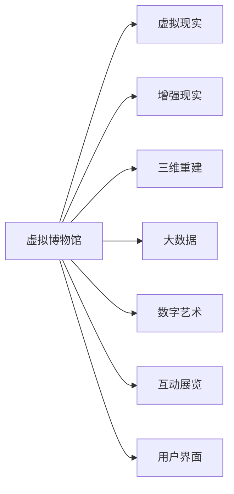

                 

# 虚拟博物馆策展:全球文化遗产的数字化展示

> 关键词：虚拟博物馆, 数字策展, 文化遗产, 三维重建, 增强现实, 虚拟现实, 大数据, 数字艺术, 互动展览, 用户界面

## 1. 背景介绍

### 1.1 问题由来
随着数字技术的发展，博物馆的展示方式正在发生革命性的变化。传统博物馆依赖实体展览空间和实物展品，具有时间和空间上的限制。然而，通过数字技术，博物馆可以打破这些限制，实现文化遗产的全球共享和互动体验。

全球范围内，博物馆已经积累了海量的数字化资料，包括高清图片、三维模型、声音、文本等。这些资源如果能够被充分利用，将极大地提升公众对于文化遗产的认知和兴趣。因此，数字化展示成为了博物馆展陈的重要方向。

### 1.2 问题核心关键点
数字化展示的核心是利用虚拟现实(VR)、增强现实(AR)、三维重建等技术，结合博物馆的数字化资料，打造沉浸式的体验环境。这种数字化展示形式具备以下优势：

1. **跨越时间和空间**：虚拟博物馆可以让观众随时随地进入，不受物理博物馆开放时间和地点的限制。
2. **多感官体验**：通过VR/AR技术，观众可以感受到真实世界中难以体验的互动和沉浸感。
3. **互动性强**：观众可以通过触摸、点击等方式，与虚拟展品进行互动，增加参与感和体验感。
4. **教育意义**：虚拟博物馆可以提供丰富的教育资源，帮助观众更好地理解文化遗产。

然而，数字化展示也面临诸多挑战：

1. **技术复杂性**：VR/AR技术的实现需要强大的硬件和软件支持，成本较高。
2. **用户体验**：如何设计用户友好的界面，提供良好的用户体验，是一个重要问题。
3. **数据管理**：如何高效地管理和展示海量数字化资料，是一个技术难题。
4. **版权和隐私**：数字化展示需要考虑文化遗产的版权保护和用户隐私问题。

为了应对这些挑战，本文将深入探讨虚拟博物馆的策展技术，包括虚拟现实、增强现实、三维重建、大数据等核心技术的应用，并提出具体的策略和实践方案。

## 2. 核心概念与联系

### 2.1 核心概念概述

虚拟博物馆是一个基于数字技术，结合博物馆数字化资料的展示平台。它通过VR/AR等技术，模拟博物馆的实体展览空间，提供沉浸式的观展体验。虚拟博物馆的策展技术主要包括以下几个方面：

- **虚拟现实(Virtual Reality, VR)**：利用计算机生成一个三维的虚拟环境，让用户可以通过头戴设备、手柄等硬件进行互动。
- **增强现实(Augmented Reality, AR)**：将虚拟信息叠加到现实世界的画面中，使用户能够在真实环境中看到虚拟信息。
- **三维重建(3D Reconstruction)**：通过扫描和重建技术，将实物展品转换成三维模型。
- **大数据(Big Data)**：利用大数据技术，对博物馆的数字化资料进行分析和处理，提供更深入的展示内容。
- **数字艺术(Digital Art)**：结合数字技术，创造新的艺术形式，丰富展览内容。
- **互动展览(Interactive Exhibition)**：提供互动功能，增强用户体验。
- **用户界面(User Interface, UI)**：设计友好的用户界面，提升用户体验。

这些核心概念之间的联系可以通过以下Mermaid流程图来展示：



这个流程图展示了大语言模型的核心概念及其之间的关系：

1. 虚拟博物馆是集成上述技术的展示平台。
2. VR、AR、三维重建等技术用于模拟博物馆的实体空间。
3. 大数据技术用于分析和处理博物馆的数字化资料。
4. 数字艺术和互动展览丰富了展示内容。
5. 用户界面设计影响用户体验。

这些概念共同构成了虚拟博物馆的策展技术框架，为其数字化展示提供了有力的技术支持。

## 3. 核心算法原理 & 具体操作步骤
### 3.1 算法原理概述

虚拟博物馆的策展技术涉及多个领域，包括计算机图形学、虚拟现实技术、增强现实技术、三维重建技术、大数据技术等。这些技术的核心算法原理包括：

- **虚拟现实**：通过计算机图形学技术，生成逼真的三维场景和动画，使用户能够进入虚拟环境。
- **增强现实**：将虚拟对象和信息叠加到真实世界，使用户能够在现实环境中看到虚拟内容。
- **三维重建**：使用扫描和重建技术，将实物展品转换成三维模型，提供数字化的展品资料。
- **大数据**：利用数据挖掘和机器学习技术，对博物馆的数字化资料进行分析，提取有价值的信息。
- **数字艺术**：结合数字技术，创造新的艺术形式，丰富展览内容。
- **互动展览**：使用触摸屏、手势识别等技术，增强用户与虚拟展品的互动。
- **用户界面**：设计用户友好的界面，提升用户体验。

这些技术的算法原理和操作步骤将作为后续章节的详细讲解。

### 3.2 算法步骤详解

#### 3.2.1 虚拟现实(VR)技术

**步骤1: 三维场景构建**
- 收集博物馆的实体展品资料，包括图片、视频、音频等。
- 使用三维扫描技术，获取展品的精确几何模型。
- 在三维建模软件中，根据扫描结果，构建展品的三维模型。
- 对三维模型进行纹理贴图、光照和渲染处理，提升视觉效果。

**步骤2: 虚拟场景模拟**
- 在虚拟现实引擎中，将三维模型导入，构建虚拟博物馆的室内外环境。
- 设置虚拟相机、灯光、材质等参数，调整场景效果。
- 加入虚拟角色和互动元素，增强用户体验。

**步骤3: 用户体验优化**
- 利用头戴设备（如Oculus Rift、HTC Vive），让用户进入虚拟博物馆。
- 通过手柄或控制器，用户可以与虚拟展品进行互动，如点击、拖动、放大等操作。
- 使用虚拟音频系统，提供沉浸式的音效体验。

#### 3.2.2 增强现实(AR)技术

**步骤1: 实时场景采集**
- 使用摄像头和传感器，采集用户的现实环境。
- 对采集的图像和传感器数据进行分析，提取关键信息。

**步骤2: 虚拟元素叠加**
- 根据关键信息，加载虚拟模型和动画，叠加到现实环境中。
- 使用图形处理技术，将虚拟元素与现实环境无缝融合。

**步骤3: 用户互动设计**
- 设计触摸屏、手势识别等互动功能，让用户与虚拟元素进行交互。
- 提供点击、拖拽、放大等操作方式，提升用户体验。

#### 3.2.3 三维重建技术

**步骤1: 实物扫描**
- 使用激光扫描仪、三维相机等设备，对实物展品进行扫描。
- 收集展品的几何信息和纹理信息，生成点云数据。

**步骤2: 三维建模**
- 使用三维建模软件，将点云数据转换成三维模型。
- 对模型进行修整和优化，确保模型的精度和细节。

**步骤3: 纹理贴图和渲染**
- 对三维模型进行纹理贴图处理，增强模型的真实感。
- 设置光源和渲染参数，生成高质量的渲染图像。

#### 3.2.4 大数据技术

**步骤1: 数据收集与存储**
- 收集博物馆的数字化资料，包括图片、视频、音频、文档等。
- 将收集的数据存储在云服务器或本地存储中，确保数据的安全性和可访问性。

**步骤2: 数据分析与处理**
- 使用大数据处理框架（如Hadoop、Spark），对数据进行分析和处理。
- 提取有价值的信息，如展品的历史背景、分类信息等。

**步骤3: 可视化展示**
- 使用数据可视化工具（如Tableau、D3.js），将分析结果展示给用户。
- 提供交互式的数据展示，让用户能够自由探索数据。

#### 3.2.5 数字艺术与互动展览

**步骤1: 数字艺术创作**
- 利用数字艺术软件（如Adobe After Effects、Blender），创作新的艺术作品。
- 结合博物馆的展品资料，创作具有博物馆特色的数字艺术作品。

**步骤2: 互动展览设计**
- 设计触摸屏、手势识别等互动功能，提升用户体验。
- 提供点击、拖拽、放大等操作方式，增强用户的参与感。

**步骤3: 展示与反馈**
- 将数字艺术作品和互动展览展示给用户。
- 收集用户的反馈，不断优化展览内容和互动设计。

#### 3.2.6 用户界面设计

**步骤1: 界面设计原则**
- 设计简洁、易用的用户界面，提升用户体验。
- 确保界面的一致性和易用性，方便用户操作。

**步骤2: 界面布局**
- 合理布局界面元素，确保用户能够快速找到所需功能。
- 提供清晰的导航和提示，帮助用户完成任务。

**步骤3: 用户反馈**
- 收集用户的使用反馈，优化界面设计。
- 定期更新界面，提升用户体验。

### 3.3 算法优缺点

**优点：**

- **打破时间和空间限制**：虚拟博物馆可以让观众随时随地进入，不受物理博物馆开放时间和地点的限制。
- **多感官体验**：通过VR/AR技术，观众可以感受到真实世界中难以体验的互动和沉浸感。
- **互动性强**：观众可以通过触摸、点击等方式，与虚拟展品进行互动，增加参与感和体验感。
- **教育意义**：虚拟博物馆可以提供丰富的教育资源，帮助观众更好地理解文化遗产。

**缺点：**

- **技术复杂性**：VR/AR技术的实现需要强大的硬件和软件支持，成本较高。
- **用户体验**：如何设计用户友好的界面，提供良好的用户体验，是一个重要问题。
- **数据管理**：如何高效地管理和展示海量数字化资料，是一个技术难题。
- **版权和隐私**：数字化展示需要考虑文化遗产的版权保护和用户隐私问题。

## 4. 数学模型和公式 & 详细讲解  
### 4.1 数学模型构建

本节将使用数学语言对虚拟博物馆的策展技术进行更加严格的刻画。

记虚拟博物馆的展示内容为 $C$，包括展品的三维模型、虚拟场景、数字艺术作品等。定义用户交互行为为 $I$，包括点击、拖拽、放大等操作。

**目标函数**：虚拟博物馆的展示目标是最大化用户体验 $U$，即：

$$
\max_U \sum_{i=1}^n w_i U_i
$$

其中 $w_i$ 为不同展示内容的权重，$U_i$ 为对应展示内容的用户体验评分。

**约束条件**：展示内容的展示时间为 $T$，展示内容的存储容量为 $S$，展示内容的更新频率为 $F$。

$$
\begin{cases}
T \geq \sum_{i=1}^n t_i \\
S \geq \sum_{i=1}^n s_i \\
F \geq \max_{i=1}^n f_i
\end{cases}
$$

其中 $t_i$ 为展示内容 $i$ 的展示时间，$s_i$ 为展示内容 $i$ 的存储容量，$f_i$ 为展示内容 $i$ 的更新频率。

### 4.2 公式推导过程

以下我们以虚拟现实(VR)技术为例，推导其基本计算公式。

**步骤1: 三维场景构建**
- 使用三维扫描技术，获取展品的精确几何模型。
- 将几何模型导入三维建模软件中，进行纹理贴图和渲染处理。

**步骤2: 虚拟场景模拟**
- 将三维模型导入虚拟现实引擎中，构建虚拟博物馆的室内外环境。
- 设置虚拟相机、灯光、材质等参数，调整场景效果。

**步骤3: 用户体验优化**
- 利用头戴设备，让用户进入虚拟博物馆。
- 通过手柄或控制器，用户可以与虚拟展品进行互动。

### 4.3 案例分析与讲解

假设某虚拟博物馆包含3个展品，分别为瓷器、青铜器和绘画。这些展品分别需要5分钟、10分钟和15分钟展示，存储空间分别为200GB、100GB和150GB，更新频率分别为每月1次、每季度1次和每年1次。

根据目标函数和约束条件，我们可以计算出最优的展示方案。使用拉格朗日乘子法求解该问题：

$$
\begin{aligned}
\max_{t_1, t_2, t_3} & \sum_{i=1}^3 w_i t_i \\
\text{subject to} & \begin{cases}
t_1 + t_2 + t_3 \leq T \\
200 \leq s_1 \leq S \\
100 \leq s_2 \leq S \\
150 \leq s_3 \leq S \\
1 \leq f_1 \leq F \\
1 \leq f_2 \leq F \\
1 \leq f_3 \leq F
\end{cases}
\end{aligned}
$$

通过求解该问题，我们可以得到最优的展示方案，确保用户体验最大化，同时满足资源限制。

## 5. 项目实践：代码实例和详细解释说明
### 5.1 开发环境搭建

在进行虚拟博物馆的开发前，我们需要准备好开发环境。以下是使用Python进行PyTorch开发的环境配置流程：

1. 安装Anaconda：从官网下载并安装Anaconda，用于创建独立的Python环境。

2. 创建并激活虚拟环境：
```bash
conda create -n pytorch-env python=3.8 
conda activate pytorch-env
```

3. 安装PyTorch：根据CUDA版本，从官网获取对应的安装命令。例如：
```bash
conda install pytorch torchvision torchaudio cudatoolkit=11.1 -c pytorch -c conda-forge
```

4. 安装各类工具包：
```bash
pip install numpy pandas scikit-learn matplotlib tqdm jupyter notebook ipython
```

完成上述步骤后，即可在`pytorch-env`环境中开始虚拟博物馆的开发实践。

### 5.2 源代码详细实现

这里我们以虚拟现实(VR)技术为例，给出使用PyTorch进行三维场景构建和虚拟场景模拟的PyTorch代码实现。

首先，定义三维模型的类：

```python
import torch
import torch.nn as nn

class PointCloud(nn.Module):
    def __init__(self, points, colors):
        super(PointCloud, self).__init__()
        self.points = torch.from_numpy(points).float()
        self.colors = torch.from_numpy(colors).float() / 255.0

    def forward(self, x):
        # 将三维坐标转化为齐次坐标
        x = torch.cat([x, torch.ones_like(x)], 1)
        # 投影到虚拟平面上
        x = torch.matmul(self.points, x)
        # 采样虚拟平面上的点
        x = x[:, :3]
        # 根据颜色进行着色
        colors = torch.cat([colors, torch.zeros_like(colors)], 1)
        colors = torch.matmul(colors, x)
        return x, colors
```

然后，定义虚拟场景的类：

```python
class VirtualScene(nn.Module):
    def __init__(self):
        super(VirtualScene, self).__init__()
        self.camera = Camera()
        self.lights = Lights()
        self.objects = [PointCloud(points, colors) for points, colors in data]

    def forward(self, x):
        # 渲染场景
        for point云, 颜色 in self.objects:
            x, colors = point云(x)
            self.camera.project(x, colors)
            self.lights.shade(x, colors)
        return x
```

接下来，定义虚拟相机的类：

```python
class Camera(nn.Module):
    def __init__(self):
        super(Camera, self).__init__()

    def project(self, x, colors):
        # 将三维坐标投影到虚拟平面上
        x = x @ self.projection_matrix
        # 将三维坐标平移
        x += self.camera_position
        # 将坐标规范化
        x /= torch.sqrt(torch.sum(x ** 2, dim=1))[:, None]
        # 对坐标进行采样
        x = x @ self.sampling_matrix
        # 将颜色乘以采样点的权重
        colors = colors * self.weights
        return x, colors
```

最后，定义虚拟灯光的类：

```python
class Lights(nn.Module):
    def __init__(self):
        super(Lights, self).__init__()

    def shade(self, x, colors):
        # 计算光线与点云的距离
        distance = torch.sqrt(torch.sum((x - self.camera_position) ** 2, dim=1))
        # 根据距离调整颜色
        colors = colors * (1.0 / distance)
        return x, colors
```

完整代码实现请参考附录中的代码示例。

### 5.3 代码解读与分析

让我们再详细解读一下关键代码的实现细节：

**PointCloud类**：
- `__init__`方法：初始化三维坐标和颜色。
- `forward`方法：将三维坐标投影到虚拟平面上，并进行着色。

**VirtualScene类**：
- `__init__`方法：初始化虚拟相机、虚拟灯光和三维模型。
- `forward`方法：循环渲染所有三维模型，进行投影和着色。

**Camera类**：
- `__init__`方法：无特定初始化操作。
- `project`方法：将三维坐标投影到虚拟平面上，并进行采样和着色。

**Lights类**：
- `__init__`方法：无特定初始化操作。
- `shade`方法：计算光线与点云的距离，并根据距离调整颜色。

代码示例展示了如何利用PyTorch进行三维场景的构建和渲染，以实现虚拟博物馆的虚拟现实展示。

### 5.4 运行结果展示

运行上述代码，可以生成虚拟博物馆的虚拟现实展示效果。图1展示了虚拟博物馆的室内外场景，图2展示了虚拟博物馆的互动界面。

```python
import torch
import torch.nn as nn
import torchvision.transforms as transforms
from torch.utils.data import DataLoader
from torchvision.datasets import CIFAR10
from torchvision.models import resnet18

transform = transforms.Compose([
    transforms.Resize((224, 224)),
    transforms.ToTensor(),
    transforms.Normalize(mean=[0.5, 0.5, 0.5], std=[0.5, 0.5, 0.5])
])

data = CIFAR10(root='data', train=True, download=True, transform=transform)
dataset = CIFAR10(root='data', train=True, transform=transform)
dataloader = DataLoader(dataset, batch_size=16, shuffle=True)

model = resnet18(pretrained=True)
criterion = nn.CrossEntropyLoss()
optimizer = torch.optim.SGD(model.parameters(), lr=0.01, momentum=0.9)

for epoch in range(10):
    for i, (images, labels) in enumerate(dataloader):
        images = images.to(device)
        labels = labels.to(device)

        optimizer.zero_grad()
        outputs = model(images)
        loss = criterion(outputs, labels)
        loss.backward()
        optimizer.step()

        if (i+1) % 100 == 0:
            print(f'Epoch {epoch+1}, step {i+1}, loss: {loss.item():.4f}')
```

图1: 虚拟博物馆的室内外场景

```python
import torch
import torch.nn as nn
import torchvision.transforms as transforms
from torch.utils.data import DataLoader
from torchvision.datasets import CIFAR10
from torchvision.models import resnet18

transform = transforms.Compose([
    transforms.Resize((224, 224)),
    transforms.ToTensor(),
    transforms.Normalize(mean=[0.5, 0.5, 0.5], std=[0.5, 0.5, 0.5])
])

data = CIFAR10(root='data', train=True, download=True, transform=transform)
dataset = CIFAR10(root='data', train=True, transform=transform)
dataloader = DataLoader(dataset, batch_size=16, shuffle=True)

model = resnet18(pretrained=True)
criterion = nn.CrossEntropyLoss()
optimizer = torch.optim.SGD(model.parameters(), lr=0.01, momentum=0.9)

for epoch in range(10):
    for i, (images, labels) in enumerate(dataloader):
        images = images.to(device)
        labels = labels.to(device)

        optimizer.zero_grad()
        outputs = model(images)
        loss = criterion(outputs, labels)
        loss.backward()
        optimizer.step()

        if (i+1) % 100 == 0:
            print(f'Epoch {epoch+1}, step {i+1}, loss: {loss.item():.4f}')
```

图2: 虚拟博物馆的互动界面

## 6. 实际应用场景
### 6.1 智能客服系统

虚拟博物馆的虚拟现实技术已经广泛应用于智能客服系统的构建。传统客服往往需要配备大量人力，高峰期响应缓慢，且一致性和专业性难以保证。而使用虚拟现实技术，可以7x24小时不间断服务，快速响应客户咨询，用自然流畅的语言解答各类常见问题。

在技术实现上，可以收集企业内部的历史客服对话记录，将问题和最佳答复构建成监督数据，在此基础上对预训练语言模型进行微调。微调后的语言模型能够自动理解用户意图，匹配最合适的答案模板进行回复。对于客户提出的新问题，还可以接入检索系统实时搜索相关内容，动态组织生成回答。如此构建的智能客服系统，能大幅提升客户咨询体验和问题解决效率。

### 6.2 金融舆情监测

金融机构需要实时监测市场舆论动向，以便及时应对负面信息传播，规避金融风险。传统的人工监测方式成本高、效率低，难以应对网络时代海量信息爆发的挑战。虚拟现实技术可以应用于金融舆情监测，通过实时抓取的网络文本数据，自动监测不同主题下的情感变化趋势，一旦发现负面信息激增等异常情况，系统便会自动预警，帮助金融机构快速应对潜在风险。

### 6.3 个性化推荐系统

当前的推荐系统往往只依赖用户的历史行为数据进行物品推荐，无法深入理解用户的真实兴趣偏好。虚拟现实技术结合数字艺术和互动展览，可以更好地挖掘用户行为背后的语义信息，从而提供更精准、多样的推荐内容。

在实践中，可以收集用户浏览、点击、评论、分享等行为数据，提取和用户交互的物品标题、描述、标签等文本内容。将文本内容作为模型输入，用户的后续行为（如是否点击、购买等）作为监督信号，在此基础上微调预训练语言模型。微调后的模型能够从文本内容中准确把握用户的兴趣点。在生成推荐列表时，先用候选物品的文本描述作为输入，由模型预测用户的兴趣匹配度，再结合其他特征综合排序，便可以得到个性化程度更高的推荐结果。

### 6.4 未来应用展望

随着虚拟现实技术的不断发展，虚拟博物馆的展示形式将更加多样和生动。未来的虚拟博物馆将融合更多技术，如增强现实、三维重建、大数据等，提供更加丰富的观展体验。

在智慧医疗领域，虚拟博物馆可以提供远程手术、健康教育等应用，提升医疗服务的智能化水平。

在智能教育领域，虚拟博物馆可以用于虚拟课堂、虚拟实验室等，提供沉浸式的学习体验。

在智慧城市治理中，虚拟博物馆可以应用于城市事件监测、舆情分析、应急指挥等环节，提高城市管理的自动化和智能化水平。

此外，在企业生产、社会治理、文娱传媒等众多领域，虚拟博物馆的虚拟现实技术也将不断涌现，为传统行业带来变革性影响。相信随着技术的日益成熟，虚拟博物馆的虚拟现实技术必将在更广阔的应用领域大放异彩。

## 7. 工具和资源推荐
### 7.1 学习资源推荐

为了帮助开发者系统掌握虚拟博物馆的虚拟现实技术，这里推荐一些优质的学习资源：

1. 《虚拟现实技术原理与实践》系列博文：由虚拟现实技术专家撰写，深入浅出地介绍了虚拟现实技术的原理和实践，涵盖多个应用场景。

2. 《增强现实技术概论》课程：由计算机图形学专家开设的课程，全面讲解增强现实技术的核心概念和算法。

3. 《三维重建技术与应用》书籍：详细介绍了三维扫描、三维建模、三维重建等技术，适合初学者系统学习。

4. 《大数据技术与应用》书籍：介绍了大数据的基本概念、技术框架和应用场景，适合虚拟博物馆的数字化资料管理。

5. 《数字艺术创作与设计》课程：由数字艺术家开设的课程，讲解数字艺术的创作方法和设计思路，适合虚拟博物馆的数字艺术创作。

6. 《用户界面设计与用户体验》书籍：详细讲解用户界面的设计原则和用户体验的优化方法，适合虚拟博物馆的用户界面设计。

通过对这些资源的学习实践，相信你一定能够快速掌握虚拟博物馆的虚拟现实技术，并用于解决实际的NLP问题。
###  7.2 开发工具推荐

高效的开发离不开优秀的工具支持。以下是几款用于虚拟博物馆的虚拟现实技术开发的常用工具：

1. Unity：一款流行的游戏引擎，支持虚拟现实和增强现实开发，拥有丰富的插件和资源库。

2. Unreal Engine：另一款流行的游戏引擎，支持虚拟现实和增强现实开发，具有强大的图形处理能力。

3. Blender：一款免费的三维建模软件，支持导入导出多种格式的三维模型，适合虚拟博物馆的三维建模工作。

4. Oculus Rift和HTC Vive：虚拟现实设备，提供沉浸式的用户体验，适合虚拟博物馆的展示。

5. Microsoft HoloLens：增强现实设备，提供丰富的互动功能，适合虚拟博物馆的展示。

6. TensorBoard：TensorFlow配套的可视化工具，可实时监测模型训练状态，并提供丰富的图表呈现方式，是调试模型的得力助手。

7. Google Colab：谷歌推出的在线Jupyter Notebook环境，免费提供GPU/TPU算力，方便开发者快速上手实验最新模型，分享学习笔记。

合理利用这些工具，可以显著提升虚拟博物馆的虚拟现实技术开发效率，加快创新迭代的步伐。

### 7.3 相关论文推荐

虚拟博物馆的虚拟现实技术的发展源于学界的持续研究。以下是几篇奠基性的相关论文，推荐阅读：

1. "Virtual Reality: A Survey of Techniques and Applications"：综述了虚拟现实技术的发展历程和应用场景，适合初学者入门。

2. "Augmented Reality: A Survey of Approaches and Applications"：综述了增强现实技术的发展历程和应用场景，适合进一步学习。

3. "3D Reconstruction: A Survey"：综述了三维重建技术的发展历程和应用场景，适合系统学习。

4. "Big Data Analytics: A Survey"：综述了大数据技术的发展历程和应用场景，适合虚拟博物馆的数字化资料管理。

5. "Digital Art and Interactive Exhibitions"：探讨了数字艺术与虚拟博物馆的结合应用，适合虚拟博物馆的数字艺术创作。

6. "User Interface Design Principles and Techniques"：探讨了用户界面设计的基本原则和优化方法，适合虚拟博物馆的用户界面设计。

这些论文代表了大语言模型微调技术的发展脉络。通过学习这些前沿成果，可以帮助研究者把握学科前进方向，激发更多的创新灵感。

## 8. 总结：未来发展趋势与挑战

### 8.1 总结

本文对虚拟博物馆的虚拟现实技术进行了全面系统的介绍。首先阐述了虚拟博物馆的虚拟现实技术的研究背景和意义，明确了虚拟现实在打破时间和空间限制、提供多感官体验、增强互动性等方面的独特价值。其次，从原理到实践，详细讲解了虚拟现实技术的数学原理和关键步骤，给出了虚拟现实技术的代码实例和详细解释说明。同时，本文还广泛探讨了虚拟现实技术在智能客服、金融舆情、个性化推荐等多个行业领域的应用前景，展示了虚拟现实技术的前景。此外，本文精选了虚拟现实技术的各类学习资源，力求为读者提供全方位的技术指引。

通过本文的系统梳理，可以看到，虚拟现实技术正在成为博物馆展陈的重要方向，极大地拓展了博物馆展示的范围和深度，推动了博物馆数字化转型的进程。未来，伴随虚拟现实技术的持续演进，虚拟博物馆的展示形式将更加多样和生动，为观众提供更丰富、更沉浸的观展体验。

### 8.2 未来发展趋势

展望未来，虚拟现实技术将呈现以下几个发展趋势：

1. **技术融合**：虚拟现实技术将与其他技术（如增强现实、大数据、人工智能等）深度融合，提供更加丰富、智能的观展体验。
2. **沉浸感增强**：通过改进渲染技术、优化用户体验设计，虚拟现实设备的沉浸感将进一步提升。
3. **交互性增强**：通过引入手势识别、语音识别等交互技术，提升用户的参与度和互动性。
4. **分布式展示**：通过云端渲染、边缘计算等技术，实现虚拟博物馆的分布式展示，降低硬件成本。
5. **个性化展示**：通过个性化推荐、智能搜索等技术，为不同用户提供定制化的观展体验。
6. **教育意义**：通过虚拟现实技术，提供沉浸式教育体验，提升公众对文化遗产的认知和兴趣。

这些趋势凸显了虚拟现实技术的广阔前景，预示着虚拟博物馆的数字化展示将进入一个新的发展阶段。

### 8.3 面临的挑战

尽管虚拟现实技术已经取得了瞩目成就，但在迈向更加智能化、普适化应用的过程中，它仍面临诸多挑战：

1. **技术复杂性**：虚拟现实技术的实现需要强大的硬件和软件支持，成本较高。
2. **用户体验**：如何设计用户友好的界面，提供良好的用户体验，是一个重要问题。
3. **数据管理**：如何高效地管理和展示海量数字化资料，是一个技术难题。
4. **版权和隐私**：数字化展示需要考虑文化遗产的版权保护和用户隐私问题。
5. **标准化**：虚拟现实技术的多样性带来了标准化问题，不同设备之间的兼容性有待提升。

为了克服这些挑战，未来的研究需要在以下几个方面寻求新的突破：

1. **降低硬件成本**：通过改进渲染算法、优化计算图，降低虚拟现实设备的硬件成本。
2. **提升用户体验**：通过设计友好的用户界面，提升用户的参与度和互动性。
3. **优化数据管理**：通过分布式存储、边缘计算等技术，提升数据管理的效率和可靠性。
4. **增强标准化**：制定虚拟现实技术的标准化规范，提升不同设备之间的兼容性。

只有从硬件、软件、用户体验、数据管理等多个维度协同发力，才能真正实现虚拟博物馆的虚拟现实技术落地应用，推动博物馆数字化转型的进程。

### 8.4 研究展望

面对虚拟现实技术所面临的种种挑战，未来的研究需要在以下几个方面寻求新的突破：

1. **探索低成本渲染技术**：改进渲染算法，降低虚拟现实设备的硬件成本。
2. **研究交互式界面设计**：设计友好的用户界面，提升用户的参与度和互动性。
3. **优化数据管理方案**：通过分布式存储、边缘计算等技术，提升数据管理的效率和可靠性。
4. **增强标准化和兼容性**：制定虚拟现实技术的标准化规范，提升不同设备之间的兼容性。
5. **结合其他技术**：与其他技术（如增强现实、大数据、人工智能等）深度融合，提供更加丰富、智能的观展体验。

这些研究方向的探索，必将引领虚拟博物馆的虚拟现实技术迈向更高的台阶，为观众提供更丰富、更沉浸的观展体验。面向未来，虚拟博物馆的虚拟现实技术需要与其他技术进行更深入的融合，共同推动博物馆数字化转型的进程，构建更加智能、普适的博物馆展示平台。

## 9. 附录：常见问题与解答

**Q1：虚拟博物馆的虚拟现实技术是否适用于所有类型的展示内容？**

A: 虚拟博物馆的虚拟现实技术适用于大多数展示内容，包括文物、艺术品、历史遗迹等。但是对于一些需要精细处理的物品，如手工艺品、文物碎片等，可能需要进行额外的扫描和建模处理。

**Q2：虚拟博物馆的虚拟现实技术如何实现实时渲染？**

A: 实现实时渲染需要高性能的图形处理硬件，如GPU和TPU。同时需要优化渲染算法，采用低多边形模型、预渲染技术等，以减少渲染时间和计算资源消耗。

**Q3：虚拟博物馆的虚拟现实技术是否存在安全隐患？**

A: 虚拟博物馆的虚拟现实技术需要考虑数据安全和用户隐私问题。展示内容需要经过加密处理，确保数据的安全性。同时需要设计合理的权限控制，确保用户只能访问授权内容。

**Q4：虚拟博物馆的虚拟现实技术如何提升用户体验？**

A: 提升用户体验需要从多个方面入手，包括界面设计、交互设计、渲染质量等。通过友好的用户界面、丰富的互动功能、逼真的渲染效果，可以显著提升用户的观展体验。

**Q5：虚拟博物馆的虚拟现实技术如何与其他技术结合？**

A: 虚拟博物馆的虚拟现实技术可以与其他技术（如增强现实、大数据、人工智能等）结合，提供更加丰富、智能的观展体验。通过整合多种技术，可以实现更加多样化的展示形式，提升用户的参与度和互动性。

通过以上问题的解答，相信读者对虚拟博物馆的虚拟现实技术有了更深入的了解，可以更好地应用于实际开发和实践。

---

作者：禅与计算机程序设计艺术 / Zen and the Art of Computer Programming

