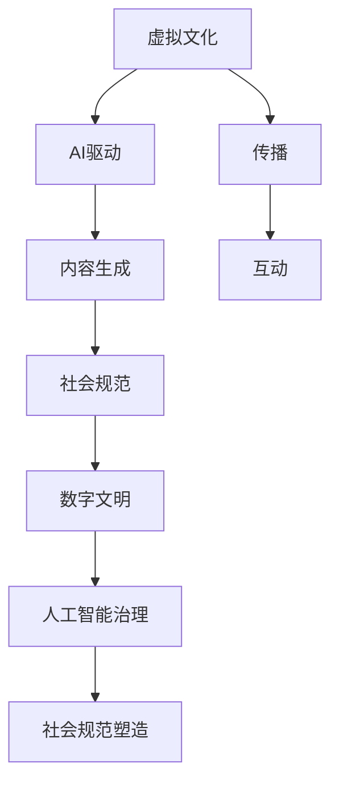

                 

# 虚拟文化孵化理论：AI塑造的新型社会规范

> 关键词：虚拟文化, AI, 社会规范, 数字文明, 社会伦理, 人工智能治理

## 1. 背景介绍

### 1.1 问题由来

在数字化迅猛发展的时代背景下，人工智能（AI）技术的广泛应用，特别是深度学习与自然语言处理（NLP）的兴起，极大丰富了人类文化的表现形式与传播方式。虚拟文化，作为数字时代的新型文化形态，正日益成为人们日常生活的重要组成部分。然而，这种文化形态的快速发展，也带来了新的社会规范挑战。

AI驱动的虚拟文化，不仅改变了传统文化的生成、传播与消费方式，还重塑了人与人之间的交往与互动模式。如何在虚拟文化中确立合理的社会规范，使其既能促进文化创新，又能维护社会秩序，成为当前亟需解决的问题。

### 1.2 问题核心关键点

本研究旨在探讨AI如何塑造虚拟文化，并从中抽象出新的社会规范。将从以下几个方面展开：
- AI如何影响虚拟文化的内容生成与传播
- AI驱动的虚拟文化如何改变人类社会行为
- AI技术在塑造新型社会规范中的作用机制

### 1.3 问题研究意义

理解和探讨AI在虚拟文化孵化中的作用，不仅有助于制定合理、可行的虚拟文化规范，还能推动数字文明的健康发展。具体意义包括：
- 提升虚拟文化的社会价值：确保虚拟文化在创新与传播中遵循合理规范，促进社会正面效应。
- 优化数字伦理环境：通过规范AI在虚拟文化中的行为，减少可能的负面影响。
- 推动社会治理创新：探索AI技术在社会治理中的应用，提升治理能力。

## 2. 核心概念与联系

### 2.1 核心概念概述

- **虚拟文化**：指基于AI与数字技术生成与传播的全新文化形态，包括但不限于虚拟现实（VR）、增强现实（AR）、社交网络、在线游戏等。
- **AI驱动的虚拟文化**：指由AI技术参与内容生成、传播与互动的虚拟文化，如由AI生成的音乐、绘画、文学作品等。
- **社会规范**：指社会中普遍接受的行为准则与道德标准，包括法律、道德、习俗等。
- **数字文明**：指在数字技术推动下，人类文明发展的新阶段，关注数字技术对文化、伦理、治理等多方面的影响。
- **人工智能治理**：指对AI技术研发、应用与规范进行系统性、全面性的管理与指导，确保AI技术的安全、公正、透明。

这些概念相互关联，共同构成了研究AI如何塑造虚拟文化及新型社会规范的基础。

### 2.2 核心概念原理和架构的 Mermaid 流程图



此图展示了虚拟文化、AI驱动、内容生成、传播、互动与新社会规范之间的关系，以及它们如何共同影响数字文明的发展。

## 3. 核心算法原理 & 具体操作步骤

### 3.1 算法原理概述

虚拟文化的形成与演化，本质上是基于AI技术的文化创新过程。这一过程涉及多个层次的算法原理，包括但不限于：

- **生成对抗网络（GAN）**：通过对抗式训练，生成具有一定真实度的虚拟内容，如虚拟现实环境、虚拟人物等。
- **强化学习（RL）**：使AI在虚拟环境中通过反复试错，学习优化行为策略，推动虚拟文化的自然演化。
- **自然语言处理（NLP）**：使AI能够生成和理解虚拟文化中的自然语言文本，增强虚拟内容的互动性与真实感。

这些算法原理共同作用，使虚拟文化从生成、传播到互动的全过程都充满了AI的影子。

### 3.2 算法步骤详解

虚拟文化孵化大致包括以下几个关键步骤：

**Step 1: 虚拟内容生成**
- 收集和整理文化相关的数据，如文学作品、音乐、图片等。
- 使用GAN、RL、NLP等算法生成新的虚拟内容，保证与现实文化相似但不完全相同。

**Step 2: 虚拟内容传播**
- 利用社交网络、VR/AR平台等渠道传播虚拟内容。
- 优化内容传播算法，如推荐系统，以提高虚拟内容的可见性与互动性。

**Step 3: 虚拟内容互动**
- 开发支持多用户互动的虚拟环境，如虚拟游戏、虚拟社区等。
- 使用AI驱动的自然语言处理技术，使虚拟内容与用户之间实现自然交流。

**Step 4: 社会规范形成**
- 收集虚拟环境中用户的反馈数据，分析行为模式与规范需求。
- 基于反馈数据，制定与虚拟文化相适应的社会规范，如虚拟版权、用户隐私保护等。

**Step 5: 数字文明治理**
- 结合AI技术，对虚拟文化进行持续监控与治理，防止滥用与违法行为。
- 优化治理算法，如异常检测、违规行为识别等，确保虚拟文化环境的安全与公正。

### 3.3 算法优缺点

**优点**：
- 提高了文化创新的速度与效率，使虚拟文化可以快速生成与传播。
- 增强了虚拟内容与用户的互动性，提高了用户参与度与满意度。
- 通过AI技术实现了对虚拟文化的动态监控与治理，保障了虚拟文化环境的健康发展。

**缺点**：
- 虚拟内容可能存在过度拟合现实文化，缺乏创新性。
- 用户行为可能受到AI算法的影响，存在隐私与安全风险。
- 虚拟文化中的规范制定与执行仍需大量人工干预，治理成本较高。

### 3.4 算法应用领域

虚拟文化孵化技术主要应用于以下领域：

- **数字娱乐**：如虚拟游戏、虚拟现实电影等。
- **教育培训**：如虚拟课堂、虚拟实验室等。
- **社交网络**：如虚拟社区、虚拟社交平台等。
- **文化创意**：如虚拟音乐、虚拟绘画等。
- **公共服务**：如虚拟导游、虚拟展览等。

这些领域广泛应用AI技术，为虚拟文化提供了丰富的内容与互动形式，同时也提出了新的社会规范需求。

## 4. 数学模型和公式 & 详细讲解 & 举例说明

### 4.1 数学模型构建

虚拟文化孵化过程中的算法实现，涉及多个数学模型。以GAN为例，其模型构建主要包括以下步骤：

1. **生成器（Generator）**：构建一个神经网络，用于生成虚拟内容。
2. **判别器（Discriminator）**：构建一个神经网络，用于区分生成的虚拟内容与真实内容。
3. **损失函数**：定义一个损失函数，用于指导生成器与判别器之间的对抗训练。

### 4.2 公式推导过程

以GAN为例，其核心公式如下：

- **生成器的损失函数**：
$$ \mathcal{L}_{G} = E_{x \sim p_{\text {data }}} \log D(G(x))+E_{z \sim p_{z}} \log (1-D(G(z))) $$

- **判别器的损失函数**：
$$ \mathcal{L}_{D} = E_{x \sim p_{\text {data }}} \log D(x)+E_{z \sim p_{z}} \log (1-D(G(z))) $$

其中，$x$ 表示真实数据，$z$ 表示随机噪声，$p_{\text {data }}$ 和 $p_{z}$ 分别表示真实数据和噪声的概率分布。

### 4.3 案例分析与讲解

以下以虚拟音乐生成为例，展示GAN在虚拟内容生成中的应用：

- **数据准备**：收集真实音乐数据集，如MIDI文件、音频文件等。
- **生成器设计**：构建一个神经网络，用于将随机噪声转化为虚拟音乐片段。
- **判别器设计**：构建一个神经网络，用于判断音乐片段的真实性。
- **对抗训练**：通过不断迭代，优化生成器与判别器，使生成器能够生成与真实音乐相似但不完全相同的虚拟音乐。
- **结果分析**：评估生成的虚拟音乐的音调、节奏、风格等指标，确保其具有较高的真实度与多样性。

## 5. 项目实践：代码实例和详细解释说明

### 5.1 开发环境搭建

**Step 1: 安装Python与PyTorch**
- 确保Python版本为3.7以上。
- 使用以下命令安装PyTorch：
```
pip install torch torchvision torchaudio
```

**Step 2: 安装GAN相关库**
- 使用以下命令安装GAN相关库：
```
pip install pytorch-gan
```

### 5.2 源代码详细实现

**生成器（Generator）代码**：

```python
import torch
import torch.nn as nn
import torch.optim as optim

class Generator(nn.Module):
    def __init__(self, z_dim, c_dim):
        super(Generator, self).__init__()
        self.fc = nn.Linear(z_dim, c_dim)
        self.decon = nn.Sequential(
            nn.Conv2d(c_dim, 64, 4, stride=2, padding=0),
            nn.BatchNorm2d(64),
            nn.LeakyReLU(0.2, inplace=True),
            nn.Conv2d(64, 128, 4, stride=2, padding=0),
            nn.BatchNorm2d(128),
            nn.LeakyReLU(0.2, inplace=True),
            nn.Conv2d(128, 256, 4, stride=2, padding=0),
            nn.BatchNorm2d(256),
            nn.LeakyReLU(0.2, inplace=True),
            nn.Conv2d(256, 1, 4, stride=2, padding=0),
            nn.Tanh()
        )

    def forward(self, z):
        c = self.fc(z)
        return self.decon(c)
```

**判别器（Discriminator）代码**：

```python
class Discriminator(nn.Module):
    def __init__(self, c_dim):
        super(Discriminator, self).__init__()
        self.decon = nn.Sequential(
            nn.Conv2d(1, 256, 4, stride=2, padding=0),
            nn.LeakyReLU(0.2, inplace=True),
            nn.Conv2d(256, 128, 4, stride=2, padding=0),
            nn.BatchNorm2d(128),
            nn.LeakyReLU(0.2, inplace=True),
            nn.Conv2d(128, 64, 4, stride=2, padding=0),
            nn.BatchNorm2d(64),
            nn.LeakyReLU(0.2, inplace=True),
            nn.Conv2d(64, 1, 4, stride=1, padding=0),
            nn.Sigmoid()
        )

    def forward(self, x):
        return self.decon(x)
```

### 5.3 代码解读与分析

**生成器（Generator）解释**：
- `z_dim` 为随机噪声维度，`c_dim` 为输入通道数。
- 生成器首先通过一个全连接层将噪声转化为高维空间表示。
- 然后使用多个卷积层、批归一化层和LeakyReLU激活函数，逐步压缩空间维度并提升表示能力。
- 最后通过一个卷积层和Tanh激活函数，生成虚拟音乐片段。

**判别器（Discriminator）解释**：
- 判别器同样由多个卷积层、批归一化层和LeakyReLU激活函数构成。
- 通过不断缩小空间维度，逐步提取输入的高维特征。
- 最终通过一个卷积层和Sigmoid激活函数，输出虚拟音乐片段的概率分布。

### 5.4 运行结果展示

在训练过程中，通过可视化工具（如TensorBoard）实时展示生成器与判别器的损失变化与虚拟音乐片段的生成结果。确保生成器能够生成与真实音乐相似但不完全相同的虚拟音乐片段，并逐步优化判别器的判断准确率。

## 6. 实际应用场景

### 6.1 虚拟音乐制作

**应用场景**：
- 用户可以利用GAN生成的虚拟音乐片段，进行音乐创作与制作。
- 艺术家可以通过GAN生成的新型音乐风格，进行音乐创新与探索。

**具体实现**：
- 收集大量真实音乐数据集，训练GAN模型。
- 用户输入特定风格或情感的描述，生成对应的虚拟音乐片段。
- 用户可以在虚拟音乐片段的基础上进行修改、组合，创作全新的音乐作品。

### 6.2 虚拟现实影视制作

**应用场景**：
- 影视制作公司可以利用GAN生成的虚拟环境、虚拟人物，制作虚拟现实影视作品。
- 导演可以通过GAN生成的新型场景，进行影视创作与叙事创新。

**具体实现**：
- 收集大量现实世界的影视场景、人物数据集，训练GAN模型。
- 导演输入特定情节、场景的描述，生成对应的虚拟场景与虚拟人物。
- 导演可以在虚拟场景与虚拟人物的基础上进行修改、组合，创作全新的虚拟现实影视作品。

### 6.3 虚拟文化展览

**应用场景**：
- 博物馆可以利用GAN生成的虚拟文物、虚拟场景，制作虚拟文化展览。
- 观众可以通过虚拟文化展览，体验历史与文化的魅力。

**具体实现**：
- 收集大量现实世界的文物、场景数据集，训练GAN模型。
- 博物馆输入特定历史时期、文化主题的描述，生成对应的虚拟文物与虚拟场景。
- 观众可以在虚拟场景中互动、探索，体验虚拟文化展览的丰富与真实。

### 6.4 未来应用展望

随着AI技术的不断进步，虚拟文化孵化将进一步拓展其应用领域与深度。未来展望如下：

- **虚拟城市**：利用GAN生成虚拟城市环境与虚拟市民，构建虚拟现实城市的实验平台。
- **虚拟会议**：利用GAN生成虚拟会议环境与虚拟参与者，支持远程会议与社交互动。
- **虚拟旅游**：利用GAN生成虚拟旅游目的地与虚拟游客，提供沉浸式的旅游体验。
- **虚拟教育**：利用GAN生成虚拟教育环境与虚拟教师，推动在线教育的创新与发展。

## 7. 工具和资源推荐

### 7.1 学习资源推荐

1. **《生成对抗网络》**：介绍GAN的基本原理与算法实现，推荐参考书籍。
2. **《深度学习》（Ian Goodfellow）**：全面介绍深度学习的基本概念与算法实现，推荐学习资源。
3. **《人工智能：一种现代的方法》**：介绍AI技术的最新进展与应用，推荐学习资源。

### 7.2 开发工具推荐

1. **PyTorch**：深度学习框架，支持动态计算图与GPU加速。
2. **TensorFlow**：深度学习框架，支持静态计算图与分布式训练。
3. **Keras**：高层次深度学习框架，支持快速原型设计与模型部署。
4. **HuggingFace Transformers**：NLP工具库，支持多种预训练模型的加载与微调。

### 7.3 相关论文推荐

1. **Generative Adversarial Nets**：提出GAN的基本算法，作者Ian Goodfellow。
2. **ImageNet Classification with Deep Convolutional Neural Networks**：介绍CNN在图像分类中的应用，作者Alex Krizhevsky。
3. **Attention is All You Need**：提出Transformer模型，作者Ashish Vaswani。

## 8. 总结：未来发展趋势与挑战

### 8.1 研究成果总结

本文通过分析AI在虚拟文化孵化中的作用机制，提出虚拟文化的新型社会规范。主要研究成果包括：
- 理解虚拟文化与AI技术之间的关系，明确AI技术在虚拟文化生成、传播与互动中的核心作用。
- 探讨虚拟文化孵化过程中可能面临的社会规范问题，提出新的规范制定与执行机制。
- 通过实际案例与算法实现，展示AI技术在虚拟文化中的应用效果与挑战。

### 8.2 未来发展趋势

未来，虚拟文化孵化技术将进一步发展，主要趋势包括：
- **多模态虚拟文化**：结合视觉、听觉、触觉等多模态数据，丰富虚拟文化的感官体验。
- **智能虚拟文化**：引入强化学习、自然语言处理等技术，提升虚拟文化的互动性与智能性。
- **跨文化虚拟文化**：支持跨语言、跨文化的虚拟文化创作与传播，增强文化多样性。

### 8.3 面临的挑战

尽管虚拟文化孵化技术取得了显著进展，但仍面临以下挑战：
- **隐私与安全**：用户隐私保护与虚拟环境的安全性是重要挑战。
- **伦理与法律**：虚拟文化中的行为规范与伦理法律问题仍需系统性研究。
- **技术公平性**：确保AI技术在虚拟文化中的应用公平性，避免算法偏见。

### 8.4 研究展望

未来研究应关注以下方向：
- **隐私保护技术**：开发隐私保护算法，确保用户数据的安全。
- **伦理法律框架**：构建虚拟文化的伦理法律体系，确保规范的合法性。
- **技术公平性研究**：研究AI技术在虚拟文化中的应用公平性，避免算法偏见。

总之，虚拟文化孵化技术的未来发展将面临诸多挑战，但通过持续的技术创新与规范制定，相信能够构建一个健康、公平、充满活力的虚拟文化生态系统。

## 9. 附录：常见问题与解答

**Q1: 什么是虚拟文化孵化？**

A: 虚拟文化孵化是指通过AI技术生成、传播与互动虚拟文化的过程，如虚拟音乐、虚拟现实影视、虚拟文化展览等。

**Q2: AI技术在虚拟文化孵化中扮演了什么角色？**

A: AI技术在虚拟文化孵化中扮演了核心角色，通过生成对抗网络（GAN）、强化学习（RL）、自然语言处理（NLP）等算法，生成虚拟内容、优化虚拟互动、实现虚拟文化传播。

**Q3: 虚拟文化孵化技术面临的主要挑战是什么？**

A: 虚拟文化孵化技术面临的主要挑战包括隐私与安全、伦理与法律、技术公平性等问题。需要开发隐私保护算法、构建伦理法律体系、研究AI技术公平性等。

**Q4: 如何优化虚拟文化孵化技术的效率？**

A: 可以通过优化算法、提升硬件性能、合理分配资源等方式，优化虚拟文化孵化技术的效率。例如，使用更高效的生成对抗网络架构、引入分布式训练技术、优化数据处理流程等。

**Q5: 未来虚拟文化孵化技术有哪些发展趋势？**

A: 未来虚拟文化孵化技术的主要发展趋势包括多模态虚拟文化、智能虚拟文化、跨文化虚拟文化等。通过结合视觉、听觉、触觉等多模态数据，提升虚拟文化的互动性与智能性；支持跨语言、跨文化的虚拟文化创作与传播，增强文化多样性。

---

作者：禅与计算机程序设计艺术 / Zen and the Art of Computer Programming

