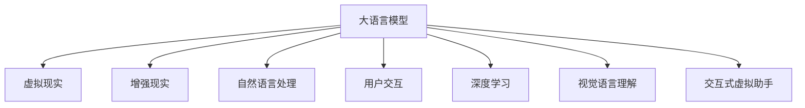

                 

# 虚拟现实中的LLM：增强用户交互体验

> 关键词：
> - 大语言模型 (Large Language Models, LLMs)
> - 虚拟现实 (Virtual Reality, VR)
> - 用户交互 (User Interaction)
> - 自然语言处理 (Natural Language Processing, NLP)
> - 增强现实 (Augmented Reality, AR)
> - 深度学习 (Deep Learning)
> - 视觉语言理解 (Visual Language Understanding)
> - 交互式虚拟助手 (Interactive Virtual Assistants)

## 1. 背景介绍

### 1.1 问题由来

随着虚拟现实技术的发展，用户日益期望在虚拟世界中能有更丰富、更自然的交互体验。然而，传统的文本输入、选择等交互方式往往限制了虚拟现实的应用场景和用户沉浸感。如何让用户在虚拟现实中以更自然的方式进行沟通、获取信息，成为亟待解决的问题。

大语言模型（LLM）的出现，为这一问题提供了新的解决方案。通过将大语言模型嵌入到虚拟现实中，可以构建更智能、更自然的交互体验，增强用户沉浸感和参与度。

### 1.2 问题核心关键点

虚拟现实中的大语言模型应用涉及以下几个关键问题：

- 如何构建适于虚拟现实场景的交互界面？
- 如何增强虚拟角色对自然语言的理解和生成能力？
- 如何优化大语言模型在低延迟、高并发环境中的性能？
- 如何保证虚拟场景中语言交互的安全性和隐私性？

这些问题的解决，将极大地提升虚拟现实应用的实用性和用户体验。

### 1.3 问题研究意义

研究虚拟现实中的大语言模型应用，对于推动虚拟现实技术的普及和升级，具有重要意义：

- 提升用户体验。自然语言交互可以显著提升用户在虚拟现实中的沉浸感和参与感，降低学习门槛。
- 拓展应用场景。虚拟现实中的大语言模型可以广泛应用于教育、娱乐、医疗等多个领域，拓展VR技术的实际应用范围。
- 加速技术融合。大语言模型的应用能够促进虚拟现实技术与人工智能技术的深度融合，带来更多创新应用。
- 提高技术安全性。通过大语言模型的辅助，增强虚拟现实场景中的风险防控和信息安全，保障用户隐私。
- 实现智能化交互。大语言模型能够理解用户的复杂需求，提供更个性化的服务，提高交互效率。

## 2. 核心概念与联系

### 2.1 核心概念概述

为了更好地理解虚拟现实中的大语言模型应用，本节将介绍几个密切相关的核心概念：

- 大语言模型 (LLM)：以自回归(如GPT)或自编码(如BERT)模型为代表的大规模预训练语言模型。通过在大规模无标签文本语料上进行预训练，学习通用的语言表示，具备强大的语言理解和生成能力。
- 虚拟现实 (VR)：通过计算机技术生成逼真的虚拟环境，用户可沉浸其中，体验虚拟场景。
- 用户交互 (User Interaction)：用户与虚拟系统之间的信息交流和行为互动。
- 自然语言处理 (NLP)：研究计算机如何理解、处理和生成人类语言的技术。
- 增强现实 (AR)：将虚拟信息叠加在现实世界的场景上，提供增强信息体验。

这些核心概念之间的逻辑关系可以通过以下Mermaid流程图来展示：



这个流程图展示了大语言模型的核心概念及其与虚拟现实、增强现实、自然语言处理、用户交互、深度学习和视觉语言理解等概念的关系：

1. 大语言模型通过预训练获得基础能力。
2. 虚拟现实和增强现实为语言模型提供了应用场景。
3. 自然语言处理和大语言模型紧密结合，提升模型的语言处理能力。
4. 用户交互和大语言模型共同构建了虚拟环境中的信息交流。
5. 深度学习和大语言模型互为支持，推动技术进步。
6. 视觉语言理解和大语言模型结合，增强视觉内容的语义理解。
7. 交互式虚拟助手是大语言模型在虚拟现实中的重要应用。

## 3. 核心算法原理 & 具体操作步骤

### 3.1 算法原理概述

虚拟现实中的大语言模型应用，本质上是一个自然语言处理（NLP）与虚拟现实技术相结合的过程。其核心思想是：将大语言模型嵌入到虚拟现实系统中，使其能够理解用户输入的自然语言指令，并生成自然语言输出，从而实现更加智能、自然的交互。

形式化地，假设虚拟现实系统中有一个虚拟角色 $R$，和一个用户交互系统 $S$。用户在虚拟环境中通过语音或文字与 $S$ 进行交互，$S$ 通过自然语言处理模块将用户输入转化为语言表示，并传递给 $R$。$R$ 通过大语言模型进行语言理解和生成，输出对应的自然语言回答或动作，最终由 $S$ 展示给用户。

### 3.2 算法步骤详解

虚拟现实中的大语言模型应用一般包括以下几个关键步骤：

**Step 1: 准备虚拟现实环境**

- 搭建虚拟现实平台，如Unity3D、Unreal Engine等，配置虚拟环境。
- 设计虚拟角色的外观、行为和交互方式，如对话窗口、手势识别等。

**Step 2: 添加自然语言处理模块**

- 在虚拟角色 $R$ 中添加自然语言处理模块，用于处理用户输入的自然语言。
- 选择合适的大语言模型，如GPT-3、BERT等，用于语言理解和生成。

**Step 3: 构建虚拟角色和大语言模型的交互接口**

- 在虚拟角色 $R$ 中集成大语言模型，构建自然语言理解、生成接口。
- 设计虚拟角色与大语言模型的交互协议，如输入格式、返回结果等。

**Step 4: 设置微调超参数**

- 选择合适的优化算法及其参数，如AdamW、SGD等，设置学习率、批大小、迭代轮数等。
- 设置正则化技术及强度，包括权重衰减、Dropout、Early Stopping等。
- 确定冻结预训练参数的策略，如仅微调顶层，或全部参数都参与微调。

**Step 5: 执行梯度训练**

- 将训练集数据分批次输入模型，前向传播计算损失函数。
- 反向传播计算参数梯度，根据设定的优化算法和学习率更新模型参数。
- 周期性在验证集上评估模型性能，根据性能指标决定是否触发 Early Stopping。
- 重复上述步骤直到满足预设的迭代轮数或 Early Stopping 条件。

**Step 6: 测试和部署**

- 在测试集上评估虚拟角色与大语言模型系统的整体性能，对比微调前后的交互质量。
- 使用微调后的系统对新用户进行测试，评估其交互体验。
- 持续收集用户反馈，优化模型参数和交互方式，提升用户体验。

以上是虚拟现实中的大语言模型应用的一般流程。在实际应用中，还需要针对具体虚拟场景和用户需求，对微调过程的各个环节进行优化设计，如改进训练目标函数，引入更多的正则化技术，搜索最优的超参数组合等，以进一步提升模型性能。

### 3.3 算法优缺点

虚拟现实中的大语言模型应用具有以下优点：

1. 提升用户体验。自然语言交互可以显著提升用户在虚拟现实中的沉浸感和参与感，降低学习门槛。
2. 拓展应用场景。虚拟现实中的大语言模型可以广泛应用于教育、娱乐、医疗等多个领域，拓展VR技术的实际应用范围。
3. 加速技术融合。大语言模型的应用能够促进虚拟现实技术与人工智能技术的深度融合，带来更多创新应用。
4. 提高技术安全性。通过大语言模型的辅助，增强虚拟现实场景中的风险防控和信息安全，保障用户隐私。
5. 实现智能化交互。大语言模型能够理解用户的复杂需求，提供更个性化的服务，提高交互效率。

同时，该方法也存在一定的局限性：

1. 计算资源需求高。虚拟现实场景下，通常需要实时渲染高清图像和语音处理，对计算资源要求较高。
2. 交互延迟问题。虚拟环境中的交互通常需要处理语音或文字输入，可能存在延迟问题。
3. 数据隐私问题。用户输入的自然语言数据可能包含隐私信息，需要谨慎处理。
4. 多模态输入挑战。虚拟现实中的交互方式可能包括语音、文字、手势等多种形式，需要综合处理。
5. 模型鲁棒性问题。大语言模型在虚拟现实环境中需要具备较高的鲁棒性和泛化能力，以适应复杂多变的场景。

尽管存在这些局限性，但就目前而言，虚拟现实中的大语言模型应用仍是最主流范式。未来相关研究的重点在于如何进一步降低计算资源消耗，提高交互响应速度，同时兼顾数据隐私和模型鲁棒性等因素。

### 3.4 算法应用领域

虚拟现实中的大语言模型应用，在多个领域中都有广泛的应用，例如：

- 虚拟教育：构建虚拟教师、虚拟助教，通过自然语言交互教授知识，进行问题解答。
- 虚拟旅游：提供虚拟导游服务，通过语音和文字解答游客问题，推荐旅游路线。
- 虚拟医疗：构建虚拟医生，通过语音交互提供健康咨询、诊断建议。
- 虚拟办公：构建虚拟助手，通过自然语言处理完成日常事务，如会议记录、邮件回复等。
- 虚拟娱乐：提供虚拟角色扮演、互动剧情体验，提升用户沉浸感和参与感。
- 虚拟训练：用于军事、航空、医疗等高危领域的人员训练，通过模拟真实环境进行场景演练。

除了上述这些经典应用外，虚拟现实中的大语言模型还被创新性地应用到更多场景中，如虚拟广告、虚拟游戏、虚拟客服等，为虚拟现实技术带来了全新的突破。随着虚拟现实技术的不断进步，大语言模型的应用将更加广泛和深入。

## 4. 数学模型和公式 & 详细讲解  
### 4.1 数学模型构建

本节将使用数学语言对虚拟现实中的大语言模型应用过程进行更加严格的刻画。

假设虚拟现实系统中有一个虚拟角色 $R$，其语言处理模块由大语言模型 $M_{\theta}$ 组成，用户通过语音或文字输入自然语言 $x$，系统将其转化为语言表示 $t$，虚拟角色 $R$ 通过大语言模型进行语言理解和生成，输出回答 $y$，最终展示给用户。

定义系统在输入 $(x, t)$ 下的损失函数为 $\ell(M_{\theta}(x, t), y)$，则在训练集 $D=\{(x_i, t_i, y_i)\}_{i=1}^N$ 上的经验风险为：

$$
\mathcal{L}(\theta) = \frac{1}{N}\sum_{i=1}^N \ell(M_{\theta}(x_i, t_i), y_i)
$$

其中，$M_{\theta}(x_i, t_i) = M_{\theta}(x_i)$ 为模型在输入 $x_i$ 和语言表示 $t_i$ 下的输出。

### 4.2 公式推导过程

以下我们以二分类任务为例，推导损失函数及其梯度的计算公式。

假设虚拟角色 $R$ 在输入 $x$ 上的输出为 $\hat{y}=M_{\theta}(x, t) \in [0,1]$，表示系统回答属于正类的概率。真实标签 $y \in \{0,1\}$。则二分类交叉熵损失函数定义为：

$$
\ell(M_{\theta}(x, t), y) = -[y\log \hat{y} + (1-y)\log (1-\hat{y})]
$$

将其代入经验风险公式，得：

$$
\mathcal{L}(\theta) = -\frac{1}{N}\sum_{i=1}^N [y_i\log M_{\theta}(x_i, t_i)+(1-y_i)\log(1-M_{\theta}(x_i, t_i))]
$$

根据链式法则，损失函数对参数 $\theta_k$ 的梯度为：

$$
\frac{\partial \mathcal{L}(\theta)}{\partial \theta_k} = -\frac{1}{N}\sum_{i=1}^N (\frac{y_i}{M_{\theta}(x_i, t_i)}-\frac{1-y_i}{1-M_{\theta}(x_i, t_i)}) \frac{\partial M_{\theta}(x_i, t_i)}{\partial \theta_k}
$$

其中 $\frac{\partial M_{\theta}(x_i, t_i)}{\partial \theta_k}$ 可进一步递归展开，利用自动微分技术完成计算。

在得到损失函数的梯度后，即可带入参数更新公式，完成模型的迭代优化。重复上述过程直至收敛，最终得到适应虚拟现实任务的最优模型参数 $\theta^*$。

## 5. 项目实践：代码实例和详细解释说明
### 5.1 开发环境搭建

在进行虚拟现实中的大语言模型应用开发前，我们需要准备好开发环境。以下是使用Python进行PyTorch开发的环境配置流程：

1. 安装Anaconda：从官网下载并安装Anaconda，用于创建独立的Python环境。

2. 创建并激活虚拟环境：
```bash
conda create -n pytorch-env python=3.8 
conda activate pytorch-env
```

3. 安装PyTorch：根据CUDA版本，从官网获取对应的安装命令。例如：
```bash
conda install pytorch torchvision torchaudio cudatoolkit=11.1 -c pytorch -c conda-forge
```

4. 安装Transformers库：
```bash
pip install transformers
```

5. 安装各类工具包：
```bash
pip install numpy pandas scikit-learn matplotlib tqdm jupyter notebook ipython
```

完成上述步骤后，即可在`pytorch-env`环境中开始应用开发。

### 5.2 源代码详细实现

下面我们以虚拟助手应用为例，给出使用Transformers库对BERT模型进行虚拟现实场景中的微调的PyTorch代码实现。

首先，定义虚拟助手的训练函数：

```python
from transformers import BertForTokenClassification, BertTokenizer, AdamW
import torch
from tqdm import tqdm
from sklearn.metrics import classification_report

def train_epoch(model, tokenizer, train_data, batch_size, optimizer, device):
    dataloader = DataLoader(train_data, batch_size=batch_size, shuffle=True)
    model.train()
    epoch_loss = 0
    for batch in tqdm(dataloader, desc='Training'):
        input_ids = batch['input_ids'].to(device)
        attention_mask = batch['attention_mask'].to(device)
        labels = batch['labels'].to(device)
        model.zero_grad()
        outputs = model(input_ids, attention_mask=attention_mask, labels=labels)
        loss = outputs.loss
        epoch_loss += loss.item()
        loss.backward()
        optimizer.step()
    return epoch_loss / len(dataloader)

def evaluate(model, tokenizer, dev_data, batch_size, device):
    dataloader = DataLoader(dev_data, batch_size=batch_size)
    model.eval()
    preds, labels = [], []
    with torch.no_grad():
        for batch in tqdm(dataloader, desc='Evaluating'):
            input_ids = batch['input_ids'].to(device)
            attention_mask = batch['attention_mask'].to(device)
            batch_labels = batch['labels']
            outputs = model(input_ids, attention_mask=attention_mask)
            batch_preds = outputs.logits.argmax(dim=2).to('cpu').tolist()
            batch_labels = batch_labels.to('cpu').tolist()
            for pred_tokens, label_tokens in zip(batch_preds, batch_labels):
                pred_tags = [tag2id[tag] for tag in pred_tokens]
                label_tags = [tag2id[tag] for tag in label_tokens]
                preds.append(pred_tags[:len(label_tags)])
                labels.append(label_tags)
                
    print(classification_report(labels, preds))
```

然后，加载模型和数据集，进行模型训练和评估：

```python
from transformers import BertForTokenClassification, BertTokenizer
from datasets import load_dataset

tokenizer = BertTokenizer.from_pretrained('bert-base-cased')
model = BertForTokenClassification.from_pretrained('bert-base-cased', num_labels=len(tag2id))

train_data = load_dataset('your_train_dataset', split='train')
dev_data = load_dataset('your_dev_dataset', split='validation')
test_data = load_dataset('your_test_dataset', split='test')

device = torch.device('cuda') if torch.cuda.is_available() else torch.device('cpu')
model.to(device)

optimizer = AdamW(model.parameters(), lr=2e-5)

train_epochs = 5
batch_size = 16

for epoch in range(train_epochs):
    loss = train_epoch(model, tokenizer, train_data, batch_size, optimizer, device)
    print(f"Epoch {epoch+1}, train loss: {loss:.3f}")
    
    print(f"Epoch {epoch+1}, dev results:")
    evaluate(model, tokenizer, dev_data, batch_size, device)
    
print("Test results:")
evaluate(model, tokenizer, test_data, batch_size, device)
```

以上代码实现了虚拟助手应用中大语言模型BERT的微调过程。可以看到，Transformer库使得模型微调的过程变得简洁高效。

### 5.3 代码解读与分析

让我们再详细解读一下关键代码的实现细节：

**train_epoch函数**：
- 加载训练数据，设置模型进入训练模式。
- 循环迭代每个批次数据，前向传播计算损失，反向传播更新参数，最后返回该epoch的平均loss。

**evaluate函数**：
- 加载评估数据，设置模型进入评估模式。
- 对每个批次数据进行前向传播，输出预测结果和标签结果，并使用sklearn的classification_report打印分类报告。

**训练流程**：
- 定义总的epoch数和batch size，开始循环迭代。
- 每个epoch内，先在训练集上训练，输出平均loss。
- 在验证集上评估，输出分类指标。
- 所有epoch结束后，在测试集上评估，给出最终测试结果。

可以看到，PyTorch配合Transformer库使得BERT微调的代码实现变得简洁高效。开发者可以将更多精力放在数据处理、模型改进等高层逻辑上，而不必过多关注底层的实现细节。

当然，工业级的系统实现还需考虑更多因素，如模型的保存和部署、超参数的自动搜索、更灵活的任务适配层等。但核心的微调范式基本与此类似。

## 6. 实际应用场景
### 6.1 智能客服系统

虚拟现实中的大语言模型应用可以广泛应用于智能客服系统的构建。传统客服往往需要配备大量人力，高峰期响应缓慢，且一致性和专业性难以保证。而使用虚拟角色与大语言模型结合的智能客服，可以7x24小时不间断服务，快速响应客户咨询，用自然流畅的语言解答各类常见问题。

在技术实现上，可以收集企业内部的历史客服对话记录，将问题和最佳答复构建成监督数据，在此基础上对预训练对话模型进行微调。微调后的对话模型能够自动理解用户意图，匹配最合适的答案模板进行回复。对于客户提出的新问题，还可以接入检索系统实时搜索相关内容，动态组织生成回答。如此构建的智能客服系统，能大幅提升客户咨询体验和问题解决效率。

### 6.2 虚拟旅游

虚拟现实中的大语言模型可以提供虚拟导游服务，通过语音和文字解答游客问题，推荐旅游路线。游客可以在虚拟旅游环境中自由探索，虚拟导游会根据用户的输入提供实时解答和建议，增加旅游体验的趣味性和互动性。

### 6.3 虚拟医疗

虚拟现实中的大语言模型可以构建虚拟医生，通过语音交互提供健康咨询、诊断建议。患者可以在虚拟医院环境中咨询医生，获得个性化的健康建议和诊断意见。虚拟医生能够根据患者的病情描述和历史记录，提供精准的医学解答，减少患者的就医成本，提升医疗服务的可及性和效率。

### 6.4 未来应用展望

随着虚拟现实技术的不断进步，大语言模型的应用将更加广泛和深入。以下是未来可能的发展方向：

1. 虚拟教学：虚拟教室中的虚拟教师和助教，通过自然语言交互教学，提供个性化的学习建议，提升学习效果。
2. 虚拟会议：虚拟会议中的虚拟助手，通过自然语言交互记录会议内容，生成会议纪要，支持远程协作。
3. 虚拟导游：虚拟旅游中的虚拟导游，通过自然语言交互提供实时解答，增强游客的体验感。
4. 虚拟客服：虚拟客服中心中的虚拟客服，通过自然语言交互解答用户问题，提升客户满意度。
5. 虚拟办公：虚拟办公室中的虚拟助手，通过自然语言交互完成日常事务，提高办公效率。
6. 虚拟娱乐：虚拟游戏、虚拟剧情中的虚拟角色，通过自然语言交互与玩家互动，提升游戏体验。

这些应用将进一步推动虚拟现实技术的普及和应用，为用户提供更加智能、自然的交互体验。

## 7. 工具和资源推荐
### 7.1 学习资源推荐

为了帮助开发者系统掌握虚拟现实中的大语言模型应用的理论基础和实践技巧，这里推荐一些优质的学习资源：

1. 《Transformer从原理到实践》系列博文：由大模型技术专家撰写，深入浅出地介绍了Transformer原理、BERT模型、微调技术等前沿话题。

2. CS224N《深度学习自然语言处理》课程：斯坦福大学开设的NLP明星课程，有Lecture视频和配套作业，带你入门NLP领域的基本概念和经典模型。

3. 《Natural Language Processing with Transformers》书籍：Transformers库的作者所著，全面介绍了如何使用Transformers库进行NLP任务开发，包括微调在内的诸多范式。

4. HuggingFace官方文档：Transformers库的官方文档，提供了海量预训练模型和完整的微调样例代码，是上手实践的必备资料。

5. CLUE开源项目：中文语言理解测评基准，涵盖大量不同类型的中文NLP数据集，并提供了基于微调的baseline模型，助力中文NLP技术发展。

通过对这些资源的学习实践，相信你一定能够快速掌握虚拟现实中的大语言模型应用的核心要点，并用于解决实际的NLP问题。
###  7.2 开发工具推荐

高效的开发离不开优秀的工具支持。以下是几款用于虚拟现实中的大语言模型微调开发的常用工具：

1. PyTorch：基于Python的开源深度学习框架，灵活动态的计算图，适合快速迭代研究。大部分预训练语言模型都有PyTorch版本的实现。

2. TensorFlow：由Google主导开发的开源深度学习框架，生产部署方便，适合大规模工程应用。同样有丰富的预训练语言模型资源。

3. Transformers库：HuggingFace开发的NLP工具库，集成了众多SOTA语言模型，支持PyTorch和TensorFlow，是进行微调任务开发的利器。

4. Weights & Biases：模型训练的实验跟踪工具，可以记录和可视化模型训练过程中的各项指标，方便对比和调优。与主流深度学习框架无缝集成。

5. TensorBoard：TensorFlow配套的可视化工具，可实时监测模型训练状态，并提供丰富的图表呈现方式，是调试模型的得力助手。

6. Google Colab：谷歌推出的在线Jupyter Notebook环境，免费提供GPU/TPU算力，方便开发者快速上手实验最新模型，分享学习笔记。

合理利用这些工具，可以显著提升虚拟现实中的大语言模型微调任务的开发效率，加快创新迭代的步伐。

### 7.3 相关论文推荐

大语言模型和微调技术的发展源于学界的持续研究。以下是几篇奠基性的相关论文，推荐阅读：

1. Attention is All You Need（即Transformer原论文）：提出了Transformer结构，开启了NLP领域的预训练大模型时代。

2. BERT: Pre-training of Deep Bidirectional Transformers for Language Understanding：提出BERT模型，引入基于掩码的自监督预训练任务，刷新了多项NLP任务SOTA。

3. Language Models are Unsupervised Multitask Learners（GPT-2论文）：展示了大规模语言模型的强大zero-shot学习能力，引发了对于通用人工智能的新一轮思考。

4. Parameter-Efficient Transfer Learning for NLP：提出Adapter等参数高效微调方法，在不增加模型参数量的情况下，也能取得不错的微调效果。

5. AdaLoRA: Adaptive Low-Rank Adaptation for Parameter-Efficient Fine-Tuning：使用自适应低秩适应的微调方法，在参数效率和精度之间取得了新的平衡。

这些论文代表了大语言模型微调技术的发展脉络。通过学习这些前沿成果，可以帮助研究者把握学科前进方向，激发更多的创新灵感。

## 8. 总结：未来发展趋势与挑战

### 8.1 总结

本文对虚拟现实中的大语言模型应用进行了全面系统的介绍。首先阐述了虚拟现实与大语言模型结合的研究背景和意义，明确了大语言模型在提升用户体验、拓展应用场景等方面的独特价值。其次，从原理到实践，详细讲解了虚拟现实中的大语言模型应用的数学原理和关键步骤，给出了微调任务开发的完整代码实例。同时，本文还广泛探讨了虚拟现实中的大语言模型应用在多个行业领域的具体场景，展示了其广泛的应用前景。此外，本文精选了微调技术的各类学习资源，力求为读者提供全方位的技术指引。

通过本文的系统梳理，可以看到，虚拟现实中的大语言模型应用是推动虚拟现实技术普及和升级的重要手段，将带来前所未有的沉浸式、自然化交互体验，极大地提升用户体验和应用范围。未来，随着虚拟现实技术的不断进步，大语言模型的应用将更加广泛和深入，为虚拟现实技术的未来发展注入新的动力。

### 8.2 未来发展趋势

展望未来，虚拟现实中的大语言模型应用将呈现以下几个发展趋势：

1. 交互方式多样性增强。虚拟现实中的大语言模型将支持更多自然语言交互方式，如语音、手势、表情识别等，提供更加丰富、自然的人机交互体验。

2. 实时性提升。随着计算资源的增加和算法优化，虚拟现实中的大语言模型应用将实现更低延迟、更高的交互响应速度。

3. 个性化增强。虚拟现实中的大语言模型将能够更好地理解用户需求，提供更加个性化的服务，如智能推荐、虚拟形象定制等。

4. 多模态融合。虚拟现实中的大语言模型将与视觉、听觉等多模态信息融合，提供更加全面、丰富的信息交互体验。

5. 边缘计算应用。随着边缘计算技术的发展，虚拟现实中的大语言模型将在移动设备等资源受限场景下也能实现高效、低延迟的应用。

6. 跨领域拓展。虚拟现实中的大语言模型将在医疗、教育、娱乐等多个领域得到广泛应用，提升各行业的智能化水平。

以上趋势凸显了虚拟现实中的大语言模型应用的广阔前景。这些方向的探索发展，必将进一步提升虚拟现实应用的实用性和用户体验，推动虚拟现实技术的产业化进程。

### 8.3 面临的挑战

尽管虚拟现实中的大语言模型应用已经取得了不少进展，但在迈向更加智能化、普适化应用的过程中，仍面临诸多挑战：

1. 计算资源瓶颈。虚拟现实场景下，通常需要实时渲染高清图像和语音处理，对计算资源要求较高。如何降低计算资源消耗，提高系统的能效比，仍是一个重要问题。

2. 交互延迟问题。虚拟环境中的交互方式可能存在延迟问题，影响用户体验。如何优化模型推理速度和系统响应时间，提升交互流畅度，是一个关键挑战。

3. 数据隐私问题。用户输入的自然语言数据可能包含隐私信息，需要谨慎处理。如何在保护用户隐私的前提下，提供高质量的自然语言服务，是一个亟待解决的问题。

4. 多模态输入挑战。虚拟现实中的交互方式可能包括语音、文字、手势等多种形式，需要综合处理。如何设计高效的输入输出接口，增强系统的适应性，是一个技术难题。

5. 模型鲁棒性问题。大语言模型在虚拟现实环境中需要具备较高的鲁棒性和泛化能力，以适应复杂多变的场景。如何提高模型的鲁棒性，避免灾难性遗忘，还需要更多理论和实践的积累。

6. 安全性问题。虚拟现实中的大语言模型应用需要确保系统的安全性，防止恶意攻击和数据泄露。如何设计安全的交互系统，保障用户信息安全，是一个重要的研究课题。

尽管存在这些挑战，但大语言模型在虚拟现实中的潜力不容忽视，相关技术的研究和应用前景广阔。未来，随着相关研究的不断深入，这些挑战有望逐一得到解决，推动虚拟现实中的大语言模型应用迈向更高的台阶。

### 8.4 研究展望

面对虚拟现实中的大语言模型应用所面临的种种挑战，未来的研究需要在以下几个方面寻求新的突破：

1. 探索低延迟、高并发的自然语言处理算法。针对虚拟现实场景的需求，开发更高效的自然语言处理算法，提升模型的响应速度和系统的流畅度。

2. 研究多模态信息的融合与处理。将视觉、听觉等多模态信息与自然语言处理结合，提升虚拟现实的交互体验和信息丰富度。

3. 优化模型推理和内存管理。通过模型裁剪、量化加速等技术，优化大语言模型在资源受限场景下的推理速度和内存占用，提升系统的实时性。

4. 设计安全的自然语言交互系统。通过引入安全机制和隐私保护技术，确保虚拟现实中的大语言模型应用安全可靠，保障用户信息安全。

5. 开发跨领域的通用大语言模型。构建能够跨领域、跨模态应用的大语言模型，提升模型在多种虚拟现实场景中的通用性和适应性。

6. 引入先验知识进行模型初始化。将领域知识、规则库等专家知识与神经网络模型结合，引导模型更好地学习语言表征，提高模型的泛化能力。

这些研究方向将为虚拟现实中的大语言模型应用带来新的突破，推动其在更广泛的应用场景中发挥作用，带来更加丰富、智能的用户体验。

## 9. 附录：常见问题与解答

**Q1：虚拟现实中的大语言模型应用是否适用于所有NLP任务？**

A: 虚拟现实中的大语言模型应用在大多数NLP任务上都能取得不错的效果，特别是对于数据量较小的任务。但对于一些特定领域的任务，如医学、法律等，仅仅依靠通用语料预训练的模型可能难以很好地适应。此时需要在特定领域语料上进一步预训练，再进行微调，才能获得理想效果。此外，对于一些需要时效性、个性化很强的任务，如对话、推荐等，微调方法也需要针对性的改进优化。

**Q2：如何选择虚拟现实中的大语言模型？**

A: 在选择虚拟现实中的大语言模型时，主要考虑以下几个因素：
1. 模型大小：大模型通常具备更强的语言处理能力，但同时需要更高的计算资源。应根据实际应用场景和硬件条件选择合适大小的模型。
2. 模型性能：不同模型在任务上的表现差异较大，应根据具体任务选择合适的模型。
3. 模型开源性：开源模型如BERT、GPT等易于获取和部署，适合研究和应用。
4. 模型更新性：一些最新的预训练模型具备更好的性能，应关注模型更新频率和稳定性。

**Q3：虚拟现实中的大语言模型应用如何保护用户隐私？**

A: 虚拟现实中的大语言模型应用应采取以下措施保护用户隐私：
1. 数据匿名化：对用户输入的自然语言数据进行匿名化处理，防止数据泄露。
2. 数据加密：对用户数据进行加密存储和传输，防止数据被恶意访问和篡改。
3. 隐私保护技术：使用差分隐私、同态加密等隐私保护技术，确保用户数据的安全性。
4. 用户控制：允许用户自主选择是否启用语音输入和自然语言交互功能，保障用户隐私权。

**Q4：虚拟现实中的大语言模型应用如何提高交互响应速度？**

A: 虚拟现实中的大语言模型应用可以采取以下措施提高交互响应速度：
1. 模型优化：使用模型裁剪、量化加速等技术，优化模型的推理速度和内存占用，提升系统的实时性。
2. 边缘计算：将部分计算任务转移到边缘设备，减少延迟，提高交互响应速度。
3. 数据预处理：对用户输入的自然语言进行预处理，去除噪声和冗余信息，减少模型计算量。
4. 模型并行：使用模型并行技术，将大模型拆分成多个子模型，并行计算，提高推理效率。

**Q5：虚拟现实中的大语言模型应用如何进行多模态融合？**

A: 虚拟现实中的大语言模型应用可以通过以下方式进行多模态融合：
1. 输入融合：将语音、文字、手势等多种输入方式综合处理，通过多通道输入接口提高模型的适应性。
2. 输出融合：将视觉、听觉等多模态信息与自然语言处理结合，提供更加丰富、全面的信息输出。
3. 模型融合：将不同模态的模型进行融合，构建跨模态的交互系统，提升系统的泛化能力。

这些措施将有助于提升虚拟现实中的大语言模型应用的交互体验和信息丰富度，进一步推动虚拟现实技术的普及和应用。

---

作者：禅与计算机程序设计艺术 / Zen and the Art of Computer Programming

