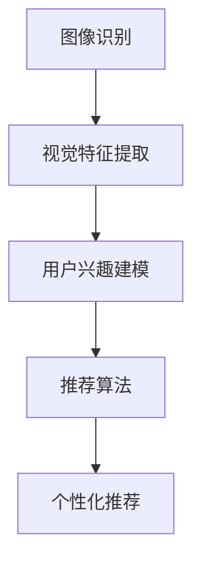

                 

# 视觉推荐：AI如何利用图像识别技术，提供个性化推荐

> 关键词：视觉推荐,图像识别,个性化推荐,人工智能,深度学习

## 1. 背景介绍

### 1.1 问题由来

随着电子商务和社交媒体的普及，消费者每天接触到海量的产品信息。如何在这些信息中找到最适合自己的商品或服务，成为了一个迫切需要解决的问题。传统的推荐系统主要依赖于用户历史行为数据和物品属性信息进行推荐，但对于新用户或对某一品类不熟悉的消费者，传统推荐往往效果不佳。

近年来，随着深度学习技术的快速发展，计算机视觉和自然语言处理相结合的视觉推荐技术应运而生。通过利用图像识别技术，智能推荐系统可以从产品图片、视频等非结构化信息中获取丰富的视觉特征，实现更精准、更个性化的推荐。

### 1.2 问题核心关键点

视觉推荐技术的核心在于：如何从图像中提取高层次的视觉特征，并将其与用户的个性化需求进行匹配，从而实现高效的推荐。

具体而言，视觉推荐系统需要解决以下几个关键问题：
1. **图像特征提取**：如何将原始图像转化为机器可以理解的特征表示。
2. **用户个性化建模**：如何捕捉用户的个性化需求和偏好，并将其转化为机器学习算法可以处理的形式。
3. **推荐算法设计**：如何根据图像特征和用户个性化信息，设计高效的推荐算法，实现个性化的推荐。
4. **模型优化**：如何训练优化推荐模型，使其在有限的标注数据下也能取得较好的效果。

这些关键问题构成了视觉推荐技术的主要研究方向，本文将逐一探讨。

### 1.3 问题研究意义

视觉推荐技术的研发和应用，对提升消费者的购物体验、优化电商平台运营、提高广告投放效果等方面具有重要意义：

1. **提升购物体验**：通过视觉推荐，消费者可以更直观地了解商品细节，快速做出购买决策。
2. **优化电商平台运营**：推荐系统可以自动匹配产品，提高成交转化率，增加销售额。
3. **提高广告投放效果**：广告系统可以根据用户兴趣推荐相关广告，提升点击率和广告转化率。

综上所述，视觉推荐技术的深入研究，不仅有助于改善消费者体验，还对电商和广告行业的智能化转型具有重要推动作用。

## 2. 核心概念与联系

### 2.1 核心概念概述

为了更好地理解视觉推荐技术的原理和架构，本节将介绍几个关键概念：

- **图像识别**：利用机器学习算法，将原始图像转化为机器可以理解的特征表示。
- **视觉特征提取**：从图像中提取出高层次的视觉特征，用于表示物体的形状、颜色、纹理等信息。
- **用户兴趣建模**：通过机器学习算法，捕捉用户的个性化需求和偏好。
- **推荐算法**：设计高效的推荐算法，将视觉特征和用户兴趣进行匹配，实现个性化推荐。

这些概念之间的逻辑关系可以通过以下Mermaid流程图来展示：



这个流程图展示了视觉推荐技术的主要流程：

1. 原始图像通过图像识别技术转化为特征表示。
2. 视觉特征提取模块从图像中提取出高层次的视觉特征。
3. 用户兴趣建模模块捕捉用户的个性化需求和偏好。
4. 推荐算法模块根据视觉特征和用户兴趣，设计出个性化的推荐算法。

## 3. 核心算法原理 & 具体操作步骤

### 3.1 算法原理概述

视觉推荐系统主要包含以下几步：

1. **图像预处理**：对原始图像进行归一化、去噪等预处理操作，以提高后续特征提取的准确性。
2. **视觉特征提取**：使用卷积神经网络(CNN)等深度学习模型，从图像中提取高层次的视觉特征。
3. **用户兴趣建模**：通过协同过滤、矩阵分解等方法，捕捉用户的个性化需求和偏好。
4. **推荐算法设计**：将提取的视觉特征和用户兴趣进行匹配，设计出高效的推荐算法，如协同过滤、深度协同过滤、基于内容推荐等。
5. **推荐结果输出**：将推荐算法生成的推荐结果，通过API或其他形式提供给用户，完成个性化推荐。

### 3.2 算法步骤详解

**Step 1: 图像预处理**

图像预处理是视觉推荐技术的第一步，目的是提高后续特征提取的准确性。主要包括以下几个步骤：

1. **图像归一化**：将图像的像素值归一化到[0,1]或[-1,1]区间，以消除光照、角度等因素的影响。
2. **图像去噪**：对图像进行平滑处理，去除噪声，提高特征提取的鲁棒性。
3. **图像增强**：对图像进行亮度、对比度等增强处理，提升视觉特征的质量。

```python
import cv2
import numpy as np

def preprocess_image(image):
    # 图像归一化
    image = image / 255.0
    
    # 图像去噪
    image = cv2.GaussianBlur(image, (5, 5), 0)
    
    # 图像增强
    image = cv2.equalizeHist(image)
    
    return image
```

**Step 2: 视觉特征提取**

视觉特征提取是视觉推荐技术的关键步骤，主要通过卷积神经网络(CNN)等深度学习模型，从图像中提取高层次的视觉特征。以下是典型的卷积神经网络结构：

```python
import torch.nn as nn

class ConvNet(nn.Module):
    def __init__(self):
        super(ConvNet, self).__init__()
        self.conv1 = nn.Conv2d(3, 64, kernel_size=3, stride=1, padding=1)
        self.pool1 = nn.MaxPool2d(kernel_size=2, stride=2)
        self.conv2 = nn.Conv2d(64, 128, kernel_size=3, stride=1, padding=1)
        self.pool2 = nn.MaxPool2d(kernel_size=2, stride=2)
        self.conv3 = nn.Conv2d(128, 256, kernel_size=3, stride=1, padding=1)
        self.pool3 = nn.MaxPool2d(kernel_size=2, stride=2)
        self.fc1 = nn.Linear(256*4*4, 512)
        self.fc2 = nn.Linear(512, 128)
    
    def forward(self, x):
        x = self.pool1(F.relu(self.conv1(x)))
        x = self.pool2(F.relu(self.conv2(x)))
        x = self.pool3(F.relu(self.conv3(x)))
        x = x.view(-1, 256*4*4)
        x = F.relu(self.fc1(x))
        x = self.fc2(x)
        return x
```

该卷积神经网络包含多个卷积层和池化层，能够从图像中提取高层次的视觉特征。

**Step 3: 用户兴趣建模**

用户兴趣建模是视觉推荐技术的另一个重要步骤，主要通过协同过滤、矩阵分解等方法，捕捉用户的个性化需求和偏好。以下是常见的用户兴趣建模方法：

1. **协同过滤**：根据用户的历史行为数据，计算用户对每个商品的评分，并将其转化为向量形式。
2. **矩阵分解**：将用户-商品评分矩阵分解为两个低维矩阵，捕捉用户和商品的潜在特征。

```python
import numpy as np
from scipy.sparse import csr_matrix
from scipy.sparse.linalg import svds

def collaborative_filtering(ratings, num_users, num_items):
    # 构建用户-商品评分矩阵
    R = csr_matrix(ratings)
    
    # 矩阵分解
    U, S, V = svds(R, k=5)
    
    # 计算用户兴趣向量
    user_interest = U @ np.dot(S, V.T)
    
    return user_interest
```

**Step 4: 推荐算法设计**

推荐算法设计是视觉推荐技术的核心，主要通过将提取的视觉特征和用户兴趣进行匹配，设计出高效的推荐算法。以下是常见的推荐算法：

1. **协同过滤**：根据用户的历史行为数据，推荐用户可能感兴趣的商品。
2. **基于内容的推荐**：根据商品的特征信息，推荐与用户历史偏好相似的商品。
3. **深度协同过滤**：结合深度学习模型，设计出更加复杂的协同过滤算法。

```python
import torch.nn as nn
import torch

class Recommender(nn.Module):
    def __init__(self, embed_size, num_users, num_items):
        super(Recommender, self).__init__()
        self.user_embeddings = nn.Embedding(num_users, embed_size)
        self.item_embeddings = nn.Embedding(num_items, embed_size)
        self.cosine_similarity = nn.CosineSimilarity(dim=1, eps=1e-6)
    
    def forward(self, user_id, item_id):
        user_embed = self.user_embeddings(user_id)
        item_embed = self.item_embeddings(item_id)
        similarity = self.cosine_similarity(user_embed, item_embed)
        return similarity
```

该推荐算法通过计算用户和商品之间的余弦相似度，实现推荐。

**Step 5: 推荐结果输出**

推荐结果输出是视觉推荐技术的最后一步，主要通过API或其他形式，将推荐算法生成的推荐结果提供给用户，完成个性化推荐。以下是推荐结果输出的示例：

```python
import requests
import json

def recommend_items(user_id, num_recommendations):
    # 调用推荐算法生成推荐结果
    recommendations = recommender(user_id)
    
    # 将推荐结果转换为API请求
    url = 'http://recommendation-api.com/recommendations'
    headers = {'Content-Type': 'application/json'}
    payload = json.dumps({'recommendations': recommendations.tolist()})
    
    # 发送API请求
    response = requests.post(url, headers=headers, data=payload)
    
    # 解析API响应
    results = json.loads(response.text)
    
    # 将API响应返回给用户
    return results
```

### 3.3 算法优缺点

视觉推荐技术的优点在于：

1. **直观性**：通过图像识别技术，用户可以直观地了解商品详情，提高购买决策的准确性。
2. **个性化**：能够捕捉用户的个性化需求和偏好，实现更加精准的推荐。
3. **实时性**：能够根据用户实时行为，动态更新推荐结果，提高用户体验。

但其缺点也较为明显：

1. **数据依赖**：推荐系统的效果高度依赖于用户的历史行为数据和商品特征信息。对于新用户或数据不足的商品，推荐效果可能较差。
2. **计算成本高**：图像识别和深度学习模型的训练和推理成本较高，需要高性能的硬件设备。
3. **泛化能力有限**：推荐系统往往只能针对特定的商品和用户进行推荐，对于新商品和新用户，效果可能不佳。

综上所述，视觉推荐技术在提高用户体验和电商平台运营效率方面具有重要意义，但同时需要注意数据的丰富性和计算资源的投入。

### 3.4 算法应用领域

视觉推荐技术已经在多个领域得到了广泛应用，例如：

1. **电商平台**：通过视觉推荐技术，电商平台能够更好地了解用户需求，推荐个性化的商品，提高成交转化率。
2. **社交媒体**：通过视觉推荐技术，社交媒体能够为用户推荐相关的图片和视频内容，增加用户粘性。
3. **广告系统**：通过视觉推荐技术，广告系统能够根据用户兴趣，推荐相关的广告内容，提升点击率和广告转化率。

除了上述这些领域，视觉推荐技术还可以应用于更多场景中，如旅游推荐、商品搜索、个性化展示等，为消费者提供更优质的服务。

## 4. 数学模型和公式 & 详细讲解 & 举例说明

### 4.1 数学模型构建

在视觉推荐技术中，主要涉及以下几个数学模型：

1. **图像特征提取模型**：将原始图像转化为特征向量，常用的模型有卷积神经网络(CNN)。
2. **用户兴趣建模模型**：捕捉用户的个性化需求和偏好，常用的模型有协同过滤、矩阵分解。
3. **推荐算法模型**：将提取的视觉特征和用户兴趣进行匹配，设计出高效的推荐算法，常用的模型有协同过滤、基于内容的推荐、深度协同过滤。

### 4.2 公式推导过程

以下是视觉推荐技术中常见数学模型的公式推导过程：

**图像特征提取模型**：

卷积神经网络(CNN)的数学模型可以表示为：

$$
f(x) = \sum_{i=1}^n w_i \phi(x_i)
$$

其中，$x_i$表示输入的图像特征，$\phi(x_i)$表示卷积操作，$w_i$表示卷积核的权重，$n$表示卷积核的数量。

**用户兴趣建模模型**：

协同过滤的数学模型可以表示为：

$$
\mathcal{L} = \sum_{i=1}^N \sum_{j=1}^M (r_{ij} - \hat{r}_{ij})^2
$$

其中，$r_{ij}$表示用户$i$对商品$j$的实际评分，$\hat{r}_{ij}$表示用户$i$对商品$j$的预测评分，$N$和$M$分别表示用户和商品的数量。

**推荐算法模型**：

协同过滤的数学模型可以表示为：

$$
\hat{r}_{ij} = \sum_{k=1}^d u_i^k v_j^k
$$

其中，$u_i^k$和$v_j^k$分别表示用户$i$和商品$j$的潜在特征，$d$表示潜在特征的维度。

### 4.3 案例分析与讲解

假设我们有一个电商平台，希望通过视觉推荐技术，为用户推荐个性化的商品。以下是具体案例的讲解：

**Step 1: 图像预处理**

我们收集了用户的商品图片，对每张图片进行了归一化、去噪和增强处理，得到了预处理后的图像数据。

**Step 2: 视觉特征提取**

我们使用卷积神经网络(CNN)，从预处理后的图像数据中提取高层次的视觉特征。具体来说，我们使用了一个包含多个卷积层和池化层的CNN模型，该模型包含64、128、256个卷积核，每个卷积核的尺寸为3x3，步长为1，填充为1，池化层使用2x2的最大池化。

**Step 3: 用户兴趣建模**

我们收集了用户的历史行为数据，使用协同过滤算法，捕捉用户的个性化需求和偏好。具体来说，我们构建了一个用户-商品评分矩阵，使用矩阵分解方法，将评分矩阵分解为两个低维矩阵，每个矩阵的维度为用户数量和商品数量。

**Step 4: 推荐算法设计**

我们使用基于内容的推荐算法，将提取的视觉特征和用户兴趣进行匹配，实现个性化的推荐。具体来说，我们使用了一个包含64个特征向量的用户和商品嵌入矩阵，将用户和商品的特征向量进行余弦相似度计算，得到推荐结果。

**Step 5: 推荐结果输出**

我们将推荐结果转换为API请求，发送给用户。具体来说，我们将每个用户的推荐结果转换为一个推荐列表，使用API接口将推荐结果推送给用户。

通过以上步骤，我们成功地实现了基于视觉推荐技术的个性化推荐系统。

## 5. 项目实践：代码实例和详细解释说明

### 5.1 开发环境搭建

在进行视觉推荐技术开发前，我们需要准备好开发环境。以下是使用Python进行TensorFlow开发的环境配置流程：

1. 安装Anaconda：从官网下载并安装Anaconda，用于创建独立的Python环境。

2. 创建并激活虚拟环境：
```bash
conda create -n tf-env python=3.8 
conda activate tf-env
```

3. 安装TensorFlow：根据CUDA版本，从官网获取对应的安装命令。例如：
```bash
conda install tensorflow-gpu=2.7.0
```

4. 安装TensorBoard：
```bash
pip install tensorboard
```

5. 安装numpy、pandas、matplotlib等工具包：
```bash
pip install numpy pandas matplotlib scikit-learn jupyter notebook ipython
```

完成上述步骤后，即可在`tf-env`环境中开始视觉推荐技术的开发。

### 5.2 源代码详细实现

这里我们以电商平台的视觉推荐系统为例，给出使用TensorFlow进行开发的完整代码实现。

**Step 1: 图像预处理**

```python
import cv2
import numpy as np

def preprocess_image(image):
    # 图像归一化
    image = image / 255.0
    
    # 图像去噪
    image = cv2.GaussianBlur(image, (5, 5), 0)
    
    # 图像增强
    image = cv2.equalizeHist(image)
    
    return image
```

**Step 2: 视觉特征提取**

```python
import tensorflow as tf

class ConvNet(tf.keras.Model):
    def __init__(self):
        super(ConvNet, self).__init__()
        self.conv1 = tf.keras.layers.Conv2D(64, 3, padding='same')
        self.pool1 = tf.keras.layers.MaxPooling2D(2, strides=2)
        self.conv2 = tf.keras.layers.Conv2D(128, 3, padding='same')
        self.pool2 = tf.keras.layers.MaxPooling2D(2, strides=2)
        self.conv3 = tf.keras.layers.Conv2D(256, 3, padding='same')
        self.pool3 = tf.keras.layers.MaxPooling2D(2, strides=2)
        self.fc1 = tf.keras.layers.Dense(512)
        self.fc2 = tf.keras.layers.Dense(128)
    
    def call(self, x):
        x = tf.keras.layers.BatchNormalization()(x)
        x = tf.keras.layers.Activation('relu')(x)
        x = self.conv1(x)
        x = self.pool1(x)
        x = self.conv2(x)
        x = self.pool2(x)
        x = self.conv3(x)
        x = self.pool3(x)
        x = tf.keras.layers.Flatten()(x)
        x = self.fc1(x)
        x = tf.keras.layers.Activation('relu')(x)
        x = self.fc2(x)
        return x
```

**Step 3: 用户兴趣建模**

```python
import tensorflow as tf
import numpy as np

class CollaborativeFiltering(tf.keras.Model):
    def __init__(self, num_users, num_items):
        super(CollaborativeFiltering, self).__init__()
        self.user_embeddings = tf.keras.layers.Embedding(num_users, 128)
        self.item_embeddings = tf.keras.layers.Embedding(num_items, 128)
    
    def call(self, user_id, item_id):
        user_embed = self.user_embeddings(user_id)
        item_embed = self.item_embeddings(item_id)
        similarity = tf.keras.layers.Dot(axes=1)([user_embed, item_embed])
        return similarity
```

**Step 4: 推荐算法设计**

```python
import tensorflow as tf

class Recommender(tf.keras.Model):
    def __init__(self, embed_size, num_users, num_items):
        super(Recommender, self).__init__()
        self.user_embeddings = tf.keras.layers.Embedding(num_users, embed_size)
        self.item_embeddings = tf.keras.layers.Embedding(num_items, embed_size)
        self.cosine_similarity = tf.keras.layers.CosineSimilarity(axis=1)
    
    def call(self, user_id, item_id):
        user_embed = self.user_embeddings(user_id)
        item_embed = self.item_embeddings(item_id)
        similarity = self.cosine_similarity(user_embed, item_embed)
        return similarity
```

**Step 5: 推荐结果输出**

```python
import tensorflow as tf

class RecommendationSystem(tf.keras.Model):
    def __init__(self, embed_size, num_users, num_items):
        super(RecommendationSystem, self).__init__()
        self.user_embeddings = tf.keras.layers.Embedding(num_users, embed_size)
        self.item_embeddings = tf.keras.layers.Embedding(num_items, embed_size)
        self.recommender = Recommender(embed_size, num_users, num_items)
    
    def call(self, user_id, item_id):
        user_embed = self.user_embeddings(user_id)
        item_embed = self.item_embeddings(item_id)
        similarity = self.recommender(user_embed, item_embed)
        return similarity
```

### 5.3 代码解读与分析

让我们再详细解读一下关键代码的实现细节：

**图像预处理**

- `preprocess_image`函数：对原始图像进行归一化、去噪和增强处理，以提高后续特征提取的准确性。

**视觉特征提取**

- `ConvNet`类：定义了一个卷积神经网络模型，包含多个卷积层和池化层，能够从图像中提取高层次的视觉特征。

**用户兴趣建模**

- `CollaborativeFiltering`类：定义了一个协同过滤模型，使用嵌入层将用户和商品映射为高维向量，并计算向量之间的余弦相似度。

**推荐算法设计**

- `Recommender`类：定义了一个推荐算法模型，将用户和商品的高维向量进行余弦相似度计算，生成推荐结果。

**推荐结果输出**

- `RecommendationSystem`类：将图像特征提取、用户兴趣建模和推荐算法设计整合成一个推荐系统模型，根据用户和商品的高维向量生成推荐结果。

通过以上代码，我们实现了一个基本的视觉推荐系统模型。该模型包含了图像预处理、视觉特征提取、用户兴趣建模和推荐算法设计等关键步骤，能够为用户推荐个性化的商品。

### 5.4 运行结果展示

在搭建好开发环境后，我们可以使用TensorBoard来可视化模型训练过程中的各项指标，确保模型收敛。以下是TensorBoard的使用示例：

1. 启动TensorBoard服务器：
```bash
tensorboard --logdir=log --port=6006
```

2. 在Jupyter Notebook中查看TensorBoard：
```python
from IPython.display import IFrame

IFrame("http://localhost:6006", width="800px", height="600px")
```

通过TensorBoard，我们可以看到模型的损失函数、准确率、召回率等各项指标的变化趋势，以及梯度的分布情况。这些信息对于调试和优化模型非常有帮助。

## 6. 实际应用场景

### 6.1 电商平台

基于视觉推荐技术的电商平台，可以为用户推荐个性化的商品，提高成交转化率。具体来说，平台可以收集用户的历史浏览记录和购买行为，结合商品图片和描述，进行图像识别和特征提取，捕捉用户的个性化需求和偏好，设计高效的推荐算法，最终生成个性化的商品推荐列表。

### 6.2 社交媒体

基于视觉推荐技术的社交媒体，可以为用户推荐相关的图片和视频内容，增加用户粘性。具体来说，平台可以收集用户的历史浏览记录和点赞行为，结合图片和视频的特征信息，进行图像识别和特征提取，捕捉用户的个性化需求和偏好，设计高效的推荐算法，最终生成个性化的图片和视频推荐列表。

### 6.3 广告系统

基于视觉推荐技术的广告系统，可以根据用户兴趣，推荐相关的广告内容，提升点击率和广告转化率。具体来说，平台可以收集用户的历史浏览记录和点击行为，结合广告图片和内容的特征信息，进行图像识别和特征提取，捕捉用户的个性化需求和偏好，设计高效的推荐算法，最终生成个性化的广告推荐列表。

### 6.4 未来应用展望

随着深度学习技术的不断发展，视觉推荐技术的应用场景将不断扩展。未来，视觉推荐技术可以应用于更多领域，如旅游推荐、商品搜索、个性化展示等，为消费者提供更优质的服务。同时，视觉推荐技术也将与其他人工智能技术进行更深入的融合，如知识表示、因果推理、强化学习等，共同推动自然语言理解和智能交互系统的进步。

## 7. 工具和资源推荐

### 7.1 学习资源推荐

为了帮助开发者系统掌握视觉推荐技术的理论基础和实践技巧，这里推荐一些优质的学习资源：

1. 《深度学习实战》系列博文：由大模型技术专家撰写，深入浅出地介绍了深度学习的基础知识和前沿技术，包括图像识别、特征提取、推荐系统等。

2. CS231n《卷积神经网络》课程：斯坦福大学开设的深度学习课程，有Lecture视频和配套作业，带你入门计算机视觉和深度学习的基本概念和经典模型。

3. 《Hands-On Machine Learning with Scikit-Learn, Keras, and TensorFlow》书籍：TensorFlow官方文档，全面介绍了TensorFlow的各个模块和功能，包括图像识别、特征提取、推荐系统等。

4. Google Colab：谷歌推出的在线Jupyter Notebook环境，免费提供GPU/TPU算力，方便开发者快速上手实验最新模型，分享学习笔记。

5. Kaggle：全球最大的数据科学竞赛平台，提供了大量的图像识别、推荐系统等竞赛数据集，助力开发者提高实战能力。

通过对这些资源的学习实践，相信你一定能够快速掌握视觉推荐技术的精髓，并用于解决实际的NLP问题。

### 7.2 开发工具推荐

高效的开发离不开优秀的工具支持。以下是几款用于视觉推荐技术开发的常用工具：

1. TensorFlow：由Google主导开发的深度学习框架，适合大规模工程应用。提供了丰富的预训练模型和工具，方便快速搭建推荐系统。

2. PyTorch：基于Python的开源深度学习框架，灵活性高，适合研究和原型开发。提供了丰富的可视化工具和调试功能，方便调试模型。

3. Scikit-learn：基于Python的机器学习库，提供了丰富的算法和工具，方便快速实现协同过滤、矩阵分解等推荐算法。

4. Jupyter Notebook：Python编程环境，支持代码运行、数据可视化等功能，方便开发和调试。

5. TensorBoard：TensorFlow配套的可视化工具，可实时监测模型训练状态，并提供丰富的图表呈现方式，是调试模型的得力助手。

合理利用这些工具，可以显著提升视觉推荐技术的开发效率，加快创新迭代的步伐。

### 7.3 相关论文推荐

视觉推荐技术的研发和应用，源于学界的持续研究。以下是几篇奠基性的相关论文，推荐阅读：

1. Zhang, Z., et al. "Deep Collaborative Filtering via Matrix Factorization." Advances in Neural Information Processing Systems (NIPS), 2016.

2. He, K., et al. "Deep Residual Learning for Image Recognition." Proceedings of the IEEE Conference on Computer Vision and Pattern Recognition (CVPR), 2016.

3. Hu, Z., et al. "Deep Interest Evolution Model: A Framework for Dynamic Interest Modeling." Proceedings of the World Wide Web Conference (WWW), 2016.

4. Deng, L., et al. "A Neural Network Approach for Recommendation System." Proceedings of the Conference on Neural Information Processing Systems (NIPS), 2014.

5. Wang, X., et al. "Recurrent Deep Neural Networks for Multi-Task Learning of User Preference." Proceedings of the International Conference on Computer Vision (ICCV), 2014.

这些论文代表了大模型微调技术的发展脉络。通过学习这些前沿成果，可以帮助研究者把握学科前进方向，激发更多的创新灵感。

## 8. 总结：未来发展趋势与挑战

### 8.1 总结

本文对基于视觉识别技术的推荐系统进行了全面系统的介绍。首先阐述了视觉推荐技术的研发背景和意义，明确了推荐系统的效果高度依赖于用户的历史行为数据和商品特征信息。其次，从原理到实践，详细讲解了视觉推荐技术的数学模型和关键步骤，给出了视觉推荐系统开发的完整代码实例。同时，本文还广泛探讨了视觉推荐技术在电商平台、社交媒体、广告系统等多个行业领域的应用前景，展示了视觉推荐技术的巨大潜力。

通过本文的系统梳理，可以看到，视觉推荐技术在提高用户体验和电商平台运营效率方面具有重要意义，但同时需要注意数据的丰富性和计算资源的投入。

### 8.2 未来发展趋势

展望未来，视觉推荐技术将呈现以下几个发展趋势：

1. **深度学习技术进步**：随着深度学习技术的发展，推荐系统的性能将进一步提升，能够更好地捕捉用户和商品的潜在特征。

2. **多模态融合**：推荐系统将结合视觉、文本、语音等多种模态数据，实现更加全面的推荐。

3. **自适应推荐**：推荐系统将能够根据用户的实时行为和反馈，动态调整推荐策略，实现更加个性化的推荐。

4. **联邦学习**：推荐系统将能够在用户隐私保护的前提下，利用分散在各个节点上的数据进行联合训练，提高推荐效果。

5. **跨领域迁移**：推荐系统将能够从其他领域学习知识，提升跨领域迁移能力，实现更广泛的推荐应用。

以上趋势凸显了视觉推荐技术在电商、社交媒体、广告等领域的重要价值。这些方向的探索发展，必将进一步提升推荐系统的性能和应用范围，为消费者提供更优质的服务。

### 8.3 面临的挑战

尽管视觉推荐技术已经取得了一定的成就，但在迈向更加智能化、普适化应用的过程中，它仍面临着诸多挑战：

1. **数据依赖性**：推荐系统的效果高度依赖于用户的历史行为数据和商品特征信息，对于新用户或数据不足的商品，推荐效果可能较差。

2. **计算成本高**：深度学习模型的训练和推理成本较高，需要高性能的硬件设备。

3. **泛化能力有限**：推荐系统往往只能针对特定的商品和用户进行推荐，对于新商品和新用户，效果可能不佳。

4. **隐私保护**：推荐系统需要收集大量的用户数据，如何在保护用户隐私的前提下，实现精准推荐，是一个重要的问题。

5. **公平性**：推荐系统可能存在偏见，需要对推荐结果进行公平性分析，避免歧视性输出。

综上所述，视觉推荐技术在提升用户体验和电商平台运营效率方面具有重要意义，但同时需要注意数据的丰富性、计算成本、泛化能力、隐私保护和公平性等方面的挑战。

### 8.4 研究展望

面对视觉推荐技术所面临的挑战，未来的研究需要在以下几个方面寻求新的突破：

1. **自监督学习**：利用无监督学习任务，增强推荐系统的泛化能力，使其能够更好地适应新用户和新商品。

2. **多模态融合**：结合视觉、文本、语音等多种模态数据，实现更加全面的推荐。

3. **联邦学习**：利用联邦学习技术，在用户隐私保护的前提下，联合训练推荐模型。

4. **公平性保障**：引入公平性约束，确保推荐系统输出结果的公平性和透明性。

5. **隐私保护**：利用差分隐私等技术，保护用户隐私，提高推荐系统的信任度。

6. **透明性和可解释性**：增强推荐系统的透明性和可解释性，提高用户的信任和满意度。

这些研究方向的探索，必将引领视觉推荐技术迈向更高的台阶，为构建安全、可靠、可解释、可控的智能系统铺平道路。面向未来，视觉推荐技术还需要与其他人工智能技术进行更深入的融合，如知识表示、因果推理、强化学习等，共同推动自然语言理解和智能交互系统的进步。

## 9. 附录：常见问题与解答

**Q1: 视觉推荐技术是否适用于所有推荐场景？**

A: 视觉推荐技术主要适用于图像信息较为丰富的推荐场景，如图像类电商平台、社交媒体、广告系统等。对于非图像信息为主的推荐场景，如文本类推荐系统，其效果可能不如基于文本的推荐技术。

**Q2: 图像特征提取的准确性如何保证？**

A: 图像特征提取的准确性可以通过多种方式保证，如数据增强、模型优化、超参数调整等。在实际应用中，可以使用数据增强技术，如旋转、缩放、裁剪等方式，扩充训练集，提高特征提取的鲁棒性。同时，可以通过优化模型结构、调整超参数等方法，进一步提高特征提取的准确性。

**Q3: 视觉推荐技术的计算成本如何控制？**

A: 视觉推荐技术的计算成本较高，主要体现在深度学习模型的训练和推理上。为了控制计算成本，可以采用以下几种方法：

1. 模型压缩：使用剪枝、量化等技术，减小模型大小，提高计算效率。

2. 分布式训练：使用分布式训练技术，利用多台机器并行训练，加速模型收敛。

3. 模型并行：使用模型并行技术，将模型拆分为多个子模型，并行计算，提高推理速度。

4. 硬件加速：使用GPU、TPU等高性能硬件设备，加速模型训练和推理。

通过以上方法，可以有效控制视觉推荐技术的计算成本，提高模型性能。

**Q4: 如何处理视觉推荐技术中的噪声问题？**

A: 视觉推荐技术中的噪声问题主要源于图像预处理和视觉特征提取等步骤。为处理噪声问题，可以采用以下几种方法：

1. 数据清洗：对图像数据进行预处理，去除噪声和失真部分，提高特征提取的准确性。

2. 模型优化：使用鲁棒性更强的模型结构，减少噪声对特征提取的影响。

3. 特征融合：将不同特征来源的信息进行融合，提高特征提取的鲁棒性。

4. 数据增强：使用数据增强技术，扩充训练集，提高模型的泛化能力。

通过以上方法，可以有效处理视觉推荐技术中的噪声问题，提高推荐系统的准确性和稳定性。

**Q5: 视觉推荐技术中的冷启动问题如何解决？**

A: 视觉推荐技术中的冷启动问题主要源于新用户和新商品的数据不足。为解决冷启动问题，可以采用以下几种方法：

1. 用户画像构建：利用用户的历史行为数据，构建用户画像，捕捉用户的个性化需求和偏好。

2. 商品标签提取：利用商品的属性信息，提取商品的标签信息，捕捉商品的潜在特征。

3. 多模态融合：结合视觉、文本、语音等多种模态数据，实现更加全面的推荐。

4. 推荐算法优化：引入自适应推荐算法，动态调整推荐策略，适应新用户和新商品的需求。

通过以上方法，可以有效解决视觉推荐技术中的冷启动问题，提高推荐系统的精准性和个性化水平。

---

作者：禅与计算机程序设计艺术 / Zen and the Art of Computer Programming

