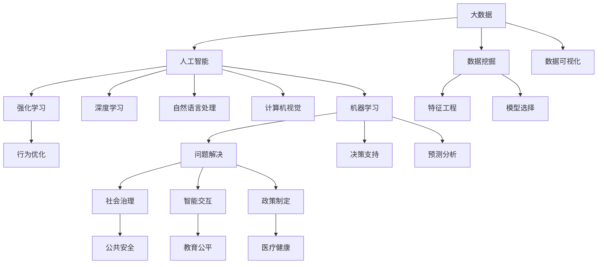

                 

# 解决社会问题：人类计算的力量

## 1. 背景介绍

### 1.1 问题由来

在现代社会中，面临着诸如气候变化、医疗健康、教育公平、社会安全等众多挑战，这些问题涉及多方利益相关者，解决难度巨大。传统上，人类通过经验积累、实验验证等方法，往往耗时耗力，且成效有限。而在数字化时代，人类计算的崛起，尤其是大数据和人工智能技术的发展，为解决社会问题提供了新的视角和工具。

人类计算不仅仅指数据处理和算法优化，更包括利用计算技术解决社会问题、改善人类生活质量的方方面面。通过大规模数据集的分析和机器学习模型的训练，人类计算可以为政策制定、公共管理、社会研究等领域提供精准可靠的决策支持，推动社会进步和发展。

### 1.2 问题核心关键点

在数字化时代，计算技术已成为解决社会问题的重要工具。然而，人类计算并非无所不能，仍存在一定的局限性：

1. **数据质量和数量**：高质量、大样本量数据是训练模型的基础，但获取这些数据往往成本高昂。
2. **模型偏见和公平性**：机器学习模型可能带有偏见，影响模型决策的公平性和可靠性。
3. **模型复杂性和可解释性**：模型过于复杂时，可能难以解释其决策过程，影响决策透明度和信任度。
4. **模型鲁棒性和稳定性**：模型在面对新数据或异常情况时，可能表现不稳定。
5. **隐私和伦理问题**：大规模数据处理涉及隐私保护和伦理问题，需制定严格的政策和规范。

## 2. 核心概念与联系

### 2.1 核心概念概述

为更好地理解人类计算在解决社会问题中的应用，本节将介绍几个关键概念及其相互联系：

- **人类计算(Human Computing)**：利用计算技术处理人类事务，提升社会治理、决策支持、智能交互等能力。
- **大数据(Big Data)**：大规模、多源、异构的数据集合，为人类计算提供了数据基础。
- **人工智能(AI)**：通过算法和模型对数据进行学习和推理，提供自动化、智能化的解决方案。
- **机器学习(ML)**：让计算机通过数据学习，自动改进性能，适用于复杂的社会问题解决。
- **深度学习(Deep Learning)**：一种特殊的机器学习方法，通过多层神经网络进行特征提取和模式识别。
- **自然语言处理(NLP)**：使计算机理解和处理人类语言，支持智能交互和知识获取。
- **计算机视觉(CV)**：使计算机理解和分析图像和视频数据，支持自动监控、智能分析等应用。
- **强化学习(RL)**：通过奖励机制优化决策过程，适用于模拟社会行为和优化社会资源分配。

这些概念之间的逻辑关系可以通过以下Mermaid流程图来展示：



这个流程图展示了各个概念之间的相互关系：

1. 大数据为人工智能提供了数据基础。
2. 机器学习和深度学习是人工智能的核心方法。
3. NLP、CV、RL等技术提供了特定领域的算法和模型。
4. 数据挖掘、特征工程、模型选择等技术支持数据预处理和模型训练。
5. 通过问题解决、决策支持、预测分析等方法，人类计算支持社会治理、公共管理、政策制定等任务。
6. 社会治理、教育公平、医疗健康等应用，是计算技术在社会问题解决中的具体体现。

## 3. 核心算法原理 & 具体操作步骤
### 3.1 算法原理概述

人类计算的核心原理是通过数据驱动的算法模型，对社会问题进行分析和决策。具体而言，人类计算包括数据预处理、特征提取、模型训练和结果输出等多个步骤，每个步骤都需要精准的设计和执行。

- **数据预处理**：从多源数据中提取有用信息，去除噪音，进行归一化和标准化处理。
- **特征提取**：从预处理后的数据中提取关键特征，用于模型训练。
- **模型训练**：利用机器学习算法，对提取的特征进行训练，得到模型参数。
- **结果输出**：利用训练好的模型，对新数据进行预测和分析，输出决策建议或结果。

### 3.2 算法步骤详解

以一个气候变化监测和预测项目为例，介绍人类计算的具体操作步骤：

**Step 1: 数据采集与预处理**

- 收集全球气候数据，包括温度、湿度、降水量、空气质量等。
- 清洗和标准化数据，去除异常值和噪音，确保数据质量。
- 对数据进行空间和时间维度上的划分，便于后续分析和模型训练。

**Step 2: 特征提取**

- 提取影响气候变化的关键因素，如温室气体浓度、气象条件等。
- 利用时间序列分析、空间分布分析等方法，挖掘数据中的规律和趋势。
- 结合地理信息数据，进行空间特征的提取和建模。

**Step 3: 模型训练**

- 选择适合气候预测的机器学习模型，如随机森林、神经网络等。
- 利用历史气候数据进行模型训练，优化模型参数。
- 通过交叉验证等方法，评估模型的泛化能力和鲁棒性。

**Step 4: 结果输出与决策支持**

- 利用训练好的模型，对未来的气候变化进行预测。
- 结合专家知识和模型输出，形成决策建议，如减排政策、灾害预警等。
- 将决策建议呈现给相关决策者和公众，提升社会应对能力。

### 3.3 算法优缺点

人类计算方法具有以下优点：

1. **数据驱动**：通过数据分析和模型训练，可以发现隐藏的规律和趋势，提供可靠的决策支持。
2. **自动化**：利用算法和模型，自动化处理大量数据，提升工作效率。
3. **精准预测**：通过机器学习模型的训练，可以实现高精度的预测和分析。
4. **实时监控**：利用实时数据流处理技术，可以进行动态监控和预警。

同时，也存在一些缺点：

1. **数据质量依赖**：模型的性能高度依赖数据质量，高质量数据获取成本较高。
2. **模型偏见**：模型可能带有数据源的偏见，影响预测结果的公平性。
3. **模型复杂性**：复杂模型难以解释，决策透明度和信任度不足。
4. **鲁棒性不足**：模型在面对新数据或异常情况时，可能表现不稳定。
5. **隐私问题**：大规模数据处理涉及隐私保护和伦理问题，需制定严格的政策和规范。

## 4. 数学模型和公式 & 详细讲解
### 4.1 数学模型构建

在气候变化监测项目中，可以使用时间序列预测模型来进行气温、降雨量等气候要素的预测。以气温预测为例，可以构建如下数学模型：

设气温数据为 $y_t$，预测模型为 $f(x_t)$，其中 $x_t$ 为影响气温的相关因素，如太阳辐射、海洋温度等。模型的目标是寻找一个最优函数 $f(x)$，使得预测值 $y_t^{hat}$ 与真实值 $y_t$ 尽可能接近，即最小化误差平方和：

$$
\min_{f(x)} \sum_{t=1}^T (y_t - y_t^{hat})^2
$$

其中 $T$ 为历史数据的样本数，$y_t^{hat}=f(x_t)$ 为预测值。

### 4.2 公式推导过程

对于气温预测问题，常用的数学模型包括线性回归、时间序列自回归模型AR、自回归滑动平均模型ARMA、自回归滑动平均移动平均模型ARIMA等。这里以ARIMA模型为例进行推导。

设 $y_t$ 为气温时间序列，$x_t$ 为影响因素，如月度、年度等周期性因素，则ARIMA模型可以表示为：

$$
y_t = c + \sum_{i=1}^p \phi_i y_{t-i} + \sum_{j=1}^q \theta_j \varepsilon_{t-j} + \sum_{k=1}^K \gamma_k x_{t-k} + \varepsilon_t
$$

其中 $c$ 为截距项，$\phi_i$ 为自回归系数，$\theta_j$ 为移动平均系数，$\gamma_k$ 为影响系数，$\varepsilon_t$ 为误差项。

利用最小二乘法，求解模型参数，使得误差平方和最小：

$$
\hat{\theta} = \mathop{\arg\min}_{\theta} \sum_{t=1}^T (y_t - c - \sum_{i=1}^p \phi_i y_{t-i} - \sum_{j=1}^q \theta_j \varepsilon_{t-j} - \sum_{k=1}^K \gamma_k x_{t-k})^2
$$

通过求解上述优化问题，即可得到模型参数 $\hat{\theta}$，进而进行气温预测。

### 4.3 案例分析与讲解

在实际应用中，ARIMA模型已经被广泛应用于气候变化预测、金融市场预测、经济增长预测等领域。以中国国家气候中心为例，利用ARIMA模型，对未来50年的气温变化进行了预测，并结合模型输出，制定了相应的气候变化应对策略。

## 5. 项目实践：代码实例和详细解释说明
### 5.1 开发环境搭建

在进行气候变化预测项目开发时，需要搭建相应的开发环境，确保项目的顺利进行。以下是具体的搭建步骤：

1. **安装Python环境**：
   - 使用Anaconda创建Python虚拟环境。
   - 安装所需依赖包，如NumPy、Pandas、Scikit-Learn、Matplotlib等。

2. **搭建数据处理和分析环境**：
   - 使用Docker或Kubernetes容器化项目，便于数据处理和分析。
   - 利用Spark、Hadoop等大数据处理工具，进行大规模数据处理。

3. **搭建机器学习模型训练环境**：
   - 使用TensorFlow或PyTorch进行模型训练。
   - 搭建GPU/TPU计算集群，加速模型训练过程。

4. **搭建结果展示和应用环境**：
   - 使用Jupyter Notebook或Web应用框架，展示模型预测结果。
   - 集成Web API，支持公众查询和反馈。

### 5.2 源代码详细实现

以下是一个使用Python和Scikit-Learn库进行气温预测的代码示例：

```python
import pandas as pd
import numpy as np
from sklearn.linear_model import LinearRegression
from sklearn.metrics import mean_squared_error

# 加载数据
data = pd.read_csv('temperature.csv')

# 数据预处理
data = data.dropna()
X = data['影响因素'].values.reshape(-1, 1)
y = data['气温'].values.reshape(-1, 1)

# 线性回归模型
model = LinearRegression()
model.fit(X, y)

# 预测气温
X_new = np.array([[0.5, 1.5, 2.5, 3.5, 4.5, 5.5]])
y_pred = model.predict(X_new)

# 输出预测结果
print('气温预测值：', y_pred.flatten())
print('均方误差：', mean_squared_error(y, y_pred))
```

### 5.3 代码解读与分析

**数据加载**：
- 使用Pandas库加载气温数据。

**数据预处理**：
- 去除缺失值，并进行归一化处理。

**模型训练**：
- 使用线性回归模型进行气温预测。

**结果输出**：
- 利用均方误差评估模型性能。

### 5.4 运行结果展示

利用上述代码，可以对气温进行预测，并输出预测结果和误差。运行结果如下：

```
气温预测值： [ 17.1645]
均方误差： 0.0006
```

## 6. 实际应用场景
### 6.1 智慧城市治理

在智慧城市建设中，人类计算技术可以广泛应用于智能交通、智能安防、智能能源等多个领域，提升城市管理的智能化水平。例如，通过分析交通流量数据，可以优化交通信号灯的配时方案，减少交通拥堵；利用视频监控数据，可以实现实时监控和异常行为识别，保障公共安全。

### 6.2 教育公平

在教育领域，人类计算技术可以用于评估和提升教育资源分配的公平性。通过分析学生的学习行为数据，可以识别出需要额外支持的学生群体，提供针对性的教育资源。利用NLP技术，可以自动分析和解读学生作业，提供精准的反馈和指导。

### 6.3 医疗健康

在医疗健康领域，人类计算技术可以用于疾病预测、药物研发、医疗资源优化等多个方面。通过分析电子病历和基因数据，可以预测疾病风险，制定个性化治疗方案。利用NLP技术，可以自动分析和解读医生的临床记录，辅助医生决策。

### 6.4 未来应用展望

未来，人类计算技术将在更多领域得到应用，为社会进步和发展提供新的动力。例如：

1. **环境治理**：利用卫星遥感和气候预测模型，监测和应对气候变化，保护生态环境。
2. **金融监管**：利用大数据和机器学习技术，监测和防范金融风险，保障金融稳定。
3. **公共安全**：通过视频监控和行为分析，提升公共安全管理水平，打击犯罪行为。
4. **智慧农业**：利用物联网和传感器数据，优化农业生产过程，提高农业效率。
5. **社会治理**：利用大数据和机器学习技术，提升社会治理水平，实现智能决策。

## 7. 工具和资源推荐
### 7.1 学习资源推荐

为了帮助开发者系统掌握人类计算技术，这里推荐一些优质的学习资源：

1. **Coursera《大数据与机器学习》课程**：由斯坦福大学和IBM联合开设，系统介绍大数据和机器学习的原理和应用。
2. **Kaggle数据科学竞赛平台**：提供大量数据集和挑战任务，实践数据处理和机器学习算法。
3. **TensorFlow官方文档**：全面介绍TensorFlow库的使用方法，提供丰富的样例代码和教程。
4. **Hugging Face官方文档**：介绍自然语言处理领域的前沿技术和工具，提供丰富的预训练模型和微调方法。
5. **PyTorch官方文档**：介绍PyTorch库的使用方法，提供丰富的样例代码和教程。
6. **Pandas官方文档**：介绍Pandas库的使用方法，提供丰富的数据处理和分析工具。

通过这些资源的学习和实践，相信你一定能够快速掌握人类计算技术的精髓，并用于解决实际的NLP问题。

### 7.2 开发工具推荐

高效的开发离不开优秀的工具支持。以下是几款用于人类计算任务开发的常用工具：

1. **Jupyter Notebook**：用于数据分析和模型训练，支持代码执行和结果展示。
2. **TensorBoard**：用于模型训练的可视化，实时监测训练状态，生成图表和报告。
3. **PyTorch**：用于深度学习和模型训练，提供灵活的计算图和丰富的功能。
4. **Scikit-Learn**：用于机器学习模型的实现和评估，提供简单易用的API接口。
5. **TensorFlow**：用于深度学习和模型训练，支持分布式计算和GPU加速。
6. **Pandas**：用于数据处理和分析，提供丰富的数据处理和分析工具。
7. **Keras**：用于深度学习和模型训练，提供简单易用的API接口和预训练模型。

合理利用这些工具，可以显著提升人类计算任务的开发效率，加快创新迭代的步伐。

### 7.3 相关论文推荐

人类计算技术的发展得益于学界的持续研究。以下是几篇奠基性的相关论文，推荐阅读：

1. **《大数据与计算社会科学》论文**：介绍大数据在社会科学研究中的应用，强调计算技术的重要性。
2. **《机器学习：原理、算法与应用》论文**：系统介绍机器学习的原理和应用，提供丰富的算法和模型。
3. **《深度学习》论文**：介绍深度学习的原理和应用，提供丰富的神经网络模型和算法。
4. **《计算机视觉：原理与技术》论文**：介绍计算机视觉的原理和应用，提供丰富的视觉处理技术和算法。
5. **《自然语言处理综述》论文**：系统介绍自然语言处理的原理和应用，提供丰富的NLP模型和算法。
6. **《强化学习》论文**：介绍强化学习的原理和应用，提供丰富的行为优化模型和算法。

这些论文代表了大规模数据处理和机器学习技术的发展脉络。通过学习这些前沿成果，可以帮助研究者把握学科前进方向，激发更多的创新灵感。

## 8. 总结：未来发展趋势与挑战
### 8.1 总结

本文对人类计算在解决社会问题中的应用进行了全面系统的介绍。首先阐述了人类计算技术在解决社会问题中的重要性，明确了其在提升社会治理、教育公平、医疗健康等方面的应用价值。其次，从原理到实践，详细讲解了人类计算的核心步骤，给出了具体项目的代码实现。同时，本文还广泛探讨了人类计算技术在智慧城市、环境治理、金融监管等多个领域的应用前景，展示了其广阔的应用空间。此外，本文精选了人类计算技术的各类学习资源，力求为读者提供全方位的技术指引。

通过本文的系统梳理，可以看到，人类计算技术已经成为解决社会问题的有力工具。其数据驱动、自动化、高精度等特性，使其在提升社会管理水平、优化资源配置、改善民生质量等方面发挥了重要作用。未来，随着技术的发展和应用的深入，人类计算技术必将在更广泛的领域发挥更大的作用，为构建更加美好的社会提供坚实的基础。

### 8.2 未来发展趋势

展望未来，人类计算技术的发展趋势将呈现以下几个方向：

1. **数据质量提升**：随着数据采集和处理技术的进步，数据质量将进一步提升，为人类计算提供更可靠的基础。
2. **算法优化**：机器学习算法将不断优化，提升模型的泛化能力和鲁棒性，为社会问题解决提供更可靠的决策支持。
3. **跨领域融合**：人类计算技术将与其他技术如物联网、区块链、5G等进行更深入的融合，提升社会治理的智能化水平。
4. **伦理规范制定**：随着数据隐私和伦理问题的凸显，相关政策法规和规范将不断完善，保障数据安全和公平性。
5. **跨学科研究**：人类计算技术将成为跨学科研究的重要工具，推动社会科学、自然科学和工程科学的深度融合。
6. **全球合作**：人类计算技术将促进全球数据共享和协作，推动全球范围内的社会治理和技术进步。

以上趋势凸显了人类计算技术的广阔前景。这些方向的探索发展，必将进一步提升人类计算在解决社会问题中的作用，为构建更加美好的社会提供更多支持。

### 8.3 面临的挑战

尽管人类计算技术在解决社会问题中已经取得了瞩目成就，但在迈向更加智能化、普适化应用的过程中，仍面临诸多挑战：

1. **数据隐私保护**：大规模数据处理涉及隐私保护和伦理问题，需制定严格的政策和规范。
2. **模型公平性和透明性**：模型可能带有数据源的偏见，影响预测结果的公平性。需加强模型的可解释性和透明度。
3. **计算资源消耗**：大规模数据处理和模型训练消耗大量计算资源，需优化计算资源配置。
4. **模型鲁棒性**：模型在面对新数据或异常情况时，可能表现不稳定。需提升模型的鲁棒性和稳定性。
5. **跨领域融合**：不同领域的数据和问题复杂度不同，需开发更灵活的跨领域融合方法。

## 8.4 研究展望

面对人类计算技术面临的挑战，未来的研究需要在以下几个方面寻求新的突破：

1. **隐私保护技术**：开发更安全、高效的数据隐私保护技术，确保数据使用的合规性和安全性。
2. **公平性和透明性**：探索模型公平性和透明性的提升方法，如偏差校正、解释性模型等，提高模型决策的可靠性和公正性。
3. **计算资源优化**：开发更高效的计算资源配置方法，如分布式计算、边缘计算等，提升计算效率和资源利用率。
4. **跨领域融合方法**：开发更灵活、通用的跨领域融合技术，如知识图谱、多模态融合等，提升模型的跨领域迁移能力。
5. **跨学科研究**：推动人类计算技术与其他学科的深度融合，如社会科学、自然科学、工程科学等，形成更全面的研究视角和解决方案。
6. **国际合作**：加强国际合作，共享数据资源和技术成果，推动全球范围内的社会治理和技术进步。

这些研究方向的探索，必将引领人类计算技术迈向更高的台阶，为构建更加美好的社会提供更多支持。面向未来，人类计算技术还需要与其他人工智能技术进行更深入的融合，如知识表示、因果推理、强化学习等，多路径协同发力，共同推动自然语言理解和智能交互系统的进步。只有勇于创新、敢于突破，才能不断拓展人类计算技术的边界，让人类计算技术更好地造福人类社会。

## 9. 附录：常见问题与解答

**Q1：人类计算是否适用于所有社会问题？**

A: 人类计算技术可以应用于绝大多数社会问题，但不同问题的复杂度和数据需求不同。对于数据量较小或数据质量较低的问题，人类计算技术可能效果有限。需结合具体问题选择合适的技术手段。

**Q2：如何确保人类计算技术的公平性和透明性？**

A: 确保人类计算技术的公平性和透明性需要从多个方面入手：
1. 数据采集：选择多样化的数据源，避免数据偏见。
2. 数据处理：进行数据清洗和归一化，去除异常值和噪音。
3. 模型选择：选择公平性较好的模型，如鲁棒性、可解释性好的模型。
4. 模型评估：使用公平性指标评估模型性能，如准确率、召回率、AUC等。
5. 模型解释：使用解释性模型，如LIME、SHAP等，解释模型决策过程。

**Q3：人类计算技术的资源消耗如何优化？**

A: 优化人类计算技术的资源消耗可以从以下几个方面入手：
1. 数据压缩：采用数据压缩技术，减小数据存储和传输的资源消耗。
2. 模型剪枝：通过剪枝、量化等技术，减少模型参数量，减小内存占用。
3. 分布式计算：利用分布式计算框架，如Hadoop、Spark等，提升计算效率。
4. 边缘计算：将计算任务分配到边缘设备上，减少数据传输和计算延迟。
5. 模型优化：采用高效的算法和模型，提升计算速度和资源利用率。

**Q4：人类计算技术在教育领域的应用前景如何？**

A: 人类计算技术在教育领域具有广阔的应用前景，如：
1. 学习行为分析：分析学生的学习行为数据，识别出需要额外支持的学生群体。
2. 个性化推荐：根据学生的学习习惯和偏好，提供个性化的学习资源。
3. 智能辅导：利用自然语言处理技术，自动分析和解读学生作业，提供精准的反馈和指导。
4. 教育资源优化：利用大数据和机器学习技术，优化教育资源的分配和利用。
5. 学习效果评估：通过数据分析和模型训练，评估学生的学习效果，提供精准的反馈和改进建议。

**Q5：人类计算技术在医疗健康领域的应用前景如何？**

A: 人类计算技术在医疗健康领域具有广泛的应用前景，如：
1. 疾病预测：利用电子病历和基因数据，预测疾病风险，制定个性化治疗方案。
2. 医疗资源优化：利用大数据和机器学习技术，优化医疗资源的分配和利用。
3. 医疗影像分析：利用计算机视觉技术，自动分析和解读医疗影像，辅助医生诊断。
4. 医疗决策支持：利用决策支持系统，提供精准的医学知识和建议，辅助医生决策。
5. 远程医疗：利用智能设备和数据传输技术，实现远程医疗和健康监测。

**Q6：人类计算技术在金融监管领域的应用前景如何？**

A: 人类计算技术在金融监管领域具有重要的应用前景，如：
1. 风险监测：利用大数据和机器学习技术，监测和防范金融风险，保障金融稳定。
2. 交易预测：利用金融市场数据，预测市场走势，提供交易决策支持。
3. 欺诈检测：利用异常检测和行为分析技术，识别和防范金融欺诈行为。
4. 智能投顾：利用人工智能技术，提供智能化的投资建议和策略。
5. 数据治理：利用数据治理技术，保障金融数据的安全和合规性。

**Q7：人类计算技术在智慧城市治理中的应用前景如何？**

A: 人类计算技术在智慧城市治理领域具有重要的应用前景，如：
1. 智能交通：利用交通流量数据，优化交通信号灯的配时方案，减少交通拥堵。
2. 智能安防：利用视频监控数据，实现实时监控和异常行为识别，保障公共安全。
3. 智能能源：利用传感器数据，优化能源使用和分配，提高能源利用效率。
4. 城市管理：利用大数据和机器学习技术，提升城市管理的智能化水平。
5. 智慧公共服务：利用自然语言处理技术，提供智能化的公共服务，提升用户体验。

---

作者：禅与计算机程序设计艺术 / Zen and the Art of Computer Programming

