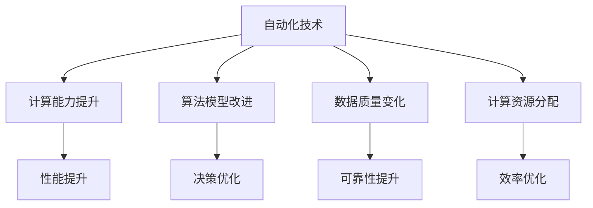

                 

## 1. 背景介绍

### 1.1 问题由来

近年来，随着计算技术的快速进步，自动化技术在各个领域的应用越来越广泛。从生产线上的工业自动化到医疗领域中的智能诊断，从金融行业中的智能交易到教育行业的个性化教学，自动化技术正在逐步改变人类的生产生活方式。然而，计算变化对自动化技术的影响是深远而复杂的。一方面，计算能力的提升为自动化技术提供了强大的引擎，推动了其性能和应用场景的不断拓展。另一方面，计算模型的变化也带来了自动化技术面临的新挑战和未知风险，需要我们去深入理解并应对。

### 1.2 问题核心关键点

计算变化对自动化技术的影响涉及多个方面，包括计算能力的提升、算法模型的改进、数据质量的影响、以及计算资源分配等。核心问题如下：

- **计算能力的提升**：计算能力的提升如何影响自动化系统的性能和效率？
- **算法模型的改进**：算法模型的改进对自动化系统的决策和控制有何影响？
- **数据质量的影响**：数据质量的变化如何影响自动化系统的可靠性和准确性？
- **计算资源分配**：计算资源的优化配置如何提高自动化系统的运行效率？

本文将从这些关键点出发，深入探讨计算变化对自动化技术的影响，分析其应用现状和未来发展趋势，并提供相应的解决方案和策略。

## 2. 核心概念与联系

### 2.1 核心概念概述

- **自动化技术**：指通过软件和硬件自动化工具，实现对人类或机器活动的控制和优化。自动化技术的应用范围广泛，包括工业、医疗、金融、教育等众多领域。
- **计算能力**：指计算机系统处理数据和执行计算任务的能力，通常包括计算速度、内存大小、存储容量、计算精度等。
- **算法模型**：指用于自动化系统决策和控制的一系列数学方法和计算规则。常见的算法模型包括监督学习、无监督学习、强化学习等。
- **数据质量**：指数据集中的数据完整性、准确性、一致性、及时性和安全性。数据质量的高低直接影响自动化系统的决策效果。
- **计算资源分配**：指在自动化系统中合理配置计算资源，如CPU、GPU、内存等，以优化系统性能和成本。

### 2.2 核心概念原理和架构的 Mermaid 流程图



这个流程图展示了自动化技术与计算变化之间的联系：

1. **计算能力提升**：直接影响自动化系统的性能和效率。
2. **算法模型改进**：增强自动化系统的决策和控制能力。
3. **数据质量变化**：影响自动化系统的可靠性和准确性。
4. **计算资源分配**：优化自动化系统的运行效率。

这些因素相互关联，共同作用于自动化系统的各个方面。

## 3. 核心算法原理 & 具体操作步骤

### 3.1 算法原理概述

计算变化对自动化技术的影响主要体现在算法模型的改进和计算资源的优化配置上。

算法模型是自动化技术决策和控制的核心，其改进可以显著提升系统的性能和效率。常见的算法改进方法包括：

- **监督学习**：通过标注数据训练模型，使其能够预测和控制特定任务。监督学习的模型效果好，但需要大量标注数据。
- **无监督学习**：利用数据的内在结构和规律进行学习，无需标注数据。适用于数据稀疏或无法获取标注数据的情况。
- **强化学习**：通过与环境的交互，优化策略和行为，达到最大化奖励的目标。适用于动态环境和实时决策问题。

计算资源的优化配置则可以提升自动化系统的运行效率，降低成本。常见的优化方法包括：

- **计算加速**：通过并行计算、分布式计算等技术提升计算速度。
- **资源共享**：通过云计算平台共享计算资源，降低单个系统的硬件成本。
- **资源调度**：通过任务调度和优先级管理，合理分配计算资源。

### 3.2 算法步骤详解

**步骤1：评估当前自动化系统**

评估自动化系统的当前状态和需求，包括系统的性能、可靠性、可扩展性和成本等。通过分析自动化系统的瓶颈和改进空间，确定计算变化的目标和方向。

**步骤2：改进算法模型**

根据自动化系统的需求，选择合适的算法模型进行改进。对于监督学习模型，需要收集和准备标注数据，设计合适的训练策略和评估指标。对于无监督和强化学习模型，需要设计合适的学习目标和奖励机制。

**步骤3：优化计算资源**

根据改进后的算法模型需求，优化计算资源的配置。包括计算速度、内存大小、存储容量和计算精度等。可以使用并行计算、分布式计算和云计算等技术提升计算能力。

**步骤4：实施和测试**

在实施自动化系统的改进方案前，进行充分测试和验证。通过模拟测试和实际部署，评估改进方案的效果和可行性。

**步骤5：监控和优化**

在自动化系统部署后，持续监控其运行状态和性能指标。根据监控结果进行优化和调整，确保系统稳定运行。

### 3.3 算法优缺点

改进算法模型和优化计算资源的优点包括：

- **性能提升**：通过改进算法模型和优化计算资源，自动化系统的性能和效率显著提升。
- **成本降低**：通过优化计算资源的配置和使用，自动化系统的硬件成本和运行成本显著降低。
- **可靠性提高**：通过改进算法模型和优化数据质量，自动化系统的可靠性和准确性显著提高。

然而，改进算法模型和优化计算资源也存在一些缺点：

- **复杂度高**：改进算法模型和优化计算资源的实施过程复杂，需要专业的知识和技能。
- **投资大**：改进算法模型和优化计算资源需要投入大量的人力、物力和财力，初期成本较高。
- **风险高**：改进算法模型和优化计算资源可能会引入新的问题，如算法模型过拟合、数据泄露等。

### 3.4 算法应用领域

改进算法模型和优化计算资源的应用范围广泛，包括但不限于：

- **工业自动化**：通过改进算法模型和优化计算资源，提升工业自动化系统的生产效率和产品质量。
- **医疗诊断**：通过改进算法模型和优化计算资源，提升医疗诊断系统的准确性和可靠性。
- **金融交易**：通过改进算法模型和优化计算资源，提升金融交易系统的速度和稳定性。
- **教育个性化**：通过改进算法模型和优化计算资源，提升教育系统的个性化教学和资源分配。

## 4. 数学模型和公式 & 详细讲解 & 举例说明

### 4.1 数学模型构建

自动化系统的改进模型可以通过以下几个数学模型进行构建：

1. **监督学习模型**：$y = f(x; \theta)$，其中 $y$ 表示预测结果，$x$ 表示输入数据，$\theta$ 表示模型参数。
2. **无监督学习模型**：$x \sim p(x; \theta)$，其中 $x$ 表示数据样本，$p(x; \theta)$ 表示数据分布。
3. **强化学习模型**：$Q(s, a) = r + \gamma \max_{a'} Q(s', a'); Q(s, a)$ 表示在状态 $s$ 下采取行动 $a$ 的奖励，$r$ 表示即时奖励，$\gamma$ 表示折扣因子，$s'$ 表示下一个状态。

### 4.2 公式推导过程

**监督学习模型**：

1. 数据准备：收集 $n$ 个样本 $(x_i, y_i)$，其中 $x_i$ 为输入数据，$y_i$ 为标注结果。
2. 模型训练：使用梯度下降等优化算法，最小化损失函数 $L(\theta)$，得到模型参数 $\theta^*$。
3. 模型预测：输入新的数据 $x'$，通过模型预测结果 $y' = f(x'; \theta^*)$。

**无监督学习模型**：

1. 数据准备：收集 $n$ 个样本 $x_i$，其中 $x_i$ 为数据样本。
2. 模型训练：使用EM算法等方法，最大化数据分布 $p(x; \theta)$ 的似然函数 $L(\theta)$，得到模型参数 $\theta^*$。
3. 模型预测：输入新的数据 $x'$，通过模型预测分布 $p(x'; \theta^*)$。

**强化学习模型**：

1. 环境交互：在环境 $E$ 中，观察状态 $s_t$，采取行动 $a_t$，接收奖励 $r_t$，观察下一个状态 $s_{t+1}$。
2. 模型训练：使用价值迭代等方法，最大化长期奖励 $Q(s_t, a_t)$，得到最优策略 $\pi^*$。
3. 模型预测：输入状态 $s'$，通过模型预测行动 $a' = \pi^*(s')$。

### 4.3 案例分析与讲解

**案例1：工业自动化中的生产线优化**

问题：某制造业企业生产线存在设备故障率高、生产效率低的问题。

解决方案：

1. 收集生产线设备的历史运行数据，作为监督学习模型的输入数据。
2. 设计监督学习模型，预测设备故障的概率和生产效率。
3. 优化计算资源，通过分布式计算加速模型训练和预测。
4. 实施模型改进，提升生产设备的维护和调度效率，降低故障率。

**案例2：医疗诊断中的影像识别**

问题：某医院需要对大量医学影像进行快速准确的诊断，但传统方法耗时较长。

解决方案：

1. 收集医疗影像和诊断结果，作为无监督学习模型的输入数据。
2. 设计无监督学习模型，自动识别影像中的病变区域和病灶类型。
3. 优化计算资源，通过GPU加速模型训练和推理。
4. 实施模型改进，提升影像识别的准确性和效率，减少医生的诊断时间。

## 5. 项目实践：代码实例和详细解释说明

### 5.1 开发环境搭建

**步骤1：安装Python和相关库**

1. 安装Python 3.x，推荐使用Anaconda或Miniconda。
2. 安装TensorFlow、Keras、PyTorch等深度学习库。

**步骤2：准备数据**

1. 收集自动化系统的输入数据和标注数据，存为CSV格式。
2. 使用Pandas库进行数据预处理和清洗，确保数据质量。

**步骤3：搭建模型**

1. 设计监督学习、无监督学习或强化学习模型，使用TensorFlow或PyTorch等深度学习框架。
2. 配置计算资源，如CPU、GPU和内存。

### 5.2 源代码详细实现

**步骤1：数据准备**

```python
import pandas as pd
import numpy as np

# 读取数据
data = pd.read_csv('data.csv')
X = data[['feature1', 'feature2', 'feature3']] # 输入特征
y = data['label'] # 标注结果

# 数据预处理
X = (X - X.mean()) / X.std() # 标准化
X = pd.get_dummies(X) # 编码
y = pd.get_dummies(y) # 编码
```

**步骤2：模型训练**

```python
from tensorflow.keras.models import Sequential
from tensorflow.keras.layers import Dense

# 定义模型
model = Sequential()
model.add(Dense(64, input_dim=X.shape[1], activation='relu'))
model.add(Dense(32, activation='relu'))
model.add(Dense(y.shape[1], activation='softmax'))

# 编译模型
model.compile(loss='categorical_crossentropy', optimizer='adam', metrics=['accuracy'])

# 训练模型
model.fit(X, y, epochs=10, batch_size=32)
```

**步骤3：模型测试**

```python
# 读取测试数据
test_data = pd.read_csv('test_data.csv')
test_X = test_data[['feature1', 'feature2', 'feature3']]
test_X = (test_X - X.mean()) / X.std()
test_X = pd.get_dummies(test_X)

# 模型预测
test_y = model.predict(test_X)
```

**步骤4：结果分析**

```python
# 输出模型预测结果
print(test_y)
```

### 5.3 代码解读与分析

**步骤1：数据准备**

- 使用Pandas库读取数据，并进行数据预处理。数据预处理包括标准化、编码等步骤，确保数据质量。

**步骤2：模型训练**

- 使用TensorFlow或PyTorch框架搭建模型，并编译模型。模型训练使用梯度下降等优化算法，最小化损失函数，得到模型参数。

**步骤3：模型测试**

- 读取测试数据，进行数据预处理。使用训练好的模型进行预测，输出预测结果。

**步骤4：结果分析**

- 输出模型预测结果，进行后续分析和优化。

## 6. 实际应用场景

### 6.1 工业自动化中的设备维护

在工业自动化领域，计算变化对自动化技术的影响尤为显著。传统工业自动化系统依赖于人工维护和调度，效率较低。通过改进算法模型和优化计算资源，可以实现设备的智能维护和调度。

**应用场景**：某制造业企业生产线上的设备故障率高，生产效率低。通过改进算法模型和优化计算资源，实现了设备的智能维护和调度。

**解决方案**：

1. 收集生产线设备的历史运行数据，作为监督学习模型的输入数据。
2. 设计监督学习模型，预测设备故障的概率和生产效率。
3. 优化计算资源，通过分布式计算加速模型训练和预测。
4. 实施模型改进，提升生产设备的维护和调度效率，降低故障率。

### 6.2 医疗诊断中的影像识别

在医疗诊断领域，计算变化对自动化技术的影响同样显著。传统医疗诊断方法耗时长，效率低。通过改进算法模型和优化计算资源，可以实现影像的自动识别和诊断。

**应用场景**：某医院需要对大量医学影像进行快速准确的诊断，但传统方法耗时较长。

**解决方案**：

1. 收集医疗影像和诊断结果，作为无监督学习模型的输入数据。
2. 设计无监督学习模型，自动识别影像中的病变区域和病灶类型。
3. 优化计算资源，通过GPU加速模型训练和推理。
4. 实施模型改进，提升影像识别的准确性和效率，减少医生的诊断时间。

### 6.3 金融交易中的智能交易

在金融交易领域，计算变化对自动化技术的影响同样显著。传统金融交易方法依赖于人工分析和决策，效率低。通过改进算法模型和优化计算资源，可以实现智能交易系统的构建。

**应用场景**：某证券公司需要对股票市场进行实时分析和交易，但传统方法反应速度慢，效率低。

**解决方案**：

1. 收集历史交易数据和市场数据，作为监督学习模型的输入数据。
2. 设计监督学习模型，预测股票市场的走势和交易信号。
3. 优化计算资源，通过分布式计算加速模型训练和预测。
4. 实施模型改进，提升股票交易的效率和准确性，减少交易成本。

## 7. 工具和资源推荐

### 7.1 学习资源推荐

**步骤1：了解计算变化**

1. 《深度学习》（Ian Goodfellow等）：全面介绍深度学习的基本原理和算法，包括监督学习、无监督学习和强化学习。
2. 《Python深度学习》（Francois Chollet）：介绍如何使用Python和Keras框架进行深度学习开发。

**步骤2：掌握自动化技术**

1. 《机器学习实战》（Peter Harrington）：介绍常见的机器学习算法和实现方法。
2. 《自动驾驶汽车》（Sebastian Thrun等）：介绍自动化技术在汽车领域的应用。

### 7.2 开发工具推荐

**步骤1：安装Python和相关库**

1. 安装Python 3.x，推荐使用Anaconda或Miniconda。
2. 安装TensorFlow、Keras、PyTorch等深度学习库。

**步骤2：使用云计算平台**

1. 使用AWS、Google Cloud等云计算平台，获取高性能计算资源。
2. 使用Kubernetes等容器编排工具，实现资源的自动化管理。

### 7.3 相关论文推荐

**步骤1：了解计算变化**

1. "Deep Learning"（Ian Goodfellow等）：介绍深度学习的基本原理和算法。
2. "Artificial Intelligence: A Modern Approach"（Stuart Russell和Peter Norvig）：介绍人工智能的基本概念和应用。

**步骤2：掌握自动化技术**

1. "Pattern Recognition and Machine Learning"（Christopher Bishop）：介绍模式识别和机器学习的基本原理和方法。
2. "Intelligent Systems: A Unified Approach"（Sebastian Thrun等）：介绍智能系统在汽车领域的应用。

## 8. 总结：未来发展趋势与挑战

### 8.1 研究成果总结

计算变化对自动化技术的影响研究涉及多个方面，包括计算能力的提升、算法模型的改进、数据质量的影响和计算资源分配等。通过深入探讨这些方面的影响，为自动化技术的改进和优化提供了理论基础和技术手段。

### 8.2 未来发展趋势

未来的计算变化将进一步推动自动化技术的发展，主要体现在以下几个方面：

1. **计算能力的提升**：计算能力的提升将进一步提升自动化系统的性能和效率。
2. **算法模型的改进**：算法模型的改进将增强自动化系统的决策和控制能力。
3. **数据质量的提升**：数据质量的提升将提高自动化系统的可靠性和准确性。
4. **计算资源的优化配置**：计算资源的优化配置将提高自动化系统的运行效率和成本效益。

### 8.3 面临的挑战

计算变化对自动化技术的影响也面临着诸多挑战，主要体现在以下几个方面：

1. **计算资源的优化配置**：如何合理配置计算资源，提高自动化系统的运行效率和成本效益。
2. **数据质量的提升**：如何提高数据质量，确保自动化系统的可靠性和准确性。
3. **算法模型的改进**：如何改进算法模型，增强自动化系统的决策和控制能力。
4. **计算能力的提升**：如何提升计算能力，提高自动化系统的性能和效率。

### 8.4 研究展望

未来的计算变化将进一步推动自动化技术的发展，主要体现在以下几个方面：

1. **计算资源的优化配置**：通过优化计算资源的配置和使用，提高自动化系统的运行效率和成本效益。
2. **数据质量的提升**：通过数据清洗、标注和预处理，提高数据质量，确保自动化系统的可靠性和准确性。
3. **算法模型的改进**：通过改进算法模型，增强自动化系统的决策和控制能力，提升自动化系统的性能和效率。
4. **计算能力的提升**：通过计算加速、分布式计算等技术，提升计算能力，提高自动化系统的性能和效率。

## 9. 附录：常见问题与解答

**Q1：计算变化对自动化技术有什么影响？**

A: 计算变化对自动化技术的影响主要体现在计算能力的提升、算法模型的改进、数据质量的影响和计算资源分配等方面。计算能力的提升、算法模型的改进和计算资源优化配置将显著提升自动化系统的性能和效率，而数据质量的变化将影响自动化系统的可靠性和准确性。

**Q2：如何改进算法模型？**

A: 改进算法模型需要根据自动化系统的需求选择合适的算法模型，并进行相应的优化和训练。对于监督学习模型，需要收集和准备标注数据，设计合适的训练策略和评估指标。对于无监督和强化学习模型，需要设计合适的学习目标和奖励机制。

**Q3：如何优化计算资源？**

A: 优化计算资源需要根据自动化系统的需求进行合理的配置和使用。可以使用并行计算、分布式计算和云计算等技术提升计算能力。同时，需要合理分配计算资源，避免资源的浪费和过度使用。

**Q4：如何确保数据质量？**

A: 确保数据质量需要从数据收集、清洗、标注和预处理等多个环节进行严格控制。可以使用数据清洗工具进行数据清洗，使用数据标注工具进行数据标注，使用数据预处理工具进行数据预处理，确保数据的质量和一致性。

**Q5：如何提高自动化系统的可靠性？**

A: 提高自动化系统的可靠性需要从多个方面进行优化，包括改进算法模型、优化计算资源、提高数据质量等。通过改进算法模型，增强自动化系统的决策和控制能力；通过优化计算资源，提高自动化系统的运行效率和成本效益；通过提高数据质量，确保自动化系统的可靠性和准确性。

**Q6：如何应对计算变化的挑战？**

A: 应对计算变化的挑战需要从多个方面进行优化，包括合理配置计算资源、提高数据质量、改进算法模型等。通过合理配置计算资源，提高自动化系统的运行效率和成本效益；通过提高数据质量，确保自动化系统的可靠性和准确性；通过改进算法模型，增强自动化系统的决策和控制能力。

