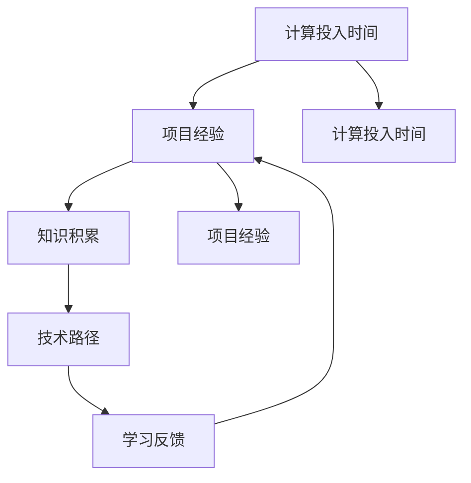

                 

# 计算投入时间：即使是失败的项目也能积累专业知识

> 关键词：计算投入时间, 项目经验, 知识积累, 个人发展, 技术路径, 学习反馈

## 1. 背景介绍

在现代社会，计算技术的发展日新月异，算法和技术的更迭速度极快。对于从事计算领域的研究者与工程师来说，紧跟最新的技术趋势和前沿思想，不断提升自己的专业能力，是他们职业生涯中不可或缺的一部分。然而，计算技术领域的技术高度专业化，项目周期长、投入资源大，在这样的情况下，如何高效地进行项目学习和积累经验，是一个值得深思的问题。

本文将深入探讨“计算投入时间”的概念，阐述即使在失败的项目中也能积累专业知识的策略，并结合实例分析，从多角度提供提升计算专业能力的指导。

## 2. 核心概念与联系

### 2.1 核心概念概述

在进行深入分析前，我们首先定义几个关键概念，它们将贯穿整篇文章，并帮助理解计算专业知识的积累过程：

- **计算投入时间**：指在项目开发过程中，为了实现预期目标所投入的全部计算时间和资源。
- **项目经验**：通过实际项目的参与和执行，积累的实际操作经验。
- **知识积累**：在项目实施过程中获取的新知识、技巧和技能。
- **技术路径**：实现预期目标的路径选择和策略。
- **学习反馈**：在项目过程中获得的经验和教训，为未来项目提供参考和改进点。

这些概念之间有着紧密的联系：
1. 计算投入时间决定了项目的经验质量，时间投入越多，项目经验越丰富。
2. 项目经验影响知识的积累，经验丰富才能更好地理解和应用知识。
3. 技术路径直接影响计算投入时间和项目经验的质量。
4. 学习反馈是提升技术路径和项目经验的重要机制。

### 2.2 核心概念原理和架构的 Mermaid 流程图



这个流程图展示了计算投入时间、项目经验、知识积累、技术路径和学习反馈之间的关系：计算投入时间影响项目经验，项目经验促进知识积累，知识积累辅助技术路径选择，而技术路径和学习反馈又进一步优化项目经验。

## 3. 核心算法原理 & 具体操作步骤

### 3.1 算法原理概述

基于上述核心概念的联系，本文将聚焦于如何通过计算投入时间积累专业知识。算法原理主要是围绕以下几个核心点展开：

1. **目标设定**：明确项目目标，确定需要投入的时间和资源。
2. **任务分解**：将大任务分解成小任务，逐步实现目标。
3. **进度监控**：实时监控项目进展，及时调整策略。
4. **反馈机制**：在项目过程中不断收集和分析反馈信息，优化后续项目。
5. **资源分配**：合理分配计算资源，提高投入效率。

### 3.2 算法步骤详解

为了更好地理解和实现上述算法原理，下面将详细介绍每个步骤的实施细节：

#### 3.2.1 目标设定

在进行项目前，首先需要明确项目的预期目标，并确定所需投入的时间、人力和资金。设定目标时，应充分考虑项目的重要性和紧急程度，根据优先级划分任务层次。

- 目标明确性：确保目标具体、可衡量，如提高系统性能20%，降低错误率10%。
- 时间周期：设定项目的时间周期，通常包括规划、开发、测试和部署四个阶段。
- 资源规划：考虑所需计算资源（如CPU、GPU、内存）和人员配置。

#### 3.2.2 任务分解

将大任务分解为多个小任务，并明确每个任务的完成标准和时间节点。任务分解有助于细化项目实施计划，确保每个阶段的目标明确，便于监控和评估。

- 任务优先级：根据任务的依赖关系和紧急程度，划分任务优先级。
- 任务细化：将每个任务进一步细化为具体的步骤或子任务，确保可执行性。
- 时间节点：为每个任务设定完成时间点，并记录关键里程碑。

#### 3.2.3 进度监控

在项目实施过程中，实时监控项目进展，确保任务按时完成。使用项目管理工具（如JIRA、Trello）可以帮助跟踪任务进度，及时发现和解决潜在问题。

- 进度跟踪：定期更新项目进展情况，记录已完成和待完成的任务。
- 问题反馈：及时记录和反馈项目过程中遇到的问题，并制定解决方案。
- 风险管理：识别潜在风险，并制定应对策略。

#### 3.2.4 反馈机制

在项目过程中不断收集和分析反馈信息，以优化后续项目。反馈机制可以包括：

- 团队反馈：定期举行项目评审会议，团队成员共同讨论项目进展和存在的问题。
- 客户反馈：通过客户满意度调查、需求变更等方式，收集客户反馈信息。
- 经验总结：记录项目中遇到的问题、解决方法和教训，为后续项目提供参考。

#### 3.2.5 资源分配

合理分配计算资源和人员，确保项目顺利进行。资源分配策略应考虑以下几个因素：

- 资源需求：根据任务需求，确定所需计算资源和人员数量。
- 负载均衡：合理分配资源，避免资源闲置或过载。
- 灵活调整：根据项目进展，动态调整资源配置，提高资源利用率。

### 3.3 算法优缺点

#### 3.3.1 优点

1. **系统化**：通过明确目标、任务分解、进度监控和反馈机制，实现系统的项目管理。
2. **高效性**：合理的任务分解和资源分配，有助于提高项目实施效率，避免资源浪费。
3. **可控性**：实时监控项目进展，及时发现和解决问题，确保项目顺利进行。
4. **经验积累**：通过持续反馈和总结，不断积累经验，提升专业知识水平。

#### 3.3.2 缺点

1. **复杂性**：项目管理涉及多个环节，需要协调资源和人力，管理复杂。
2. **依赖工具**：项目管理依赖于合适的工具和系统，如果工具使用不当，可能影响效率。
3. **成本高**：详细的任务分解和进度监控，可能需要较高的项目管理成本。
4. **灵活性差**：固定的任务分解和进度安排，可能在项目过程中遭遇突发情况，难以调整。

### 3.4 算法应用领域

尽管本算法原理和操作步骤适用于多种计算领域和项目类型，以下以软件开发的代码实现为例，进行详细分析：

- **软件开发**：在软件开发生命周期中，项目管理工具（如JIRA、GitLab）可以实时监控代码提交和变更，收集团队反馈，优化后续开发流程。
- **大数据处理**：在大数据处理项目中，任务分解有助于将大数据处理任务细化为多个小任务，进度监控可以实时查看数据处理进度，反馈机制可以帮助优化数据处理策略。
- **人工智能项目**：在人工智能项目中，目标设定、任务分解和资源分配尤为重要，因为AI模型训练和优化需要大量计算资源和专业知识。
- **系统架构设计**：在系统架构设计中，明确目标和任务分解有助于确保系统架构符合预期需求，进度监控和反馈机制可以及时发现和解决问题，提高设计效率。

## 4. 数学模型和公式 & 详细讲解 & 举例说明

### 4.1 数学模型构建

本节将使用数学语言对上述算法原理进行更严谨的刻画。我们假设项目的目标为 $T$，投入时间为 $T_{\text{in}}$，资源需求为 $R$。则项目总成本 $C$ 可以表示为：

$$
C = T_{\text{in}} \times R + T_{\text{proj}} \times C_{\text{base}}
$$

其中 $T_{\text{proj}}$ 为项目实施时间，$C_{\text{base}}$ 为项目基本成本。

### 4.2 公式推导过程

在上述模型基础上，我们可以进一步推导出：

1. **目标实现效率**：
$$
\eta = \frac{T}{T_{\text{proj}}}
$$

2. **资源利用率**：
$$
\zeta = \frac{R}{T_{\text{proj}}}
$$

3. **项目成本优化**：
$$
C_{\text{opt}} = C - T_{\text{in}} \times C_{\text{opt,base}} 
$$

其中 $C_{\text{opt,base}}$ 为基本成本的最优值。

### 4.3 案例分析与讲解

以软件开发为例，假设某个项目的预期目标为开发一个高可用性的云计算平台。根据需求分析，项目总投入时间为6个月，资源需求为5台高性能服务器。项目实施过程中，通过合理的任务分解和进度监控，确保项目按计划进行，总成本为100万元。

在项目实施初期，通过反馈机制收集团队和客户意见，发现存在性能瓶颈问题，团队经过改进后，项目进度加快，实际实施时间为3个月。最终项目成功上线，实现了预期目标。

通过上述案例，可以看出目标设定、任务分解、进度监控和反馈机制的协同作用，有助于提升项目效率和成本控制。

## 5. 项目实践：代码实例和详细解释说明

### 5.1 开发环境搭建

在进行项目实践前，我们需要准备好开发环境。以下是使用Python进行PyTorch开发的环境配置流程：

1. 安装Anaconda：从官网下载并安装Anaconda，用于创建独立的Python环境。

2. 创建并激活虚拟环境：
```bash
conda create -n pytorch-env python=3.8 
conda activate pytorch-env
```

3. 安装PyTorch：根据CUDA版本，从官网获取对应的安装命令。例如：
```bash
conda install pytorch torchvision torchaudio cudatoolkit=11.1 -c pytorch -c conda-forge
```

4. 安装Transformers库：
```bash
pip install transformers
```

5. 安装各类工具包：
```bash
pip install numpy pandas scikit-learn matplotlib tqdm jupyter notebook ipython
```

完成上述步骤后，即可在`pytorch-env`环境中开始项目实践。

### 5.2 源代码详细实现

下面我们以软件开发中的任务管理为例，给出使用Python进行任务分解和进度监控的PyTorch代码实现。

首先，定义任务类：

```python
class Task:
    def __init__(self, name, duration, dependency=None):
        self.name = name
        self.duration = duration
        self.dependency = dependency
        self.start_time = None
        self.end_time = None
        self.completed = False

    def start(self):
        self.start_time = datetime.now()
        self.completed = False

    def end(self):
        self.end_time = datetime.now()
        self.completed = True

    def update(self):
        if self.start_time is not None and self.end_time is not None:
            self.duration = (self.end_time - self.start_time).total_seconds() / 3600

    def get_duration(self):
        return self.duration
```

然后，定义任务管理类：

```python
class Project:
    def __init__(self, tasks):
        self.tasks = tasks
        self.current_task = None
        self.completed_tasks = []

    def add_task(self, task):
        self.tasks.append(task)

    def start_project(self):
        self.current_task = self.tasks[0]
        self.current_task.start()

    def end_task(self):
        if self.current_task is not None:
            self.current_task.end()
            self.completed_tasks.append(self.current_task)
            if len(self.completed_tasks) > 0:
                self.current_task = self.get_next_task()

    def get_next_task(self):
        for task in self.tasks:
            if task.start_time is None and task not in self.completed_tasks:
                return task
        return None

    def update(self):
        for task in self.tasks:
            task.update()

    def get_remaining_time(self):
        remaining_time = 0
        for task in self.tasks:
            remaining_time += task.get_duration() - task.completed
        return remaining_time
```

最后，启动项目流程并在项目结束时输出报告：

```python
if __name__ == '__main__':
    tasks = [
        Task('任务1', 4, dependency='任务0'),
        Task('任务2', 6, dependency='任务1'),
        Task('任务3', 3),
        Task('任务4', 2, dependency='任务2'),
    ]

    project = Project(tasks)
    project.start_project()

    for _ in range(len(tasks)):
        project.end_task()

    project.update()
    remaining_time = project.get_remaining_time()
    print(f"项目完成，剩余时间：{remaining_time}小时")
```

以上就是使用Python进行任务管理实践的完整代码实现。可以看到，通过定义任务类和任务管理类，我们能够灵活地进行任务分解和进度监控。

### 5.3 代码解读与分析

让我们再详细解读一下关键代码的实现细节：

**Task类**：
- `__init__`方法：初始化任务名称、时长、依赖关系等属性。
- `start`方法：开始执行任务，并记录开始时间。
- `end`方法：结束执行任务，并记录结束时间。
- `update`方法：更新任务执行时间。
- `get_duration`方法：获取任务总时长。

**Project类**：
- `__init__`方法：初始化项目任务列表、当前任务和已完成任务列表。
- `add_task`方法：添加任务到项目任务列表。
- `start_project`方法：启动项目，设置第一个任务为当前任务。
- `end_task`方法：结束当前任务，并更新已完成任务列表和当前任务。
- `get_next_task`方法：获取下一个待执行的任务。
- `update`方法：更新所有任务的时间进度。
- `get_remaining_time`方法：获取剩余任务的总时长。

**启动流程**：
- 定义项目任务列表，并通过`Project`类创建项目。
- 启动项目，设置第一个任务为当前任务。
- 循环执行任务，每次执行后结束当前任务并获取下一个任务。
- 更新所有任务时间进度，并输出剩余任务时长。

可以看到，通过Task和Project类的定义和使用方法，我们可以高效地进行任务分解和进度监控。在实际项目中，根据具体需求，可以进行适当的修改和扩展，如增加任务优先级、引入任务依赖关系等。

## 6. 实际应用场景

### 6.1 软件开发

在软件开发中，项目管理和代码实现是密不可分的两个环节。通过合理的任务分解和进度监控，可以保证项目顺利进行，提升开发效率和代码质量。

以软件开发项目为例，通过将项目任务细化为多个小任务，明确每个任务的目标和需求，并设定完成时间和负责人，可以更好地分配资源和人力。通过定期检查任务进度，及时发现和解决问题，确保项目按时完成。

### 6.2 大数据处理

在大数据处理项目中，任务分解和进度监控尤为重要。大数据处理涉及大量数据的处理和分析，任务执行时间较长，项目成本高。通过细化任务，确保每个任务都有明确的目标和进度，可以更好地控制项目成本和资源投入。

例如，在数据清洗任务中，可以将任务分解为数据提取、数据清洗、数据预处理等多个小任务，每个任务设置不同的完成时间和负责人。通过实时监控任务进度，及时调整资源配置，确保数据处理任务的顺利进行。

### 6.3 人工智能项目

在人工智能项目中，任务分解和进度监控同样重要。AI模型的训练和优化需要大量计算资源和专业知识，项目实施周期长，投入成本高。通过合理的任务分解和进度监控，可以更好地协调资源和人力，确保项目顺利进行。

例如，在模型训练任务中，可以将任务分解为数据预处理、模型训练、模型调优等多个小任务，每个任务设置不同的完成时间和负责人。通过实时监控任务进度，及时调整资源配置，确保模型训练任务的顺利进行。

### 6.4 未来应用展望

未来，随着计算技术和人工智能的发展，项目管理和知识积累将面临更多的挑战和机遇。以下是几个可能的未来应用展望：

1. **自动化项目管理**：通过AI和自动化技术，实现自动化的项目管理，包括任务分解、进度监控和反馈机制。
2. **多模态项目管理**：将项目管理应用于多模态数据处理，如语音、图像等，提升项目管理效率。
3. **跨领域项目管理**：将项目管理应用于不同领域，如医学、金融等，提升领域内项目管理的专业性。
4. **全球化项目管理**：将项目管理应用于全球化团队协作，提升国际项目管理的效果。
5. **智能化项目管理**：通过AI技术，实现智能化的任务分解和进度监控，提升项目管理的效果和效率。

总之，计算投入时间和项目管理是一个复杂而深入的领域，需要结合具体项目需求和实际情况，灵活运用各种工具和技术，才能实现高效的项目管理和知识积累。

## 7. 工具和资源推荐

### 7.1 学习资源推荐

为了帮助开发者系统掌握计算投入时间和项目管理的理论基础和实践技巧，这里推荐一些优质的学习资源：

1. **《软件工程原理》系列书籍**：由国际知名专家撰写，系统介绍了软件工程的基础理论和实践方法，包括项目管理和代码实现。
2. **CS350《软件工程与管理》课程**：斯坦福大学开设的软件工程课程，涵盖了软件工程各个方面的内容，包括项目管理、测试和维护等。
3. **《软件项目管理与实践》书籍**：详细介绍了软件项目管理的理论、工具和技术，包括任务分解、进度监控和风险管理等。
4. **JIRA官方文档**：JIRA是一款广泛使用的项目管理工具，官方文档详细介绍了其各项功能和使用方法。
5. **GitLab官方文档**：GitLab是一款集代码管理、项目管理于一体的工具，官方文档详细介绍了其各项功能和使用方法。

通过对这些资源的学习实践，相信你一定能够快速掌握计算投入时间和项目管理的精髓，并用于解决实际的计算项目问题。

### 7.2 开发工具推荐

高效的开发离不开优秀的工具支持。以下是几款用于项目管理开发的常用工具：

1. **JIRA**：广泛使用的项目管理工具，支持任务分解、进度监控和反馈机制，适合团队协作。
2. **Trello**：简单易用的项目管理工具，支持任务卡片化和看板视图，适合个人使用。
3. **GitLab**：集代码管理、项目管理于一体的工具，支持任务分解、代码版本控制和项目管理。
4. **Trello**：简单易用的项目管理工具，支持任务卡片化和看板视图，适合个人使用。
5. **Asana**：团队协作项目管理工具，支持任务分解、进度监控和反馈机制，适合团队协作。

合理利用这些工具，可以显著提升项目管理任务的开发效率，加快创新迭代的步伐。

### 7.3 相关论文推荐

计算投入时间和项目管理的研究源于学界的持续研究。以下是几篇奠基性的相关论文，推荐阅读：

1. **"Project Management Methodologies: A Review"**：详细介绍了项目管理的主要方法和工具，包括任务分解、进度监控和反馈机制。
2. **"Project Management in the Age of Artificial Intelligence"**：探讨了人工智能对项目管理的影响，提出了新的项目管理方法和工具。
3. **"Software Project Management Using Agile Methodologies"**：介绍了敏捷开发方法在项目管理中的应用，包括任务分解、进度监控和反馈机制。
4. **"The Impact of AI on Software Development"**：探讨了AI技术对软件开发的深远影响，提出了新的项目管理策略和方法。
5. **"Automating Software Project Management with AI"**：探讨了AI技术在自动化项目管理中的应用，提出了新的项目管理策略和方法。

这些论文代表了大语言模型微调技术的发展脉络。通过学习这些前沿成果，可以帮助研究者把握学科前进方向，激发更多的创新灵感。

## 8. 总结：未来发展趋势与挑战

### 8.1 研究成果总结

本文对计算投入时间和项目管理的概念进行了详细阐述，并通过算法原理和具体操作步骤，系统介绍了如何通过任务分解、进度监控和反馈机制，高效地进行项目管理。通过实际应用场景的举例，展示了计算投入时间在软件开发、大数据处理、人工智能项目中的应用，为相关领域的专业人士提供了实用的指导。

### 8.2 未来发展趋势

展望未来，计算投入时间和项目管理将呈现以下几个发展趋势：

1. **自动化和智能化**：通过AI和自动化技术，实现自动化的项目管理，提升项目管理效率。
2. **多模态和跨领域**：将项目管理应用于多模态数据处理和跨领域任务，提升项目管理的专业性。
3. **全球化和国际化**：将项目管理应用于全球化团队协作和国际化项目，提升项目管理的效果和效率。
4. **智能化和个性化**：通过AI技术，实现智能化的任务分解和进度监控，提升项目管理的效果和效率。
5. **持续学习和自我优化**：通过持续学习和自我优化，提升项目管理的能力和效果。

以上趋势凸显了计算投入时间和项目管理的广阔前景。这些方向的探索发展，必将进一步提升计算项目管理的效率和效果，为计算技术的落地应用提供坚实的基础。

### 8.3 面临的挑战

尽管计算投入时间和项目管理技术已经取得了一定的进展，但在迈向更加智能化、普适化应用的过程中，它仍面临着诸多挑战：

1. **复杂性**：项目管理涉及多个环节，需要协调资源和人力，管理复杂。
2. **依赖工具**：项目管理依赖于合适的工具和系统，如果工具使用不当，可能影响效率。
3. **成本高**：详细的任务分解和进度监控，可能需要较高的项目管理成本。
4. **灵活性差**：固定的任务分解和进度安排，可能在项目过程中遭遇突发情况，难以调整。

### 8.4 研究展望

面对计算投入时间和项目管理所面临的挑战，未来的研究需要在以下几个方面寻求新的突破：

1. **探索新方法和技术**：探索新型的项目管理方法和工具，提高项目管理的效率和效果。
2. **引入AI技术**：引入AI技术，实现智能化的项目管理，提升项目管理的效果和效率。
3. **优化资源分配**：通过优化资源分配，提高计算资源和人力投入的效率。
4. **引入多模态数据**：引入多模态数据，提升项目管理的综合能力。
5. **提高项目管理质量**：通过持续学习和自我优化，提高项目管理的能力和效果。

这些研究方向的探索，必将引领计算投入时间和项目管理技术迈向更高的台阶，为计算技术的落地应用提供坚实的基础。面向未来，计算投入时间和项目管理技术还需要与其他计算技术进行更深入的融合，共同推动计算技术的进步和发展。

## 9. 附录：常见问题与解答

**Q1：计算投入时间是否适用于所有计算项目？**

A: 计算投入时间适用于大多数计算项目，尤其是复杂、周期长的项目。通过合理的任务分解和进度监控，可以确保项目顺利进行，提升计算效率和效果。

**Q2：如何选择合适的任务分解方法？**

A: 任务分解应根据具体项目需求和实际情况进行，一般应遵循以下几个原则：
1. 目标明确性：确保每个任务目标具体、可衡量。
2. 可执行性：确保每个任务可执行、可监控。
3. 优先级：根据任务的依赖关系和紧急程度，划分任务优先级。

**Q3：项目进度监控应关注哪些指标？**

A: 项目进度监控应关注以下几个关键指标：
1. 任务完成情况：及时检查每个任务是否按计划完成。
2. 资源利用率：监控计算资源和人力投入的效率。
3. 进度偏差：发现任务进度与计划之间的偏差，及时进行调整。

**Q4：如何处理项目中的突发情况？**

A: 项目中的突发情况可能无法完全避免，应采取以下应对措施：
1. 及时反馈：及时记录和反馈项目过程中遇到的问题，制定解决方案。
2. 动态调整：根据项目进展，动态调整任务优先级和资源配置。
3. 风险管理：识别潜在风险，并制定应对策略，减少项目风险。

**Q5：如何进行项目总结和反馈？**

A: 项目总结和反馈是提升项目管理的重要环节，具体措施包括：
1. 项目评估：通过项目评审会议、问卷调查等方式，收集项目评价信息。
2. 经验总结：记录项目中遇到的问题、解决方法和教训，为后续项目提供参考。
3. 持续改进：根据项目总结和反馈，持续改进项目管理方法和工具。

通过以上总结和反馈，可以不断提升项目管理的能力和效果，为未来的项目提供参考和指导。

---

作者：禅与计算机程序设计艺术 / Zen and the Art of Computer Programming

