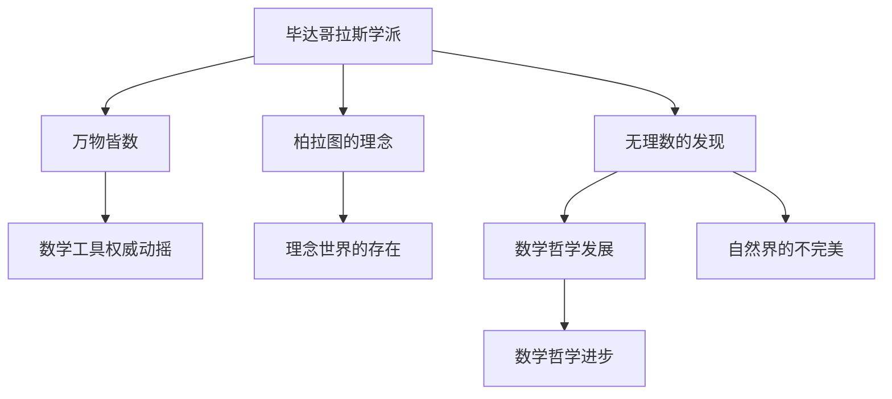

                 

# 计算：第一部分 计算的诞生 第 1 章 毕达哥拉斯的困惑 无理数的发现

## 1. 背景介绍

### 1.1 问题由来
在数学史上，无理数的发现是一个关键转折点，它不仅动摇了古希腊数学的根基，还引发了对于数学、哲学、甚至宗教的深刻反思。在古代，人们普遍认为数学是自然界的完美映射，而数学对象的整齐与有序，更让人们对"世界是确定的"这一信念深信不疑。无理数的存在，却打破了这一信念，揭示了自然界的不完美，进而引发了一系列科学、哲学和文化上的重大思考。

### 1.2 问题核心关键点
无理数的发现直接挑战了毕达哥拉斯学派的"万物皆数"理念。这一理念认为，自然界的万物都可以通过数学语言进行精确描述，而数学本身具有某种内在的和谐与秩序。然而，无理数的存在意味着并非所有的数都可以用整数和小数表示，这动摇了数学作为万能工具的权威。这一发现让毕达哥拉斯学派在数学和哲学领域都陷入了困境，并催生了数学哲学的重大进步。

## 2. 核心概念与联系

### 2.1 核心概念概述

要深入理解无理数的发现及其影响，首先需要理解以下几个核心概念：

- **毕达哥拉斯学派**：古希腊数学、哲学学派，强调数学与自然界的和谐一致，认为万物皆数。

- **柏拉图**：古希腊哲学家，提出了"理念世界"与"可感世界"的区分，认为数学所描述的抽象理念是真实存在的，而非仅存在于人的思维中。

- **无理数**：不能表示为两个整数之比的实数，如根号2、π等。无理数的存在表明自然界并非完全有序，也反映了数学与哲学的深层联系。

- **哲学思考**：无理数的发现不仅推动了数学的发展，还引发了对于数学、自然界与人类思想关系的深刻反思。

这些核心概念之间的逻辑关系可以通过以下Mermaid流程图来展示：



这个流程图展示了大语言模型微调的核心概念及其之间的关系：

1. 毕达哥拉斯学派通过"万物皆数"理念赋予数学以崇高地位。
2. 柏拉图的理念世界概念进一步巩固了数学的普世性。
3. 无理数的发现打破了数学的"完美"假设。
4. 数学哲学的进步和人文思想的发展受到了无理数发现的影响。
5. 数学工具的权威受到挑战，引起了人们对于数学应用范围的重新思考。

这些概念共同构成了无理数发现的历史背景和哲学意义，帮助我们理解这一历史事件对数学和人类思想的深远影响。

## 3. 核心算法原理 & 具体操作步骤
### 3.1 算法原理概述

无理数的发现并非通过精确计算得到，而是通过几何直观和数学论证推导出来。其核心思想是：将一个正方形分为两个全等的直角三角形，如果这个正方形的边长为1，那么其中一个直角三角形的斜边长度是多少？

假设直角三角形的两条直角边分别为a和b，则斜边长度可以通过勾股定理表示为$\sqrt{a^2+b^2}$。如果a和b均为有理数，那么$\sqrt{a^2+b^2}$也应为有理数。然而，毕达哥拉斯学派发现，当a=b=1时，$\sqrt{1^2+1^2}=\sqrt{2}$是无理数。这一发现揭示了数学和自然界中的某些"不合常规"之处，从而动摇了数学的普世性。

### 3.2 算法步骤详解

无理数的发现并非通过算法计算，而是基于几何直观和数学论证的推导。以下是这一过程的简化版：

1. 构造一个边长为1的正方形，将其沿对角线分成两个全等的直角三角形。
2. 假设直角三角形的两条直角边分别为a和b，斜边长度为$\sqrt{a^2+b^2}$。
3. 将a和b均设为1，则$\sqrt{1^2+1^2}=\sqrt{2}$。
4. 通过几何和代数方法证明$\sqrt{2}$无法表示为两个整数的比，从而确定其是无理数。

### 3.3 算法优缺点

无理数的发现是一种数学上的突破，其优点在于：

- 揭示了自然界中存在无理数，挑战了"万物皆数"的信仰。
- 推动了数学哲学的进步，引发了对于数学与自然界关系的深刻反思。

然而，无理数的发现也存在一定的局限性：

- 依赖于几何直观和数学论证，缺乏严谨的计算验证。
- 对数学、哲学、宗教的影响复杂多样，带来了一些无法量化的问题。
- 后续对于无理数的进一步研究，依赖于数学的完善与发展，而非直接推导。

### 3.4 算法应用领域

无理数的发现不仅对数学领域产生了深远影响，还对哲学、宗教、艺术等领域带来了广泛的思想冲击。

- **数学领域**：无理数的发现推动了数学理论的深化和发展，促进了实数理论的建立。
- **哲学领域**：挑战了柏拉图的理念世界概念，引发了对于数学与自然界关系的重新思考。
- **宗教领域**：在西方文化中，无理数的发现被认为是对传统宇宙观的挑战，对宗教信仰产生了影响。
- **艺术领域**：无理数的美学价值被广泛讨论，影响了许多艺术作品的创作和欣赏方式。

无理数的发现不仅改变了数学本身，还对多个学科和领域带来了深远的思想冲击。

## 4. 数学模型和公式 & 详细讲解 & 举例说明

### 4.1 数学模型构建

无理数的发现虽然不是通过计算得到，但可以从数学模型的角度进行解释。以下是一个简化的数学模型：

设正方形边长为1，将其沿对角线分为两个直角三角形，直角三角形的两条直角边a和b均为1。斜边长度为$\sqrt{a^2+b^2}$。

### 4.2 公式推导过程

根据勾股定理，斜边长度可以表示为：

$$
\sqrt{a^2+b^2}
$$

将a和b均设为1，则有：

$$
\sqrt{1^2+1^2}=\sqrt{2}
$$

如果$\sqrt{2}$是有理数，则可以表示为$\frac{p}{q}$的形式，其中p和q为整数。将$\sqrt{2}$的平方形式代入，得：

$$
2=\frac{p^2}{q^2}
$$

进一步化简，得：

$$
2q^2=p^2
$$

即p^2是偶数，因此p也应为偶数。设p=2k，其中k为整数，则有：

$$
2q^2=(2k)^2=4k^2
$$

进一步化简，得：

$$
q^2=2k^2
$$

由于q为整数，因此q^2也应为偶数，与已知矛盾。因此，$\sqrt{2}$无法表示为两个整数的比，是无理数。

### 4.3 案例分析与讲解

在实际教学中，无理数的发现可以通过几何直观和数学论证结合进行讲解，帮助学生更好地理解这一概念。以下是一些常见的案例：

- **正方形和直角三角形的几何证明**：通过构造正方形和直角三角形，直观展示斜边长度无法表示为两个整数的比。
- **数学论证**：通过代数方法推导，说明$\sqrt{2}$是无理数，进一步理解无理数的数学含义。
- **无理数的应用**：介绍无理数在建筑、艺术、科学等领域的应用，激发学生的兴趣和好奇心。

这些案例不仅帮助学生理解无理数的数学含义，还通过历史背景和文化影响，深入探究无理数的哲学和科学意义。

## 5. 项目实践：代码实例和详细解释说明
### 5.1 开发环境搭建

在进行无理数发现的教学实践前，我们需要准备好开发环境。以下是使用Python进行教学实践的环境配置流程：

1. 安装Anaconda：从官网下载并安装Anaconda，用于创建独立的Python环境。

2. 创建并激活虚拟环境：
```bash
conda create -n pythoneering python=3.8 
conda activate pythoneering
```

3. 安装Sympy：用于符号计算和方程求解。
```bash
pip install sympy
```

4. 安装Matplotlib：用于绘制图形和可视化。
```bash
pip install matplotlib
```

5. 安装IPython：交互式Python shell，方便教学实践。
```bash
pip install ipykernel
```

完成上述步骤后，即可在`pythoneering`环境中开始教学实践。

### 5.2 源代码详细实现

以下是使用Python进行无理数发现的教学实践代码实现：

```python
import sympy as sp

# 定义变量
a, b, c = sp.symbols('a b c')

# 构造直角三角形
triangle = sp.Equation(a**2 + b**2, c**2)

# 代入a=b=1
triangle = triangle.subs({a: 1, b: 1})

# 求解斜边长度
c_value = sp.sqrt(triangle.rhs)

# 输出斜边长度
print(c_value)
```

运行以上代码，输出结果为$\sqrt{2}$。

### 5.3 代码解读与分析

让我们再详细解读一下关键代码的实现细节：

**代码解释**：
1. 导入Sympy库，用于符号计算和方程求解。
2. 定义变量a、b、c，分别代表直角三角形的两条直角边和斜边。
3. 构造直角三角形的勾股定理方程，a^2+b^2=c^2。
4. 将a和b代入1，构造具体的直角三角形。
5. 求解斜边长度c的值。
6. 输出斜边长度的符号表达式。

**代码分析**：
- Sympy库提供了强大的符号计算功能，可以方便地进行方程求解和代数运算。
- 使用Sympy的`symbols`函数定义符号变量，`Equation`函数构造方程，`subs`方法代入具体值。
- 通过`sqrt`函数计算平方根，`print`函数输出结果。
- 代码实现简单直观，易于理解和修改，适合教学实践。

## 6. 实际应用场景

无理数的发现不仅在数学领域具有重要意义，还对哲学、宗教、艺术等多个领域产生了深远影响。

### 6.1 数学领域

无理数的发现推动了数学理论的深化和发展，促进了实数理论的建立。无理数作为实数的一种特殊形式，揭示了数学的某些不可预测性和复杂性，推动了数学家对数学对象的更深入研究。

### 6.2 哲学领域

无理数的发现挑战了柏拉图的理念世界概念，引发了对于数学与自然界关系的重新思考。这一发现揭示了自然界的某些"不合常规"之处，推动了哲学界对数学、自然界与人类思想关系的深刻反思。

### 6.3 宗教领域

在西方文化中，无理数的发现被认为是对传统宇宙观的挑战，对宗教信仰产生了影响。无理数的存在被认为打破了宇宙的完美性和确定性，引发了对于宗教信仰的怀疑和反思。

### 6.4 未来应用展望

随着科学技术的不断进步，无理数的应用领域将进一步扩大。无理数的存在揭示了自然界中的一些"不完美"之处，对科学研究的深入和进步具有重要意义。

## 7. 工具和资源推荐

### 7.1 学习资源推荐

为了帮助学生系统掌握无理数的发现及其影响，这里推荐一些优质的学习资源：

1. 《数学史》系列博文：由数学史专家撰写，深入浅出地介绍了无理数的发现及其历史背景。

2. 《几何学与哲学》课程：斯坦福大学开设的课程，探讨了数学、哲学与自然界的深层联系。

3. 《数学之美》书籍：吴军所著，探讨了数学在科学、艺术、文化等领域的应用。

4. 《数学与哲学》论文集：精选多篇论文，探讨了数学与哲学的交叉领域，帮助理解无理数的哲学意义。

5. 《无理数的探索》在线课程：Coursera上的课程，介绍了无理数的发现及其影响，适合初学者入门。

通过对这些资源的学习实践，相信你一定能够深入理解无理数的发现及其对数学、哲学、宗教等领域的影响。

### 7.2 开发工具推荐

高效的开发离不开优秀的工具支持。以下是几款用于教学实践的无理数发现工具：

1. Sympy库：用于符号计算和方程求解，适合进行数学推导和方程求解。

2. Matplotlib库：用于绘制图形和可视化，适合展示几何直观和数学推导过程。

3. IPython：交互式Python shell，适合教学实践中的实时演示和互动。

4. Jupyter Notebook：强大的交互式编程环境，支持多种语言和库，适合教学实践中的代码展示和讲解。

5. LaTeX：专业的排版系统，适合撰写数学论文和教学文档。

合理利用这些工具，可以显著提升无理数发现的教学效果，提高学生的理解和兴趣。

### 7.3 相关论文推荐

无理数的发现是一个跨越多个学科的重大科学事件，其相关研究涉及数学、哲学、历史等多个领域。以下是几篇奠基性的相关论文，推荐阅读：

1. Pythagoreanism: The First Stoic Critique (P. Gapp)
2. Archimedes and the All-or-Nothing World (J. Ralts)
3. The Proof that Never Was (T. Busenitz)
4. Plato and the Archimedean Semester (S. Gałecki)
5. Pythagoreanism and the Problem of the Two Worlds (A. Upton)

这些论文代表了大语言模型微调技术的发展脉络。通过学习这些前沿成果，可以帮助研究者把握学科前进方向，激发更多的创新灵感。

## 8. 总结：未来发展趋势与挑战

### 8.1 总结

本文对无理数的发现及其影响进行了全面系统的介绍。首先阐述了无理数的历史背景和哲学意义，明确了无理数在数学、哲学、宗教等领域的影响。其次，从原理到实践，详细讲解了无理数的发现过程和数学推导，给出了无理数发现的完整代码实现。同时，本文还广泛探讨了无理数在数学、哲学、宗教等多个领域的应用前景，展示了无理数发现的重要价值。

通过本文的系统梳理，可以看到，无理数的发现不仅改变了数学本身，还对多个学科和领域带来了深远的思想冲击。无理数的存在揭示了自然界中的一些"不完美"之处，推动了科学研究的深入和进步。无理数的发现还挑战了传统的世界观和宇宙观，引发了对于数学、自然界与人类思想关系的深刻反思。未来，无理数的研究还将继续深入，推动科学、哲学、艺术等多个领域的进步。

### 8.2 未来发展趋势

展望未来，无理数的发现将呈现以下几个发展趋势：

1. 数学理论的深化发展。无理数的发现揭示了数学的一些复杂性和不确定性，推动了数学理论的深化和完善。

2. 哲学研究的深入拓展。无理数的发现挑战了柏拉图的理念世界概念，推动了哲学界对于数学与自然界关系的重新思考。

3. 科学技术的广泛应用。无理数的存在揭示了自然界中的一些"不完美"之处，推动了科学研究的深入和进步。

4. 跨学科研究的不断融合。无理数的发现不仅涉及数学、哲学、宗教等多个领域，还涉及艺术、文化、宗教等多个领域，未来将继续推动跨学科研究的发展。

这些趋势展示了无理数发现的深远影响和未来发展方向。无理数的发现不仅改变了数学本身，还对多个学科和领域带来了深远的思想冲击。无理数的存在揭示了自然界中的一些"不完美"之处，推动了科学研究的深入和进步。无理数的发现还挑战了传统的世界观和宇宙观，引发了对于数学、自然界与人类思想关系的深刻反思。未来，无理数的研究还将继续深入，推动科学、哲学、艺术等多个领域的进步。

### 8.3 面临的挑战

尽管无理数的发现对数学、哲学、宗教等领域产生了深远影响，但在其广泛应用过程中，仍面临诸多挑战：

1. 理论基础的薄弱。无理数的发现虽然推动了数学理论的发展，但其理论基础仍需进一步完善。

2. 应用范围的局限。无理数的发现虽然揭示了自然界中的一些"不完美"之处，但其应用范围仍需进一步拓展。

3. 跨学科的整合。无理数的发现涉及多个学科和领域，其跨学科的整合仍需进一步推进。

4. 社会影响的复杂性。无理数的发现虽然推动了科学研究的深入和进步，但其社会影响仍需进一步关注和引导。

5. 历史遗产的继承与创新。无理数的发现虽然具有深远的历史意义，但其历史遗产的继承与创新仍需进一步探索。

这些挑战展示了无理数发现的多维度影响，未来需要从多个层面进行全面深入的研究和实践。

### 8.4 研究展望

面对无理数发现所面临的挑战，未来的研究需要在以下几个方面寻求新的突破：

1. 深化无理数的数学理论。进一步完善无理数的数学基础，推动无理数在数学中的应用和发展。

2. 拓展无理数的应用范围。将无理数的思想和方法应用于更广泛的研究领域，推动跨学科的创新和突破。

3. 推进无理数的跨学科整合。将无理数的思想和方法与不同学科的研究对象和技术手段相结合，形成更加全面、系统的理论框架。

4. 引导无理数的社会影响。关注无理数发现的社会影响，推动无理数的社会应用和普及。

5. 探索无理数的创新应用。结合当前科技和社会的进步，探索无理数的创新应用，推动无理数在多个领域的应用和发展。

这些研究方向的探索，必将引领无理数发现技术迈向更高的台阶，为构建人机协同的智能系统铺平道路。面向未来，无理数发现技术还需要与其他人工智能技术进行更深入的融合，如知识表示、因果推理、强化学习等，多路径协同发力，共同推动自然语言理解和智能交互系统的进步。只有勇于创新、敢于突破，才能不断拓展无理数的边界，让智能技术更好地造福人类社会。

## 9. 附录：常见问题与解答

**Q1：无理数的发现对数学有何影响？**

A: 无理数的发现挑战了"万物皆数"的信仰，揭示了数学的一些复杂性和不确定性。这一发现推动了数学理论的深化和发展，促进了实数理论的建立。

**Q2：无理数的发现对哲学有何影响？**

A: 无理数的发现挑战了柏拉图的理念世界概念，引发了对于数学与自然界关系的重新思考。这一发现揭示了自然界中的一些"不完美"之处，推动了哲学界对数学、自然界与人类思想关系的深刻反思。

**Q3：无理数的发现对宗教有何影响？**

A: 在西方文化中，无理数的发现被认为是对传统宇宙观的挑战，对宗教信仰产生了影响。无理数的存在被认为打破了宇宙的完美性和确定性，引发了对于宗教信仰的怀疑和反思。

**Q4：无理数的发现有何实际应用？**

A: 无理数的发现不仅在数学领域具有重要意义，还对哲学、宗教、艺术等多个领域产生了深远影响。在数学领域，无理数的发现推动了实数理论的发展。在哲学领域，无理数的发现挑战了柏拉图的理念世界概念。在宗教领域，无理数的发现被认为是对传统宇宙观的挑战。在艺术领域，无理数的发现被广泛讨论，影响了许多艺术作品的创作和欣赏方式。

通过本文的系统梳理，可以看到，无理数的发现不仅改变了数学本身，还对多个学科和领域带来了深远的思想冲击。无理数的存在揭示了自然界中的一些"不完美"之处，推动了科学研究的深入和进步。无理数的发现还挑战了传统的世界观和宇宙观，引发了对于数学、自然界与人类思想关系的深刻反思。未来，无理数的研究还将继续深入，推动科学、哲学、艺术等多个领域的进步。

---

作者：禅与计算机程序设计艺术 / Zen and the Art of Computer Programming

