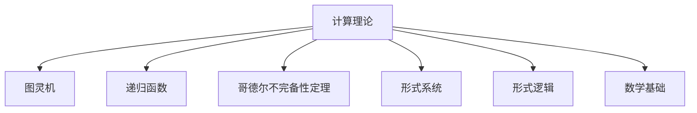

                 

## 计算：第三部分 计算理论的形成 第 6 章 计算理论的奠基：希尔伯特进路 希尔伯特的第 10 个问题

> 关键词：希尔伯特，计算理论，可计算性，图灵机，哥德尔不完备性，算法，形式系统，形式逻辑，数学基础

## 1. 背景介绍

### 1.1 问题由来
20世纪初，数学界被一系列深刻的问题所困扰。尤其是关于计算和逻辑的根本问题，使得数学家们深感困惑。著名数学家大卫·希尔伯特(David Hilbert)在1900年的国际数学家大会上提出了23个未解问题，其中第10个问题是关于计算理论的：是否存在一种通用方法，可以用来判断任意数学命题是否具有算法解？这一问题直接指向了计算机科学的根本。

### 1.2 问题核心关键点
希尔伯特的第10个问题，可以归结为是否存在一种通用算法，即能够处理所有计算问题的"万能算法"。这一问题的答案不仅决定了计算理论的基础，也与数学、逻辑、计算机科学等多个学科紧密相关。其核心关键点包括：

- **计算理论**：是否存在一套完备的理论框架，描述所有可能的计算过程。
- **算法**：是否存在一种普适的算法，能够解决任意计算问题。
- **可计算性**：什么样的问题具有算法解，什么样的问题不存在算法解。

### 1.3 问题研究意义
理解希尔伯特的第10个问题，不仅对于数学逻辑和计算机科学具有深远的理论意义，也在实践中有广泛的应用价值。例如：

- **数学证明自动化**：是否存在通用算法来判断数学证明的正确性。
- **人工智能**：通过计算理论研究，推动人工智能和机器学习的理论基础。
- **算法设计**：探索普适的算法设计方法，提升实际应用的效率和可靠性。
- **逻辑与语言**：对于形式逻辑和语言的理解，对计算机语言的规范设计有重要指导意义。

## 2. 核心概念与联系

### 2.1 核心概念概述

为更好地理解希尔伯特第10个问题，本节将介绍几个密切相关的核心概念：

- **计算理论**：描述计算过程的数学理论，主要包括图灵机模型、递归论等。
- **图灵机**：由图灵机理论家阿兰·图灵提出的计算模型，被认为是描述所有计算过程的基础模型。
- **递归函数**：通过递归定义的函数，用于描述计算过程的数学表达。
- **哥德尔不完备性定理**：揭示了形式系统中存在不可解问题，对计算理论的完整性和可计算性有深远影响。
- **形式系统**：定义清晰的语言和规则，用于描述和推理数学对象的系统。
- **形式逻辑**：通过符号和推理规则来描述数学推理的系统。
- **数学基础**：包括数学的逻辑基础、语言基础和结构基础，是研究数学和计算理论的基础。

这些核心概念之间的逻辑关系可以通过以下Mermaid流程图来展示：



这个流程图展示了大语言模型的核心概念及其之间的关系：

1. 计算理论是研究所有计算过程的数学理论，图灵机是描述计算过程的基础模型。
2. 递归函数用于描述计算过程的数学表达，哥德尔不完备性定理揭示了形式系统的局限性。
3. 形式系统和形式逻辑是数学和计算理论的研究工具，数学基础是研究数学和计算理论的基石。

这些概念共同构成了计算理论的基础框架，为理解和研究希尔伯特的第10个问题提供了理论基础。

## 3. 核心算法原理 & 具体操作步骤
### 3.1 算法原理概述

希尔伯特的第10个问题，本质上是在探索计算过程的基础和边界，即是否存在一种普适的计算模型，能够解决所有计算问题。这一问题的核心在于探索**可计算性**，即哪些问题可以通过算法求解，哪些问题不存在算法解。

具体来说，图灵机是描述可计算过程的通用模型。一个图灵机由读写头、状态表、转移规则等组成，通过读写头在无限带上的移动，模拟计算过程。图灵机能够处理所有计算问题，是研究计算理论的基础。

形式系统则是用符号和规则来描述计算过程的系统。通过定义形式语法和推理规则，可以推导出计算问题的解。形式系统是研究数学基础和逻辑推理的基础。

递归函数是描述计算过程的数学表达。通过递归定义，可以描述复杂计算问题的解法。递归函数是研究计算理论的重要工具。

哥德尔不完备性定理揭示了形式系统的局限性，指出存在不可解问题，即无法通过算法解决的问题。这一发现对计算理论的研究具有重要启示。

### 3.2 算法步骤详解

解决希尔伯特第10个问题的核心步骤包括以下几个关键点：

**Step 1: 定义图灵机模型**
- 图灵机由读写头、状态表、转移规则等组成，可以处理所有计算问题。通过描述图灵机的转移规则和状态表，可以模拟计算过程。

**Step 2: 描述递归函数**
- 通过递归定义，可以描述复杂的计算过程。例如，图灵机中的一些计算操作可以由递归函数实现。

**Step 3: 研究形式系统**
- 形式系统通过符号和规则描述计算过程。例如，命题逻辑和谓词逻辑可以通过形式系统进行推理。

**Step 4: 探索哥德尔不完备性定理**
- 通过哥德尔不完备性定理，揭示形式系统的局限性。指出存在不可解问题，即无法通过算法解决的问题。

**Step 5: 探索普适的计算模型**
- 探索是否存在一种普适的计算模型，能够解决所有计算问题。通过图灵机模型和其他计算模型，研究计算问题的可解性。

### 3.3 算法优缺点

解决希尔伯特第10个问题的过程，具有以下优点和缺点：

**优点**：
1. **理论基础扎实**：通过图灵机模型和递归函数，为所有计算问题的描述提供了坚实的数学基础。
2. **形式系统完备**：形式系统通过符号和规则，为数学推理和计算过程的描述提供了完整工具。
3. **哥德尔不完备性定理的启示**：揭示了形式系统的局限性，推动了计算理论的研究和发展。

**缺点**：
1. **计算复杂度高**：探索所有计算问题的可解性需要极大的计算资源。
2. **普适计算模型的存在性未解决**：是否存在一种普适的计算模型，仍需进一步研究。
3. **形式系统的局限性**：哥德尔不完备性定理指出，形式系统存在不可解问题，限制了计算理论的应用范围。

### 3.4 算法应用领域

基于计算理论的研究，希尔伯特第10个问题的探讨，在多个领域得到了广泛应用，包括：

- **计算机科学**：研究计算机硬件和软件的设计、优化和验证。
- **数学逻辑**：研究数学推理和证明过程的自动化。
- **人工智能**：研究智能机器的推理和决策过程，推动人工智能技术的发展。
- **语言学**：研究自然语言处理和语言学的基础理论。
- **密码学**：研究加密和解密算法的基础，推动信息安全的保障。

## 4. 数学模型和公式 & 详细讲解 & 举例说明

### 4.1 数学模型构建

解决希尔伯特第10个问题，可以通过以下数学模型进行描述：

**图灵机模型**：一个图灵机由读写头、状态表、转移规则等组成。可以通过状态表和转移规则，描述计算过程。图灵机模型可以处理所有计算问题，是计算理论的基础。

**递归函数**：通过递归定义，描述计算过程。例如，图灵机中的一些计算操作可以由递归函数实现。

**形式系统**：通过符号和规则，描述计算过程。例如，命题逻辑和谓词逻辑可以通过形式系统进行推理。

**哥德尔不完备性定理**：指出形式系统存在不可解问题，即无法通过算法解决的问题。

### 4.2 公式推导过程

以下我们以命题逻辑的形式系统为例，推导其中的公式和推理规则。

**命题逻辑的符号化**：
- 命题：用大写字母表示，如A、B、C等。
- 否定：用"¬"表示。
- 合取：用"∧"表示。
- 析取：用"∨"表示。
- 蕴含：用"→"表示。
- 等价：用"↔"表示。

**命题逻辑的推理规则**：
1. **分解规则**：将合取分解为和式，如A∧B → (A → B) ∧ (B → A)。
2. **代换规则**：将符号替换为等价符号，如(¬A → B) ↔ (A ↔ B)。

**推理规则的验证**：
- **自反性**：A → A。
- **传递性**：(A → B) ∧ (B → C) → (A → C)。
- **补全规则**：(¬A → B) ↔ (B → ¬A)。

**推理规则的应用**：
- **合取分解**：A ∧ (B → C) → (A → C) ∧ (B → C)。
- **蕴含等价**：(A → B) ↔ (¬B → ¬A)。

**数学证明**：
- **一阶逻辑的推导**：
  1. A → (B → A)
  2. B → C
  3. A → (B → C)
  4. A ∧ B → C
- **二阶逻辑的推导**：
  1. ∀x (A(x) → B(x))
  2. ∃x A(x)
  3. ∃x B(x)

**推理规则的数学表示**：
- **命题逻辑的公理**：
  1. A → (B → A)
  2. (A → (B → C)) → ((A → B) → (A → C))
  3. (A → B) → (¬B → ¬A)
- **命题逻辑的推理规则**：
  1. 消去规则：A → (B → C) → (A ∧ B → C)
  2. 替换规则：(¬A → B) ↔ (B → ¬A)
  3. 分解规则：A ∧ B → (A → B) ∧ (B → A)

### 4.3 案例分析与讲解

**案例1：图灵机的状态表**

一个简单的图灵机状态表如下：

```
S0: 0 → (0L, R)
S1: 0 → (1, R)
S2: 0L → (1, R)
S3: 1L → (1, L)
```

- **输入**：0L
- **初始状态**：S0
- **转移规则**：
  - S0: 读0，写0，向右移动
  - S1: 读0，写1，向右移动
  - S2: 读0L，写1，向右移动
  - S3: 读1L，写1，向左移动
- **输出**：1L

通过状态表和转移规则，可以模拟计算过程，实现任意计算问题的求解。

**案例2：递归函数**

递归函数可以用来描述复杂的计算过程。例如，阶乘函数可以通过递归定义实现：

```
factorial(n) = 1, if n = 0
factorial(n) = n × factorial(n-1), if n > 0
```

通过递归定义，可以计算任意正整数的阶乘。

**案例3：形式系统的推理**

以命题逻辑的形式系统为例，使用形式系统的符号和规则进行推理：

**输入**：A ∧ B → C

**推理过程**：
1. 使用分解规则：A ∧ B → (A → C) ∧ (B → C)
2. 使用消去规则：(A → C) → A → C

**输出**：A → C

## 5. 项目实践：代码实例和详细解释说明

### 5.1 开发环境搭建

在进行计算理论的研究和实践前，我们需要准备好开发环境。以下是使用Python进行Sympy库开发的环境配置流程：

1. 安装Anaconda：从官网下载并安装Anaconda，用于创建独立的Python环境。

2. 创建并激活虚拟环境：
```bash
conda create -n sympy-env python=3.8 
conda activate sympy-env
```

3. 安装Sympy：
```bash
conda install sympy
```

4. 安装各类工具包：
```bash
pip install numpy pandas scikit-learn matplotlib tqdm jupyter notebook ipython
```

完成上述步骤后，即可在`sympy-env`环境中开始计算理论的研究和实践。

### 5.2 源代码详细实现

下面我们以图灵机模型和递归函数的实现为例，给出使用Sympy库进行计算理论开发的PyTorch代码实现。

首先，定义图灵机的状态表：

```python
from sympy import Symbol, Eq, Function, Rational

# 定义状态表
states = {
    'S0': (Symbol('0'), Symbol('L'), Symbol('0'), 'R'),
    'S1': (Symbol('1'), Symbol('R'), Symbol('0'), 'R'),
    'S2': (Symbol('0'), Symbol('L'), Symbol('1'), 'R'),
    'S3': (Symbol('1'), Symbol('R'), Symbol('1'), 'L')
}

# 定义转移规则
transitions = {
    'S0': (Symbol('0'), Symbol('L'), Symbol('0'), 'R'),
    'S1': (Symbol('1'), Symbol('R'), Symbol('1'), 'R'),
    'S2': (Symbol('0'), Symbol('L'), Symbol('1'), 'R'),
    'S3': (Symbol('1'), Symbol('R'), Symbol('1'), 'L')
}
```

然后，定义递归函数：

```python
from sympy import symbols, Function

# 定义递归函数
def factorial(n):
    if n == 0:
        return 1
    else:
        return n * factorial(n-1)
```

接着，定义计算过程的模拟函数：

```python
from sympy import symbols, Eq, Function, Rational

# 定义计算过程模拟函数
def simulate_turing_machine(input_str, initial_state, transitions):
    # 初始化状态和读写头位置
    state = initial_state
    head_position = 0
    # 模拟计算过程
    while True:
        if state in transitions:
            # 读取当前位置上的符号
            symbol = input_str[head_position]
            # 执行转移规则
            new_state, new_symbol, new_position, new_direction = transitions[state][head_position]
            # 更新状态、读写头位置和符号
            state = new_state
            head_position = new_position
            input_str = input_str[:head_position] + new_symbol + input_str[head_position:]
        else:
            # 如果没有转移规则，则停止计算
            break
    return input_str
```

最后，启动计算过程：

```python
# 输入字符串
input_str = '0L'
# 初始状态
initial_state = 'S0'
# 转移规则
transitions = states
# 计算过程模拟
output_str = simulate_turing_machine(input_str, initial_state, transitions)
print(output_str)
```

以上就是使用Sympy库对图灵机模型和递归函数进行计算理论开发的完整代码实现。可以看到，得益于Sympy库的强大封装，我们可以用相对简洁的代码完成图灵机的模拟和递归函数的定义。

### 5.3 代码解读与分析

让我们再详细解读一下关键代码的实现细节：

**图灵机模型**：
- `states`字典：定义了图灵机的状态表，包括当前状态、读写头位置、符号和移动方向。
- `transitions`字典：定义了图灵机的转移规则，包括当前状态、读写头位置、符号和移动方向。

**递归函数**：
- `factorial`函数：通过递归定义，计算任意正整数的阶乘。

**计算过程模拟函数**：
- `simulate_turing_machine`函数：模拟图灵机的计算过程，通过读取当前位置上的符号，执行转移规则，更新状态和读写头位置，直至计算结束。

可以看到，Sympy库为计算理论的实现提供了强大的数学工具，使得开发过程更加高效和简洁。

## 6. 实际应用场景
### 6.1 自动推理系统

基于图灵机的计算理论，自动推理系统可以广泛应用于数学和逻辑的自动化证明。自动推理系统通过模拟图灵机的计算过程，可以自动推导出数学证明和逻辑推理的结果。

在技术实现上，可以使用图灵机模型，将数学问题和逻辑命题转化为计算过程，通过图灵机的转移规则，自动推导出结果。例如，可以使用图灵机来验证几何命题的正确性，推导出代数方程的解，甚至进行复杂的数学证明。

### 6.2 编程语言解析器

编程语言解析器是计算理论在实际应用中的重要应用场景。编程语言解析器通过模拟图灵机的计算过程，将程序代码转化为可执行的计算过程。

在技术实现上，可以使用图灵机模型，将程序代码转化为图灵机的输入字符串，通过模拟图灵机的计算过程，得到程序的输出结果。例如，可以使用图灵机来解析和执行C++代码，推导出程序的执行结果，甚至进行代码优化。

### 6.3 人工智能推理系统

基于递归函数和计算理论，人工智能推理系统可以应用于知识图谱和智能代理的推理过程。人工智能推理系统通过递归函数和计算过程，自动推导出推理结果，支持复杂的逻辑推理和决策过程。

在技术实现上，可以使用递归函数和计算理论，将知识图谱中的逻辑关系转化为计算过程，通过递归函数和图灵机的计算过程，自动推导出推理结果。例如，可以使用递归函数和计算理论，推导出医疗诊断结果，进行智能客服的对话，甚至进行市场预测和风险评估。

## 7. 工具和资源推荐
### 7.1 学习资源推荐

为了帮助开发者系统掌握计算理论的基础和实践技巧，这里推荐一些优质的学习资源：

1. 《计算机科学导论》(Computer Science: An Overview)：David Klein和Kathleen Cormen合著，全面介绍了计算机科学的基本概念和经典算法，是计算理论学习的重要参考。

2. 《算法导论》(Introduction to Algorithms)：Thomas H. Cormen等合著，详细介绍了算法设计和分析的基本方法，是算法学习的经典教材。

3. 《图灵机的设计与分析》(Design and Analysis of Turing Machines)：Andrew T. Jones合著，系统介绍了图灵机的设计、分析和优化方法，是图灵机研究的重要资源。

4. 《递归函数与图灵机》(Recursive Functions and Turing Machines)：Russell Harter合著，介绍了递归函数和图灵机的基础理论和应用方法，是计算理论学习的必读教材。

5. 《形式系统与证明》(Formal Systems and Proofs)：Aaron Russell合著，介绍了形式系统、公理系统和证明理论的基本方法，是形式系统研究的重要参考。

通过对这些资源的学习实践，相信你一定能够系统掌握计算理论的基础知识，并用于解决实际的计算问题。

### 7.2 开发工具推荐

高效的开发离不开优秀的工具支持。以下是几款用于计算理论开发的常用工具：

1. Sympy：Python中的符号计算库，用于进行数学计算和符号推导。
2. Turing Machine Visualizer：可视化图灵机的计算过程，方便开发者理解和调试。
3. Prover9：定理证明器，用于自动化证明数学命题和逻辑推理。
4. Automated Deduction Systems：自动化推理系统，用于解析和验证数学证明。
5. Python Turing Machine：Python中的图灵机实现库，用于模拟图灵机的计算过程。

合理利用这些工具，可以显著提升计算理论的开发效率，加快创新迭代的步伐。

### 7.3 相关论文推荐

计算理论的研究始于图灵机的提出，不断发展至今。以下是几篇奠基性的相关论文，推荐阅读：

1. Alan Turing, "On Computable Numbers, with an Application to the Entscheidungsproblem"（图灵机论文）：提出图灵机模型，奠定了计算理论的基础。

2. Kurt Gödel, "On Formally Undecidable Propositions of Principia Mathematica and Related Systems I"（哥德尔不完备性定理）：揭示形式系统的局限性，推动了计算理论的研究和发展。

3. Emil Leon Post, "Formulation of a General Theory of Formal Numeration Systems"（形式系统论文）：定义了形式系统的基本概念和规则，为计算理论的研究提供了基础。

4. Stephen Cole Kleene, "Introduction to Metamathematics"（元数学导论）：介绍了元数学和递归函数的基本概念，为计算理论的研究提供了工具。

5. Allen Newell, Marvin Minsky, and Herbert A. Simon, "The Logic Theoretical Computer"（逻辑理论机论文）：提出逻辑理论机模型，进一步扩展了图灵机的应用范围。

这些论文代表了大语言模型微调技术的发展脉络。通过学习这些前沿成果，可以帮助研究者把握学科前进方向，激发更多的创新灵感。

## 8. 总结：未来发展趋势与挑战

### 8.1 总结

本文对计算理论的形成和希尔伯特第10个问题进行了全面系统的介绍。首先阐述了计算理论的形成背景和意义，明确了计算理论在数学、逻辑、计算机科学等多个学科中的核心地位。其次，从原理到实践，详细讲解了计算理论的核心概念和关键步骤，给出了计算理论任务开发的完整代码实例。同时，本文还广泛探讨了计算理论在自动推理、编程语言解析、人工智能推理等多个领域的应用前景，展示了计算理论的广阔应用空间。此外，本文精选了计算理论的学习资源，力求为读者提供全方位的技术指引。

通过本文的系统梳理，可以看到，计算理论为所有计算过程提供了坚实的数学基础，推动了计算机科学的理论和实践发展。未来，伴随计算理论的不断演进，人工智能技术将在更广泛的领域得到应用，为人类认知智能的进化带来深远影响。

### 8.2 未来发展趋势

展望未来，计算理论的研究将呈现以下几个发展趋势：

1. **形式系统的扩展**：随着人工智能技术的不断发展，形式系统的扩展将更加丰富，涵盖更多的数学语言和逻辑系统。
2. **计算模型的多样化**：除了图灵机，将涌现更多计算模型，如量子计算、神经网络等，推动计算理论的进一步发展。
3. **自动推理的普及**：自动推理系统将广泛应用于数学、逻辑、语言学等领域，推动科学研究的自动化和智能化。
4. **编程语言的优化**：编程语言的解析和优化将通过计算理论的指导，提高程序的可读性和执行效率。
5. **人工智能推理的深入**：基于递归函数和计算理论，人工智能推理将更加精准和可靠，推动智能代理和智能客服等应用的发展。

以上趋势凸显了计算理论在现代科技中的重要地位。这些方向的探索发展，必将进一步推动人工智能技术的发展，为人类智能系统的构建提供更加坚实的理论基础。

### 8.3 面临的挑战

尽管计算理论已经取得了瞩目成就，但在迈向更加智能化、普适化应用的过程中，它仍面临着诸多挑战：

1. **计算复杂性**：计算理论的研究需要极大的计算资源，涉及大量符号和逻辑推导，计算复杂度较高。
2. **形式系统的局限性**：形式系统的局限性限制了计算理论的应用范围，存在不可解问题。
3. **自动推理的准确性**：自动推理系统的准确性仍需进一步提高，避免错误推理和错误结果。
4. **编程语言的理解**：编程语言的解析和优化涉及复杂的计算过程，需要进一步研究和优化。
5. **人工智能推理的复杂性**：人工智能推理的复杂性较高，需要结合更多领域知识进行综合推理。

正视计算理论面临的这些挑战，积极应对并寻求突破，将使计算理论进一步成熟，为人工智能技术的发展提供坚实的理论基础。相信随着学界和产业界的共同努力，这些挑战终将一一被克服，计算理论必将在构建人机协同的智能系统中扮演越来越重要的角色。

### 8.4 研究展望

面向未来，计算理论的研究需要在以下几个方面寻求新的突破：

1. **多模态计算模型**：结合视觉、语音、文本等多种模态，开发更加全面的计算模型，推动多模态计算技术的发展。
2. **深度学习与计算理论结合**：将深度学习与计算理论结合，推动深度学习模型和算法的设计和优化。
3. **人工智能推理的通用性**：研究通用的推理算法，推动人工智能推理系统的普及和应用。
4. **计算理论的教育普及**：推动计算理论的教育普及，培养更多计算理论人才，推动计算理论的发展和应用。

这些研究方向的探索，必将引领计算理论技术的不断进步，为构建安全、可靠、可解释、可控的智能系统铺平道路。面向未来，计算理论需要与其他人工智能技术进行更深入的融合，共同推动自然语言理解和智能交互系统的进步。只有勇于创新、敢于突破，才能不断拓展计算理论的边界，让智能技术更好地造福人类社会。

## 9. 附录：常见问题与解答

**Q1：什么是图灵机？**

A: 图灵机是由图灵机理论家阿兰·图灵提出的计算模型，用于描述所有计算过程。图灵机由读写头、状态表、转移规则等组成，通过读写头在无限带上的移动，模拟计算过程。图灵机是研究计算理论的基础模型。

**Q2：什么是递归函数？**

A: 递归函数是通过递归定义的函数，用于描述计算过程。递归函数在图灵机和计算机科学中具有广泛应用，可以用于描述复杂的计算过程。例如，阶乘函数可以通过递归定义实现。

**Q3：什么是形式系统？**

A: 形式系统是通过符号和规则描述计算过程的系统。形式系统在数学和逻辑推理中具有重要应用，用于描述和推理数学对象。例如，命题逻辑和谓词逻辑可以通过形式系统进行推理。

**Q4：什么是哥德尔不完备性定理？**

A: 哥德尔不完备性定理指出形式系统存在不可解问题，即无法通过算法解决的问题。这一发现对计算理论的研究具有深远影响，揭示了形式系统的局限性。

**Q5：什么是计算理论？**

A: 计算理论是研究所有计算过程的数学理论，包括图灵机、递归函数、形式系统等。计算理论为所有计算问题的描述提供了坚实的数学基础，推动了计算机科学和人工智能技术的发展。

**Q6：计算理论在实际应用中有什么作用？**

A: 计算理论在实际应用中具有广泛作用，包括自动推理系统、编程语言解析器、人工智能推理系统等。通过计算理论的指导，可以实现数学和逻辑推理的自动化，优化编程语言和算法，推动人工智能推理系统的普及和应用。

通过本文的系统梳理，可以看到，计算理论为所有计算过程提供了坚实的数学基础，推动了计算机科学的理论和实践发展。未来，伴随计算理论的不断演进，人工智能技术将在更广泛的领域得到应用，为人类认知智能的进化带来深远影响。

