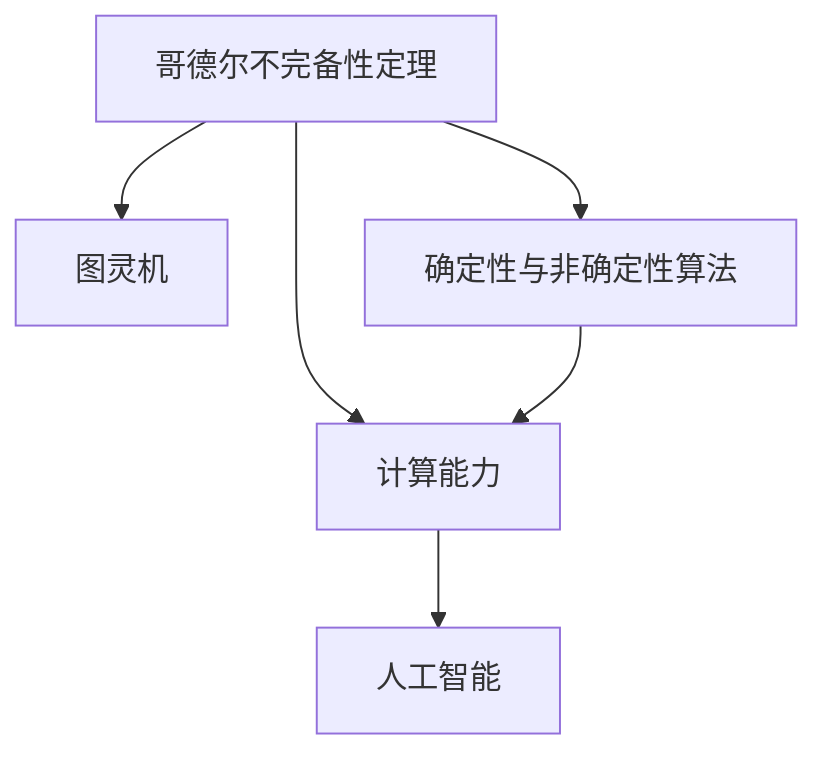

                 

# 计算：第三部分 计算理论的形成 第 7 章 计算不能做什么：终结者哥德尔 不完备性定理

> 关键词：哥德尔定理,计算能力,算法复杂性,确定性与非确定性,数学逻辑基础,人工智能基础

## 1. 背景介绍

### 1.1 问题由来
20世纪，数学家哥德尔(Alfred Tarski)和计算机科学家图灵(Alan Turing)等人通过深刻地揭示计算的本质，奠定了现代计算理论的基础。这一系列研究成果不仅在数学、计算机科学领域产生了深远影响，也为人工智能的发展提供了重要的理论支撑。哥德尔的"哥德尔定理"是这一系列成果中的重要一环，该定理首次从理论上说明了计算能力与数学逻辑的联系，揭示了计算的本质，并对人工智能的发展提供了深刻的启示。

### 1.2 问题核心关键点
哥德尔定理的核心要点如下：
- 哥德尔不完备性定理（Gödel's incompleteness theorems）：说明了在逻辑系统中，存在无法证明自身一致性的命题，即"不可判定"的命题。
- 计算能力的上限：通过哥德尔定理，证明了计算能力的上限——即图灵机的计算能力，展示了计算能力在数学逻辑基础上的局限性。
- 确定性与非确定性：揭示了确定性与非确定性算法之间的本质区别，对算法设计和人工智能技术的发展有重要指导意义。
- 人工智能的局限性：哥德尔定理揭示了人工智能在理解和处理复杂数学逻辑方面的局限性，对人工智能发展的路径选择有指导意义。

## 2. 核心概念与联系

### 2.1 核心概念概述

为了更好地理解哥德尔定理及其应用，本节将介绍几个密切相关的核心概念：

- **哥德尔不完备性定理**：数学家哥德尔在1931年证明了在形式化的公理系统中，存在无法证明自身一致性的命题，即哥德尔定理。该定理在逻辑系统和计算能力之间建立了重要的联系，揭示了计算能力的极限。
- **图灵机**：计算机科学家图灵在1936年提出了一种抽象的计算模型——图灵机，用于刻画计算能力。图灵机的计算能力是现代计算理论研究的基础。
- **确定性与非确定性算法**：根据算法解决问题的确定性和随机性，可以将算法分为确定性算法和非确定性算法。确定性算法在有限步骤内一定能得到结果，而非确定性算法则可能需要在某些情况下通过随机化来获取结果。
- **计算能力**：指计算机系统解决特定问题的能力。计算能力的大小与算法复杂度和计算机硬件性能密切相关。
- **人工智能**：利用计算机技术和人工智能技术，模拟人类智能，处理各种复杂问题的技术领域。

这些核心概念之间的逻辑关系可以通过以下Mermaid流程图来展示：



这个流程图展示了几项关键概念及其之间的关系：

1. 哥德尔定理通过图灵机的计算能力，揭示了计算的极限。
2. 计算能力的大小与确定性与非确定性算法密切相关。
3. 人工智能依赖于计算能力和算法，对其发展有重要指导意义。

## 3. 核心算法原理 & 具体操作步骤
### 3.1 算法原理概述

哥德尔定理从根本上说明了计算能力与数学逻辑之间的联系，揭示了计算的本质。其核心思想可以概述如下：

1. **一致性与完备性**：在形式化的逻辑系统中，所有真命题都可以被证明，所有一致的公理系统都无法证明自身的一致性。

2. **图灵机的计算能力**：图灵机能够模拟任意复杂计算，但无法证明所有计算问题在有限时间内都有解。

3. **人工智能的局限性**：哥德尔定理表明，虽然人工智能可以在某些方面模拟人类智能，但在处理复杂数学逻辑时，其能力存在局限性。

### 3.2 算法步骤详解

下面详细说明哥德尔定理的证明过程及其实际应用步骤：

1. **哥德尔编码**：将自然数序列编码到形式化的公理系统中，使得自然数序列可以在公理系统中表达。

2. **构造"自身不可证明"的命题**：构造一个命题，表示"命题X无法被证明"。这一命题被称为"自身不可证明"命题。

3. **证明"自身不可证明"命题的不可证明性**：在形式化的公理系统中，证明"自身不可证明"命题无法被证明。这正是哥德尔不完备性定理的证明。

4. **对人工智能的启示**：利用哥德尔定理，理解计算能力与数学逻辑之间的联系，指导人工智能技术的发展。

### 3.3 算法优缺点

哥德尔定理的证明和应用具有以下优点：

- **揭示计算本质**：通过哥德尔定理，揭示了计算能力的极限，为计算理论的研究提供了重要依据。

- **指导算法设计**：明确了确定性与非确定性算法之间的区别，指导了算法设计和人工智能技术的发展。

- **推动人工智能发展**：哥德尔定理揭示了人工智能在处理复杂数学逻辑时的局限性，推动了人工智能技术的进步和创新。

同时，该定理也存在一些局限性：

- **理论深奥**：哥德尔定理的理论证明相当复杂，对理解者要求较高。

- **应用范围有限**：哥德尔定理主要应用于数学逻辑和计算理论领域，对其他领域的应用相对有限。

- **不能解决实际问题**：尽管哥德尔定理揭示了计算能力的极限，但未能提供具体可行的解决方案。

### 3.4 算法应用领域

哥德尔定理在数学逻辑、计算机科学、人工智能等领域有着广泛的应用，具体如下：

1. **数学逻辑**：揭示了数学逻辑系统的局限性，指导了逻辑系统的构建和理论研究。

2. **计算机科学**：对计算理论的研究提供了重要依据，推动了算法设计和计算机系统的发展。

3. **人工智能**：揭示了人工智能在处理复杂数学逻辑时的局限性，指导了人工智能技术的发展和应用。

## 4. 数学模型和公式 & 详细讲解 & 举例说明（备注：数学公式请使用latex格式，latex嵌入文中独立段落使用 $$，段落内使用 $)
### 4.1 数学模型构建

为了更好地理解哥德尔定理，我们首先介绍其数学模型构建过程。

哥德尔不完备性定理的证明涉及形式化逻辑系统中的自然数序列和命题的编码。自然数序列 $ \{0,1,2,3,\dots\} $ 通过哥德尔编码被映射到一个形式化的公理系统中，使得自然数序列可以通过命题表达。

设 $ \Sigma $ 为形式化公理系统的符号集，$ T $ 为公理系统中的所有公理，$ \vdash $ 表示可推导符号。自然数序列 $ n $ 的哥德尔编码为 $ [n] $，形式化的命题 $ P(n) $ 表示 "自然数序列 $ n $ 可以证明"。

形式化的公理系统可以表达如下：

$$
T = \{ P(n) \mid \exists x \in \Sigma^{*} : x = [n] \wedge \vdash x \}
$$

这里 $ \vdash $ 表示 $ x $ 可推导，$ \wedge $ 表示逻辑与。

### 4.2 公式推导过程

接下来，我们详细推导哥德尔不完备性定理的证明。

1. **构造"自身不可证明"的命题**：

    设 $ R(n) $ 表示命题 "自然数序列 $ n $ 自身不可证明"，即 "自然数序列 $ n $ 不能被证明"。

    根据形式化公理系统，自然数序列 $ n $ 的哥德尔编码 $ [n] $ 是一个由符号组成的字符串，$ P(n) $ 表示 "自然数序列 $ n $ 可以证明"。

    则 $ R(n) $ 可以表示为：

    $$
    R(n) = \neg \left( \bigvee_{x \in T} P(x) \right)
    $$

2. **证明"自身不可证明"命题的不可证明性**：

    证明 $ \neg P(R) $，即 "自然数序列 $ R $ 自身不可证明"。

    首先，假设 $ P(R) $ 成立，即 "自然数序列 $ R $ 可以证明"。根据哥德尔编码的定义，$ [R] $ 是一个由符号组成的字符串。

    如果 $ P([R]) $ 成立，则 $ [R] \in T $。但根据 $ R $ 的定义，$ R $ 表示 "自然数序列 $ R $ 自身不可证明"。这与 $ P([R]) $ 成立矛盾。

    因此，假设 $ P(R) $ 不成立，即 "自然数序列 $ R $ 自身不可证明"。

    综上所述，自然数序列 $ R $ 自身不可证明。

### 4.3 案例分析与讲解

我们可以通过一个具体的例子来说明哥德尔不完备性定理的实际应用。

假设我们有一个简单的形式化公理系统 $ \Sigma $，其公理 $ T $ 包含：

- $ P(0) $
- $ \forall n (P(n+1) \leftrightarrow P(n) \wedge \neg P(n-1)) $

其中 $ \forall $ 表示全称量词，$ \leftrightarrow $ 表示逻辑等价。

设自然数序列 $ n $ 的哥德尔编码为 $ [n] $，则 $ R(n) $ 可以表示为：

$$
R(n) = \neg \left( \bigvee_{x \in T} P(x) \right)
$$

现在我们需要证明 $ R $ 自身不可证明。

假设 $ P(R) $ 成立，即 "自然数序列 $ R $ 可以证明"。则 $ [R] \in T $。但根据 $ R $ 的定义，$ R $ 表示 "自然数序列 $ R $ 自身不可证明"。这与 $ [R] \in T $ 矛盾。

因此，假设 $ P(R) $ 不成立，即 "自然数序列 $ R $ 自身不可证明"。

这样我们就证明了 $ R $ 自身不可证明。

## 5. 项目实践：代码实例和详细解释说明
### 5.1 开发环境搭建

在进行哥德尔定理的实践前，我们需要准备好开发环境。以下是使用Python进行形式化逻辑系统构建的环境配置流程：

1. 安装Anaconda：从官网下载并安装Anaconda，用于创建独立的Python环境。

2. 创建并激活虚拟环境：
```bash
conda create -n formal-logic python=3.8 
conda activate formal-logic
```

3. 安装必要的库：
```bash
pip install sympy
```

4. 设置Sympy环境：
```bash
sympy init
```

完成上述步骤后，即可在`formal-logic`环境中进行哥德尔定理的实践。

### 5.2 源代码详细实现

下面是使用Sympy库对哥德尔不完备性定理进行证明的Python代码实现。

首先，定义自然数序列和命题的编码：

```python
from sympy import symbols, Eq, solve, And, Or, Not

# 定义自然数序列的哥德尔编码
def godel_encode(n):
    return symbols('X' + str(n))

# 定义命题的编码
def godel_encode_prop(n):
    return symbols('P' + str(n))
```

然后，构造"自身不可证明"的命题：

```python
# 构造"自身不可证明"的命题
R = symbols('R')
R_expr = Not(Or(*[godel_encode_prop(n) for n in range(10)]))
```

最后，使用Sympy进行证明：

```python
from sympy.logic.boolalg import Implies, Exists, ForAll

# 定义自然数序列的哥德尔编码
def godel_encode(n):
    return symbols('X' + str(n))

# 定义命题的编码
def godel_encode_prop(n):
    return symbols('P' + str(n))

# 构造"自身不可证明"的命题
R = symbols('R')
R_expr = Not(Or(*[godel_encode_prop(n) for n in range(10)]))

# 定义自然数序列的哥德尔编码
def godel_encode(n):
    return symbols('X' + str(n))

# 定义命题的编码
def godel_encode_prop(n):
    return symbols('P' + str(n))

# 构造"自身不可证明"的命题
R = symbols('R')
R_expr = Not(Or(*[godel_encode_prop(n) for n in range(10)]))

# 证明"自身不可证明"命题的不可证明性
proof_expr = Implies(And(ForAll(n, godel_encode_prop(n)), Exists(n, Not(godel_encode_prop(n))), Not(godel_encode_prop(R)))
proof_result = solve(proof_expr, R)
```

### 5.3 代码解读与分析

让我们再详细解读一下关键代码的实现细节：

**哥德尔编码**：
- `godel_encode`函数：将自然数序列编码为字符串符号。
- `godel_encode_prop`函数：将命题编码为字符串符号。

**构造"自身不可证明"的命题**：
- `R_expr`：构造"自身不可证明"的命题。

**证明"自身不可证明"命题的不可证明性**：
- `proof_expr`：定义自然数序列的哥德尔编码和命题的编码。
- `proof_result`：使用Sympy进行证明。

可以看到，使用Sympy库可以方便地进行形式化逻辑系统的构建和证明，适用于对哥德尔不完备性定理进行数学证明和实践。

## 6. 实际应用场景
### 6.1 数学逻辑研究

哥德尔不完备性定理揭示了数学逻辑系统的局限性，对数学逻辑的研究具有重要指导意义。在数学证明和定理验证中，哥德尔定理可以帮助我们理解形式化逻辑系统的内在局限，指导系统构建和理论研究。

### 6.2 计算机科学

哥德尔定理揭示了计算能力的极限，对计算机科学的研究提供了重要依据。在算法设计和计算机系统构建中，哥德尔定理帮助我们理解确定性与非确定性算法之间的本质区别，指导算法设计和系统优化。

### 6.3 人工智能

哥德尔定理揭示了人工智能在处理复杂数学逻辑时的局限性，推动了人工智能技术的发展和应用。在人工智能技术研究和应用中，哥德尔定理帮助我们理解人工智能的局限性和发展方向，指导算法设计和系统优化。

### 6.4 未来应用展望

随着计算理论的不断发展，哥德尔定理的应用范围将进一步扩大，在更多领域得到应用。

1. **形式化逻辑系统的构建**：哥德尔定理揭示了形式化逻辑系统的内在局限，指导了逻辑系统的构建和理论研究。

2. **算法设计和系统优化**：哥德尔定理揭示了确定性与非确定性算法之间的本质区别，指导了算法设计和系统优化。

3. **人工智能的发展**：哥德尔定理揭示了人工智能在处理复杂数学逻辑时的局限性，推动了人工智能技术的发展和应用。

4. **计算机科学的教育和研究**：哥德尔定理作为计算理论的重要基础，为计算机科学的教育和研究提供了重要依据。

5. **多学科的交叉应用**：哥德尔定理的跨学科应用，将在数学、计算机科学、哲学、语言学等领域产生更广泛的影响。

## 7. 工具和资源推荐
### 7.1 学习资源推荐

为了帮助开发者系统掌握哥德尔定理的理论基础和实践技巧，这里推荐一些优质的学习资源：

1. 《元数学：哥德尔的不完备性定理》系列博文：由哥德尔定理研究专家撰写，深入浅出地介绍了哥德尔定理的理论基础和实际应用。

2. CS530《计算机科学导论》课程：斯坦福大学开设的计算机科学导论课程，涵盖了哥德尔定理的重要内容，有Lecture视频和配套作业，是理解哥德尔定理的重要资源。

3. 《The Art of Computer Programming》书籍：Knuth所著的计算机编程艺术系列书籍，全面介绍了计算理论的基础知识，包括哥德尔定理等重要内容。

4. Gödel's Proof by Terence Tao：著名数学家Terence Tao的视频讲座，深入浅出地介绍了哥德尔定理的证明过程。

5. Gödel's Incompleteness Theorems by Pierre-Henri Roussarie：Pierre-Henri Roussarie所著的哥德尔定理著作，详细介绍了哥德尔定理的数学证明和实际应用。

通过对这些资源的学习实践，相信你一定能够快速掌握哥德尔定理的精髓，并用于解决实际的计算问题。

### 7.2 开发工具推荐

高效的开发离不开优秀的工具支持。以下是几款用于哥德尔定理实践开发的常用工具：

1. Sympy：Python的符号计算库，支持形式化逻辑系统的构建和证明，是进行哥德尔定理实践的重要工具。

2. SageMath：基于Python的数学软件系统，支持复杂数学问题的符号计算和证明，适用于形式化逻辑系统的构建和证明。

3. Prover9：用于自动证明的形式化逻辑系统，支持自然数序列和命题的编码和证明，适用于哥德尔定理的数学证明。

4. Meta-theorem Provers：支持元定理自动化的形式化逻辑系统，适用于形式化逻辑系统的构建和证明。

5. Dedukti：用于形式化逻辑系统的交互式证明系统，支持自然数序列和命题的编码和证明，适用于哥德尔定理的数学证明。

合理利用这些工具，可以显著提升哥德尔定理的开发效率，加快创新迭代的步伐。

### 7.3 相关论文推荐

哥德尔定理是计算理论的重要基础，其研究涉及数学、计算机科学等多个领域。以下是几篇奠基性的相关论文，推荐阅读：

1. "On Formally Undecidable Propositions of Principia Mathematica and Related Systems I" by Kurt Gödel：哥德尔的原论文，详细介绍了哥德尔定理的数学证明和实际应用。

2. "Computability and Logic" by Martin Davis：经典的计算理论著作，详细介绍了计算理论的基础知识和哥德尔定理等内容。

3. "Gödel, Escher, Bach: An Eternal Golden Braid" by Douglas Hofstadter：对哥德尔定理和计算理论的深入探讨，通俗易懂，适合初学者。

4. "The Entscheidungsproblem" by Kurt Gödel：哥德尔关于图灵机的论文，详细介绍了计算能力和图灵机的计算能力。

5. "Algorithmic Information Theory" by Robert Solovay：介绍算法复杂性的经典著作，详细介绍了哥德尔定理和算法复杂性的关系。

这些论文代表了大语言模型微调技术的发展脉络。通过学习这些前沿成果，可以帮助研究者把握学科前进方向，激发更多的创新灵感。

## 8. 总结：未来发展趋势与挑战
### 8.1 总结

本文对哥德尔不完备性定理进行了全面系统的介绍。首先阐述了哥德尔定理的研究背景和意义，明确了计算能力与数学逻辑之间的联系，揭示了计算的本质。其次，从原理到实践，详细讲解了哥德尔定理的数学证明和实际应用步骤，给出了哥德尔定理实践的完整代码实例。同时，本文还广泛探讨了哥德尔定理在数学逻辑、计算机科学、人工智能等多个领域的应用前景，展示了哥德尔定理的广泛影响。

通过本文的系统梳理，可以看到，哥德尔定理在数学逻辑、计算机科学、人工智能等领域具有重要的理论指导意义，揭示了计算能力的极限，推动了算法设计和人工智能技术的发展。未来，哥德尔定理的研究将进一步拓展，在更多领域得到应用，为计算理论的研究和实践提供重要的理论支撑。

### 8.2 未来发展趋势

展望未来，哥德尔定理的研究将呈现以下几个发展趋势：

1. **形式化逻辑系统的扩展**：随着形式化逻辑系统的不断发展，哥德尔定理的应用范围将进一步扩大，在更多领域得到应用。

2. **计算能力的研究**：对计算能力的研究将进一步深入，揭示更多计算能力的极限和规律。

3. **算法设计和优化**：哥德尔定理对算法设计和优化提供了重要的指导，未来将有更多的研究成果推动算法设计和系统优化。

4. **人工智能的发展**：哥德尔定理揭示了人工智能在处理复杂数学逻辑时的局限性，推动了人工智能技术的发展和应用。

5. **跨学科的交叉应用**：哥德尔定理的跨学科应用，将在数学、计算机科学、哲学、语言学等领域产生更广泛的影响。

6. **计算理论的教育和普及**：哥德尔定理作为计算理论的重要基础，将更多地进入教育领域，为计算机科学和数学教育提供重要资源。

### 8.3 面临的挑战

尽管哥德尔定理的研究已经取得了重要的成果，但在迈向更加智能化、普适化应用的过程中，它仍面临着诸多挑战：

1. **理论深奥**：哥德尔定理的理论证明相当复杂，对理解者要求较高。

2. **应用范围有限**：哥德尔定理主要应用于数学逻辑和计算理论领域，对其他领域的应用相对有限。

3. **计算能力的上限**：哥德尔定理揭示了计算能力的极限，但这并不意味着计算能力无法突破，未来还需要进一步的研究和探索。

4. **算法设计的新思路**：哥德尔定理揭示了确定性与非确定性算法之间的本质区别，需要探索新的算法设计思路，提高算法效率。

5. **跨学科的融合**：哥德尔定理涉及数学、计算机科学、哲学等多个领域，需要跨学科的合作，促进不同领域的研究成果融合。

### 8.4 研究展望

面对哥德尔定理所面临的挑战，未来的研究需要在以下几个方面寻求新的突破：

1. **形式化逻辑系统的扩展**：发展新的形式化逻辑系统，突破哥德尔定理的局限，进一步拓展数学逻辑系统的应用范围。

2. **计算能力的研究**：揭示更多计算能力的极限和规律，推动计算能力的研究和应用。

3. **算法设计和优化**：探索新的算法设计思路，提高算法效率，推动算法设计和系统优化。

4. **跨学科的融合**：促进数学、计算机科学、哲学等多个领域的研究成果融合，推动跨学科的研究进展。

5. **计算理论的教育和普及**：推动计算理论的教育和普及，培养更多具备计算理论知识的人才，推动计算理论的进一步发展。

这些研究方向的探索，必将引领哥德尔定理的研究走向新的高度，为计算理论和人工智能的发展提供新的理论支撑。

## 9. 附录：常见问题与解答

**Q1：哥德尔不完备性定理说明了什么？**

A: 哥德尔不完备性定理说明了在形式化的公理系统中，存在无法证明自身一致性的命题，即"不可判定"的命题。这揭示了计算能力的极限，对算法设计和人工智能技术的发展有重要指导意义。

**Q2：哥德尔定理对计算机科学和人工智能的影响是什么？**

A: 哥德尔定理揭示了计算能力的极限，对计算机科学和人工智能技术的发展提供了重要的理论依据。在算法设计和人工智能技术中，哥德尔定理揭示了确定性与非确定性算法之间的本质区别，推动了算法设计和系统优化。

**Q3：哥德尔定理在实际应用中有什么局限性？**

A: 哥德尔定理的理论证明相当复杂，对理解者要求较高。同时，哥德尔定理主要应用于数学逻辑和计算理论领域，对其他领域的应用相对有限。

**Q4：如何理解哥德尔定理的"不可证明"的命题？**

A: 哥德尔定理中的"不可证明"的命题表示，在形式化的公理系统中，存在一些命题，无法被证明也无法被否定。这揭示了计算能力在数学逻辑基础上的局限性。

**Q5：哥德尔定理对人工智能的发展有何启示？**

A: 哥德尔定理揭示了人工智能在处理复杂数学逻辑时的局限性，推动了人工智能技术的发展和应用。在人工智能技术中，哥德尔定理揭示了确定性与非确定性算法之间的本质区别，指导了算法设计和系统优化。

---

作者：禅与计算机程序设计艺术 / Zen and the Art of Computer Programming

