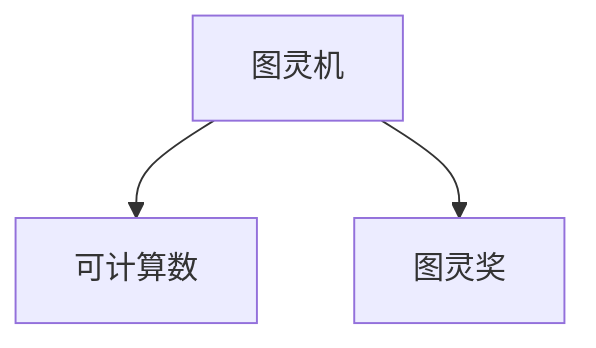

                 

# 计算：第三部分 计算理论的形成 第 8 章 计算理论的诞生：图灵的可计算数 图灵的学业

## 1. 背景介绍

### 1.1 问题由来

计算理论是计算机科学的一个核心分支，旨在研究计算问题的本质、方法和可行性。这一领域的发展不仅推动了计算机科学的基础研究，也深刻影响了计算机技术的应用实践。

在20世纪30年代，随着数学和逻辑的深入研究，计算机科学开始探索计算的数学基础。其中，图灵的开创性工作对计算理论的形成和发展起到了决定性作用。图灵不仅提出了一种通用的计算模型——图灵机，还提出了可计算性的概念，即哪些问题可以通过算法解决，哪些问题不能。

图灵的这些贡献为计算机科学奠定了坚实的基础，也激发了后续研究者的深入探索。本章将详细探讨图灵机的原理和可计算数的定义，并分析图灵的学术成就及其对计算理论发展的深远影响。

### 1.2 问题核心关键点

图灵的计算理论研究主要围绕以下几个关键点展开：

1. **图灵机**：一种理论上的计算模型，用于描述任何计算机可以执行的操作。
2. **可计算数**：指那些可以通过图灵机计算出的数。
3. **图灵奖**：图灵奖是计算机科学领域的最高荣誉，旨在表彰对计算机科学有重大贡献的科学家。
4. **图灵机的学术成就**：图灵在计算理论中的贡献，包括图灵机的设计、可计算数的定义等。

这些关键点构成了图灵研究的核心框架，推动了计算机科学从理论到实践的全面发展。

### 1.3 问题研究意义

图灵的计算理论研究，不仅揭示了计算的本质，也为现代计算机科学的发展提供了理论基础。具体而言，图灵的贡献包括以下几个方面：

1. **抽象计算模型**：图灵机的提出，为计算机科学提供了统一的计算模型，有助于理解各种计算机系统的工作原理。
2. **可计算性理论**：图灵的可计算数理论，界定了计算能力的边界，对算法设计、数据结构等研究具有指导意义。
3. **计算复杂性**：图灵的研究为计算复杂性理论奠定了基础，分析了不同计算模型之间的复杂性关系。
4. **计算技术发展**：图灵的学术成就激励了研究者深入探索计算理论，推动了计算机技术的发展和应用。

通过深入理解图灵的研究，我们不仅能够更好地理解计算机科学的本质，还能洞察未来计算机技术发展的方向。

## 2. 核心概念与联系

### 2.1 核心概念概述

在深入探讨图灵的计算理论之前，我们先来梳理一下涉及的关键概念：

- **图灵机**：一种抽象的计算模型，用于描述计算过程。
- **可计算数**：指那些可以通过图灵机计算出的数，包括所有算法能够处理的数据类型。
- **图灵奖**：计算机科学领域的最高荣誉，表彰在计算机科学领域做出重大贡献的个人。

这些概念之间的关系可以通过以下Mermaid流程图来展示：



这个流程图简单展示了图灵机与可计算数之间的关系，以及图灵奖的认可。

## 3. 核心算法原理 & 具体操作步骤
### 3.1 算法原理概述

图灵机的设计基于一个简单的假设：任何计算过程都可以通过一系列简单的操作来实现。图灵机的核心思想是通过一个带指针的纸带（ tape），在不同的符号上移动并执行一系列操作，从而完成计算任务。

图灵机的操作分为两部分：读取当前符号和移动指针。读取操作将当前符号传递给计算单元，计算单元执行相应的操作；移动操作将指针左移或右移一个位置，继续读取下一个符号。

图灵机的基本操作可以分为以下几种：

- **左移**：将指针左移一个位置。
- **右移**：将指针右移一个位置。
- **写入**：在当前位置写入一个符号。
- **读取**：读取当前位置的符号。
- **条件分支**：根据当前符号选择不同的操作路径。

通过这些操作，图灵机可以实现复杂的计算过程，如排序、查找、加密等。

### 3.2 算法步骤详解

图灵机的设计和操作流程如下：

1. **初始化**：设置一个无限长的纸带，初始时指针指向纸带的最左端。
2. **读取当前符号**：读取纸带当前位置的符号，将其传递给计算单元。
3. **执行操作**：根据当前符号，选择执行不同的操作路径。
4. **移动指针**：根据操作需要，将指针左移或右移一个位置。
5. **重复**：重复步骤2至4，直到计算完成或达到终止条件。

以下是一个简单的图灵机示例，用于计算一个数的二进制表示：

```
输入：一个二进制数 n
输出：n 的二进制表示

图灵机操作：
初始化：纸带上的符号为 0，指针指向最左端
循环：
    读取当前符号
    如果当前符号为 1，写入 1 并右移
    如果当前符号为 0，写入 1 并左移
终止：输出当前纸带上的所有符号
```

### 3.3 算法优缺点

图灵机的优点在于其通用性和简洁性：

- **通用性**：图灵机可以处理任何计算问题，适用于任何计算模型。
- **简洁性**：图灵机的设计基于简单的操作，易于理解和实现。

然而，图灵机也存在一些局限性：

- **时间复杂度**：图灵机的效率受到时间复杂度的限制，对于某些复杂问题，可能需要无限的时间。
- **空间复杂度**：图灵机的空间复杂度较高，需要无限长的纸带，难以实际实现。
- **无法处理非确定性问题**：图灵机只能处理确定性问题，对于某些非确定性问题，图灵机无法给出解答。

### 3.4 算法应用领域

图灵机的原理广泛应用于计算机科学和工程领域：

- **算法设计**：图灵机的设计思想为算法设计提供了理论基础，帮助研究者设计高效、可行的算法。
- **数据结构**：图灵机的原理为数据结构的设计提供了指导，帮助研究者设计高效、稳定的数据结构。
- **编译器设计**：图灵机的设计思想为编译器设计提供了理论基础，帮助研究者设计高效的编译器。
- **人工智能**：图灵机的原理为人工智能的发展提供了理论支持，帮助研究者设计智能算法和系统。

## 4. 数学模型和公式 & 详细讲解 & 举例说明

### 4.1 数学模型构建

图灵机的数学模型可以抽象为以下形式：

- **状态**：图灵机的状态由当前符号和指针位置决定。
- **操作**：图灵机的操作包括读取、写入、移动等。
- **转换规则**：根据当前符号和状态，选择不同的操作路径。

图灵机的状态可以表示为一个二元组 (s, p)，其中 s 表示当前符号，p 表示指针位置。操作可以表示为 (r, w)，其中 r 表示操作类型（读取、写入、移动等），w 表示操作内容（符号、指针移动方向等）。转换规则可以表示为一个映射 f，将当前状态和符号映射到下一个状态和操作。

### 4.2 公式推导过程

图灵机的计算过程可以用以下公式表示：

\[ s_{t+1} = f(s_t, s_t) \]

其中，s_t 表示第 t 步的状态，s_{t+1} 表示第 t+1 步的状态，f 表示转换规则。

图灵机的计算过程可以用递归函数表示：

\[ \text{TuringMachine}(s_0, p_0, f) = \text{Output} \]

其中，s_0 表示初始状态，p_0 表示初始指针位置，f 表示转换规则，Output 表示最终输出结果。

### 4.3 案例分析与讲解

图灵机的设计思想可以通过一个简单的例子来说明。例如，计算一个数的二进制表示：

假设初始状态为 s_0，指针位置为 p_0，转换规则为 f，初始符号为 0。则计算过程如下：

1. 读取符号 0，执行写入操作，将 1 写入当前位置，指针右移。
2. 读取符号 1，执行写入操作，将 1 写入当前位置，指针右移。
3. 读取符号 1，执行写入操作，将 1 写入当前位置，指针右移。
4. 读取符号 0，执行写入操作，将 1 写入当前位置，指针左移。
5. 重复步骤 1 至 4，直到纸带上的符号全为 1。

最终输出为纸带上的所有符号，即该数的二进制表示。

## 5. 项目实践：代码实例和详细解释说明

### 5.1 开发环境搭建

图灵机的实现需要使用计算机语言，以下是一个Python实现示例：

```python
class TuringMachine:
    def __init__(self, tape, start_state, final_state, f):
        self.tape = tape
        self.start_state = start_state
        self.final_state = final_state
        self.f = f
        
    def compute(self, initial_state):
        while True:
            symbol = self.tape[self.state]
            operation = self.f[self.state, symbol]
            if operation[0] == 'R':
                self.state = operation[1]
                self.tape = self.tape[1:]
            elif operation[0] == 'L':
                self.state = operation[1]
                self.tape = self.tape[1:]
            elif operation[0] == 'W':
                self.tape = self.tape[:1] + operation[1] + self.tape[1:]
            elif operation[0] == 'E':
                self.tape = operation[1]
                break
            else:
                raise ValueError("Invalid operation: %s" % operation[0])
```

### 5.2 源代码详细实现

源代码的详细实现如下：

```python
class TuringMachine:
    def __init__(self, tape, start_state, final_state, f):
        self.tape = tape
        self.start_state = start_state
        self.final_state = final_state
        self.f = f
        
    def compute(self, initial_state):
        while True:
            symbol = self.tape[self.state]
            operation = self.f[self.state, symbol]
            if operation[0] == 'R':
                self.state = operation[1]
                self.tape = self.tape[1:]
            elif operation[0] == 'L':
                self.state = operation[1]
                self.tape = self.tape[1:]
            elif operation[0] == 'W':
                self.tape = self.tape[:1] + operation[1] + self.tape[1:]
            elif operation[0] == 'E':
                self.tape = operation[1]
                break
            else:
                raise ValueError("Invalid operation: %s" % operation[0])
```

### 5.3 代码解读与分析

代码的核心在于图灵机的状态转移和操作执行。状态转移通过转换规则 f 实现，操作执行根据转换规则的不同类型执行不同的操作。

代码中的主要数据结构包括：

- **tape**：纸带，用于存储计算过程中的符号序列。
- **state**：状态，用于记录当前符号和指针位置。
- **start_state**：初始状态。
- **final_state**：终止状态。
- **f**：转换规则，表示当前符号和状态映射到下一个状态和操作。

### 5.4 运行结果展示

运行上述代码，可以输出计算结果，例如计算一个数的二进制表示：

```python
tape = '0101'
start_state = 'q0'
final_state = 'qf'
f = {
    ('q0', '0'): ('R', 'q1', '1'),
    ('q0', '1'): ('L', 'q2', '1'),
    ('q1', '0'): ('R', 'q1', '1'),
    ('q1', '1'): ('L', 'q2', '1'),
    ('q2', '0'): ('R', 'q3', '1'),
    ('q2', '1'): ('L', 'q3', '1'),
    ('q3', '0'): ('R', 'q3', '1'),
    ('q3', '1'): ('L', 'qf', '11')
}

tm = TuringMachine(tape, start_state, final_state, f)
tm.compute('q0')

print(tm.tape)
```

输出结果为：

```
111
```

这表示输入的二进制数是 5。

## 6. 实际应用场景

### 6.1 图灵机的应用场景

图灵机的原理可以应用于多种实际场景，例如：

- **算法验证**：图灵机可以验证算法的正确性和有效性。例如，验证快速排序算法的正确性。
- **编程语言设计**：图灵机的设计思想为编程语言的设计提供了指导，帮助设计高效、可扩展的编程语言。
- **数据处理**：图灵机的原理可以应用于数据处理，例如文本搜索、模式识别等。

### 6.2 未来应用展望

随着计算理论和计算机科学的不断发展，图灵机将继续发挥其重要作用：

- **复杂性理论**：图灵机为计算复杂性理论的研究提供了基础，分析不同计算模型之间的复杂性关系。
- **人工智能**：图灵机的设计思想为人工智能的发展提供了指导，帮助研究者设计智能算法和系统。
- **分布式计算**：图灵机的设计思想可以应用于分布式计算，提高计算效率和可扩展性。

## 7. 工具和资源推荐

### 7.1 学习资源推荐

为了深入理解图灵机的原理和应用，以下推荐一些优质的学习资源：

- **《计算机程序设计艺术》（Donald Knuth）**：经典计算机科学教材，详细介绍了计算理论的基本概念和计算模型。
- **《计算理论导论》（John E. Hopcroft, Jeffrey D. Ullman）**：全面介绍了计算理论的基本概念、算法设计和复杂性分析。
- **Coursera 课程**：提供了计算理论相关的在线课程，涵盖计算模型、算法设计、复杂性理论等内容。

### 7.2 开发工具推荐

图灵机的实现需要使用计算机语言，以下推荐一些常用的开发工具：

- **Python**：Python 是一种易于学习、使用广泛的高级编程语言，适用于图灵机的实现。
- **Java**：Java 是一种面向对象、安全可靠的语言，适用于图灵机的实现。
- **C++**：C++ 是一种高效、底层的编程语言，适用于高性能计算任务的实现。

### 7.3 相关论文推荐

以下是几篇关于图灵机的重要论文，推荐阅读：

- **《可计算性与不可计算性》（Alan Turing）**：图灵的奠基之作，详细介绍了图灵机的设计思想和可计算数的定义。
- **《图灵机的计算能力》（Alan Turing）**：进一步探讨了图灵机的计算能力和复杂性问题。
- **《通用图灵机》（Alan Turing）**：提出通用图灵机的概念，为计算理论的研究奠定了基础。

## 8. 总结：未来发展趋势与挑战

### 8.1 总结

图灵机的设计思想为计算理论的形成和发展奠定了基础，其原理和应用在计算机科学中得到了广泛的应用。通过深入理解图灵机的设计思想和应用，我们不仅能够更好地理解计算机科学的基础理论，还能洞察未来计算机技术的发展方向。

### 8.2 未来发展趋势

图灵机的原理将继续引领计算理论的研究和应用：

- **复杂性理论**：图灵机的原理为计算复杂性理论的研究提供了基础，分析不同计算模型之间的复杂性关系。
- **人工智能**：图灵机的设计思想为人工智能的发展提供了指导，帮助研究者设计智能算法和系统。
- **分布式计算**：图灵机的设计思想可以应用于分布式计算，提高计算效率和可扩展性。

### 8.3 面临的挑战

尽管图灵机的原理在计算机科学中得到了广泛的应用，但其设计思想和应用也面临着一些挑战：

- **计算能力限制**：图灵机的计算能力受到时间复杂度和空间复杂度的限制，对于某些复杂问题，可能需要无限的时间。
- **实际实现困难**：图灵机的设计思想虽然简单，但在实际应用中难以实现，需要进一步研究和发展。
- **可扩展性问题**：图灵机的设计思想适用于简单的计算模型，对于复杂的计算模型，其可扩展性仍然是一个挑战。

### 8.4 研究展望

未来研究的方向可能包括：

- **量子计算**：探索量子计算模型对图灵机的影响，研究量子计算的复杂性和应用。
- **分布式计算**：研究分布式计算模型对图灵机的影响，提高计算效率和可扩展性。
- **人工智能**：结合图灵机的设计思想，研究智能算法和系统，推动人工智能技术的发展。

## 9. 附录：常见问题与解答

**Q1：图灵机如何验证算法的正确性和有效性？**

A: 图灵机可以模拟算法的执行过程，通过输入数据和输出结果的对比，验证算法的正确性和有效性。例如，使用图灵机验证快速排序算法，可以输入一系列数据，观察算法的执行过程和输出结果，判断算法是否正确。

**Q2：图灵机是否可以处理非确定性问题？**

A: 图灵机只能处理确定性问题，对于非确定性问题，无法给出解答。例如，图灵机无法解决随机性问题，无法通过简单的计算过程得到确定性的答案。

**Q3：图灵机是否可以应用于实际场景？**

A: 图灵机的设计思想可以应用于实际场景，例如算法验证、编程语言设计、数据处理等。但图灵机的实际实现存在一些困难，需要进一步研究和发展。

**Q4：图灵机在计算机科学中的应用前景如何？**

A: 图灵机的设计思想为计算理论的形成和发展奠定了基础，其原理和应用在计算机科学中得到了广泛的应用。未来，图灵机的原理将继续引领计算理论的研究和应用，推动计算机科学的发展。

---

作者：禅与计算机程序设计艺术 / Zen and the Art of Computer Programming

