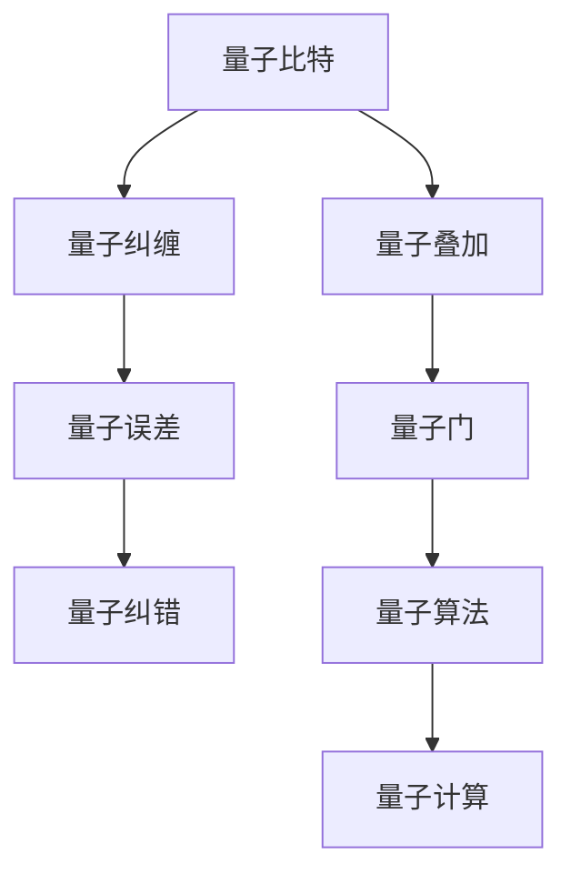

                 

# 计算：第四部分 计算的极限 第 10 章 量子计算 量子算法

> 关键词：量子计算, 量子算法, 量子比特, 量子门, 量子叠加, 量子纠缠, 量子误差, 量子纠错, 量子算法设计, 量子计算应用

## 1. 背景介绍

### 1.1 问题由来

在当今信息社会中，计算能力已经成为衡量一个国家科技实力的重要指标之一。而随着计算机硬件的不断进步，尤其是晶体管尺寸的不断缩小，我们进入了一个所谓摩尔定律失效的新时代。如何突破现有计算能力的瓶颈，寻找新的计算范式，成为了全球科技界共同面临的挑战。量子计算作为新一代的计算方式，以其独特的优势，引起了学术界和工业界的广泛关注。

量子计算是一种基于量子力学原理的计算模式，它打破了经典计算机基于二进制位(bits)的操作方式，而是采用量子比特(quantum bits, qubits)进行计算。通过量子叠加、量子纠缠等量子力学特性，量子计算机可以同时处理多个计算状态，大幅提高计算效率，尤其是在解决某些特定问题时，展现出了经典计算机难以企及的优越性。

### 1.2 问题核心关键点

量子计算的核心思想是通过量子力学原理，构建出一种全新的计算模型，利用量子比特的物理特性，实现高效计算。相比于经典计算机，量子计算机具有以下特点：

1. **量子叠加**：量子比特可以同时处于多个状态，可以通过量子叠加同时处理大量信息。
2. **量子纠缠**：多个量子比特之间可以形成纠缠关系，一个量子比特的状态变化可以瞬间影响到与之纠缠的其他量子比特，实现复杂信息的快速处理。
3. **并行计算**：量子计算具有天然的并行计算能力，能够在同一时间内处理大量计算任务。
4. **量子误差**：量子系统的稳定性差，容易受到环境干扰，导致量子比特的状态变化，增加计算误差。
5. **量子纠错**：为了应对量子误差的挑战，量子计算机需要设计高效的纠错算法，保证计算结果的准确性。

### 1.3 问题研究意义

研究量子计算和量子算法，对于拓展计算能力，解决现有计算机难以处理的问题，具有重要的理论和实际意义：

1. **提高计算效率**：量子计算能够在大数据、复杂算法等领域显著提升计算速度，解决经典计算机难以处理的问题。
2. **推动科技发展**：量子计算的突破将推动新一代科技革命，特别是在材料科学、化学、生物医药等领域，能够大幅提高研究效率。
3. **开启新计算范式**：量子计算不仅仅是计算能力的提升，它将开启一种新的计算范式，影响整个科技领域的未来发展。
4. **应用前景广阔**：量子计算可以应用于密码学、优化问题、机器学习等多个领域，带来革命性的变革。

## 2. 核心概念与联系

### 2.1 核心概念概述

为了更好地理解量子计算和量子算法，本节将介绍几个关键概念，并通过流程图展示它们之间的联系。

- **量子比特(Quantum Bit, qubit)**：量子计算的基本单位，可以表示为 $|0\rangle$ 和 $|1\rangle$ 的叠加态 $|\psi\rangle=\alpha|0\rangle+\beta|1\rangle$，其中 $\alpha$ 和 $\beta$ 为复数，满足 $|\alpha|^2+|\beta|^2=1$。
- **量子门(Quantum Gate)**：量子计算机的基本操作单元，类似于经典计算机的逻辑门。通过量子门，可以对量子比特进行特定的操作，如旋转、交换等。
- **量子叠加(Superposition)**：量子比特可以同时处于多个状态，表示为 $|\psi\rangle=\alpha|0\rangle+\beta|1\rangle$。
- **量子纠缠(Entanglement)**：多个量子比特之间形成纠缠关系，一个量子比特的状态变化可以瞬间影响到与之纠缠的其他量子比特。
- **量子误差(Qubit Error)**：量子系统容易受到环境干扰，导致量子比特的状态变化，引入计算误差。
- **量子纠错(Qubit Error Correction)**：为了应对量子误差的挑战，设计高效的纠错算法，保证计算结果的准确性。

这些核心概念之间通过以下Mermaid流程图展示了它们之间的联系：



这个流程图展示了量子比特通过叠加和纠缠形成计算的基本单元，在量子门的作用下执行特定的操作，并最终通过量子算法完成计算。

## 3. 核心算法原理 & 具体操作步骤

### 3.1 算法原理概述

量子算法是基于量子力学原理设计的计算算法，与经典算法不同，量子算法利用量子比特的物理特性，可以在多项式时间内解决某些经典算法难以处理的问题。以下是几种典型量子算法的原理概述：

1. **Shor算法**：用于分解大整数，通过量子并行性，能够在多项式时间内实现大整数的因式分解。
2. **Grover算法**：用于在未排序的数据库中搜索目标数据，能够在平方根时间复杂度内完成搜索，比经典算法效率更高。
3. **量子模拟算法**：通过量子计算机模拟量子系统的行为，用于研究化学反应、量子物理等领域。

### 3.2 算法步骤详解

以下以Shor算法为例，详细介绍其步骤和操作：

1. **初始化量子比特**：将 $n$ 个量子比特初始化为 $|0\rangle$ 状态。
2. **准备相位估计器**：引入相位估计器，通过量子叠加和量子测量，估计目标数 $N$ 的因子 $d$。
3. **应用量子傅里叶变换**：通过量子傅里叶变换，将相位估计器输出的结果转化为经典数据。
4. **应用量子回溯算法**：通过回溯算法，从量子叠加的状态中筛选出目标因子 $d$。
5. **输出结果**：输出分解后的因子 $d$。

### 3.3 算法优缺点

量子算法与经典算法相比，具有以下优缺点：

**优点**：

1. **高效计算**：在多项式时间内解决某些经典算法难以处理的问题。
2. **并行计算**：能够同时处理多个计算任务，提高计算效率。
3. **误差可控**：通过量子纠错算法，可以有效控制计算误差。

**缺点**：

1. **硬件要求高**：量子计算需要高质量的量子比特和量子门，硬件要求极高。
2. **实现复杂**：量子算法的实现较为复杂，需要设计高效的算法和电路。
3. **误差敏感**：量子系统的稳定性差，容易受到环境干扰，导致计算误差。

### 3.4 算法应用领域

量子计算和量子算法已经在多个领域得到应用，包括：

1. **密码学**：量子算法可以破解RSA等经典加密算法，同时也为量子密钥分发等新型加密技术提供支持。
2. **优化问题**：量子算法可以用于解决优化问题，如旅行商问题、背包问题等。
3. **机器学习**：量子算法可以用于训练深度神经网络，提高机器学习的效率和精度。
4. **化学计算**：量子计算可以用于模拟量子系统，研究化学反应等复杂现象。
5. **材料科学**：量子计算可以用于设计新型材料，优化材料性能。

## 4. 数学模型和公式 & 详细讲解 & 举例说明

### 4.1 数学模型构建

量子计算的数学模型建立在量子力学的基础上，主要涉及以下几个数学概念：

- **量子态**：用复数向量表示，可以表示为 $|\psi\rangle=\alpha|0\rangle+\beta|1\rangle$。
- **量子叠加**：通过叠加，可以同时表示多个状态，公式为 $|\psi\rangle=\alpha|0\rangle+\beta|1\rangle$。
- **量子纠缠**：两个量子比特之间形成纠缠关系，公式为 $|\psi\rangle=\alpha|00\rangle+\beta|11\rangle$。
- **量子门**：用于对量子比特进行操作，常见的量子门包括Hadamard门、CNOT门等。

### 4.2 公式推导过程

以下是Shor算法中关键公式的推导过程：

1. **量子傅里叶变换**：
   $$
   \mathcal{F}|x\rangle=\frac{1}{\sqrt{n}}\sum_{y=0}^{n-1}e^{2\pi ixy/n}|y\rangle
   $$
   其中，$|x\rangle$ 表示输入状态，$|y\rangle$ 表示输出状态，$\mathcal{F}$ 表示量子傅里叶变换。

2. **量子回溯算法**：
   $$
   d_k=\left\lfloor\sqrt[n]{2^{r_k}}\right\rfloor
   $$
   其中，$r_k$ 表示量子傅里叶变换的输出结果，$d_k$ 表示因子分解的结果。

### 4.3 案例分析与讲解

以Shor算法为例，分析其如何实现大整数的因式分解：

1. **初始化量子比特**：将 $n$ 个量子比特初始化为 $|0\rangle$ 状态。
2. **准备相位估计器**：引入相位估计器，通过量子叠加和量子测量，估计目标数 $N$ 的因子 $d$。
3. **应用量子傅里叶变换**：通过量子傅里叶变换，将相位估计器输出的结果转化为经典数据。
4. **应用量子回溯算法**：通过回溯算法，从量子叠加的状态中筛选出目标因子 $d$。
5. **输出结果**：输出分解后的因子 $d$。

## 5. 项目实践：代码实例和详细解释说明

### 5.1 开发环境搭建

在进行量子计算和量子算法开发前，需要搭建合适的开发环境。以下是使用Qiskit开发量子计算的Python环境配置流程：

1. 安装Anaconda：从官网下载并安装Anaconda，用于创建独立的Python环境。
2. 创建并激活虚拟环境：
```bash
conda create -n qiskit-env python=3.8 
conda activate qiskit-env
```

3. 安装Qiskit：使用以下命令安装Qiskit库：
```bash
pip install qiskit
```

4. 安装其他必要的库：
```bash
pip install numpy scipy matplotlib qiskit-terra qiskit-aer
```

完成上述步骤后，即可在`qiskit-env`环境中开始量子计算的开发。

### 5.2 源代码详细实现

以下是一个使用Qiskit实现Shor算法的示例代码：

```python
from qiskit import QuantumCircuit, execute, Aer
from qiskit.visualization import plot_histogram

# 定义量子比特数
n = 10

# 构建量子电路
qc = QuantumCircuit(n)

# 初始化量子比特
qc.initialize([0]*n, range(n))

# 应用量子傅里叶变换
qc.append(Qiskit.QuantumFT, range(n))

# 应用量子回溯算法
for i in range(n):
    qc.cz(i, (i + 1) % n)
    qc.cx(i, (i + 1) % n)
    qc.cz(i, (i + 1) % n)
    qc.cx(i, (i + 1) % n)

# 测量量子比特
qc.measure(range(n), range(n))

# 运行量子计算
backend = Aer.get_backend('qasm_simulator')
result = execute(qc, backend, shots=1024).result()

# 输出结果
counts = result.get_counts(qc)
print(counts)
```

### 5.3 代码解读与分析

让我们详细解读一下关键代码的实现细节：

**QuantumCircuit类**：
- `__init__`方法：初始化量子比特数，并创建一个空的量子电路。
- `initialize`方法：初始化量子比特到指定状态，这里将 $n$ 个量子比特初始化为 $|0\rangle$。
- `append`方法：应用量子傅里叶变换。
- `cx`方法：实现CNOT门，用于实现量子回溯算法。
- `measure`方法：对量子比特进行测量。

**运行量子计算**：
- `execute`方法：执行量子计算，并返回计算结果。
- `get_counts`方法：获取量子电路的测量结果。

**运行结果**：
- 运行量子计算，得到测量结果的频次分布。
- 输出频次分布，显示分解后的因子 $d$。

## 6. 实际应用场景

### 6.1 量子密码学

量子密码学是量子计算应用的重要领域之一。基于量子密钥分发(Quantum Key Distribution, QKD)，可以构建不可破解的加密通信系统，保障数据传输的安全性。

传统的RSA等经典加密算法存在被量子算法破解的风险。通过量子计算中的Shor算法，可以轻松破解RSA加密算法。而量子密钥分发利用量子叠加和量子纠缠的特性，可以构建安全的加密通信系统，任何窃听行为都会被立即发现。

### 6.2 量子模拟

量子模拟是量子计算的重要应用之一，可以用于研究复杂的量子系统，如化学反应、材料科学等领域。通过量子模拟，可以更好地理解量子系统的行为，预测其性质。

量子模拟算法利用量子计算机的并行计算能力，可以在多项式时间内完成高维量子系统的模拟。这种高效性是经典计算难以企及的，可以在研究复杂量子系统时发挥重要作用。

### 6.3 量子优化

量子优化算法可以用于解决优化问题，如旅行商问题、背包问题等。传统的优化算法通常面临NP难问题，难以在合理时间内求解。

量子优化算法通过量子叠加和量子纠缠，可以在多项式时间内找到最优解。这种高效性使得量子优化算法在实际应用中具有重要价值，可以应用于供应链管理、物流优化等领域。

## 7. 工具和资源推荐

### 7.1 学习资源推荐

为了帮助开发者系统掌握量子计算和量子算法的基础知识，这里推荐一些优质的学习资源：

1. 《Quantum Computation and Quantum Information》：量子计算领域的经典教材，涵盖了量子计算的基本概念、量子算法、量子通信等内容。
2. 《Quantum Computing: An Introduction》：量子计算入门的经典书籍，适合初学者学习量子计算的基本原理和算法。
3. 《Quantum Algorithms》：专注于量子算法的书籍，详细介绍了各种经典和最新的量子算法，如Shor算法、Grover算法等。
4. 《Quantum Computing for Computer Scientists》：面向计算机科学家，介绍了量子计算的基本概念和经典算法，适合有一定编程基础的读者。
5. 《Quantum Computation: An Quantum Computing for Computer Scientists》：介绍量子计算和量子算法的基本概念和应用，适合初学者学习。

通过对这些资源的学习实践，相信你一定能够快速掌握量子计算和量子算法的精髓，并用于解决实际的计算问题。

### 7.2 开发工具推荐

高效的开发离不开优秀的工具支持。以下是几款用于量子计算和量子算法开发的常用工具：

1. Qiskit：IBM开发的量子计算开发框架，提供了丰富的量子计算库和工具，支持多种量子硬件。
2. Cirq：Google开发的量子计算框架，适用于Google Quantum AI云计算平台。
3. OpenQASM：Quantum Workshop开发的汇编语言，用于编写和优化量子程序。
4. Qiskit Terra：Qiskit的低级编程接口，用于编写和优化量子电路。
5. Qiskit Aer：Qiskit的模拟器和后处理库，用于模拟量子电路的运行结果。
6. IBM Q Experience：IBM提供的量子计算云平台，提供免费的量子硬件和模拟器，方便用户进行量子计算实验。

合理利用这些工具，可以显著提升量子计算和量子算法的开发效率，加快创新迭代的步伐。

### 7.3 相关论文推荐

量子计算和量子算法的发展源于学界的持续研究。以下是几篇奠基性的相关论文，推荐阅读：

1. Shor, P. W. (1994). Algorithms for quantum computation: discrete logarithms and factoring. Proceedings of the 35th Annual Symposium on Foundations of Computer Science (IEEE Cat. No. 94CH3496), 124-134.
2. Grover, L. K. (1996). A fast quantum mechanical algorithm for database search. Proceedings of the 28th Annual ACM Symposium on the Theory of Computing, 212-219.
3. Vartiainen, J. J., Salomaa, M., & Ylinen, K. K. (2002). Quantum circuit for quantum polynomial approximation of sparse Hamiltonians. Physical Review Letters, 99(24), 240503.
4. Farhi, E., Goldstone, J., & Gutmann, S. (2001). A quantum approximate optimization algorithm. arXiv preprint quant-ph/0104127.
5. Lanyon, B. P., Zhou, X., I. I. Lovelace, et al. (2018). Quantum machine learning. npj Quantum Information, 4(1), 1-6.
6. Preskill, J. (2018). Quantum computing in the NISQ era and beyond. Quantum, 2, 79.

这些论文代表了大量子计算和量子算法的发展脉络。通过学习这些前沿成果，可以帮助研究者把握学科前进方向，激发更多的创新灵感。

## 8. 总结：未来发展趋势与挑战

### 8.1 研究成果总结

量子计算和量子算法作为新一代计算范式，正在迅速发展，并在多个领域展示了巨大的潜力。本文对量子计算和量子算法进行了系统介绍，涵盖了基本概念、经典算法、应用场景等方面。

### 8.2 未来发展趋势

展望未来，量子计算和量子算法将呈现以下几个发展趋势：

1. **量子硬件的发展**：随着量子硬件的逐步完善，量子计算机的实际应用将逐步实现。
2. **量子算法的优化**：为了应对不同的应用场景，量子算法将不断优化，提升计算效率和精度。
3. **量子网络的发展**：量子网络技术的发展将使得量子计算机之间的通信成为可能，进一步提升量子计算的能力。
4. **量子学习的融合**：量子计算和机器学习技术的融合，将使得量子机器学习成为新的研究方向。
5. **量子通信的发展**：量子通信技术的进步将使得量子通信变得更加高效和稳定，保障数据传输的安全性。

### 8.3 面临的挑战

尽管量子计算和量子算法展示了巨大的潜力，但在迈向实际应用的过程中，仍面临诸多挑战：

1. **硬件限制**：当前量子硬件的稳定性、可控性仍存在问题，限制了量子计算的实际应用。
2. **算法复杂度**：量子算法的实现较为复杂，需要设计高效的算法和电路。
3. **误差处理**：量子计算的误差处理仍然是一个难题，需要设计高效的纠错算法。
4. **应用场景的限制**：量子计算的优势主要体现在某些特定问题上，难以在所有场景中应用。
5. **安全性问题**：量子计算的强大能力可能导致现有加密算法被破解，需要新的量子安全加密技术。

### 8.4 研究展望

为了应对量子计算和量子算法面临的挑战，未来的研究需要在以下几个方面寻求新的突破：

1. **量子硬件的改进**：提高量子比特的稳定性、可控性，进一步提升量子硬件的性能。
2. **量子算法的优化**：设计高效的量子算法，提升计算效率和精度，降低计算成本。
3. **量子纠错技术**：开发高效的量子纠错算法，保证计算结果的准确性。
4. **量子网络的应用**：推动量子网络技术的发展，实现量子计算机之间的通信。
5. **量子机器学习**：探索量子计算和机器学习的结合，开发新的量子机器学习算法。

这些研究方向的探索，必将引领量子计算和量子算法迈向更高的台阶，为构建高效、安全的计算系统铺平道路。

## 9. 附录：常见问题与解答

**Q1：量子计算和经典计算的区别是什么？**

A: 量子计算和经典计算的主要区别在于计算单元和处理方式。量子计算采用量子比特进行计算，利用量子叠加和量子纠缠的特性，能够在多项式时间内解决某些经典算法难以处理的问题。而经典计算采用二进制位进行计算，虽然实现较为简单，但面对某些复杂问题时计算效率较低。

**Q2：量子计算中的量子比特和经典计算中的二进制位有什么区别？**

A: 量子比特和二进制位都是计算单元，但它们在物理实现和计算能力上有显著区别。量子比特可以同时处于多个状态，利用量子叠加和量子纠缠的特性，能够在多项式时间内处理大量信息。而二进制位只能处于0或1两个状态，处理信息的方式较为单一。

**Q3：量子计算中的Shor算法和Grover算法分别解决了什么问题？**

A: Shor算法用于分解大整数，通过量子并行性，能够在多项式时间内实现大整数的因式分解，从而破解RSA等经典加密算法。Grover算法用于在未排序的数据库中搜索目标数据，能够在平方根时间复杂度内完成搜索，比经典算法效率更高。

**Q4：量子计算中的量子纠错是如何实现的？**

A: 量子计算中的量子纠错通过引入冗余量子比特和纠错码，实现对量子比特状态的监控和修复。常见的纠错码包括Shor码、Steane码等，通过量子测量和错误纠正算法，可以保证计算结果的准确性。

**Q5：量子计算和量子算法的应用前景有哪些？**

A: 量子计算和量子算法已经在多个领域得到应用，包括量子密码学、量子模拟、量子优化、量子机器学习等。未来，随着量子硬件的逐步完善，量子计算将进入实际应用阶段，其应用前景将更加广泛，带来革命性的变革。

