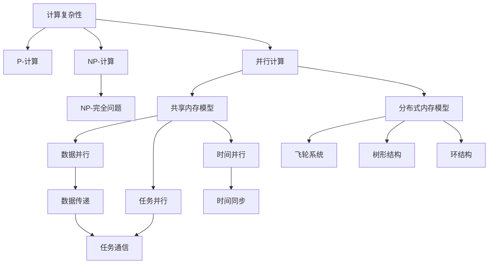

                 

# 计算：第四部分 计算的极限 第 9 章 计算复杂性 并行计算的极限

> 关键词：计算复杂性, 并行计算, 串行计算, P-计算, 并行计算机体系结构, 分布式系统, 高性能计算, 计算模型, 算法优化

## 1. 背景介绍

### 1.1 问题由来

现代计算机体系结构的演变，从单核到多核，再到多机系统，一直是朝着更高吞吐量、更低延迟的方向发展。而现代计算模型也越来越复杂，从经典的冯·诺依曼模型，到分布式系统，再到并行计算模型，呈现出并行化、分布式化的趋势。

这些发展变化引出了一个新的问题：**在什么样的计算模型下，计算机的计算能力是有限的？** 这个问题需要从计算复杂性、并行计算模型、以及分布式系统架构等多个角度去思考，以形成完整的理论框架。

本章节将重点讨论以下几个问题：

1. **计算复杂性理论**：计算复杂性如何定义？有哪些经典的复杂性类别？
2. **并行计算模型**：并行计算与串行计算的区别是什么？如何通过并行计算提升性能？
3. **并行计算机体系结构**：在硬件层面，如何设计并行计算机体系结构？有哪些重要的硬件特性？
4. **分布式系统**：分布式系统在并行计算中扮演什么角色？分布式系统的挑战是什么？
5. **高性能计算**：在实际应用中，如何构建高性能的并行计算环境？

通过这些问题，我们可以了解现代计算机系统的计算能力边界，以及如何高效利用这些计算资源。

### 1.2 问题核心关键点

- **计算复杂性**：计算复杂性理论研究的是计算问题的困难程度。复杂性理论的目的是找出哪些问题是可解的，哪些问题无法在多项式时间内得到解决。
- **并行计算**：并行计算是指将一个大问题分解为多个子问题，通过多个处理器同时计算来提升性能。常见的方法包括数据并行、任务并行、时间并行等。
- **并行计算机体系结构**：并行计算机体系结构研究如何将多个处理器组织起来，使得它们能够高效协作完成计算任务。典型的体系结构包括飞轮系统、树形结构、环结构等。
- **分布式系统**：分布式系统通过多个计算机的合作，共同完成计算任务。它需要处理网络延迟、通信开销等问题。
- **高性能计算**：高性能计算关注如何利用计算机硬件资源，通过优化算法和系统设计，提高计算性能。

## 2. 核心概念与联系

### 2.1 核心概念概述

为了更好地理解本章内容，我们需要先回顾一下以下几个关键概念：

- **计算复杂性**：计算复杂性是衡量算法运行时间相对于输入规模的增长速度。通常分为以下几个类别：

  - **P-计算**：多项式时间内可以解决的问题，如排序、搜索等。
  - **NP-计算**：非多项式时间内可验证的问题，如旅行商问题、图着色问题等。
  - **NP-完全问题**：NP-计算中最难的问题，包括多数P问题。

- **并行计算**：并行计算通过多个处理器同时处理不同的计算任务，从而提升计算效率。常见的并行计算模型包括：

  - **共享内存模型**：多个处理器共享同一块内存，数据可以直接传递。
  - **分布式内存模型**：处理器之间通过网络进行数据交换，可以处理更大规模的数据。

- **并行计算机体系结构**：并行计算机体系结构研究如何将多个处理器组织起来，使得它们能够高效协作完成计算任务。典型的体系结构包括：

  - **飞轮系统**：所有处理器共享同一个内存，数据传递快速，但需要解决数据竞争问题。
  - **树形结构**：处理器之间通过分层的方式进行通信，可以减少通信开销。
  - **环结构**：处理器按照环的形式连接，通信简单，但不够灵活。

- **分布式系统**：分布式系统通过多个计算机的合作，共同完成计算任务。它需要处理网络延迟、通信开销等问题。

### 2.2 核心概念原理和架构的 Mermaid 流程图



这个流程图展示了计算复杂性、并行计算、并行计算机体系结构以及分布式系统的核心概念，并描述了它们之间的联系和区别。

## 3. 核心算法原理 & 具体操作步骤

### 3.1 算法原理概述

本节将重点讨论计算复杂性和并行计算的原理。我们将从两个方面展开：

- **计算复杂性**：计算复杂性是衡量算法运行时间相对于输入规模的增长速度。复杂性理论的目的是找出哪些问题是可解的，哪些问题无法在多项式时间内得到解决。
- **并行计算**：并行计算通过多个处理器同时处理不同的计算任务，从而提升计算效率。常见的方法包括数据并行、任务并行、时间并行等。

### 3.2 算法步骤详解

#### 3.2.1 计算复杂性

- **定义**：计算复杂性是衡量算法运行时间相对于输入规模的增长速度。通常分为以下几个类别：

  - **P-计算**：多项式时间内可以解决的问题，如排序、搜索等。
  - **NP-计算**：非多项式时间内可验证的问题，如旅行商问题、图着色问题等。
  - **NP-完全问题**：NP-计算中最难的问题，包括多数P问题。

- **例子**：排序算法的时间复杂度比较。

  - **冒泡排序**：$O(n^2)$。
  - **快速排序**：$O(nlogn)$。
  - **归并排序**：$O(nlogn)$。

  可以看出，快速排序和归并排序的时间复杂度更低，更适合大规模数据的排序。

#### 3.2.2 并行计算

- **定义**：并行计算是指将一个大问题分解为多个子问题，通过多个处理器同时计算来提升性能。常见的方法包括数据并行、任务并行、时间并行等。

- **步骤**：

  1. **分解任务**：将一个大问题分解为多个子问题。
  2. **分配任务**：将子问题分配到不同的处理器上。
  3. **计算结果**：各处理器计算自己的子问题，并将结果合并。
  4. **合并结果**：将各个处理器的计算结果合并，得到最终结果。

  例如，在矩阵乘法中，可以采用数据并行和任务并行两种方式。

  - **数据并行**：将矩阵分成多个块，每个块分配给一个处理器计算。
  - **任务并行**：将矩阵乘法分解成多个子任务，每个子任务分配给一个处理器计算。

### 3.3 算法优缺点

#### 3.3.1 计算复杂性

- **优点**：

  - **理论基础**：计算复杂性理论为算法设计提供了理论指导，可以帮助我们设计出高效的算法。
  - **应用广泛**：计算复杂性理论可以应用于多个领域，如计算机科学、运筹学、数学等。

- **缺点**：

  - **过于抽象**：计算复杂性理论比较抽象，不容易直接应用到实际问题中。
  - **复杂度较高**：计算复杂性理论的证明过程较为复杂，需要较强的数学和逻辑思维能力。

#### 3.3.2 并行计算

- **优点**：

  - **提升效率**：并行计算通过多个处理器同时处理不同的计算任务，可以显著提升计算效率。
  - **适应性强**：并行计算可以适应不同规模的问题，可以处理大规模数据。

- **缺点**：

  - **设计复杂**：并行计算需要设计复杂的并行算法和并行计算机体系结构。
  - **资源消耗大**：并行计算需要大量的硬件资源，如处理器、内存等，成本较高。

### 3.4 算法应用领域

#### 3.4.1 计算复杂性

- **应用领域**：计算复杂性理论在多个领域都有广泛应用，如算法设计、数据结构、运筹学等。例如，在设计排序算法时，我们需要考虑时间复杂度；在设计分布式系统时，我们需要考虑通信延迟等。

#### 3.4.2 并行计算

- **应用领域**：并行计算在多个领域都有广泛应用，如高性能计算、大数据处理、人工智能等。例如，在人工智能中，深度学习模型需要采用分布式训练才能处理大规模数据。

## 4. 数学模型和公式 & 详细讲解 & 举例说明

### 4.1 数学模型构建

在讨论计算复杂性时，我们通常使用数学模型来描述算法的运行时间。以下是一个经典的数学模型：

设$T(n)$为算法在输入规模为$n$时的运行时间，$O(f(n))$表示算法的时间复杂度，$f(n)$为算法的运行时间函数。例如，快速排序的时间复杂度为$O(nlogn)$，即$T(n)=O(nlogn)$。

### 4.2 公式推导过程

#### 4.2.1 计算复杂性

- **例子**：排序算法的时间复杂度比较。

  - **冒泡排序**：$T(n)=n^2$。
  - **快速排序**：$T(n)=nlogn$。
  - **归并排序**：$T(n)=nlogn$。

  可以看出，快速排序和归并排序的时间复杂度更低，更适合大规模数据的排序。

#### 4.2.2 并行计算

- **例子**：矩阵乘法的时间复杂度。

  - **串行计算**：$T(n)=n^3$。
  - **并行计算**：$T(n)=n^2$。

  可以看出，并行计算可以显著降低时间复杂度。

### 4.3 案例分析与讲解

#### 4.3.1 计算复杂性

- **例子**：旅行商问题的时间复杂度。

  旅行商问题是一个NP-完全问题，无法在多项式时间内得到解决。目前，已知的最好算法时间复杂度为$O(n^2)$，其中$n$为城市数量。

#### 4.3.2 并行计算

- **例子**：分布式计算中的数据并行。

  在分布式计算中，可以将一个大的数据集分成多个块，分配给多个处理器并行计算。例如，在MapReduce模型中，Map和Reduce操作都是并行计算。

## 5. 项目实践：代码实例和详细解释说明

### 5.1 开发环境搭建

在进行并行计算的实践前，我们需要准备好开发环境。以下是使用Python进行NumPy和MPI开发的环境配置流程：

1. 安装Anaconda：从官网下载并安装Anaconda，用于创建独立的Python环境。

2. 创建并激活虚拟环境：
```bash
conda create -n mpi-env python=3.8 
conda activate mpi-env
```

3. 安装NumPy：
```bash
conda install numpy
```

4. 安装MPI库：
```bash
conda install mpi4py
```

5. 安装各类工具包：
```bash
pip install matplotlib scipy tqdm
```

完成上述步骤后，即可在`mpi-env`环境中开始并行计算实践。

### 5.2 源代码详细实现

这里我们以并行矩阵乘法为例，给出使用NumPy和MPI进行并行计算的PyTorch代码实现。

首先，定义矩阵乘法函数：

```python
import numpy as np
from mpi4py import MPI

def matrix_multiply(A, B):
    m = A.shape[0]
    n = B.shape[1]
    C = np.zeros((m, n))
    rank = MPI.COMM_WORLD.Get_rank()
    size = MPI.COMM_WORLD.Get_size()

    if rank == 0:
        C = np.dot(A, B)
    else:
        C = np.zeros((m, n))
        A_row = np.zeros((m, 1))
        B_col = np.zeros((1, n))
        for i in range(0, m, size):
            A_row = A[i:i+size]
            for j in range(0, n, size):
                B_col = B[:, j:j+size]
                C += np.dot(A_row, B_col)

    return C
```

然后，启动多个进程进行矩阵乘法计算：

```python
A = np.random.rand(1000, 1000)
B = np.random.rand(1000, 1000)
nprocs = 8
C = np.empty((1000, 1000))

comm = MPI.COMM_WORLD
rank = comm.Get_rank()
size = comm.Get_size()

for i in range(0, 1000, size):
    A_row = A[i:i+size]
    if rank == 0:
        C[i:i+size] = matrix_multiply(A_row, B)
    else:
        C[i:i+size] = np.zeros((1000, size))

comm.Gather(C, root=0)

if rank == 0:
    print(C)
```

这个例子展示了如何使用MPI进行并行计算。在实际应用中，还需要考虑更多的因素，如进程间的通信、数据分割等。

### 5.3 代码解读与分析

#### 5.3.1 并行计算的原理

- **数据分割**：将输入数据分成多个块，分配给不同的进程并行计算。
- **进程通信**：进程之间通过MPI库进行通信，确保数据同步。
- **数据合并**：将各进程计算的结果合并，得到最终结果。

#### 5.3.2 并行计算的挑战

- **数据分割不均**：数据分割不合理会导致性能下降。
- **通信开销大**：进程之间的通信开销较大，需要优化。
- **同步问题**：进程之间的同步问题需要解决，以避免数据竞争和死锁。

## 6. 实际应用场景

### 6.1 并行计算在科学计算中的应用

#### 6.1.1 并行计算的优势

- **高效性**：并行计算可以显著提升计算效率，适应大规模计算任务。
- **灵活性**：并行计算可以根据任务需求灵活调整计算资源，优化性能。

#### 6.1.2 科学计算中的典型应用

- **天气预测**：采用并行计算进行气候模拟和大气预测。
- **基因分析**：采用并行计算进行基因序列分析和DNA测序。
- **物理学**：采用并行计算进行量子计算和粒子模拟。

### 6.2 并行计算在高性能计算中的应用

#### 6.2.1 高性能计算的优势

- **处理大规模数据**：高性能计算可以处理大规模数据，适用于大数据应用。
- **加速算法**：高性能计算可以加速算法，提高计算性能。

#### 6.2.2 高性能计算中的典型应用

- **金融工程**：采用高性能计算进行风险评估和金融模型预测。
- **生物医药**：采用高性能计算进行蛋白质折叠和药物设计。
- **交通运输**：采用高性能计算进行交通模拟和路线规划。

### 6.3 并行计算在人工智能中的应用

#### 6.3.1 并行计算的优势

- **加速训练**：并行计算可以加速深度学习模型的训练，处理大规模数据。
- **提升性能**：并行计算可以提升计算性能，提高模型效果。

#### 6.3.2 人工智能中的典型应用

- **自然语言处理**：采用并行计算进行大规模文本处理和语义分析。
- **计算机视觉**：采用并行计算进行大规模图像处理和目标检测。
- **机器人学**：采用并行计算进行机器人路径规划和行为决策。

### 6.4 未来应用展望

随着并行计算技术的不断进步，未来的应用场景将更加广泛：

- **量子计算**：量子计算机可以处理并行计算中的多个计算任务，具有巨大的计算潜力。
- **云计算**：云计算提供了强大的并行计算资源，可以支持大规模科学计算和人工智能应用。
- **边缘计算**：边缘计算在物联网中具有重要作用，可以实时处理大规模数据，提升计算性能。

## 7. 工具和资源推荐

### 7.1 学习资源推荐

为了帮助开发者系统掌握并行计算的理论基础和实践技巧，这里推荐一些优质的学习资源：

1. 《计算机科学：算法、软件和应用》：斯坦福大学计算机科学入门课程，涵盖了计算机科学的多个领域，包括并行计算。

2. 《高性能计算导论》：高性能计算领域的经典教材，介绍了高性能计算的理论和实践。

3. 《分布式系统》：麻省理工学院分布式系统课程，涵盖了分布式计算的理论和实践。

4. 《NVIDIA CUDA编程指南》：NVIDIA CUDA编程指南，介绍了如何使用GPU进行并行计算。

5. 《Python科学计算》：Python科学计算的入门教材，介绍了NumPy、SciPy、Scikit-learn等科学计算库的使用。

通过对这些资源的学习实践，相信你一定能够快速掌握并行计算的理论基础和实践技巧，并用于解决实际的计算问题。

### 7.2 开发工具推荐

高效的并行计算开发离不开优秀的工具支持。以下是几款用于并行计算开发的常用工具：

1. NumPy：Python的科学计算库，提供了高效的数值计算和数组操作功能。

2. MPI：消息传递接口，用于实现分布式计算。

3. OpenMPI：开源的MPI实现，支持多种操作系统和编程语言。

4. CUDA：NVIDIA的GPU编程模型，支持高性能的并行计算。

5. Python科学计算库：如SciPy、Scikit-learn、TensorFlow等，提供了丰富的科学计算和机器学习功能。

合理利用这些工具，可以显著提升并行计算的开发效率，加快创新迭代的步伐。

### 7.3 相关论文推荐

并行计算和分布式计算的研究源于学界的持续研究。以下是几篇奠基性的相关论文，推荐阅读：

1. Paxos：一种分布式共识算法，解决了分布式系统中的一致性问题。

2. MapReduce：一种基于数据流的分布式计算模型，广泛应用于大规模数据处理。

3. SIMD指令集：一种用于并行计算的指令集，提高了并行计算的效率。

4. GPU计算：使用GPU进行并行计算的技术，显著提升了计算性能。

5. MPI并行编程模型：用于分布式计算的MPI编程模型，支持大规模并行计算。

这些论文代表了大规模并行计算的研究脉络。通过学习这些前沿成果，可以帮助研究者把握学科前进方向，激发更多的创新灵感。

## 8. 总结：未来发展趋势与挑战

### 8.1 总结

本文对并行计算的理论基础和实践技巧进行了全面系统的介绍。首先阐述了并行计算在科学计算、高性能计算和人工智能中的应用，明确了并行计算的优势和挑战。其次，从并行计算模型、并行计算机体系结构、分布式系统等多个角度，深入探讨了并行计算的核心概念和关键技术。最后，结合实际应用案例，展示了并行计算的广泛应用前景。

通过本文的系统梳理，可以看到，并行计算是现代计算模型中不可或缺的重要组成部分。它通过多个处理器并行处理计算任务，显著提升了计算效率和计算能力。随着并行计算技术的不断发展，未来的计算能力将得到进一步提升，人类将进入全新的计算时代。

### 8.2 未来发展趋势

展望未来，并行计算技术将呈现以下几个发展趋势：

1. **量子计算**：量子计算机可以处理并行计算中的多个计算任务，具有巨大的计算潜力。
2. **云计算**：云计算提供了强大的并行计算资源，可以支持大规模科学计算和人工智能应用。
3. **边缘计算**：边缘计算在物联网中具有重要作用，可以实时处理大规模数据，提升计算性能。
4. **人工智能**：人工智能和并行计算的结合，将进一步推动深度学习、计算机视觉等领域的发展。
5. **分布式系统**：分布式系统将进一步发展，支持更大规模的并行计算。

以上趋势凸显了并行计算技术的广阔前景。这些方向的探索发展，必将进一步提升计算能力，推动科学研究、工业应用和社会进步。

### 8.3 面临的挑战

尽管并行计算技术已经取得了巨大的成功，但在迈向更加智能化、普适化应用的过程中，它仍面临诸多挑战：

1. **数据分割不均**：数据分割不合理会导致性能下降，需要优化数据分割策略。
2. **通信开销大**：进程之间的通信开销较大，需要优化通信协议和通信策略。
3. **同步问题**：进程之间的同步问题需要解决，以避免数据竞争和死锁。
4. **资源管理**：并行计算需要管理大量的计算资源，需要高效的资源管理和调度策略。
5. **算法设计**：并行算法的设计需要考虑多个因素，如负载均衡、数据共享等。

### 8.4 研究展望

面对并行计算面临的这些挑战，未来的研究需要在以下几个方面寻求新的突破：

1. **数据分割策略**：优化数据分割策略，提高数据分割的合理性和效率。
2. **通信优化**：优化通信协议和通信策略，降低通信开销。
3. **同步机制**：设计高效的同步机制，避免数据竞争和死锁。
4. **资源管理**：设计高效的资源管理和调度策略，提高资源利用率。
5. **算法设计**：设计高效的并行算法，提高并行计算的效率和性能。

这些研究方向的探索，必将推动并行计算技术的发展，为科学研究、工业应用和社会进步提供更强大的计算能力。

## 9. 附录：常见问题与解答

**Q1：并行计算与串行计算的区别是什么？**

A: 并行计算和串行计算的主要区别在于处理方式。串行计算一次处理一个数据单元，而并行计算同时处理多个数据单元。

**Q2：并行计算有哪些优缺点？**

A: 并行计算的优点是能够提高计算效率，适应大规模计算任务。缺点是需要设计复杂的并行算法和并行计算机体系结构，资源消耗较大。

**Q3：如何优化并行计算中的通信开销？**

A: 优化并行计算中的通信开销需要考虑多个因素，如数据分割策略、通信协议等。可以通过优化数据分割策略、设计高效的通信协议和通信策略等方式来降低通信开销。

**Q4：如何设计高效的并行算法？**

A: 设计高效的并行算法需要考虑多个因素，如负载均衡、数据共享等。可以通过设计合理的任务分配策略、优化数据共享方式、引入并行化算法等方式来提高并行算法的效率。

**Q5：如何应对并行计算中的数据竞争问题？**

A: 应对并行计算中的数据竞争问题需要设计高效的同步机制，避免数据竞争和死锁。可以通过使用锁、使用分布式事务、使用分布式共享内存等方式来提高数据竞争处理的效率。

---

作者：禅与计算机程序设计艺术 / Zen and the Art of Computer Programming

