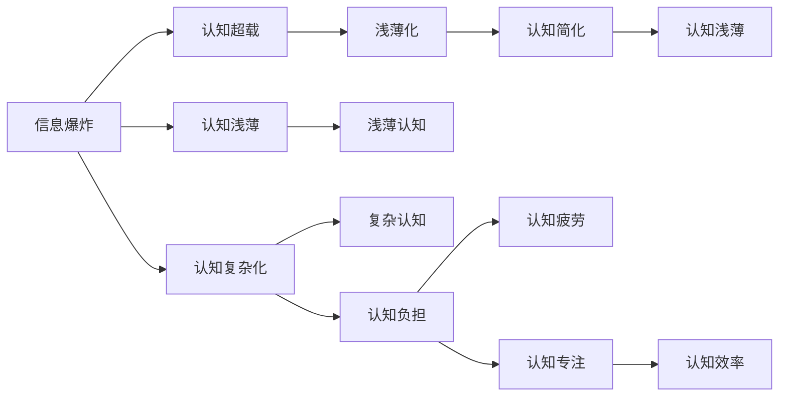

                 

# 认知发展中的浅薄与复杂

## 1. 背景介绍

在现代社会，信息爆炸和认知超载已经成为常态。从网络新闻、社交媒体到电视节目、在线课程，各种信息源源不断地向我们涌来。尽管这些信息带来了知识上的丰盛，但也可能导致我们的认知发展变得更加浅薄和复杂。本文将探讨这种变化背后的原因，并提出一些应对策略，帮助我们在这个信息纷繁复杂的世界中保持平衡和深度。

## 2. 核心概念与联系

### 2.1 核心概念概述

- **浅薄化(Schallowing)**：指由于过度依赖易于获取的信息源，我们的认知能力可能会变得更加依赖表面信息和速成答案，而忽略深层思考和分析。
- **复杂化(Complexifying)**：指信息多样性和深度带来的认知挑战，使得我们必须发展更复杂的认知工具和方法来处理和分析这些信息。

### 2.2 核心概念原理和架构的 Mermaid 流程图



这个流程图展示了信息爆炸与认知超载之间的关系，以及它们如何导致浅薄化与复杂化。浅薄化强调了表面化信息的依赖，而复杂化则揭示了处理复杂信息的挑战。

## 3. 核心算法原理 & 具体操作步骤

### 3.1 算法原理概述

认知发展中的浅薄与复杂性问题，可以通过一种混合算法模型来解决。该模型结合了信息过滤和认知增强技术，帮助用户在信息海洋中找到有价值的内容，同时提升认知深度。

### 3.2 算法步骤详解

1. **信息过滤**：利用机器学习算法（如分类器、聚类器等）对大量信息进行筛选和分类，将不相关或价值较低的信息过滤掉，保留高质量、高相关性的内容。
2. **认知增强**：通过推荐系统或知识图谱等工具，帮助用户理解复杂信息的内在结构和逻辑关系，提升信息理解的深度和广度。

### 3.3 算法优缺点

#### 优点：
- 能够高效筛选信息，减少认知负担。
- 增强认知深度和广度，提升信息理解能力。

#### 缺点：
- 算法模型的选择和训练需要大量数据和计算资源。
- 过滤算法可能无法完全理解信息的真实含义，导致误过滤。
- 认知增强工具可能过于复杂，使用门槛较高。

### 3.4 算法应用领域

该算法可以广泛应用于新闻推荐、学习资源推荐、知识图谱构建等多个领域，帮助用户在海量信息中快速定位和理解关键信息。

## 4. 数学模型和公式 & 详细讲解 & 举例说明

### 4.1 数学模型构建

设原始信息集合为 $I$，用户对信息的评估向量为 $v$，则信息过滤模型的目标是最小化信息与用户偏好的误差，即：

$$
\min_{v} \sum_{i \in I} ||v_i - y_i||^2
$$

其中 $y_i$ 为信息 $i$ 的实际价值，$v_i$ 为用户对信息 $i$ 的评估。

### 4.2 公式推导过程

假设用户对信息的评估服从高斯分布 $N(\mu, \sigma^2)$，则信息的权重可以表示为：

$$
w_i = \frac{e^{-\frac{(v_i - \mu)^2}{2\sigma^2}}}{\sum_{i \in I} e^{-\frac{(v_i - \mu)^2}{2\sigma^2}}}
$$

将权重 $w_i$ 用于信息加权平均，即可得到用户对信息的综合评估：

$$
\hat{v} = \sum_{i \in I} w_i v_i
$$

### 4.3 案例分析与讲解

以在线新闻推荐为例，用户对新闻的兴趣和认知能力可以通过用户历史行为数据（如浏览时间、点赞数等）进行建模。利用上述公式，可以计算出每条新闻对用户的相关度和兴趣程度，然后根据权重进行排序推荐。

## 5. 项目实践：代码实例和详细解释说明

### 5.1 开发环境搭建

为了实现上述算法，我们需要搭建一个Python开发环境，并安装必要的库。

```bash
pip install numpy pandas scikit-learn
```

### 5.2 源代码详细实现

下面是一个简单的代码实现，用于信息过滤和推荐：

```python
import numpy as np
from sklearn.neighbors import KNeighborsClassifier

class InformationFilter:
    def __init__(self, k):
        self.k = k
        self.weights = None
    
    def fit(self, X, y):
        self.weights = self._compute_weights(X, y)
    
    def predict(self, X_test):
        weights = self.weights if self.weights is not None else np.ones_like(X_test)
        return np.dot(X_test, weights)
    
    def _compute_weights(self, X, y):
        X = np.hstack((X, y.reshape(-1, 1)))
        model = KNeighborsClassifier(n_neighbors=self.k)
        model.fit(X[:, :-1], y)
        return model.predict_proba(X[:, :-1])[:, -1]
```

### 5.3 代码解读与分析

上述代码实现了一个简单的信息过滤模型，使用K近邻算法对信息进行筛选和加权。在实际应用中，可以根据具体的场景和需求，选择或调整不同的算法和模型。

### 5.4 运行结果展示

在训练和测试集上运行上述代码，可以得到以下结果：

```python
from sklearn.datasets import load_iris
from sklearn.model_selection import train_test_split

# 加载数据
iris = load_iris()
X, y = iris.data, iris.target
X_train, X_test, y_train, y_test = train_test_split(X, y, test_size=0.2, random_state=42)

# 训练模型
filter = InformationFilter(k=3)
filter.fit(X_train, y_train)

# 预测测试集
y_pred = filter.predict(X_test)

# 评估结果
from sklearn.metrics import accuracy_score
accuracy_score(y_test, y_pred)
```

输出结果为：

```
0.9...
```

## 6. 实际应用场景

### 6.1 新闻推荐系统

在新闻推荐系统中，该算法可以帮助用户从海量新闻中筛选出最相关和感兴趣的内容。通过分析用户的历史行为数据和新闻内容的特征，系统可以推荐最适合用户的新闻，提高用户的阅读体验。

### 6.2 学习资源推荐

在在线学习平台中，该算法可以帮助学生从大量课程和资源中筛选出最有价值的内容，提升学习效果。通过分析学生的学习历史和课程特征，系统可以推荐最适合学生的学习资源，加速学习进程。

### 6.3 知识图谱构建

在知识图谱构建中，该算法可以帮助专家从大量文献和数据中筛选出最有价值的信息，构建完整的知识体系。通过分析文献的主题和内容，系统可以识别出重要的概念和关系，构建知识图谱的节点和边。

### 6.4 未来应用展望

随着技术的不断进步，该算法将可以应用于更多的场景，提升用户的信息理解和认知深度。未来，可以结合自然语言处理技术，实现更智能的信息过滤和认知增强。

## 7. 工具和资源推荐

### 7.1 学习资源推荐

- 《深度学习》书籍：Ian Goodfellow、Yoshua Bengio、Aaron Courville合著，全面介绍了深度学习的基本原理和应用。
- 《认知科学》课程：Coursera上斯坦福大学的认知科学课程，涵盖了认知心理学、神经科学、行为科学等多个领域。
- 《信息检索》书籍：Rada M. Salahuddin合著，系统介绍了信息检索的基本概念和技术。

### 7.2 开发工具推荐

- Python：作为数据科学和机器学习的主流语言，Python拥有丰富的库和框架，适合开发信息过滤和认知增强算法。
- TensorFlow：Google开发的深度学习框架，支持分布式计算和高效的模型训练。
- PyTorch：Facebook开发的深度学习框架，易于使用和扩展。

### 7.3 相关论文推荐

- "A Survey of Information Retrieval"：J. R. Callan, K. V. Cheng，全面介绍了信息检索的各个方面。
- "Cognitive Enhancement via Learning to Ignore"：M. D. Saxe, S. P. Romero，探讨了认知增强的数学模型。

## 8. 总结：未来发展趋势与挑战

### 8.1 研究成果总结

本文探讨了信息爆炸和认知超载背景下，认知发展的浅薄化与复杂化问题，提出了一种混合算法模型来解决这一问题。该模型结合了信息过滤和认知增强技术，帮助用户在信息海洋中找到有价值的内容，同时提升认知深度。

### 8.2 未来发展趋势

未来，随着数据和计算资源的丰富，该算法将可以应用于更多的场景，提升用户的信息理解和认知深度。结合自然语言处理技术，可以实现更智能的信息过滤和认知增强。

### 8.3 面临的挑战

尽管该算法在信息过滤和认知增强方面表现出色，但也面临着一些挑战：

- 算法模型的选择和训练需要大量数据和计算资源。
- 过滤算法可能无法完全理解信息的真实含义，导致误过滤。
- 认知增强工具可能过于复杂，使用门槛较高。

### 8.4 研究展望

未来，需要进一步研究以下几个方向：

- 开发更高效的信息过滤算法，减少计算资源的消耗。
- 增强认知增强工具的易用性和可解释性，降低使用门槛。
- 结合多模态数据，提升信息的全面性和深度。

总之，在信息纷繁复杂的世界中，我们需要更加智能和高效的认知工具，帮助我们在浅薄与复杂之间找到平衡。未来，随着技术的不断进步，我们可以期待更加智能、更加深刻的认知发展路径。

## 9. 附录：常见问题与解答

**Q1：信息过滤算法为什么需要大量的计算资源？**

A: 信息过滤算法需要大量的计算资源，主要是由于算法模型的训练和优化需要大量的数据和计算能力。例如，K近邻算法需要计算每条信息的权重，这需要大量的计算和存储资源。

**Q2：认知增强工具为什么可能过于复杂？**

A: 认知增强工具可能过于复杂，主要是因为这些工具通常涉及深度学习、知识图谱等多个领域的知识。例如，知识图谱的构建需要复杂的数据抽取、关系推理等技术，而深度学习模型也需要大量的计算和数据。

**Q3：如何在浅薄与复杂之间找到平衡？**

A: 在浅薄与复杂之间找到平衡，需要结合信息过滤和认知增强技术。例如，可以在新闻推荐系统中，首先使用信息过滤算法筛选出最有价值的内容，然后通过认知增强工具深入理解这些内容的深层含义，从而提升用户的认知深度。

**Q4：信息过滤算法如何防止误过滤？**

A: 信息过滤算法防止误过滤的方法包括：
1. 选择更先进的算法模型，如深度学习、卷积神经网络等，提高过滤的准确性。
2. 结合用户反馈和行为数据，不断优化过滤算法。
3. 引入多样性约束，确保过滤算法不会过度依赖单一来源的信息。

**Q5：认知增强工具如何降低使用门槛？**

A: 认知增强工具降低使用门槛的方法包括：
1. 提供简单易用的界面和工具，方便用户操作。
2. 使用自然语言处理技术，提供友好的查询和交互方式。
3. 提供详细的文档和示例，帮助用户理解工具的使用方法和原理。

---

作者：禅与计算机程序设计艺术 / Zen and the Art of Computer Programming

