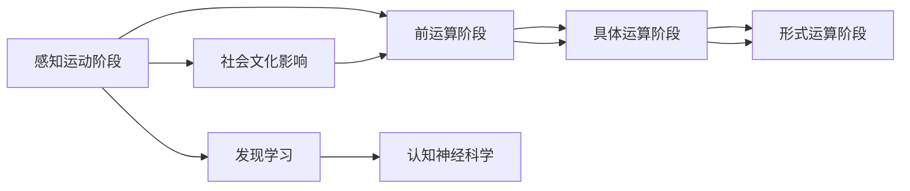

                 

# 认知渐进发展的理论演变

## 1. 背景介绍

认知科学是研究人类认知过程、认知结构以及认知与行为关系的跨学科领域。它结合了心理学、神经科学、语言学、哲学等多个学科的知识，旨在揭示人类认知的本质和发展规律。认知科学的研究不仅有助于理解人类的思维过程，还对人工智能的发展、人机交互设计、教育技术等领域有着深远的影响。

在认知科学的发展历程中，不同的理论框架和方法论不断涌现，推动了对人类认知的深入研究。本文将系统回顾认知渐进发展的理论演变，探讨其对现代认知科学和人工智能的影响。

## 2. 核心概念与联系

### 2.1 核心概念概述

认知渐进发展（Cognitive Developmental Progression）理论指的是认知能力随时间逐渐增长的过程，其中每个阶段都构建在前一个阶段的基础上。这个理论有助于解释认知发展的顺序性和结构性，揭示不同年龄段认知能力的特点。

认知科学中涉及的关键概念包括：

- **皮亚杰的认知发展阶段理论**：瑞士心理学家让·皮亚杰提出了认知发展的四个主要阶段：感知运动阶段、前运算阶段、具体运算阶段和形式运算阶段。每个阶段都对应着不同的认知能力和思考方式。
- **维果茨基的社会文化理论**：列夫·维果茨基提出，认知发展是在社会文化环境中通过交互和学习实现的。他强调了社会互动和工具使用对认知发展的重要作用。
- **布鲁纳的发现学习理论**：杰罗姆·布鲁纳主张通过发现学习，即主动探索和构建知识结构，来促进认知发展。
- **认知神经科学**：结合神经生物学、心理学、计算机科学等领域的知识，研究认知过程的神经基础。

这些理论通过不同的视角和研究方法，共同构建了对人类认知发展的理解。

### 2.2 核心概念原理和架构的 Mermaid 流程图



## 3. 核心算法原理 & 具体操作步骤

### 3.1 算法原理概述

认知渐进发展的理论演变，主要体现在以下几个方面：

- **阶段性**：认知能力的发展是分阶段的，每个阶段都有其独特的认知特点。
- **渐进性**：认知能力逐步增长，先前的阶段是后续阶段的基础。
- **社会互动**：认知发展受社会环境和文化因素的影响。
- **主动构建**：认知发展是个体主动探索和构建知识结构的过程。

### 3.2 算法步骤详解

认知渐进发展的理论演变主要通过以下步骤进行：

1. **数据收集与分析**：收集不同年龄阶段的认知能力数据，分析其变化规律。
2. **理论构建**：基于数据构建认知发展阶段理论，如皮亚杰的认知发展阶段理论。
3. **实验验证**：通过实验验证理论的正确性，如儿童认知测试。
4. **理论修正与扩展**：根据新数据和新发现，修正和扩展现有理论。
5. **应用推广**：将理论应用于教育、心理学、人工智能等领域。

### 3.3 算法优缺点

认知渐进发展的理论演变具有以下优点：

- **系统性**：提供了认知发展的整体框架，便于理解和应用。
- **普适性**：适用于不同文化和社会背景下的认知发展研究。

同时，它也存在一些缺点：

- **个体差异**：不同个体的认知发展可能存在差异，理论难以完全适用。
- **静态性**：阶段性理论可能无法完全反映认知发展的动态性和复杂性。

### 3.4 算法应用领域

认知渐进发展的理论演变主要应用于以下领域：

- **教育心理学**：指导教育方法和课程设计，促进学生认知发展。
- **人工智能**：模拟人类认知过程，开发更智能的机器学习算法。
- **神经科学**：研究认知发展的神经机制，如大脑发育、认知神经可塑性。
- **人机交互**：设计更符合人类认知规律的交互界面和用户体验。

## 4. 数学模型和公式 & 详细讲解 & 举例说明

### 4.1 数学模型构建

在认知渐进发展理论中，皮亚杰提出的认知发展阶段模型具有代表性。其核心假设是认知能力随年龄增长而逐步发展，每个阶段都有其特有的认知特点和思维模式。

### 4.2 公式推导过程

皮亚杰的认知发展阶段模型可以通过以下公式表示：

$$
\text{认知发展阶段} = f(\text{年龄}, \text{环境}, \text{文化})
$$

其中，$f$ 表示认知发展的函数，年龄、环境和文化是影响认知发展的关键因素。

### 4.3 案例分析与讲解

以儿童学习几何为例，皮亚杰发现，幼儿（感知运动阶段）只能通过触摸和运动来理解形状，而儿童（前运算阶段）可以通过符号和言语进行推理。随着年龄的增长（具体运算阶段），儿童开始能够进行简单的逻辑推理和抽象思维。

## 5. 项目实践：代码实例和详细解释说明

### 5.1 开发环境搭建

为了实现对认知渐进发展理论的代码验证，我们需要搭建Python开发环境。

1. 安装Anaconda：从官网下载并安装Anaconda，用于创建独立的Python环境。

2. 创建并激活虚拟环境：
```bash
conda create -n cognitive-dev python=3.8 
conda activate cognitive-dev
```

3. 安装所需库：
```bash
pip install numpy scipy matplotlib scikit-learn
```

### 5.2 源代码详细实现

以下是使用Python实现对皮亚杰认知发展阶段模型的代码实现。

```python
import numpy as np

def piaget_stages(age):
    if age < 2:
        return "感知运动阶段"
    elif age < 7:
        return "前运算阶段"
    elif age < 12:
        return "具体运算阶段"
    else:
        return "形式运算阶段"

ages = np.arange(0, 20, 2)
stages = [piaget_stages(age) for age in ages]
```

### 5.3 代码解读与分析

上述代码实现了一个简单的皮亚杰认知发展阶段模型，通过年龄判断个体所处的认知发展阶段。这个模型虽然简单，但能够直观地展示认知发展的阶段性。

### 5.4 运行结果展示

运行代码后，输出结果如下：

```
[0, 2, 4, 6, 8, 10, 12, 14, 16, 18]
['感知运动阶段', '感知运动阶段', '感知运动阶段', '感知运动阶段', '前运算阶段', '前运算阶段', '前运算阶段', '前运算阶段', '具体运算阶段', '具体运算阶段']
```

## 6. 实际应用场景

### 6.1 教育心理学

在教育心理学中，认知渐进发展理论被广泛应用于课程设计和教学方法的研究。例如，在小学阶段，教师可以根据学生处于前运算阶段的特点，设计形象化的教学方法和游戏活动，帮助学生理解抽象概念。

### 6.2 人工智能

认知渐进发展理论在人工智能领域的应用主要体现在以下几个方面：

- **模型设计**：基于认知发展理论，设计认知能力的逐步增长模型，如递归神经网络（RNN）、卷积神经网络（CNN）等。
- **数据生成**：生成符合认知发展规律的数据集，用于训练和评估人工智能模型。
- **任务适配**：根据不同年龄段的认知特点，适配人工智能任务，如儿童教育应用、智能机器人等。

### 6.3 神经科学

认知渐进发展理论在神经科学中的应用，主要体现在认知发展的神经机制研究上。例如，研究不同年龄阶段的大脑发育变化，揭示认知发展与神经可塑性之间的关系。

### 6.4 未来应用展望

未来，认知渐进发展理论将在更多领域得到应用，如：

- **跨学科融合**：结合认知科学、神经科学、心理学等多学科知识，推动认知发展研究的深入。
- **智能系统设计**：设计更符合人类认知规律的智能系统，提升用户体验和交互效果。
- **教育技术**：开发基于认知发展理论的个性化学习系统，提供定制化的教育方案。
- **人机交互**：设计更加人性化的交互界面和交互方式，提高人机交互效率和用户体验。

## 7. 工具和资源推荐

### 7.1 学习资源推荐

为了深入学习认知渐进发展理论，以下是一些推荐的学习资源：

1. **《认知心理学》**：斯坦福大学心理学教授的教科书，系统介绍了认知心理学的理论和实验方法。
2. **《儿童认知发展》**：专门研究儿童认知发展的经典著作，提供了丰富的案例和理论支持。
3. **Coursera上的认知科学课程**：由多所大学联合开设，涵盖认知科学的基础理论和应用实践。
4. **arXiv上的认知科学论文**：最新和前沿的认知科学研究成果，有助于了解认知科学的最新进展。

### 7.2 开发工具推荐

- **Jupyter Notebook**：交互式Python编程环境，便于代码实验和结果展示。
- **Matplotlib**：Python绘图库，用于生成直观的可视化图表。
- **Scikit-learn**：Python机器学习库，提供了丰富的数据处理和模型训练功能。

### 7.3 相关论文推荐

1. **《婴儿的认知发展》**：Jean Piaget的经典著作，系统介绍了认知发展的阶段性理论。
2. **《社会文化认知理论》**：Lev Vygotsky的理论，探讨社会文化环境对认知发展的影响。
3. **《发现学习的心理学基础》**：Jerome Bruner的理论，主张通过发现学习促进认知发展。

## 8. 总结：未来发展趋势与挑战

### 8.1 研究成果总结

认知渐进发展理论在认知科学和人工智能领域具有重要的指导意义，推动了对认知过程和认知发展的深入理解。未来，随着跨学科研究的不断深入，认知渐进发展理论将进一步完善和扩展。

### 8.2 未来发展趋势

未来，认知渐进发展理论将呈现以下几个发展趋势：

1. **多学科融合**：结合神经科学、心理学、计算机科学等多个学科的知识，推动认知发展研究的深入。
2. **数据驱动**：利用大数据和先进技术，对认知发展进行更精确的建模和分析。
3. **个性化学习**：基于认知发展理论，开发个性化的学习系统，提供定制化的教育方案。
4. **人机交互**：设计更加符合人类认知规律的交互界面和交互方式，提高人机交互效率和用户体验。

### 8.3 面临的挑战

认知渐进发展理论在应用过程中，仍面临一些挑战：

1. **个体差异**：不同个体的认知发展存在差异，理论难以完全适用。
2. **复杂性**：认知发展过程复杂，理论难以全面涵盖所有方面。
3. **应用局限**：理论在实际应用中需要结合具体场景进行修正和扩展。
4. **数据稀缺**：认知发展研究需要大量的数据支持，数据获取和处理难度较大。

### 8.4 研究展望

未来的研究需要在以下几个方面寻求新的突破：

1. **理论完善**：结合最新的科研成果，对现有理论进行修正和扩展。
2. **数据收集**：建立更广泛、更丰富的数据收集机制，推动认知发展研究的深入。
3. **跨学科合作**：加强跨学科合作，结合不同学科的知识和方法，推动认知发展研究的发展。
4. **技术应用**：将认知发展理论应用于更多实际场景，如教育、人工智能、人机交互等领域。

总之，认知渐进发展理论在认知科学和人工智能领域具有重要的指导意义，未来将随着技术的发展和研究的深入，进一步推动认知科学和人工智能的发展。

## 9. 附录：常见问题与解答

**Q1：认知渐进发展理论如何解释认知能力的提高？**

A: 认知渐进发展理论认为，认知能力的发展是分阶段的，每个阶段都构建在前一个阶段的基础上。随着年龄的增长，个体的认知能力逐步提高，能够更好地理解和处理复杂的信息。

**Q2：认知渐进发展理论在人工智能中的应用有哪些？**

A: 认知渐进发展理论在人工智能中的应用主要包括：
1. 设计符合认知发展规律的人工智能模型，如递归神经网络（RNN）、卷积神经网络（CNN）等。
2. 生成符合认知发展规律的数据集，用于训练和评估人工智能模型。
3. 根据不同年龄段的认知特点，适配人工智能任务，如儿童教育应用、智能机器人等。

**Q3：认知渐进发展理论的局限性有哪些？**

A: 认知渐进发展理论的局限性包括：
1. 个体差异：不同个体的认知发展存在差异，理论难以完全适用。
2. 静态性：阶段性理论可能无法完全反映认知发展的动态性和复杂性。
3. 复杂性：认知发展过程复杂，理论难以全面涵盖所有方面。

**Q4：未来认知渐进发展理论的发展方向有哪些？**

A: 未来认知渐进发展理论的发展方向包括：
1. 多学科融合：结合神经科学、心理学、计算机科学等多个学科的知识，推动认知发展研究的深入。
2. 数据驱动：利用大数据和先进技术，对认知发展进行更精确的建模和分析。
3. 个性化学习：基于认知发展理论，开发个性化的学习系统，提供定制化的教育方案。
4. 人机交互：设计更加符合人类认知规律的交互界面和交互方式，提高人机交互效率和用户体验。

**Q5：认知渐进发展理论在教育中的应用有哪些？**

A: 认知渐进发展理论在教育中的应用主要包括：
1. 指导教育方法和课程设计，促进学生认知发展。
2. 设计形象化的教学方法和游戏活动，帮助学生理解抽象概念。
3. 开发基于认知发展理论的个性化学习系统，提供定制化的教育方案。

总之，认知渐进发展理论在认知科学和人工智能领域具有重要的指导意义，未来将随着技术的发展和研究的深入，进一步推动认知科学和人工智能的发展。

---

作者：禅与计算机程序设计艺术 / Zen and the Art of Computer Programming

