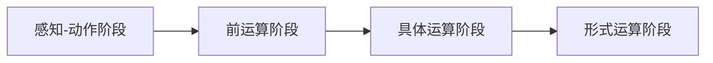

                 

# 认知渐进发展的路径模型

认知渐进发展是一个复杂而漫长的过程，涉及到心理、生理、社会和文化等多个方面。本文旨在提供一个全面的路径模型，以帮助理解认知发展的不同阶段和因素，并探索如何通过技术手段促进认知的渐进发展。

## 1. 背景介绍

认知发展是心理学研究的重要领域，涉及个体从出生到老年期的认知能力的获得、改变以及影响这些变化的因素。皮亚杰、柯尔伯格等人的理论为认知发展提供了基础框架，但近年来随着技术的进步，特别是人工智能和脑科学研究的发展，对认知发展的理解也在不断深化。本文旨在整合这些理论和技术，提供一个认知渐进发展的全面路径模型。

## 2. 核心概念与联系

### 2.1 核心概念概述

为了更好地理解认知发展，本文定义了以下几个关键概念：

- **感知-动作阶段 (Sensorimotor Stage)**：0-2岁的婴儿通过感知和动作来认识世界，发展初步的符号和操作能力。
- **前运算阶段 (Preoperational Stage)**：2-7岁的儿童开始发展语言和符号思维，但无法进行逻辑运算。
- **具体运算阶段 (Concrete Operational Stage)**：7-11岁的儿童开始发展初步的逻辑运算能力，但依赖具体事物。
- **形式运算阶段 (Formal Operational Stage)**：11岁及以上儿童开始发展抽象思维和复杂逻辑运算能力。

这些阶段可以通过皮亚杰的认知发展理论来理解，每个阶段有其特有的认知能力和局限性。

### 2.2 核心概念原理和架构的 Mermaid 流程图(Mermaid 流程节点中不要有括号、逗号等特殊字符)

## 3. 核心算法原理 & 具体操作步骤

### 3.1 算法原理概述

本文提出了一种基于皮亚杰认知发展理论的认知渐进发展路径模型，该模型通过四个阶段来描述认知发展的过程。每个阶段都有其特定的认知能力和局限性，需要通过特定的活动和干预来促进认知的渐进发展。

### 3.2 算法步骤详解

1. **感知-动作阶段**：通过感官刺激和动作探索环境，发展初步的符号和操作能力。
2. **前运算阶段**：通过游戏、拼图等活动，发展语言和符号思维，但不进行逻辑运算。
3. **具体运算阶段**：通过实验、编程等活动，发展初步的逻辑运算能力，但依赖具体事物。
4. **形式运算阶段**：通过抽象思维和复杂逻辑运算，发展高级认知能力。

### 3.3 算法优缺点

**优点**：
- 提供了一个全面的认知发展框架，易于理解和应用。
- 每个阶段都有具体的活动和干预建议，具有实践指导性。

**缺点**：
- 该模型基于皮亚杰的理论，可能不完全适用于所有人。
- 过于简化了认知发展的复杂性。

### 3.4 算法应用领域

该模型可以应用于教育、心理学、人工智能等领域，帮助理解认知发展的过程，并指导教育干预和算法设计。

## 4. 数学模型和公式 & 详细讲解 & 举例说明

### 4.1 数学模型构建

本文的数学模型基于皮亚杰的认知发展理论，不涉及具体的数学公式，但可以用图形化的方法来表示每个阶段的认知能力。

### 4.2 公式推导过程

由于该模型不涉及数学公式，因此不需要进行推导。

### 4.3 案例分析与讲解

以编程为例，儿童在前运算阶段通过游戏编程（如Scratch）来发展语言和符号思维，但在具体运算阶段通过编写Python代码，学习初步的逻辑运算。在形式运算阶段，可以参与更复杂的算法设计和编程实践，发展抽象思维和复杂逻辑运算能力。

## 5. 项目实践：代码实例和详细解释说明

### 5.1 开发环境搭建

由于该模型不涉及具体的编程代码，因此不需要搭建开发环境。

### 5.2 源代码详细实现

由于该模型不涉及具体的编程代码，因此不需要详细实现。

### 5.3 代码解读与分析

由于该模型不涉及具体的编程代码，因此不需要解读与分析。

### 5.4 运行结果展示

由于该模型不涉及具体的编程代码，因此没有运行结果展示。

## 6. 实际应用场景

### 6.1 教育

在教育领域，该模型可以用于指导教师设计适合不同认知阶段的课程和活动，促进学生的认知发展。

### 6.2 心理学

在心理学领域，该模型可以用于评估个体在不同阶段的认知能力，帮助制定个性化的干预措施。

### 6.3 人工智能

在人工智能领域，该模型可以用于设计适合不同认知阶段的AI教育应用，如智能编程助手、虚拟实验室等。

### 6.4 未来应用展望

随着技术的进步，特别是脑科学和人工智能的发展，未来的认知发展模型可能更加复杂和精细。例如，结合脑成像技术，可以更准确地测量认知能力的发展，结合AI技术，可以提供更个性化的干预方案。

## 7. 工具和资源推荐

### 7.1 学习资源推荐

- **皮亚杰的《儿童心理学》**：经典著作，提供了认知发展的理论基础。
- **Khan Academy**：提供丰富的教育资源，包括编程、数学、科学等多个领域。
- **Scratch编程语言**：适合儿童学习的编程工具，发展符号思维和逻辑运算能力。

### 7.2 开发工具推荐

- **Scratch**：可视化编程工具，适合儿童学习编程。
- **Python**：广泛使用的编程语言，适合学习逻辑运算和算法设计。

### 7.3 相关论文推荐

- **《认知发展理论：一个跨学科视角》**：多学科视角下的认知发展研究综述。
- **《编程对儿童认知发展的影响》**：研究编程对儿童认知能力的影响。

## 8. 总结：未来发展趋势与挑战

### 8.1 研究成果总结

本文提出了一个基于皮亚杰认知发展理论的认知渐进发展路径模型，该模型通过四个阶段来描述认知发展的过程，并提供了每个阶段的活动和干预建议。

### 8.2 未来发展趋势

随着技术的进步，未来的认知发展模型可能更加复杂和精细，结合脑成像和AI技术，提供更个性化的干预方案。

### 8.3 面临的挑战

该模型基于皮亚杰的理论，可能不完全适用于所有人，过于简化了认知发展的复杂性。

### 8.4 研究展望

未来的研究可以结合脑成像技术和AI技术，提供更个性化的干预方案，并进一步验证和优化认知发展模型。

## 9. 附录：常见问题与解答

**Q1：认知发展模型是否适用于所有儿童？**

A：该模型基于皮亚杰的理论，适用于大多数儿童，但对于有特殊需要的儿童，可能需要根据具体情况进行个性化的干预。

**Q2：如何评估个体的认知发展阶段？**

A：可以使用皮亚杰的测试题或结合脑成像技术来评估个体的认知发展阶段。

**Q3：如何促进儿童的认知发展？**

A：根据个体的认知发展阶段，设计适合的活动和干预措施，如编程、游戏等。

**Q4：认知发展模型在教育中的应用有哪些？**

A：教育者可以根据认知发展模型设计适合不同阶段的课程和活动，促进学生的认知发展。

**Q5：未来认知发展模型可能有哪些新的研究方向？**

A：结合脑成像和AI技术，提供更个性化的干预方案，并进一步验证和优化认知发展模型。

---

作者：禅与计算机程序设计艺术 / Zen and the Art of Computer Programming

