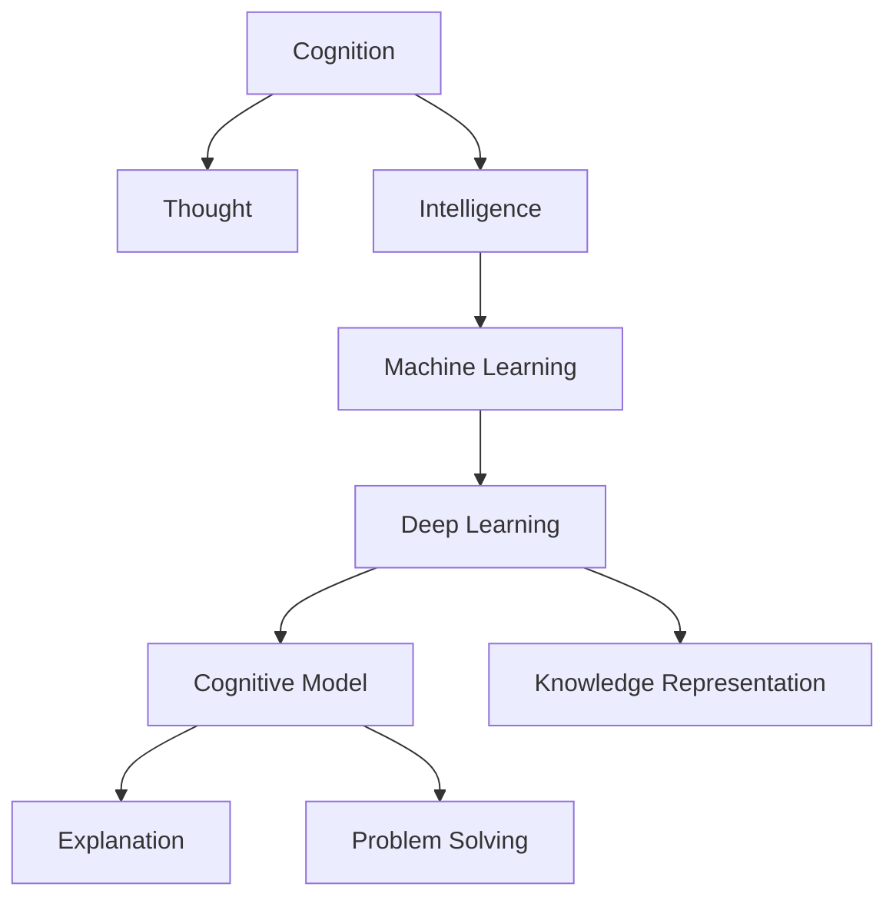

                 

## 1. 背景介绍

### 1.1 问题由来
人工智能(AI)领域近些年来取得了巨大的突破，尤其在认知、思维和智能方向的研究上。越来越多的研究表明，AI不仅能够完成复杂的任务，还能通过学习不断提高自己的能力。这些成就引发了人们对认知形式化这一概念的深入思考：**认知、思维和智能，究竟是如何被形式化表示，如何通过机器学习实现，以及未来的发展方向是什么？**

### 1.2 问题核心关键点
认知形式化涉及以下几个核心问题：

- 如何通过机器学习，特别是深度学习，对人类的认知能力进行形式化建模？
- 如何将学习、解释和解决问题的能力映射到机器的算法和模型中？
- 在实现认知形式化的过程中，如何平衡效率与准确性？
- 如何设计算法和模型，使其能够适应不同的应用场景？
- 认知形式化在实际应用中，面临哪些挑战和机遇？

这些问题不仅是学术研究的焦点，也是行业应用的重要课题。本文将深入探讨认知形式化的核心概念、原理、算法和应用，旨在帮助读者全面理解这一领域的现状和未来趋势。

## 2. 核心概念与联系

### 2.1 核心概念概述

为更好地理解认知形式化，我们首先介绍几个关键概念：

- **认知(Cognition)**：指人类对客观世界的感知、理解和决策过程。认知包括感知、记忆、思维、学习、决策等多个层面。

- **思维(Thought)**：指认知过程中，人类对信息的分析、推理、评估和应用。思维活动涉及逻辑推理、模式识别、抽象化等高级认知功能。

- **智能(Intelligence)**：指认知能力的高级表现，即通过学习、适应和优化，能够解决复杂问题，并不断改进其性能的系统。

- **机器学习(Machine Learning, ML)**：通过数据和算法，使机器从经验中学习，优化性能的过程。深度学习是机器学习的一个重要分支，通过构建多层神经网络，实现对数据的复杂表示和提取。

- **认知模型(Cognitive Model)**：形式化表示人类认知过程的计算模型，通常采用神经网络、逻辑推理、规则系统等方法。

- **知识表示(Knowledge Representation)**：将人类知识映射到计算机可处理的形式，用于推理、决策和问题解决。

- **解释(Explanation)**：指对机器推理和决策过程的解释和说明，帮助人类理解和验证机器的输出。

- **问题解决(Problem Solving)**：指机器对特定问题进行识别、分析、解决的过程，通常涉及搜索、优化、推理等算法。

这些概念之间的逻辑关系可以通过以下Mermaid流程图来展示：



这个流程图展示了认知、思维、智能与机器学习的联系，并指出认知模型、知识表示、解释、问题解决在其中的作用。

## 3. 核心算法原理 & 具体操作步骤

### 3.1 算法原理概述

认知形式化通常采用**深度学习**和**符号计算**相结合的方法，通过构建认知模型，实现对认知过程的形式化表示。深度学习模型能够捕捉数据中的复杂模式，而符号计算则能够提供逻辑推理和解释能力。

形式化的认知模型通常由以下几个部分组成：

1. **感知层(Perception Layer)**：负责对输入数据进行预处理，提取特征。
2. **表示层(Representation Layer)**：将感知层提取的特征映射为抽象的认知表征。
3. **推理层(Inference Layer)**：基于认知表征，进行逻辑推理和问题解决。
4. **解释层(Explanation Layer)**：提供对推理过程的解释和可视化。

这些层之间的数据流动和相互作用，构成了认知形式化的基本框架。

### 3.2 算法步骤详解

认知形式化的算法步骤主要包括：

**Step 1: 数据准备**
- 收集和预处理数据，确保数据的质量和多样性。
- 将数据划分为训练集、验证集和测试集，用于模型的训练、调优和评估。

**Step 2: 模型构建**
- 选择合适的深度学习框架，如TensorFlow、PyTorch等。
- 设计认知模型架构，包括感知层、表示层、推理层和解释层。
- 选择适当的深度学习模型，如卷积神经网络(CNN)、递归神经网络(RNN)、变压器(Transformer)等。

**Step 3: 模型训练**
- 使用训练集对模型进行迭代训练，优化模型参数。
- 应用正则化技术，防止过拟合。
- 定期在验证集上评估模型性能，调整超参数。
- 完成训练后，在测试集上评估模型泛化性能。

**Step 4: 模型部署**
- 将训练好的模型部署到实际应用中。
- 在实际应用场景中，持续收集反馈数据，微调模型。

### 3.3 算法优缺点

认知形式化算法具有以下优点：

- **灵活性高**：深度学习和符号计算的结合，使得认知模型可以适应不同的应用场景。
- **性能强**：深度学习模型的强大表征能力，使得认知模型能够处理复杂的认知任务。
- **解释性强**：符号计算提供逻辑推理和解释能力，使得认知模型的决策过程透明可解释。

然而，认知形式化也存在一些缺点：

- **计算资源需求高**：深度学习模型需要大量的计算资源进行训练和推理，对硬件要求较高。
- **数据需求大**：认知模型需要大量的标注数据进行训练，而获取高质量标注数据成本较高。
- **模型复杂度高**：认知模型通常结构复杂，调试和维护难度较大。

### 3.4 算法应用领域

认知形式化算法在多个领域中得到了广泛应用，包括但不限于：

- **自然语言处理(NLP)**：通过认知模型实现文本理解、情感分析、机器翻译等任务。
- **计算机视觉(CV)**：通过认知模型实现图像识别、物体检测、场景理解等任务。
- **机器人与自动化**：通过认知模型实现自主导航、任务规划、对象操作等任务。
- **医疗诊断**：通过认知模型实现疾病诊断、病理分析、治疗方案推荐等任务。
- **金融风控**：通过认知模型实现信用评估、风险预测、欺诈检测等任务。

## 4. 数学模型和公式 & 详细讲解

### 4.1 数学模型构建

认知形式化通常基于以下数学模型进行构建：

- **感知层(Perception Layer)**：通过卷积神经网络(CNN)或递归神经网络(RNN)，对输入数据进行特征提取。
- **表示层(Representation Layer)**：通过多层次非线性映射，将感知层提取的特征映射为高维的认知表征。
- **推理层(Inference Layer)**：通过逻辑推理网络，实现对认知表征的推理和问题解决。
- **解释层(Explanation Layer)**：通过可解释的人工智能技术，提供对推理过程的解释和可视化。

### 4.2 公式推导过程

以自然语言处理任务为例，认知形式化的数学模型推导如下：

- **感知层**：
  $$
  x_i = CNN/W + b
  $$
  其中，$x_i$表示输入数据的第$i$个特征向量，$W$和$b$为卷积神经网络的权重和偏置。

- **表示层**：
  $$
  z_i = tanh(f(x_i))
  $$
  其中，$z_i$表示第$i$个特征的认知表征，$f$为非线性映射函数。

- **推理层**：
  $$
  y = f(z)
  $$
  其中，$y$表示推理层输出，$z$为表示层输出的认知表征，$f$为逻辑推理函数。

- **解释层**：
  $$
  e = explain(y)
  $$
  其中，$e$表示推理过程的解释，$y$为推理层输出。

### 4.3 案例分析与讲解

以图像分类任务为例，分析认知形式化的实现过程：

- **感知层**：
  $$
  x_i = CNN/W + b
  $$
  对输入图像进行卷积操作，提取特征向量。

- **表示层**：
  $$
  z_i = tanh(f(x_i))
  $$
  通过多层感知器，将特征向量映射为高维的认知表征。

- **推理层**：
  $$
  y = softmax(f(z))
  $$
  使用softmax函数对认知表征进行分类，输出每个类别的概率分布。

- **解释层**：
  $$
  e = top_k(y)
  $$
  提取推理结果中概率最高的类别，并可视化解释推理过程。

## 5. 项目实践：代码实例和详细解释说明

### 5.1 开发环境搭建

在进行认知形式化项目实践前，我们需要准备好开发环境。以下是使用Python进行TensorFlow开发的环境配置流程：

1. 安装Anaconda：从官网下载并安装Anaconda，用于创建独立的Python环境。

2. 创建并激活虚拟环境：
```bash
conda create -n tf-env python=3.8 
conda activate tf-env
```

3. 安装TensorFlow：根据CUDA版本，从官网获取对应的安装命令。例如：
```bash
conda install tensorflow
```

4. 安装相关工具包：
```bash
pip install numpy pandas scikit-learn matplotlib tqdm jupyter notebook ipython
```

完成上述步骤后，即可在`tf-env`环境中开始项目实践。

### 5.2 源代码详细实现

下面我们以图像分类任务为例，给出使用TensorFlow对卷积神经网络进行认知形式化实践的Python代码实现。

首先，定义模型架构和数据预处理函数：

```python
import tensorflow as tf
from tensorflow.keras import layers

def build_model(input_shape, num_classes):
    model = tf.keras.Sequential([
        layers.Conv2D(32, (3, 3), activation='relu', input_shape=input_shape),
        layers.MaxPooling2D((2, 2)),
        layers.Conv2D(64, (3, 3), activation='relu'),
        layers.MaxPooling2D((2, 2)),
        layers.Flatten(),
        layers.Dense(128, activation='relu'),
        layers.Dense(num_classes, activation='softmax')
    ])
    return model

def preprocess_data(data):
    images, labels = data
    images = images / 255.0
    labels = tf.keras.utils.to_categorical(labels)
    return images, labels
```

然后，加载数据集并定义训练和评估函数：

```python
from tensorflow.keras.datasets import cifar10
from tensorflow.keras.utils import to_categorical

(train_images, train_labels), (test_images, test_labels) = cifar10.load_data()

model = build_model(train_images.shape[1:], 10)
model.compile(optimizer='adam', loss='categorical_crossentropy', metrics=['accuracy'])

train_dataset = tf.data.Dataset.from_tensor_slices((train_images, train_labels)).shuffle(10000).batch(128)
test_dataset = tf.data.Dataset.from_tensor_slices((test_images, test_labels)).batch(128)

def train_epoch(model, dataset, batch_size, optimizer):
    dataloader = tf.data.Dataset.from_tensor_slices(dataset).shuffle(buffer_size=10000).batch(batch_size)
    model.trainable = True
    for batch in dataloader:
        images, labels = batch
        with tf.GradientTape() as tape:
            predictions = model(images)
            loss = tf.losses.categorical_crossentropy(labels, predictions)
        gradients = tape.gradient(loss, model.trainable_variables)
        optimizer.apply_gradients(zip(gradients, model.trainable_variables))

def evaluate(model, dataset, batch_size):
    dataloader = tf.data.Dataset.from_tensor_slices(dataset).batch(batch_size)
    model.trainable = False
    with tf.GradientTape() as tape:
        predictions = model(images)
        loss = tf.losses.categorical_crossentropy(labels, predictions)
    return loss.numpy().mean()
```

最后，启动训练流程并在测试集上评估：

```python
epochs = 10
batch_size = 128

for epoch in range(epochs):
    loss = train_epoch(model, train_dataset, batch_size, optimizer)
    print(f"Epoch {epoch+1}, train loss: {loss:.3f}")
    
    print(f"Epoch {epoch+1}, test results:")
    test_loss = evaluate(model, test_dataset, batch_size)
    print(f"Test loss: {test_loss:.3f}")
    
print("Training complete.")
```

以上就是使用TensorFlow对卷积神经网络进行图像分类任务认知形式化实践的完整代码实现。可以看到，通过TensorFlow的Keras API，认知形式化项目的代码实现变得非常简洁高效。

### 5.3 代码解读与分析

让我们再详细解读一下关键代码的实现细节：

**模型构建**：
- 定义了一个包含卷积层、池化层、全连接层的卷积神经网络，用于图像分类。

**数据预处理**：
- 对输入数据进行标准化，即将像素值归一化到[0, 1]之间。
- 使用`tf.keras.utils.to_categorical`函数将标签转换为独热编码格式。

**训练和评估函数**：
- 使用TensorFlow的`tf.data.Dataset`类构建数据集对象，支持数据批处理和随机打乱。
- 在训练过程中，使用`tf.GradientTape`记录梯度，使用优化器更新模型参数。
- 在评估过程中，计算模型损失，返回损失值。

**训练流程**：
- 定义总轮数和批大小，开始循环迭代。
- 每个轮次内，首先在训练集上训练，输出损失值。
- 在测试集上评估模型性能，输出测试损失值。
- 所有轮次结束后，输出训练完成信息。

可以看到，TensorFlow的高级API大大简化了认知形式化项目的实现过程，使得开发者能够将更多精力集中在算法和数据处理上。

## 6. 实际应用场景

### 6.1 智能客服系统

认知形式化技术可以广泛应用于智能客服系统的构建。传统的客服系统依赖大量人工，响应速度慢，服务质量难以保证。而使用认知形式化技术，可以构建具备自然语言理解能力的智能客服系统，能够实时响应客户咨询，提供高效、精准的服务。

在技术实现上，可以收集历史客服对话记录，将问题和最佳答复构建成监督数据，在此基础上对认知模型进行微调。微调后的模型能够自动理解用户意图，匹配最合适的答案模板进行回复。对于客户提出的新问题，还可以接入检索系统实时搜索相关内容，动态组织生成回答。

### 6.2 金融舆情监测

金融舆情监测是认知形式化技术的重要应用场景之一。金融机构需要实时监测市场舆论动向，以便及时应对负面信息传播，规避金融风险。认知形式化技术可以通过自然语言处理和情感分析，自动识别文本中的舆情信息，评估市场情绪，预测市场走势。

具体而言，可以收集金融领域相关的新闻、报道、评论等文本数据，并对其进行主题标注和情感标注。在此基础上对认知模型进行微调，使其能够自动判断文本属于何种主题，情感倾向是正面、中性还是负面。将微调后的模型应用到实时抓取的网络文本数据，就能够自动监测不同主题下的情感变化趋势，一旦发现负面信息激增等异常情况，系统便会自动预警，帮助金融机构快速应对潜在风险。

### 6.3 个性化推荐系统

个性化推荐系统是认知形式化技术的另一个重要应用。现有的推荐系统往往只依赖用户的历史行为数据进行物品推荐，无法深入理解用户的真实兴趣偏好。认知形式化技术通过自然语言处理和情感分析，能够从用户评论、评分等文本数据中，提取用户的兴趣点，提供更加精准、多样的推荐内容。

在具体实现中，可以收集用户浏览、点击、评论、分享等行为数据，提取和用户交互的物品标题、描述、标签等文本内容。将文本内容作为模型输入，用户的后续行为（如是否点击、购买等）作为监督信号，在此基础上微调认知模型。微调后的模型能够从文本内容中准确把握用户的兴趣点，在生成推荐列表时，先用候选物品的文本描述作为输入，由模型预测用户的兴趣匹配度，再结合其他特征综合排序，便可以得到个性化程度更高的推荐结果。

### 6.4 未来应用展望

随着认知形式化技术的发展，未来其在更多领域将得到应用，为各行各业带来变革性影响：

- **医疗领域**：通过认知形式化技术，可以实现病历分析、病理诊断、治疗方案推荐等功能，提升医疗服务的智能化水平，辅助医生诊疗，加速新药开发进程。
- **教育领域**：认知形式化技术可以应用于作业批改、学情分析、知识推荐等方面，因材施教，促进教育公平，提高教学质量。
- **智慧城市**：通过认知形式化技术，可以实现城市事件监测、舆情分析、应急指挥等环节，提高城市管理的自动化和智能化水平，构建更安全、高效的未来城市。

此外，在企业生产、社会治理、文娱传媒等众多领域，认知形式化技术也将不断涌现，为经济社会发展注入新的动力。相信随着技术的日益成熟，认知形式化技术将成为人工智能落地应用的重要范式，推动人工智能技术在垂直行业的规模化落地。

## 7. 工具和资源推荐

### 7.1 学习资源推荐

为了帮助开发者系统掌握认知形式化的理论基础和实践技巧，这里推荐一些优质的学习资源：

1. 《深度学习》课程：由斯坦福大学开设，全面介绍了深度学习的基础概念、算法和应用，是学习认知形式化的必备资源。
2. 《认知心理学》书籍：介绍了认知心理学的基本原理和实验研究方法，有助于理解认知过程的形式化表示。
3. 《认知计算》系列文章：由DeepMind等顶级研究机构发表，探讨了认知计算的基本框架和应用场景，是学习认知形式化的前沿文献。
4. 《认知计算与AI》视频教程：由Coursera等平台提供，涵盖了认知计算与人工智能的结合，介绍了相关技术和应用案例。

通过对这些资源的学习实践，相信你一定能够快速掌握认知形式化的精髓，并用于解决实际的AI问题。

### 7.2 开发工具推荐

高效的开发离不开优秀的工具支持。以下是几款用于认知形式化开发的常用工具：

1. TensorFlow：基于Python的开源深度学习框架，灵活动态的计算图，适合快速迭代研究。
2. PyTorch：基于Python的开源深度学习框架，动态计算图，灵活性高，适合学术研究和工程应用。
3. Jupyter Notebook：基于Python的交互式编程环境，支持代码编写、数据处理和结果展示，是数据科学家的必备工具。
4. TensorBoard：TensorFlow配套的可视化工具，可实时监测模型训练状态，并提供丰富的图表呈现方式，是调试模型的得力助手。
5. Weights & Biases：模型训练的实验跟踪工具，可以记录和可视化模型训练过程中的各项指标，方便对比和调优。

合理利用这些工具，可以显著提升认知形式化任务的开发效率，加快创新迭代的步伐。

### 7.3 相关论文推荐

认知形式化技术的发展源于学界的持续研究。以下是几篇奠基性的相关论文，推荐阅读：

1. DeepMind的《Attention is All You Need》：提出了Transformer结构，开启了NLP领域的预训练大模型时代。
2. Google的《BERT: Pre-training of Deep Bidirectional Transformers for Language Understanding》：提出BERT模型，引入基于掩码的自监督预训练任务，刷新了多项NLP任务SOTA。
3. Facebook的《Language Models are Unsupervised Multitask Learners》：展示了大规模语言模型的强大zero-shot学习能力，引发了对于通用人工智能的新一轮思考。
4. Salesforce的《Evolving Language Understanding as a Self-supervised Learning Problem》：提出ELUO模型，通过自监督学习实现文本表示的进化。
5. OpenAI的《Universal Scholar's Learning》：提出USM模型，通过自监督学习实现多任务学习，提升模型的泛化能力。

这些论文代表了大规模认知形式化的发展脉络。通过学习这些前沿成果，可以帮助研究者把握学科前进方向，激发更多的创新灵感。

## 8. 总结：未来发展趋势与挑战

### 8.1 研究成果总结

认知形式化技术的发展已经取得了显著进展，广泛应用于自然语言处理、计算机视觉、机器人与自动化、医疗诊断等多个领域，推动了人工智能技术在各个行业的应用。未来，随着深度学习、符号计算、逻辑推理等技术的不断进步，认知形式化技术将继续拓展其应用范围，提升系统的性能和智能水平。

### 8.2 未来发展趋势

展望未来，认知形式化技术将呈现以下几个发展趋势：

1. **深度学习与符号计算的融合**：未来深度学习与符号计算的结合将更加紧密，通过符号计算提供逻辑推理和解释能力，增强深度学习模型的可解释性和鲁棒性。
2. **跨模态认知模型**：认知形式化技术将进一步拓展到图像、视频、语音等多模态数据，实现多模态信息的整合和协同建模。
3. **自监督学习的应用**：通过自监督学习，利用未标注数据进行预训练，提升认知模型的泛化能力和数据利用效率。
4. **知识图谱与认知模型的结合**：将知识图谱与认知模型结合，提供更加全面、准确的信息整合能力，增强系统的知识获取和推理能力。
5. **联邦学习和分布式计算**：通过联邦学习和分布式计算，提升认知模型的大规模数据处理能力，实现跨机构、跨平台的数据共享和协同计算。

### 8.3 面临的挑战

尽管认知形式化技术已经取得了瞩目成就，但在迈向更加智能化、普适化应用的过程中，它仍面临着诸多挑战：

1. **数据质量问题**：高质量标注数据的获取成本较高，难以适应长尾应用场景。如何获取更多高质量数据，是未来认知形式化技术面临的重要挑战。
2. **模型复杂性问题**：认知形式化模型的复杂性较高，调试和维护难度较大。如何设计更简单、更易维护的模型架构，是未来技术发展的重要方向。
3. **资源消耗问题**：深度学习模型需要大量的计算资源进行训练和推理，对硬件要求较高。如何优化资源消耗，提高系统性能，是未来技术发展的重要任务。
4. **可解释性问题**：认知形式化模型的决策过程缺乏可解释性，难以理解和验证。如何增强模型的可解释性，是未来技术发展的关键课题。
5. **伦理和安全问题**：认知形式化模型可能学习到有害信息，造成误导性输出。如何确保模型的伦理和安全，是未来技术发展的必要保障。

### 8.4 研究展望

面对认知形式化技术所面临的挑战，未来的研究需要在以下几个方面寻求新的突破：

1. **自监督学习的探索**：摆脱对大规模标注数据的依赖，利用自监督学习技术，提升认知模型的泛化能力和数据利用效率。
2. **多模态认知模型的研究**：探索跨模态认知模型的构建方法，实现图像、视频、语音等不同模态信息的整合和协同建模。
3. **可解释性技术的开发**：开发可解释的认知模型，提供对推理过程的解释和可视化，增强系统的透明度和可信度。
4. **联邦学习和分布式计算**：研究联邦学习和分布式计算技术，提升认知模型的数据处理能力，实现跨机构、跨平台的数据共享和协同计算。
5. **伦理和安全机制的建立**：建立认知模型的伦理和安全机制，确保模型的输出符合人类价值观和伦理道德，避免有害信息传播。

这些研究方向的探索，必将引领认知形式化技术迈向更高的台阶，为构建安全、可靠、可解释、可控的智能系统铺平道路。面向未来，认知形式化技术还需要与其他人工智能技术进行更深入的融合，如知识表示、因果推理、强化学习等，多路径协同发力，共同推动认知智能的进步。只有勇于创新、敢于突破，才能不断拓展认知模型的边界，让智能技术更好地造福人类社会。

## 9. 附录：常见问题与解答

**Q1: 什么是认知形式化？**

A: 认知形式化是指将人类认知过程和智能行为映射到计算机可处理的形式，通过机器学习模型实现认知和智能推理的过程。

**Q2: 认知形式化技术的应用场景有哪些？**

A: 认知形式化技术在自然语言处理、计算机视觉、机器人与自动化、医疗诊断、金融风控等多个领域中得到了广泛应用。

**Q3: 认知形式化技术面临的主要挑战有哪些？**

A: 认知形式化技术面临的主要挑战包括数据质量、模型复杂性、资源消耗、可解释性、伦理安全等。

**Q4: 如何提升认知形式化技术的可解释性？**

A: 提升认知形式化技术的可解释性，可以从以下几个方面入手：
1. 提供推理过程的可视化，帮助用户理解模型的决策逻辑。
2. 使用可解释的模型架构，如规则系统、符号计算等，增强模型的透明度。
3. 开发可解释的模型评估工具，帮助用户验证模型的推理过程和结果。

**Q5: 认知形式化技术未来的发展趋势是什么？**

A: 认知形式化技术未来的发展趋势包括深度学习与符号计算的融合、跨模态认知模型的研究、自监督学习的应用、知识图谱与认知模型的结合、联邦学习和分布式计算等。

---

作者：禅与计算机程序设计艺术 / Zen and the Art of Computer Programming

