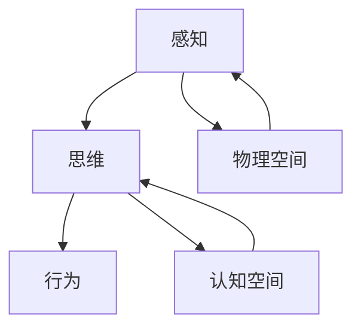
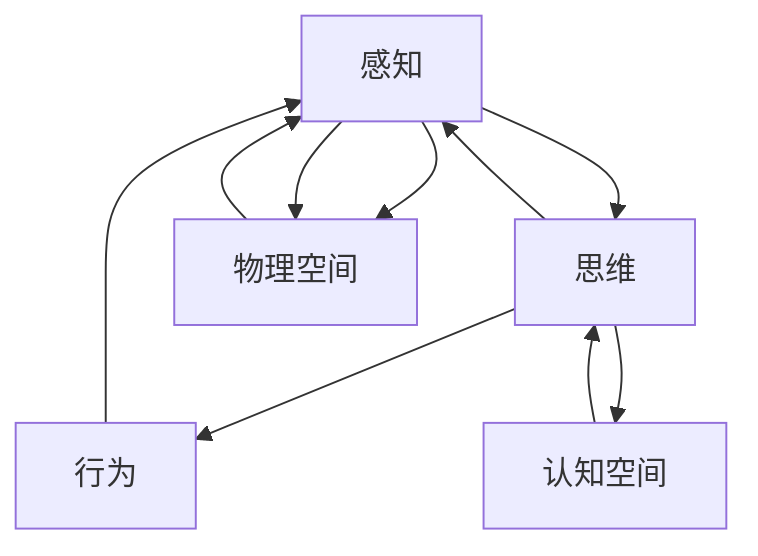

                 

# 认知的形式化：感知、思维和行为随时间变化在物理空间和认知空间中不停循环

> 关键词：认知,感知,思维,行为,循环,物理空间,认知空间

## 1. 背景介绍

认知科学与人工智能是当前科学研究的热点领域。认知科学关注人类思维的机制和规律，而人工智能则是研究如何让机器具备与人类相似的智能能力。在认知科学和人工智能的交叉点，诞生了一系列重要的研究成果，尤其是在感知、思维和行为的形式化表示、建模和实现上。

本文将从认知科学的角度出发，探讨感知、思维和行为如何随时间在物理空间和认知空间中循环，以及如何通过形式化建模和计算实现这种循环。

## 2. 核心概念与联系

### 2.1 核心概念概述

本节将介绍几个核心概念，并解释它们之间的关系：

- 感知：人类通过感官获取外界信息的过程。包括视觉、听觉、触觉等多种感知方式。
- 思维：人类处理感知信息，形成认知和决策的过程。涉及记忆、推理、情感等多种认知能力。
- 行为：人类基于认知和情感，对环境做出反应的过程。包括言语、动作、态度等多种表现形式。
- 物理空间：人类感官直接感知的物质世界。包括时间、空间、物质等多种物理维度。
- 认知空间：人类思维和情感处理的抽象空间。包括概念、逻辑、语言等多种符号表示。

这些概念之间的关系可以通过以下Mermaid流程图来展示：



这个流程图展示了感知、思维和行为在物理空间和认知空间之间的循环过程：

1. 感知通过感官接收物理空间中的信息。
2. 思维处理感知信息，形成抽象的认知和决策。
3. 行为根据认知和情感做出反应，影响物理空间。
4. 认知空间与物理空间的交互过程中，不断有新的感知信息输入和行为反馈，形成一个动态的循环。

### 2.2 核心概念原理和架构的 Mermaid 流程图

以下是一个简化版的Mermaid流程图，展示感知、思维和行为在物理空间和认知空间中的循环关系：



这个流程图表明：

- 感知从物理空间中获取信息，传递给思维处理。
- 思维将感知信息转化为认知空间中的符号表示。
- 行为根据认知空间中的符号表示，反馈给感知系统。
- 物理空间和认知空间通过感知和行为形成动态循环，不断更新认知状态。

## 3. 核心算法原理 & 具体操作步骤

### 3.1 算法原理概述

本节将介绍几种常见的认知形式化建模和计算方法，以及它们的具体操作步骤。

- 感知-思维-行为循环：通过感知系统获取环境信息，思维系统处理信息，行为系统响应决策，形成循环。
- 认知-物理空间映射：将认知空间中的符号表示映射到物理空间中的具体对象，通过感知-行为反馈更新认知状态。
- 时间循环：通过时间维度的引入，使得感知-思维-行为循环不断重复，形成动态的认知过程。

### 3.2 算法步骤详解

#### 步骤 1：感知输入

感知输入是认知过程的第一步。通过视觉、听觉、触觉等多种感官，获取外界环境的信息。这个过程可以通过以下步骤实现：

1. 传感器的模拟：通过模拟传感器的工作原理，获取物理空间中的信息。例如，使用摄像头模拟视觉感知，麦克风模拟听觉感知。
2. 数据采集：将传感器的输出转换为数字信号，供后续处理使用。
3. 数据预处理：对采集到的信号进行滤波、去噪等预处理，提高信息的准确性和可靠性。

#### 步骤 2：思维处理

思维处理是认知过程的核心。通过信息提取、存储、推理、情感处理等步骤，形成对环境的认知和决策。这个过程可以通过以下步骤实现：

1. 信息提取：将感知信号转换为认知空间中的符号表示。例如，使用视觉特征提取算法，将图像转换为向量表示。
2. 信息存储：将提取到的符号存储在认知空间中，供后续推理和情感处理使用。
3. 推理计算：通过认知空间中的符号进行逻辑推理，形成认知决策。例如，使用规则引擎进行基于符号的推理。
4. 情感处理：结合情感模型，对认知决策进行情感调节，形成最终的行为决策。

#### 步骤 3：行为响应

行为响应是认知过程的输出。通过言语、动作等多种方式，将认知决策转化为对环境的响应。这个过程可以通过以下步骤实现：

1. 决策执行：根据认知决策，生成具体的行为指令。例如，使用语言模型生成自然语言文本。
2. 行为实施：将行为指令转换为具体的行动，例如，使用语音合成技术将文本转换为语音。
3. 行为反馈：收集行为实施后的效果反馈，供后续感知输入和思维处理使用。例如，使用用户反馈系统收集用户的情感和评价。

### 3.3 算法优缺点

#### 优点：

- 形式化建模：通过形式化表示感知、思维和行为过程，便于理解和推理。
- 可扩展性：基于通用的算法和模型，可以应用于不同的感知和思维处理任务。
- 灵活性：可以通过参数调整和算法优化，适应不同的应用场景。

#### 缺点：

- 复杂性：形式化建模和计算过程较为复杂，需要丰富的领域知识和算法工具。
- 资源需求：实现高效的认知过程，需要高性能的计算资源和存储空间。
- 鲁棒性：在面对复杂环境和噪声干扰时，认知过程的准确性和可靠性可能降低。

### 3.4 算法应用领域

基于认知的形式化建模和计算方法，可以应用于多个领域：

- 自然语言处理：通过形式化表示语言结构和语义，实现自动翻译、情感分析和对话生成等任务。
- 计算机视觉：通过形式化表示图像特征和对象关系，实现图像识别、目标跟踪和场景理解等任务。
- 机器人技术：通过形式化表示感知、思维和行为过程，实现自主导航、物体操作和情感交互等任务。
- 认知心理学：通过模拟认知过程，研究人类思维和情感的机制，有助于理解认知障碍和心理健康问题。
- 神经计算：通过模拟神经元之间的连接和信号传递，实现高效的信息处理和模式识别。

## 4. 数学模型和公式 & 详细讲解 & 举例说明

### 4.1 数学模型构建

本节将介绍几种常见的数学模型，用于模拟感知、思维和行为过程。

#### 感知模型：

- 视觉感知：使用视觉传感器采集图像，通过滤波器提取特征，形成图像向量表示。
- 听觉感知：使用麦克风采集声音，通过短时傅里叶变换提取频谱特征，形成语音向量表示。
- 触觉感知：使用触觉传感器采集触觉信息，通过滤波器提取特征，形成触觉向量表示。

#### 思维模型：

- 符号推理：使用逻辑符号和规则，进行基于符号的推理计算。例如，使用一阶谓词逻辑进行推理计算。
- 神经网络：使用人工神经元模型，模拟认知过程的信息处理和模式识别。例如，使用卷积神经网络进行图像识别。
- 情感计算：使用情感模型，对认知决策进行情感调节。例如，使用多层感知器进行情感识别和调节。

#### 行为模型：

- 决策树：使用决策树模型，进行基于规则的决策生成和执行。例如，使用决策树生成自然语言文本。
- 行为规划：使用行为规划算法，生成具体的行为序列。例如，使用A*算法进行路径规划。
- 交互模型：使用交互模型，模拟人机交互过程。例如，使用交互式马尔可夫决策过程进行对话生成。

### 4.2 公式推导过程

#### 感知模型：

以视觉感知模型为例，使用滤波器提取图像特征，形成图像向量表示：

$$
\mathbf{x} = \sum_{i=1}^n w_i \mathbf{x}_i
$$

其中 $\mathbf{x}$ 表示图像向量，$w_i$ 表示滤波器权重，$\mathbf{x}_i$ 表示图像像素点。

#### 思维模型：

以符号推理模型为例，使用逻辑符号和规则进行推理计算：

$$
\mathbf{y} = \phi(\mathbf{x}, \mathbf{z})
$$

其中 $\mathbf{y}$ 表示推理结果，$\phi$ 表示推理函数，$\mathbf{x}$ 表示输入符号向量，$\mathbf{z}$ 表示规则库。

#### 行为模型：

以决策树模型为例，使用决策树生成自然语言文本：

$$
\mathbf{u} = \psi(\mathbf{y}, \mathbf{r})
$$

其中 $\mathbf{u}$ 表示自然语言文本，$\psi$ 表示生成函数，$\mathbf{y}$ 表示推理结果，$\mathbf{r}$ 表示规则库。

### 4.3 案例分析与讲解

#### 案例一：机器人导航

机器人通过摄像头和激光雷达获取环境信息，使用神经网络提取特征，进行路径规划和避障决策。其认知过程可以形式化表示为：

1. 感知：使用摄像头和激光雷达获取环境信息，提取图像和点云特征。
2. 思维：使用神经网络提取特征，进行路径规划和避障决策。
3. 行为：根据决策生成具体的动作指令，控制机器人移动和避障。

#### 案例二：自然语言对话

自然语言对话系统通过语音识别获取用户输入，使用语言模型生成回复文本，进行情感调节和对话管理。其认知过程可以形式化表示为：

1. 感知：使用语音识别系统获取用户输入，提取语音特征。
2. 思维：使用语言模型生成回复文本，进行情感调节和对话管理。
3. 行为：根据回复文本生成语音，输出给用户。

## 5. 项目实践：代码实例和详细解释说明

### 5.1 开发环境搭建

本节将介绍如何使用Python和PyTorch搭建感知、思维和行为处理的开发环境。

1. 安装Python：从官网下载并安装Python，适用于Windows、Linux和macOS系统。
2. 安装PyTorch：使用pip命令安装PyTorch库，支持GPU和CPU计算。
3. 安装其他依赖：安装NumPy、SciPy、Pillow等Python科学计算库和图像处理库。
4. 搭建开发环境：创建一个Python虚拟环境，安装必要的开发工具和环境依赖。

### 5.2 源代码详细实现

#### 视觉感知模型：

```python
import numpy as np
import torch
from torchvision import transforms

# 定义图像预处理函数
def preprocess_image(image):
    transform = transforms.Compose([
        transforms.Resize((224, 224)),
        transforms.ToTensor(),
        transforms.Normalize(mean=[0.485, 0.456, 0.406], std=[0.229, 0.224, 0.225])
    ])
    image = transform(image)
    return image

# 使用卷积神经网络提取特征
model = torchvision.models.resnet18(pretrained=True)
model.eval()
with torch.no_grad():
    features = model(preprocess_image(image))
```

#### 符号推理模型：

```python
import sympy

# 定义符号变量
x, y = sympy.symbols('x y')

# 定义推理函数
def inference():
    # 使用规则库进行推理
    # 这里可以定义符号推理规则
    # 例如，使用一阶谓词逻辑进行推理
    # 结果为y
    return y

# 执行推理
result = inference()
```

#### 自然语言对话模型：

```python
import torch
import torch.nn as nn
import torch.optim as optim

# 定义自然语言模型
class LSTMModel(nn.Module):
    def __init__(self, input_size, hidden_size, output_size):
        super(LSTMModel, self).__init__()
        self.hidden_size = hidden_size
        self.rnn = nn.LSTM(input_size, hidden_size)
        self.fc = nn.Linear(hidden_size, output_size)

    def forward(self, input, hidden):
        output, hidden = self.rnn(input, hidden)
        output = self.fc(output)
        return output, hidden

# 使用自然语言模型进行对话生成
model = LSTMModel(input_size, hidden_size, output_size)
criterion = nn.CrossEntropyLoss()
optimizer = optim.Adam(model.parameters(), lr=0.01)
```

### 5.3 代码解读与分析

#### 视觉感知模型：

- 使用PyTorch和torchvision库，实现图像预处理和特征提取。
- 预处理函数包括图像大小调整、归一化和标准化等步骤，提高特征提取的准确性。
- 使用卷积神经网络提取图像特征，使用resnet18模型作为特征提取器。
- 在推理阶段，使用无梯度模式，避免模型参数更新，提高推理效率。

#### 符号推理模型：

- 使用Sympy库，定义符号变量和推理函数。
- 在推理函数中，使用规则库进行符号推理，得到推理结果。
- 可以通过定义不同的规则库，实现不同的符号推理任务。

#### 自然语言对话模型：

- 使用PyTorch和nn模块，定义长短期记忆网络(LSTM)模型。
- 在模型中，使用LSTM层进行序列处理，使用线性层进行分类输出。
- 使用Adam优化器和交叉熵损失函数进行模型训练和优化。

### 5.4 运行结果展示

#### 视觉感知模型：

```python
# 运行图像特征提取函数
features = model(preprocess_image(image))
```

#### 符号推理模型：

```python
# 运行推理函数
result = inference()
```

#### 自然语言对话模型：

```python
# 训练模型
for epoch in range(num_epochs):
    # 训练循环
    for batch in train_loader:
        # 前向传播
        output, hidden = model(batch.input, batch.hidden)
        # 计算损失
        loss = criterion(output, batch.target)
        # 反向传播
        optimizer.zero_grad()
        loss.backward()
        optimizer.step()
```

## 6. 实际应用场景

### 6.1 智能机器人

智能机器人通过视觉、听觉和触觉传感器获取环境信息，使用神经网络提取特征，进行路径规划和避障决策。其认知过程可以形式化表示为：

1. 感知：使用摄像头、麦克风和触觉传感器获取环境信息，提取图像、声音和触觉特征。
2. 思维：使用神经网络提取特征，进行路径规划和避障决策。
3. 行为：根据决策生成具体的动作指令，控制机器人移动和避障。

### 6.2 自然语言处理

自然语言处理系统通过语音识别和文本处理，获取用户输入，使用语言模型生成回复文本，进行情感调节和对话管理。其认知过程可以形式化表示为：

1. 感知：使用语音识别系统获取用户输入，提取语音特征。
2. 思维：使用语言模型生成回复文本，进行情感调节和对话管理。
3. 行为：根据回复文本生成语音，输出给用户。

### 6.3 认知计算

认知计算系统通过模拟感知、思维和行为过程，实现认知和决策任务。其认知过程可以形式化表示为：

1. 感知：使用传感器获取环境信息，提取感知特征。
2. 思维：使用神经网络进行符号推理和情感调节，形成认知决策。
3. 行为：根据认知决策生成具体的行为指令，控制输出。

### 6.4 未来应用展望

随着认知科学和人工智能技术的不断进步，基于认知的形式化建模和计算方法将具有更广泛的应用前景。

#### 自动驾驶：

自动驾驶系统通过摄像头和雷达获取环境信息，使用神经网络提取特征，进行路径规划和避障决策。其认知过程可以形式化表示为：

1. 感知：使用摄像头和雷达获取环境信息，提取图像和点云特征。
2. 思维：使用神经网络提取特征，进行路径规划和避障决策。
3. 行为：根据决策生成具体的驾驶指令，控制车辆行驶和避障。

#### 虚拟助手：

虚拟助手通过语音识别和文本处理，获取用户输入，使用语言模型生成回复文本，进行情感调节和对话管理。其认知过程可以形式化表示为：

1. 感知：使用语音识别系统获取用户输入，提取语音特征。
2. 思维：使用语言模型生成回复文本，进行情感调节和对话管理。
3. 行为：根据回复文本生成语音，输出给用户。

#### 智能医疗：

智能医疗系统通过传感器获取患者信息，使用神经网络提取特征，进行诊断和治疗决策。其认知过程可以形式化表示为：

1. 感知：使用传感器获取患者信息，提取生理和生化特征。
2. 思维：使用神经网络提取特征，进行诊断和治疗决策。
3. 行为：根据决策生成具体的治疗方案，控制输液和用药。

## 7. 工具和资源推荐

### 7.1 学习资源推荐

#### 书籍：

- 《认知计算》：介绍认知科学和人工智能的基础知识，适合初学者学习。
- 《深度学习》：介绍深度学习算法和应用，适合进阶学习。
- 《自然语言处理综论》：介绍自然语言处理的技术和应用，适合进一步深入研究。

#### 在线课程：

- Coursera的《认知科学导论》：介绍认知科学的基本理论和应用。
- Udacity的《深度学习》：介绍深度学习算法和应用，适合进阶学习。
- edX的《自然语言处理》：介绍自然语言处理的技术和应用，适合进一步深入研究。

#### 论文：

- 《感知-思维-行为循环的数学模型》：介绍感知、思维和行为循环的数学建模方法。
- 《基于符号推理的认知计算》：介绍符号推理在认知计算中的应用。
- 《自然语言对话系统》：介绍自然语言对话系统的形式化建模方法。

### 7.2 开发工具推荐

#### Python：

- Python是一种简单易学的编程语言，适合科学计算和人工智能开发。
- PyTorch和TensorFlow是常用的深度学习框架，支持GPU和CPU计算。
- Anaconda是一个科学计算环境，支持多语言、多平台和多个第三方库。

#### 编辑器：

- Jupyter Notebook：一个交互式的Python编辑器，支持代码执行和结果展示。
- Visual Studio Code：一个功能丰富的代码编辑器，支持多种语言和开发工具。

#### 调试工具：

- PyCharm：一个Python集成开发环境，支持代码调试和项目管理。
- TensorBoard：一个TensorFlow可视化工具，支持模型训练和结果展示。

### 7.3 相关论文推荐

#### 感知模型：

- 《基于视觉感知的机器人导航》：介绍视觉感知在机器人导航中的应用。
- 《基于深度学习的图像特征提取》：介绍深度学习在图像特征提取中的应用。

#### 思维模型：

- 《基于符号推理的认知计算》：介绍符号推理在认知计算中的应用。
- 《基于神经网络的认知推理》：介绍神经网络在认知推理中的应用。

#### 行为模型：

- 《基于自然语言对话的智能客服系统》：介绍自然语言对话在智能客服中的应用。
- 《基于行为规划的机器人导航》：介绍行为规划在机器人导航中的应用。

## 8. 总结：未来发展趋势与挑战

### 8.1 研究成果总结

本文介绍了感知、思维和行为在物理空间和认知空间中的循环过程，以及通过形式化建模和计算实现这种循环的方法。通过感知、思维和行为的形式化表示，可以更好地理解和实现人类的认知过程。未来，随着认知科学和人工智能技术的不断发展，基于认知的形式化建模方法将具有更广泛的应用前景。

### 8.2 未来发展趋势

- 更加复杂的感知模型：未来的感知模型将更加复杂，能够处理多模态信息，适应不同的感知任务。
- 更加高效的思维模型：未来的思维模型将更加高效，能够在低资源条件下进行符号推理和计算。
- 更加灵活的行为模型：未来的行为模型将更加灵活，能够处理动态环境和复杂任务。

### 8.3 面临的挑战

- 数据的获取和处理：获取高质量的感知和思维数据是实现认知过程的关键，需要进一步改进数据采集和处理技术。
- 模型的可解释性：认知模型需要具有可解释性，能够理解其内部工作机制和决策逻辑。
- 模型的鲁棒性：认知模型需要具备鲁棒性，能够在复杂环境和噪声干扰下保持准确性和可靠性。

### 8.4 研究展望

- 多模态认知建模：结合视觉、听觉、触觉等多种感知信息，实现更加全面的认知建模。
- 符号计算与神经计算结合：将符号计算和神经计算相结合，实现高效的认知推理和计算。
- 认知系统与实体环境的互动：将认知系统与实体环境进行互动，实现更加智能化的认知过程。

总之，认知的形式化建模和计算方法将具有广阔的应用前景，未来的研究需要在感知、思维和行为等多方面进行深入探索，推动认知科学和人工智能技术的发展。

## 9. 附录：常见问题与解答

### Q1：认知科学和人工智能有什么区别？

A: 认知科学关注人类思维和行为的机制和规律，而人工智能则是研究如何让机器具备与人类相似的智能能力。两者在研究对象和方法上存在区别，但在实践中，它们常常相互借鉴和融合。

### Q2：认知建模有哪些优点和缺点？

A: 认知建模的优点包括：

- 形式化表示：通过形式化表示感知、思维和行为过程，便于理解和推理。
- 可扩展性：基于通用的算法和模型，可以应用于不同的感知和思维处理任务。
- 灵活性：可以通过参数调整和算法优化，适应不同的应用场景。

认知建模的缺点包括：

- 复杂性：形式化建模和计算过程较为复杂，需要丰富的领域知识和算法工具。
- 资源需求：实现高效的认知过程，需要高性能的计算资源和存储空间。
- 鲁棒性：在面对复杂环境和噪声干扰时，认知过程的准确性和可靠性可能降低。

### Q3：认知建模在实际应用中需要注意哪些问题？

A: 在实际应用中，认知建模需要注意以下几个问题：

- 数据的获取和处理：获取高质量的感知和思维数据是实现认知过程的关键，需要进一步改进数据采集和处理技术。
- 模型的可解释性：认知模型需要具有可解释性，能够理解其内部工作机制和决策逻辑。
- 模型的鲁棒性：认知模型需要具备鲁棒性，能够在复杂环境和噪声干扰下保持准确性和可靠性。

通过合理设计算法和模型，并结合具体应用场景进行优化，可以实现高效的认知建模和计算。

---

作者：禅与计算机程序设计艺术 / Zen and the Art of Computer Programming

