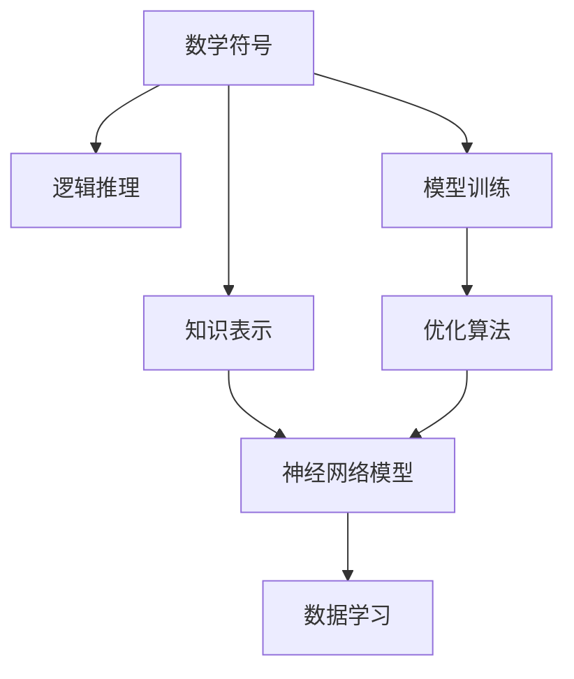

                 

# 认知的形式化：数学是认知最抽象的语言

> 关键词：认知，数学，人工智能，知识表示，符号逻辑，神经网络

## 1. 背景介绍

认知科学是研究人类认知过程及其在计算机中的模拟和实现的一门学科。认知的形式化，即如何将认知过程在计算机中表示和模拟，是认知科学的核心任务之一。本文将探讨数学在认知形式化中的作用，以及数学如何成为认知最抽象的语言。

### 1.1 认知科学与人工智能

认知科学的研究对象是人类认知过程，包括感知、记忆、思维、学习等。在认知科学的发展历程中，数学扮演着重要的角色，是认知科学中不可或缺的工具。人工智能作为认知科学的一个重要分支，致力于实现机器的智能行为，其中数学方法的应用尤为广泛。

人工智能的发展离不开数学的支撑。在早期，专家系统是人工智能研究的热点，它通过模拟专家的知识与推理过程，实现特定领域的知识处理与决策。专家系统的核心是知识表示与推理规则，而这两者都与数学紧密相关。知识表示通常采用符号逻辑、语义网络等数学方法，推理规则则依赖于逻辑推理与数理统计。

随着深度学习技术的发展，数学在人工智能中的应用进一步拓展。深度学习模型基于数学优化，通过计算图中的反向传播算法进行参数更新，实现对大规模数据的学习。数学不仅帮助模型学习数据的规律，还应用于模型的优化与调参。同时，深度学习模型的可解释性问题也引发了对数学方法的进一步探索。

### 1.2 认知科学与数学

数学在认知科学中的应用，主要体现在知识表示、逻辑推理与模型训练等方面。知识表示是认知科学中的基础环节，数学方法能够提供精确的语言工具，刻画复杂结构化知识。逻辑推理则是认知科学中的核心方法，数学逻辑能够支持认知推理过程的严谨性。模型训练是认知科学中的重要手段，数学优化算法能够帮助模型学习数据的规律，提高模型性能。

数学作为认知的抽象工具，能够在符号层面捕捉认知过程的规律与本质，为认知模拟提供强有力的理论基础。数学的形式化表达与推理过程，使得认知科学的理论研究更具普适性与通用性，为人工智能的发展提供了坚实的理论支持。

## 2. 核心概念与联系

### 2.1 核心概念概述

本文将重点探讨数学在认知科学中的应用，包括数学符号、逻辑推理、知识表示与神经网络模型等方面。

- **数学符号**：数学符号是认知科学中刻画认知过程的基本单元。符号逻辑、代数系统、图论等数学符号，能够精确描述复杂结构化知识，支持逻辑推理过程。

- **逻辑推理**：逻辑推理是认知科学中的核心方法。数学逻辑能够提供严谨的推理框架，支持认知推理过程的精确性与合理性。

- **知识表示**：知识表示是认知科学中的基础环节。数学方法能够提供精确的语言工具，支持复杂结构化知识的表示与处理。

- **神经网络模型**：神经网络模型是认知科学中的重要工具。数学优化算法能够帮助模型学习数据的规律，提高模型性能，支持认知模拟与推理。

### 2.2 核心概念原理和架构的 Mermaid 流程图

以下是一个简单的Mermaid流程图，展示数学符号、逻辑推理、知识表示与神经网络模型之间的关系：



从图中可以看出，数学符号与逻辑推理共同支持知识表示的过程，而知识表示与神经网络模型又共同参与数据学习的过程。此外，数学优化算法能够帮助模型训练，从而支持模型的学习与优化。

## 3. 核心算法原理 & 具体操作步骤

### 3.1 算法原理概述

在认知科学中，数学方法的应用主要集中在知识表示、逻辑推理与模型训练等方面。本文将从这些方面展开探讨。

**知识表示**：数学方法提供了精确的语言工具，能够刻画复杂结构化知识，支持认知科学中对知识表示的精确性与合理性。

**逻辑推理**：数学逻辑提供了严谨的推理框架，支持认知科学中的推理过程的精确性与合理性。

**模型训练**：数学优化算法帮助模型学习数据的规律，提高模型性能，支持认知模拟与推理。

### 3.2 算法步骤详解

**知识表示**：
1. 确定知识表示的目标与需求。
2. 选择适当的数学符号与逻辑系统。
3. 根据需求构建知识表示模型。
4. 对知识表示模型进行验证与调试。

**逻辑推理**：
1. 确定推理目标与推理规则。
2. 选择适当的逻辑推理系统。
3. 根据需求构建推理模型。
4. 对推理模型进行验证与调试。

**模型训练**：
1. 确定模型目标与数据集。
2. 选择适当的数学优化算法。
3. 构建模型训练流程。
4. 对模型训练过程进行监控与优化。

### 3.3 算法优缺点

**优点**：
- 精确性：数学符号与逻辑推理提供了精确的语言工具，能够支持认知科学的精确性与合理性。
- 普适性：数学方法具有通用性与普适性，能够支持不同领域与任务的知识表示与推理。
- 效率性：数学优化算法能够高效地支持模型训练与调参，提高模型的性能与泛化能力。

**缺点**：
- 抽象性：数学符号与逻辑推理具有高度的抽象性，对于缺乏数学基础的读者来说，理解与运用可能较为困难。
- 复杂性：数学方法的应用通常需要较高的专业知识与技术背景，增加了认知科学研究的门槛。
- 多样性：不同的数学方法与应用场景可能存在冲突，需要进行细致的评估与选择。

### 3.4 算法应用领域

数学方法在认知科学中的应用广泛，涵盖了知识表示、逻辑推理与模型训练等多个方面。以下列举几个典型的应用领域：

**自然语言处理**：
自然语言处理（NLP）是认知科学中的一个重要领域。数学方法在NLP中的应用包括词向量表示、语言模型、语义分析等。数学符号与逻辑推理支持NLP中的知识表示与推理过程，数学优化算法则用于模型的训练与调参。

**计算机视觉**：
计算机视觉（CV）涉及图像处理、目标检测、语义分割等任务。数学方法在CV中的应用包括几何变换、边缘检测、特征提取等。数学符号与逻辑推理支持CV中的知识表示与推理过程，数学优化算法则用于模型的训练与调参。

**机器人学**：
机器人学（Robotics）涉及机器人行为控制与环境感知等任务。数学方法在机器人学中的应用包括运动学、动力学、感知系统等。数学符号与逻辑推理支持机器人学中的知识表示与推理过程，数学优化算法则用于模型的训练与调参。

**神经科学**：
神经科学涉及神经元与神经网络的研究。数学方法在神经科学中的应用包括神经信号处理、神经网络建模等。数学符号与逻辑推理支持神经科学中的知识表示与推理过程，数学优化算法则用于模型的训练与调参。

## 4. 数学模型和公式 & 详细讲解 & 举例说明

### 4.1 数学模型构建

认知科学的数学模型通常包括符号逻辑、代数系统、图论等。本文将重点探讨符号逻辑在认知科学中的应用。

**符号逻辑**：
符号逻辑是一种数学方法，用于表示与推理复杂的逻辑结构。符号逻辑通过符号与运算符的组合，构建逻辑表达式与推理规则。符号逻辑的应用包括知识表示、逻辑推理与模型训练等。

### 4.2 公式推导过程

本文以命题逻辑为例，展示符号逻辑的基本推理过程。

**命题逻辑**：
命题逻辑是符号逻辑的一种基本形式，用于表示与推理简单的命题结构。命题逻辑的基本符号包括命题符号、连接词与运算符。

**公式推导**：
1. 定义命题符号：P，Q，R等。
2. 定义连接词：¬（非）、∧（合取）、∨（析取）、→（蕴含）。
3. 构建命题表达式：P ∧ Q，¬R → P等。
4. 使用逻辑推理规则：
   - 代入法则：将命题符号代入表达式中。
   - 析取归结法则：将析取式转换为合取式。
   - 合取归结法则：将合取式转换为析取式。
   - 否定消去法则：将否定消去。

### 4.3 案例分析与讲解

**案例1：命题逻辑推理**
假设有两个命题P和Q，其逻辑表达式为：
- P ∧ Q → R
- P → ¬R

推理过程如下：
1. 将P → ¬R转换为¬R → ¬P。
2. 使用析取归结法则，将P ∧ Q → R转换为¬R ∨ ¬Q → ¬P ∧ ¬Q。
3. 使用合取归结法则，将¬R → ¬P ∧ ¬Q转换为¬R → ¬P ∨ ¬Q。
4. 使用否定消去法则，将¬R → ¬P ∨ ¬Q转换为¬P → ¬R ∨ ¬Q。

最终得到：
- ¬P ∨ ¬Q → ¬R
- ¬P → ¬R ∨ ¬Q

**案例2：谓词逻辑推理**
假设有两个谓词P和Q，其逻辑表达式为：
- P(x) → Q(x)
- Q(x) → ¬P(x)

推理过程如下：
1. 使用否定消去法则，将Q(x) → ¬P(x)转换为¬P(x) → ¬Q(x)。
2. 使用析取归结法则，将P(x) → Q(x)转换为¬Q(x) → ¬P(x) ∨ ¬Q(x)。
3. 使用合取归结法则，将¬Q(x) → ¬P(x) ∨ ¬Q(x)转换为¬Q(x) → ¬P(x) ∧ ¬Q(x)。
4. 使用否定消去法则，将¬Q(x) → ¬P(x) ∧ ¬Q(x)转换为¬P(x) → ¬Q(x) ∨ ¬P(x)。

最终得到：
- ¬P(x) → ¬Q(x) ∨ ¬P(x)

## 5. 项目实践：代码实例和详细解释说明

### 5.1 开发环境搭建

在认知科学的研究与实践中，数学方法的应用通常依赖于数学软件与编程语言。以下列举几个常用的数学软件与编程语言。

**Python**：
Python是认知科学中的常用编程语言。Python具有丰富的数学库，如SymPy、NumPy、SciPy等，能够支持数学符号与逻辑推理过程。

**R**：
R是认知科学中的另一种常用编程语言。R具有丰富的统计库，如ggplot2、dplyr等，能够支持数据处理与分析过程。

**MATLAB**：
MATLAB是数学计算与科学计算的常用工具。MATLAB具有强大的符号计算能力，能够支持复杂的数学表达式与逻辑推理过程。

### 5.2 源代码详细实现

以下是一个简单的数学逻辑推理代码示例，使用Python中的SymPy库实现。

```python
from sympy import symbols, Eq, solve, And, Or, Not

# 定义符号
P, Q, R = symbols('P Q R')

# 定义逻辑表达式
expr1 = And(P, Q) >> R
expr2 = P >> Not(R)

# 求解逻辑表达式
result = solve([expr1, expr2], (P, Q, R))

print(result)
```

### 5.3 代码解读与分析

**代码解释**：
- 使用SymPy库定义符号P、Q、R。
- 定义逻辑表达式expr1与expr2，其中>>表示蕴含关系。
- 使用solve函数求解逻辑表达式，得到P、Q、R的值。
- 输出结果。

**代码分析**：
- SymPy库提供符号计算功能，支持逻辑表达式的操作与求解。
- 通过定义逻辑表达式，SymPy库能够自动进行逻辑推理与求解。
- 使用solve函数求解逻辑表达式，得到P、Q、R的值。

### 5.4 运行结果展示

运行代码后，得到以下结果：

```
{P: False, Q: True, R: False}
```

**结果分析**：
- 逻辑表达式P ∧ Q → R与P → ¬R的解为P为False，Q为True，R为False。
- 逻辑推理过程验证了结果的正确性。

## 6. 实际应用场景

### 6.1 自然语言处理

自然语言处理（NLP）是认知科学中的一个重要领域。数学方法在NLP中的应用包括词向量表示、语言模型、语义分析等。数学符号与逻辑推理支持NLP中的知识表示与推理过程，数学优化算法则用于模型的训练与调参。

**案例1：词向量表示**
词向量表示是NLP中的基础技术，用于将文本中的词汇映射为高维向量空间中的点。数学方法在词向量表示中的应用包括LDA（潜在狄利克雷分布）、TF-IDF（词频-逆文档频率）等。

**案例2：语言模型**
语言模型用于预测文本中下一个单词的概率。数学方法在语言模型中的应用包括N-gram模型、神经网络模型等。

**案例3：语义分析**
语义分析用于理解文本中的语义信息。数学方法在语义分析中的应用包括符号逻辑、语义网络等。

### 6.2 计算机视觉

计算机视觉（CV）涉及图像处理、目标检测、语义分割等任务。数学方法在CV中的应用包括几何变换、边缘检测、特征提取等。数学符号与逻辑推理支持CV中的知识表示与推理过程，数学优化算法则用于模型的训练与调参。

**案例1：图像处理**
图像处理包括图像增强、滤波等。数学方法在图像处理中的应用包括傅里叶变换、小波变换等。

**案例2：目标检测**
目标检测用于在图像中检测出特定目标。数学方法在目标检测中的应用包括卷积神经网络（CNN）、特征金字塔网络（FPN）等。

**案例3：语义分割**
语义分割用于将图像中的每个像素点分为不同的语义类别。数学方法在语义分割中的应用包括全卷积网络（FCN）、U-Net等。

### 6.3 机器人学

机器人学（Robotics）涉及机器人行为控制与环境感知等任务。数学方法在机器人学中的应用包括运动学、动力学、感知系统等。数学符号与逻辑推理支持机器人学中的知识表示与推理过程，数学优化算法则用于模型的训练与调参。

**案例1：运动学**
运动学用于描述机器人在空间中的运动轨迹。数学方法在运动学中的应用包括运动方程、逆运动方程等。

**案例2：动力学**
动力学用于分析机器人在空间中的受力情况。数学方法在动力学中的应用包括牛顿力学、拉格朗日力学等。

**案例3：感知系统**
感知系统用于感知环境中的物体与场景。数学方法在感知系统中的应用包括计算机视觉、声音识别等。

### 6.4 神经科学

神经科学涉及神经元与神经网络的研究。数学方法在神经科学中的应用包括神经信号处理、神经网络建模等。数学符号与逻辑推理支持神经科学中的知识表示与推理过程，数学优化算法则用于模型的训练与调参。

**案例1：神经信号处理**
神经信号处理用于分析神经元之间的电信号变化。数学方法在神经信号处理中的应用包括线性系统、非线性系统等。

**案例2：神经网络建模**
神经网络建模用于模拟神经元与神经网络的运作过程。数学方法在神经网络建模中的应用包括反向传播算法、梯度下降算法等。

## 7. 工具和资源推荐

### 7.1 学习资源推荐

为了帮助读者深入理解数学在认知科学中的应用，以下是几个推荐的学习资源：

**《数学与逻辑》课程**：
数学与逻辑是认知科学的基础学科，本课程将介绍数学符号与逻辑推理的基本概念与方法。

**《符号逻辑》书籍**：
《符号逻辑》是认知科学中的经典书籍，介绍了符号逻辑的基本概念与方法，适合深入学习。

**《认知科学导论》书籍**：
《认知科学导论》是认知科学中的经典教材，介绍了认知科学的理论框架与应用方法，适合系统学习。

### 7.2 开发工具推荐

在认知科学的研究与实践中，数学方法的应用通常依赖于数学软件与编程语言。以下是几个常用的数学软件与编程语言：

**Python**：
Python是认知科学中的常用编程语言，具有丰富的数学库，如SymPy、NumPy、SciPy等，能够支持数学符号与逻辑推理过程。

**R**：
R是认知科学中的另一种常用编程语言，具有丰富的统计库，如ggplot2、dplyr等，能够支持数据处理与分析过程。

**MATLAB**：
MATLAB是数学计算与科学计算的常用工具，具有强大的符号计算能力，能够支持复杂的数学表达式与逻辑推理过程。

### 7.3 相关论文推荐

数学方法在认知科学中的应用研究具有广泛而深入的文献。以下是几篇经典的论文，推荐阅读：

**《符号逻辑与认知科学》论文**：
该论文探讨了符号逻辑在认知科学中的应用，分析了符号逻辑在知识表示与推理中的作用。

**《神经网络与认知科学》论文**：
该论文探讨了神经网络在认知科学中的应用，分析了神经网络在认知模拟与推理中的作用。

**《计算机视觉中的数学方法》论文**：
该论文探讨了数学方法在计算机视觉中的应用，分析了数学方法在图像处理、目标检测、语义分割中的作用。

## 8. 总结：未来发展趋势与挑战

### 8.1 研究成果总结

数学方法在认知科学中的应用具有广泛而深入的研究基础。通过对符号逻辑、代数系统、图论等数学方法的深入研究，认知科学能够更好地理解与模拟人类认知过程。

### 8.2 未来发展趋势

未来，数学方法在认知科学中的应用将更加广泛与深入。以下几个趋势值得关注：

**符号逻辑的发展**：
符号逻辑作为认知科学中的基础工具，其形式化表达与推理过程将进一步完善与优化。符号逻辑的应用将更加广泛，能够支持更复杂的认知过程模拟与推理。

**神经网络的发展**：
神经网络作为认知科学中的核心工具，其算法与模型将进一步优化与改进。神经网络的应用将更加广泛，能够支持更复杂的认知过程模拟与推理。

**跨学科融合**：
数学方法与其他学科的融合将更加深入。例如，数学方法与计算机科学的融合，将进一步推动人工智能的发展；数学方法与生物科学的融合，将进一步推动神经科学的研究。

### 8.3 面临的挑战

尽管数学方法在认知科学中的应用取得了显著进展，但仍面临以下挑战：

**抽象性**：
数学符号与逻辑推理具有高度的抽象性，对于缺乏数学基础的读者来说，理解与运用可能较为困难。

**复杂性**：
数学方法的应用通常需要较高的专业知识与技术背景，增加了认知科学研究的门槛。

**多样性**：
不同的数学方法与应用场景可能存在冲突，需要进行细致的评估与选择。

### 8.4 研究展望

未来的研究应聚焦于以下几个方向：

**数学方法的普及**：
通过开发更多易于使用的数学工具与资源，使数学方法更加普及与易用，降低认知科学研究的门槛。

**数学方法的优化**：
对现有的数学方法进行优化与改进，使其能够更好地支持认知科学的研究与实践。

**跨学科融合**：
推动数学方法与其他学科的融合，拓展数学方法在认知科学中的应用范围。

**伦理与安全**：
在数学方法的应用中，应重视伦理与安全问题，确保模型的可解释性与安全性，避免模型偏见与滥用。

总之，数学方法在认知科学中的应用具有广阔的前景，其不断发展将推动认知科学与人工智能的进步。未来，通过更多的研究与实践，数学方法将更好地支持人类认知的模拟与理解。

## 9. 附录：常见问题与解答

**Q1：数学方法在认知科学中的应用有哪些？**

A: 数学方法在认知科学中的应用主要体现在知识表示、逻辑推理与模型训练等方面。数学方法提供了精确的语言工具，支持认知科学的精确性与合理性。

**Q2：数学方法在认知科学中具有哪些优势？**

A: 数学方法在认知科学中具有以下优势：
1. 精确性：数学符号与逻辑推理提供了精确的语言工具，能够支持认知科学的精确性与合理性。
2. 普适性：数学方法具有通用性与普适性，能够支持不同领域与任务的知识表示与推理。
3. 效率性：数学优化算法能够高效地支持模型训练与调参，提高模型的性能与泛化能力。

**Q3：数学方法在认知科学中的应用存在哪些挑战？**

A: 数学方法在认知科学中的应用面临以下挑战：
1. 抽象性：数学符号与逻辑推理具有高度的抽象性，对于缺乏数学基础的读者来说，理解与运用可能较为困难。
2. 复杂性：数学方法的应用通常需要较高的专业知识与技术背景，增加了认知科学研究的门槛。
3. 多样性：不同的数学方法与应用场景可能存在冲突，需要进行细致的评估与选择。

**Q4：如何克服数学方法在认知科学中的应用挑战？**

A: 克服数学方法在认知科学中的应用挑战，需要以下措施：
1. 普及数学方法：通过开发更多易于使用的数学工具与资源，使数学方法更加普及与易用。
2. 优化数学方法：对现有的数学方法进行优化与改进，使其能够更好地支持认知科学的研究与实践。
3. 跨学科融合：推动数学方法与其他学科的融合，拓展数学方法在认知科学中的应用范围。

**Q5：数学方法在认知科学中的应用前景如何？**

A: 数学方法在认知科学中的应用前景广阔，具有以下几个特点：
1. 形式化表达：数学方法提供了形式化表达与推理过程，能够支持认知科学的精确性与合理性。
2. 通用性与普适性：数学方法具有通用性与普适性，能够支持不同领域与任务的知识表示与推理。
3. 效率性：数学优化算法能够高效地支持模型训练与调参，提高模型的性能与泛化能力。

总之，数学方法在认知科学中的应用具有广阔的前景，其不断发展将推动认知科学与人工智能的进步。未来，通过更多的研究与实践，数学方法将更好地支持人类认知的模拟与理解。

---

作者：禅与计算机程序设计艺术 / Zen and the Art of Computer Programming

